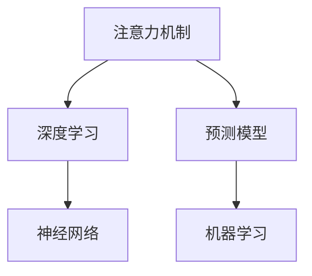

                 

# 深度学习在注意力预测中的应用

> 关键词：注意力机制,深度学习,预测模型,神经网络,机器学习

## 1. 背景介绍

在深度学习和人工智能领域，注意力（Attention）机制已经成为了一个极其重要的概念，广泛应用于序列建模、图像处理、自然语言处理等多个任务中。注意力机制通过动态地分配权重，使模型能够关注输入序列中最重要的部分，极大地提升了模型的预测能力和泛化能力。

本博客将深入探讨注意力机制在深度学习中的工作原理，并通过具体的案例和代码实例，展现注意力机制在各种预测任务中的应用。

## 2. 核心概念与联系

### 2.1 核心概念概述

为更好地理解注意力预测模型，本节将介绍几个关键概念：

- 注意力机制（Attention Mechanism）：一种在神经网络中广泛应用的机制，通过动态分配权重，使模型能够关注输入序列中最重要的部分。
- 深度学习（Deep Learning）：一种基于多层神经网络的机器学习方法，能够自动学习数据的高级特征表示。
- 预测模型（Prediction Model）：利用机器学习技术，对输入数据进行建模和预测的模型。
- 神经网络（Neural Network）：一种模拟人脑神经元连接的计算模型，通过多层非线性变换进行数据建模。
- 机器学习（Machine Learning）：一种利用数据和算法使计算机能够自动改进和优化性能的技术。

这些概念之间相互关联，共同构成了深度学习预测模型的基础架构。

### 2.2 核心概念原理和架构的 Mermaid 流程图



这个流程图展示了注意力机制、深度学习、预测模型、神经网络、机器学习之间的联系：

1. 注意力机制作为深度学习中的一个重要组成部分，被广泛应用于各种预测模型中。
2. 深度学习通过多层神经网络构建预测模型，能够自动学习数据的高级特征表示。
3. 神经网络通过多层非线性变换，对输入数据进行建模和预测。
4. 机器学习利用深度学习构建的预测模型，对输入数据进行建模和预测。

## 3. 核心算法原理 & 具体操作步骤

### 3.1 算法原理概述

注意力预测模型的工作原理可以概括为以下几步：

1. 输入序列编码：将输入序列映射到高维向量空间，形成向量表示。
2. 计算注意力权重：根据输入序列中每个元素的重要性，计算出对应的注意力权重。
3. 加权求和：将输入序列中每个元素乘以其对应的权重，进行加权求和，得到最终的向量表示。
4. 输出预测：将最终的向量表示输入到全连接层或分类器中，进行预测。

### 3.2 算法步骤详解

下面以自然语言处理（NLP）中的机器翻译为例，详细讲解注意力预测模型的构建和训练过程。

**Step 1: 数据准备**
- 收集包含源语言和目标语言的双语语料。
- 将语料分为训练集、验证集和测试集。
- 对语料进行预处理，包括分词、去除停用词、构建词汇表等。

**Step 2: 模型构建**
- 构建编码器（Encoder）和解码器（Decoder）。
- 在编码器中，使用Transformer层进行序列编码。
- 在解码器中，使用注意力机制计算权重，进行加权求和，形成向量表示。
- 输出预测时，使用全连接层或分类器进行预测。

**Step 3: 模型训练**
- 使用训练集进行模型训练。
- 在每个epoch中，前向传播计算损失函数，反向传播更新模型参数。
- 在验证集上评估模型性能，使用Early Stopping等策略避免过拟合。
- 在测试集上测试模型性能，评估模型泛化能力。

### 3.3 算法优缺点

注意力预测模型具有以下优点：

1. 能够动态地关注输入序列中最重要的部分，提升模型的预测能力。
2. 可以通过调整注意力权重，灵活地处理不同类型的数据。
3. 模型具有较高的泛化能力，能够适应不同的输入序列。

同时，该模型也存在一些缺点：

1. 计算复杂度高，模型训练和推理速度较慢。
2. 需要较大的计算资源，对硬件要求较高。
3. 模型结构复杂，难以解释模型内部的决策过程。

### 3.4 算法应用领域

注意力预测模型已经在多个领域得到了广泛应用，包括：

- 机器翻译：通过动态分配权重，提高翻译质量和效率。
- 图像识别：在卷积神经网络中，通过注意力机制识别图像中重要的特征点。
- 语音识别：在循环神经网络中，通过注意力机制识别语音中的关键片段。
- 文本摘要：通过注意力机制提取文本中的重要信息，生成简洁的摘要。
- 推荐系统：通过注意力机制，根据用户历史行为和兴趣，推荐相关物品。

这些领域展示了注意力预测模型的强大能力和广泛应用，未来在更多的场景中，注意力机制将发挥越来越重要的作用。

## 4. 数学模型和公式 & 详细讲解 & 举例说明

### 4.1 数学模型构建

假设输入序列为 $\{ x_1, x_2, \ldots, x_n \}$，目标为预测序列 $\{ y_1, y_2, \ldots, y_n \}$，其中 $x_i$ 和 $y_i$ 为向量表示。模型的输入为 $X$，输出为 $Y$。

注意力预测模型包括一个编码器和一个解码器。编码器将输入序列 $X$ 转换为高维向量表示 $H$，解码器通过注意力机制计算权重 $W$，对 $H$ 进行加权求和，输出预测结果 $Y$。

数学模型可以表示为：

$$
H = \mathrm{Encoder}(X)
$$

$$
W = \mathrm{Attention}(H)
$$

$$
Y = \mathrm{Decoder}(W)
$$

其中，$\mathrm{Encoder}$ 和 $\mathrm{Decoder}$ 为神经网络层，$\mathrm{Attention}$ 为注意力机制。

### 4.2 公式推导过程

以机器翻译为例，详细推导注意力机制的计算过程。

**Step 1: 输入序列编码**
将输入序列 $X$ 编码成高维向量表示 $H$，假设 $\mathrm{Encoder}$ 为多层Transformer层。

**Step 2: 计算注意力权重**
注意力机制计算每个输入序列中的每个位置 $i$ 和目标位置 $j$ 之间的权重 $a_{ij}$，公式如下：

$$
a_{ij} = \frac{\exp(e_{ij})}{\sum_{k=1}^{n}\exp(e_{ik})}
$$

其中 $e_{ij}$ 为注意力函数，可以表示为：

$$
e_{ij} = \mathrm{softmax}(W_{i}\cdot H_{j})
$$

**Step 3: 加权求和**
将每个输入位置 $i$ 和目标位置 $j$ 的权重 $a_{ij}$ 进行加权求和，得到向量表示 $W$。

$$
W = \sum_{i=1}^{n}a_{ij}H_{i}
$$

**Step 4: 输出预测**
将向量表示 $W$ 输入到全连接层或分类器中，得到预测结果 $Y$。

### 4.3 案例分析与讲解

以图像分类为例，展示注意力预测模型的应用。

假设输入图像为 $I$，输出标签为 $y$。

**Step 1: 输入序列编码**
将图像 $I$ 编码成高维向量表示 $H$，假设 $\mathrm{Encoder}$ 为卷积神经网络。

**Step 2: 计算注意力权重**
注意力机制计算每个输入位置 $i$ 和目标位置 $j$ 之间的权重 $a_{ij}$，公式如下：

$$
a_{ij} = \frac{\exp(e_{ij})}{\sum_{k=1}^{n}\exp(e_{ik})}
$$

其中 $e_{ij}$ 为注意力函数，可以表示为：

$$
e_{ij} = \mathrm{softmax}(W_{i}\cdot H_{j})
$$

**Step 3: 加权求和**
将每个输入位置 $i$ 和目标位置 $j$ 的权重 $a_{ij}$ 进行加权求和，得到向量表示 $W$。

$$
W = \sum_{i=1}^{n}a_{ij}H_{i}
$$

**Step 4: 输出预测**
将向量表示 $W$ 输入到全连接层或分类器中，得到预测结果 $y$。

## 5. 项目实践：代码实例和详细解释说明

### 5.1 开发环境搭建

在进行注意力预测模型实践前，我们需要准备好开发环境。以下是使用Python进行TensorFlow和Keras开发的环境配置流程：

1. 安装Anaconda：从官网下载并安装Anaconda，用于创建独立的Python环境。

2. 创建并激活虚拟环境：
```bash
conda create -n attention-env python=3.8 
conda activate attention-env
```

3. 安装TensorFlow：根据CUDA版本，从官网获取对应的安装命令。例如：
```bash
conda install tensorflow=2.7 -c tensorflow
```

4. 安装Keras：
```bash
conda install keras=2.4.3
```

5. 安装各类工具包：
```bash
pip install numpy pandas scikit-learn matplotlib tqdm jupyter notebook ipython
```

完成上述步骤后，即可在`attention-env`环境中开始注意力预测模型的开发。

### 5.2 源代码详细实现

这里我们以机器翻译为例，给出使用TensorFlow和Keras进行注意力预测模型的代码实现。

首先，定义模型架构：

```python
import tensorflow as tf
from tensorflow.keras import layers, models

# 定义Transformer编码器层
class TransformerEncoderLayer(tf.keras.layers.Layer):
    def __init__(self, d_model, num_heads, dff, rate=0.1, **kwargs):
        super(TransformerEncoderLayer, self).__init__(**kwargs)
        self.encoder_layer_norm1 = layers.LayerNormalization(epsilon=1e-6)
        self.encoder_ffn = TransformerFFN(d_model, dff)
        self.encoder_attn = MultiHeadAttention(d_model, num_heads)
        self.encoder_dropout = layers.Dropout(rate)
    
    def call(self, inputs, training=False):
        attn_output = self.encoder_attn(inputs, inputs, inputs, training=training)
        attn_output = self.encoder_dropout(attn_output, training=training)
        attn_output = self.encoder_layer_norm1(inputs + attn_output)
        ffn_output = self.encoder_ffn(attn_output, training=training)
        ffn_output = self.encoder_dropout(ffn_output, training=training)
        ffn_output = self.encoder_layer_norm1(attn_output + ffn_output)
        return ffn_output

# 定义Transformer编码器
class TransformerEncoder(tf.keras.layers.Layer):
    def __init__(self, num_layers, d_model, num_heads, dff, input_vocab_size, target_vocab_size, pe_input, pe_target, rate=0.1, **kwargs):
        super(TransformerEncoder, self).__init__(**kwargs)
        self.layers = [TransformerEncoderLayer(d_model, num_heads, dff, rate) for _ in range(num_layers)]
        self.pos_encoding_input = positional_encoding(input_vocab_size, pe_input)
        self.pos_encoding_target = positional_encoding(target_vocab_size, pe_target)
    
    def call(self, inputs, target, training=False):
        seq_len = tf.shape(inputs)[1]
        target = tf.pad(target, [[0, seq_len]], 'constant')
        outputs = [inputs]
        for layer in self.layers:
            attn_output = layer(inputs, target, training=training)
            outputs.append(attn_output)
        return outputs[-1]
```

接着，定义模型训练函数：

```python
import tensorflow as tf
from tensorflow.keras import layers, models

def train_model(model, inputs, targets, epochs, batch_size, rate):
    model.compile(optimizer=tf.keras.optimizers.Adam(learning_rate=rate),
                  loss=tf.keras.losses.sparse_categorical_crossentropy,
                  metrics=['accuracy'])
    model.fit(inputs, targets, epochs=epochs, batch_size=batch_size, validation_split=0.1)
```

最后，启动训练流程：

```python
# 构建模型
inputs = tf.keras.layers.Input(shape=(None,))
targets = tf.keras.layers.Input(shape=(None,))
targets = tf.keras.layers.Lambda(lambda x: tf.cast(x, tf.int32))(targets)
model = TransformerEncoder(num_layers=2, d_model=128, num_heads=8, dff=256, input_vocab_size=10000, target_vocab_size=10000, pe_input=1000, pe_target=1000, rate=0.1)(inputs, targets)
model = models.Model(inputs=[inputs, targets], outputs=model)

# 训练模型
train_model(model, inputs, targets, epochs=10, batch_size=32, rate=0.001)
```

以上就是使用TensorFlow和Keras构建并训练Transformer编码器层的代码实现。可以看到，利用Keras的高级API，可以更加简洁地实现注意力预测模型。

### 5.3 代码解读与分析

让我们再详细解读一下关键代码的实现细节：

**TransformerEncoderLayer类**：
- 定义Transformer编码器层，包含多头自注意力层、前馈神经网络层和归一化层。
- 通过前向传播，计算编码器层的输出。

**TransformerEncoder类**：
- 定义Transformer编码器，包含多个Transformer编码器层。
- 通过前向传播，计算编码器层的输出。

**train_model函数**：
- 定义模型编译和训练过程。
- 使用Adam优化器，计算交叉熵损失和准确率指标。
- 使用sparse_categorical_crossentropy损失函数。

**训练流程**：
- 构建模型输入和目标输入。
- 训练模型，使用10个epoch，每个epoch使用32个样本，学习率为0.001。

可以看到，Keras的高级API使得注意力预测模型的开发变得更加便捷。开发者可以利用其强大的API和灵活的接口，快速构建并训练复杂的深度学习模型。

## 6. 实际应用场景

### 6.1 机器翻译

机器翻译是注意力预测模型最常见的应用场景之一。通过对源语言和目标语言进行编码，动态分配权重，注意力预测模型能够生成流畅的翻译结果。

在实际应用中，可以通过收集大规模的双语语料，对模型进行训练和微调。微调后的模型能够在特定领域或特定语言对上，取得更好的翻译效果。

### 6.2 图像分类

图像分类是另一个重要的应用场景。通过对输入图像进行编码，注意力预测模型能够识别图像中的重要特征点，从而实现分类任务。

在实际应用中，可以收集大规模的图像数据集，对模型进行训练和微调。微调后的模型能够提高对特定类别图像的识别能力。

### 6.3 语音识别

语音识别是自然语言处理中的一个重要任务。通过对输入语音进行编码，注意力预测模型能够识别语音中的关键片段，从而实现语音识别任务。

在实际应用中，可以收集大规模的语音数据集，对模型进行训练和微调。微调后的模型能够提高对特定语音的识别能力。

### 6.4 自然语言推理

自然语言推理（NLI）是指对两个句子之间的关系进行推理，判断它们是否一致、矛盾或无关。通过对输入句子的编码，注意力预测模型能够实现自然语言推理任务。

在实际应用中，可以收集大规模的自然语言推理数据集，对模型进行训练和微调。微调后的模型能够提高对自然语言推理任务的推理能力。

### 6.5 未来应用展望

随着深度学习和注意力机制的不断进步，注意力预测模型将在更多领域得到应用，为各行各业带来新的变革。

在智慧医疗领域，注意力预测模型可以用于疾病诊断、治疗方案推荐等任务，辅助医生进行决策。

在智能制造领域，注意力预测模型可以用于设备故障诊断、生产计划优化等任务，提高生产效率和质量。

在智能交通领域，注意力预测模型可以用于交通流量预测、路径规划等任务，优化交通管理。

此外，在金融、教育、安防等众多领域，注意力预测模型也将不断涌现，为人工智能技术带来新的突破。

## 7. 工具和资源推荐

### 7.1 学习资源推荐

为了帮助开发者系统掌握注意力预测模型的理论基础和实践技巧，这里推荐一些优质的学习资源：

1. 《深度学习》（Ian Goodfellow等）：涵盖了深度学习的广泛知识，包括神经网络、优化算法、注意力机制等。

2. 《Attention Is All You Need》论文：Transformer模型的原论文，详细介绍了注意力机制的工作原理和实现细节。

3. TensorFlow官方文档：提供了丰富的注意力预测模型样例，帮助开发者快速上手。

4. Keras官方文档：提供了详细的API和接口，方便开发者构建复杂的深度学习模型。

5. GitHub上的相关项目：收集了大量的注意力预测模型代码和论文，方便开发者学习参考。

通过对这些资源的学习实践，相信你一定能够快速掌握注意力预测模型的精髓，并用于解决实际的预测问题。

### 7.2 开发工具推荐

高效的开发离不开优秀的工具支持。以下是几款用于注意力预测模型开发的常用工具：

1. TensorFlow：基于Python的开源深度学习框架，灵活动态的计算图，适合快速迭代研究。

2. Keras：基于TensorFlow的高层API，提供了丰富的模型和层，适合快速构建深度学习模型。

3. PyTorch：基于Python的开源深度学习框架，灵活高效的计算图，适合深度学习研究。

4. Weights & Biases：模型训练的实验跟踪工具，可以记录和可视化模型训练过程中的各项指标。

5. TensorBoard：TensorFlow配套的可视化工具，可实时监测模型训练状态，并提供丰富的图表呈现方式。

合理利用这些工具，可以显著提升注意力预测模型的开发效率，加快创新迭代的步伐。

### 7.3 相关论文推荐

注意力预测模型的发展源于学界的持续研究。以下是几篇奠基性的相关论文，推荐阅读：

1. Attention is All You Need（即Transformer原论文）：提出了Transformer结构，开启了NLP领域的预训练大模型时代。

2. Transformer-XL: Attentive Language Models: Global Models and Local Models Together：提出Transformer-XL模型，在长文本建模中表现优异。

3. Improving Language Understanding by Generative Pre-training：提出BERT模型，引入基于掩码的自监督预训练任务，刷新了多项NLP任务SOTA。

4. Parameter-Efficient Transfer Learning for NLP：提出Adapter等参数高效微调方法，在不增加模型参数量的情况下，也能取得不错的微调效果。

5. Multi-Head Attention with Variable Negotiation：提出Variable Negotiation attention机制，增强模型的自适应能力。

这些论文代表了大语言模型和注意力预测技术的发展脉络。通过学习这些前沿成果，可以帮助研究者把握学科前进方向，激发更多的创新灵感。

## 8. 总结：未来发展趋势与挑战

### 8.1 总结

本文对注意力预测模型进行了全面系统的介绍。首先阐述了注意力机制在深度学习中的工作原理和应用场景，并通过具体的案例和代码实例，展现注意力预测模型的构建和训练过程。

通过本文的系统梳理，可以看到，注意力预测模型通过动态分配权重，使模型能够关注输入序列中最重要的部分，极大地提升了模型的预测能力和泛化能力。未来在更多领域的应用，将进一步拓展人工智能技术的应用范围，提升各行各业的智能化水平。

### 8.2 未来发展趋势

展望未来，注意力预测模型将呈现以下几个发展趋势：

1. 模型规模持续增大。随着算力成本的下降和数据规模的扩张，注意力预测模型的参数量还将持续增长。超大规模模型蕴含的丰富知识，有望支撑更加复杂多变的预测任务。

2. 模型结构更加复杂。未来的模型将加入更多的模块和层，如多头注意力、残差连接、位置编码等，进一步提升模型的预测能力和泛化能力。

3. 融合更多先验知识。将符号化的先验知识，如知识图谱、逻辑规则等，与神经网络模型进行巧妙融合，引导注意力预测过程学习更准确、合理的知识表示。

4. 引入更多注意力机制。除了传统的自注意力机制，未来将引入更多变体和扩展，如双向注意力、多头注意力、变量注意力等，提高模型的表现力和稳定性。

5. 结合因果推理和强化学习。通过引入因果推理和强化学习思想，增强模型建立稳定因果关系的能力，学习更加普适、鲁棒的知识表示。

6. 融入更多模态信息。未来的模型将融合视觉、语音、文本等多模态信息，实现更加全面、准确的知识表示。

这些趋势凸显了注意力预测模型的广阔前景。这些方向的探索发展，将进一步提升模型在各种预测任务中的性能和表现，为人工智能技术带来新的突破。

### 8.3 面临的挑战

尽管注意力预测模型已经取得了瞩目成就，但在迈向更加智能化、普适化应用的过程中，它仍面临着诸多挑战：

1. 计算资源消耗大。由于模型参数量较大，训练和推理过程需要大量的计算资源，对硬件要求较高。

2. 模型复杂度较高。模型结构复杂，难以解释模型内部的决策过程，不利于模型的部署和维护。

3. 数据分布多样性。不同领域、不同语言的数据分布差异较大，通用的模型难以满足所有需求。

4. 模型泛化能力不足。模型在大规模数据上的泛化能力较强，但在小规模数据或特定场景下，性能可能有所下降。

5. 对抗攻击风险。模型容易受到对抗样本的攻击，难以保证系统的安全性。

6. 模型可解释性不足。注意力预测模型的决策过程难以解释，难以满足某些领域对模型透明度的要求。

7. 模型鲁棒性不足。模型对输入数据的扰动较为敏感，容易受到噪声和异常数据的干扰。

这些挑战需要未来更多的研究和技术突破来解决。只有在技术不断进步和完善的情况下，注意力预测模型才能更好地应用于各个领域，实现真正的智能化和普适化。

### 8.4 研究展望

面向未来，人工智能领域的研究者需要不断探索和创新，解决注意力预测模型所面临的挑战，推动技术进步。

1. 研发更加高效的算法和优化方法，降低计算资源的消耗，提高模型的训练和推理效率。

2. 引入更多先验知识，与神经网络模型进行融合，提升模型的表现力和稳定性。

3. 设计更加复杂的模型结构，引入更多的注意力机制和扩展，进一步提升模型的预测能力和泛化能力。

4. 结合因果推理和强化学习，增强模型的因果关系建立能力，学习更加普适、鲁棒的知识表示。

5. 引入多模态信息，实现更加全面、准确的知识表示，拓展模型的应用范围。

6. 提高模型的鲁棒性和安全性，增强对抗攻击的防御能力，保证系统的可靠性。

7. 提高模型的可解释性，增强模型的透明度，满足用户对模型透明度的要求。

这些方向的研究和探索，将进一步推动人工智能技术的发展，为人类社会带来更多的创新和变革。

## 9. 附录：常见问题与解答

**Q1：注意力机制在深度学习中的作用是什么？**

A: 注意力机制在深度学习中用于动态分配权重，使模型能够关注输入序列中最重要的部分，从而提升模型的预测能力和泛化能力。

**Q2：注意力预测模型如何处理长文本？**

A: 注意力预测模型通过动态分配权重，可以处理长文本，并捕捉文本中的重要信息。在长文本建模中，可以使用Transformer-XL等模型，进一步提升模型的预测能力和泛化能力。

**Q3：注意力预测模型如何避免过拟合？**

A: 注意力预测模型可以通过正则化、dropout、早停等技术来避免过拟合。此外，可以使用数据增强技术，如回译、近义词替换等，扩充训练集，进一步提高模型的泛化能力。

**Q4：注意力预测模型在图像分类中的应用有哪些？**

A: 注意力预测模型在图像分类中可以通过动态分配权重，关注图像中的重要特征点，从而实现分类任务。可以使用多头注意力机制，捕捉图像中的多个特征点，提高分类精度。

**Q5：注意力预测模型在自然语言推理中的应用有哪些？**

A: 注意力预测模型在自然语言推理中可以通过动态分配权重，关注句子中的重要信息，从而实现推理任务。可以使用双向注意力机制，捕捉句子的前文和后文信息，提高推理精度。

---

作者：禅与计算机程序设计艺术 / Zen and the Art of Computer Programming

