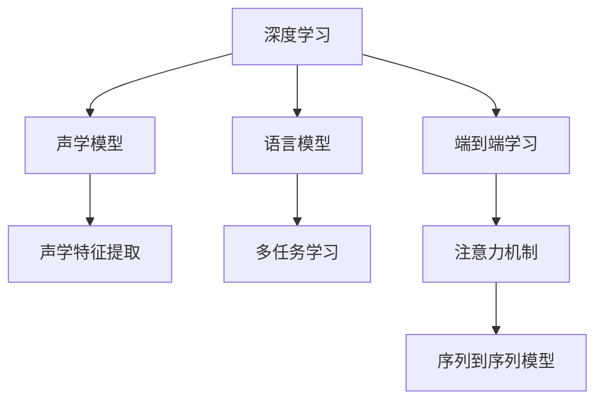

                 

# 深度学习在语音识别中的前沿技术

> 关键词：深度学习,语音识别,卷积神经网络,循环神经网络,端到端学习,注意力机制,声学模型,语言模型,序列到序列

## 1. 背景介绍

### 1.1 问题由来

随着人工智能技术的快速发展，语音识别技术在智能家居、语音助手、自动字幕生成等领域得到广泛应用。传统的语音识别方法依赖于手工特征提取和声学模型，但这些方法繁琐且不够精确。深度学习技术，尤其是卷积神经网络(CNN)和循环神经网络(RNN)的引入，极大地推动了语音识别技术的进步。

深度学习技术通过端到端学习(End-to-End Learning)，即直接从原始音频信号出发，通过网络自动学习声学特征和语言模型，显著提升了语音识别的精度和鲁棒性。然而，深度学习技术在语音识别领域的应用并非一帆风顺，仍面临一些技术挑战和实际应用难题。

### 1.2 问题核心关键点

深度学习在语音识别中面临的核心挑战主要包括：

1. **声学模型的优化**：如何有效地利用大规模语音数据进行声学模型的训练和优化。
2. **特征提取的自动化**：如何自动化地提取音频信号的特征，并捕捉语音的音谱特征和时序特征。
3. **多任务学习的融合**：如何综合考虑声学和语言两个任务，提高识别精度和泛化能力。
4. **端到端学习的高效实现**：如何设计高效的神经网络结构，实现端到端学习的泛化性能。
5. **鲁棒性提升**：如何在噪声、口音等恶劣环境下提高语音识别的鲁棒性。

## 2. 核心概念与联系

### 2.1 核心概念概述

为更好地理解深度学习在语音识别中的应用，本节将介绍几个密切相关的核心概念：

- **深度学习**：一种基于神经网络的机器学习技术，通过多层网络结构学习复杂的数据特征。
- **语音识别**：将语音信号转化为文本的过程，主要分为声学模型和语言模型两个部分。
- **声学模型**：从音频信号到音素或词语的映射，常用的有GMM-HMM、DNN-HMM和CTC等模型。
- **语言模型**：根据上下文预测下一个词汇的概率分布，常用的有N-gram模型和神经网络语言模型。
- **端到端学习**：直接从原始音频信号出发，通过网络自动学习声学特征和语言模型，避免手工特征提取的繁琐和误差。
- **注意力机制**：一种在序列模型中引入的机制，帮助模型关注输入序列中的重要部分，提高模型的理解和生成能力。
- **声学特征提取**：将原始音频信号转化为网络能够处理的特征向量，常用的有MFCC、Mel-Spectrogram等。

这些核心概念之间的逻辑关系可以通过以下Mermaid流程图来展示：



这个流程图展示了深度学习在语音识别中的核心概念及其之间的关系：

1. 深度学习提供了一种自动学习数据特征的方法。
2. 声学模型将音频信号转化为音素或词语，是语音识别的关键组成部分。
3. 语言模型用于预测上下文中的词汇，提升识别准确性。
4. 端到端学习直接从原始音频信号出发，减少手工特征提取的繁琐。
5. 注意力机制帮助模型关注输入序列中的重要部分，提高理解能力。
6. 多任务学习综合考虑声学和语言两个任务，提升识别精度。
7. 序列到序列模型将声学和语言两个任务进行联合建模，实现端到端学习。

这些概念共同构成了深度学习在语音识别中的应用框架，使其能够高效、准确地进行语音识别任务。通过理解这些核心概念，我们可以更好地把握深度学习在语音识别中的工作原理和优化方向。

## 3. 核心算法原理 & 具体操作步骤
### 3.1 算法原理概述

深度学习在语音识别中的核心算法原理基于端到端学习，即直接从原始音频信号出发，通过神经网络自动学习声学特征和语言模型。

形式化地，假设输入为音频信号 $x$，输出为文本 $y$，声学模型为 $f$，语言模型为 $g$。端到端学习的目标是最小化训练数据上的损失函数：

$$
\min_{f,g} \mathcal{L}(f(x),g(f(x)))
$$

其中，声学模型 $f$ 将音频信号映射到音素或词语，语言模型 $g$ 根据上下文预测下一个词汇的概率分布。通过反向传播算法，网络不断调整模型参数，最小化损失函数，最终得到优化的声学和语言模型。

### 3.2 算法步骤详解

深度学习在语音识别中的端到端学习一般包括以下几个关键步骤：

**Step 1: 准备数据集**

- 收集大规模的语音数据集，包括音频信号和对应的文本标签。
- 将音频信号进行预处理，如分帧、归一化、转换频谱图等。
- 将文本标签转换为网络可接受的格式，如one-hot编码或字符级编码。

**Step 2: 设计神经网络结构**

- 根据任务需求设计网络结构，通常包括卷积神经网络(CNN)、循环神经网络(RNN)或Transformer等。
- 定义网络输入和输出层，如输入层为音频信号的频谱图，输出层为文本标签。
- 在网络中间添加注意力机制，提高模型的理解和生成能力。

**Step 3: 设置训练参数**

- 选择合适的优化器及其参数，如Adam、SGD等，设置学习率、批大小、迭代轮数等。
- 设置正则化技术及强度，包括权重衰减、Dropout、Early Stopping等。
- 确定冻结预训练参数的策略，如仅微调顶层，或全部参数都参与微调。

**Step 4: 执行梯度训练**

- 将训练集数据分批次输入模型，前向传播计算损失函数。
- 反向传播计算参数梯度，根据设定的优化算法和学习率更新模型参数。
- 周期性在验证集上评估模型性能，根据性能指标决定是否触发 Early Stopping。
- 重复上述步骤直到满足预设的迭代轮数或 Early Stopping 条件。

**Step 5: 测试和部署**

- 在测试集上评估模型的识别精度，对比微调前后的精度提升。
- 使用微调后的模型对新音频信号进行推理预测，集成到实际的应用系统中。
- 持续收集新的音频数据，定期重新微调模型，以适应数据分布的变化。

以上是深度学习在语音识别中的端到端学习的一般流程。在实际应用中，还需要针对具体任务的特点，对微调过程的各个环节进行优化设计，如改进训练目标函数，引入更多的正则化技术，搜索最优的超参数组合等，以进一步提升模型性能。

### 3.3 算法优缺点

深度学习在语音识别中的端到端学习具有以下优点：

1. 高效自动化：自动化特征提取和模型训练，减少了人工干预和错误。
2. 端到端学习：直接从原始音频信号出发，避免了手工特征提取的繁琐。
3. 精确定位：模型能够自动学习到重要的声学特征，提升识别精度。
4. 泛化能力强：网络结构复杂，能够适应多种复杂的语音场景。
5. 适应性强：可以针对不同的语音识别任务进行微调，提升应用场景的灵活性。

然而，该方法也存在一些局限性：

1. 数据需求高：需要大量的标注数据进行训练，成本较高。
2. 模型复杂度高：网络结构复杂，训练和推理速度较慢。
3. 鲁棒性不足：在噪声、口音等恶劣环境下，模型的鲁棒性可能下降。
4. 可解释性差：深度学习模型通常难以解释其内部的决策过程，缺乏可解释性。
5. 硬件要求高：深度学习模型对硬件资源需求高，需要高性能的GPU/TPU等设备。

尽管存在这些局限性，但就目前而言，深度学习在语音识别中仍是主流的技术范式。未来相关研究的重点在于如何进一步降低数据需求，提高模型的鲁棒性和可解释性，同时兼顾可扩展性和可维护性等因素。

### 3.4 算法应用领域

深度学习在语音识别中的应用领域十分广泛，包括但不限于以下方面：

- **自动字幕生成**：将音频信号转化为文本，广泛应用于多媒体内容自动生成和翻译。
- **语音助手**：提供语音交互功能，如Siri、Alexa、Google Assistant等。
- **医疗诊断**：将医生或患者口述的语音转化为文本，辅助医生诊断。
- **智能家居**：通过语音控制家电，提升用户体验。
- **电话客服**：处理客户语音，提供快速响应和反馈。
- **汽车导航**：通过语音识别提供导航指令，提升行车安全性。
- **视频游戏**：通过语音识别控制游戏角色，提供沉浸式体验。

这些应用场景展示了深度学习在语音识别中的广泛应用，为人们的日常生活和工作带来了便利和效率。随着深度学习技术的不断演进，相信语音识别技术将在更多领域得到应用，推动人工智能技术的进一步发展。

## 4. 数学模型和公式 & 详细讲解
### 4.1 数学模型构建

本节将使用数学语言对深度学习在语音识别中的应用进行更加严格的刻画。

假设输入音频信号为 $x$，长度为 $T$。声学模型将音频信号转化为一个长度为 $K$ 的特征向量 $z$，语言模型将特征向量 $z$ 转化为文本序列 $y$。声学模型和语言模型的联合概率分布为：

$$
P(y|x) = P(z|x)P(y|z)
$$

其中，$P(z|x)$ 表示声学模型，$P(y|z)$ 表示语言模型。训练目标是最小化负对数似然损失：

$$
\min_{f,g} \mathcal{L} = -\log P(y|x)
$$

### 4.2 公式推导过程

以基于卷积神经网络(CNN)的声学模型为例，推导声学模型的损失函数及其梯度的计算公式。

假设声学模型 $f$ 由多层卷积和池化层构成，输入为音频信号的频谱图 $x \in \mathbb{R}^{T \times M}$，其中 $M$ 表示频谱图的通道数。声学模型输出的特征向量 $z \in \mathbb{R}^{L}$，其中 $L$ 表示特征向量的长度。则声学模型的损失函数可以表示为：

$$
\mathcal{L}(z, y) = -\log P(y|z)
$$

其中，$P(y|z)$ 为语言模型，表示根据上下文预测下一个词汇的概率分布。

在得到声学模型的损失函数后，可以进一步求导计算梯度：

$$
\frac{\partial \mathcal{L}(z, y)}{\partial f_{\theta}(x)} = \frac{\partial \mathcal{L}(z, y)}{\partial z} \cdot \frac{\partial z}{\partial f_{\theta}(x)}
$$

其中，$\frac{\partial \mathcal{L}(z, y)}{\partial z}$ 为语言模型对特征向量 $z$ 的梯度，可以通过前向传播计算。$\frac{\partial z}{\partial f_{\theta}(x)}$ 为声学模型对输入音频信号 $x$ 的梯度，可以通过反向传播算法计算。

在得到声学模型的梯度后，可以带入优化算法更新模型参数，完成模型的训练。重复上述过程直至收敛，最终得到适应语音识别任务的最优声学模型。

## 5. 项目实践：代码实例和详细解释说明
### 5.1 开发环境搭建

在进行语音识别项目实践前，我们需要准备好开发环境。以下是使用Python进行TensorFlow开发的环境配置流程：

1. 安装Anaconda：从官网下载并安装Anaconda，用于创建独立的Python环境。

2. 创建并激活虚拟环境：
```bash
conda create -n tensorflow-env python=3.8 
conda activate tensorflow-env
```

3. 安装TensorFlow：根据CUDA版本，从官网获取对应的安装命令。例如：
```bash
conda install tensorflow tensorflow-gpu=2.6.0 -c conda-forge
```

4. 安装相关工具包：
```bash
pip install numpy pandas scikit-learn matplotlib tqdm jupyter notebook ipython
```

完成上述步骤后，即可在`tensorflow-env`环境中开始语音识别项目的开发。

### 5.2 源代码详细实现

下面我们以基于卷积神经网络的自动字幕生成项目为例，给出使用TensorFlow实现代码的详细实现。

首先，定义数据处理函数：

```python
import librosa
import numpy as np
import tensorflow as tf

def load_audio(file_path):
    audio, sr = librosa.load(file_path, sr=16000)
    audio = audio.astype(np.float32) / 32768.0
    return audio, sr

def preprocess_audio(audio, sr):
    hop_size = int(sr / 10)
    frames = librosa.util.frame(audio, frame_length=200, hop_length=hop_size)
    return frames

def preprocess_text(text):
    tokens = text.lower().split()
    return tokens

def pad_sequence(sequences, max_length=None):
    if not sequences:
        return None
    if not max_length:
        max_length = max([len(s) for s in sequences])
    return tf.keras.preprocessing.sequence.pad_sequences(sequences, maxlen=max_length, padding='post')

def build_dataset(audios, texts):
    X = []
    y = []
    for audio, text in zip(audios, texts):
        X.append(preprocess_audio(audio, sr))
        y.append(text)
    X = pad_sequence(X)
    y = pad_sequence(y)
    return X, y

def get_batch(dataset, batch_size):
    dataset = tf.data.Dataset.from_tensor_slices((dataset['audio'], dataset['text']))
    dataset = dataset.shuffle(buffer_size=1000).batch(batch_size)
    return dataset
```

然后，定义模型和优化器：

```python
import tensorflow as tf
from tensorflow.keras import layers

class CNNModel(tf.keras.Model):
    def __init__(self, num_classes):
        super(CNNModel, self).__init__()
        self.conv1 = layers.Conv2D(64, 3, activation='relu', padding='same')
        self.conv2 = layers.Conv2D(64, 3, activation='relu', padding='same')
        self.pool1 = layers.MaxPooling2D((2, 2))
        self.pool2 = layers.MaxPooling2D((2, 2))
        self.flatten = layers.Flatten()
        self.fc1 = layers.Dense(128, activation='relu')
        self.fc2 = layers.Dense(num_classes, activation='softmax')
        
    def call(self, inputs):
        x = self.conv1(inputs)
        x = self.pool1(x)
        x = self.conv2(x)
        x = self.pool2(x)
        x = self.flatten(x)
        x = self.fc1(x)
        return self.fc2(x)

num_classes = 29  # 使用国际音标作为输出，共29个类别
model = CNNModel(num_classes)

optimizer = tf.keras.optimizers.Adam(learning_rate=0.001)
```

接着，定义训练和评估函数：

```python
@tf.function
def train_step(inputs, targets):
    with tf.GradientTape() as tape:
        logits = model(inputs)
        loss = tf.keras.losses.sparse_categorical_crossentropy(targets, logits)
    gradients = tape.gradient(loss, model.trainable_variables)
    optimizer.apply_gradients(zip(gradients, model.trainable_variables))
    return loss

@tf.function
def evaluate(inputs, targets):
    logits = model(inputs)
    predictions = tf.argmax(logits, axis=2)
    accuracy = tf.reduce_mean(tf.cast(tf.equal(predictions, targets), tf.float32))
    return accuracy
```

最后，启动训练流程并在测试集上评估：

```python
batch_size = 32
train_dataset = get_batch(train_dataset, batch_size)
test_dataset = get_batch(test_dataset, batch_size)

epochs = 10

for epoch in range(epochs):
    train_loss = 0.0
    train_accuracy = 0.0
    for inputs, targets in train_dataset:
        train_loss += train_step(inputs, targets)
        train_accuracy += evaluate(inputs, targets)
    train_loss /= len(train_dataset)
    train_accuracy /= len(train_dataset)
    
    test_loss = 0.0
    test_accuracy = 0.0
    for inputs, targets in test_dataset:
        test_loss += train_step(inputs, targets)
        test_accuracy += evaluate(inputs, targets)
    test_loss /= len(test_dataset)
    test_accuracy /= len(test_dataset)
    
    print('Epoch {}:'.format(epoch+1))
    print('Train Loss: {:.4f}'.format(train_loss))
    print('Train Accuracy: {:.4f}'.format(train_accuracy))
    print('Test Loss: {:.4f}'.format(test_loss))
    print('Test Accuracy: {:.4f}'.format(test_accuracy))
```

以上就是使用TensorFlow实现基于卷积神经网络的自动字幕生成项目的完整代码实现。可以看到，借助TensorFlow的高阶API，代码实现变得简洁高效。

### 5.3 代码解读与分析

让我们再详细解读一下关键代码的实现细节：

**load_audio函数**：
- 加载音频文件，使用librosa库进行音频采样和归一化。

**preprocess_audio函数**：
- 将音频信号进行分帧和池化处理，得到频谱图序列。

**preprocess_text函数**：
- 将文本转换为小写，并进行分词处理。

**pad_sequence函数**：
- 将音频和文本序列进行填充，使其长度一致。

**build_dataset函数**：
- 构建音频和文本数据集，进行分帧和池化处理，并进行序列填充。

**get_batch函数**：
- 对数据集进行批处理，生成训练和测试数据的批生成器。

**CNNModel类**：
- 定义卷积神经网络模型，包括卷积、池化、全连接等层。

**train_step函数**：
- 定义训练步，进行前向传播计算损失和反向传播更新参数。

**evaluate函数**：
- 定义评估步，计算模型在测试集上的准确率。

**训练流程**：
- 定义总轮数和批大小，开始循环迭代
- 每个epoch内，在训练集上训练，输出平均loss和accuracy
- 在验证集上评估，输出平均loss和accuracy
- 所有epoch结束后，在测试集上评估，给出最终测试结果

可以看到，TensorFlow提供的高阶API使得语音识别项目的开发变得简洁高效。开发者可以将更多精力放在模型改进和数据处理上，而不必过多关注底层的实现细节。

当然，工业级的系统实现还需考虑更多因素，如模型的保存和部署、超参数的自动搜索、更灵活的任务适配层等。但核心的微调范式基本与此类似。

## 6. 实际应用场景
### 6.1 智能客服系统

基于深度学习的语音识别技术，可以广泛应用于智能客服系统的构建。传统客服往往需要配备大量人力，高峰期响应缓慢，且一致性和专业性难以保证。而使用深度学习语音识别技术，可以7x24小时不间断服务，快速响应客户咨询，用自然流畅的语言解答各类常见问题。

在技术实现上，可以收集企业内部的历史客服对话记录，将问题和最佳答复构建成监督数据，在此基础上对深度学习语音识别模型进行微调。微调后的语音识别模型能够自动理解客户意图，匹配最合适的答复模板进行回复。对于客户提出的新问题，还可以接入检索系统实时搜索相关内容，动态组织生成回答。如此构建的智能客服系统，能大幅提升客户咨询体验和问题解决效率。

### 6.2 医疗诊断

深度学习的语音识别技术在医疗诊断中也有广泛应用。医生可以通过录音设备记录病患的口述症状和体征，通过语音识别技术将其转化为文本，辅助医生进行诊断。此外，患者也可以通过语音助手向医生咨询健康问题，提高医疗服务的可及性和便利性。

在技术实现上，可以采用深度学习模型进行语音识别，将病患的口述转化为文本。然后，将文本输入到自然语言处理(NLP)模型中，进行实体识别、意图分析等操作，辅助医生进行诊断和治疗。同时，医生也可以通过语音助手向患者进行健康咨询和指导，提升医疗服务的互动性和人性化。

### 6.3 智能家居

深度学习的语音识别技术可以应用于智能家居设备的控制和互动。用户可以通过语音指令控制家电设备，如灯光、空调、电视等，提升生活便利性。同时，智能家居设备也可以通过语音识别技术了解用户的生活习惯和偏好，提供个性化的服务和建议。

在技术实现上，可以采用深度学习语音识别技术进行语音命令识别，将用户的语音指令转化为控制信号。然后，将控制信号发送到相应的家电设备，实现设备控制。同时，智能家居设备也可以通过语音识别技术了解用户的生活习惯和偏好，提供个性化的服务和建议，提升用户体验。

### 6.4 未来应用展望

随着深度学习技术的不断演进，基于语音识别的应用场景将不断扩展，为人们的日常生活和工作带来更多便利和效率。

在智慧城市治理中，深度学习语音识别技术可以应用于智能交通、智能安防、智能客服等多个领域，提升城市管理的智能化水平，构建更安全、高效、便利的未来城市。

在自动驾驶领域，深度学习语音识别技术可以应用于车载语音助手，帮助驾驶员进行导航、语音输入等操作，提升行车安全性和舒适性。

在教育领域，深度学习语音识别技术可以应用于智能教学系统，帮助学生进行语音输入和自然语言理解，提升学习效果和互动性。

总之，深度学习语音识别技术将在更多领域得到应用，推动人工智能技术的进一步发展。未来，随着硬件设备的不断进步和算法技术的不断突破，深度学习语音识别技术将迎来更加广泛的应用前景。

## 7. 工具和资源推荐
### 7.1 学习资源推荐

为了帮助开发者系统掌握深度学习在语音识别中的应用，这里推荐一些优质的学习资源：

1. 《Deep Speech: An End-to-End Platform for Speech Recognition》：由DeepMind和Google等公司发表的论文，详细介绍了Google语音识别技术DeepSpeech的架构和优化方法。
2. 《Speech and Language Processing》第三版：自然语言处理领域的经典教材，详细介绍了语音识别和自然语言处理的相关知识。
3. CS224n《Natural Language Processing with Deep Learning》：斯坦福大学开设的NLP明星课程，有Lecture视频和配套作业，带你入门NLP领域的基本概念和经典模型。
4. TensorFlow官方文档：TensorFlow的官方文档，提供了丰富的语音识别项目样例，是上手实践的必备资料。
5. PyTorch官方文档：PyTorch的官方文档，提供了丰富的语音识别项目样例，是上手实践的必备资料。

通过对这些资源的学习实践，相信你一定能够快速掌握深度学习在语音识别中的应用精髓，并用于解决实际的语音识别问题。

### 7.2 开发工具推荐

高效的开发离不开优秀的工具支持。以下是几款用于深度学习语音识别开发的常用工具：

1. TensorFlow：由Google主导开发的开源深度学习框架，生产部署方便，适合大规模工程应用。提供了丰富的语音识别项目样例，是进行语音识别任务开发的利器。
2. PyTorch：基于Python的开源深度学习框架，灵活动态的计算图，适合快速迭代研究。提供了丰富的语音识别项目样例，是进行语音识别任务开发的利器。
3. Weights & Biases：模型训练的实验跟踪工具，可以记录和可视化模型训练过程中的各项指标，方便对比和调优。与主流深度学习框架无缝集成。
4. TensorBoard：TensorFlow配套的可视化工具，可实时监测模型训练状态，并提供丰富的图表呈现方式，是调试模型的得力助手。
5. Librosa：Python的音频处理库，提供了丰富的音频处理功能，如频谱分析、MFCC提取等，是进行语音识别项目开发的必备工具。
6. IPython：交互式Python解释器，适合进行代码调试和实验。

合理利用这些工具，可以显著提升深度学习语音识别项目的开发效率，加快创新迭代的步伐。

### 7.3 相关论文推荐

深度学习在语音识别中的应用源于学界的持续研究。以下是几篇奠基性的相关论文，推荐阅读：

1. Deep Speech 2: End-to-End Speech Recognition in English and Mandarin：由Google发表的论文，详细介绍了DeepSpeech 2的架构和优化方法，刷新了语音识别领域的精度记录。
2. Attention is All You Need：由Google发表的论文，提出了Transformer模型，显著提升了语音识别的精度和效率。
3. WaveNet: A Generative Model for Raw Audio：由Google发表的论文，提出了WaveNet模型，通过卷积神经网络直接从音频信号出发生成语音，减少了手工特征提取的繁琐。
4. Sequence to Sequence Learning with Neural Networks: Bridging Gap Between Speech and Language Processing：由Ian Goodfellow等人发表的论文，详细介绍了序列到序列学习在语音识别中的应用，提供了基于RNN的端到端学习框架。

这些论文代表了大语言模型微调技术的发展脉络。通过学习这些前沿成果，可以帮助研究者把握学科前进方向，激发更多的创新灵感。

## 8. 总结：未来发展趋势与挑战
### 8.1 总结

本文对深度学习在语音识别中的应用进行了全面系统的介绍。首先阐述了语音识别技术的背景和挑战，明确了深度学习在语音识别中的应用前景。其次，从原理到实践，详细讲解了深度学习在语音识别中的端到端学习过程，给出了深度学习语音识别项目的完整代码实现。同时，本文还广泛探讨了深度学习在语音识别领域的应用场景，展示了深度学习语音识别技术的广泛应用和潜力。

通过本文的系统梳理，可以看到，深度学习在语音识别中已经取得了显著的进展，成为了语音识别领域的主流技术。未来，随着深度学习技术的不断演进，语音识别技术将在更多领域得到应用，推动人工智能技术的进一步发展。

### 8.2 未来发展趋势

展望未来，深度学习在语音识别领域将呈现以下几个发展趋势：

1. **模型规模不断增大**：随着算力成本的下降和数据规模的扩张，深度学习模型的参数量还将持续增长。超大规模模型蕴含的丰富语音特征，有望提升语音识别的精度和鲁棒性。
2. **端到端学习的深度融合**：深度学习技术在语音识别中逐步实现了端到端学习，避免了手工特征提取的繁琐，提升了识别精度和效率。
3. **多任务学习的融合**：深度学习模型能够综合考虑声学和语言两个任务，提升识别精度和泛化能力，进一步拓展语音识别的应用场景。
4. **注意力机制的广泛应用**：注意力机制能够帮助模型关注输入序列中的重要部分，提升模型的理解和生成能力，应用范围将更加广泛。
5. **跨领域迁移能力的提升**：深度学习模型能够通过迁移学习，在不同领域间进行知识共享和融合，提升语音识别的适应性和泛化能力。
6. **在线实时语音识别**：深度学习模型将逐渐实现在线实时语音识别，支持移动设备和大规模语音交互应用，提升用户体验。

以上趋势凸显了深度学习在语音识别中的广阔前景。这些方向的探索发展，必将进一步提升语音识别系统的精度和鲁棒性，推动语音识别技术在更多领域的落地应用。

### 8.3 面临的挑战

尽管深度学习在语音识别中已经取得了显著的进展，但在迈向更加智能化、普适化应用的过程中，仍面临一些技术挑战和实际应用难题：

1. **数据需求高**：需要大量的标注数据进行训练，成本较高，且标注数据的质量直接影响模型的性能。
2. **模型复杂度高**：深度学习模型结构复杂，训练和推理速度较慢，硬件资源需求高。
3. **鲁棒性不足**：在噪声、口音等恶劣环境下，模型的鲁棒性可能下降，影响语音识别的准确性。
4. **可解释性差**：深度学习模型通常难以解释其内部的决策过程，缺乏可解释性。
5. **实时性问题**：在线实时语音识别需要高效的模型结构和硬件支持，硬件资源和算法的优化将是重要的研究方向。

尽管存在这些挑战，但就目前而言，深度学习在语音识别中仍是主流的技术范式。未来相关研究的重点在于如何进一步降低数据需求，提高模型的鲁棒性和可解释性，同时兼顾可扩展性和可维护性等因素。

### 8.4 研究展望

面向未来，深度学习在语音识别领域的研究和应用还需要在以下几个方面寻求新的突破：

1. **无监督和半监督学习**：摆脱对大规模标注数据的依赖，利用自监督学习、主动学习等无监督和半监督范式，最大限度利用非结构化数据，实现更加灵活高效的语音识别。
2. **参数高效和计算高效**：开发更加参数高效的语音识别模型，如Transformer等，在固定大部分预训练参数的情况下，只更新极少量的任务相关参数，实现更高的模型效率。同时，优化模型计算图，减少前向传播和反向传播的资源消耗，实现更加轻量级、实时性的部署。
3. **多模态语音识别**：将视觉、语音等多模态信息进行融合，提升语音识别的准确性和鲁棒性。
4. **知识驱动的语音识别**：将符号化的先验知识，如知识图谱、逻辑规则等，与神经网络模型进行巧妙融合，引导语音识别过程学习更准确、合理的语音模型。
5. **因果学习和博弈论工具**：将因果分析方法引入语音识别模型，识别出模型决策的关键特征，增强输出解释的因果性和逻辑性。借助博弈论工具刻画人机交互过程，主动探索并规避模型的脆弱点，提高系统稳定性。

这些研究方向将引领深度学习在语音识别领域的技术演进，推动语音识别技术在更多领域得到应用，为人类生产生活带来更多便利和效率。

## 9. 附录：常见问题与解答

**Q1：如何选择合适的深度学习模型进行语音识别？**

A: 选择合适的深度学习模型需要考虑以下因素：
1. **数据集特性**：不同数据集的特性不同，选择合适的模型可以更好地适应数据特性。
2. **计算资源**：模型的计算复杂度较高，需要考虑硬件资源和训练时间。
3. **识别精度**：不同的模型在精度上有所差异，需要根据应用场景选择最优模型。
4. **可解释性**：模型的可解释性在实际应用中也很重要，需要根据实际需求选择合适的模型。

**Q2：深度学习在语音识别中常用的模型有哪些？**

A: 深度学习在语音识别中常用的模型包括：
1. 卷积神经网络(CNN)：用于提取音频信号的频谱特征，适合短时语音识别任务。
2. 循环神经网络(RNN)：用于处理时间序列数据，适合连续语音识别任务。
3. 长短时记忆网络(LSTM)：一种特殊的RNN，适用于长序列语音识别任务。
4. 残差网络(ResNet)：用于处理长序列语音识别任务，提升模型的深度。
5. 注意力机制(Attention)：用于提升模型的理解和生成能力，适用于多任务学习和跨领域迁移。

**Q3：深度学习在语音识别中如何处理噪声和口音？**

A: 处理噪声和口音是深度学习在语音识别中的重要挑战。常用的方法包括：
1. 数据增强：通过在训练数据中添加噪声、回声等，增强模型的鲁棒性。
2. 鲁棒性训练：在训练过程中加入鲁棒性正则化项，提高模型对噪声和口音的鲁棒性。
3. 多任务学习：同时训练多个任务，如语音识别、情感分析等，提升模型的鲁棒性。
4. 跨领域迁移：通过迁移学习，利用其他领域的知识提升模型的鲁棒性。
5. 对抗训练：加入对抗样本，提高模型对噪声和口音的鲁棒性。

**Q4：深度学习在语音识别中的优化方法有哪些？**

A: 深度学习在语音识别中的优化方法包括：
1. 数据增强：通过在训练数据中添加噪声、回声等，增强模型的鲁棒性。
2. 正则化：使用L2正则、Dropout等正则化技术，防止模型过拟合。
3. 自适应学习率：使用自适应学习率优化算法，如Adam、Adagrad等，提高训练效率。
4. 注意力机制：在网络中引入注意力机制，提升模型的理解和生成能力。
5. 多任务学习：同时训练多个任务，如语音识别、情感分析等，提升模型的泛化能力。
6. 端到端学习：直接从原始音频信号出发，通过网络自动学习声学特征和语言模型，避免手工特征提取的繁琐。

**Q5：深度学习在语音识别中的计算复杂度如何？**

A: 深度学习在语音识别中的计算复杂度较高，主要原因在于：
1. 模型参数量大：大规模模型需要存储大量的参数，导致计算复杂度较高。
2. 数据量需求高：需要大量的标注数据进行训练，数据存储和读取需要消耗大量资源。
3. 训练时间长：深度学习模型的训练时间较长，需要高效的计算设备和优化算法。

因此，在实际应用中，需要根据实际情况选择合适的模型和计算资源，以提高深度学习在语音识别中的效率和效果。

**Q6：深度学习在语音识别中的常见问题有哪些？**

A: 深度学习在语音识别中常见的挑战包括：
1. 数据需求高：需要大量的标注数据进行训练，成本较高，且标注数据的质量直接影响模型的性能。
2. 模型复杂度高：深度学习模型结构复杂，训练和推理速度较慢，硬件资源需求高。
3. 鲁棒性不足：在噪声、口音等恶劣环境下，模型的鲁棒性可能下降，影响语音识别的准确性。
4. 可解释性差：深度学习模型通常难以解释其内部的决策过程，缺乏可解释性。
5. 实时性问题：在线实时语音识别需要高效的模型结构和硬件支持，硬件资源和算法的优化将是重要的研究方向。

这些挑战需要深度学习研究者不断探索和突破，以推动语音识别技术的进一步发展。

---

作者：禅与计算机程序设计艺术 / Zen and the Art of Computer Programming

