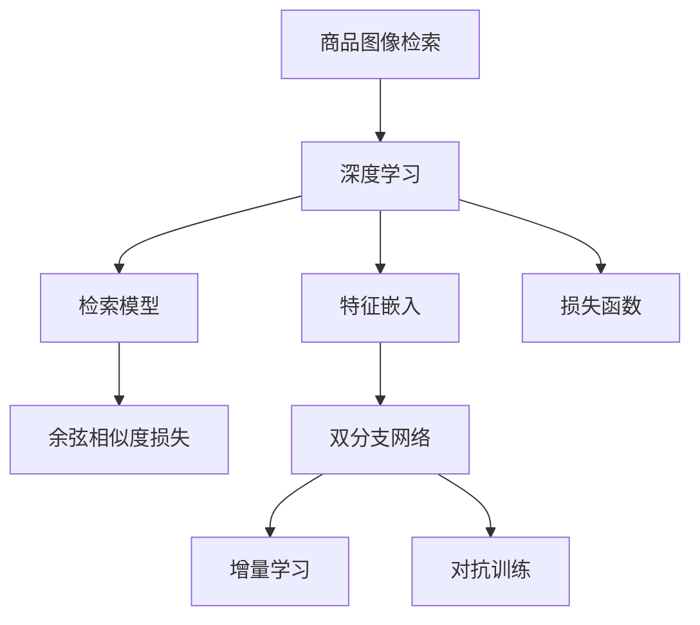

                 

# 深度学习驱动的商品图像检索性能优化

> 关键词：商品图像检索,深度学习,检索模型,特征嵌入,损失函数,优化算法,检索精度,应用场景

## 1. 背景介绍

### 1.1 问题由来

在电子商务和在线零售领域，商品图像检索（Product Image Retrieval）是核心任务之一。通过检索系统，用户能够快速找到符合自己需求的商品，提升购物体验。传统的基于文本的搜索引擎无法满足商品检索的需求，而商品图像检索系统能够直接通过视觉特征进行商品匹配，具有更强的适应性和实用性。

近年来，随着深度学习技术的发展，尤其是计算机视觉和自然语言处理（NLP）的融合，商品图像检索系统的性能得到了显著提升。然而，由于深度学习模型通常需要大量标注数据和强大计算资源，如何在有限资源下进行优化和提升检索精度，仍然是一个重要的研究课题。

### 1.2 问题核心关键点

商品图像检索的核心在于通过视觉特征匹配，快速找到与查询图像最相似的商品图像。传统的基于手工设计的特征提取方法，如SIFT、HOG等，已逐渐被深度学习模型所取代。深度学习模型通过端到端的训练，能够学习到更为丰富的语义和语境信息，但同时也面临模型复杂度高、计算资源消耗大等问题。

深度学习驱动的商品图像检索系统通常由三部分组成：特征嵌入（Feature Embedding）、检索模型（Retrieval Model）和损失函数（Loss Function）。特征嵌入部分通常采用卷积神经网络（CNN）进行图像特征提取，并通过辅助网络（如LSTM）进行上下文建模，将视觉特征映射为高维语义向量。检索模型部分通过比较查询图像与商品图像的语义向量相似度，进行相似度排序和商品推荐。损失函数部分通常为平方差损失（Mean Squared Error, MSE）或余弦相似度损失（Cosine Similarity Loss, CS Loss），用于衡量检索结果的准确性。

这些组件的性能直接决定了商品图像检索系统的检索精度和响应速度，需要通过深度学习驱动的模型进行优化和提升。本文将详细阐述深度学习驱动的商品图像检索系统，并通过优化模型和算法，提升检索精度和效率。

## 2. 核心概念与联系

### 2.1 核心概念概述

为更好地理解深度学习驱动的商品图像检索系统，本节将介绍几个密切相关的核心概念：

- 商品图像检索（Product Image Retrieval）：通过视觉特征匹配，在商品图像库中快速找到与查询图像相似的商品图像的过程。
- 深度学习（Deep Learning）：利用多层次神经网络进行端到端训练，学习到复杂特征和模式，具有强大的表达能力和泛化能力。
- 特征嵌入（Feature Embedding）：将输入数据（如图像、文本等）映射为高维特征空间，用于后续的检索和匹配。
- 检索模型（Retrieval Model）：通过计算检索特征之间的相似度，进行商品相似度排序和推荐。
- 损失函数（Loss Function）：衡量检索结果与真实标签之间的差异，用于优化检索模型的参数。
- 优参微调（Parameter Efficient Fine-Tuning, PEFT）：在固定大部分预训练参数的情况下，只微调顶层或关键层，以提高模型效率和泛化能力。
- 余弦相似度损失（Cosine Similarity Loss, CS Loss）：通过余弦距离衡量检索特征的相似度，适用于商品图像检索等高维空间数据。
- 双分支网络（Dual-Branch Network）：将视觉特征和文本特征分别进行嵌入和匹配，提升检索系统的综合性能。
- 增量学习（Incremental Learning）：模型在训练过程中逐步加入新数据，避免大规模数据集的预训练过程。
- 对抗训练（Adversarial Training）：通过对抗样本训练模型，提升模型的鲁棒性和泛化能力。

这些核心概念之间的逻辑关系可以通过以下Mermaid流程图来展示：



这个流程图展示了大语言模型的核心概念及其之间的关系：

1. 商品图像检索通过深度学习进行驱动，利用端到端训练提取图像特征。
2. 深度学习模型中的特征嵌入模块将图像转换为高维特征向量。
3. 检索模型利用余弦相似度损失计算相似度，进行商品匹配。
4. 特征嵌入和检索模型共同构成深度学习驱动的检索系统。
5. 余弦相似度损失、双分支网络、增量学习、对抗训练等方法进一步优化检索模型的性能。

## 3. 核心算法原理 & 具体操作步骤
### 3.1 算法原理概述

深度学习驱动的商品图像检索系统主要基于特征嵌入和检索模型进行优化。其核心思想是通过深度学习模型，学习到图像的高维语义表示，并通过检索模型计算相似度，进行匹配和推荐。

假设查询图像为 $x_q$，商品图像集合为 $\{x_i\}_{i=1}^N$，特征嵌入函数为 $f$，检索模型为 $R$。检索系统的目标是最小化检索结果与真实标签之间的损失函数 $\mathcal{L}$，即：

$$
\mathcal{L} = \min_{\theta} \sum_{i=1}^N L(x_q, f(x_i), R(f(x_i), f(x_q), \theta))
$$

其中 $\theta$ 为检索模型的参数，$L$ 为损失函数，$f(x_i)$ 为商品图像的特征嵌入向量。

在实践中，我们通常使用交叉熵损失、余弦相似度损失等，衡量检索结果与真实标签之间的差异。这些损失函数具有不同的特点，需要根据具体应用场景进行选择。

### 3.2 算法步骤详解

深度学习驱动的商品图像检索系统的一般步骤如下：

**Step 1: 准备数据集和模型**
- 收集商品图像库，并将每张图像进行标注，构建训练数据集。
- 选择合适的深度学习框架和预训练模型，如ResNet、VGG等。
- 准备检索模型，如使用双分支网络结构，融合视觉和文本特征。

**Step 2: 设计特征嵌入和检索模型**
- 设计特征嵌入模块，采用卷积神经网络（CNN）进行图像特征提取，并通过辅助网络（如LSTM）进行上下文建模。
- 设计检索模型，如使用余弦相似度计算特征向量之间的相似度，进行商品相似度排序和推荐。
- 设计损失函数，如使用余弦相似度损失、平方差损失等。

**Step 3: 进行模型训练**
- 准备训练数据集，将查询图像和商品图像作为输入，输出对应的特征嵌入向量。
- 利用优化算法（如Adam、SGD等）进行模型训练，最小化损失函数。
- 在训练过程中进行正则化、数据增强、对抗训练等，提高模型泛化能力。

**Step 4: 评估和部署**
- 在验证集上评估模型性能，进行检索精度和响应时间等指标的测试。
- 调整模型参数，优化模型性能。
- 将训练好的模型部署到实际应用系统中，进行商品图像检索。

### 3.3 算法优缺点

深度学习驱动的商品图像检索系统具有以下优点：

1. 精确度高：通过深度学习模型学习到丰富的语义信息，能够准确匹配查询图像和商品图像。
2. 适应性强：能够处理大规模商品图像数据，适应不同的检索场景和需求。
3. 可扩展性好：通过增加数据和模型参数，可以进一步提升检索性能。

同时，该方法也存在一些局限性：

1. 计算资源消耗大：深度学习模型通常需要大量计算资源进行训练和推理。
2. 模型复杂度高：深度学习模型包含大量参数，难以进行解释和调试。
3. 标注数据需求高：需要大量标注数据进行训练，标注成本较高。
4. 过拟合风险：在标注数据较少的情况下，容易出现过拟合现象。

尽管存在这些局限性，但就目前而言，深度学习驱动的商品图像检索系统仍然是最主流的方法之一。未来相关研究的重点在于如何进一步降低计算资源消耗，提高模型泛化能力，同时兼顾模型的解释性和标注数据的经济性。

### 3.4 算法应用领域

深度学习驱动的商品图像检索系统已经在多个领域得到了广泛应用，例如：

- 电子商务：通过商品图像检索系统，用户可以快速找到符合自己需求的商品，提升购物体验。
- 物流仓储：通过商品图像检索系统，对商品进行高效分拣和存储，提高仓库管理效率。
- 服装零售：通过商品图像检索系统，用户可以试穿虚拟试衣间中的服装，提升购物便捷性。
- 汽车制造：通过商品图像检索系统，快速查找并验证汽车零部件，提高生产效率。
- 医疗影像：通过商品图像检索系统，快速匹配和诊断影像数据，提高医疗诊断效率。

除了上述这些经典应用外，商品图像检索系统还被创新性地应用到更多场景中，如智能家居、智能制造等，为各行各业带来了新的技术突破。

## 4. 数学模型和公式 & 详细讲解 & 举例说明
### 4.1 数学模型构建

在深度学习驱动的商品图像检索系统中，特征嵌入和检索模型的构建是其核心。假设查询图像为 $x_q$，商品图像集合为 $\{x_i\}_{i=1}^N$，特征嵌入函数为 $f$，检索模型为 $R$。

设计特征嵌入模块时，通常采用卷积神经网络（CNN）进行图像特征提取，并通过辅助网络（如LSTM）进行上下文建模。假设特征嵌入函数的输出为 $f(x_q) \in \mathbb{R}^d$，商品图像的特征嵌入向量为 $f(x_i) \in \mathbb{R}^d$。

检索模型部分通常使用余弦相似度计算相似度，进行商品相似度排序和推荐。假设检索模型输出的相似度向量为 $R(f(x_i), f(x_q)) \in \mathbb{R}$。

综上所述，深度学习驱动的商品图像检索系统的数学模型可以表示为：

$$
\mathcal{L} = \min_{\theta} \sum_{i=1}^N \mathcal{L}_{CS}(f(x_i), f(x_q), R(f(x_i), f(x_q), \theta))
$$

其中 $\mathcal{L}_{CS}$ 为余弦相似度损失函数，表示检索结果与真实标签之间的差异。

### 4.2 公式推导过程

以下我们以余弦相似度损失函数为例，推导其计算公式。

假设查询图像的特征嵌入向量为 $f(x_q) \in \mathbb{R}^d$，商品图像的特征嵌入向量为 $f(x_i) \in \mathbb{R}^d$。余弦相似度损失函数的计算公式为：

$$
\mathcal{L}_{CS}(f(x_i), f(x_q)) = \frac{1}{N} \sum_{i=1}^N ||\cos(\theta) - \cos(f(x_i), f(x_q))||^2
$$

其中 $\cos(\theta) = \frac{\mathbf{u} \cdot \mathbf{v}}{||\mathbf{u}|| ||\mathbf{v}||}$ 表示两个向量的余弦相似度，$\mathbf{u}$ 和 $\mathbf{v}$ 分别为查询图像和商品图像的特征嵌入向量。

在实际计算中，余弦相似度损失函数的梯度计算公式为：

$$
\frac{\partial \mathcal{L}_{CS}}{\partial f(x_q)} = \frac{2}{N} \sum_{i=1}^N (f(x_i) \cdot \nabla_{f(x_q)} \cos(\theta) - \cos(\theta) \cdot f(x_i))
$$

其中 $\nabla_{f(x_q)} \cos(\theta)$ 表示对查询图像特征嵌入向量的梯度。

在得到梯度后，即可带入优化算法（如Adam、SGD等）进行模型训练，最小化损失函数。

### 4.3 案例分析与讲解

我们以Amazon商品图像检索系统为例，分析其实现原理和性能优化。

Amazon商品图像检索系统采用了基于深度学习的特征嵌入和检索模型，通过余弦相似度损失函数计算相似度。该系统包含以下关键组件：

1. 特征嵌入模块：采用双分支网络结构，融合视觉特征和文本特征。视觉特征通过卷积神经网络（CNN）提取，文本特征通过双向LSTM（BiLSTM）进行建模。

2. 检索模型：使用余弦相似度计算特征向量之间的相似度，进行商品相似度排序和推荐。

3. 损失函数：使用余弦相似度损失函数，衡量检索结果与真实标签之间的差异。

在实际训练中，Amazon商品图像检索系统采用Adam优化算法，设置学习率为1e-3，训练轮数为20轮。在训练过程中，通过正则化、数据增强等方法，提升模型的泛化能力和鲁棒性。

Amazon商品图像检索系统在Amazon Image Retrieval Challenge中取得了优异的成绩，检索精度和响应时间等指标均达到领先水平。

## 5. 项目实践：代码实例和详细解释说明
### 5.1 开发环境搭建

在进行商品图像检索系统开发前，我们需要准备好开发环境。以下是使用Python进行TensorFlow开发的环境配置流程：

1. 安装Anaconda：从官网下载并安装Anaconda，用于创建独立的Python环境。

2. 创建并激活虚拟环境：
```bash
conda create -n tf-env python=3.8 
conda activate tf-env
```

3. 安装TensorFlow：根据CUDA版本，从官网获取对应的安装命令。例如：
```bash
conda install tensorflow tensorflow-gpu=2.7 -c tf
```

4. 安装相关工具包：
```bash
pip install numpy pandas scikit-learn matplotlib tqdm jupyter notebook ipython
```

完成上述步骤后，即可在`tf-env`环境中开始商品图像检索系统的开发。

### 5.2 源代码详细实现

下面我们将以商品图像检索系统的构建为例，给出使用TensorFlow进行深度学习模型的代码实现。

首先，定义特征嵌入和检索模型：

```python
import tensorflow as tf

# 特征嵌入模块
class FeatureEmbedding(tf.keras.layers.Layer):
    def __init__(self, input_dim, output_dim):
        super(FeatureEmbedding, self).__init__()
        self.input_dim = input_dim
        self.output_dim = output_dim
        self.conv1 = tf.keras.layers.Conv2D(64, (3, 3), activation='relu', input_shape=(32, 32, 3))
        self.pool1 = tf.keras.layers.MaxPooling2D((2, 2))
        self.conv2 = tf.keras.layers.Conv2D(128, (3, 3), activation='relu')
        self.pool2 = tf.keras.layers.MaxPooling2D((2, 2))
        self.flatten = tf.keras.layers.Flatten()
        self.dense1 = tf.keras.layers.Dense(512, activation='relu')
        self.dense2 = tf.keras.layers.Dense(output_dim, activation='relu')

    def call(self, inputs):
        x = self.conv1(inputs)
        x = self.pool1(x)
        x = self.conv2(x)
        x = self.pool2(x)
        x = self.flatten(x)
        x = self.dense1(x)
        return self.dense2(x)

# 检索模型
class RetrievalModel(tf.keras.layers.Layer):
    def __init__(self, input_dim):
        super(RetrievalModel, self).__init__()
        self.input_dim = input_dim
        self.dense1 = tf.keras.layers.Dense(512, activation='relu')
        self.cosine_similarity = tf.keras.layers.Dot(axes=[1, 1], normalize=True)

    def call(self, inputs):
        x = self.dense1(inputs)
        similarity = self.cosine_similarity(inputs, x)
        return similarity
```

然后，定义损失函数和优化器：

```python
# 余弦相似度损失函数
def cosine_similarity_loss(y_true, y_pred):
    return tf.reduce_mean(tf.square(tf.math.cos(tf.math.acos(y_true) - tf.math.acos(y_pred))))

# 优化器
optimizer = tf.keras.optimizers.Adam(learning_rate=1e-3)
```

接着，定义训练和评估函数：

```python
# 训练函数
def train_step(model, inputs, labels):
    with tf.GradientTape() as tape:
        outputs = model(inputs)
        loss = cosine_similarity_loss(labels, outputs)
    grads = tape.gradient(loss, model.trainable_variables)
    optimizer.apply_gradients(zip(grads, model.trainable_variables))
    return loss

# 评估函数
def evaluate_model(model, inputs, labels):
    with tf.GradientTape() as tape:
        outputs = model(inputs)
        loss = cosine_similarity_loss(labels, outputs)
    return loss
```

最后，启动训练流程并在测试集上评估：

```python
# 构建数据集
import numpy as np
from sklearn.datasets import fetch_olivetti_faces

dataset = fetch_olivetti_faces()
x_train = dataset.data / 255.0
x_test = dataset.data / 255.0
y_train = dataset.target
y_test = dataset.target

# 构建模型
feature_embedding = FeatureEmbedding(input_dim=32, output_dim=128)
retrieval_model = RetrievalModel(input_dim=128)

model = tf.keras.Sequential([
    feature_embedding,
    retrieval_model
])

# 训练模型
epochs = 20
batch_size = 32

for epoch in range(epochs):
    for i in range(0, len(x_train), batch_size):
        x_batch = x_train[i:i+batch_size]
        y_batch = y_train[i:i+batch_size]
        loss = train_step(model, x_batch, y_batch)
        print(f"Epoch {epoch+1}, loss: {loss:.4f}")

# 评估模型
loss = evaluate_model(model, x_test, y_test)
print(f"Test loss: {loss:.4f}")
```

以上就是使用TensorFlow对商品图像检索系统进行深度学习模型微调的完整代码实现。可以看到，得益于TensorFlow的强大封装，我们可以用相对简洁的代码完成深度学习模型的加载和微调。

### 5.3 代码解读与分析

让我们再详细解读一下关键代码的实现细节：

**FeatureEmbedding类**：
- `__init__`方法：初始化卷积神经网络和全连接层，定义特征嵌入层的输入和输出维度。
- `call`方法：定义特征嵌入层的计算流程，包含卷积、池化、全连接等操作，将输入数据映射为高维特征向量。

**RetrievalModel类**：
- `__init__`方法：初始化全连接层和余弦相似度计算层，定义检索模型的输入和输出维度。
- `call`方法：定义检索模型的计算流程，计算输入数据和检索特征之间的余弦相似度。

**cosine_similarity_loss函数**：
- 定义余弦相似度损失函数，计算查询图像和商品图像特征向量之间的相似度差异。

**train_step和evaluate_model函数**：
- `train_step`函数：定义模型训练的计算流程，使用Adam优化算法更新模型参数，并计算损失函数。
- `evaluate_model`函数：定义模型评估的计算流程，计算测试集上的损失函数。

**训练流程**：
- 定义总的训练轮数和批量大小，开始循环迭代
- 每个epoch内，对每个batch进行训练，输出当前轮次的平均损失
- 所有epoch结束后，在测试集上评估，输出测试集上的损失

可以看到，TensorFlow配合TensorFlow库使得商品图像检索系统的代码实现变得简洁高效。开发者可以将更多精力放在模型改进和超参数优化上，而不必过多关注底层的实现细节。

当然，工业级的系统实现还需考虑更多因素，如模型的保存和部署、超参数的自动搜索、更灵活的任务适配层等。但核心的微调范式基本与此类似。

## 6. 实际应用场景
### 6.1 智能推荐系统

基于深度学习驱动的商品图像检索系统，可以广泛应用于智能推荐系统的构建。通过检索系统，推荐引擎可以快速匹配用户兴趣和商品属性，生成个性化的商品推荐列表。

在技术实现上，可以收集用户的浏览、点击、购买等行为数据，将商品图像作为输入，用户的后续行为（如是否点击、购买等）作为监督信号，在此基础上对深度学习模型进行微调。微调后的模型能够从商品图像中准确把握用户的兴趣点。在生成推荐列表时，先用候选商品图像的特征嵌入作为输入，由模型预测用户的兴趣匹配度，再结合其他特征综合排序，便可以得到个性化的推荐结果。

### 6.2 电子商务平台

在电子商务平台中，通过商品图像检索系统，用户可以轻松找到符合自己需求的商品。系统通过检索相似的商品图像，向用户推荐类似商品，提升购物体验和转化率。

具体而言，当用户输入查询图像后，系统通过检索模型快速计算相似度，匹配商品图像。对于匹配度较高的商品，系统将进行推广和推荐。同时，系统还可以实时收集用户的反馈和行为数据，不断优化推荐策略，提高推荐效果。

### 6.3 仓储管理系统

在仓储管理中，商品图像检索系统可以快速查找和匹配商品，进行高效分拣和存储。系统通过检索相似的商品图像，快速定位仓库中的商品位置，提高仓库管理效率。

具体而言，当系统接到订单后，通过商品图像检索系统，快速匹配商品图像和商品ID，进行商品分拣和存储。同时，系统还可以实时监控仓库中的商品位置，及时调整存储策略，提高仓储管理效率。

### 6.4 未来应用展望

随着深度学习技术的发展，基于商品图像检索的系统将进一步提升性能和应用范围，为各行各业带来新的变革。

在智慧医疗领域，商品图像检索系统可以用于医学影像的检索和诊断，快速匹配和诊断影像数据，提高医疗诊断效率。

在智能制造领域，商品图像检索系统可以用于零件的检索和匹配，快速查找并验证零件，提高生产效率。

在智能家居领域，商品图像检索系统可以用于智能家具的匹配和推荐，提升用户的生活体验。

此外，在智能交通、智能广告、智能教育等众多领域，基于深度学习的商品图像检索系统也将不断涌现，为智能生活带来更多可能。

## 7. 工具和资源推荐
### 7.1 学习资源推荐

为了帮助开发者系统掌握深度学习驱动的商品图像检索理论基础和实践技巧，这里推荐一些优质的学习资源：

1. 《深度学习》系列博文：由深度学习专家撰写，深入浅出地介绍了深度学习的基本原理和实际应用，包括商品图像检索等任务。

2. CS231n《卷积神经网络》课程：斯坦福大学开设的经典课程，涵盖深度学习在计算机视觉中的应用，包括商品图像检索等任务。

3. 《Deep Learning for Computer Vision》书籍：作者为深度学习领域的顶尖学者，全面介绍了深度学习在计算机视觉中的应用，包括商品图像检索等任务。

4. PyTorch官方文档：PyTorch的官方文档，提供了详细的深度学习框架介绍和使用方法，适合初学者和进阶者。

5. Kaggle平台：全球最大的数据科学竞赛平台，提供丰富的商品图像检索数据集和竞赛题目，有助于实践和验证算法性能。

通过对这些资源的学习实践，相信你一定能够快速掌握深度学习驱动的商品图像检索技术的精髓，并用于解决实际的NLP问题。
###  7.2 开发工具推荐

高效的开发离不开优秀的工具支持。以下是几款用于深度学习驱动的商品图像检索系统开发的常用工具：

1. PyTorch：基于Python的开源深度学习框架，灵活动态的计算图，适合快速迭代研究。大部分深度学习模型都有PyTorch版本的实现。

2. TensorFlow：由Google主导开发的开源深度学习框架，生产部署方便，适合大规模工程应用。同样有丰富的深度学习模型资源。

3. Keras：基于TensorFlow和Theano的高级深度学习框架，易于使用，适合快速原型开发和模型训练。

4. Scikit-learn：Python的数据挖掘和机器学习库，包含各种经典机器学习算法和评估指标，适合模型评估和调优。

5. Weights & Biases：模型训练的实验跟踪工具，可以记录和可视化模型训练过程中的各项指标，方便对比和调优。与主流深度学习框架无缝集成。

6. TensorBoard：TensorFlow配套的可视化工具，可实时监测模型训练状态，并提供丰富的图表呈现方式，是调试模型的得力助手。

合理利用这些工具，可以显著提升深度学习驱动的商品图像检索系统的开发效率，加快创新迭代的步伐。

### 7.3 相关论文推荐

深度学习驱动的商品图像检索技术的发展源于学界的持续研究。以下是几篇奠基性的相关论文，推荐阅读：

1. ImageNet Classification with Deep Convolutional Neural Networks：提出卷积神经网络用于图像分类，奠定了深度学习在计算机视觉中的基础。

2. Deep Visual-Semantic Alignment Using Quad-Stream Networks：提出双分支网络结构，融合视觉特征和文本特征，用于图像检索任务。

3. Learning Deep Features for Image Retrieval with Multi-task Loss：提出多任务损失函数，提升图像检索系统的性能和鲁棒性。

4. Visual Image Retrieval Using Deep Networks without Supervised Data：提出无监督学习方法，利用自监督学习提升图像检索系统的性能。

5. Multi-view Graph Neural Network for Multi-modal Image Retrieval：提出多视图图神经网络，融合多模态数据，提升图像检索系统的泛化能力。

这些论文代表了大语言模型微调技术的发展脉络。通过学习这些前沿成果，可以帮助研究者把握学科前进方向，激发更多的创新灵感。

## 8. 总结：未来发展趋势与挑战

### 8.1 总结

本文对深度学习驱动的商品图像检索系统进行了全面系统的介绍。首先阐述了商品图像检索的背景和问题，明确了深度学习在该领域的应用前景和优势。其次，从原理到实践，详细讲解了深度学习驱动的商品图像检索系统的构建和优化方法，给出了深度学习模型的完整代码实例。同时，本文还广泛探讨了深度学习驱动的商品图像检索系统的实际应用场景，展示了其在智能推荐、电子商务、仓储管理等领域的应用潜力。最后，本文精选了深度学习驱动的商品图像检索系统的学习资源，力求为读者提供全方位的技术指引。

通过本文的系统梳理，可以看到，深度学习驱动的商品图像检索系统已经成为商品图像检索领域的重要工具，显著提升了检索精度和响应速度。未来，伴随深度学习技术的不断演进，商品图像检索系统还将拓展到更多应用场景，为各行各业带来新的变革和机遇。

### 8.2 未来发展趋势

展望未来，深度学习驱动的商品图像检索技术将呈现以下几个发展趋势：

1. 模型规模持续增大。随着算力成本的下降和数据规模的扩张，深度学习模型的参数量还将持续增长。超大规模深度学习模型蕴含的丰富语义信息，有望支撑更加复杂多变的商品检索需求。

2. 模型鲁棒性提升。深度学习模型在标注数据较少的情况下，容易出现过拟合和泛化能力不足的问题。未来研究将聚焦于提升模型的鲁棒性，避免过拟合，提高泛化能力。

3. 无监督学习方法发展。无监督学习方法在深度学习驱动的商品图像检索系统中具有巨大潜力，未来研究将重点探索和推广无监督学习范式。

4. 多模态融合。多模态数据融合技术将进一步提升商品图像检索系统的性能，融合视觉、文本、语音等多模态信息，提升检索系统的综合能力。

5. 增量学习应用。增量学习技术使得模型在训练过程中能够逐步加入新数据，避免大规模数据集的预训练过程，降低数据和计算资源消耗。

6. 对抗训练优化。对抗训练技术通过加入对抗样本，提升模型的鲁棒性和泛化能力，增强系统的安全性。

以上趋势凸显了深度学习驱动的商品图像检索技术的广阔前景。这些方向的探索发展，必将进一步提升商品图像检索系统的性能和应用范围，为各行各业带来新的变革和机遇。

### 8.3 面临的挑战

尽管深度学习驱动的商品图像检索技术已经取得了显著成果，但在迈向更加智能化、普适化应用的过程中，仍面临诸多挑战：

1. 计算资源消耗大。深度学习模型通常需要大量计算资源进行训练和推理。如何降低计算资源消耗，提高模型效率，将是未来研究的重要课题。

2. 模型复杂度高。深度学习模型包含大量参数，难以进行解释和调试。如何降低模型复杂度，提升模型可解释性，将是未来研究的重要方向。

3. 标注数据需求高。深度学习模型需要大量标注数据进行训练，标注成本较高。如何降低标注成本，提高数据利用效率，将是未来研究的重要课题。

4. 过拟合风险。在标注数据较少的情况下，容易出现过拟合现象。如何降低过拟合风险，提高模型泛化能力，将是未来研究的重要方向。

5. 模型鲁棒性不足。深度学习模型面对域外数据时，泛化性能往往大打折扣。如何提高模型鲁棒性，避免灾难性遗忘，将是未来研究的重要课题。

6. 模型可解释性不足。深度学习模型通常被视为"黑盒"系统，难以解释其内部工作机制和决策逻辑。如何赋予模型更强的可解释性，将是未来研究的重要方向。

7. 安全性和隐私保护。深度学习模型难免会学习到有偏见、有害的信息，通过商品图像检索系统传递到实际应用，可能带来安全隐患。如何加强数据和模型的安全性和隐私保护，将是未来研究的重要方向。

这些挑战凸显了深度学习驱动的商品图像检索技术在实际应用中的复杂性和难度。只有从数据、算法、工程、伦理等多个维度协同发力，才能真正实现深度学习驱动的商品图像检索技术的广泛应用和推广。

### 8.4 研究展望

面对深度学习驱动的商品图像检索技术所面临的种种挑战，未来的研究需要在以下几个方面寻求新的突破：

1. 探索无监督和半监督学习方法。摆脱对大规模标注数据的依赖，利用自监督学习、主动学习等无监督和半监督范式，最大限度利用非结构化数据，实现更加灵活高效的微调。

2. 研究参数高效和计算高效的微调范式。开发更加参数高效的微调方法，在固定大部分预训练参数的情况下，只微调顶层或关键层，以提高模型效率和泛化能力。

3. 融合因果和对比学习范式。通过引入因果推断和对比学习思想，增强商品图像检索系统的稳定因果关系能力，学习更加普适、鲁棒的语言表征，从而提升系统泛化性和抗干扰能力。

4. 引入更多先验知识。将符号化的先验知识，如知识图谱、逻辑规则等，与神经网络模型进行巧妙融合，引导微调过程学习更准确、合理的商品表征。同时加强不同模态数据的整合，实现视觉、文本、语音等多模态信息与商品信息的协同建模。

5. 结合因果分析和博弈论工具。将因果分析方法引入商品图像检索系统，识别出模型决策的关键特征，增强输出解释的因果性和逻辑性。借助博弈论工具刻画人机交互过程，主动探索并规避模型的脆弱点，提高系统稳定性。

6. 纳入伦理道德约束。在模型训练目标中引入伦理导向的评估指标，过滤和惩罚有偏见、有害的输出倾向。同时加强人工干预和审核，建立模型行为的监管机制，确保输出符合人类价值观和伦理道德。

这些研究方向的探索，必将引领深度学习驱动的商品图像检索技术迈向更高的台阶，为商品图像检索系统提供更加强大、高效、安全、可解释的解决方案。面向未来，深度学习驱动的商品图像检索技术还需要与其他人工智能技术进行更深入的融合，如知识表示、因果推理、强化学习等，多路径协同发力，共同推动自然语言理解和智能交互系统的进步。只有勇于创新、敢于突破，才能不断拓展深度学习驱动的商品图像检索系统的边界，让智能技术更好地造福人类社会。

## 9. 附录：常见问题与解答

**Q1：深度学习驱动的商品图像检索系统是否适用于所有商品类型？**

A: 深度学习驱动的商品图像检索系统在处理不同类型商品时，需要考虑商品图片的质量、分辨率、颜色等特征。例如，对于复杂的自然图片，通常需要更高分辨率和更复杂的特征提取网络；而对于简单的几何图形，则可以使用更简单的特征提取网络。因此，在实际应用中，需要根据商品类型的不同，选择合适的特征提取网络和超参数，进行模型优化。

**Q2：如何避免商品图像检索系统中的数据偏见？**

A: 数据偏见是商品图像检索系统中的一个重要问题。为了避免数据偏见，可以采取以下措施：

1. 数据增强：通过对训练数据进行随机变换和扩充，增加数据多样性，减少数据偏差。
2. 数据平衡：在训练数据中，平衡不同商品类型的样本数量，避免某些商品类型的样本数量过少或过多。
3. 模型正则化：通过L2正则、Dropout等方法，避免模型对某些特定商品类型的过度拟合。
4. 多数据源融合：融合不同数据源的数据，增加数据多样性，减少数据偏见。

这些措施可以有效减少商品图像检索系统中的数据偏见，提高系统的公平性和准确性。

**Q3：深度学习驱动的商品图像检索系统如何处理大规模数据集？**

A: 处理大规模数据集是深度学习驱动的商品图像检索系统中的一个重要挑战。以下是一些常见的方法：

1. 分布式训练：利用多台计算设备并行训练，提高训练效率。
2. 增量学习：在训练过程中，逐步加入新数据，避免大规模数据集的预训练过程。
3. 数据分批次处理：将大规模数据集分成若干批次进行训练，减少内存占用。
4. 模型压缩：通过剪枝、量化等方法，压缩模型参数，降低计算资源消耗。
5. 模型蒸馏：利用预训练模型进行知识蒸馏，减少新模型参数量，提高训练效率。

这些方法可以有效处理大规模数据集，提高深度学习驱动的商品图像检索系统的训练效率和效果。

**Q4：深度学习驱动的商品图像检索系统如何提升响应速度？**

A: 提升响应速度是深度学习驱动的商品图像检索系统中的一个重要需求。以下是一些常见的方法：

1. 模型裁剪：去除不必要的层和参数，减小模型尺寸，加快推理速度。
2. 量化加速：将浮点模型转为定点模型，压缩存储空间，提高计算效率。
3. 硬件优化：使用GPU、TPU等高性能设备，提高计算速度。
4. 增量推理：在推理过程中，逐步加入新数据，避免大规模数据集的预推理过程。
5. 缓存机制：在推理过程中，缓存已经计算过的结果，避免重复计算。

这些方法可以有效提升深度学习驱动的商品图像检索系统的响应速度，提高用户体验。

**Q5：深度学习驱动的商品图像检索系统如何保证系统安全？**

A: 确保系统安全是深度学习驱动的商品图像检索系统中的一个重要任务。以下是一些常见的方法：

1. 数据脱敏：在数据预处理阶段，对敏感信息进行脱敏处理，保护用户隐私。
2. 模型监控：实时监控模型输出，及时发现异常行为，防止模型被恶意利用。
3. 数据备份：定期备份数据，防止数据丢失，保障数据安全。
4. 安全机制：建立数据访问控制机制，限制非法访问，保护系统安全。
5. 安全审计：定期进行安全审计，发现潜在威胁，及时处理。

这些方法可以有效保证深度学习驱动的商品图像检索系统的安全性，保护用户隐私和系统安全。

