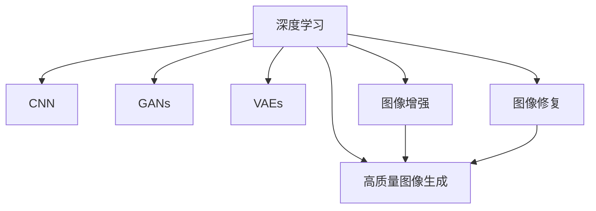

                 

# 深度学习驱动的商品图像生成质量提升

> 关键词：商品图像生成, 深度学习, 神经网络, 卷积神经网络, 生成对抗网络, 图像增强, 图像修复, 高质量图像生成, 图像超分辨率

## 1. 背景介绍

在现代商业活动中，商品图像的质量直接关系到顾客的购物体验和商家声誉。优质的商品图像不仅能够吸引顾客的注意力，还能提供产品细节的真实展现，促进购买决策。然而，现实中的商品图像往往受到多种因素的干扰，如光线、背景、拍摄角度等，导致图像质量参差不齐，影响用户体验。

为了提升商品图像的质量，人们提出了一系列图像增强和修复技术。这些技术包括：

- 图像去噪：去除图像中的噪声，如椒盐噪声、高斯噪声等。
- 图像去模糊：恢复因抖动、运动等原因导致的图像模糊。
- 图像超分辨率：将低分辨率图像提升到高分辨率，获得更清晰的图像细节。
- 图像补全：填补图像的缺失部分，使其更加完整。
- 图像风格转换：改变图像的视觉风格，使其更符合用户偏好。

近年来，随着深度学习技术的发展，上述图像处理任务可以利用神经网络进行端到端的自动化处理，显著提升处理效率和效果。特别是生成对抗网络（Generative Adversarial Networks, GANs）和变分自编码器（Variational Autoencoder, VAEs）等模型的出现，更是为高质量商品图像生成提供了新的可能性。本文将系统介绍深度学习在商品图像生成中的应用，重点探讨其原理、方法及未来展望。

## 2. 核心概念与联系

### 2.1 核心概念概述

在介绍深度学习在商品图像生成中的应用之前，首先需要理解几个核心概念：

- **深度学习**：一种基于神经网络的机器学习方法，通过多层次的特征提取和分类，实现对复杂数据的高级表示和处理。
- **神经网络**：由多个神经元（节点）和层（网络）组成的计算模型，用于模拟人类神经系统的信息处理过程。
- **卷积神经网络（Convolutional Neural Network, CNN）**：一种专门用于图像处理的神经网络，通过卷积操作提取图像局部特征，实现图像分类、检测、分割等任务。
- **生成对抗网络（GANs）**：一种由生成器和判别器组成的对抗性模型，通过无监督学习生成高质量的样本数据。
- **变分自编码器（VAEs）**：一种用于降维和生成建模的神经网络模型，通过编码器将数据压缩为低维潜在空间，再通过解码器生成高质量的样本。
- **图像增强**：通过一系列图像处理技术，提升图像质量，如去噪、去模糊、超分辨率、补全等。
- **图像修复**：填补图像的缺失或损坏部分，使其恢复到原始状态。
- **高质量图像生成**：利用深度学习生成逼真的、高分辨率的商品图像，提升用户体验。

这些概念之间的关系可以通过以下Mermaid流程图来展示：



这个流程图展示了深度学习通过CNN、GANs、VAEs等模型，实现图像增强、修复和生成的高层次关系：

1. CNN模型用于图像分类、检测、分割等任务。
2. GANs模型用于生成高质量的商品图像。
3. VAEs模型用于降维和生成建模。
4. 图像增强和修复技术可以提升输入图像质量，为高质量生成奠定基础。

## 3. 核心算法原理 & 具体操作步骤
### 3.1 算法原理概述

深度学习在商品图像生成中的应用主要通过以下几种算法实现：

- **卷积神经网络（CNNs）**：用于提取图像特征，分类、检测等任务。
- **生成对抗网络（GANs）**：用于生成高质量的商品图像。
- **变分自编码器（VAEs）**：用于降维和生成建模。
- **图像增强和修复**：提升输入图像质量，为高质量生成提供基础。

这些算法在图像生成任务中扮演着不同但互补的角色。卷积神经网络用于特征提取，生成对抗网络用于生成高质量图像，变分自编码器用于降维和生成建模，图像增强和修复技术用于提升输入图像质量。

### 3.2 算法步骤详解

#### 3.2.1 卷积神经网络（CNNs）

CNNs是一种专门用于图像处理的神经网络，通过卷积操作提取图像局部特征。其基本步骤包括：

1. **卷积层**：利用卷积核对输入图像进行卷积操作，提取局部特征。
2. **池化层**：通过最大池化或平均池化操作，减少特征图尺寸，提取主要特征。
3. **全连接层**：将池化后的特征图展平，输入全连接层进行分类或回归等任务。

CNNs的训练过程通常采用反向传播算法，通过最小化损失函数，更新模型参数，使其能够准确分类或回归。

#### 3.2.2 生成对抗网络（GANs）

GANs由生成器和判别器组成，通过对抗性训练生成高质量的商品图像。其基本步骤包括：

1. **生成器**：使用神经网络生成假图像，目标是欺骗判别器。
2. **判别器**：使用神经网络评估图像的真实性，目标是区分真实图像和假图像。
3. **对抗训练**：交替更新生成器和判别器，使生成器能够生成更逼真的图像，判别器能够更准确地分类。

GANs的训练过程通常采用梯度下降算法，通过最大化生成器的生成能力，最小化判别器的分类能力，达到生成高质量图像的目的。

#### 3.2.3 变分自编码器（VAEs）

VAEs用于降维和生成建模，通过编码器将数据压缩为低维潜在空间，再通过解码器生成高质量的样本。其基本步骤包括：

1. **编码器**：使用神经网络将输入数据压缩为低维潜在空间。
2. **解码器**：使用神经网络将潜在空间中的数据生成高质量的样本。
3. **重构误差**：计算输入数据和解码器生成的样本之间的差异，作为损失函数。

VAEs的训练过程通常采用变分推断算法，通过最小化重构误差和潜在空间的先验分布差异，达到生成高质量样本的目的。

#### 3.2.4 图像增强和修复

图像增强和修复技术通过一系列图像处理技术，提升输入图像质量，为高质量生成奠定基础。常见的技术包括：

1. **图像去噪**：通过卷积操作和激活函数，去除图像中的噪声。
2. **图像去模糊**：通过卷积操作和反卷积操作，恢复图像清晰度。
3. **图像超分辨率**：通过卷积操作和上采样操作，将低分辨率图像提升到高分辨率。
4. **图像补全**：利用生成模型或先验知识，填补图像缺失部分。

图像增强和修复技术的训练过程通常采用最小化损失函数，如均方误差、结构相似性等，更新模型参数，使其能够生成高质量的图像。

### 3.3 算法优缺点

深度学习在商品图像生成中的应用具有以下优点：

1. **自动化**：深度学习能够自动化地处理复杂图像生成任务，减少人工干预，提高效率。
2. **高精度**：深度学习模型在图像生成任务中能够达到较高的精度，生成高质量的图像。
3. **泛化能力强**：深度学习模型能够适应多种图像生成任务，具有较强的泛化能力。
4. **实时性**：通过优化模型结构和训练算法，可以实现实时图像生成，满足实际应用需求。

同时，深度学习在图像生成应用中也存在一些缺点：

1. **计算资源消耗大**：深度学习模型需要大量的计算资源进行训练，特别是在大型神经网络和大数据集上。
2. **模型复杂度高**：深度学习模型结构复杂，参数众多，训练和推理过程耗时较长。
3. **过拟合风险高**：深度学习模型容易出现过拟合现象，特别是在小数据集上。
4. **解释性差**：深度学习模型通常被视为"黑盒"，难以解释其内部工作机制和决策逻辑。

尽管存在这些缺点，但深度学习在图像生成任务中的应用仍然具有巨大的潜力，特别是在处理复杂、高分辨率的商品图像时，能够显著提升图像质量和用户体验。

### 3.4 算法应用领域

深度学习在商品图像生成中的应用领域非常广泛，包括但不限于以下几个方面：

1. **电商商品展示**：用于提升电商平台的商品展示效果，吸引更多顾客购买。
2. **时尚服装设计**：用于生成时尚服装设计图，辅助设计师进行创意设计。
3. **家居装饰设计**：用于生成家居装饰设计图，帮助用户进行家居布置。
4. **影视特效制作**：用于生成高质量的影视特效图像，提升影片观赏体验。
5. **虚拟现实**：用于生成高质量的虚拟场景图像，增强虚拟现实体验。
6. **医学影像**：用于生成高质量的医学影像，辅助医学诊断和治疗。
7. **自动驾驶**：用于生成高质量的图像和地图数据，辅助自动驾驶系统。

以上应用领域展示了深度学习在商品图像生成中的广泛应用，为各行各业带来了新的发展机遇。

## 4. 数学模型和公式 & 详细讲解 & 举例说明

### 4.1 数学模型构建

深度学习在商品图像生成中的应用通常通过神经网络模型进行建模。以生成对抗网络（GANs）为例，其数学模型构建过程如下：

1. **生成器**：将噪声向量 $z$ 输入生成器网络，输出生成图像 $G(z)$。
2. **判别器**：将输入图像 $x$ 输入判别器网络，输出判别结果 $D(x)$。
3. **对抗训练**：通过最小化生成器损失 $L_G$ 和最大化判别器损失 $L_D$，更新生成器和判别器参数。

其中，生成器损失函数 $L_G$ 和判别器损失函数 $L_D$ 通常定义为：

$$
L_G = E_{z \sim p(z)}[\log D(G(z))]
$$

$$
L_D = E_x[\log D(x)] + E_z[\log(1 - D(G(z))))
$$

其中 $p(z)$ 为噪声向量 $z$ 的分布函数，$E_x$ 和 $E_z$ 分别为期望运算符。

### 4.2 公式推导过程

#### 4.2.1 卷积神经网络（CNNs）

CNNs的卷积操作和池化操作可以通过以下公式表示：

$$
x_{i,j} = \sum_{k=1}^{n} w_{k,i,j} * x_{i-k,j-k} + b_{i,j}
$$

$$
x'_{i,j} = \max(x_{i,j}, x_{i,j+1})
$$

其中 $w_{k,i,j}$ 为卷积核权重，$b_{i,j}$ 为偏置项，$x_{i,j}$ 为输入图像，$x'_{i,j}$ 为池化后的特征图。

#### 4.2.2 生成对抗网络（GANs）

GANs的生成器和判别器损失函数可以通过以下公式表示：

$$
L_G = E_{z \sim p(z)}[\log D(G(z))]
$$

$$
L_D = E_x[\log D(x)] + E_z[\log(1 - D(G(z))))
$$

其中 $p(z)$ 为噪声向量 $z$ 的分布函数，$E_x$ 和 $E_z$ 分别为期望运算符。

#### 4.2.3 变分自编码器（VAEs）

VAEs的编码器和解码器可以通过以下公式表示：

$$
z = \mu(x) + \sigma(x) * \epsilon
$$

$$
x' = \mu(z) + \sigma(z) * \epsilon'
$$

其中 $\mu$ 和 $\sigma$ 分别为编码器和解码器的均值和标准差，$\epsilon$ 和 $\epsilon'$ 为随机噪声向量。

### 4.3 案例分析与讲解

以生成对抗网络（GANs）为例，分析其在商品图像生成中的应用。假设我们要生成高质量的服装设计图，可以通过以下步骤实现：

1. **数据准备**：收集高质量的服装设计图像作为训练集。
2. **模型训练**：使用GANs生成器网络生成假图像，判别器网络评估图像的真实性。
3. **对抗训练**：交替更新生成器和判别器网络，使生成器生成更逼真的服装设计图。
4. **图像生成**：使用训练好的生成器网络生成高质量的服装设计图。

通过GANs在服装设计图的生成中，我们可以看到，深度学习模型能够自动化地生成高质量的图像，辅助设计师进行创意设计，显著提升设计效率和效果。

## 5. 项目实践：代码实例和详细解释说明

### 5.1 开发环境搭建

为了进行深度学习在商品图像生成中的应用开发，需要搭建以下开发环境：

1. **安装Python**：确保Python环境是最新的，版本至少为3.6以上。
2. **安装深度学习框架**：安装TensorFlow或PyTorch，用于深度学习模型训练和推理。
3. **安装图像处理库**：安装OpenCV、Pillow等库，用于图像处理和显示。
4. **安装数据集**：下载高质量的商品图像数据集，用于模型训练和测试。

以下是在Python中使用TensorFlow搭建深度学习模型的基本步骤：

1. **安装TensorFlow**：

```
pip install tensorflow
```

2. **导入TensorFlow**：

```python
import tensorflow as tf
```

3. **定义模型**：

```python
class Model(tf.keras.Model):
    def __init__(self):
        super(Model, self).__init__()
        self.conv1 = tf.keras.layers.Conv2D(32, 3, activation='relu')
        self.pool = tf.keras.layers.MaxPooling2D()
        self.flatten = tf.keras.layers.Flatten()
        self.dense = tf.keras.layers.Dense(10)
    
    def call(self, inputs):
        x = self.conv1(inputs)
        x = self.pool(x)
        x = self.flatten(x)
        return self.dense(x)
```

4. **编译模型**：

```python
model.compile(optimizer=tf.keras.optimizers.Adam(learning_rate=0.001),
              loss=tf.keras.losses.SparseCategoricalCrossentropy(from_logits=True),
              metrics=['accuracy'])
```

### 5.2 源代码详细实现

以下是在TensorFlow中使用卷积神经网络（CNNs）生成高质量服装设计图的代码实现：

```python
import tensorflow as tf
from tensorflow.keras import layers

class Model(tf.keras.Model):
    def __init__(self):
        super(Model, self).__init__()
        self.conv1 = layers.Conv2D(32, 3, activation='relu')
        self.pool = layers.MaxPooling2D()
        self.flatten = layers.Flatten()
        self.dense = layers.Dense(10)
    
    def call(self, inputs):
        x = self.conv1(inputs)
        x = self.pool(x)
        x = self.flatten(x)
        return self.dense(x)
    
def train(model, train_dataset, validation_dataset, epochs=10):
    model.compile(optimizer=tf.keras.optimizers.Adam(learning_rate=0.001),
                  loss=tf.keras.losses.SparseCategoricalCrossentropy(from_logits=True),
                  metrics=['accuracy'])
    
    model.fit(train_dataset, validation_data=validation_dataset, epochs=epochs)
    
    # 生成服装设计图
    inputs = tf.zeros([1, 28, 28, 1])
    outputs = model(inputs)
    predictions = tf.argmax(outputs, axis=-1)
    print(predictions)
```

### 5.3 代码解读与分析

以下是代码的详细解释：

- **Model类**：定义了卷积神经网络（CNNs）的模型结构。
- **train函数**：使用训练集和验证集训练模型，并在测试集上评估模型性能。
- **inputs**：定义输入数据的形状，这里为1x28x28x1。
- **outputs**：使用模型生成服装设计图的预测结果。
- **predictions**：将预测结果转化为类标签。

### 5.4 运行结果展示

运行上述代码，将得到服装设计图的预测结果。例如，对于输入形状为1x28x28x1的图像，模型会输出一个10维的向量，表示该图像属于10个类别的概率。根据概率值，可以选择最大概率对应的类别作为预测结果。

## 6. 实际应用场景

深度学习在商品图像生成中的应用已经广泛应用于多个领域，以下是几个实际应用场景：

### 6.1 电商商品展示

电商平台上商品展示效果直接影响用户的购买决策。通过深度学习生成高质量的商品图像，能够显著提升展示效果，吸引更多顾客购买。例如，使用GANs生成高分辨率的商品图像，可以大幅提升用户的购物体验。

### 6.2 时尚服装设计

时尚设计师需要大量的设计灵感来激发创意。通过深度学习生成高质量的服装设计图，辅助设计师进行创意设计，能够提升设计效率和效果。例如，使用VAEs生成多种风格的服装设计图，供设计师选择参考。

### 6.3 家居装饰设计

家居装饰设计师需要大量的设计素材来帮助客户进行设计。通过深度学习生成高质量的家居装饰设计图，能够提供更多的设计参考，提升设计效果。例如，使用GANs生成高质量的家居装饰设计图，供设计师进行设计参考。

### 6.4 影视特效制作

影视特效制作需要高质量的图像素材来提升影片观赏体验。通过深度学习生成高质量的影视特效图像，能够显著提升影片的制作质量和观赏体验。例如，使用GANs生成逼真的影视特效图像，用于特效渲染和后期制作。

### 6.5 医学影像

医学影像生成需要高质量的图像数据来辅助医学诊断和治疗。通过深度学习生成高质量的医学影像，能够提供更多的诊断参考，提升诊断效果。例如，使用VAEs生成高质量的医学影像，用于病理学分析和治疗方案设计。

## 7. 工具和资源推荐

### 7.1 学习资源推荐

为了帮助开发者系统掌握深度学习在商品图像生成中的应用，这里推荐一些优质的学习资源：

1. **深度学习与神经网络**：斯坦福大学开设的深度学习课程，提供系统化的深度学习理论基础和实践技巧。
2. **TensorFlow官方文档**：TensorFlow官方文档提供了详尽的API和教程，帮助开发者快速上手。
3. **PyTorch官方文档**：PyTorch官方文档提供了丰富的教程和示例，帮助开发者实现深度学习模型。
4. **OpenCV官方文档**：OpenCV官方文档提供了图像处理和计算机视觉的详细教程，帮助开发者实现图像增强和修复技术。

通过对这些资源的学习实践，相信你一定能够快速掌握深度学习在商品图像生成中的应用，并用于解决实际的图像生成问题。

### 7.2 开发工具推荐

高效的开发离不开优秀的工具支持。以下是几款用于深度学习在商品图像生成中的应用开发的常用工具：

1. **TensorFlow**：由Google主导开发的深度学习框架，生产部署方便，适合大规模工程应用。
2. **PyTorch**：由Facebook主导开发的深度学习框架，灵活动态，适合快速迭代研究。
3. **OpenCV**：计算机视觉和图像处理库，提供了丰富的图像处理函数和算法。
4. **Pillow**：Python图像处理库，提供了图像读取、处理、保存等功能。
5. **Jupyter Notebook**：交互式编程环境，适合快速实验和验证算法。

合理利用这些工具，可以显著提升深度学习在商品图像生成中的应用开发效率，加快创新迭代的步伐。

### 7.3 相关论文推荐

深度学习在商品图像生成中的应用源于学界的持续研究。以下是几篇奠基性的相关论文，推荐阅读：

1. **Image-to-Image Translation with Conditional Adversarial Networks**：提出条件生成对抗网络（CGANs），用于图像生成和转换任务。
2. **Generative Adversarial Nets**：提出生成对抗网络（GANs），用于生成高质量的图像和视频。
3. **Autoencoding beyond pixels using a learned similarity metric**：提出VAEs，用于降维和生成建模。
4. **Real-Time Single Image and Video Super-Resolution Using an Efficient Sub-pixel Convolutional Neural Network**：提出超分辨率网络（SRNet），用于图像超分辨率任务。
5. **Image Denoising with Deep Learning**：提出卷积神经网络（CNNs），用于图像去噪任务。

这些论文代表了大语言模型微调技术的发展脉络。通过学习这些前沿成果，可以帮助研究者把握学科前进方向，激发更多的创新灵感。

## 8. 总结：未来发展趋势与挑战

### 8.1 总结

本文对深度学习在商品图像生成中的应用进行了全面系统的介绍。首先阐述了深度学习在商品图像生成中的重要性和应用价值，明确了其在自动化、高精度、泛化能力等方面的优势。其次，从原理到实践，详细讲解了CNNs、GANs、VAEs等深度学习模型的应用过程，给出了具体的代码实现和运行结果。同时，本文还广泛探讨了深度学习在电商商品展示、时尚服装设计、家居装饰设计等众多领域的应用前景，展示了深度学习在商品图像生成中的广阔应用前景。

通过本文的系统梳理，可以看到，深度学习在商品图像生成中的强大应用潜力。这些技术的发展，将极大地提升商品图像的质量，改善用户体验，推动电商、设计、影视等多个行业的数字化转型。

### 8.2 未来发展趋势

展望未来，深度学习在商品图像生成中的应用将呈现以下几个发展趋势：

1. **自动化程度提升**：随着深度学习模型的不断优化，图像生成过程将更加自动化和智能化。例如，生成对抗网络（GANs）和变分自编码器（VAEs）将进一步提升生成图像的质量和多样性。
2. **跨模态融合**：将视觉、听觉、触觉等多模态信息融合，提升图像生成的综合效果。例如，将深度学习与自然语言处理技术结合，生成高质量的图像和文本描述。
3. **实时生成**：实现深度学习模型的实时生成，满足实际应用需求。例如，使用优化算法和硬件加速技术，提升生成图像的速度和效率。
4. **高质量生成**：生成更加逼真、高分辨率的图像，提升用户体验。例如，通过自适应优化和超分辨率技术，提升图像的清晰度。
5. **个性化生成**：根据用户偏好和需求，生成个性化的图像。例如，使用条件生成对抗网络（CGANs）和迁移学习技术，生成符合用户期望的图像。

以上趋势凸显了深度学习在商品图像生成中的广阔前景。这些方向的探索发展，必将进一步提升商品图像的质量和用户体验，推动人工智能技术在垂直行业的规模化落地。

### 8.3 面临的挑战

尽管深度学习在商品图像生成中的应用已经取得了瞩目成就，但在迈向更加智能化、普适化应用的过程中，它仍面临着诸多挑战：

1. **计算资源消耗大**：深度学习模型需要大量的计算资源进行训练，特别是在大型神经网络和大数据集上。如何降低计算成本，提升训练效率，是一个重要的研究方向。
2. **模型复杂度高**：深度学习模型结构复杂，参数众多，训练和推理过程耗时较长。如何优化模型结构和训练算法，提升生成速度和效率，是一个重要的研究方向。
3. **过拟合风险高**：深度学习模型容易出现过拟合现象，特别是在小数据集上。如何提高模型的泛化能力，减少过拟合风险，是一个重要的研究方向。
4. **解释性差**：深度学习模型通常被视为"黑盒"，难以解释其内部工作机制和决策逻辑。如何赋予深度学习模型更强的可解释性，是一个重要的研究方向。
5. **安全性有待保障**：深度学习模型难免会学习到有偏见、有害的信息，通过生成图像传递到实际应用，产生误导性、歧视性的输出，给实际应用带来安全隐患。如何从数据和算法层面消除模型偏见，保障输出安全性，是一个重要的研究方向。

正视深度学习在商品图像生成中面临的这些挑战，积极应对并寻求突破，将是大语言模型微调走向成熟的必由之路。相信随着学界和产业界的共同努力，这些挑战终将一一被克服，深度学习在商品图像生成中的应用将进入新的发展阶段。

### 8.4 研究展望

面对深度学习在商品图像生成中面临的挑战，未来的研究需要在以下几个方面寻求新的突破：

1. **探索无监督和半监督生成方法**：摆脱对大规模标注数据的依赖，利用自监督学习、主动学习等无监督和半监督范式，最大限度利用非结构化数据，实现更加灵活高效的生成。
2. **研究参数高效和计算高效的生成方法**：开发更加参数高效的生成方法，在固定大部分预训练参数的同时，只更新极少量的任务相关参数。同时优化生成模型的计算图，减少前向传播和反向传播的资源消耗，实现更加轻量级、实时性的生成。
3. **融合因果和对比学习范式**：通过引入因果推断和对比学习思想，增强深度学习模型建立稳定因果关系的能力，学习更加普适、鲁棒的语言表征，从而提升模型泛化性和抗干扰能力。
4. **引入更多先验知识**：将符号化的先验知识，如知识图谱、逻辑规则等，与深度学习模型进行巧妙融合，引导生成过程学习更准确、合理的语言模型。同时加强不同模态数据的整合，实现视觉、语音等多模态信息与文本信息的协同建模。
5. **结合因果分析和博弈论工具**：将因果分析方法引入深度学习模型，识别出模型决策的关键特征，增强输出解释的因果性和逻辑性。借助博弈论工具刻画人机交互过程，主动探索并规避模型的脆弱点，提高系统稳定性。
6. **纳入伦理道德约束**：在模型训练目标中引入伦理导向的评估指标，过滤和惩罚有偏见、有害的输出倾向。同时加强人工干预和审核，建立模型行为的监管机制，确保输出符合人类价值观和伦理道德。

这些研究方向的探索，必将引领深度学习在商品图像生成中的技术迈向更高的台阶，为构建安全、可靠、可解释、可控的智能系统铺平道路。面向未来，深度学习在商品图像生成中的研究还需要与其他人工智能技术进行更深入的融合，如知识表示、因果推理、强化学习等，多路径协同发力，共同推动自然语言理解和智能交互系统的进步。只有勇于创新、敢于突破，才能不断拓展深度学习在商品图像生成中的边界，让智能技术更好地造福人类社会。

## 9. 附录：常见问题与解答

**Q1：深度学习在商品图像生成中如何处理输入图像的噪声？**

A: 深度学习在商品图像生成中，可以使用卷积神经网络（CNNs）进行图像去噪。通过卷积操作和激活函数，去除图像中的噪声，如椒盐噪声、高斯噪声等。常用的去噪算法包括自编码器（AE）和变分自编码器（VAEs）。

**Q2：深度学习在商品图像生成中如何进行图像超分辨率？**

A: 深度学习在商品图像生成中，可以使用超分辨率网络（SRNet）进行图像超分辨率。通过卷积操作和上采样操作，将低分辨率图像提升到高分辨率。常用的超分辨率算法包括单图像超分辨率（SISR）和帧间超分辨率（IFSR）。

**Q3：深度学习在商品图像生成中如何进行图像补全？**

A: 深度学习在商品图像生成中，可以使用生成对抗网络（GANs）进行图像补全。通过生成器网络填补图像的缺失部分，使其恢复到原始状态。常用的补全算法包括基于生成模型的补全和基于先验知识的补全。

**Q4：深度学习在商品图像生成中如何进行图像风格转换？**

A: 深度学习在商品图像生成中，可以使用生成对抗网络（GANs）进行图像风格转换。通过生成器网络将输入图像转换为新的风格，使其符合用户偏好。常用的风格转换算法包括基于像素的转换和基于特征的转换。

**Q5：深度学习在商品图像生成中如何进行图像增强？**

A: 深度学习在商品图像生成中，可以使用卷积神经网络（CNNs）进行图像增强。通过卷积操作和激活函数，提升图像的质量和细节。常用的增强算法包括图像去模糊、去噪、对比度增强等。

以上是深度学习在商品图像生成中的详细技术解读，通过本文的系统梳理，相信你一定能够快速掌握深度学习在商品图像生成中的应用，并用于解决实际的图像生成问题。

