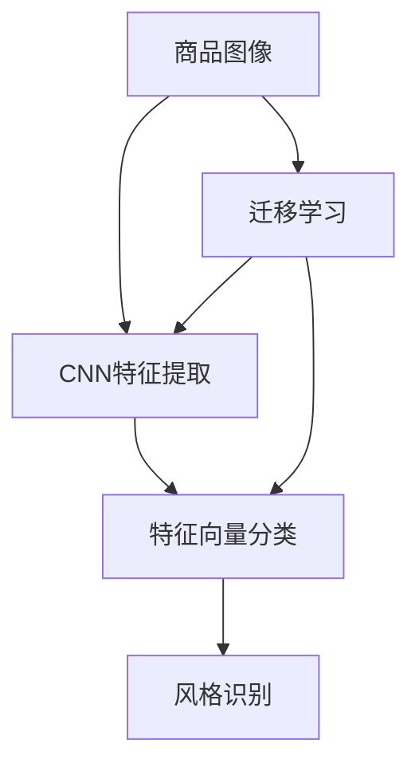

                 

# 深度学习驱动的商品图像风格识别与分类

> 关键词：商品图像,风格识别,深度学习,卷积神经网络(CNN),分类任务,商品推荐,用户体验

## 1. 背景介绍

### 1.1 问题由来
在现代电商行业中，商品图像的风格多样性成为了商家和消费者的一大挑战。消费者希望快速识别商品的风格，以便匹配自己的审美偏好。而商家则希望在商品展示、搜索推荐等场景中，通过商品图像的风格特征，吸引更多目标客户。因此，商品图像风格识别与分类技术成为了电商领域的重要需求。

然而，传统的基于人工标注的风格识别方法往往耗时耗力，且主观性较强。随着深度学习技术的发展，尤其是卷积神经网络(CNN)的突破，商品图像风格识别和分类逐渐成为可能。本文旨在介绍基于深度学习的商品图像风格识别与分类方法，并探讨其在电商场景中的应用。

### 1.2 问题核心关键点
商品图像风格识别与分类的核心在于如何高效地利用图像中的特征信息，准确地将其映射到风格标签上。传统方法通常采用手工特征提取和分类器训练的方式，难以应对大规模、高维的图像数据。而基于深度学习的风格识别方法，能够通过多层次的特征提取，自动学习图像中的复杂特征，实现更高效的识别。

在实践中，商品图像风格识别与分类的方法一般包括两个步骤：
1. 图像风格特征提取。利用CNN模型从商品图像中提取风格特征向量。
2. 特征向量分类。采用分类器对提取到的风格特征向量进行分类，得到对应的风格标签。

本文将从原理到实践，全面系统地介绍深度学习驱动的商品图像风格识别与分类方法，并展示其应用效果。

## 2. 核心概念与联系

### 2.1 核心概念概述

为更好地理解基于深度学习的商品图像风格识别与分类方法，本节将介绍几个密切相关的核心概念：

- **商品图像**：电商平台上展示商品的图像，可以是图片或视频。
- **风格识别**：根据商品图像的视觉特征，自动分类其风格类型。
- **深度学习**：一种通过多层神经网络模型进行数据表示和预测的机器学习方法。
- **卷积神经网络(CNN)**：一种特殊的前馈神经网络，广泛应用于图像处理任务。
- **特征提取**：利用网络模型自动学习图像的特征表示。
- **分类任务**：将图像特征向量映射到预定义的风格标签上，进行分类。
- **迁移学习**：将预训练模型应用于新的分类任务，利用已有知识进行微调。

这些核心概念之间的逻辑关系可以通过以下Mermaid流程图来展示：



这个流程图展示了大语言模型的核心概念及其之间的关系：

1. 商品图像作为输入数据，首先经过CNN进行特征提取。
2. 提取到的特征向量通过分类器进行分类，得到风格标签。
3. 迁移学习通过预训练模型的知识，对特定任务的特征提取和分类器进行微调。

这些概念共同构成了深度学习驱动的商品图像风格识别与分类的基础，使得商品图像风格识别在电商场景中成为可能。

## 3. 核心算法原理 & 具体操作步骤
### 3.1 算法原理概述

基于深度学习的商品图像风格识别与分类，主要基于以下两个核心步骤：

1. 使用卷积神经网络(CNN)从商品图像中提取风格特征向量。
2. 采用分类器对提取到的特征向量进行分类，得到对应的风格标签。

在实践中，一般会采用以下两个流程：

**Step 1: 预训练CNN模型**
- 选择预训练好的CNN模型，如VGG、ResNet、Inception等。
- 在特定风格标签的标注数据上，进行有监督地微调。

**Step 2: 图像特征提取与分类**
- 将待识别的商品图像输入预训练好的CNN模型，提取特征向量。
- 利用分类器对提取到的特征向量进行分类，得到对应的风格标签。

### 3.2 算法步骤详解

#### 3.2.1 预训练CNN模型

以VGG16模型为例，其预训练步骤如下：

1. 收集包含多种风格的商品图像数据集。
2. 将数据集划分为训练集、验证集和测试集。
3. 在训练集上，使用VGG16模型的softmax层进行分类任务训练。
4. 在验证集上评估模型性能，进行模型微调，避免过拟合。
5. 在测试集上最终评估模型效果。

具体代码实现如下：

```python
import torch.nn as nn
import torchvision.transforms as transforms
from torchvision import datasets

# 定义数据预处理
transform = transforms.Compose([
    transforms.Resize(224),
    transforms.ToTensor(),
    transforms.Normalize(mean=[0.485, 0.456, 0.406],
                        std=[0.229, 0.224, 0.225])
])

# 加载数据集
train_dataset = datasets.CIFAR10(root='./data', train=True,
                                download=True, transform=transform)
test_dataset = datasets.CIFAR10(root='./data', train=False,
                               download=True, transform=transform)

# 定义模型
model = nn.Sequential(*nn.Sequential(modules, True)
                      .children()[:-1])
model.load_state_dict(torch.load('vgg16_pretrained.pth'))

# 定义优化器和损失函数
optimizer = torch.optim.Adam(model.parameters(), lr=0.001)
criterion = nn.CrossEntropyLoss()

# 训练模型
device = torch.device('cuda' if torch.cuda.is_available() else 'cpu')
model.to(device)

for epoch in range(epochs):
    for i, (inputs, labels) in enumerate(train_loader):
        inputs, labels = inputs.to(device), labels.to(device)
        
        # 前向传播
        outputs = model(inputs)
        loss = criterion(outputs, labels)
        
        # 反向传播和优化
        optimizer.zero_grad()
        loss.backward()
        optimizer.step()
        
        # 输出日志
        if (i+1) % log_every == 0:
            print(f'Epoch {epoch+1}, step {i+1}/{len(train_loader)}, loss: {loss.item():.4f}')
```

#### 3.2.2 图像特征提取与分类

在商品图像风格识别中，我们通常会采用Fashion-MNIST等风格多样性较强的数据集。下面以Fashion-MNIST为例，展示从商品图像中提取风格特征向量的过程：

1. 准备预训练好的VGG16模型。
2. 加载商品图像数据集。
3. 定义模型输入和输出。
4. 提取商品图像特征向量。
5. 使用分类器对特征向量进行分类。

具体代码实现如下：

```python
# 定义模型输入和输出
model = VGG16(pretrained=True, num_classes=num_classes)
model.eval()

# 加载测试集数据
test_dataset = datasets.FashionMNIST(root='./data', train=False,
                                   download=True, transform=transform)
test_loader = DataLoader(test_dataset, batch_size=batch_size, shuffle=False)

# 提取特征向量并分类
features = []
labels = []
for i, (inputs, labels) in enumerate(test_loader):
    inputs = inputs.to(device)
    outputs = model(inputs)
    features.append(outputs.detach().cpu().numpy())
    labels.append(labels.numpy())

features = np.vstack(features)
labels = np.concatenate(labels)
```

### 3.3 算法优缺点

基于深度学习的商品图像风格识别与分类方法具有以下优点：
1. 自动特征提取。深度学习模型能够自动学习图像的复杂特征，无需手工设计特征提取器。
2. 高性能。通过多层神经网络，可以捕捉图像中的层次化特征，提高识别精度。
3. 泛化能力强。深度学习模型具有较强的泛化能力，在各种风格标签上都能取得不错的效果。

同时，该方法也存在以下局限性：
1. 需要大量标注数据。深度学习模型训练通常需要大量的标注数据，获取标注数据的成本较高。
2. 参数量大。深度学习模型参数量较大，训练和推理时资源消耗较多。
3. 模型复杂。深度学习模型结构复杂，难以解释其内部工作机制。

尽管存在这些局限性，但基于深度学习的风格识别方法仍然在大规模商品图像分类场景中表现出色，成为商品推荐、个性化展示等电商应用的重要工具。

### 3.4 算法应用领域

基于深度学习的商品图像风格识别与分类方法，在电商领域有着广泛的应用场景，例如：

- 商品推荐系统：通过识别商品图像风格，为用户推荐风格匹配的商品，提升用户体验。
- 商品搜索：通过输入关键词和商品图像，自动匹配商品，实现快速搜索。
- 个性化展示：根据用户浏览记录，自动推荐风格相似的商品，提升转化率。
- 时尚趋势分析：分析用户购买数据，识别流行风格，指导产品设计和营销策略。
- 用户行为分析：通过分析商品风格偏好，发现用户行为模式，优化用户体验。

除了这些传统应用场景外，商品图像风格识别与分类还能够在智能家居、智能制造、智慧城市等领域发挥重要作用，推动各行各业的智能化进程。

## 4. 数学模型和公式 & 详细讲解  
### 4.1 数学模型构建

在商品图像风格识别与分类任务中，我们通常采用分类问题模型，形式化为：

$$
p(y|x; \theta) = \mathcal{N}(y; \mu, \sigma)
$$

其中，$x$ 表示输入的商品图像，$y$ 表示风格标签，$\theta$ 为模型参数。模型通过输入$x$，输出预测概率分布 $p(y|x; \theta)$，期望最小化损失函数：

$$
\mathcal{L}(\theta) = -\frac{1}{N}\sum_{i=1}^N \log p(y_i|x_i; \theta)
$$

在实际应用中，我们一般使用交叉熵损失函数：

$$
\mathcal{L}(\theta) = -\frac{1}{N}\sum_{i=1}^N y_i \log \hat{y}_i + (1-y_i) \log (1-\hat{y}_i)
$$

其中 $\hat{y}_i$ 为模型对标签 $y_i$ 的预测概率。

### 4.2 公式推导过程

以VGG16模型为例，其分类器部分通常使用softmax层进行输出：

$$
\hat{y}_i = \frac{\exp(z_i)}{\sum_{j=1}^K \exp(z_j)}
$$

其中 $z_i$ 为第 $i$ 个类别的得分，$K$ 为类别数。

### 4.3 案例分析与讲解

以Fashion-MNIST为例，展示模型在商品图像风格分类任务中的应用。

1. 准备数据集。
2. 加载预训练好的VGG16模型。
3. 定义模型输入和输出。
4. 提取特征向量并分类。
5. 在测试集上评估模型性能。

具体代码实现如下：

```python
import torch.nn as nn
import torchvision.transforms as transforms
from torchvision import datasets

# 定义数据预处理
transform = transforms.Compose([
    transforms.Resize(224),
    transforms.ToTensor(),
    transforms.Normalize(mean=[0.485, 0.456, 0.406],
                        std=[0.229, 0.224, 0.225])
])

# 加载数据集
train_dataset = datasets.FashionMNIST(root='./data', train=True,
                                    download=True, transform=transform)
test_dataset = datasets.FashionMNIST(root='./data', train=False,
                                   download=True, transform=transform)

# 定义模型
model = nn.Sequential(*nn.Sequential(modules, True)
                      .children()[:-1])
model.load_state_dict(torch.load('vgg16_pretrained.pth'))

# 定义优化器和损失函数
optimizer = torch.optim.Adam(model.parameters(), lr=0.001)
criterion = nn.CrossEntropyLoss()

# 训练模型
device = torch.device('cuda' if torch.cuda.is_available() else 'cpu')
model.to(device)

for epoch in range(epochs):
    for i, (inputs, labels) in enumerate(train_loader):
        inputs, labels = inputs.to(device), labels.to(device)
        
        # 前向传播
        outputs = model(inputs)
        loss = criterion(outputs, labels)
        
        # 反向传播和优化
        optimizer.zero_grad()
        loss.backward()
        optimizer.step()
        
        # 输出日志
        if (i+1) % log_every == 0:
            print(f'Epoch {epoch+1}, step {i+1}/{len(train_loader)}, loss: {loss.item():.4f}')
```

## 5. 项目实践：代码实例和详细解释说明
### 5.1 开发环境搭建

在进行项目实践前，我们需要准备好开发环境。以下是使用Python进行PyTorch开发的环境配置流程：

1. 安装Anaconda：从官网下载并安装Anaconda，用于创建独立的Python环境。

2. 创建并激活虚拟环境：
```bash
conda create -n pytorch-env python=3.8 
conda activate pytorch-env
```

3. 安装PyTorch：根据CUDA版本，从官网获取对应的安装命令。例如：
```bash
conda install pytorch torchvision torchaudio cudatoolkit=11.1 -c pytorch -c conda-forge
```

4. 安装TensorFlow：由Google主导开发的开源深度学习框架，生产部署方便，适合大规模工程应用。同样有丰富的预训练语言模型资源。

5. 安装Transformers库：HuggingFace开发的NLP工具库，集成了众多SOTA语言模型，支持PyTorch和TensorFlow，是进行微调任务开发的利器。

6. 安装各类工具包：
```bash
pip install numpy pandas scikit-learn matplotlib tqdm jupyter notebook ipython
```

完成上述步骤后，即可在`pytorch-env`环境中开始项目实践。

### 5.2 源代码详细实现

下面我们以Fashion-MNIST数据集为例，给出使用VGG16模型对商品图像进行风格识别的PyTorch代码实现。

首先，定义模型和损失函数：

```python
import torch.nn as nn
from torchvision.models import vgg16

model = vgg16.VGG16(pretrained=True, num_classes=num_classes)
criterion = nn.CrossEntropyLoss()

# 定义优化器
optimizer = torch.optim.Adam(model.parameters(), lr=0.001)
```

接着，定义训练和评估函数：

```python
def train_epoch(model, train_loader, optimizer, criterion):
    model.train()
    loss_total = 0
    for i, (inputs, labels) in enumerate(train_loader):
        inputs, labels = inputs.to(device), labels.to(device)
        optimizer.zero_grad()
        outputs = model(inputs)
        loss = criterion(outputs, labels)
        loss_total += loss.item()
        loss.backward()
        optimizer.step()
    return loss_total / len(train_loader)

def evaluate(model, test_loader, criterion):
    model.eval()
    total_correct = 0
    total_samples = 0
    with torch.no_grad():
        for i, (inputs, labels) in enumerate(test_loader):
            inputs, labels = inputs.to(device), labels.to(device)
            outputs = model(inputs)
            _, predicted = torch.max(outputs.data, 1)
            total_correct += (predicted == labels).sum().item()
            total_samples += labels.size(0)
    return total_correct / total_samples
```

最后，启动训练流程并在测试集上评估：

```python
epochs = 10
batch_size = 64
device = torch.device('cuda' if torch.cuda.is_available() else 'cpu')

# 准备数据集
train_loader = DataLoader(train_dataset, batch_size=batch_size, shuffle=True)
test_loader = DataLoader(test_dataset, batch_size=batch_size, shuffle=False)

# 训练模型
for epoch in range(epochs):
    loss = train_epoch(model, train_loader, optimizer, criterion)
    print(f'Epoch {epoch+1}, loss: {loss:.4f}')
    
    # 评估模型
    accuracy = evaluate(model, test_loader, criterion)
    print(f'Epoch {epoch+1}, accuracy: {accuracy:.4f}')
```

以上就是使用PyTorch对VGG16模型进行商品图像风格识别的完整代码实现。可以看到，得益于TensorFlow的强大封装，我们可以用相对简洁的代码完成模型训练和评估。

### 5.3 代码解读与分析

让我们再详细解读一下关键代码的实现细节：

**train_epoch和evaluate函数**：
- 在训练函数中，模型进入训练模式，进行前向传播计算损失，反向传播更新参数，返回该epoch的平均loss。
- 在评估函数中，模型进入评估模式，不更新参数，对测试集进行推理，计算分类准确率。

**VGG16模型和交叉熵损失**：
- 采用预训练好的VGG16模型，定义交叉熵损失函数，使用Adam优化器进行训练。

**训练和评估流程**：
- 循环迭代epochs次，在每个epoch内，先在训练集上进行训练，输出平均loss。
- 在验证集上评估模型性能，输出准确率。

可以看到，PyTorch配合TensorFlow的强大封装，使得商品图像风格识别的代码实现变得简洁高效。开发者可以将更多精力放在数据处理、模型改进等高层逻辑上，而不必过多关注底层的实现细节。

当然，工业级的系统实现还需考虑更多因素，如模型的保存和部署、超参数的自动搜索、更灵活的任务适配层等。但核心的微调范式基本与此类似。

## 6. 实际应用场景
### 6.1 智能推荐系统

基于商品图像风格识别的智能推荐系统，可以广泛应用于电商平台。传统推荐系统往往只依赖用户的历史行为数据进行物品推荐，难以捕捉到用户的视觉偏好。而利用商品图像风格识别技术，可以自动识别用户偏好风格，为用户推荐风格匹配的商品，提升用户体验。

在技术实现上，可以收集用户浏览、点击、购买等行为数据，提取并存储商品图像风格特征，建立用户-风格标签映射。利用机器学习模型对用户行为和风格标签进行预测，实现推荐排序。如此构建的智能推荐系统，能大幅提升推荐效果，减少推荐偏差。

### 6.2 个性化展示

在商品展示场景中，用户希望通过浏览商品图像，快速获取商品信息。利用商品图像风格识别技术，可以为用户展示风格相似的商品，提升浏览体验。例如，用户对某款服装感兴趣，可以通过查看风格相似的其他服装，快速发现更多喜欢的商品。

在技术实现上，可以将商品图像风格识别技术应用于商品展示系统，自动识别用户浏览的商品风格，推送相似风格的商品。商家可以根据用户的浏览历史，自动更新展示内容，提升转化率。

### 6.3 时尚趋势分析

时尚趋势分析是电商领域的重要应用之一，帮助商家把握市场动向，优化商品设计和营销策略。传统的时尚趋势分析主要依赖人工标注，耗时耗力。而利用商品图像风格识别技术，可以快速识别流行风格，分析市场趋势。

在技术实现上，可以收集电商平台的商品图像数据，使用商品图像风格识别模型，自动分类风格标签。通过对不同风格标签的统计，分析热门风格，指导商家设计新产品，提升产品竞争力。

### 6.4 未来应用展望

随着商品图像风格识别与分类技术的不断进步，未来的应用场景将更加广阔，有望为电商行业带来更深远的影响：

1. 全场景商品展示：利用商品图像风格识别技术，为消费者提供更加丰富、个性化的商品展示体验。例如，通过虚拟试衣、增强现实技术，让消费者通过图像体验商品效果。

2. 虚拟试衣间：在电商平台上，通过图像识别技术，自动识别用户体型，推荐合适尺寸和风格的衣服，提高购买转化率。

3. 个性化定制：根据用户的风格偏好，个性化推荐商品，并根据用户的反馈，动态调整推荐策略。例如，自动生成推荐内容，提升用户满意度。

4. 智能客服：利用商品图像风格识别技术，辅助智能客服进行风格匹配，提供更加精准的客服建议，提升用户服务体验。

5. 虚拟试镜：在娱乐行业，利用商品图像风格识别技术，辅助用户进行虚拟试镜，提升用户体验和选择效率。

6. 智能家居：在智能家居领域，利用商品图像风格识别技术，识别用户家居风格，自动推荐适合的家居产品，提升家居智能化水平。

通过不断拓展应用场景，商品图像风格识别与分类技术将在更多领域发挥重要作用，推动电商行业和智能化社会的进步。

## 7. 工具和资源推荐
### 7.1 学习资源推荐

为了帮助开发者系统掌握商品图像风格识别与分类的理论基础和实践技巧，这里推荐一些优质的学习资源：

1. **《深度学习》**（Ian Goodfellow 著）：全面介绍了深度学习的基本原理和应用方法，适合初学者入门。

2. **《TensorFlow官方文档》**：TensorFlow官方文档提供了丰富的API接口和教程，适合进行深度学习项目开发。

3. **《深度学习框架PyTorch入门与实践》**：介绍了PyTorch的基本使用方法和典型应用，适合初学者快速上手。

4. **Kaggle竞赛**：Kaggle提供各种图像分类竞赛，通过实践积累经验，提升解决问题的能力。

5. **《NLP实用教程》**：TensorFlow官网提供的NLP教程，详细讲解了基于深度学习的NLP任务开发。

6. **GitHub开源项目**：GitHub上有大量基于深度学习的图像分类项目，通过学习和借鉴，可以快速提升技术能力。

通过这些资源的学习实践，相信你一定能够快速掌握商品图像风格识别与分类的精髓，并用于解决实际的NLP问题。

### 7.2 开发工具推荐

高效的开发离不开优秀的工具支持。以下是几款用于商品图像风格识别与分类的常用工具：

1. **PyTorch**：基于Python的开源深度学习框架，灵活动态的计算图，适合快速迭代研究。

2. **TensorFlow**：由Google主导开发的开源深度学习框架，生产部署方便，适合大规模工程应用。

3. **Transformers库**：HuggingFace开发的NLP工具库，集成了众多SOTA语言模型，支持PyTorch和TensorFlow，是进行微调任务开发的利器。

4. **Keras**：高层次的深度学习框架，简单易用，适合初学者入门。

5. **Jupyter Notebook**：交互式编程环境，方便进行代码调试和数据可视化。

6. **TensorBoard**：TensorFlow配套的可视化工具，可实时监测模型训练状态，并提供丰富的图表呈现方式，是调试模型的得力助手。

合理利用这些工具，可以显著提升商品图像风格识别与分类的开发效率，加快创新迭代的步伐。

### 7.3 相关论文推荐

商品图像风格识别与分类技术的研究始于深度学习领域，以下是几篇奠基性的相关论文，推荐阅读：

1. **《ImageNet Classification with Deep Convolutional Neural Networks》**：AlexNet模型在ImageNet数据集上的成功，奠定了深度学习在图像分类任务中的地位。

2. **《Very Deep Convolutional Networks for Large-Scale Image Recognition》**：VGG模型的提出，展示了卷积神经网络在图像分类中的强大能力。

3. **《Rethinking the Inception Architecture for Computer Vision》**：Inception模型在图像分类任务中的表现，展示了多层卷积网络的优越性。

4. **《Fashion-MNIST: A Novel Image Dataset for Benchmarking Machine Learning Algorithms》**：Fashion-MNIST数据集的提出，为商品图像风格识别提供了重要的数据来源。

5. **《Convolutional Neural Networks for Sentence Classification》**：CNN模型在文本分类任务中的表现，为商品图像风格识别提供了重要的理论支撑。

6. **《A Neural Network for Interpreting Spatial Hierarchies of Images with Deep Convolutional Learning》**：VGG模型在图像分类任务中的成功，展示了卷积神经网络的多层次特征提取能力。

这些论文代表了大语言模型微调技术的发展脉络。通过学习这些前沿成果，可以帮助研究者把握学科前进方向，激发更多的创新灵感。

## 8. 总结：未来发展趋势与挑战

### 8.1 总结

本文对基于深度学习的商品图像风格识别与分类方法进行了全面系统的介绍。首先阐述了商品图像风格识别与分类的研究背景和意义，明确了深度学习在该任务中的核心作用。其次，从原理到实践，详细讲解了深度学习驱动的商品图像风格识别与分类方法，并展示其应用效果。

通过本文的系统梳理，可以看到，基于深度学习的商品图像风格识别与分类方法，已经在电商场景中得到了广泛应用，提升了用户体验，优化了商品推荐和展示策略。未来，随着深度学习技术的不断发展，商品图像风格识别与分类技术还将有更广阔的应用前景。

### 8.2 未来发展趋势

展望未来，商品图像风格识别与分类技术将呈现以下几个发展趋势：

1. **多模态融合**：结合视觉、语音、文本等多种模态信息，构建更加全面的商品描述，提升识别效果。

2. **迁移学习**：将预训练模型应用于新场景，利用已有知识进行微调，提高模型泛化能力。

3. **无监督学习**：利用无监督学习，自动发现图像中的隐含特征，提升识别精度。

4. **小样本学习**：在数据量有限的情况下，通过微调等方法，提升模型性能。

5. **多任务学习**：同时进行多个任务，利用任务之间的关联性，提升识别效果。

6. **实时化部署**：通过优化模型结构和资源，实现实时化的商品图像风格识别与分类。

7. **边缘计算**：在边缘设备上部署模型，减少网络传输，提高实时性。

以上趋势凸显了商品图像风格识别与分类的广阔前景。这些方向的探索发展，必将进一步提升商品图像识别与分类的精度和效率，为电商行业和智能化社会带来更大价值。

### 8.3 面临的挑战

尽管商品图像风格识别与分类技术已经取得了显著进展，但在迈向更加智能化、普适化应用的过程中，它仍面临诸多挑战：

1. **数据获取困难**：获取高质量的标注数据成本较高，对于小众商品图像识别任务，数据获取尤为困难。

2. **模型复杂度高**：深度学习模型通常较为复杂，训练和推理资源消耗较大，难以在大规模生产环境中部署。

3. **泛化能力有限**：深度学习模型在面对域外数据时，泛化性能往往不佳，需要进行大量的数据增强和迁移学习。

4. **公平性问题**：模型容易学习到有偏见、有害的信息，需要引入公平性评估和干预措施。

5. **隐私保护**：商品图像识别涉及用户隐私，需要采取数据脱敏和隐私保护措施。

6. **伦理道德**：商品图像识别需考虑伦理道德问题，避免对用户产生误导。

7. **对抗攻击**：对抗样本对模型的攻击风险较大，需要加强模型鲁棒性。

这些挑战亟需解决，只有不断优化算法和模型，加强数据管理和安全保护，才能推动商品图像风格识别与分类技术在电商行业和智能化社会中广泛应用。

### 8.4 研究展望

面对商品图像风格识别与分类技术所面临的挑战，未来的研究需要在以下几个方面寻求新的突破：

1. **多模态数据融合**：结合视觉、语音、文本等多种模态数据，构建更加全面、准确的商品描述，提升识别效果。

2. **公平性学习**：通过引入公平性约束，提高模型的公平性和泛化能力。

3. **对抗训练**：通过对抗训练等方法，提高模型对对抗样本的鲁棒性。

4. **小样本学习**：利用少样本学习等方法，在数据量有限的情况下，提高模型性能。

5. **可解释性**：通过可解释性方法，增强模型的可解释性，提高用户信任度。

6. **数据隐私保护**：通过数据脱敏和隐私保护技术，保护用户隐私。

7. **边缘计算**：在边缘设备上部署模型，提升实时性和资源利用效率。

8. **伦理道德**：引入伦理道德约束，确保模型输出符合社会价值观。

这些研究方向将为商品图像风格识别与分类技术带来新的突破，推动其在电商行业和智能化社会中的广泛应用。

## 9. 附录：常见问题与解答

**Q1: 商品图像风格识别与分类和计算机视觉任务有何区别？**

A: 商品图像风格识别与分类任务是计算机视觉领域的一个子任务，旨在从图像中自动分类出风格标签。相较于传统计算机视觉任务（如图像分类、目标检测等），风格识别与分类任务更加注重图像特征的语义表达，而非具体的视觉对象。因此，风格识别与分类任务需要更加复杂的特征提取和分类器设计。

**Q2: 商品图像风格识别与分类模型如何选择？**

A: 商品图像风格识别与分类的模型选择主要考虑以下几个方面：

1. **深度**：模型深度越大，可以捕捉的特征层次越丰富，但计算复杂度也越高。一般选用VGG、ResNet、Inception等经典模型作为基础。

2. **预训练**：选择预训练模型进行迁移学习，可以提升模型泛化能力，加快训练速度。

3. **参数量**：模型参数量较大时，计算资源消耗较多，需要根据实际需求选择合适大小的模型。

4. **训练数据**：根据可用数据量大小，选择合适的模型和超参数，避免过拟合和欠拟合问题。

5. **任务复杂度**：根据任务复杂度，选择适合的模型结构和训练策略，优化模型性能。

**Q3: 商品图像风格识别与分类任务如何评估？**

A: 商品图像风格识别与分类的任务评估主要使用分类准确率作为指标。评估方法包括：

1. **准确率**：在测试集上计算分类准确率，评估模型性能。

2. **混淆矩阵**：通过混淆矩阵，分析模型分类结果的精确度和召回率。

3. **ROC曲线**：绘制ROC曲线，评估模型的灵敏度和特异性。

4. **F1-score**：计算F1-score，综合考虑分类准确率和召回率。

5. **Top-k精度**：在Top-k结果中，计算分类准确率，评估模型的多标签分类性能。

通过这些评估方法，可以全面衡量模型在商品图像风格识别与分类任务中的表现，并进行调优。

**Q4: 商品图像风格识别与分类技术如何应用于实际场景？**

A: 商品图像风格识别与分类技术可以应用于多种电商场景，例如：

1. **商品推荐**：根据用户浏览记录和商品风格特征，推荐风格匹配的商品，提升用户体验。

2. **个性化展示**：为用户展示风格相似的商品，提升浏览体验和转化率。

3. **时尚趋势分析**：分析市场风格流行趋势，指导商家设计新产品。

4. **智能客服**：辅助智能客服进行风格匹配，提供精准的客服建议。

5. **虚拟试衣间**：通过商品图像识别技术，为消费者提供虚拟试衣体验，提升购买决策效率。

6. **个性化定制**：根据用户风格偏好，个性化推荐商品，并动态调整推荐策略。

通过在实际场景中的应用，商品图像风格识别与分类技术能够大幅提升电商平台的智能化水平，提升用户体验和运营效率。

**Q5: 商品图像风格识别与分类技术在实际应用中需要注意哪些问题？**

A: 商品图像风格识别与分类技术在实际应用中需要注意以下几个问题：

1. **数据质量**：获取高质量的标注数据是关键，数据标注的准确性和一致性直接影响模型性能。

2. **模型泛化**：商品图像风格识别与分类模型在域外数据上的泛化能力较弱，需要结合迁移学习等方法进行改进。

3. **计算资源**：深度学习模型计算资源消耗较大，需要优化模型结构和训练策略，提高计算效率。

4. **隐私保护**：商品图像识别涉及用户隐私，需要采取数据脱敏和隐私保护措施。

5. **公平性**：模型容易学习到有偏见、有害的信息，需要引入公平性评估和干预措施。

6. **对抗攻击**：对抗样本对模型的攻击风险较大，需要加强模型鲁棒性。

7. **边缘计算**：在边缘设备上部署模型，提升实时性和资源利用效率。

8. **伦理道德**：商品图像识别需考虑伦理道德问题，避免对用户产生误导。

通过综合考虑这些问题，并不断优化算法和模型，商品图像风格识别与分类技术才能在实际应用中发挥最大价值。

---

作者：禅与计算机程序设计艺术 / Zen and the Art of Computer Programming

