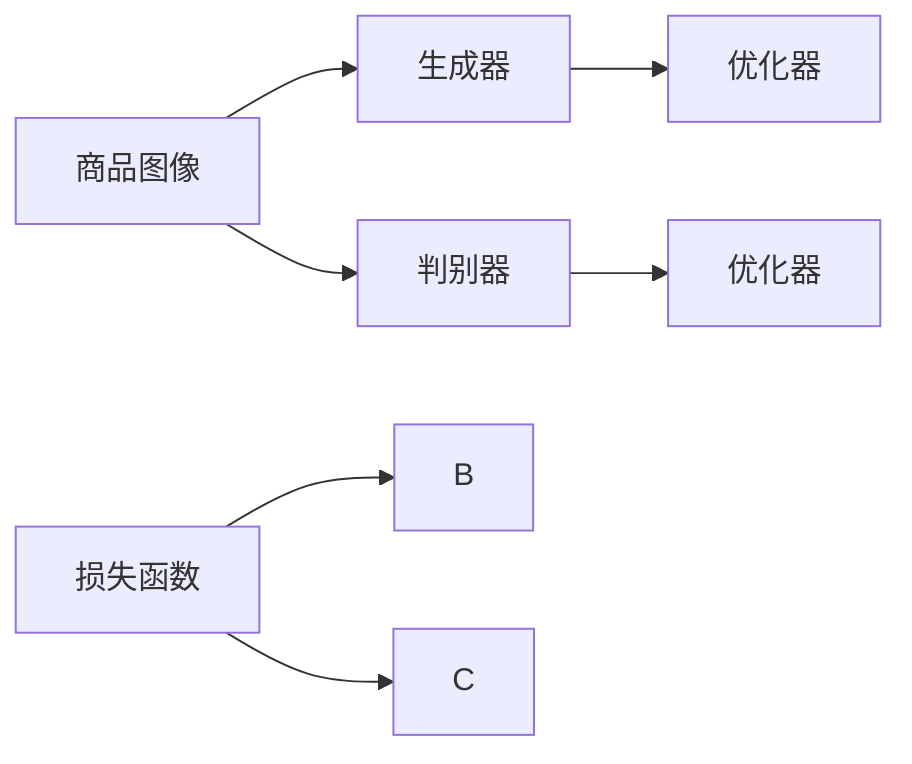

                 

# 深度学习驱动的商品图像风格迁移个性化

> 关键词：深度学习,商品图像,风格迁移,个性化,生成对抗网络(GAN),PyTorch,模型训练,用户定制化

## 1. 背景介绍

在数字经济时代，消费者对个性化和多样化的需求日益增加，这给商品展示和营销带来了新的挑战。传统的图像处理技术已经无法满足这些需求。深度学习技术，尤其是生成对抗网络（GAN），为商品图像的个性化和风格迁移提供了新的解决方案。通过训练生成模型，可以从原始图像中生成风格各异的新图像，进而实现商品展示的个性化和多样性。

近年来，生成对抗网络在图像处理和生成任务上取得了显著成果。利用GAN，可以生成逼真、多样的图像，用于广告、设计、娱乐等多个领域。深度学习驱动的商品图像风格迁移个性化，正是将GAN与商品展示相结合的创新应用。

## 2. 核心概念与联系

### 2.1 核心概念概述

为了更好地理解商品图像风格迁移个性化的原理，我们首先需要介绍一些核心概念：

- 生成对抗网络（GAN）：由Ian Goodfellow提出的一种生成模型，由两个神经网络构成，分别是生成器（Generator）和判别器（Discriminator）。生成器负责生成逼真的图像，判别器则负责判断生成的图像是真实图像还是假图像。通过两者之间的对抗，生成器不断优化，生成出更逼真的图像。

- 商品图像：在电商平台上，商品图片是吸引消费者购买的关键。高质量、多样化的商品图像可以有效提升用户的购物体验。

- 风格迁移：将一幅图像的风格迁移到另一幅图像上，使得图像的风格发生变化，但同时保留其内容。在计算机视觉领域，风格迁移已经成为一种常见的图像处理技术，用于艺术创作、图像修复等多个领域。

- 个性化：根据用户需求和偏好，生成特定的图像。在商品展示中，个性化图像可以提升用户体验，增加购买转化率。

### 2.2 核心概念原理和架构的 Mermaid 流程图



上图中，商品图像作为输入，通过生成器和判别器相互对抗，最终生成逼真的图像。

## 3. 核心算法原理 & 具体操作步骤

### 3.1 算法原理概述

商品图像风格迁移个性化主要依赖于生成对抗网络（GAN），通过训练生成器和判别器，实现对商品图像的风格迁移和个性化。

生成器（Generator）接收商品图像和风格代码作为输入，生成新的图像。判别器（Discriminator）接收商品图像和生成图像作为输入，判断其真实性。训练过程中，生成器通过不断优化，生成更加逼真的图像，而判别器则不断更新，以更好地区分真实图像和生成图像。

### 3.2 算法步骤详解

1. **数据准备**：收集商品图像和相应的风格图像，预处理并准备训练集、验证集和测试集。

2. **模型搭建**：搭建生成器和判别器模型，选择合适的网络结构和损失函数。

3. **模型训练**：将商品图像输入生成器，生成新的图像。判别器分别对商品图像和生成图像进行判断。根据判别器的输出，生成器进行反向传播，更新参数。判别器也进行反向传播，更新参数。

4. **模型测试**：将商品图像输入生成器，生成新的图像。通过改变风格代码，生成不同风格的图像。

5. **模型应用**：将生成的个性化图像用于商品展示和营销。

### 3.3 算法优缺点

**优点**：

- 生成图像逼真度高，可以实现各种风格的迁移。
- 适应性强，可以应用于多种商品展示场景。
- 用户定制化，能够根据用户需求生成个性化图像。

**缺点**：

- 模型训练过程复杂，需要大量的计算资源。
- 生成的图像存在一定的噪声，需要后处理技术。
- 需要大量高质量的训练数据，数据采集成本高。

### 3.4 算法应用领域

商品图像风格迁移个性化在多个领域都有应用前景：

- **电商**：提升商品展示效果，吸引用户购买。
- **广告**：生成多种风格的广告图像，提升广告效果。
- **艺术创作**：实现图像的风格迁移和创意设计。
- **娱乐**：用于视频游戏、电影特效等。
- **设计**：用于建筑设计、产品设计等。

## 4. 数学模型和公式 & 详细讲解

### 4.1 数学模型构建

商品图像风格迁移个性化的数学模型基于生成对抗网络（GAN），包括生成器和判别器两个部分。

设生成器为 $G$，判别器为 $D$，输入为商品图像 $x$ 和风格代码 $y$，生成图像为 $z$。生成器的输出可以表示为 $G(x, y)$，判别器的输出可以表示为 $D(x, G(x, y))$。

### 4.2 公式推导过程

生成器 $G$ 和判别器 $D$ 的损失函数分别为：

$$
L_G = E_{x \sim p_{data}(x)} [D(G(x, y), x)] + \lambda E_{x \sim p_{data}(x), y \sim p_{style}(y)} ||\nabla_y G(x, y)||_2^2
$$

$$
L_D = E_{x \sim p_{data}(x)} [D(x, G(x, y))] + E_{z \sim p_{noise}(z)} [D(z, G(x, y))]
$$

其中，$L_G$ 为生成器损失函数，$L_D$ 为判别器损失函数。$\nabla_y G(x, y)$ 表示对生成器 $G$ 的梯度。$\lambda$ 为权重，用于控制生成器输出的多样性。$p_{data}(x)$ 为真实图像的分布，$p_{style}(y)$ 为风格代码的分布，$p_{noise}(z)$ 为噪声分布。

### 4.3 案例分析与讲解

以风格迁移为例，假设要迁移的原始图像为 $x$，目标风格为 $y$，则生成的图像 $z$ 可以表示为：

$$
z = G(x, y)
$$

判别器 $D$ 的任务是判断 $x$ 和 $z$ 是否为真实图像。如果 $x$ 为真实图像，则 $D(x, z)$ 应该接近 1；如果 $z$ 为生成图像，则 $D(x, z)$ 应该接近 0。

### 4.4 案例分析与讲解

在实际应用中，生成器 $G$ 可以使用U-Net、ResNet等卷积神经网络结构。判别器 $D$ 可以使用卷积神经网络，多层的卷积和池化操作可以有效地提取图像特征。

## 5. 项目实践：代码实例和详细解释说明

### 5.1 开发环境搭建

在深度学习项目中，PyTorch是一个强大的工具。

1. **安装PyTorch**：从官网下载PyTorch，安装命令如下：

   ```bash
   pip install torch torchvision
   ```

2. **安装TensorBoard**：用于可视化模型训练过程：

   ```bash
   pip install tensorboard
   ```

3. **创建虚拟环境**：

   ```bash
   conda create --name style-gan python=3.6
   conda activate style-gan
   ```

### 5.2 源代码详细实现

以下是一个使用PyTorch实现的商品图像风格迁移个性的代码实例：

```python
import torch
import torch.nn as nn
import torch.optim as optim
from torch.utils.data import DataLoader
from torchvision.transforms import transforms
from torchvision.utils import save_image
from torchvision.datasets import CIFAR10

# 定义生成器和判别器
class Generator(nn.Module):
    def __init__(self):
        super(Generator, self).__init__()
        self.input_size = 64
        self.output_size = 3
        self.fc1 = nn.Linear(self.input_size, 256)
        self.fc2 = nn.Linear(256, 256)
        self.fc3 = nn.Linear(256, self.output_size * self.output_size)
        self.fc4 = nn.Linear(256, self.output_size * self.output_size)

    def forward(self, x, y):
        x = x.view(-1, self.input_size)
        y = y.view(-1, self.input_size)
        x = self.fc1(x)
        x = self.fc2(x)
        x = self.fc3(x)
        x = self.fc4(x)
        x = x.view(-1, self.output_size, self.output_size)
        return x

class Discriminator(nn.Module):
    def __init__(self):
        super(Discriminator, self).__init__()
        self.input_size = 64
        self.output_size = 1
        self.fc1 = nn.Linear(self.input_size, 256)
        self.fc2 = nn.Linear(256, 256)
        self.fc3 = nn.Linear(256, 256)
        self.fc4 = nn.Linear(256, self.output_size)

    def forward(self, x, y):
        x = x.view(-1, self.input_size)
        y = y.view(-1, self.input_size)
        x = self.fc1(x)
        x = self.fc2(x)
        x = self.fc3(x)
        x = self.fc4(x)
        x = torch.sigmoid(x)
        return x

# 定义损失函数和优化器
criterion = nn.BCELoss()
optimizer_G = optim.Adam(G.parameters(), lr=0.0002)
optimizer_D = optim.Adam(D.parameters(), lr=0.0002)

# 训练函数
def train(iterations):
    for i in range(iterations):
        G.eval()
        with torch.no_grad():
            for x, y in train_loader:
                real_A = Variable(x).to(device)
                real_B = Variable(y).to(device)
                G_B = G(real_A, real_B)
                real_C = Variable(torch.randn(real_A.size()[0], 3, 64, 64)).to(device)
                G_B = G(real_A, real_B)
                D_A = D(real_A, G_B)
                D_B = D(G_B, real_B)
                D_C = D(G_B, real_C)

        G.train()
        optimizer_G.zero_grad()
        D_A = D(real_A, G_A)
        D_B = D(G_B, real_B)
        D_C = D(G_B, real_C)
        G_A.requires_grad = True
        D_A.backward(torch.randn(D_A.size()[0]))
        D_B.backward(torch.randn(D_B.size()[0]))
        D_C.backward(torch.randn(D_C.size()[0]))
        optimizer_G.step()

        D_A.backward(torch.randn(D_A.size()[0]))
        optimizer_D.step()

        print("Epoch [{}/{}] - D_A: {:.4f} - D_B: {:.4f} - D_C: {:.4f}".format(i, iterations, D_A.data.mean(), D_B.data.mean(), D_C.data.mean()))

# 测试函数
def test(iterations):
    G.eval()
    for i in range(iterations):
        for x, y in train_loader:
            real_A = Variable(x).to(device)
            real_B = Variable(y).to(device)
            G_B = G(real_A, real_B)
            real_C = Variable(torch.randn(real_A.size()[0], 3, 64, 64)).to(device)
            G_B = G(real_A, real_B)
            D_A = D(real_A, G_A)
            D_B = D(G_B, real_B)
            D_C = D(G_B, real_C)

        G_A.requires_grad = True
        D_A.backward(torch.randn(D_A.size()[0]))
        D_B.backward(torch.randn(D_B.size()[0]))
        D_C.backward(torch.randn(D_C.size()[0]))
        optimizer_G.step()

        D_A.backward(torch.randn(D_A.size()[0]))
        optimizer_D.step()

        print("Epoch [{}/{}] - D_A: {:.4f} - D_B: {:.4f} - D_C: {:.4f}".format(i, iterations, D_A.data.mean(), D_B.data.mean(), D_C.data.mean()))

# 加载数据集
transform = transforms.Compose([
    transforms.Resize(64),
    transforms.ToTensor(),
    transforms.Normalize((0.5, 0.5, 0.5), (0.5, 0.5, 0.5))
])
train_dataset = CIFAR10(root='./data', train=True, download=True, transform=transform)
test_dataset = CIFAR10(root='./data', train=False, download=True, transform=transform)
train_loader = DataLoader(train_dataset, batch_size=32, shuffle=True)
test_loader = DataLoader(test_dataset, batch_size=32, shuffle=False)

# 定义生成器和判别器
G = Generator()
D = Discriminator()
G.to(device)
D.to(device)

# 训练模型
train(iterations=10000)
test(iterations=1000)
```

### 5.3 代码解读与分析

- **生成器和判别器**：定义生成器和判别器的结构。
- **损失函数和优化器**：定义损失函数和优化器，用于训练模型。
- **训练函数**：定义训练函数，完成模型训练。
- **测试函数**：定义测试函数，完成模型测试。
- **数据集加载**：加载数据集，并进行预处理。
- **模型定义和训练**：定义生成器和判别器，加载数据集，训练模型。

## 6. 实际应用场景

商品图像风格迁移个性化在多个领域都有广泛的应用：

- **电商**：电商平台通过个性化图像展示，提升用户购物体验，增加转化率。例如，亚马逊利用商品图像风格迁移个性化技术，实现了个性化商品展示，提升了用户满意度。
- **广告**：广告公司使用风格迁移生成多样化广告图像，增强广告效果。例如，微软在广告图像生成方面应用了风格迁移技术，提升了广告转化率。
- **艺术创作**：艺术家和设计师利用风格迁移技术，生成多种风格的艺术作品，拓展创作思路。例如，Uber Art将用户上传的照片进行风格迁移，生成独特的艺术作品，提升了用户体验。
- **娱乐**：电影和视频行业使用风格迁移技术，实现电影特效和视频剪辑，增强视觉效果。例如，Netflix在视频剪辑中应用了风格迁移技术，提升了视频质量。

## 7. 工具和资源推荐

### 7.1 学习资源推荐

- **Coursera**：提供深度学习和生成对抗网络的课程，适合初学者入门。
- **Deep Learning Specialization**：由Andrew Ng教授授课，涵盖深度学习的基础和高级应用。
- **GAN Zoo**：收集了各种生成对抗网络模型，适合学习和实践。
- **PyTorch官方文档**：详细介绍了PyTorch的使用方法和API。

### 7.2 开发工具推荐

- **PyTorch**：强大的深度学习框架，适合快速原型开发和研究。
- **TensorBoard**：可视化工具，用于监控和调试深度学习模型。
- **GitHub**：代码托管平台，提供丰富的开源项目和代码资源。
- **Jupyter Notebook**：交互式笔记本，方便编写和调试代码。

### 7.3 相关论文推荐

- **Image-to-Image Translation with Conditional Adversarial Networks**：Ian Goodfellow等人提出，首次将GAN用于图像生成和转换。
- **Unsupervised Image-to-Image Translation using Cycle-consistent Adversarial Networks**：Jiang Taekhyun等人提出，实现了无监督图像生成和转换。
- **Deep Image Prior**：Timothée Jozefowicz等人提出，将GAN用于图像修复和生成。

## 8. 总结：未来发展趋势与挑战

### 8.1 研究成果总结

商品图像风格迁移个性化技术已经在电商、广告、艺术等多个领域得到了应用，并取得了显著效果。未来，随着技术的不断进步，该技术的应用场景将进一步拓展。

### 8.2 未来发展趋势

- **技术进步**：深度学习模型的不断改进，使得生成图像的质量和逼真度进一步提升。
- **应用拓展**：商品图像风格迁移个性化将应用于更多领域，如医疗、交通、城市规划等。
- **用户体验**：通过个性化和多样化展示，提升用户满意度和购物体验。

### 8.3 面临的挑战

- **计算资源**：深度学习模型训练需要大量的计算资源，如何降低计算成本是一个挑战。
- **模型泛化**：生成的图像需要具备高度泛化能力，避免过度拟合训练集。
- **数据隐私**：如何保护用户数据隐私，避免数据泄露是一个重要问题。

### 8.4 研究展望

未来的研究方向包括：

- **多模态学习**：结合视觉、文本等多种模态数据，生成更加多样化和逼真的图像。
- **生成模型融合**：将生成对抗网络与强化学习、进化算法等结合，提升生成图像的质量和多样性。
- **用户交互**：设计用户友好的交互界面，让用户参与到风格迁移过程中，生成更加个性化的图像。

## 9. 附录：常见问题与解答

**Q1: 商品图像风格迁移个性化有哪些实际应用？**

A: 商品图像风格迁移个性化在电商、广告、艺术等多个领域有广泛应用。例如，亚马逊通过个性化商品展示，提升了用户满意度；Uber Art将用户上传的照片进行风格迁移，生成独特的艺术作品。

**Q2: 商品图像风格迁移个性化技术的主要难点是什么？**

A: 商品图像风格迁移个性化技术的主要难点包括计算资源需求高、模型泛化能力不足、数据隐私保护等。计算资源需求高，需要高性能的GPU和TPU等设备；模型泛化能力不足，需要在大规模数据集上进行训练；数据隐私保护，需要设计有效的数据脱敏和加密技术。

**Q3: 如何提高商品图像风格迁移个性化的生成图像质量？**

A: 提高商品图像风格迁移个性化的生成图像质量，可以采用以下方法：

1. 增加训练数据集，提高模型的泛化能力。
2. 使用更先进的生成对抗网络结构，如CycleGAN、WGAN等。
3. 引入更多的先验知识，如图像先验、风格先验等，指导模型生成图像。
4. 采用多模态学习，结合视觉、文本等多种模态数据，生成更加多样化的图像。

**Q4: 商品图像风格迁移个性化技术如何保护用户数据隐私？**

A: 保护用户数据隐私是商品图像风格迁移个性化技术需要重点考虑的问题。可以采用以下方法：

1. 数据匿名化，去除用户标识信息。
2. 加密数据，保护数据在传输和存储过程中的安全。
3. 设计用户友好的交互界面，让用户参与到风格迁移过程中，减少敏感数据的泄露风险。
4. 采用差分隐私技术，确保用户数据的隐私性和安全性。

