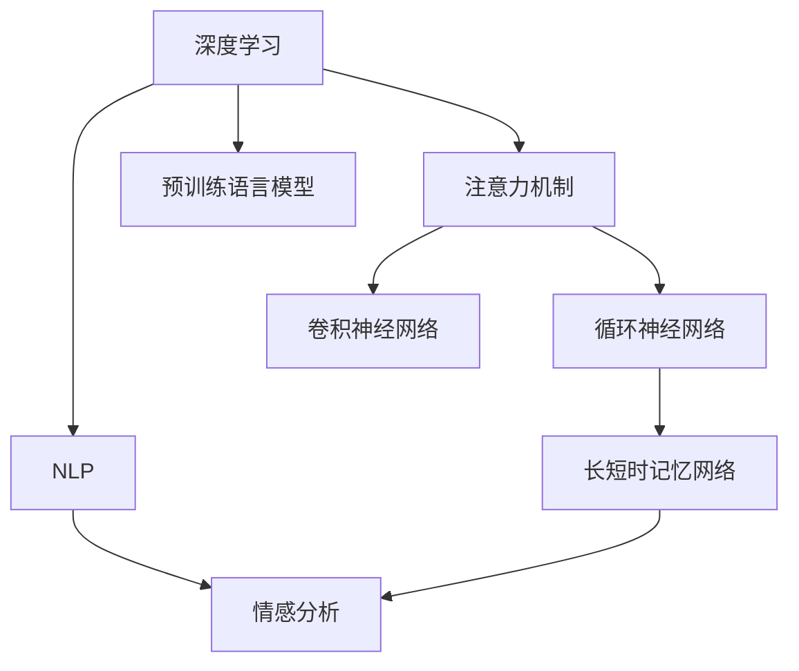

                 

# 深度学习驱动的商品评论情感分析

## 1. 背景介绍

### 1.1 问题由来

随着电子商务的蓬勃发展，商品评论已成为消费者购买决策的重要参考来源。对于电商平台而言，有效分析商品评论中的情感信息，不仅有助于提升用户体验，还能为商家提供市场洞察，促进商品优化和精准营销。传统的情感分析方法多依赖于规则和词典，难以捕捉复杂语义和语境，且对人工标注的依赖较高。深度学习技术的引入，特别是自然语言处理(NLP)领域的进展，为商品评论情感分析带来了新契机。

### 1.2 问题核心关键点

深度学习在商品评论情感分析中的应用，主要体现在以下几个方面：

- 深度模型强大的表征能力：深度学习模型，尤其是神经网络，能够从大数据中学习到复杂的语言模式，有效捕捉商品评论中的情感信息。
- 自动标注能力：利用预训练语言模型，可以实现自动标注，减少人工干预，提高标注效率。
- 数据高效利用：深度学习模型能够从原始文本中学习到丰富的语义信息，利用少量标注数据即可完成高性能的情感分析。
- 应用广泛性：深度学习方法不仅适用于商品评论情感分析，还可扩展至用户评论、服务评价等多个场景，具有广泛的适用性。

### 1.3 问题研究意义

商品评论情感分析不仅有助于电商平台提升用户满意度，还对商家优化产品、改进服务、制定营销策略具有重要参考价值。深度学习技术的应用，使得情感分析更加高效、精准，降低了人工成本，提升了分析的自动化程度，推动了NLP技术的产业化进程。

## 2. 核心概念与联系

### 2.1 核心概念概述

为更好地理解基于深度学习的商品评论情感分析，本节将介绍几个核心概念：

- 深度学习(DL)：基于神经网络的机器学习方法，通过多层次的特征提取和抽象，实现复杂模式的学习。
- 自然语言处理(NLP)：使计算机理解、解释和生成人类语言的技术，包括文本分类、命名实体识别、情感分析等。
- 情感分析(Sentiment Analysis)：对文本中的情感进行识别和分类，通常分为正面、负面和中性三种情感类别。
- 预训练语言模型(Pre-trained Language Model)：在大规模无标签文本数据上预训练得到的模型，具有强大的语言理解能力。
- 注意力机制(Attention Mechanism)：深度学习中的一种机制，通过将模型输出中的不同部分赋予不同权重，增强模型对重要信息的关注。
- 卷积神经网络(CNN)：一种广泛用于图像处理的深度学习模型，可应用于文本特征提取。
- 循环神经网络(RNN)：一种能处理序列数据的神经网络模型，适合处理商品评论等时间序列数据。
- 长短时记忆网络(LSTM)：一种特殊的RNN，具有记忆能力，适用于处理长文本序列。

这些核心概念之间的逻辑关系可以通过以下Mermaid流程图来展示：



这个流程图展示了深度学习、自然语言处理和情感分析三者之间的联系，以及预训练语言模型和注意力机制、卷积神经网络、循环神经网络、长短时记忆网络等深度学习模型是如何促进情感分析任务的。

## 3. 核心算法原理 & 具体操作步骤
### 3.1 算法原理概述

基于深度学习的商品评论情感分析，其核心思想是通过深度神经网络模型，学习商品评论文本中的情感信息，并将其映射为特定的情感类别。

具体而言，该过程分为两步：

1. 预训练阶段：使用大规模无标签的商品评论文本，训练预训练语言模型，使其能够学习到通用的语言表示。
2. 微调阶段：在预训练模型的基础上，使用带有情感标签的商品评论文本，通过有监督学习调整模型参数，使其能够准确识别评论中的情感信息。

### 3.2 算法步骤详解

基于深度学习的商品评论情感分析一般包括以下几个关键步骤：

**Step 1: 准备数据集**
- 收集商品评论文本，并标注情感标签。情感标签通常为正向、负向或中性。
- 对数据集进行划分，分为训练集、验证集和测试集。训练集用于模型训练，验证集用于参数调优，测试集用于最终评估。

**Step 2: 构建深度学习模型**
- 选择适合的深度学习模型，如卷积神经网络(CNN)、循环神经网络(RNN)、长短时记忆网络(LSTM)或Transformer模型。
- 对模型进行初始化，设置超参数，如学习率、批大小、迭代轮数等。

**Step 3: 数据预处理**
- 对文本进行分词、清洗、向量化等预处理，生成模型所需的输入特征。
- 使用词嵌入技术，将文本转换为向量表示，提高模型对语义的理解能力。

**Step 4: 模型训练**
- 使用训练集数据，将文本特征和情感标签输入模型，进行前向传播和反向传播，更新模型参数。
- 在每个epoch结束时，使用验证集评估模型性能，根据评估结果调整模型参数。
- 重复训练直至模型收敛或达到预设的迭代轮数。

**Step 5: 模型评估**
- 使用测试集数据，评估模型在未见过的数据上的性能。
- 计算情感分类准确率、召回率、F1值等指标，评估模型效果。

### 3.3 算法优缺点

基于深度学习的商品评论情感分析方法具有以下优点：

1. 自动标注能力：利用预训练语言模型，可以实现自动标注，减少人工干预，提高标注效率。
2. 高准确率：深度学习模型能够从大数据中学习到复杂的语言模式，准确捕捉商品评论中的情感信息。
3. 泛化能力强：模型通过在大规模数据上进行预训练，具备较强的泛化能力，能够适应不同领域的商品评论。
4. 适应性强：深度学习模型可以适应不同长度的评论文本，处理文本分类、情感分析等多任务。

同时，该方法也存在一些局限性：

1. 数据依赖性强：深度学习模型需要大量标注数据，数据获取成本较高。
2. 计算资源消耗大：深度学习模型计算复杂度高，训练和推理需要高性能计算资源。
3. 模型复杂度高：深度模型结构复杂，难以解释和调试。
4. 过拟合风险：在大规模数据上训练模型，存在过拟合风险。

尽管存在这些局限性，但深度学习方法已成为商品评论情感分析的主流范式，不断推动情感分析技术的进步和应用。

### 3.4 算法应用领域

基于深度学习的商品评论情感分析技术，广泛应用于以下领域：

- 电商平台：通过分析用户评论，帮助商家优化商品，提升用户满意度。
- 社交媒体：分析用户对品牌、产品的情感倾向，为品牌策略提供参考。
- 金融领域：分析用户对金融产品、服务的情感，进行市场分析和客户管理。
- 影视娱乐：分析用户对电影的评价，为电影推荐和评分提供数据支撑。
- 餐饮行业：分析用户对餐饮体验的评论，改进餐饮服务。
- 医疗健康：分析用户对医疗服务的评价，提升医疗服务质量。

除了上述这些应用场景，深度学习技术在商品评论情感分析中的应用还在不断扩展，为更多行业提供了价值。

## 4. 数学模型和公式 & 详细讲解
### 4.1 数学模型构建

本节将使用数学语言对基于深度学习的商品评论情感分析过程进行更加严格的刻画。

设商品评论文本序列为 $\{x_i\}_{i=1}^n$，其中 $x_i$ 表示第 $i$ 个词语的向量表示。假设情感分类任务为二分类问题，情感标签为 $y \in \{0,1\}$，其中 $0$ 表示负面情感，$1$ 表示正面情感。

假设使用的深度学习模型为 $M_{\theta}$，其中 $\theta$ 为模型参数。模型的输入为商品评论文本的词向量序列 $\{x_i\}_{i=1}^n$，输出为情感分类概率 $p(y|x)$。模型训练的目标是最小化预测错误，即：

$$
\min_{\theta} \mathbb{E}_{(x,y)}[\mathbb{I}(\hat{y} \neq y)]
$$

其中 $\hat{y}$ 为模型预测的情感分类，$\mathbb{I}$ 为示性函数，$\mathbb{E}_{(x,y)}$ 为在训练集上的期望值。

### 4.2 公式推导过程

以下是基于卷积神经网络模型的情感分类公式推导过程：

假设模型输入 $x_i$ 的词向量为 $x_{i, k}$，其中 $k$ 表示词语的维度。模型输出 $y$ 的情感分类概率为：

$$
p(y|x) = \sigma\left(\sum_{i=1}^n \sum_{k=1}^K w_{k,i} \cdot x_{i,k}\right)
$$

其中 $w_{k,i}$ 为卷积核权重，$\sigma$ 为激活函数，通常使用Sigmoid函数。模型训练的目标是最大化交叉熵损失函数：

$$
\mathcal{L}(\theta) = -\frac{1}{N} \sum_{i=1}^N \sum_{k=1}^K y_i \cdot \log p(y_i|x_i)
$$

通过反向传播算法，求解参数 $\theta$，使得模型输出 $p(y|x)$ 尽可能接近真实标签 $y_i$。

### 4.3 案例分析与讲解

以一个简单的二分类情感分析为例，展示深度学习模型的训练过程。

假设使用卷积神经网络(CNN)模型，输入的商品评论文本为 $\{x_i\}_{i=1}^n$，输出为情感分类概率 $p(y|x)$。模型的结构如图1所示：


图1: 卷积神经网络情感分析模型结构

假设使用ReLU激活函数，模型的输出为：

$$
p(y|x) = \sigma\left(\sum_{i=1}^n \sum_{k=1}^K w_{k,i} \cdot x_{i,k}\right)
$$

模型的训练目标是最小化交叉熵损失函数：

$$
\mathcal{L}(\theta) = -\frac{1}{N} \sum_{i=1}^N \sum_{k=1}^K y_i \cdot \log p(y_i|x_i)
$$

通过反向传播算法，更新模型参数 $\theta$，使得模型输出尽可能接近真实标签 $y_i$。具体步骤如下：

1. 前向传播：将商品评论文本的词向量序列 $\{x_i\}_{i=1}^n$ 输入模型，计算出情感分类概率 $p(y|x)$。
2. 计算损失：将情感分类概率与真实标签 $y_i$ 的差值计算交叉熵损失 $\mathcal{L}(\theta)$。
3. 反向传播：计算损失函数对模型参数 $\theta$ 的梯度，更新模型参数。
4. 重复1-3步骤直至模型收敛。

通过上述训练过程，模型能够自动学习商品评论文本中的情感信息，并生成情感分类结果。

## 5. 项目实践：代码实例和详细解释说明
### 5.1 开发环境搭建

在进行商品评论情感分析项目开发前，我们需要准备好开发环境。以下是使用Python进行PyTorch开发的环境配置流程：

1. 安装Anaconda：从官网下载并安装Anaconda，用于创建独立的Python环境。

2. 创建并激活虚拟环境：
```bash
conda create -n pytorch-env python=3.8 
conda activate pytorch-env
```

3. 安装PyTorch：根据CUDA版本，从官网获取对应的安装命令。例如：
```bash
conda install pytorch torchvision torchaudio cudatoolkit=11.1 -c pytorch -c conda-forge
```

4. 安装Transformers库：
```bash
pip install transformers
```

5. 安装各类工具包：
```bash
pip install numpy pandas scikit-learn matplotlib tqdm jupyter notebook ipython
```

完成上述步骤后，即可在`pytorch-env`环境中开始项目开发。

### 5.2 源代码详细实现

下面我们以使用Transformer模型进行商品评论情感分析为例，给出使用PyTorch的代码实现。

首先，定义情感分类任务的数据处理函数：

```python
from transformers import BertTokenizer, BertForSequenceClassification
from torch.utils.data import Dataset
import torch

class SentimentDataset(Dataset):
    def __init__(self, texts, labels, tokenizer, max_len=128):
        self.texts = texts
        self.labels = labels
        self.tokenizer = tokenizer
        self.max_len = max_len
        
    def __len__(self):
        return len(self.texts)
    
    def __getitem__(self, item):
        text = self.texts[item]
        label = self.labels[item]
        
        encoding = self.tokenizer(text, return_tensors='pt', max_length=self.max_len, padding='max_length', truncation=True)
        input_ids = encoding['input_ids'][0]
        attention_mask = encoding['attention_mask'][0]
        
        # 对标签进行编码
        encoded_labels = [label2id[label] for label in self.labels] 
        encoded_labels.extend([label2id['O']] * (self.max_len - len(encoded_labels)))
        labels = torch.tensor(encoded_labels, dtype=torch.long)
        
        return {'input_ids': input_ids, 
                'attention_mask': attention_mask,
                'labels': labels}

# 标签与id的映射
label2id = {'negative': 0, 'positive': 1}
id2label = {v: k for k, v in label2id.items()}

# 创建dataset
tokenizer = BertTokenizer.from_pretrained('bert-base-cased')

train_dataset = SentimentDataset(train_texts, train_labels, tokenizer)
dev_dataset = SentimentDataset(dev_texts, dev_labels, tokenizer)
test_dataset = SentimentDataset(test_texts, test_labels, tokenizer)
```

然后，定义模型和优化器：

```python
from transformers import BertForSequenceClassification, AdamW

model = BertForSequenceClassification.from_pretrained('bert-base-cased', num_labels=len(label2id))

optimizer = AdamW(model.parameters(), lr=2e-5)
```

接着，定义训练和评估函数：

```python
from torch.utils.data import DataLoader
from tqdm import tqdm
from sklearn.metrics import classification_report

device = torch.device('cuda') if torch.cuda.is_available() else torch.device('cpu')
model.to(device)

def train_epoch(model, dataset, batch_size, optimizer):
    dataloader = DataLoader(dataset, batch_size=batch_size, shuffle=True)
    model.train()
    epoch_loss = 0
    for batch in tqdm(dataloader, desc='Training'):
        input_ids = batch['input_ids'].to(device)
        attention_mask = batch['attention_mask'].to(device)
        labels = batch['labels'].to(device)
        model.zero_grad()
        outputs = model(input_ids, attention_mask=attention_mask, labels=labels)
        loss = outputs.loss
        epoch_loss += loss.item()
        loss.backward()
        optimizer.step()
    return epoch_loss / len(dataloader)

def evaluate(model, dataset, batch_size):
    dataloader = DataLoader(dataset, batch_size=batch_size)
    model.eval()
    preds, labels = [], []
    with torch.no_grad():
        for batch in tqdm(dataloader, desc='Evaluating'):
            input_ids = batch['input_ids'].to(device)
            attention_mask = batch['attention_mask'].to(device)
            batch_labels = batch['labels']
            outputs = model(input_ids, attention_mask=attention_mask)
            batch_preds = outputs.logits.argmax(dim=2).to('cpu').tolist()
            batch_labels = batch_labels.to('cpu').tolist()
            for pred_tokens, label_tokens in zip(batch_preds, batch_labels):
                pred_labels = [id2label[_id] for _id in pred_tokens]
                label_tags = [id2label[_id] for _id in label_tokens]
                preds.append(pred_labels[:len(label_tags)])
                labels.append(label_tags)
                
    print(classification_report(labels, preds))
```

最后，启动训练流程并在测试集上评估：

```python
epochs = 5
batch_size = 16

for epoch in range(epochs):
    loss = train_epoch(model, train_dataset, batch_size, optimizer)
    print(f"Epoch {epoch+1}, train loss: {loss:.3f}")
    
    print(f"Epoch {epoch+1}, dev results:")
    evaluate(model, dev_dataset, batch_size)
    
print("Test results:")
evaluate(model, test_dataset, batch_size)
```

以上就是使用PyTorch对Bert模型进行商品评论情感分析的完整代码实现。可以看到，得益于Transformers库的强大封装，我们可以用相对简洁的代码完成Bert模型的加载和情感分析。

### 5.3 代码解读与分析

让我们再详细解读一下关键代码的实现细节：

**SentimentDataset类**：
- `__init__`方法：初始化文本、标签、分词器等关键组件。
- `__len__`方法：返回数据集的样本数量。
- `__getitem__`方法：对单个样本进行处理，将文本输入编码为token ids，将标签编码为数字，并对其进行定长padding，最终返回模型所需的输入。

**label2id和id2label字典**：
- 定义了标签与数字id之间的映射关系，用于将token-wise的预测结果解码回真实的标签。

**训练和评估函数**：
- 使用PyTorch的DataLoader对数据集进行批次化加载，供模型训练和推理使用。
- 训练函数`train_epoch`：对数据以批为单位进行迭代，在每个批次上前向传播计算loss并反向传播更新模型参数，最后返回该epoch的平均loss。
- 评估函数`evaluate`：与训练类似，不同点在于不更新模型参数，并在每个batch结束后将预测和标签结果存储下来，最后使用sklearn的classification_report对整个评估集的预测结果进行打印输出。

**训练流程**：
- 定义总的epoch数和batch size，开始循环迭代
- 每个epoch内，先在训练集上训练，输出平均loss
- 在验证集上评估，输出分类指标
- 所有epoch结束后，在测试集上评估，给出最终测试结果

可以看到，PyTorch配合Transformers库使得Bert微调的代码实现变得简洁高效。开发者可以将更多精力放在数据处理、模型改进等高层逻辑上，而不必过多关注底层的实现细节。

当然，工业级的系统实现还需考虑更多因素，如模型的保存和部署、超参数的自动搜索、更灵活的任务适配层等。但核心的微调范式基本与此类似。

## 6. 实际应用场景
### 6.1 电商客户评论情感分析

电商平台的客户评论数据量巨大，分析客户对商品、服务的情感倾向，对于提升用户体验、优化商品推荐具有重要意义。基于深度学习的商品评论情感分析技术，可以自动化地分析海量评论数据，生成情感分析报告，帮助商家快速了解客户需求，进行市场调整和产品优化。

在技术实现上，可以将客户评论文本作为输入，使用预训练语言模型进行微调，训练出情感分析模型。模型可以对新评论进行实时情感分析，及时调整商品推荐策略，提升客户满意度。例如，在用户评论负面商品时，可以推荐相似但口碑更好的商品，增加用户体验。

### 6.2 社交媒体情感分析

社交媒体平台上的用户评论、分享、互动等数据，反映着用户对品牌、产品、服务的情感倾向。利用基于深度学习的情感分析技术，可以实时监测社交媒体上的情感动态，为企业提供市场洞察，辅助品牌策略制定。

具体而言，可以收集社交媒体上的用户评论、帖子等文本数据，标注情感标签，使用预训练语言模型进行微调，训练出情感分析模型。模型可以对实时生成的评论、帖子进行情感分析，识别出正向、负向或中性的情感倾向，为品牌舆情监测提供依据。例如，在品牌负面舆情爆发时，及时介入进行危机处理，保护品牌形象。

### 6.3 金融舆情监测

金融领域需要实时监测市场舆情，以便及时应对负面信息传播，规避金融风险。利用基于深度学习的情感分析技术，可以自动化地分析金融舆情，为企业提供市场洞察，辅助金融决策。

具体而言，可以收集金融领域相关的新闻、报道、评论等文本数据，标注情感标签，使用预训练语言模型进行微调，训练出情感分析模型。模型可以对实时生成的金融新闻、报道等文本进行情感分析，识别出市场情绪变化，及时预警，帮助企业规避风险。例如，在股市暴跌时，及时调整投资策略，减少损失。

### 6.4 未来应用展望

随着深度学习技术的发展，基于深度学习的商品评论情感分析技术将广泛应用于更多领域，为社会各个层面提供价值。

在医疗健康领域，基于情感分析技术，可以实时监测患者对医疗服务的情感反馈，辅助医院优化服务流程，提升患者满意度。

在教育领域，基于情感分析技术，可以实时监测学生的学习状态和反馈，为教师提供教学改进的依据，提升教育质量。

在智能家居领域，基于情感分析技术，可以实时监测用户的家居环境，提升智能家居系统的用户体验。

此外，在更多垂直领域，如金融、教育、医疗、智能家居等，基于深度学习的情感分析技术将发挥更大的作用，推动各个领域的智能化进程。相信随着技术的不断进步，深度学习在商品评论情感分析中的应用将会越来越广泛，为人们的生活带来更多便利和美好。

## 7. 工具和资源推荐
### 7.1 学习资源推荐

为了帮助开发者系统掌握深度学习在商品评论情感分析中的应用，这里推荐一些优质的学习资源：

1. 《深度学习》书籍：由Ian Goodfellow等人所著，系统介绍了深度学习的理论基础和应用方法，包括情感分析在内的NLP任务。

2. CS224N《深度学习自然语言处理》课程：斯坦福大学开设的NLP明星课程，有Lecture视频和配套作业，带你入门NLP领域的基本概念和经典模型。

3. 《Natural Language Processing with PyTorch》书籍：PyTorch官方书籍，介绍了使用PyTorch进行NLP任务开发的详细方法，包括情感分析在内的多任务处理。

4. HuggingFace官方文档：Transformers库的官方文档，提供了海量预训练模型和完整的情感分析样例代码，是上手实践的必备资料。

5. Kaggle情感分析竞赛：参加Kaggle的情感分析竞赛，利用提供的标注数据进行深度学习模型的训练和测试，积累实战经验。

通过对这些资源的学习实践，相信你一定能够快速掌握深度学习在商品评论情感分析中的应用，并用于解决实际的NLP问题。
### 7.2 开发工具推荐

高效的开发离不开优秀的工具支持。以下是几款用于深度学习在商品评论情感分析开发的工具：

1. PyTorch：基于Python的开源深度学习框架，灵活动态的计算图，适合快速迭代研究。大部分深度学习模型都有PyTorch版本的实现。

2. TensorFlow：由Google主导开发的开源深度学习框架，生产部署方便，适合大规模工程应用。同样有丰富的深度学习模型资源。

3. Transformers库：HuggingFace开发的NLP工具库，集成了众多SOTA深度学习模型，支持PyTorch和TensorFlow，是进行情感分析任务开发的利器。

4. Weights & Biases：模型训练的实验跟踪工具，可以记录和可视化模型训练过程中的各项指标，方便对比和调优。与主流深度学习框架无缝集成。

5. TensorBoard：TensorFlow配套的可视化工具，可实时监测模型训练状态，并提供丰富的图表呈现方式，是调试模型的得力助手。

6. Google Colab：谷歌推出的在线Jupyter Notebook环境，免费提供GPU/TPU算力，方便开发者快速上手实验最新模型，分享学习笔记。

合理利用这些工具，可以显著提升深度学习在商品评论情感分析任务的开发效率，加快创新迭代的步伐。

### 7.3 相关论文推荐

深度学习在商品评论情感分析中的应用源于学界的持续研究。以下是几篇奠基性的相关论文，推荐阅读：

1. Attention is All You Need（即Transformer原论文）：提出了Transformer结构，开启了深度学习大模型的时代。

2. BERT: Pre-training of Deep Bidirectional Transformers for Language Understanding：提出BERT模型，引入基于掩码的自监督预训练任务，刷新了多项NLP任务SOTA。

3. Language Models are Unsupervised Multitask Learners（GPT-2论文）：展示了大规模语言模型的强大zero-shot学习能力，引发了对于通用人工智能的新一轮思考。

4. Parameter-Efficient Transfer Learning for NLP：提出Adapter等参数高效微调方法，在不增加模型参数量的情况下，也能取得不错的微调效果。

5. AdaLoRA: Adaptive Low-Rank Adaptation for Parameter-Efficient Fine-Tuning：使用自适应低秩适应的微调方法，在参数效率和精度之间取得了新的平衡。

这些论文代表了大深度学习在商品评论情感分析中的应用方向。通过学习这些前沿成果，可以帮助研究者把握学科前进方向，激发更多的创新灵感。

## 8. 总结：未来发展趋势与挑战
### 8.1 总结

本文对基于深度学习的商品评论情感分析方法进行了全面系统的介绍。首先阐述了深度学习在商品评论情感分析中的应用背景和意义，明确了深度学习技术在情感分析中的核心地位。其次，从原理到实践，详细讲解了深度学习模型的构建、训练和评估过程，给出了情感分析任务的完整代码实现。同时，本文还广泛探讨了深度学习技术在电商、社交媒体、金融等多个领域的应用前景，展示了深度学习技术的广泛应用潜力。此外，本文精选了深度学习在商品评论情感分析中的学习资源，力求为开发者提供全方位的技术指引。

通过本文的系统梳理，可以看到，基于深度学习的商品评论情感分析技术已经成为商品评论分析的重要手段，推动了情感分析技术的快速进步和广泛应用。未来，伴随深度学习技术的持续演进，基于深度学习的商品评论情感分析技术将不断拓展其应用边界，为更多领域的情感分析提供技术支持。

### 8.2 未来发展趋势

展望未来，基于深度学习的商品评论情感分析技术将呈现以下几个发展趋势：

1. 模型规模持续增大。随着算力成本的下降和数据规模的扩张，深度学习模型的参数量还将持续增长。超大规模深度模型蕴含的丰富语言知识，有望支撑更加复杂多变的情感分析任务。

2. 预训练技术的深化。未来，深度学习模型将更多地利用预训练技术，通过在大规模无标签数据上进行预训练，学习通用的语言表示，从而在微调时具备更好的泛化能力。

3. 多任务学习的应用。深度学习模型不仅能够进行情感分析，还能够进行文本分类、命名实体识别等多任务处理，适应更多场景的需求。

4. 少样本学习和自监督学习。未来，深度学习模型将更多地利用少样本学习、自监督学习等技术，在少量标注数据下仍能取得优异效果，降低标注成本。

5. 模型部署的优化。深度学习模型需要高性能计算资源，未来将更多地优化模型结构和部署方式，提升模型推理速度，降低计算成本。

6. 模型解释性的提升。深度学习模型难以解释其内部工作机制，未来将通过因果分析、可解释性工具等技术，提升模型的可解释性，增强模型的可信度和透明度。

以上趋势凸显了基于深度学习的商品评论情感分析技术的广阔前景。这些方向的探索发展，必将进一步提升情感分析技术的性能和应用范围，为人们的生活带来更多便利和美好。

### 8.3 面临的挑战

尽管基于深度学习的商品评论情感分析技术已经取得了瞩目成就，但在迈向更加智能化、普适化应用的过程中，它仍面临着诸多挑战：

1. 数据依赖性强。深度学习模型需要大量标注数据，数据获取成本较高，且标注质量直接影响模型性能。

2. 计算资源消耗大。深度学习模型计算复杂度高，训练和推理需要高性能计算资源，限制了其在实际应用中的广泛部署。

3. 模型复杂度高。深度学习模型结构复杂，难以解释和调试，增加了应用复杂度。

4. 过拟合风险高。在大规模数据上训练深度学习模型，存在过拟合风险，模型泛化能力有限。

尽管存在这些挑战，但深度学习技术的应用仍不断推动情感分析技术的进步和应用。未来，随着技术的不断进步，基于深度学习的商品评论情感分析技术将不断突破其局限，为情感分析技术带来更大的价值。

### 8.4 研究展望

未来，基于深度学习的商品评论情感分析技术需要进一步在以下几个方面进行探索：

1. 数据获取与标注。探索高效、低成本的数据获取和标注方法，降低情感分析任务的数据依赖性。

2. 模型结构优化。通过结构优化、知识蒸馏等技术，提升深度学习模型的泛化能力，降低计算资源消耗。

3. 自监督学习与少样本学习。利用自监督学习、少样本学习等技术，在少量标注数据下仍能取得优异效果，降低标注成本。

4. 模型可解释性提升。通过可解释性工具、因果分析等技术，增强深度学习模型的可解释性，提升模型的可信度和透明度。

5. 跨领域迁移学习。探索深度学习模型的跨领域迁移能力，提升模型在更多场景下的泛化能力。

6. 多任务学习与少样本学习。探索多任务学习、少样本学习等技术，适应更多场景的需求，提升模型的灵活性和鲁棒性。

这些研究方向将推动基于深度学习的商品评论情感分析技术迈向更高水平，为更多领域的情感分析提供技术支持，为人们的生活带来更多便利和美好。

## 9. 附录：常见问题与解答

**Q1：深度学习模型适用于所有商品评论情感分析任务吗？**

A: 深度学习模型在大多数商品评论情感分析任务上都能取得不错的效果，但适用于某些特定领域的情感分析任务时，可能需要进行相应的微调和优化。例如，对于特定领域的商品评论，如医疗、法律等，深度学习模型可能需要进行更多的领域适应性训练，以适应该领域特有的语言和语境。

**Q2：如何选择深度学习模型？**

A: 选择深度学习模型时需要考虑以下因素：
1. 任务类型：不同的任务可能需要不同类型的深度学习模型，如文本分类任务可以使用卷积神经网络或循环神经网络，情感分析任务可以使用Transformer等。
2. 数据规模：数据规模大时，可以考虑使用更大规模的深度学习模型，如BERT、GPT等。数据规模小时，可以考虑使用较小的模型，如LSTM等。
3. 计算资源：计算资源充足时，可以考虑使用复杂度高的深度学习模型，如Transformer等。计算资源有限时，可以考虑使用计算复杂度较低的模型，如卷积神经网络等。

**Q3：如何缓解深度学习模型的过拟合风险？**

A: 缓解深度学习模型过拟合风险的方法包括：
1. 数据增强：通过回译、近义替换等方式扩充训练集，增加数据多样性。
2. 正则化：使用L2正则、Dropout等技术，防止模型过度拟合训练集。
3. 对抗训练：引入对抗样本，提高模型鲁棒性，减少过拟合。
4. 模型裁剪：去除不必要的层和参数，减小模型尺寸，降低过拟合风险。
5. 超参数调优：通过超参数调优，找到最优的模型参数组合，防止过拟合。

这些方法需要根据具体任务和数据特点进行灵活组合，才能最大限度地缓解深度学习模型的过拟合风险。

**Q4：深度学习模型在实际部署时需要注意哪些问题？**

A: 将深度学习模型转化为实际应用，还需要考虑以下因素：
1. 模型裁剪：去除不必要的层和参数，减小模型尺寸，加快推理速度。
2. 量化加速：将浮点模型转为定点模型，压缩存储空间，提高计算效率。
3. 服务化封装：将模型封装为标准化服务接口，便于集成调用。
4. 弹性伸缩：根据请求流量动态调整资源配置，平衡服务质量和成本。
5. 监控告警：实时采集系统指标，设置异常告警阈值，确保服务稳定性。

深度学习模型在实际部署时需要考虑多方面的问题，只有在数据、算法、工程、业务等多个维度协同发力，才能真正实现人工智能技术在垂直行业的规模化落地。

总之，深度学习在商品评论情感分析中的应用前景广阔，但面临的挑战也较为复杂。未来，需要在数据获取、模型结构、训练方法、部署方式等方面进行更多探索和优化，才能推动深度学习技术在商品评论情感分析中的不断进步和广泛应用。

---

作者：禅与计算机程序设计艺术 / Zen and the Art of Computer Programming

