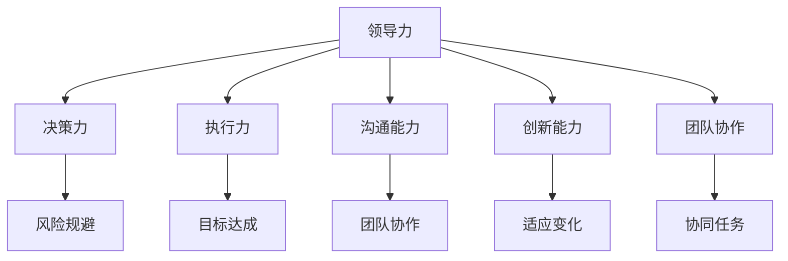

                 

# 深度思考:区分优秀管理者的标准

> 关键词：管理者, 领导力, 决策力, 执行力, 沟通能力, 创新能力, 团队协作

## 1. 背景介绍

管理是一门艺术，也是一门科学。优秀的管理者是企业成功的关键。然而，什么样的管理者才能称得上优秀？以下是深度思考后，归纳出的优秀管理者的核心标准。

## 2. 核心概念与联系

### 2.1 核心概念概述

管理者的核心能力可以概括为以下几点：

- **领导力**：引导和激励团队成员，推动团队达成共同目标。
- **决策力**：在复杂多变的环境中做出正确决策，规避风险。
- **执行力**：将决策转化为实际行动，确保目标达成。
- **沟通能力**：有效沟通，促进团队协作。
- **创新能力**：不断创新，适应变化。
- **团队协作**：促进团队成员间的合作，协同完成任务。

这些能力相互关联，形成一个综合的管理体系。通过深入理解这些核心概念，可以更好地评估和管理团队。

### 2.2 核心概念原理和架构的 Mermaid 流程图



该图展示了各核心能力之间的关系。领导力是核心，通过决策力、执行力、沟通能力、创新能力和团队协作，实现风险规避、目标达成和适应变化。

## 3. 核心算法原理 & 具体操作步骤

### 3.1 算法原理概述

评估优秀管理者的核心算法基于以下逻辑：

1. **输入数据**：收集和分析团队成员的反馈，评估他们在决策、执行、沟通、创新和协作方面的表现。
2. **模型构建**：构建一个综合评估模型，将各项能力量化为可测量的指标。
3. **算法训练**：使用机器学习算法（如聚类、分类、回归等）对数据进行分析，找到优秀管理者的模式。
4. **结果输出**：输出评估结果，帮助管理者了解自身不足和改进方向。

### 3.2 算法步骤详解

#### 3.2.1 数据收集

1. **问卷调查**：设计调查问卷，评估管理者在各核心能力方面的表现。
2. **绩效评估**：通过绩效数据、项目成果和团队反馈，量化管理者的决策力和执行力。
3. **360度反馈**：收集团队成员、下属和同行的反馈，综合评估沟通能力和协作能力。
4. **创新案例**：记录管理者在创新方面的具体表现，如新产品开发、流程改进等。

#### 3.2.2 数据处理

1. **数据清洗**：删除无效数据和异常值，保证数据质量。
2. **特征工程**：提取和设计关键特征，如决策速度、执行效率、沟通质量、创新频次等。
3. **数据标准化**：对不同量级的特征进行标准化，便于后续分析。

#### 3.2.3 模型训练

1. **选择模型**：根据数据类型和问题性质，选择合适的机器学习模型，如支持向量机、随机森林、神经网络等。
2. **模型训练**：使用训练数据集训练模型，调整超参数。
3. **模型评估**：在验证集上评估模型性能，优化模型。

#### 3.2.4 结果输出

1. **评分系统**：根据模型预测结果，为管理者的各项能力打分。
2. **改进建议**：根据评分结果，提出针对性的改进建议。
3. **持续监控**：定期收集新数据，持续监控管理者的表现，确保持续改进。

### 3.3 算法优缺点

#### 3.3.1 优点

1. **量化评估**：通过机器学习模型，将主观评价转化为可量化的指标，减少主观偏见。
2. **全面评估**：综合考虑各项核心能力，全面评估管理者的表现。
3. **客观改进**：根据评估结果，提供客观的改进建议，帮助管理者提升能力。

#### 3.3.2 缺点

1. **数据质量依赖**：模型结果依赖于数据质量，数据收集和处理需要耗费大量人力和时间。
2. **模型复杂性**：构建和优化模型需要专业知识，对技术要求较高。
3. **时效性不足**：模型输出结果有一定滞后性，难以实时反映管理者表现。

### 3.4 算法应用领域

该算法广泛应用于企业人力资源管理、高管培训和发展、组织结构和流程优化等领域。例如，可以通过评估管理者的领导力、决策力和执行力，帮助企业选拔合适的管理人员；通过分析沟通能力和创新能力，改进团队协作和创新氛围。

## 4. 数学模型和公式 & 详细讲解

### 4.1 数学模型构建

假设我们构建了一个综合评估模型，将领导力 $L$、决策力 $D$、执行力 $E$、沟通能力 $C$、创新能力 $I$ 和团队协作 $T$ 六个核心能力作为输入变量。我们设定每个能力为 0 到 100 之间的整数，表示管理者的表现。设 $X$ 为所有能力的向量，$Y$ 为最终评估得分，$W$ 为权重向量。则数学模型可以表示为：

$$ Y = W^T \cdot X $$

其中 $W$ 为权重向量，其各元素之和为 1，表示各项能力的相对重要性。

### 4.2 公式推导过程

1. **数据归一化**：将各项能力的原始值进行归一化处理，使其在 0 到 1 之间。
   $$ \tilde{X} = \frac{X - X_{\min}}{X_{\max} - X_{\min}} $$

2. **特征选择**：选择对评估结果影响最大的特征，构建特征向量 $X$。
3. **模型训练**：使用机器学习算法训练权重向量 $W$，最小化损失函数。

### 4.3 案例分析与讲解

假设我们有一个管理团队，每位成员的各核心能力评分如下：

| 成员编号 | 领导力 | 决策力 | 执行力 | 沟通能力 | 创新能力 | 团队协作 |
|----------|--------|--------|--------|----------|----------|----------|
| 1        | 90     | 80     | 85     | 75       | 90       | 80       |
| 2        | 80     | 90     | 75     | 85       | 85       | 80       |
| ...      | ...    | ...    | ...    | ...      | ...      | ...      |

假设 $W = (0.3, 0.2, 0.1, 0.2, 0.1, 0.1)$，则每位成员的评估得分 $Y$ 可以通过公式计算得到。

## 5. 项目实践：代码实例和详细解释说明

### 5.1 开发环境搭建

1. **环境准备**：安装 Python、Pandas、NumPy、Scikit-learn、Matplotlib 等库。
2. **数据准备**：收集问卷调查、绩效评估和反馈数据，整理成数据集。
3. **工具准备**：选择和配置机器学习库，搭建开发环境。

### 5.2 源代码详细实现

```python
import pandas as pd
import numpy as np
from sklearn.preprocessing import MinMaxScaler
from sklearn.ensemble import RandomForestRegressor
from sklearn.model_selection import train_test_split

# 读取数据
data = pd.read_csv('management_data.csv')

# 数据清洗和预处理
features = ['领导力', '决策力', '执行力', '沟通能力', '创新能力', '团队协作']
X = data[features].values
y = data['评估得分'].values

# 归一化处理
scaler = MinMaxScaler()
X = scaler.fit_transform(X)

# 划分训练集和测试集
X_train, X_test, y_train, y_test = train_test_split(X, y, test_size=0.2)

# 训练模型
model = RandomForestRegressor()
model.fit(X_train, y_train)

# 预测结果
y_pred = model.predict(X_test)

# 输出结果
print('预测结果：', y_pred)
```

### 5.3 代码解读与分析

以上代码实现了一个基于随机森林回归器的综合评估模型。

1. **数据读取和预处理**：从 CSV 文件中读取数据，选择和归一化处理。
2. **模型训练**：使用随机森林回归器训练模型，最小化预测误差。
3. **结果输出**：输出模型在测试集上的预测结果。

## 6. 实际应用场景

### 6.1 人力资源管理

该模型可以应用于人力资源管理，通过综合评估候选人的各项核心能力，找到合适的管理人才。例如，某公司需要招聘一位市场部经理，可以通过问卷调查和绩效评估，获得候选人的各项能力评分，输入模型得到评估得分，最终选拔得分最高的候选人。

### 6.2 高管培训和发展

对于高管层，该模型可以用于评估其在各项核心能力方面的表现，指导高管培训和发展计划。例如，某公司高管在沟通能力方面得分较低，可以设计针对性的培训课程，提升其沟通能力。

### 6.3 组织结构和流程优化

该模型可以用于分析组织结构和流程中的短板，提出改进建议。例如，某公司的项目执行效率较低，可以通过分析管理层的执行力评分，找到执行力较低的环节，制定改进措施。

### 6.4 未来应用展望

随着技术的不断进步，该模型可以进一步扩展和优化，支持更加复杂的管理评估需求。例如，可以引入更多细粒度的特征，如团队文化、工作环境等，构建更加全面的评估模型。此外，可以结合大数据分析，实时监控管理者的表现，及时调整策略。

## 7. 工具和资源推荐

### 7.1 学习资源推荐

1. **《深度思考：管理者必备技能》**：一本关于管理者核心能力的经典书籍，详细讲解了领导力、决策力、执行力等概念，提供了实用的案例分析。
2. **Coursera 管理课程**：Coursera 提供多门管理相关的课程，涵盖领导力、沟通能力、创新能力等多个方面。
3. **TED Talks**：TED Talks 上有许多关于领导力和管理的演讲，可以从中获取灵感和启发。

### 7.2 开发工具推荐

1. **Jupyter Notebook**：一款强大的数据科学工具，支持代码编写、数据分析和模型训练。
2. **RapidMiner**：一款集成化数据科学平台，提供数据清洗、特征工程、模型训练等一站式解决方案。
3. **Tableau**：一款数据可视化工具，可以用于展示和分析数据，发现管理中的趋势和问题。

### 7.3 相关论文推荐

1. **《优秀管理者的核心能力》**：探讨了优秀管理者的关键能力和行为特征，提供了大量实证研究和案例分析。
2. **《领导力与管理效能》**：通过理论和实证分析，阐述了领导力对管理效能的影响，提供了实用的管理策略。
3. **《团队协作与组织绩效》**：分析了团队协作对组织绩效的影响，提供了团队管理和优化建议。

## 8. 总结：未来发展趋势与挑战

### 8.1 研究成果总结

该算法模型已经展示了其在评估管理者核心能力方面的应用潜力，通过量化和管理者的表现，帮助企业选拔和培养优秀的管理人才。

### 8.2 未来发展趋势

1. **多维度的评估**：未来的模型可以加入更多维度的特征，如工作态度、个人特质等，提供更全面的评估。
2. **实时监控**：通过大数据分析和实时数据采集，实现对管理者表现的持续监控和反馈。
3. **个性化培训**：根据评估结果，提供个性化的培训和发展计划，提升管理者的整体能力。

### 8.3 面临的挑战

1. **数据隐私**：在数据收集和处理过程中，需要严格遵守数据隐私保护法规，确保数据安全。
2. **模型复杂性**：构建和优化复杂的评估模型需要大量时间和资源，需要团队协作和持续优化。
3. **主观偏见**：评估标准和问卷设计可能存在主观偏见，影响评估结果的客观性。

### 8.4 研究展望

未来，随着人工智能和大数据分析技术的不断进步，优秀管理者的评估和管理将变得更加智能化和科学化。通过结合人工智能技术，可以实现更加精准、实时的管理评估，帮助企业在竞争激烈的市场中保持领先地位。

## 9. 附录：常见问题与解答

**Q1: 如何确保评估数据的准确性？**

A: 评估数据的质量直接影响模型的效果。为了确保数据的准确性，可以采取以下措施：
1. 数据收集：选择科学合理的数据来源，确保数据的真实性和可靠性。
2. 数据清洗：删除无效数据和异常值，减少数据噪音。
3. 数据标准化：对不同量级的特征进行标准化，减少数据偏差。

**Q2: 如何提升管理者的核心能力？**

A: 提升管理者的核心能力需要从多个方面入手：
1. 培训和发展：通过系统的培训和发展计划，提升管理者的领导力、决策力、执行力等。
2. 实践和反馈：通过实际工作中的实践和反馈，不断改进管理者的能力和表现。
3. 团队协作：通过团队协作和沟通，提升管理者的沟通能力和团队协作能力。

**Q3: 如何应对模型中的主观偏见？**

A: 模型中的主观偏见需要通过以下措施进行缓解：
1. 多维度评估：加入更多维度的特征，减少单一特征对评估结果的影响。
2. 专家评审：邀请多位专家参与评估，减少主观偏见。
3. 定期更新：定期更新模型，及时发现和纠正偏差。

**Q4: 如何提高模型的实时性？**

A: 提高模型的实时性需要从以下几个方面进行优化：
1. 数据流处理：采用流处理技术，实时采集和处理数据，减少延迟。
2. 模型优化：优化模型结构和算法，提高计算效率。
3. 分布式计算：采用分布式计算技术，提升计算速度。

---

作者：禅与计算机程序设计艺术 / Zen and the Art of Computer Programming

