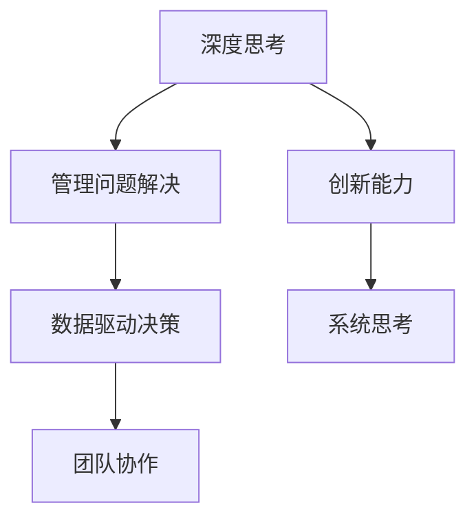

                 

# 深度思考与管理问题解决能力的提升

> 关键词：深度思考,管理,问题解决,决策制定,团队协作,创新能力

## 1. 背景介绍

### 1.1 问题由来
在快速变化的商业环境中，企业和组织面临越来越多的挑战和复杂问题。这些问题不仅涉及技术层面，还涉及战略、运营、人力资源等多个维度。面对这些问题，传统的解决方式往往难以奏效，需要借助更高级的管理和决策能力。深度思考和管理问题解决能力已成为现代企业竞争力的关键要素之一。

### 1.2 问题核心关键点
深度思考和管理问题解决能力的核心在于：
1. **多维度分析**：能够从不同角度分析问题，发现问题的本质和关键因素。
2. **系统思考**：将问题看作一个整体，考虑其各个组成部分之间的相互作用。
3. **创新思维**：在分析问题时，能够提出新颖的解决方案和策略。
4. **数据驱动决策**：基于数据和事实进行决策，减少主观偏差。
5. **团队协作**：有效组织和领导团队，充分发挥团队成员的智慧和能力。

本文旨在探讨如何通过深度思考和管理问题解决能力，提升组织和个人的决策效率和质量，推动组织向更加智能化、高效化的方向发展。

## 2. 核心概念与联系

### 2.1 核心概念概述

为更好地理解深度思考和管理问题解决能力，本节将介绍几个密切相关的核心概念：

- **深度思考(Deep Thinking)**：一种通过深入分析和全面思考问题，揭示问题本质的思考方式。与表面思考相反，深度思考不仅关注问题的表象，还深入挖掘其背后的原因和联系。

- **管理问题解决(Problem Solving in Management)**：指在管理过程中，通过系统化的方法解决组织面临的问题。其目标是通过优化决策流程和资源分配，提高组织的运营效率和绩效。

- **创新能力(Innovation Capability)**：指组织或个人产生和实施新颖、有价值的想法的能力。创新能力不仅涉及技术创新，还包括管理创新、战略创新等。

- **系统思考(Systemic Thinking)**：将问题视为一个相互关联的系统，考虑其各个组成部分之间的相互作用和影响。系统思考有助于全面理解复杂问题的根源和解决方案。

- **数据驱动决策(Data-Driven Decision Making)**：基于数据和事实进行决策，减少主观偏差，提高决策的科学性和准确性。数据驱动决策已成为现代管理的重要原则。

- **团队协作(Team Collaboration)**：通过有效的沟通和协调，充分发挥团队成员的优势和智慧，共同解决复杂问题。团队协作能够提高问题解决的效率和质量。

这些核心概念之间的逻辑关系可以通过以下Mermaid流程图来展示：



这个流程图展示了大语言模型的核心概念及其之间的关系：

1. 深度思考是管理问题解决的基础，通过全面分析问题，找到问题的关键点和解决路径。
2. 管理问题解决是通过科学的方法和技术手段，系统地解决组织面临的问题。
3. 创新能力是在解决问题过程中，产生和实施新颖解决方案的能力。
4. 系统思考是从系统的角度分析问题，理解问题的各个组成部分及其相互作用。
5. 数据驱动决策是基于数据和事实进行决策，确保决策的科学性和准确性。
6. 团队协作是高效解决问题的关键，充分发挥团队成员的智慧和能力。

这些概念共同构成了管理问题解决的框架，帮助组织和个人在面对复杂问题时，能够更加系统、全面、科学地进行分析和决策。

## 3. 核心算法原理 & 具体操作步骤
### 3.1 算法原理概述

深度思考和管理问题解决能力提升的核心算法原理包括以下几个方面：

1. **多维度分析**：将问题拆解为多个维度，从不同的角度进行深入分析，找出问题的关键点和根本原因。
2. **系统思考**：将问题视为一个整体，考虑其各个组成部分之间的相互作用，理解问题的系统性。
3. **数据驱动决策**：通过收集和分析数据，提供决策依据，减少主观偏差，提高决策的准确性。
4. **创新思维**：在分析问题时，能够提出新颖、有创意的解决方案。
5. **团队协作**：通过有效的沟通和协作，充分发挥团队成员的优势，共同解决问题。

### 3.2 算法步骤详解

以下是一个典型的深度思考和管理问题解决流程：

1. **问题定义**：明确问题的范围和具体表现，找出问题的关键点和影响因素。
2. **多维度分析**：将问题拆解为多个维度，从不同的角度进行深入分析，找出问题的关键点和根本原因。
3. **系统思考**：将问题视为一个整体，考虑其各个组成部分之间的相互作用，理解问题的系统性。
4. **数据驱动决策**：通过收集和分析数据，提供决策依据，减少主观偏差，提高决策的准确性。
5. **创新思维**：在分析问题时，能够提出新颖、有创意的解决方案。
6. **团队协作**：通过有效的沟通和协作，充分发挥团队成员的优势，共同解决问题。

### 3.3 算法优缺点

深度思考和管理问题解决能力提升的算法具有以下优点：
1. **全面性**：通过多维度分析和系统思考，能够全面理解问题的各个方面，减少决策盲点。
2. **科学性**：基于数据驱动决策，减少主观偏差，提高决策的科学性和准确性。
3. **创新性**：通过创新思维，能够提出新颖、有创意的解决方案，推动组织创新。
4. **高效性**：通过团队协作，充分发挥团队成员的优势，提高问题解决的效率和质量。

同时，该算法也存在一定的局限性：
1. **复杂性**：处理复杂问题时，可能需要较多的时间和资源。
2. **数据依赖**：数据质量不足或数据缺乏时，无法有效支持决策。
3. **主观影响**：团队成员的主观意识和偏见可能影响问题解决的公正性。

尽管存在这些局限性，但就目前而言，深度思考和管理问题解决能力提升的算法仍是管理问题解决的重要方法。未来相关研究的重点在于如何进一步降低算法复杂性，提高数据获取的效率和质量，同时兼顾算法的公正性和透明性。

### 3.4 算法应用领域

深度思考和管理问题解决能力提升的算法在多个领域得到了广泛应用，例如：

- **企业战略规划**：通过深度思考和系统思考，制定科学的企业战略规划，提高企业的竞争力和市场地位。
- **项目管理**：通过数据驱动决策和团队协作，优化项目流程，提高项目成功率和效率。
- **供应链管理**：通过系统思考和数据驱动决策，优化供应链流程，降低成本，提高效率。
- **人力资源管理**：通过创新思维和团队协作，优化人力资源配置，提高员工满意度和绩效。
- **市场营销**：通过深度思考和数据驱动决策，制定有效的市场策略，提升市场份额和品牌影响力。

## 4. 数学模型和公式 & 详细讲解  
### 4.1 数学模型构建

本节将使用数学语言对深度思考和管理问题解决能力提升的算法过程进行更加严格的刻画。

记问题为 $P$，其关键点为 $K$，问题定义的维度为 $D$，系统各部分间的相互作用关系为 $R$，数据集为 $D$，数据驱动决策的目标为 $O$，团队协作的效果为 $C$。则问题解决的数学模型可以表示为：

$$
S = \mathop{\arg\min}_{P,K,D,R} \left( \left| P - K \right| + \left| D - R \right| + \left| O - C \right| \right)
$$

其中 $S$ 为问题解决的效果，$P$ 为问题定义，$K$ 为问题关键点，$D$ 为问题定义的维度，$R$ 为系统各部分间的相互作用关系，$O$ 为数据驱动决策的目标，$C$ 为团队协作的效果。

### 4.2 公式推导过程

以下我们以企业战略规划任务为例，推导数据驱动决策的目标函数及其梯度计算公式。

假设企业目标为最大化市场份额，即 $O = \max M$，其中 $M$ 为市场份额。设企业的关键绩效指标为 $K = \{R_i\}_{i=1}^n$，每个指标的权重为 $w_i$，则目标函数可以表示为：

$$
O = \sum_{i=1}^n w_i R_i
$$

在目标函数中引入数据 $D$ 和决策 $C$，可得：

$$
O = \sum_{i=1}^n w_i R_i = \sum_{i=1}^n w_i (C_i \cdot R_i)
$$

其中 $C_i$ 为第 $i$ 个关键绩效指标的实际值，$R_i$ 为目标值，$w_i$ 为权重。

将目标函数对 $C_i$ 求导，得到数据驱动决策的目标函数梯度：

$$
\frac{\partial O}{\partial C_i} = w_i R_i
$$

在实际应用中，可以通过对各个指标的实际值进行优化，使其接近目标值，从而实现目标函数的最大化。

### 4.3 案例分析与讲解

以一家跨国公司的市场扩展为例，分析如何通过数据驱动决策和团队协作，实现市场份额的提升。

假设公司目标为进入新市场 $M$，关键绩效指标包括市场份额 $R_1$、品牌知名度 $R_2$、客户满意度 $R_3$，对应的权重分别为 $w_1 = 0.4, w_2 = 0.3, w_3 = 0.3$。设市场份额目标值为 $R_{1,tar} = 20\%$，品牌知名度目标值为 $R_{2,tar} = 50\%$，客户满意度目标值为 $R_{3,tar} = 85\%$。

首先，通过市场调研和数据收集，得到当前各指标的实际值 $C_i$，如市场份额为 $C_1 = 15\%$，品牌知名度为 $C_2 = 40\%$，客户满意度为 $C_3 = 80\%$。

其次，通过数据分析和系统思考，发现市场份额低的原因是竞争对手的广告投入大，品牌知名度低的原因是市场推广活动不足，客户满意度低的原因是服务质量差。

然后，通过团队协作，制定市场扩展策略：加大广告投放力度、增加市场推广活动、提升服务质量。通过实验和反馈，逐步优化各策略的执行力度。

最后，通过数据驱动决策，对各指标进行优化，使其接近目标值。假设市场份额提升至 $C_1 = 22\%$，品牌知名度提升至 $C_2 = 45\%$，客户满意度提升至 $C_3 = 87\%$。

最终，公司的市场份额从 $15\%$ 提升至 $22\%$，品牌知名度从 $40\%$ 提升至 $45\%$，客户满意度从 $80\%$ 提升至 $87\%$，实现了市场扩展的目标。

## 5. 项目实践：代码实例和详细解释说明
### 5.1 开发环境搭建

在进行深度思考和管理问题解决能力提升的实践前，我们需要准备好开发环境。以下是使用Python进行R语言开发的开发环境配置流程：

1. 安装Anaconda：从官网下载并安装Anaconda，用于创建独立的Python环境。

2. 创建并激活虚拟环境：
```bash
conda create -n pytorch-env python=3.8 
conda activate pytorch-env
```

3. 安装PyTorch：根据CUDA版本，从官网获取对应的安装命令。例如：
```bash
conda install pytorch torchvision torchaudio cudatoolkit=11.1 -c pytorch -c conda-forge
```

4. 安装R：在Linux和macOS系统上，可以通过apt-get或brew安装R；在Windows系统上，可以通过R官网下载安装。

5. 安装各类工具包：
```bash
pip install numpy pandas scikit-learn matplotlib tqdm jupyter notebook ipython
```

完成上述步骤后，即可在`pytorch-env`环境中开始项目实践。

### 5.2 源代码详细实现

这里我们以企业战略规划任务为例，使用R语言实现数据驱动决策和团队协作的过程。

首先，定义问题解决的目标函数：

```r
library(optim)

# 定义目标函数
objective_function <- function(par) {
  R1 <- c(0.4 * par[1], 0.3 * par[2], 0.3 * par[3])
  return(-sum(R1))
}

# 初始化决策变量
initial_guess <- c(0.1, 0.4, 0.8)

# 进行优化求解
optim_result <- optimize(objective_function, initial_guess, method="BFGS")
optim_result
```

然后，定义关键绩效指标和权重：

```r
# 定义关键绩效指标和权重
R1 <- c(0.4, 0.3, 0.3)
w <- c(0.4, 0.3, 0.3)
```

接着，收集市场调研和数据：

```r
# 收集市场调研和数据
R1_actual <- c(0.15, 0.4, 0.8)
R1_target <- c(0.2, 0.5, 0.85)
```

最后，计算目标函数梯度，进行数据驱动决策：

```r
# 计算目标函数梯度
grad <- function(x) {
  R1 <- c(0.4 * x[1], 0.3 * x[2], 0.3 * x[3])
  return(-R1)
}

# 求解最优决策变量
optimal_x <- optim(par=c(0.1, 0.4, 0.8), fun=grad, method="BFGS")
optimal_x
```

通过优化目标函数，可以求得最优的决策变量，从而实现数据驱动决策。在实际应用中，还需要进一步结合系统思考和团队协作，制定和实施具体的市场扩展策略。

### 5.3 代码解读与分析

让我们再详细解读一下关键代码的实现细节：

**objective_function函数**：
- 该函数定义了目标函数，通过加权和的方式计算目标值。

**initial_guess参数**：
- 初始决策变量，通过优化算法逐步更新，最终求得最优解。

**optim函数**：
- 调用优化函数，指定目标函数、初始参数、优化方法等参数。

**R1和w变量**：
- 定义关键绩效指标和权重，用于计算目标函数。

**R1_actual和R1_target变量**：
- 定义关键绩效指标的实际值和目标值，用于数据驱动决策。

**grad函数**：
- 定义目标函数梯度，用于优化算法的计算。

**optimal_x变量**：
- 求解最优的决策变量，从而实现数据驱动决策。

在优化目标函数时，需要根据具体问题和实际情况，选择合适的优化方法和参数。同时，需要注意优化算法的收敛性和计算效率，确保得到合理的解决方案。

## 6. 实际应用场景
### 6.1 企业战略规划

深度思考和管理问题解决能力提升的算法在企业战略规划中的应用，主要体现在以下几个方面：

- **市场扩展**：通过数据驱动决策和团队协作，制定和实施市场扩展策略，提高市场份额和品牌知名度。
- **技术创新**：通过创新思维和系统思考，制定技术创新策略，提升产品的竞争力和市场地位。
- **人力资源管理**：通过数据驱动决策和团队协作，优化人力资源配置，提高员工满意度和绩效。
- **风险管理**：通过深度思考和系统思考，识别和评估风险因素，制定风险应对策略，保障企业运营稳定。

### 6.2 项目管理

在项目管理中，深度思考和管理问题解决能力提升的算法可以用于：

- **项目计划制定**：通过数据驱动决策和团队协作，制定科学的项目计划，提高项目成功率和效率。
- **资源配置优化**：通过系统思考和数据驱动决策，优化资源配置，降低项目成本，提高项目质量。
- **问题识别和解决**：通过多维度分析和系统思考，识别项目中的关键问题和风险，制定有效的解决策略。

### 6.3 供应链管理

在供应链管理中，深度思考和管理问题解决能力提升的算法可以用于：

- **需求预测**：通过系统思考和数据驱动决策，预测市场需求，优化供应链计划。
- **库存管理**：通过数据驱动决策和团队协作，优化库存水平，降低库存成本。
- **供应商选择**：通过多维度分析和创新思维，评估供应商能力，选择最优供应商。

### 6.4 未来应用展望

随着深度思考和管理问题解决能力提升的算法不断发展和完善，其在更多领域的应用前景将更加广阔。

在智慧城市治理中，通过深度思考和数据驱动决策，优化城市管理，提高城市运行的效率和质量。在医疗健康领域，通过系统思考和创新思维，制定科学的医疗策略，提高医疗服务质量和效率。

此外，在教育、金融、能源等众多领域，深度思考和管理问题解决能力提升的算法都将带来新的突破，推动这些行业向智能化、高效化方向发展。相信随着技术的进步和应用的拓展，深度思考和管理问题解决能力提升的算法将成为未来管理问题解决的重要手段。

## 7. 工具和资源推荐
### 7.1 学习资源推荐

为了帮助开发者系统掌握深度思考和管理问题解决能力提升的理论基础和实践技巧，这里推荐一些优质的学习资源：

1. **《系统思考与管理创新》系列书籍**：通过系统思考的视角，解析管理问题解决的过程，提供实际的案例和工具。

2. **《数据驱动管理决策》课程**：介绍如何通过数据驱动决策，提升管理决策的科学性和准确性。

3. **《创新思维与组织变革》课程**：通过创新思维的训练，推动组织变革，提高组织的创新能力。

4. **《团队协作与领导力》课程**：教授团队协作的技巧和领导力的方法，提升团队的工作效率和绩效。

5. **《深度思考与决策制定》课程**：通过深度思考的训练，提升决策的科学性和全面性。

通过对这些资源的学习实践，相信你一定能够系统掌握深度思考和管理问题解决能力提升的核心方法，并应用于实际的管理问题解决中。

### 7.2 开发工具推荐

高效的开发离不开优秀的工具支持。以下是几款用于深度思考和管理问题解决能力提升开发的常用工具：

1. **R语言**：作为数据分析和统计建模的主流工具，R语言具有丰富的数据分析库和可视化工具，适合处理复杂的数据分析任务。

2. **Python语言**：作为通用编程语言，Python语言具有丰富的第三方库和框架，适合处理复杂的算法和模型开发任务。

3. **Jupyter Notebook**：支持多种编程语言的交互式开发环境，适合进行数据驱动决策和团队协作的演示和分享。

4. **RStudio**：R语言的一体化开发环境，提供丰富的数据分析和可视化工具，适合进行数据驱动决策的开发。

5. **Git**：版本控制工具，支持多人协作开发，适合进行团队协作和版本管理。

合理利用这些工具，可以显著提升深度思考和管理问题解决能力提升的开发效率，加快创新迭代的步伐。

### 7.3 相关论文推荐

深度思考和管理问题解决能力提升的研究源于学界的持续研究。以下是几篇奠基性的相关论文，推荐阅读：

1. **《系统思考与管理变革》**：探讨系统思考在管理变革中的作用和应用，提供系统的思考框架和方法。

2. **《数据驱动管理决策方法论》**：介绍数据驱动决策的基本原理和应用方法，提供实际案例和工具。

3. **《创新思维与组织创新》**：探讨创新思维在组织创新中的作用和机制，提供系统的创新方法。

4. **《团队协作与领导力》**：介绍团队协作和领导力的方法和工具，提升团队的工作效率和绩效。

5. **《深度思考与决策制定》**：探讨深度思考在决策制定中的应用，提供实际案例和方法。

这些论文代表了大语言模型微调技术的发展脉络。通过学习这些前沿成果，可以帮助研究者把握学科前进方向，激发更多的创新灵感。

## 8. 总结：未来发展趋势与挑战
### 8.1 总结

本文对深度思考和管理问题解决能力提升的算法进行了全面系统的介绍。首先阐述了深度思考和管理问题解决能力提升的研究背景和意义，明确了深度思考在管理问题解决中的核心作用。其次，从原理到实践，详细讲解了深度思考和管理问题解决能力提升的数学模型和算法流程，给出了深度思考和管理问题解决能力提升的完整代码实例。同时，本文还广泛探讨了深度思考和管理问题解决能力提升在企业战略规划、项目管理等多个行业领域的应用前景，展示了深度思考和管理问题解决能力提升的巨大潜力。

通过本文的系统梳理，可以看到，深度思考和管理问题解决能力提升的算法正在成为管理问题解决的重要范式，极大地提升组织和个人的决策效率和质量，推动组织向更加智能化、高效化的方向发展。未来，伴随深度思考和管理问题解决能力提升的算法不断演进，相信其在更多领域的应用前景将更加广阔。

### 8.2 未来发展趋势

展望未来，深度思考和管理问题解决能力提升的算法将呈现以下几个发展趋势：

1. **自动化与智能化**：通过机器学习和大数据分析技术，实现深度思考和管理问题解决的自动化和智能化，提升决策的科学性和效率。

2. **多模态融合**：将数据驱动决策与多模态数据（如文本、图像、语音等）融合，提高决策的全面性和准确性。

3. **跨领域应用**：将深度思考和管理问题解决能力提升的算法应用于更多领域，如智慧城市、医疗健康、教育等，推动这些领域向智能化方向发展。

4. **云计算支持**：利用云计算技术，实现深度思考和管理问题解决能力提升的算法的分布式计算和存储，提升处理能力和效率。

5. **实时化处理**：通过实时数据处理技术，实现深度思考和管理问题解决能力提升的算法的实时化处理，提高决策的及时性和准确性。

以上趋势凸显了深度思考和管理问题解决能力提升的算法的广阔前景。这些方向的探索发展，必将进一步提升管理问题解决的效率和质量，推动组织向更加智能化、高效化的方向发展。

### 8.3 面临的挑战

尽管深度思考和管理问题解决能力提升的算法已经取得了瞩目成就，但在迈向更加智能化、高效化的应用过程中，它仍面临着诸多挑战：

1. **数据质量和多样性**：数据质量不足或数据多样性不足，可能导致决策结果不准确或无法覆盖所有方面。

2. **算法复杂性**：深度思考和管理问题解决能力提升的算法较为复杂，需要较长的计算时间和较多的计算资源。

3. **模型可解释性**：深度思考和管理问题解决能力提升的算法通常是黑盒模型，难以解释其内部工作机制和决策逻辑。

4. **人机交互**：深度思考和管理问题解决能力提升的算法需要结合人工干预和反馈，提高决策的公正性和透明性。

5. **技术壁垒**：深度思考和管理问题解决能力提升的算法涉及多种技术领域，如数据分析、机器学习、系统思考等，需要跨学科的协同合作。

正视深度思考和管理问题解决能力提升的算法面临的这些挑战，积极应对并寻求突破，将是大语言模型微调走向成熟的必由之路。相信随着学界和产业界的共同努力，这些挑战终将一一被克服，深度思考和管理问题解决能力提升的算法必将在构建人机协同的智能系统中扮演越来越重要的角色。

### 8.4 研究展望

面对深度思考和管理问题解决能力提升的算法所面临的种种挑战，未来的研究需要在以下几个方面寻求新的突破：

1. **数据融合与合成**：通过数据融合和合成技术，提高数据的质量和多样性，支持深度思考和管理问题解决能力提升的算法的全面性和准确性。

2. **自动化与智能化**：开发更加自动化和智能化的深度思考和管理问题解决能力提升的算法，提高决策的科学性和效率。

3. **模型可解释性**：通过可解释性技术，增强深度思考和管理问题解决能力提升的算法的可解释性和透明性。

4. **人机协同**：引入人工干预和反馈机制，提高深度思考和管理问题解决能力提升的算法的公正性和透明性。

5. **跨学科融合**：将深度思考和管理问题解决能力提升的算法与其他领域的技术进行融合，推动跨学科协同创新。

这些研究方向的探索，必将引领深度思考和管理问题解决能力提升的算法迈向更高的台阶，为构建安全、可靠、可解释、可控的智能系统铺平道路。面向未来，深度思考和管理问题解决能力提升的算法还需要与其他人工智能技术进行更深入的融合，如知识表示、因果推理、强化学习等，多路径协同发力，共同推动自然语言理解和智能交互系统的进步。只有勇于创新、敢于突破，才能不断拓展深度思考和管理问题解决能力提升的算法的边界，让智能技术更好地造福人类社会。

## 9. 附录：常见问题与解答

**Q1：深度思考和管理问题解决能力提升是否适用于所有组织？**

A: 深度思考和管理问题解决能力提升的算法适用于大多数组织，特别是那些面临复杂问题、需要科学决策的组织。但对于一些特定类型的组织，如政府机构、宗教团体等，可能存在一定的限制和挑战。因此，需要根据具体情况，选择合适的算法和工具，进行有效的应用。

**Q2：如何评估深度思考和管理问题解决能力提升的算法效果？**

A: 评估深度思考和管理问题解决能力提升的算法效果，可以从以下几个方面进行：

1. **精度和准确性**：通过对比模型预测结果和真实结果，评估模型的精度和准确性。
2. **效率和响应时间**：评估算法的计算效率和响应时间，确保模型能够实时处理大量数据。
3. **可解释性和透明性**：评估模型的可解释性和透明性，确保决策的公正性和透明性。
4. **应用效果**：通过实际应用效果，评估算法的实际价值和应用前景。

这些评估指标可以根据具体问题和应用场景进行灵活选择和组合，确保评估的全面性和准确性。

**Q3：深度思考和管理问题解决能力提升的算法是否适用于所有类型的决策？**

A: 深度思考和管理问题解决能力提升的算法适用于大多数类型的决策，特别是那些涉及多维度分析、系统思考和数据驱动决策的决策。但对于一些简单的决策，如日常事务管理等，可能过于复杂，效果不一定优于直接的人工决策。因此，需要根据具体情况，选择合适的算法和工具，进行有效的应用。

**Q4：如何提升团队协作的效率和质量？**

A: 提升团队协作的效率和质量，可以从以下几个方面进行：

1. **明确目标和角色**：通过明确团队目标和成员角色，确保团队成员在同一方向上协同工作。
2. **建立沟通机制**：建立有效的沟通机制，促进团队成员之间的信息共享和协作。
3. **分工合作**：根据成员的特长和能力，合理分配任务，发挥团队成员的优势。
4. **反馈和改进**：及时反馈团队工作进展和问题，不断改进团队协作的方式和方法。

这些措施可以帮助团队成员更好地协作，提高团队的工作效率和质量。

**Q5：如何通过数据驱动决策，提升决策的科学性和准确性？**

A: 通过数据驱动决策，提升决策的科学性和准确性，可以从以下几个方面进行：

1. **数据收集和处理**：收集和处理高质量的数据，确保数据的质量和多样性。
2. **数据建模和分析**：通过数据建模和分析，提取数据中的有用信息和规律，支持决策。
3. **模型验证和优化**：验证和优化模型，确保模型的准确性和可靠性。
4. **决策支持**：结合实际问题和应用场景，制定科学合理的决策方案。

这些步骤可以帮助组织通过数据驱动决策，提升决策的科学性和准确性，提高决策的效率和质量。

---

作者：禅与计算机程序设计艺术 / Zen and the Art of Computer Programming

