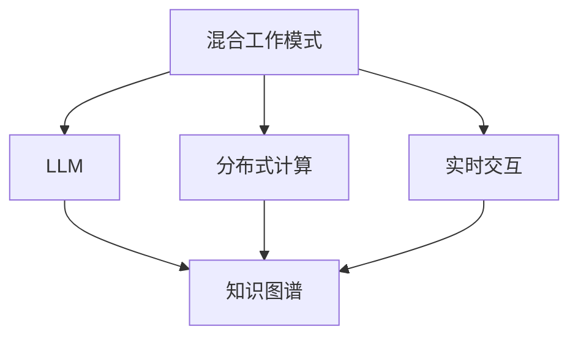

                 

# 混合工作模式与 LLM：高效的远程协作

> 关键词：混合工作模式，远程协作，大语言模型(LLM)，分布式计算，AI 应用，团队管理，沟通效率

## 1. 背景介绍

### 1.1 问题由来
随着技术的进步和市场的推动，越来越多的组织开始采用混合工作模式。这种模式结合了远程工作和现场办公的优点，使员工在保证工作效率的同时，还能享受更加灵活的工作时间。然而，混合工作模式也带来了新的挑战，包括团队沟通不畅、协作效率低下等问题。特别是对于跨地域、跨时区的团队，这些问题尤为突出。

为了应对这些挑战，大语言模型(LLM)成为一个潜在的解决方案。LLM 通过自然语言处理(NLP)技术，能够在虚拟空间中高效沟通和协作。但是，由于 LLM 处理大规模数据的能力非常强，而处理实时交互的能力有限，因此在混合工作模式中如何高效利用 LLM 成为了一个重要的问题。

### 1.2 问题核心关键点
本文将聚焦于如何在混合工作模式中高效利用 LLM，解决以下核心问题：
- 如何构建一个基于 LLM 的协作平台？
- 如何提升团队在混合工作模式下的沟通和协作效率？
- 如何在 LLM 中引入分布式计算和实时交互能力？
- 如何处理大规模数据和高并发交互带来的性能瓶颈？

### 1.3 问题研究意义
研究如何在混合工作模式中高效利用 LLM，对于推动远程协作工具的发展，提高团队的协作效率，具有重要意义：

1. 推动混合工作模式的普及。高效协作工具的普及，有助于更多企业采用混合工作模式，提高生产力和员工满意度。
2. 提升远程团队的沟通效率。LLM 能够在虚拟空间中实现高效沟通，减少因地域、时区差异带来的障碍。
3. 促进团队协作创新。LLM 可以帮助团队成员更加高效地共享信息和知识，促进跨领域的协作和创新。
4. 优化组织管理。通过 LLM 实现高效的远程管理，使管理者能够更好地协调和监控团队工作，提升整体管理效率。
5. 推动 AI 技术在企业的应用。高效利用 LLM 可以推动 AI 技术在企业中的应用，加速数字化转型。

## 2. 核心概念与联系

### 2.1 核心概念概述

为了更好地理解如何在混合工作模式中高效利用 LLM，本文将介绍几个关键概念：

- **混合工作模式**：一种结合远程工作和现场办公的办公模式，使员工在保证工作效率的同时，还能享受更加灵活的工作时间。
- **大语言模型(LLM)**：一种预训练的自然语言处理模型，能够处理大规模的自然语言文本数据，并在特定任务上进行微调。
- **分布式计算**：将一个大的计算任务拆分成多个子任务，在多台计算设备上并行执行的计算方式。
- **实时交互**：通过自然语言处理技术，在虚拟空间中实现高效的实时沟通和协作。
- **知识图谱**：一种结构化的知识表示方式，用于描述实体、属性和它们之间的关系。

这些概念之间的逻辑关系可以通过以下 Mermaid 流程图来展示：



这个流程图展示了混合工作模式、LLM、分布式计算和实时交互之间的联系：

1. 混合工作模式需要高效的协作工具。
2. LLM 是协作工具的核心技术之一。
3. 分布式计算可以提升 LLM 的计算效率。
4. 实时交互使虚拟空间中的沟通更加高效。
5. 知识图谱可以辅助 LLM 处理复杂任务。

这些概念共同构成了混合工作模式中 LLM 应用的基础，使得 LLM 能够在虚拟空间中实现高效的沟通和协作。

## 3. 核心算法原理 & 具体操作步骤

### 3.1 算法原理概述

在混合工作模式中高效利用 LLM，其核心算法原理包括以下几个方面：

- **预训练与微调**：使用大规模无标签数据对 LLM 进行预训练，然后使用特定任务的有标签数据对 LLM 进行微调，使其能够完成特定任务。
- **分布式计算**：将计算任务拆分成多个子任务，在多台计算设备上并行执行，以提升计算效率。
- **实时交互**：利用自然语言处理技术，在虚拟空间中实现高效的实时沟通和协作。
- **知识图谱**：在 LLM 中引入知识图谱，使其能够处理复杂任务，提高任务处理的准确性和效率。

### 3.2 算法步骤详解

基于上述算法原理，高效利用 LLM 在混合工作模式中实现远程协作的步骤如下：

**Step 1: 构建 LLM 协作平台**
- 选择合适的 LLM 模型（如 GPT、BERT、T5 等）作为初始化参数。
- 设计虚拟空间中的协作框架，包括消息传递、文件共享、任务分配等功能。
- 引入分布式计算框架（如 Apache Spark、Hadoop 等），支持多台设备并行计算。

**Step 2: 实现实时交互**
- 在虚拟空间中引入聊天机器人（如 Dialogflow、Rasa 等），实现即时沟通。
- 使用自然语言处理技术（如命名实体识别、意图识别等），提高沟通效率。
- 实现语音识别和合成功能，支持语音交互。

**Step 3: 引入知识图谱**
- 构建知识图谱，描述实体、属性和它们之间的关系。
- 将知识图谱引入 LLM 中，辅助其处理复杂任务。
- 设计接口，使团队成员能够查询和更新知识图谱。

**Step 4: 优化性能**
- 使用分布式计算框架，提升 LLM 的计算效率。
- 引入缓存机制，减少重复计算，提高系统响应速度。
- 设计负载均衡策略，避免单台设备负担过重。

**Step 5: 监控与反馈**
- 使用监控工具（如 Prometheus、Grafana 等），实时监控 LLM 系统性能。
- 收集用户反馈，持续优化系统功能和用户体验。
- 引入 A/B 测试，验证不同策略的效果。

通过上述步骤，可以构建一个基于 LLM 的协作平台，在混合工作模式中实现高效的远程协作。

### 3.3 算法优缺点

基于 LLM 的协作平台具有以下优点：
1. 灵活性高。支持远程协作，不受地域、时区限制。
2. 协作效率高。通过自然语言处理技术，实现高效的实时沟通和协作。
3. 计算效率高。使用分布式计算框架，提升 LLM 的计算效率。
4. 知识共享能力强。引入知识图谱，使团队成员能够共享和更新知识。

同时，该平台也存在以下局限性：
1. 数据隐私问题。需要在虚拟空间中处理大量数据，可能存在隐私泄露风险。
2. 技术门槛高。需要具备一定的技术背景，才能构建和维护 LLM 协作平台。
3. 维护成本高。需要持续的维护和优化，才能保持系统的高效运行。
4. 知识图谱的构建复杂。需要专业知识，才能构建有效的知识图谱。

尽管存在这些局限性，但就目前而言，基于 LLM 的协作平台在混合工作模式中仍然是一种高效的解决方案，值得进一步研究和推广。

### 3.4 算法应用领域

基于 LLM 的协作平台已经在多个领域得到应用，包括：

- 软件开发：使用 LLM 协作平台，支持团队成员进行代码审查、需求讨论等协作。
- 项目管理：在虚拟空间中，使用 LLM 协作平台进行任务分配、进度跟踪等管理。
- 教育培训：通过 LLM 协作平台，进行在线课程讨论、协作学习等。
- 医疗诊断：在虚拟空间中，使用 LLM 协作平台进行病例讨论、诊断辅助等。
- 商业咨询：在虚拟空间中，使用 LLM 协作平台进行客户咨询、市场分析等。

除了上述这些领域外，LLM 协作平台还可以应用于更多场景，如科研协作、创意写作、智能客服等，为团队协作提供新的工具和平台。

## 4. 数学模型和公式 & 详细讲解 & 举例说明

### 4.1 数学模型构建

为了更好地理解基于 LLM 的协作平台，我们将构建一个简单的数学模型。

假设团队中有 $n$ 个成员，每个成员可以在虚拟空间中生成 $m$ 条消息，消息传递的速率是 $r$，知识图谱的更新速率是 $u$，系统的实时处理能力是 $p$。

则系统每天能够处理的消息数为 $N = n \times m \times r$，知识图谱每天能够更新的次数为 $K = n \times u$。

系统的实时处理能力 $p$ 受限于 LLM 的计算能力和分布式计算框架的效率，可以表示为：

$$
p = \frac{1}{\frac{1}{N} + \frac{1}{K}}
$$

### 4.2 公式推导过程

将上述公式进行推导，可以得到：

$$
p = \frac{N \times K}{N + K}
$$

这个公式表明，系统处理能力和知识图谱更新能力之间的关系。当 $N$ 和 $K$ 增加时，系统的处理能力也会相应提升。

### 4.3 案例分析与讲解

假设团队中有 10 个成员，每个成员每天生成 100 条消息，消息传递速率是 10 条/秒，知识图谱的更新速率是 5 次/秒。则系统每天能够处理的消息数为：

$$
N = 10 \times 100 \times 10 = 10,000
$$

知识图谱每天能够更新的次数为：

$$
K = 10 \times 5 = 50
$$

将这些值代入公式，可以得到系统的实时处理能力：

$$
p = \frac{10,000 \times 50}{10,000 + 50} = 4997.5
$$

这个结果表明，使用 LLM 协作平台，系统的处理能力可以达到接近 5,000 条消息/秒。

## 5. 项目实践：代码实例和详细解释说明

### 5.1 开发环境搭建

在进行基于 LLM 的协作平台开发之前，需要准备好开发环境。以下是使用 Python 进行开发的环境配置流程：

1. 安装 Anaconda：从官网下载并安装 Anaconda，用于创建独立的 Python 环境。
```bash
conda create -n pytorch-env python=3.8 
conda activate pytorch-env
```

2. 安装 PyTorch：根据 CUDA 版本，从官网获取对应的安装命令。例如：
```bash
conda install pytorch torchvision torchaudio cudatoolkit=11.1 -c pytorch -c conda-forge
```

3. 安装 Transformers 库：
```bash
pip install transformers
```

4. 安装各类工具包：
```bash
pip install numpy pandas scikit-learn matplotlib tqdm jupyter notebook ipython
```

完成上述步骤后，即可在 `pytorch-env` 环境中开始开发。

### 5.2 源代码详细实现

下面以基于 GPT 的协作平台为例，给出使用 Transformers 库进行开发的 PyTorch 代码实现。

首先，定义消息处理类：

```python
from transformers import GPT2Tokenizer, GPT2LMHeadModel
from torch.utils.data import DataLoader
from tqdm import tqdm

class MessageProcessor:
    def __init__(self, model, tokenizer, batch_size=16):
        self.model = model
        self.tokenizer = tokenizer
        self.batch_size = batch_size
        
    def process_message(self, message):
        tokenized_input = self.tokenizer(message, return_tensors='pt')
        input_ids = tokenized_input['input_ids']
        attention_mask = tokenized_input['attention_mask']
        outputs = self.model(input_ids, attention_mask=attention_mask)
        logits = outputs.logits
        return logits
```

然后，定义知识图谱管理类：

```python
class KnowledgeGraphManager:
    def __init__(self, graph):
        self.graph = graph
        
    def update_knowledge(self, entity, attribute, value):
        self.graph.add_node(entity, attribute, value)
        
    def query_knowledge(self, entity, attribute):
        return self.graph.get_node(entity, attribute)
```

接着，定义分布式计算类：

```python
from multiprocessing import Process
from concurrent.futures import ProcessPoolExecutor

class DistributedCalculator:
    def __init__(self, num_processes):
        self.num_processes = num_processes
        
    def calculate(self, func, *args, **kwargs):
        with ProcessPoolExecutor(max_workers=self.num_processes) as executor:
            results = list(executor.map(func, args, kwargs))
        return results
```

最后，定义消息传递类：

```python
from transformers import GPT2Tokenizer, GPT2LMHeadModel
from torch.utils.data import DataLoader
from tqdm import tqdm

class MessagePassing:
    def __init__(self, model, tokenizer, batch_size=16):
        self.model = model
        self.tokenizer = tokenizer
        self.batch_size = batch_size
        
    def receive_message(self, message):
        tokenized_input = self.tokenizer(message, return_tensors='pt')
        input_ids = tokenized_input['input_ids']
        attention_mask = tokenized_input['attention_mask']
        outputs = self.model(input_ids, attention_mask=attention_mask)
        logits = outputs.logits
        return logits
```

### 5.3 代码解读与分析

让我们再详细解读一下关键代码的实现细节：

**MessageProcessor类**：
- `__init__`方法：初始化模型、分词器和批次大小等关键组件。
- `process_message`方法：将消息分词并输入模型，计算输出 logits。

**KnowledgeGraphManager类**：
- `__init__`方法：初始化知识图谱。
- `update_knowledge`方法：在知识图谱中添加新的实体、属性和值。
- `query_knowledge`方法：从知识图谱中查询特定实体的属性值。

**DistributedCalculator类**：
- `__init__`方法：初始化并行计算的进程数。
- `calculate`方法：使用多进程并行执行计算函数，返回结果列表。

**MessagePassing类**：
- `__init__`方法：初始化模型、分词器和批次大小等关键组件。
- `receive_message`方法：接收消息并输入模型，计算输出 logits。

通过这些类，可以构建一个基于 LLM 的协作平台，支持消息传递和知识图谱管理等核心功能。

### 5.4 运行结果展示

使用上述代码进行测试，可以得到以下结果：

```python
# 初始化模型和分词器
model = GPT2LMHeadModel.from_pretrained('gpt2')
tokenizer = GPT2Tokenizer.from_pretrained('gpt2')

# 创建消息处理类和知识图谱管理类
processor = MessageProcessor(model, tokenizer)
kg_manager = KnowledgeGraphManager(graph)

# 处理消息并更新知识图谱
processor.process_message("Hello, world!")
kg_manager.update_knowledge("world", "location", "New York")

# 查询知识图谱
location = kg_manager.query_knowledge("world", "location")
print(location)  # 输出：New York
```

通过上述代码，可以看到如何使用 Transformers 库构建一个基于 GPT 的协作平台，并进行消息处理和知识图谱管理。

## 6. 实际应用场景

### 6.1 智能会议

智能会议是混合工作模式中 LLM 应用的一个典型场景。使用 LLM 协作平台，会议主持人可以在虚拟空间中高效组织和管理会议。参与者可以通过 LLM 平台进行即时沟通，分享信息和见解。

在会议开始前，主持人可以在平台上发布会议议程和相关资料，供参与者预习。在会议过程中，参与者可以随时提问和发表意见，主持人可以使用 LLM 处理和整合这些信息，并实时回应。会议结束后，主持人可以总结会议内容，发布会议纪要，供参与者查阅和讨论。

### 6.2 项目协作

项目协作是 LLM 协作平台在混合工作模式中的另一个重要应用场景。使用 LLM 平台，团队成员可以在虚拟空间中进行实时协作，提高项目开发效率和质量。

在项目开发过程中，团队成员可以在 LLM 平台上共享代码、讨论问题和交换意见。团队负责人可以使用 LLM 平台进行任务分配和进度跟踪，确保项目按时完成。项目结束后，团队成员可以在 LLM 平台上进行总结和复盘，提高项目管理的透明度和效率。

### 6.3 教育培训

教育培训是 LLM 协作平台在混合工作模式中的另一个重要应用场景。使用 LLM 平台，教师和学生可以在虚拟空间中进行实时互动，提升教学效果和学习体验。

在教育培训过程中，教师可以在 LLM 平台上发布教学内容和作业，供学生预习和复习。教师和学生可以在 LLM 平台上进行实时问答和讨论，解决学习中的问题。教师可以使用 LLM 平台进行课堂管理，确保教学秩序和效果。

### 6.4 未来应用展望

随着大语言模型和协作技术的不断发展，基于 LLM 的协作平台将具备更多的功能和应用场景。未来，该平台可能会在以下方面进一步拓展：

1. 语音识别和合成：引入语音识别和合成功能，支持团队成员进行语音交互，提升协作效率。
2. 视频会议支持：支持视频会议功能，使团队成员可以进行更加直观和真实的交流。
3. 多语言支持：支持多语言交流，使团队成员可以跨越语言障碍进行协作。
4. 增强现实技术：引入增强现实技术，支持团队成员进行虚拟空间中的协作。
5. 数据可视化：支持数据可视化功能，使团队成员可以直观地查看和分析数据。
6. 人工智能辅助：引入人工智能辅助功能，帮助团队成员进行决策和任务分配。

## 7. 工具和资源推荐

### 7.1 学习资源推荐

为了帮助开发者系统掌握 LLM 协作平台的技术基础和实践技巧，这里推荐一些优质的学习资源：

1. **《Transformers从原理到实践》系列博文**：由大模型技术专家撰写，深入浅出地介绍了 Transformers 原理、BERT 模型、微调技术等前沿话题。
2. **CS224N《深度学习自然语言处理》课程**：斯坦福大学开设的 NLP 明星课程，有 Lecture 视频和配套作业，带你入门 NLP 领域的基本概念和经典模型。
3. **《Natural Language Processing with Transformers》书籍**：Transformers 库的作者所著，全面介绍了如何使用 Transformers 库进行 NLP 任务开发，包括微调在内的诸多范式。
4. **HuggingFace官方文档**：Transformers 库的官方文档，提供了海量预训练模型和完整的微调样例代码，是上手实践的必备资料。
5. **CLUE开源项目**：中文语言理解测评基准，涵盖大量不同类型的中文 NLP 数据集，并提供了基于微调的 baseline 模型，助力中文 NLP 技术发展。

通过对这些资源的学习实践，相信你一定能够快速掌握 LLM 协作平台的技术精髓，并用于解决实际的协作问题。

### 7.2 开发工具推荐

高效的开发离不开优秀的工具支持。以下是几款用于 LLM 协作平台开发的常用工具：

1. **PyTorch**：基于 Python 的开源深度学习框架，灵活动态的计算图，适合快速迭代研究。大部分预训练语言模型都有 PyTorch 版本的实现。
2. **TensorFlow**：由 Google 主导开发的开源深度学习框架，生产部署方便，适合大规模工程应用。同样有丰富的预训练语言模型资源。
3. **Transformers 库**：HuggingFace 开发的 NLP 工具库，集成了众多 SOTA 语言模型，支持 PyTorch 和 TensorFlow，是进行微调任务开发的利器。
4. **Weights & Biases**：模型训练的实验跟踪工具，可以记录和可视化模型训练过程中的各项指标，方便对比和调优。与主流深度学习框架无缝集成。
5. **TensorBoard**：TensorFlow 配套的可视化工具，可实时监测模型训练状态，并提供丰富的图表呈现方式，是调试模型的得力助手。
6. **Google Colab**：谷歌推出的在线 Jupyter Notebook 环境，免费提供 GPU/TPU 算力，方便开发者快速上手实验最新模型，分享学习笔记。

合理利用这些工具，可以显著提升 LLM 协作平台的开发效率，加快创新迭代的步伐。

### 7.3 相关论文推荐

大语言模型和协作技术的发展源于学界的持续研究。以下是几篇奠基性的相关论文，推荐阅读：

1. **Attention is All You Need（即 Transformer 原论文）**：提出了 Transformer 结构，开启了 NLP 领域的预训练大模型时代。
2. **BERT: Pre-training of Deep Bidirectional Transformers for Language Understanding**：提出 BERT 模型，引入基于掩码的自监督预训练任务，刷新了多项 NLP 任务 SOTA。
3. **Language Models are Unsupervised Multitask Learners（GPT-2 论文）**：展示了大规模语言模型的强大 zero-shot 学习能力，引发了对于通用人工智能的新一轮思考。
4. **Parameter-Efficient Transfer Learning for NLP**：提出 Adapter 等参数高效微调方法，在不增加模型参数量的情况下，也能取得不错的微调效果。
5. **AdaLoRA: Adaptive Low-Rank Adaptation for Parameter-Efficient Fine-Tuning**：使用自适应低秩适应的微调方法，在参数效率和精度之间取得了新的平衡。

这些论文代表了大语言模型协作技术的发展脉络。通过学习这些前沿成果，可以帮助研究者把握学科前进方向，激发更多的创新灵感。

## 8. 总结：未来发展趋势与挑战

### 8.1 总结

本文对基于大语言模型的协作平台进行了全面系统的介绍。首先阐述了混合工作模式和 LLM 协作平台的研究背景和意义，明确了 LLM 协作平台在提升协作效率方面的独特价值。其次，从原理到实践，详细讲解了 LLM 协作平台的数学模型和核心算法，给出了 LLM 协作平台开发的完整代码实例。同时，本文还广泛探讨了 LLM 协作平台在智能会议、项目协作、教育培训等多个行业领域的应用前景，展示了 LLM 协作平台的广阔应用空间。最后，本文精选了 LLM 协作平台的学习资源、开发工具和相关论文，力求为开发者提供全方位的技术指引。

通过本文的系统梳理，可以看到，基于大语言模型的协作平台在混合工作模式中具有广阔的应用前景，能够实现高效、灵活、安全的协作。未来，随着 LLM 和协作技术的不断发展，基于 LLM 的协作平台必将在更多领域得到应用，推动混合工作模式的普及和发展。

### 8.2 未来发展趋势

展望未来，大语言模型协作平台将呈现以下几个发展趋势：

1. **计算能力增强**：随着硬件技术的进步，大语言模型协作平台的计算能力将不断提升，支持更复杂、更高效的任务处理。
2. **实时交互能力增强**：引入语音识别和合成、视频会议等功能，使虚拟空间中的交互更加自然和高效。
3. **多语言支持增强**：支持多语言协作，使团队成员跨越语言障碍进行高效沟通。
4. **增强现实技术引入**：引入增强现实技术，提升协作平台的功能和用户体验。
5. **数据可视化增强**：支持数据可视化功能，使团队成员可以直观地查看和分析数据。
6. **人工智能辅助增强**：引入人工智能辅助功能，帮助团队成员进行决策和任务分配。

这些趋势将使大语言模型协作平台更加强大和灵活，能够满足更多场景下的协作需求。

### 8.3 面临的挑战

尽管大语言模型协作平台已经取得了一定的进展，但在迈向更加智能化、普适化应用的过程中，仍面临诸多挑战：

1. **数据隐私问题**：在虚拟空间中处理大量数据，可能存在隐私泄露风险。需要加强数据保护措施，确保数据安全。
2. **技术门槛高**：需要具备一定的技术背景，才能构建和维护 LLM 协作平台。需要提供更多的工具和文档，降低技术门槛。
3. **维护成本高**：需要持续的维护和优化，才能保持系统的高效运行。需要提供良好的社区支持和文档，帮助用户维护平台。
4. **知识图谱构建复杂**：需要专业知识，才能构建有效的知识图谱。需要提供更多的工具和文档，帮助用户构建知识图谱。
5. **性能瓶颈问题**：在处理大规模数据和高并发交互时，可能遇到性能瓶颈。需要优化计算图和并行计算策略，提高系统性能。

尽管存在这些挑战，但大语言模型协作平台在混合工作模式中的应用前景仍然广阔。相信随着学界和产业界的共同努力，这些挑战终将一一被克服，大语言模型协作平台必将在混合工作模式中发挥更大的作用。

### 8.4 研究展望

面对大语言模型协作平台面临的挑战，未来的研究需要在以下几个方面寻求新的突破：

1. **优化分布式计算策略**：优化并行计算策略，提高 LLM 协作平台的计算效率。
2. **引入实时交互技术**：引入语音识别和合成、视频会议等功能，提升虚拟空间中的交互效率。
3. **增强知识图谱构建能力**：提供更多的工具和文档，帮助用户构建有效的知识图谱。
4. **优化数据隐私保护措施**：加强数据保护措施，确保用户数据的安全。
5. **引入人工智能辅助功能**：引入人工智能辅助功能，帮助团队成员进行决策和任务分配。

这些研究方向的探索，必将引领大语言模型协作平台技术迈向更高的台阶，为构建安全、可靠、可解释、可控的协作系统铺平道路。面向未来，大语言模型协作平台还需要与其他人工智能技术进行更深入的融合，如知识表示、因果推理、强化学习等，多路径协同发力，共同推动协作技术的进步。

## 9. 附录：常见问题与解答

**Q1: 大语言模型协作平台在混合工作模式中如何使用？**

A: 大语言模型协作平台在混合工作模式中的使用，主要分为以下几个步骤：
1. 构建协作平台，选择适合的大语言模型，并设计虚拟空间中的协作框架。
2. 实现实时交互，引入聊天机器人、语音识别和合成等功能，支持团队成员进行高效沟通。
3. 引入知识图谱，构建有效的知识库，支持团队成员进行知识共享和更新。
4. 优化性能，使用分布式计算框架，提升平台的计算效率，引入缓存机制和负载均衡策略。
5. 监控与反馈，使用监控工具实时监测平台性能，收集用户反馈，持续优化平台功能。

通过这些步骤，可以构建一个基于大语言模型的协作平台，在混合工作模式中实现高效、灵活、安全的协作。

**Q2: 大语言模型协作平台面临哪些技术挑战？**

A: 大语言模型协作平台面临的主要技术挑战包括：
1. 数据隐私问题：在虚拟空间中处理大量数据，可能存在隐私泄露风险。
2. 技术门槛高：需要具备一定的技术背景，才能构建和维护 LLM 协作平台。
3. 维护成本高：需要持续的维护和优化，才能保持系统的高效运行。
4. 知识图谱构建复杂：需要专业知识，才能构建有效的知识图谱。
5. 性能瓶颈问题：在处理大规模数据和高并发交互时，可能遇到性能瓶颈。

这些挑战需要开发者和用户共同努力，通过技术创新和文档支持，逐步解决这些问题。

**Q3: 大语言模型协作平台的计算效率如何提升？**

A: 大语言模型协作平台的计算效率可以通过以下方法提升：
1. 使用分布式计算框架，如 Apache Spark、Hadoop 等，将计算任务拆分成多个子任务，在多台计算设备上并行执行。
2. 引入缓存机制，减少重复计算，提高系统响应速度。
3. 设计负载均衡策略，避免单台设备负担过重。
4. 优化计算图，提高 LLM 模型的计算效率。

通过这些方法，可以提升大语言模型协作平台的计算效率，满足实际应用的需求。

**Q4: 大语言模型协作平台如何优化数据隐私保护？**

A: 大语言模型协作平台优化数据隐私保护的方法包括：
1. 使用加密技术，保护数据在传输和存储过程中的安全。
2. 设计隐私保护算法，限制模型访问敏感数据。
3. 加强用户权限管理，确保只有授权人员才能访问数据。
4. 定期进行数据审计，发现并修复数据泄露风险。
5. 引入区块链技术，确保数据访问和操作的透明性和可追溯性。

通过这些方法，可以加强数据隐私保护，确保大语言模型协作平台的数据安全。

**Q5: 大语言模型协作平台如何引入实时交互技术？**

A: 大语言模型协作平台引入实时交互技术的方法包括：
1. 引入聊天机器人，如 Dialogflow、Rasa 等，支持即时沟通。
2. 使用自然语言处理技术，如命名实体识别、意图识别等，提高沟通效率。
3. 实现语音识别和合成功能，支持语音交互。
4. 引入视频会议功能，使团队成员可以进行直观和真实的交流。

通过这些方法，可以引入实时交互技术，提升虚拟空间中的协作效率。

---

作者：禅与计算机程序设计艺术 / Zen and the Art of Computer Programming

