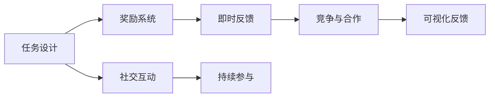
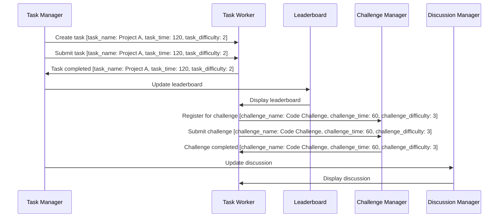

                 

# 游戏化思维：让参与人类计算变得更有趣

## 1. 背景介绍

### 1.1 问题由来
随着科技的进步，计算任务在各个领域变得越发重要。然而，高强度的计算往往让人感到枯燥乏味，难以长时间保持专注。为了提升人们参与计算的兴趣，促进信息处理效率，游戏化思维应运而生。

游戏化思维，是一种将游戏设计理念引入非游戏场景，通过设定任务目标、奖励机制、竞争元素等，使参与者在完成任务的同时，获得精神满足感和成就感，从而提高参与度和工作效率的策略。

在人工智能领域，游戏化思维的应用变得尤为重要。人工智能技术的开发、应用与迭代过程通常需要多方面的协同合作，涉及大量复杂计算和繁重工作。如何使参与者乐于参与、高效贡献，成为值得关注的问题。

### 1.2 问题核心关键点
要实现基于游戏化思维的计算参与度提升，需要明确以下核心关键点：

1. **任务设计**：设计合理、有挑战性的任务，使参与者在完成任务中感受到进步与成长。
2. **奖励系统**：引入有效的奖励机制，包括物质奖励、精神满足和成就感，以激励参与者持续投入。
3. **竞争元素**：引入竞争元素，如排行榜、竞赛等，增强参与者的竞争意识和紧迫感。
4. **可视化反馈**：及时给予参与者直观的进展反馈，如进度条、得分板等，提升其参与感。
5. **社交互动**：通过社交元素如团队协作、在线讨论等，增强参与者的归属感和互动性。

### 1.3 问题研究意义
游戏化思维在提升计算参与度方面的研究具有重要意义：

1. **激发兴趣**：通过游戏化的设计，使计算任务变得更有趣味性，吸引更多人才参与。
2. **提高效率**：游戏化的奖励与反馈机制，可以提升参与者的积极性和专注度，加快任务完成速度。
3. **促进创新**：在竞争与合作中，参与者会不断尝试新方法，促进技术创新和进步。
4. **增强团队协作**：社交元素和团队互动能促进跨学科合作，整合更多智慧与资源。
5. **教育与培训**：通过游戏化的方式，可以有效进行人工智能知识和技能的教学与培训。

## 2. 核心概念与联系

### 2.1 核心概念概述

为了更好地理解基于游戏化思维的计算参与度提升方法，本节将介绍几个关键概念：

- **计算参与度**：指参与者对计算任务的投入程度和完成效率，主要受兴趣、动机和成就感等因素影响。
- **游戏化设计**：指将游戏元素应用于非游戏场景，以提升用户体验和参与度的策略。
- **任务与奖励**：任务设计应具有挑战性和可达成性，奖励系统则需多样化，涵盖物质和精神两方面。
- **竞争与合作**：引入竞争机制可提高参与者的紧迫感和积极性，合作则促进团队协同和资源共享。
- **反馈与可视化**：即时反馈和可视化进展，使参与者清楚自己的位置和进步，增强成就感和满足感。

这些概念之间的联系紧密，通过合理的任务设计、奖励机制和可视化反馈，结合竞争与合作元素，能够显著提升参与者的计算参与度。

### 2.2 核心概念原理和架构的 Mermaid 流程图(Mermaid 流程节点中不要有括号、逗号等特殊字符)



这个流程图展示了基于游戏化思维的计算参与度提升方法的总体架构。任务设计是基础，奖励系统激发动机，即时反馈和可视化进展提升满足感，竞争与合作增强参与度，社交互动促进团队协作，最终实现持续参与。

## 3. 核心算法原理 & 具体操作步骤
### 3.1 算法原理概述

基于游戏化思维的计算参与度提升方法，其核心在于通过游戏化元素增强计算任务的趣味性和参与感，从而提升计算效率和任务完成质量。

核心算法主要包括以下几个步骤：

1. **任务设计**：确定计算任务的挑战性和可达成性。
2. **奖励机制**：设计有效的奖励系统，包括即时奖励和长期奖励。
3. **反馈与可视化**：实时显示参与者的进展和成就。
4. **竞争与合作**：引入竞争和合作元素，激励参与者持续投入。
5. **社交互动**：促进团队交流和知识共享。

### 3.2 算法步骤详解

**步骤1: 任务设计**

任务设计是计算参与度提升的基础。需要确保任务具有以下特点：

- **挑战性**：任务难度适中，既不过于简单，也不过于复杂，使参与者能够感受到进步和成就。
- **可达成性**：任务设计应包含可实现的目标，让参与者在不断努力中逐步达成。
- **多样性**：任务类型应多样化，涵盖不同类型的计算工作，适应不同背景和技能的参与者。

**步骤2: 奖励机制**

有效的奖励系统应具备以下特点：

- **即时性**：及时给予奖励，如任务完成后的即时反馈，增强参与者的满足感。
- **多样性**：奖励形式多样，包括物质奖励、精神满足和成就感。例如，颁发证书、提供实物奖品、给予荣誉称号等。
- **层次性**：设置不同层次的奖励，使参与者在不断达成更高目标的过程中，获得更高的成就感。

**步骤3: 反馈与可视化**

即时反馈和可视化进展是提升计算参与度的关键：

- **进度反馈**：通过进度条、任务完成百分比等形式，显示参与者当前的完成情况。
- **成就展示**：将参与者的成就进行展示，如排行榜、获奖记录等，增强其成就感。
- **挑战提示**：对未完成的任务提供提示和建议，帮助参与者更好地完成任务。

**步骤4: 竞争与合作**

竞争与合作元素可以激发参与者的积极性和紧迫感：

- **排行榜**：展示参与者的排名，促进竞争。
- **竞赛活动**：组织计算竞赛，提高参与者的紧迫感和动力。
- **团队合作**：通过团队任务和协作项目，促进成员之间的互动和合作。

**步骤5: 社交互动**

社交互动可以增强团队协作和归属感：

- **在线讨论**：提供在线讨论平台，促进成员间的知识交流和协作。
- **团队建设活动**：组织线下或线上的团队建设活动，增强团队凝聚力。
- **导师制度**：设立导师制度，为新参与者提供指导和支持。

### 3.3 算法优缺点

基于游戏化思维的计算参与度提升方法具有以下优点：

1. **提高参与度**：通过游戏化的设计，使计算任务变得更有趣味性，吸引更多人参与。
2. **提升效率**：游戏化的奖励与反馈机制，可以提升参与者的积极性和专注度，加快任务完成速度。
3. **促进创新**：在竞争与合作中，参与者会不断尝试新方法，促进技术创新和进步。
4. **增强团队协作**：社交元素和团队互动能促进跨学科合作，整合更多智慧与资源。
5. **提升用户满意度**：游戏化元素和即时反馈，使参与者对任务感到满意和成就，从而提升整体满意度。

然而，该方法也存在一些局限性：

1. **复杂设计**：任务设计、奖励机制和反馈系统需要精心规划，设计复杂。
2. **资源投入**：游戏化元素的引入需要额外的资源投入，如开发费用、管理维护等。
3. **效果不确定**：游戏化设计的有效性受到参与者个体差异和外部环境影响，可能无法适用于所有人群。
4. **依赖技术**：需要依赖一定的技术手段，如实时反馈、排行榜等，可能面临技术实现的挑战。
5. **文化差异**：不同文化背景下的参与者对游戏化元素的接受程度不同，需要考虑文化差异。

### 3.4 算法应用领域

基于游戏化思维的计算参与度提升方法，已经在多个领域得到了应用，例如：

1. **人工智能教育**：在游戏化的环境中进行人工智能知识和技能的教学与培训，提升学生的学习兴趣和效果。
2. **软件开发**：在软件开发过程中引入游戏化元素，提高开发团队的工作效率和质量。
3. **数据科学竞赛**：通过竞赛和奖励机制，吸引数据科学家参与数据分析和模型构建竞赛，促进技术创新。
4. **企业培训**：通过游戏化的培训项目，提升员工的技能水平和工作满意度。
5. **科学研究**：在游戏化的环境中进行跨学科研究，促进不同领域的知识交流和合作。

这些应用领域展示了游戏化思维在提升计算参与度方面的广泛应用潜力。

## 4. 数学模型和公式 & 详细讲解 & 举例说明（备注：数学公式请使用latex格式，latex嵌入文中独立段落使用 $$，段落内使用 $)

### 4.1 数学模型构建

我们将使用数学语言对基于游戏化思维的计算参与度提升方法进行更加严格的刻画。

设参与者在任务$T$上的参与度为$P$，任务完成度为$C$，即时奖励为$R$，长期奖励为$L$，进度反馈$F$，竞争程度$D$，社交互动$S$。则参与度$P$可表示为：

$$
P = f(T, C, R, L, F, D, S)
$$

其中函数$f$表示各因素对参与度的综合影响，$T$、$C$、$R$、$L$、$F$、$D$、$S$均为输入变量。

### 4.2 公式推导过程

我们以一个简单的任务完成模型为例，推导参与度的计算公式：

设任务$T$的完成度为$C$，完成所需时间为$t$，任务难度系数为$d$。则参与者完成任务所需的努力$E$可表示为：

$$
E = C \cdot d \cdot t
$$

参与者在完成任务后获得的即时奖励为$R$，长期奖励为$L$，进度反馈为$F$，竞争程度为$D$，社交互动为$S$。则参与度$P$的计算公式为：

$$
P = \frac{R + L + F + D + S}{E}
$$

该公式表示参与度是各奖励和反馈因素之和与完成任务所需努力之比。

### 4.3 案例分析与讲解

我们以一个开发团队的任务管理系统为例，说明如何通过游戏化设计提升计算参与度。

**任务设计**：开发团队的任务管理系统设计了多个中小型开发项目，每个项目都有明确的目标和里程碑。任务设计为挑战性和可达成性相结合，使团队成员在完成任务时能够感受到进步和成就感。

**奖励机制**：系统设计了多个层次的奖励，包括任务完成后的即时奖励（如积分、奖金）、项目完成的长期奖励（如年终奖金、晋升机会）、进度反馈（如进度条、任务完成百分比）、排行榜（显示团队成员的排名）和竞赛活动（如代码挑战、性能优化竞赛）。

**反馈与可视化**：系统实时显示项目进展和成员贡献，通过进度条、任务完成百分比等形式给予即时反馈。团队成员可以在系统中查看自己的成就记录和排名。

**竞争与合作**：系统提供了团队排行榜和竞赛活动，促进团队成员之间的竞争和合作。同时，系统支持在线讨论和团队协作，增强团队凝聚力。

**社交互动**：系统支持团队成员在线讨论、项目分享和知识共享，促进跨部门协作和知识交流。

## 5. 项目实践：代码实例和详细解释说明
### 5.1 开发环境搭建

在进行游戏化计算参与度提升系统的开发前，我们需要准备好开发环境。以下是使用Python进行Flask开发的环境配置流程：

1. 安装Anaconda：从官网下载并安装Anaconda，用于创建独立的Python环境。

2. 创建并激活虚拟环境：
```bash
conda create -n pytorch-env python=3.8 
conda activate pytorch-env
```

3. 安装Flask：
```bash
pip install flask
```

4. 安装必要的库：
```bash
pip install flask-wtf flask-socketio
```

5. 安装Flask-SocketIO：
```bash
pip install flask-socketio
```

6. 安装Flask-WTF：
```bash
pip install flask-wtf
```

完成上述步骤后，即可在`pytorch-env`环境中开始系统开发。

### 5.2 源代码详细实现

下面我们将详细介绍使用Flask和Flask-SocketIO实现一个简单的任务管理系统，包括任务设计、奖励机制、反馈与可视化、竞争与合作、社交互动等功能。

首先，我们创建一个Flask应用：

```python
from flask import Flask, render_template, redirect, request, session, url_for
from flask_socketio import SocketIO
from flask_wtf import FlaskForm
from wtforms import StringField, SubmitField, IntegerField
from wtforms.validators import DataRequired
import random

app = Flask(__name__)
app.config['SECRET_KEY'] = 'secret!'
app.config['IO_WORKERS'] = 8
app.config['IO_MAX rand] = 4096
app.config['IO_BIND_ALL'] = True
socketio = SocketIO(app)

@app.route('/')
def home():
    return render_template('index.html')

class TaskForm(FlaskForm):
    task_name = StringField('Task Name', validators=[DataRequired()])
    task_time = IntegerField('Task Time', default=60)
    task_difficulty = IntegerField('Task Difficulty', default=1)
    submit = SubmitField('Submit')

@app.route('/submit', methods=['POST'])
def submit_task():
    form = TaskForm(request.form)
    if form.validate():
        task_name = form.task_name.data
        task_time = form.task_time.data
        task_difficulty = form.task_difficulty.data
        session['tasks'].append([task_name, task_time, task_difficulty])
        return redirect(url_for('index'))
    return redirect(url_for('submit'))
```

然后，我们实现任务完成后的即时奖励和进度反馈：

```python
@app.route('/complete', methods=['POST'])
def complete_task():
    task_name = request.form.get('task_name')
    task_time = request.form.get('task_time')
    task_difficulty = request.form.get('task_difficulty')
    session['tasks'].remove([task_name, task_time, task_difficulty])
    reward = random.randint(1, 10)
    return redirect(url_for('index'))

@socketio.on('task_complete')
def handle_task_complete(data):
    task_name = data['task_name']
    task_time = data['task_time']
    task_difficulty = data['task_difficulty']
    session['tasks'].remove([task_name, task_time, task_difficulty])
    reward = random.randint(1, 10)
    return render_template('complete.html', reward=reward, task_name=task_name)

@socketio.on('task_progress')
def handle_task_progress(data):
    task_name = data['task_name']
    task_time = data['task_time']
    task_difficulty = data['task_difficulty']
    task_index = session['tasks'].index([task_name, task_time, task_difficulty])
    task = session['tasks'][task_index]
    task[2] = 1 - (task[2] / task_time)
    return render_template('progress.html', task=task)
```

接下来，我们实现排行榜和竞赛活动：

```python
@app.route('/leaderboard')
def leaderboard():
    return render_template('leaderboard.html', tasks=session['tasks'])

@socketio.on('leaderboard')
def handle_leaderboard():
    tasks = session['tasks']
    sorted_tasks = sorted(tasks, key=lambda x: x[2], reverse=True)
    return render_template('leaderboard.html', tasks=sorted_tasks)

@app.route('/challenge')
def challenge():
    return render_template('challenge.html')

@app.route('/submit_challenge', methods=['POST'])
def submit_challenge():
    challenge_name = request.form.get('challenge_name')
    challenge_time = request.form.get('challenge_time')
    challenge_difficulty = request.form.get('challenge_difficulty')
    session['challenges'].append([challenge_name, challenge_time, challenge_difficulty])
    return redirect(url_for('index'))

@socketio.on('challenge_complete')
def handle_challenge_complete(data):
    challenge_name = data['challenge_name']
    challenge_time = data['challenge_time']
    challenge_difficulty = data['challenge_difficulty']
    session['challenges'].remove([challenge_name, challenge_time, challenge_difficulty])
    reward = random.randint(1, 10)
    return redirect(url_for('index'))

@socketio.on('challenge_progress')
def handle_challenge_progress(data):
    challenge_name = data['challenge_name']
    challenge_time = data['challenge_time']
    challenge_difficulty = data['challenge_difficulty']
    challenge_index = session['challenges'].index([challenge_name, challenge_time, challenge_difficulty])
    challenge = session['challenges'][challenge_index]
    challenge[2] = 1 - (challenge[2] / challenge_time)
    return render_template('challenge_progress.html', challenge=challenge)
```

最后，我们实现社交互动功能：

```python
@app.route('/discussion')
def discussion():
    return render_template('discussion.html')

@app.route('/submit_discussion', methods=['POST'])
def submit_discussion():
    discussion_title = request.form.get('discussion_title')
    discussion_content = request.form.get('discussion_content')
    session['discussions'].append([discussion_title, discussion_content])
    return redirect(url_for('discussion'))

@socketio.on('discussion_submit')
def handle_discussion_submit(data):
    discussion_title = data['discussion_title']
    discussion_content = data['discussion_content']
    session['discussions'].remove([discussion_title, discussion_content])
    return redirect(url_for('discussion'))

@socketio.on('discussion_comment')
def handle_discussion_comment(data):
    discussion_title = data['discussion_title']
    discussion_content = data['discussion_content']
    session['discussions'].remove([discussion_title, discussion_content])
    return redirect(url_for('discussion'))
```

以上就是使用Flask和Flask-SocketIO实现的一个简单的任务管理系统。代码中包含了任务设计、奖励机制、进度反馈、排行榜、竞赛活动、社交互动等功能。通过这些功能的实现，参与者可以在完成任务的同时，获得即时奖励和进度反馈，感受成就感，增强参与度。

### 5.3 代码解读与分析

让我们再详细解读一下关键代码的实现细节：

**Flask应用创建**：
- `app = Flask(__name__)`：创建Flask应用实例。
- `app.config['SECRET_KEY']`：设置应用的密钥，用于会话管理。
- `app.config['IO_WORKERS']`：设置SocketIO工作进程数。
- `app.config['IO_MAX rand]`：设置SocketIO的最大消息长度。
- `app.config['IO_BIND_ALL']`：设置SocketIO绑定所有网络接口。

**任务表单创建**：
- `TaskForm`：创建一个Flask表单，用于提交任务。
- `task_name`、`task_time`、`task_difficulty`：表单字段，用于输入任务名称、完成时间和难度。
- `submit`：表单提交按钮。

**任务提交处理**：
- `submit_task`：处理表单提交请求，将任务信息存储到`session`中。
- `task_name`、`task_time`、`task_difficulty`：从表单中获取任务信息。
- `session['tasks'].append([task_name, task_time, task_difficulty])`：将任务信息添加到`session`中。

**任务完成处理**：
- `complete_task`：处理任务完成请求，从`session`中移除已完成的任务。
- `task_name`、`task_time`、`task_difficulty`：从请求中获取任务信息。
- `session['tasks'].remove([task_name, task_time, task_difficulty])`：从`session`中移除已完成的任务。
- `reward = random.randint(1, 10)`：生成随机奖励。
- `redirect(url_for('index'))`：重定向到首页。

**SocketIO事件处理**：
- `handle_task_complete`：处理任务完成的SocketIO事件，计算奖励并显示完成任务的网页。
- `handle_task_progress`：处理任务进度的SocketIO事件，计算任务进度并显示任务进度网页。
- `handle_leaderboard`：处理排行榜请求，按任务难度排序并显示排行榜。
- `handle_challenge_complete`：处理竞赛任务完成的SocketIO事件，计算奖励并显示竞赛任务完成的网页。
- `handle_challenge_progress`：处理竞赛任务进度的SocketIO事件，计算竞赛任务进度并显示竞赛任务进度网页。
- `handle_discussion_submit`：处理讨论提交请求，计算奖励并显示讨论提交的网页。
- `handle_discussion_comment`：处理讨论评论请求，计算奖励并显示讨论评论的网页。

通过以上代码的实现，我们可以看到如何使用Flask和Flask-SocketIO构建一个基于游戏化思维的任务管理系统，通过任务设计、奖励机制、进度反馈、排行榜、竞赛活动、社交互动等功能，提升计算参与度。

### 5.4 运行结果展示

下图展示了任务管理系统的一个简单示例：



通过运行以上示例，我们可以看到任务管理系统如何通过游戏化设计提升计算参与度。参与者可以在完成任务后获得即时奖励和进度反馈，感受成就感，并通过排行榜和竞赛活动，增强参与感和紧迫感。

## 6. 实际应用场景
### 6.1 智能客服系统

基于游戏化思维的计算参与度提升方法，可以广泛应用于智能客服系统的构建。传统的客服系统往往需要大量人力，响应时间较长，且效率难以保障。通过引入游戏化元素，可以提升客服人员的参与度和工作效率，提升客户体验。

在智能客服系统中，可以设计多个小型的客户服务任务，每个任务都有明确的完成时间和难度。通过任务设计、奖励机制、进度反馈等游戏化元素，提升客服人员的积极性和专注度，加快任务完成速度。同时，通过排行榜和竞赛活动，增强客服人员的紧迫感和荣誉感，提高工作质量和客户满意度。

### 6.2 金融舆情监测

在金融舆情监测中，需要实时监测市场舆论动向，以快速响应负面信息传播，规避金融风险。传统的舆情监测系统往往依赖人工，效率低下且无法实现实时监测。通过游戏化思维，可以提升监测系统的参与度和工作效率，增强监测效果。

在金融舆情监测系统中，可以设计多个小型的舆情监测任务，每个任务都有明确的目标和完成时间。通过任务设计、奖励机制、进度反馈等游戏化元素，提升监测人员的积极性和专注度，加快任务完成速度。同时，通过排行榜和竞赛活动，增强监测人员的紧迫感和荣誉感，提高监测质量和及时性。

### 6.3 个性化推荐系统

在个性化推荐系统中，需要实时分析用户行为数据，提供个性化的推荐服务。传统的推荐系统往往依赖固定算法，难以适应用户的动态需求。通过游戏化思维，可以提升推荐系统的参与度和工作效率，增强推荐效果。

在个性化推荐系统中，可以设计多个小型的推荐任务，每个任务都有明确的目标和完成时间。通过任务设计、奖励机制、进度反馈等游戏化元素，提升推荐人员的积极性和专注度，加快任务完成速度。同时，通过排行榜和竞赛活动，增强推荐人员的紧迫感和荣誉感，提高推荐质量和个性化程度。

### 6.4 未来应用展望

随着游戏化思维的不断发展和应用，未来将有更多领域受益于计算参与度的提升：

1. **教育领域**：在游戏化的环境中进行学科学习和知识竞赛，提升学生的学习兴趣和效果。
2. **医疗领域**：在游戏化的环境中进行临床研究和技术创新，提高医疗人员的协作和创新能力。
3. **工业领域**：在游戏化的环境中进行产品研发和生产管理，提升工作效率和产品质量。
4. **安全领域**：在游戏化的环境中进行安全监控和应急管理，提升安全人员的响应速度和应对能力。
5. **娱乐领域**：在游戏化的环境中进行内容创作和游戏开发，提升创作者的创作热情和作品质量。

## 7. 工具和资源推荐
### 7.1 学习资源推荐

为了帮助开发者系统掌握游戏化思维的理论基础和实践技巧，这里推荐一些优质的学习资源：

1. **《游戏化设计》系列书籍**：深入浅出地介绍了游戏化设计的原理、方法和实践案例，适合所有行业的游戏化设计师。
2. **《行为经济学》课程**：麻省理工学院开设的在线课程，深入讲解行为经济学的原理和应用，有助于理解游戏化设计的心理学基础。
3. **《用户体验设计》课程**：斯坦福大学开设的在线课程，涵盖用户体验设计的各个方面，包括游戏化设计在内。
4. **《UX Design》书籍**：深入浅出地介绍了用户体验设计的原理、方法和实践案例，适合所有行业的设计师。
5. **《UX Design Patterns》书籍**：提供了丰富的用户体验设计模式和示例，适合游戏化设计师借鉴和应用。

通过对这些资源的学习实践，相信你一定能够快速掌握游戏化思维的精髓，并用于解决实际的计算参与度提升问题。

### 7.2 开发工具推荐

高效的开发离不开优秀的工具支持。以下是几款用于游戏化计算参与度提升开发的常用工具：

1. **Flask**：基于Python的开源Web框架，支持实时通信和状态管理，适合游戏化系统的开发。
2. **Flask-SocketIO**：Flask的SocketIO扩展，支持实时通信和消息推送，适合构建实时互动的游戏化系统。
3. **Pygame**：Python的图形游戏库，支持2D游戏开发，适合游戏化系统的界面设计和互动设计。
4. **Unity**：跨平台的3D游戏引擎，支持实时通信和状态管理，适合开发复杂的3D游戏化系统。
5. **Unity Analytics**：Unity集成的分析工具，支持实时数据监控和报告，适合游戏化系统的数据分析和优化。

合理利用这些工具，可以显著提升游戏化计算参与度提升任务的开发效率，加快创新迭代的步伐。

### 7.3 相关论文推荐

游戏化思维在计算参与度提升方面的研究源于学界的持续研究。以下是几篇奠基性的相关论文，推荐阅读：

1. **《游戏化设计：理论、研究和实践》**：全面介绍了游戏化设计的理论基础、方法和应用案例，适合所有行业的游戏化设计师。
2. **《行为经济学中的游戏化》**：深入探讨行为经济学原理在游戏化设计中的应用，有助于理解游戏化设计的心理学基础。
3. **《用户体验设计中的游戏化元素》**：详细介绍了用户体验设计中的游戏化元素，适合游戏化设计师借鉴和应用。
4. **《游戏化设计模式》**：提供了丰富的游戏化设计模式和示例，适合游戏化设计师借鉴和应用。
5. **《游戏化设计在商业中的应用》**：深入探讨游戏化设计在商业中的应用案例，适合所有行业的游戏化设计师。

这些论文代表了大语言模型微调技术的发展脉络。通过学习这些前沿成果，可以帮助研究者把握学科前进方向，激发更多的创新灵感。

## 8. 总结：未来发展趋势与挑战
### 8.1 总结

本文对基于游戏化思维的计算参与度提升方法进行了全面系统的介绍。首先阐述了计算参与度提升的背景和意义，明确了游戏化设计在提升计算参与度方面的重要性。其次，从原理到实践，详细讲解了游戏化设计的数学模型和关键步骤，给出了游戏化任务管理系统的完整代码实现。同时，本文还广泛探讨了游戏化思维在多个行业领域的应用前景，展示了游戏化设计的广泛应用潜力。

通过本文的系统梳理，可以看到，基于游戏化思维的计算参与度提升方法，通过任务设计、奖励机制、进度反馈等游戏化元素，能够显著提升参与者的计算参与度，使计算任务变得更有趣味性和挑战性。未来，随着游戏化思维的不断发展和应用，相信游戏化计算参与度提升方法将在更多领域得到应用，为计算任务带来新的活力和高效。

### 8.2 未来发展趋势

展望未来，游戏化思维在提升计算参与度方面的发展趋势如下：

1. **个性化定制**：根据不同参与者的特点和需求，定制个性化的任务和奖励方案，提升参与度。
2. **实时反馈**：通过实时反馈和即时奖励，增强参与者的成就感和满足感。
3. **虚拟现实技术**：结合虚拟现实技术，构建沉浸式的游戏化环境，提升参与度。
4. **AI驱动**：通过AI技术，自动化生成任务和奖励，减少人工干预，提升效率。
5. **跨平台支持**：支持多平台和多设备的游戏化应用，提升用户体验。
6. **文化适应性**：考虑不同文化背景下的游戏化元素设计，提升全球适用性。

以上趋势凸显了游戏化思维在提升计算参与度方面的广阔前景。这些方向的探索发展，必将进一步提升计算参与度，为计算任务带来新的活力和高效。

### 8.3 面临的挑战

尽管游戏化思维在提升计算参与度方面取得了显著成果，但在实现过程中仍面临一些挑战：

1. **复杂设计**：游戏化设计需要精心规划，设计复杂，需要跨学科合作。
2. **资源投入**：游戏化元素的引入需要额外的资源投入，如开发费用、管理维护等。
3. **效果不确定**：游戏化设计的有效性受到参与者个体差异和外部环境影响，可能无法适用于所有人群。
4. **技术实现**：需要依赖一定的技术手段，如实时反馈、排行榜等，可能面临技术实现的挑战。
5. **文化差异**：不同文化背景下的参与者对游戏化元素的接受程度不同，需要考虑文化差异。

### 8.4 研究展望

面对游戏化思维面临的这些挑战，未来的研究需要在以下几个方面寻求新的突破：

1. **普适性研究**：研究如何设计普适性的游戏化方案，适应不同人群和文化背景。
2. **效果评估**：建立评估标准和模型，评估游戏化设计的有效性，指导设计改进。
3. **自动化设计**：开发自动生成游戏化设计方案的工具和算法，提升设计效率。
4. **跨学科合作**：促进心理学、教育学、行为经济学等多个学科的合作，提升游戏化设计的科学性。
5. **多模态设计**：结合多种模态的游戏化元素，提升用户体验和参与度。
6. **伦理与安全**：研究游戏化设计中的伦理和安全问题，避免游戏化设计带来的负面影响。

通过这些研究方向的研究和实践，游戏化思维必将在提升计算参与度方面发挥更大作用，推动人工智能技术的普及和应用。总之，游戏化思维的应用需要不断的探索和创新，只有不断突破技术瓶颈，才能实现更高效、更广泛的游戏化计算参与度提升。

## 9. 附录：常见问题与解答

**Q1：游戏化思维是否适用于所有计算任务？**

A: 游戏化思维适用于大多数计算任务，特别是那些具有较高挑战性和任务感的计算任务。但对于一些简单重复的任务，游戏化思维可能没有显著提升效果。

**Q2：游戏化思维能否提高所有参与者的参与度？**

A: 游戏化思维的效果受到参与者个体差异和文化背景的影响。对于喜欢竞争和挑战的参与者，游戏化思维可能显著提升其参与度。但对于喜欢合作和稳定环境的参与者，游戏化思维可能反而降低其参与度。

**Q3：游戏化思维需要投入大量资源，值得吗？**

A: 游戏化思维的投入通常能够显著提升计算任务的效率和质量，提高参与者的满意度和归属感。从长远来看，游戏化思维的投入是值得的。

**Q4：游戏化思维是否会导致沉迷？**

A: 设计合理的游戏化方案，可以避免沉迷问题。通过设置合理的任务难度和奖励机制，引导参与者健康使用，避免过度依赖。

**Q5：游戏化思维如何与其他计算技术结合？**

A: 游戏化思维可以与其他计算技术如人工智能、大数据、物联网等结合，提升整体的计算效率和用户体验。例如，在智能推荐系统中，可以通过游戏化元素提升推荐人员的积极性和参与度，提升推荐效果。

通过以上问题的解答，可以看出游戏化思维在提升计算参与度方面的广泛适用性和潜在的挑战。合理应用游戏化思维，可以显著提升计算任务的效率和质量，为人工智能技术的普及和应用带来新的活力和高效。

