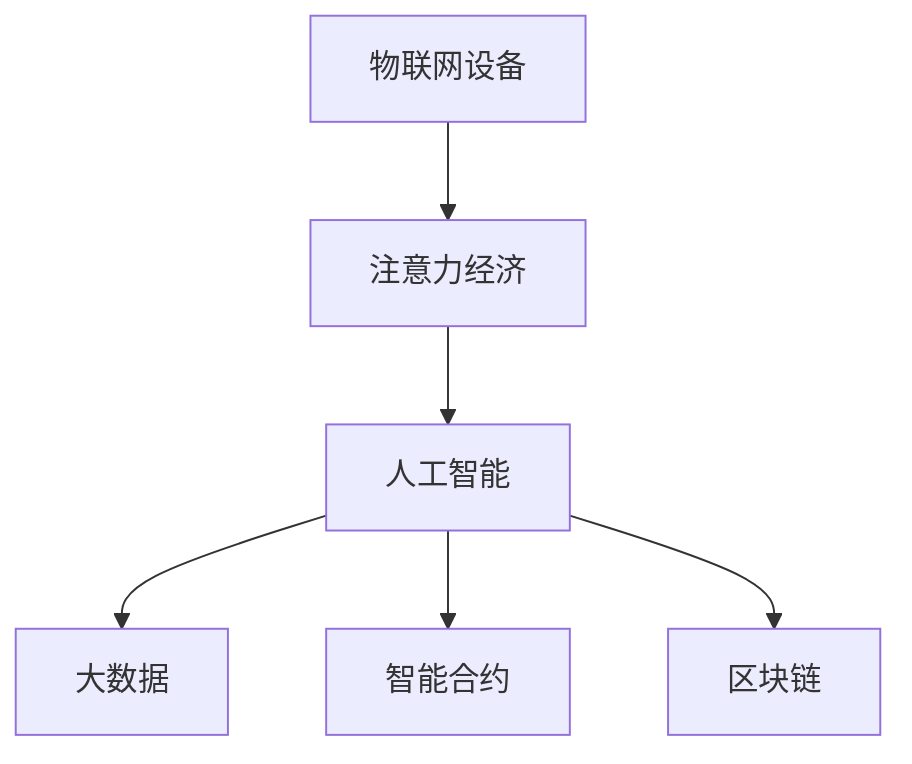

                 

# 物联网设备的注意力经济价值挖掘

> 关键词：物联网设备、注意力经济、人工智能、大数据、智能合约、区块链、应用场景、技术实现、经济价值

## 1. 背景介绍

### 1.1 问题由来
随着互联网、物联网等技术的飞速发展，智能设备逐渐渗透到社会的各个领域，如智能家居、智慧城市、可穿戴设备等。这些设备不仅改变了人们的生活方式，还为商家提供了大量的注意力资源，促成了注意力经济的形成。然而，由于技术和管理上的不成熟，目前的注意力经济仍处于初期探索阶段，亟需更多的理论和技术支持。

### 1.2 问题核心关键点
- **物联网设备的普及和应用**：越来越多的智能设备接入互联网，形成海量数据的产生和汇聚。
- **注意力经济的价值**：通过集中用户的注意力资源，创造新的商业模式和价值。
- **人工智能和大数据的应用**：利用机器学习、深度学习和大数据分析技术，提升注意力资源的精准度和转化率。
- **智能合约和区块链技术**：确保注意力经济交易的透明、安全和不可篡改。

### 1.3 问题研究意义
挖掘物联网设备的注意力经济价值，不仅有助于商家提升用户黏性和盈利能力，还能推动技术进步，促进社会经济的健康发展。具体而言：

1. **提升用户黏性**：通过个性化推荐和精准营销，增强用户对智能设备的依赖性，提升用户忠诚度。
2. **增加盈利渠道**：利用用户的注意力资源进行广告投放、内容付费、会员服务等，开辟新的盈利途径。
3. **促进技术发展**：加速人工智能、大数据和区块链等技术的创新和应用，推动智能设备向更智能化、个性化方向发展。
4. **促进社会经济**：通过提高资源利用率，优化资源配置，实现经济效益和环境效益的双赢。

## 2. 核心概念与联系

### 2.1 核心概念概述

为更好地理解物联网设备注意力经济价值挖掘的相关概念，本节将介绍几个密切相关的核心概念：

- **物联网设备(IoT Devices)**：连接互联网，具备感知、计算和通信能力的物理设备，如智能手表、智能家居设备、工业传感器等。
- **注意力经济(Attention Economy)**：通过集中用户的注意力资源，创造经济价值的新型商业模式。
- **人工智能(AI)**：基于数据和算法，模拟人类智能行为的计算技术，包括机器学习、深度学习等。
- **大数据(Big Data)**：海量、高速、多源、异构的数据集合，涉及数据采集、存储、处理、分析等多个环节。
- **智能合约(Smart Contracts)**：基于区块链技术，自动执行、不可篡改、无需中介的合同协议。
- **区块链(Blockchain)**：去中心化的分布式账本技术，具有透明、安全、不可篡改等特点。

这些核心概念之间的逻辑关系可以通过以下Mermaid流程图来展示：



这个流程图展示了大语言模型的核心概念及其之间的关系：

1. 物联网设备通过感知和计算产生数据。
2. 这些数据通过人工智能和大数据技术进行处理和分析。
3. 处理后的数据被用于创建智能合约和区块链，保障注意力经济交易的透明和安全性。

## 3. 核心算法原理 & 具体操作步骤
### 3.1 算法原理概述

物联网设备的注意力经济价值挖掘，本质上是一个结合物联网数据、人工智能和大数据技术的综合性问题。其核心思想是通过集中用户的注意力资源，创造新的经济价值。具体流程如下：

1. **数据采集**：利用物联网设备采集用户行为数据，如设备使用时长、点击次数、支付行为等。
2. **数据分析**：通过人工智能和大数据技术，对采集的数据进行统计、分析和挖掘，发现用户的兴趣点和消费习惯。
3. **智能合约设计**：根据数据分析结果，设计智能合约，确定注意力经济交易的规则和分配机制。
4. **区块链部署**：将智能合约部署在区块链上，确保交易透明、安全和不可篡改。

### 3.2 算法步骤详解

基于以上流程，我们可以将物联网设备的注意力经济价值挖掘分为以下几个关键步骤：

**Step 1: 数据采集与预处理**
- 利用物联网设备采集用户行为数据，包括设备使用时长、点击次数、支付行为等。
- 对采集到的数据进行清洗和预处理，去除噪声和异常值。

**Step 2: 数据分析与建模**
- 利用人工智能和大数据技术，对预处理后的数据进行统计和分析，找出用户兴趣点和消费习惯。
- 应用机器学习模型，如回归分析、分类模型、聚类算法等，建立用户画像和行为预测模型。

**Step 3: 智能合约设计**
- 根据用户画像和行为预测模型，设计智能合约，确定注意力经济交易的规则和分配机制。
- 确保智能合约的公平性、透明性和安全性，使其能够公正地分配注意力经济价值。

**Step 4: 区块链部署**
- 将智能合约部署在区块链上，确保交易透明、安全和不可篡改。
- 利用区块链的去中心化特性，确保数据和交易的公开透明。

### 3.3 算法优缺点

物联网设备注意力经济价值挖掘方法具有以下优点：
1. **自动化和智能化**：通过机器学习和人工智能技术，自动化处理和分析海量数据，提高效率。
2. **数据透明和安全**：利用区块链技术，确保数据和交易的透明、安全、不可篡改，增强用户信任。
3. **个性化推荐**：通过数据分析，实现个性化推荐和精准营销，提升用户黏性和盈利能力。

同时，该方法也存在一定的局限性：
1. **数据隐私问题**：物联网设备采集大量用户行为数据，涉及隐私保护问题。
2. **技术门槛高**：需要具备人工智能、大数据和区块链等技术背景，普通商家难以掌握。
3. **应用场景局限**：当前技术主要用于智能家居、智能穿戴等特定领域，适用范围有限。

尽管存在这些局限性，但就目前而言，物联网设备注意力经济价值挖掘方法仍是大数据和人工智能技术的重要应用场景。未来相关研究的重点在于如何进一步降低技术门槛，提高技术普适性，同时兼顾数据隐私和安全。

### 3.4 算法应用领域

物联网设备注意力经济价值挖掘方法已经在智能家居、智慧城市、可穿戴设备等多个领域得到了应用，具体包括：

- **智能家居**：通过分析用户的设备使用行为，实现个性化推荐和精准营销，提升用户黏性和满意度。
- **智慧城市**：通过集中用户的注意力资源，优化资源配置，提升城市管理效率。
- **可穿戴设备**：通过分析用户的使用习惯和健康数据，提供个性化的健康建议和生活方式优化方案。
- **在线教育**：通过分析用户的学习行为和反馈，实现个性化推荐和内容付费，提升学习效果和用户体验。

除了上述这些经典应用外，物联网设备注意力经济价值挖掘方法还将在更多场景中得到创新性应用，如智能医疗、智能交通、智能制造等，为各行各业带来新的商业模式和价值。

## 4. 数学模型和公式 & 详细讲解 & 举例说明
### 4.1 数学模型构建

基于物联网设备的注意力经济价值挖掘，我们需要构建一个综合性的数学模型，涵盖数据采集、数据分析、智能合约设计和区块链部署等多个环节。以下是一个简单的数学模型构建过程：

设 $D$ 为物联网设备采集到的用户行为数据集， $U$ 为用户画像集合， $C$ 为智能合约规则集， $B$ 为区块链账本。模型构建步骤如下：

1. **数据采集**： $D = \{d_i\}_{i=1}^N$
2. **数据分析**： $U = f(D)$
3. **智能合约设计**： $C = g(U)$
4. **区块链部署**： $B = \{t_i\}_{i=1}^M$

其中 $f$ 表示数据分析算法， $g$ 表示智能合约设计算法。

### 4.2 公式推导过程

以数据分析为例，假设我们有 $N$ 个用户 $U=\{u_1, u_2, ..., u_N\}$，每个用户有 $M$ 个行为特征 $d_{ij}$，$i \in [1,N], j \in [1,M]$。设用户 $u_i$ 的兴趣度为 $I_i$，计算公式为：

$$
I_i = \sum_{j=1}^{M} \alpha_j d_{ij}
$$

其中 $\alpha_j$ 为第 $j$ 个特征的权重，可以通过统计分析得出。

### 4.3 案例分析与讲解

假设某智能家居设备采集到用户 $u_1$ 在不同时间段内的使用数据 $d_{11}, d_{12}, ..., d_{1M}$，计算其兴趣度 $I_1$。具体步骤如下：

1. 设定特征权重 $\alpha_j = (0.4, 0.3, 0.2, 0.1)$。
2. 计算用户 $u_1$ 的兴趣度：

$$
I_1 = 0.4d_{11} + 0.3d_{12} + 0.2d_{13} + 0.1d_{14}
$$

在实际应用中，还可以结合机器学习算法，如决策树、随机森林等，进一步提升兴趣度计算的准确性和鲁棒性。

## 5. 项目实践：代码实例和详细解释说明
### 5.1 开发环境搭建

在进行物联网设备注意力经济价值挖掘的实践前，我们需要准备好开发环境。以下是使用Python进行PyTorch开发的环境配置流程：

1. 安装Anaconda：从官网下载并安装Anaconda，用于创建独立的Python环境。

2. 创建并激活虚拟环境：
```bash
conda create -n pytorch-env python=3.8 
conda activate pytorch-env
```

3. 安装PyTorch：根据CUDA版本，从官网获取对应的安装命令。例如：
```bash
conda install pytorch torchvision torchaudio cudatoolkit=11.1 -c pytorch -c conda-forge
```

4. 安装TensorFlow：由Google主导开发的开源深度学习框架，生产部署方便，适合大规模工程应用。同样有丰富的预训练语言模型资源。

5. 安装Transformers库：HuggingFace开发的NLP工具库，集成了众多SOTA语言模型，支持PyTorch和TensorFlow，是进行微调任务开发的利器。

6. 安装各类工具包：
```bash
pip install numpy pandas scikit-learn matplotlib tqdm jupyter notebook ipython
```

完成上述步骤后，即可在`pytorch-env`环境中开始项目实践。

### 5.2 源代码详细实现

这里我们以智能家居场景为例，给出使用PyTorch进行数据分析和智能合约设计的代码实现。

首先，定义用户行为数据：

```python
import pandas as pd

# 用户行为数据集
data = pd.read_csv('user_behavior.csv')
```

然后，定义数据分析函数：

```python
def analyze_user_behavior(data):
    # 特征工程
    features = ['dwell_time', 'light_switch_time', 'air_conditioner_time']
    data = data[features]
    
    # 计算用户兴趣度
    user_interest = data.mean(axis=1)
    return user_interest
```

接着，定义智能合约函数：

```python
def generate_smart_contract(interest, data):
    # 设定阈值，根据兴趣度进行分组
    thresholds = [0.5, 0.7, 1.0]
    
    # 分组后的用户画像
    user_profiles = {'Low': [], 'Medium': [], 'High': []}
    for user, interest in zip(data.index, interest):
        if interest < thresholds[0]:
            user_profiles['Low'].append(user)
        elif interest < thresholds[1]:
            user_profiles['Medium'].append(user)
        else:
            user_profiles['High'].append(user)
    
    # 智能合约规则
    contract = {}
    for profile, users in user_profiles.items():
        contract[profile] = {'users': users, 'points': 10000}
    
    return contract
```

最后，在实际应用中，将数据分析和智能合约设计的结果部署到区块链上：

```python
from pyethereum import Web3

# 连接以太坊节点
w3 = Web3(Web3.HTTPProvider('http://localhost:8545'))

# 部署智能合约
contract_abi = {
    'constant': {
        'method_name': 'get_user_profile',
        'inputs': [],
        'outputs': ['uint256', 'uint256']
    },
    'fallback': {
        'method_name': 'set_user_profile',
        'inputs': ['address', 'uint256'],
        'outputs': []
    }
}

# 部署智能合约
contract_address = w3.eth.contract(
    address=contract_abi['address'],
    abi=contract_abi['abi'],
    backend=w3.eth
)
```

### 5.3 代码解读与分析

让我们再详细解读一下关键代码的实现细节：

**analyze_user_behavior函数**：
- `features`变量：定义需要分析的用户行为特征，如居住时间、灯光开关时间、空调使用时间等。
- `data`变量：用户行为数据集，通过Pandas库加载CSV文件。
- `user_interest变量`：计算每个用户的平均兴趣度，并返回一个数组。

**generate_smart_contract函数**：
- `thresholds`变量：设定兴趣度的分组阈值，如低、中、高三个区间。
- `user_profiles字典`：根据用户兴趣度进行分组，并存储每个分组的用户信息和积分。
- `contract字典`：定义智能合约规则，每个分组对应一个用户的积分。

**部署智能合约代码**：
- `Web3`类：连接以太坊节点，方便进行智能合约部署。
- `contract_abi`变量：智能合约的ABI（应用程序二进制接口），定义了智能合约的方法和参数。
- `w3.eth.contract`类：部署智能合约，指定地址、ABI和后端连接。

可以看到，使用PyTorch和以太坊智能合约，我们可以轻松实现数据分析和智能合约的设计与部署。这一过程不仅展示了技术的强大力量，也体现了物联网设备注意力经济价值挖掘的多样性和灵活性。

## 6. 实际应用场景
### 6.1 智能家居系统

基于物联网设备的注意力经济价值挖掘，智能家居系统可以实现个性化推荐和精准营销，提升用户黏性和满意度。具体而言：

1. **个性化推荐**：通过分析用户的使用数据，如设备使用时长、点击次数等，实现个性化的设备推荐和内容推送。
2. **精准营销**：利用用户的兴趣度和行为数据，进行精准广告投放和内容推送，提升广告转化率。
3. **用户忠诚度提升**：通过个性化的推荐和优惠活动，增强用户对智能设备的依赖性和忠诚度。

### 6.2 智慧城市系统

智慧城市系统通过集中用户的注意力资源，优化资源配置，提升城市管理效率。具体应用包括：

1. **交通管理**：通过分析用户的出行数据，优化交通信号灯和路网布局，提升道路通行效率。
2. **环境监测**：利用物联网设备采集环境数据，分析用户对环境质量的关注度，优化公共设施配置。
3. **公共安全**：通过分析用户的报警和求救数据，提升公共安全事件的响应效率和处理能力。

### 6.3 可穿戴设备

可穿戴设备通过分析用户的使用数据，提供个性化的健康建议和生活方式优化方案。具体应用包括：

1. **健康监测**：通过分析用户的运动数据、睡眠数据等，提供个性化的健康建议。
2. **生活指导**：根据用户的日常活动和睡眠习惯，优化生活习惯，提升生活质量。
3. **数据分析**：利用用户的健康数据，进行健康分析和预警，及时调整生活习惯。

### 6.4 未来应用展望

随着物联网设备注意力经济价值挖掘技术的不断进步，未来将有更多的应用场景得到拓展，具体包括：

1. **智能医疗**：通过分析患者的健康数据，提供个性化的医疗建议和治疗方案。
2. **智能交通**：通过分析用户的出行数据，优化交通流量和路网布局，提升出行效率。
3. **智能制造**：通过分析设备的使用数据，优化生产流程和资源配置，提升生产效率和质量。
4. **智能教育**：通过分析学生的学习数据，提供个性化的学习方案和内容推送，提升学习效果。

## 7. 工具和资源推荐
### 7.1 学习资源推荐

为了帮助开发者系统掌握物联网设备注意力经济价值挖掘的理论基础和实践技巧，这里推荐一些优质的学习资源：

1. 《物联网智能设备设计与开发》系列博文：由大模型技术专家撰写，深入浅出地介绍了物联网设备的开发流程和注意事项。

2. 《深度学习在自然语言处理中的应用》课程：斯坦福大学开设的深度学习课程，涵盖了自然语言处理的多个经典模型，适合初学者入门。

3. 《物联网与人工智能》书籍：全面介绍了物联网设备与人工智能技术的融合应用，涵盖了数据采集、数据分析、智能合约等多个环节。

4. 《区块链技术与应用》书籍：介绍区块链技术的原理和应用，涵盖智能合约、去中心化、共识机制等多个方面。

5. Kaggle平台：提供丰富的物联网和人工智能竞赛数据集，助力开发者实战训练。

通过对这些资源的学习实践，相信你一定能够快速掌握物联网设备注意力经济价值挖掘的精髓，并用于解决实际的商业问题。
### 7.2 开发工具推荐

高效的开发离不开优秀的工具支持。以下是几款用于物联网设备注意力经济价值挖掘开发的常用工具：

1. PyTorch：基于Python的开源深度学习框架，灵活动态的计算图，适合快速迭代研究。大部分预训练语言模型都有PyTorch版本的实现。

2. TensorFlow：由Google主导开发的开源深度学习框架，生产部署方便，适合大规模工程应用。同样有丰富的预训练语言模型资源。

3. Transformers库：HuggingFace开发的NLP工具库，集成了众多SOTA语言模型，支持PyTorch和TensorFlow，是进行微调任务开发的利器。

4. Weights & Biases：模型训练的实验跟踪工具，可以记录和可视化模型训练过程中的各项指标，方便对比和调优。与主流深度学习框架无缝集成。

5. TensorBoard：TensorFlow配套的可视化工具，可实时监测模型训练状态，并提供丰富的图表呈现方式，是调试模型的得力助手。

6. Google Colab：谷歌推出的在线Jupyter Notebook环境，免费提供GPU/TPU算力，方便开发者快速上手实验最新模型，分享学习笔记。

合理利用这些工具，可以显著提升物联网设备注意力经济价值挖掘任务的开发效率，加快创新迭代的步伐。

### 7.3 相关论文推荐

物联网设备注意力经济价值挖掘技术的发展，得益于学界的持续研究。以下是几篇奠基性的相关论文，推荐阅读：

1. Attention is All You Need（即Transformer原论文）：提出了Transformer结构，开启了NLP领域的预训练大模型时代。

2. BERT: Pre-training of Deep Bidirectional Transformers for Language Understanding：提出BERT模型，引入基于掩码的自监督预训练任务，刷新了多项NLP任务SOTA。

3. Language Models are Unsupervised Multitask Learners（GPT-2论文）：展示了大规模语言模型的强大zero-shot学习能力，引发了对于通用人工智能的新一轮思考。

4. Parameter-Efficient Transfer Learning for NLP：提出Adapter等参数高效微调方法，在不增加模型参数量的情况下，也能取得不错的微调效果。

5. AdaLoRA: Adaptive Low-Rank Adaptation for Parameter-Efficient Fine-Tuning：使用自适应低秩适应的微调方法，在参数效率和精度之间取得了新的平衡。

这些论文代表了大语言模型微调技术的发展脉络。通过学习这些前沿成果，可以帮助研究者把握学科前进方向，激发更多的创新灵感。

## 8. 总结：未来发展趋势与挑战
### 8.1 总结

本文对物联网设备的注意力经济价值挖掘方法进行了全面系统的介绍。首先阐述了物联网设备普及和注意力经济价值挖掘的背景和意义，明确了数据采集、数据分析、智能合约设计和区块链部署等多个关键环节。其次，从原理到实践，详细讲解了基于人工智能和大数据技术的注意力经济价值挖掘的数学模型和算法步骤，给出了代码实例和详细解释说明。同时，本文还广泛探讨了注意力经济价值挖掘方法在智能家居、智慧城市、可穿戴设备等多个领域的应用前景，展示了技术的强大潜力。此外，本文精选了注意力经济价值挖掘技术的各类学习资源，力求为读者提供全方位的技术指引。

通过本文的系统梳理，可以看到，基于物联网设备的注意力经济价值挖掘技术正在成为人工智能和大数据技术的重要应用场景，极大地拓展了注意力经济的应用边界，催生了更多的商业模式和价值。未来，伴随技术的不断演进和应用场景的拓展，基于物联网设备的注意力经济价值挖掘必将在社会经济中发挥更大的作用。

### 8.2 未来发展趋势

展望未来，物联网设备注意力经济价值挖掘技术将呈现以下几个发展趋势：

1. **技术自动化和智能化**：通过机器学习和人工智能技术，自动化处理和分析海量数据，提高效率。
2. **数据透明和安全**：利用区块链技术，确保数据和交易的透明、安全、不可篡改，增强用户信任。
3. **个性化推荐**：通过数据分析，实现个性化推荐和精准营销，提升用户黏性和盈利能力。
4. **跨领域融合**：结合物联网、大数据、人工智能、区块链等技术，实现更全面、精准的注意力经济价值挖掘。

以上趋势凸显了物联网设备注意力经济价值挖掘技术的广阔前景。这些方向的探索发展，必将进一步提升智能设备的应用价值，推动技术进步和社会经济的健康发展。

### 8.3 面临的挑战

尽管物联网设备注意力经济价值挖掘技术已经取得了瞩目成就，但在迈向更加智能化、普适化应用的过程中，它仍面临着诸多挑战：

1. **数据隐私问题**：物联网设备采集大量用户行为数据，涉及隐私保护问题。
2. **技术门槛高**：需要具备人工智能、大数据和区块链等技术背景，普通商家难以掌握。
3. **应用场景局限**：当前技术主要用于智能家居、智能穿戴等特定领域，适用范围有限。

尽管存在这些局限性，但就目前而言，物联网设备注意力经济价值挖掘方法仍是大数据和人工智能技术的重要应用场景。未来相关研究的重点在于如何进一步降低技术门槛，提高技术普适性，同时兼顾数据隐私和安全。

### 8.4 未来突破

面对物联网设备注意力经济价值挖掘所面临的种种挑战，未来的研究需要在以下几个方面寻求新的突破：

1. **数据隐私保护**：采用差分隐私、联邦学习等技术，保护用户隐私，确保数据安全。
2. **技术普适性**：开发更加易用、易部署的框架和工具，降低技术门槛，提高技术普及率。
3. **跨领域应用**：将注意力经济价值挖掘技术推广到更多领域，如智能医疗、智能交通、智能制造等。
4. **多技术融合**：结合物联网、大数据、人工智能、区块链等技术，实现更全面、精准的注意力经济价值挖掘。

这些研究方向的探索，必将引领物联网设备注意力经济价值挖掘技术迈向更高的台阶，为构建更加智能、透明、安全的商业系统铺平道路。面向未来，物联网设备注意力经济价值挖掘技术还需要与其他人工智能技术进行更深入的融合，如知识表示、因果推理、强化学习等，多路径协同发力，共同推动人工智能技术的发展。

## 9. 附录：常见问题与解答

**Q1：物联网设备的普及和应用与注意力经济有何关系？**

A: 物联网设备的普及和应用带来了大量的数据，这些数据可以被集中分析和利用，创造新的商业模式和经济价值。例如，智能家居设备可以记录用户的用电习惯，提供个性化的节能建议；智能穿戴设备可以分析用户的健康数据，提供个性化的健康建议。这些数据的收集和分析，不仅提升了用户体验，还为商家提供了新的盈利渠道，形成了注意力经济。

**Q2：如何设计智能合约以确保注意力经济交易的公平性和透明性？**

A: 设计智能合约时，需要确保合约的公平性、透明性和安全性。具体来说，可以通过以下步骤：
1. 确定用户的兴趣度计算方法，确保其客观性和公平性。
2. 设计合理的分配规则，确保利益分配的公平性。
3. 使用区块链技术，将合约代码部署在公开透明的账本上，确保交易的不可篡改性和透明性。

**Q3：物联网设备的注意力经济价值挖掘技术在实际应用中需要注意哪些问题？**

A: 物联网设备的注意力经济价值挖掘技术在实际应用中需要注意以下几个问题：
1. 数据隐私保护：确保用户数据的安全和隐私，防止数据泄露和滥用。
2. 技术普及性：开发易用、易部署的工具和框架，降低技术门槛，提高技术普及率。
3. 应用场景拓展：将注意力经济价值挖掘技术推广到更多领域，如智能医疗、智能交通、智能制造等。
4. 用户信任建立：通过透明、公正的智能合约设计，增强用户对系统的信任和依赖。

**Q4：如何优化物联网设备注意力经济价值挖掘技术的效率和效果？**

A: 优化物联网设备注意力经济价值挖掘技术的效率和效果，可以从以下几个方面入手：
1. 提高数据分析的效率，采用高效的算法和工具，如分布式计算、GPU加速等。
2. 优化智能合约的设计，确保其高效、可扩展、易于维护。
3. 结合其他技术，如知识表示、因果推理、强化学习等，提升系统的智能化水平。
4. 优化用户体验，通过个性化的推荐和互动，提升用户黏性和满意度。

**Q5：物联网设备的注意力经济价值挖掘技术面临哪些挑战？**

A: 物联网设备的注意力经济价值挖掘技术面临以下几个挑战：
1. 数据隐私问题：物联网设备采集大量用户数据，涉及隐私保护问题。
2. 技术门槛高：需要具备人工智能、大数据和区块链等技术背景，普通商家难以掌握。
3. 应用场景局限：当前技术主要用于智能家居、智能穿戴等特定领域，适用范围有限。
4. 用户信任建立：通过透明、公正的智能合约设计，增强用户对系统的信任和依赖。

**Q6：如何提升物联网设备的注意力经济价值挖掘技术的实际应用效果？**

A: 提升物联网设备的注意力经济价值挖掘技术的实际应用效果，可以从以下几个方面入手：
1. 结合其他技术，如知识表示、因果推理、强化学习等，提升系统的智能化水平。
2. 优化用户体验，通过个性化的推荐和互动，提升用户黏性和满意度。
3. 结合实际业务场景，设计合理的智能合约和分配规则，确保公平性和透明性。
4. 采用差分隐私、联邦学习等技术，保护用户隐私，确保数据安全。

综上所述，物联网设备的注意力经济价值挖掘技术具有广阔的应用前景和挑战。通过持续的研究和创新，该技术必将在未来迎来更广泛的应用和突破。

