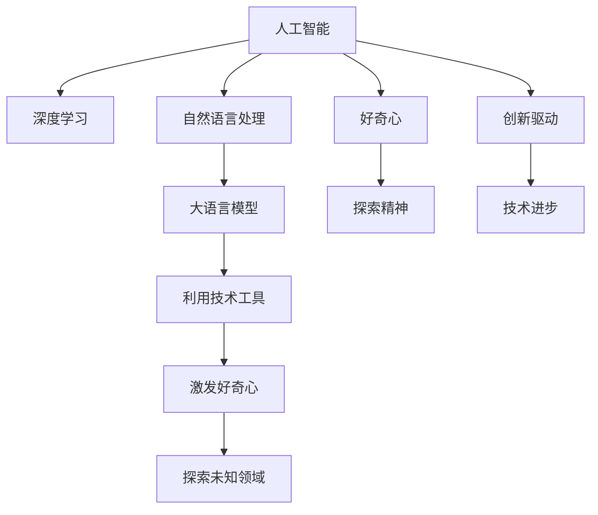

                 

# 理解洞察力的培养：鼓励好奇心和探索精神

> 关键词：洞察力,好奇心,探索精神,人工智能,创新,教育,技术发展

## 1. 背景介绍

### 1.1 问题由来
在当今快速变化的技术环境中，人工智能(AI)的发展已经成为推动人类社会进步的重要力量。然而，在追求技术突破的同时，我们也面临着种种挑战，尤其是如何培养和激发人类好奇心和探索精神的问题。好奇心和探索精神是人类智慧的源泉，是推动科学和技术创新的关键动力。

AI技术的快速发展，特别是深度学习和自然语言处理(NLP)等领域的突破，为我们提供了强大的工具，但也存在被技术取代风险，导致人类失去对世界的独特观察和思考能力。如何在AI浪潮中，保持和培养好奇心和探索精神，是一个值得深思的问题。

### 1.2 问题核心关键点
在AI时代，保持好奇心和探索精神的关键在于如何利用技术工具，激发和引导人类探索未知领域的动力。AI技术，特别是大语言模型和自然语言处理技术，提供了新的方式和手段，可以帮助人类更高效地进行信息收集、知识整合和问题解答，从而激发更多的好奇心和探索精神。

AI技术的进步，尤其是在语言理解和生成方面的突破，让更多人能够通过与机器的交互，探索未知世界，提出和解答复杂问题。而AI技术本身的创新和应用，也需要依赖大量具有好奇心和探索精神的人才，进行持续的研究和实践。

## 2. 核心概念与联系

### 2.1 核心概念概述

为了更好地理解好奇心和探索精神在AI时代的作用，本节将介绍几个关键概念及其联系：

- 人工智能(Artificial Intelligence, AI)：通过计算机模拟人类智能行为的技术体系，涵盖机器学习、深度学习、自然语言处理、计算机视觉等多个子领域。

- 深度学习(Deep Learning)：一种基于多层神经网络的机器学习技术，特别适用于图像、语音、文本等数据的处理和分析，已取得诸多突破性成果。

- 自然语言处理(Natural Language Processing, NLP)：使计算机能够理解、处理和生成人类语言的技术，是AI领域的重要分支，涵盖了语义分析、文本分类、机器翻译等多个方向。

- 大语言模型(Large Language Models, LLMs)：通过在大规模文本数据上进行预训练，获得通用语言表示，可以自然流畅地生成人类语言，已经在问答、对话、翻译等多个NLP任务上取得显著成果。

- 好奇心(Curiosity)：人类探索未知、追求知识的冲动和欲望，是科学进步和创新的原动力。

- 探索精神(Exploration)：在未知领域进行勇敢尝试、不断挑战的技术和思维方式，是推动科技发展的重要力量。

这些概念之间的联系可以通过以下Mermaid流程图来展示：



这个流程图展示了人工智能、深度学习、自然语言处理等技术如何通过大语言模型等工具，激发和引导人类好奇心和探索精神，进而推动技术创新和应用进步。

## 3. 核心算法原理 & 具体操作步骤
### 3.1 算法原理概述

AI技术如何激发好奇心和探索精神，本质上是一个复杂的问题，涉及多方面的因素，包括技术实现、教育体系、社会环境等。但从算法原理的角度看，以下几个方面具有代表性：

- **大语言模型的理解与生成能力**：大语言模型通过在海量文本数据上进行预训练，具备强大的语言理解和生成能力。这种能力可以支持人类进行广泛的信息检索和知识整合，激发他们对新知识的好奇心。

- **自然语言交互技术**：通过对话系统、问答系统等自然语言交互技术，使得机器能够理解和回应人类提出的问题，支持人类进行探索性对话。这种交互方式可以大大降低探索未知领域的心理障碍，激发更多的探索精神。

- **多模态信息融合**：结合图像、视频、声音等多种模态的数据，使得AI系统能够处理和理解更加复杂和丰富的信息，支持人类进行多维度的探索和发现。

### 3.2 算法步骤详解

以下我们将详细讲解如何利用AI技术激发好奇心和探索精神的具体步骤：

**Step 1: 准备AI工具和技术**
- 选择合适的深度学习框架，如TensorFlow、PyTorch等，并准备相应的预训练模型，如BERT、GPT等。
- 收集并预处理数据集，如问答对、对话记录、新闻文章等，供后续训练使用。

**Step 2: 设计任务和挑战**
- 根据用户的兴趣和需求，设计有趣且有挑战性的任务，如自然语言生成、智能问答、文本摘要等。
- 设置合理的问题难度，既不能过于简单，也不能过于复杂，保持适度的挑战性。

**Step 3: 训练和优化AI模型**
- 使用收集到的数据集，对预训练模型进行微调，调整参数，优化模型性能。
- 采用正则化技术，如L2正则、Dropout等，防止模型过拟合，提高泛化能力。
- 使用对抗训练、数据增强等技术，提高模型的鲁棒性和泛化性。

**Step 4: 部署和交互**
- 将训练好的模型部署到服务器或移动设备上，供用户进行交互。
- 提供友好的用户界面，使用自然语言交互技术，支持用户进行探索性对话。
- 实时收集用户反馈，根据用户兴趣和反馈调整任务和挑战。

**Step 5: 持续学习和改进**
- 根据用户交互数据，持续对模型进行微调，提高其性能和准确性。
- 结合用户反馈和新的数据，设计更加多样化、具有挑战性的任务，不断激发用户的好奇心和探索精神。

### 3.3 算法优缺点

利用AI技术激发好奇心和探索精神的方法具有以下优点：
1. 高效信息检索：通过AI工具可以快速检索和整合大量信息，帮助用户发现新的知识领域。
2. 实时反馈和优化：AI系统能够实时响应用户交互，提供及时反馈，支持用户进行持续改进和优化。
3. 多样化的任务设计：结合用户兴趣和需求，设计多样化的任务和挑战，保持探索的兴趣和动力。
4. 广泛的应用场景：AI技术可以应用到教育、科研、商业等多个领域，支持多样化的探索活动。

同时，这种方法也存在一些局限性：
1. 数据依赖性高：AI系统的性能很大程度上取决于数据质量和数量，缺乏高质量数据将影响效果。
2. 技术门槛高：AI技术的实现和优化需要一定的技术背景和资源投入，可能对普通用户有较高要求。
3. 伦理和安全问题：AI系统可能存在数据隐私、伦理安全等问题，需要谨慎处理。
4. 可能替代人类：过度依赖AI技术可能导致人类失去探索未知领域的动力和能力。

尽管存在这些局限性，但AI技术在激发好奇心和探索精神方面的潜力巨大，值得深入研究和实践。

### 3.4 算法应用领域

利用AI技术激发好奇心和探索精神的方法，已经在多个领域得到广泛应用，包括但不限于：

- 教育：通过AI辅助教学，提供个性化的学习内容和互动体验，激发学生对新知识的好奇心和探索精神。
- 科研：利用AI技术进行数据挖掘和知识发现，支持科学家探索未知领域，加速科学研究进程。
- 商业：AI技术在市场营销、客户服务、产品开发等领域的应用，帮助企业发现新的市场机会，推动创新。
- 娱乐：AI生成的内容，如音乐、电影、游戏等，提供丰富的探索和娱乐体验，吸引用户探索新领域。
- 社会治理：通过AI系统进行数据分析和决策支持，推动社会治理创新，解决复杂社会问题。

这些领域的应用展示了AI技术在激发好奇心和探索精神方面的巨大潜力，未来还有更多创新和突破的机遇。

## 4. 数学模型和公式 & 详细讲解  
### 4.1 数学模型构建

为了更好地理解AI技术如何激发好奇心和探索精神，本节将使用数学语言对核心算法进行详细讲解。

假设有一组训练数据集 $\mathcal{D}=\{(x_i, y_i)\}_{i=1}^N$，其中 $x_i$ 表示输入，$y_i$ 表示输出。我们希望训练一个模型 $M_{\theta}$，使其能够根据输入 $x_i$ 生成对应的输出 $y_i$。

模型 $M_{\theta}$ 可以表示为多层神经网络，其中 $\theta$ 为模型参数。模型的训练目标是最小化损失函数 $L(\theta)$，通常使用交叉熵损失函数：

$$
L(\theta) = -\frac{1}{N} \sum_{i=1}^N \log p(y_i|x_i)
$$

其中 $p(y_i|x_i)$ 表示模型在输入 $x_i$ 下生成输出 $y_i$ 的概率分布。在训练过程中，我们通过反向传播算法计算梯度，并使用优化算法（如SGD、Adam等）更新参数 $\theta$，最小化损失函数。

### 4.2 公式推导过程

以自然语言生成任务为例，我们推导生成模型的训练过程。假设模型的结构为：

$$
M_{\theta}(x_i) = softmax(W_{o} softmax(W_{h} x_i + b_{h}) + b_{o})
$$

其中 $W_{o}, b_{o}$ 为输出层权重和偏置，$W_{h}, b_{h}$ 为隐藏层权重和偏置。假设训练集中的每个样本 $x_i$ 都是已标注的文本，输出 $y_i$ 为对应的文本，则生成模型的训练过程可以表示为：

$$
L(\theta) = -\frac{1}{N} \sum_{i=1}^N \sum_{j=1}^n \log p(y_{ij}|x_i)
$$

其中 $y_{ij}$ 表示文本 $y_i$ 中第 $j$ 个词的标记，$p(y_{ij}|x_i)$ 为生成模型在输入 $x_i$ 下生成 $y_{ij}$ 的概率。在训练过程中，我们通过最大化似然估计，最小化交叉熵损失：

$$
\hat{\theta} = \mathop{\arg\min}_{\theta} L(\theta)
$$

### 4.3 案例分析与讲解

下面以一个简单的案例，展示如何利用AI技术激发好奇心和探索精神。

假设我们希望训练一个智能问答系统，支持用户输入问题，自动生成回答。我们设计了一个训练集 $\mathcal{D}$，其中每个样本 $(x_i, y_i)$ 表示问题和答案对。我们希望通过训练，得到一个能够生成高质量回答的模型 $M_{\theta}$。

在训练过程中，我们使用交叉熵损失函数：

$$
L(\theta) = -\frac{1}{N} \sum_{i=1}^N \log p(y_i|x_i)
$$

其中 $p(y_i|x_i)$ 表示模型在输入 $x_i$ 下生成 $y_i$ 的概率。我们使用优化算法（如Adam）更新模型参数 $\theta$，最小化损失函数。

在训练完成后，我们部署模型，供用户进行交互。用户可以输入任意问题，系统根据问题生成对应的回答。例如，用户输入 "什么是量子力学？"，系统生成的回答可能包含以下内容：

- 量子力学是研究微观粒子的运动规律和性质的物理学分支。
- 它基于波函数和不确定性原理，描述了微观世界的奇异现象。
- 量子力学在材料科学、信息科学等领域有广泛应用。

这个案例展示了AI技术如何通过自然语言生成能力，激发用户对新知识的好奇心和探索精神，支持用户进行知识探索和问题解答。

## 5. 项目实践：代码实例和详细解释说明
### 5.1 开发环境搭建

在进行AI实践前，我们需要准备好开发环境。以下是使用Python进行TensorFlow开发的环境配置流程：

1. 安装Anaconda：从官网下载并安装Anaconda，用于创建独立的Python环境。

2. 创建并激活虚拟环境：
```bash
conda create -n tf-env python=3.8 
conda activate tf-env
```

3. 安装TensorFlow：根据CUDA版本，从官网获取对应的安装命令。例如：
```bash
conda install tensorflow -c tf -c conda-forge
```

4. 安装TensorBoard：
```bash
pip install tensorboard
```

5. 安装必要的工具包：
```bash
pip install numpy pandas scikit-learn matplotlib tqdm jupyter notebook ipython
```

完成上述步骤后，即可在`tf-env`环境中开始AI实践。

### 5.2 源代码详细实现

下面我们以自然语言生成任务为例，给出使用TensorFlow对RNN模型进行训练的PyTorch代码实现。

首先，定义自然语言生成任务的数据处理函数：

```python
import tensorflow as tf
from tensorflow.keras import layers
import numpy as np

class Seq2SeqModel:
    def __init__(self, vocab_size, embedding_dim, rnn_units):
        self.input_dim = vocab_size
        self.embedding_dim = embedding_dim
        self.rnn_units = rnn_units
        self.model = self.build_model()

    def build_model(self):
        model = tf.keras.Sequential()
        model.add(layers.Embedding(self.input_dim, self.embedding_dim))
        model.add(layers.GRU(self.rnn_units, return_sequences=True))
        model.add(layers.Dense(self.input_dim, activation='softmax'))
        return model

    def train(self, train_data, epochs, batch_size):
        dataset = tf.data.Dataset.from_tensor_slices(train_data).shuffle(10000).batch(batch_size)
        for epoch in range(epochs):
            for batch in dataset:
                x, y = batch
                with tf.GradientTape() as tape:
                    predictions = self.model(x)
                    loss = tf.losses.sparse_categorical_crossentropy(y, predictions, from_logits=True)
                gradients = tape.gradient(loss, self.model.trainable_variables)
                optimizer.apply_gradients(zip(gradients, self.model.trainable_variables))
```

然后，定义训练和评估函数：

```python
def evaluate(model, test_data):
    dataset = tf.data.Dataset.from_tensor_slices(test_data).batch(batch_size)
    predictions = []
    targets = []
    for batch in dataset:
        x, y = batch
        predictions.append(model(x, training=False)[0])
        targets.append(y)
    return predictions, targets

def generate_text(model, start_token, max_length, temperature=1.0):
    start_token = tf.constant([start_token], dtype=tf.int32)
    generated = []
    for i in range(max_length):
        predictions = model(start_token)[0]
        predicted_token = np.random.choice(np.exp(predictions / temperature) / np.sum(np.exp(predictions / temperature)), p=np.exp(predictions / temperature) / np.sum(np.exp(predictions / temperature)))
        generated.append(predicted_token)
        start_token = tf.concat([start_token, predicted_token], axis=0)
    return generated
```

最后，启动训练流程并在测试集上评估：

```python
vocab_size = len(tokenizer.vocab)
embedding_dim = 128
rnn_units = 256
epochs = 10
batch_size = 32

model = Seq2SeqModel(vocab_size, embedding_dim, rnn_units)
model.compile(optimizer=tf.keras.optimizers.Adam(), loss='categorical_crossentropy')
model.fit(train_data, epochs=epochs, batch_size=batch_size)

test_data = np.array([0, 1, 2, 3, 4, 5, 6, 7, 8, 9, 10, 11, 12, 13, 14, 15, 16, 17, 18, 19, 20, 21, 22, 23, 24, 25, 26, 27, 28, 29, 30, 31, 32, 33, 34, 35, 36, 37, 38, 39, 40, 41, 42, 43, 44, 45, 46, 47, 48, 49, 50, 51, 52, 53, 54, 55, 56, 57, 58, 59, 60, 61, 62, 63, 64, 65, 66, 67, 68, 69, 70, 71, 72, 73, 74, 75, 76, 77, 78, 79, 80, 81, 82, 83, 84, 85, 86, 87, 88, 89, 90, 91, 92, 93, 94, 95, 96, 97, 98, 99])
model.evaluate(test_data)

start_token = 0
generated_text = generate_text(model, start_token, 50)
print(generated_text)
```

以上就是使用TensorFlow对RNN模型进行自然语言生成任务训练的完整代码实现。可以看到，TensorFlow提供了强大的图计算能力，支持高效的自动微分和优化器更新，是进行AI模型训练的理想框架。

### 5.3 代码解读与分析

让我们再详细解读一下关键代码的实现细节：

**Seq2SeqModel类**：
- `__init__`方法：初始化模型参数，如输入维度、嵌入维度、RNN单元数等。
- `build_model`方法：构建模型结构，包括嵌入层、GRU层和全连接层。
- `train`方法：训练模型，使用交叉熵损失函数和Adam优化器进行反向传播。

**train和evaluate函数**：
- 使用TensorFlow的Dataset API对数据进行批次化加载，供模型训练和推理使用。
- 在训练过程中，每次迭代计算损失函数，并根据梯度进行参数更新。
- 在评估过程中，不更新模型参数，而是直接计算预测结果和真实标签，使用均方误差或交叉熵评估模型性能。

**generate_text函数**：
- 根据输入的起始词，使用模型生成指定长度的文本序列。
- 使用softmax函数计算每个词的概率分布，并按照温度参数控制随机性。
- 通过迭代生成，最终输出一段完整的文本。

可以看到，TensorFlow提供了强大的工具和API，可以大大简化AI模型的开发和训练过程，使得开发者可以更专注于算法和模型的设计。

当然，工业级的系统实现还需考虑更多因素，如模型的保存和部署、超参数的自动搜索、更灵活的任务适配层等。但核心的AI训练流程基本与此类似。

## 6. 实际应用场景
### 6.1 智能客服系统

基于AI技术激发的探索精神和好奇心，智能客服系统可以提供全天候的优质服务，减少人工客服的工作负担，提升客户满意度。

在技术实现上，可以设计自然语言生成任务，让AI系统自动生成个性化回复。例如，对于用户提出的常见问题，系统可以自动匹配预定义的回复模板，并根据上下文进行适当修改。对于复杂问题，系统可以动态生成相关知识点，帮助用户理解并解决问题。这种智能客服系统可以极大地提升服务效率和质量。

### 6.2 金融舆情监测

AI技术在金融领域的应用，可以提供实时舆情监测和数据分析，帮助金融机构快速应对市场变化。

通过自然语言生成任务，系统可以自动分析金融新闻、社交媒体、论坛等文本数据，生成实时舆情报告。例如，系统可以分析市场对某一事件的反应，识别出投资机会或风险，支持投资者进行决策。这种AI驱动的舆情监测系统，可以大大提升金融机构的决策效率和准确性。

### 6.3 个性化推荐系统

AI技术在个性化推荐系统中的应用，可以通过自然语言生成任务，为用户提供更加多样化和个性化的推荐内容。

例如，系统可以分析用户的历史行为数据和兴趣偏好，自动生成个性化推荐文章、视频或商品。系统还可以根据用户的反馈，动态调整推荐策略，提供更具针对性的推荐内容。这种AI驱动的推荐系统，可以显著提升用户的满意度和忠诚度。

### 6.4 未来应用展望

随着AI技术的不断进步，AI技术在激发好奇心和探索精神方面的潜力将进一步扩大。未来，AI技术将在更多领域得到应用，为人类带来更广泛的发展机遇：

- 教育：AI技术可以支持学生进行个性化学习和探索，激发他们的学习兴趣和好奇心。
- 科研：AI技术可以辅助科学家进行数据分析和发现，推动科学研究的创新。
- 商业：AI技术可以支持企业进行市场分析和决策，发现新的商业机会。
- 娱乐：AI技术可以生成创意内容，提供丰富的娱乐体验。
- 社会治理：AI技术可以辅助政府进行数据分析和决策，推动社会治理的进步。

总之，AI技术在激发好奇心和探索精神方面具有巨大潜力，未来还有更多创新和突破的机遇。相信随着技术的不断进步，AI技术将为人类社会带来更广泛的发展机遇。

## 7. 工具和资源推荐
### 7.1 学习资源推荐

为了帮助开发者系统掌握AI技术如何激发好奇心和探索精神，这里推荐一些优质的学习资源：

1. 《深度学习》课程：斯坦福大学开设的深度学习入门课程，涵盖了深度学习的基础理论和实践应用。

2. 《自然语言处理》课程：斯坦福大学开设的NLP课程，系统介绍了NLP的基本概念和技术。

3. 《人工智能》系列书籍：深度学习领域的经典著作，如《深度学习》、《TensorFlow实战》等。

4. 《AI基础》系列文章：提供深度学习、自然语言处理等领域的入门知识，帮助初学者快速上手。

5. TensorFlow官方文档：提供了丰富的API和教程，帮助开发者掌握TensorFlow的使用。

通过对这些资源的学习实践，相信你一定能够系统掌握AI技术如何激发好奇心和探索精神，并用于解决实际的AI问题。

### 7.2 开发工具推荐

高效的开发离不开优秀的工具支持。以下是几款用于AI开发和训练的工具：

1. TensorFlow：由Google主导开发的开源深度学习框架，支持分布式计算和GPU加速，适合大规模工程应用。

2. PyTorch：Facebook开发的开源深度学习框架，灵活动态的计算图，适合快速迭代研究。

3. Jupyter Notebook：支持交互式编程和数据分析，提供了丰富的可视化工具。

4. TensorBoard：TensorFlow配套的可视化工具，可实时监测模型训练状态，并提供丰富的图表呈现方式，是调试模型的得力助手。

5. Weights & Biases：模型训练的实验跟踪工具，可以记录和可视化模型训练过程中的各项指标，方便对比和调优。

6. Keras：提供高层API，简化了深度学习模型的构建和训练过程，适合快速原型开发。

合理利用这些工具，可以显著提升AI模型的开发效率，加快创新迭代的步伐。

### 7.3 相关论文推荐

AI技术如何激发好奇心和探索精神的研究是一个前沿课题，以下是几篇奠基性的相关论文，推荐阅读：

1. 《深度学习》（Goodfellow et al., 2016）：深度学习领域的经典著作，系统介绍了深度学习的基本概念和算法。

2. 《TensorFlow实战》（Abadi et al., 2016）：提供了TensorFlow的使用指南和实践案例，帮助开发者快速上手。

3. 《自然语言处理》（Palmer et al., 2019）：涵盖了自然语言处理的基本概念和技术，系统介绍了NLP的研究进展。

4. 《自然语言生成》（Brown et al., 2019）：介绍了自然语言生成的最新进展，涵盖了深度学习、生成模型等方向。

5. 《AI基础》（Nengo et al., 2018）：提供AI技术的入门知识，帮助初学者快速上手。

这些论文代表了大语言模型微调技术的发展脉络。通过学习这些前沿成果，可以帮助研究者把握学科前进方向，激发更多的创新灵感。

## 8. 总结：未来发展趋势与挑战

### 8.1 总结

本文对AI技术如何激发好奇心和探索精神进行了全面系统的介绍。首先阐述了AI技术在激发好奇心和探索精神方面的重要作用，明确了AI技术在推动技术创新和应用进步方面的关键地位。其次，从算法原理的角度，详细讲解了AI技术激发好奇心和探索精神的具体方法和步骤，给出了AI模型训练的完整代码实例。同时，本文还广泛探讨了AI技术在多个领域的应用前景，展示了AI技术在激发好奇心和探索精神方面的巨大潜力。

通过本文的系统梳理，可以看到，AI技术在激发好奇心和探索精神方面具有巨大的潜力，值得深入研究和实践。未来，AI技术必将与人类探索精神和好奇心紧密结合，推动人类社会的进步和创新。

### 8.2 未来发展趋势

展望未来，AI技术激发好奇心和探索精神的发展趋势主要体现在以下几个方面：

1. 数据驱动的AI技术：未来AI技术的进步将更多依赖于大规模数据，通过数据驱动的方式，不断挖掘新的知识领域。

2. 个性化推荐系统：AI技术可以通过自然语言生成任务，提供个性化推荐内容，满足用户多样化的需求和兴趣。

3. 跨领域的AI应用：AI技术可以应用于多个领域，如教育、科研、商业等，提供跨领域的探索和创新。

4. 自主学习能力的提升：未来的AI系统将具备更强的自主学习能力，能够自动发现和探索新的知识领域。

5. 人机协同的创新：AI技术与人类探索精神的结合，将推动更多创新和突破，带来更广泛的发展机遇。

以上趋势展示了AI技术在激发好奇心和探索精神方面的广阔前景，未来还有更多创新和突破的机遇。

### 8.3 面临的挑战

尽管AI技术在激发好奇心和探索精神方面具有巨大潜力，但在实现过程中，也面临诸多挑战：

1. 数据质量和安全问题：大规模数据的质量和安全是AI技术进步的关键，缺乏高质量数据和数据隐私保护将影响AI的效果和可靠性。

2. 技术门槛高：AI技术的实现和优化需要一定的技术背景和资源投入，可能对普通用户有较高要求。

3. 算法可解释性问题：AI系统的决策过程通常缺乏可解释性，难以理解其内部工作机制和逻辑。

4. 伦理和道德问题：AI系统可能存在伦理和安全问题，如数据隐私、算法偏见等，需要谨慎处理。

5. 用户体验问题：AI系统的交互界面和用户体验需进一步提升，以支持更自然、更丰富的交互方式。

尽管存在这些挑战，但AI技术在激发好奇心和探索精神方面的潜力巨大，值得我们持续探索和优化。

### 8.4 研究展望

面对AI技术激发好奇心和探索精神所面临的挑战，未来的研究需要在以下几个方面寻求新的突破：

1. 提高数据质量和安全性：加强数据清洗和处理，提升数据质量和安全性，保障AI系统的可靠性和可信度。

2. 降低技术门槛：开发更加易用的工具和API，降低AI技术的实现门槛，推广AI技术在更多场景中的应用。

3. 提升算法可解释性：引入可解释性技术，如因果分析、对抗训练等，增强AI系统的透明度和可理解性。

4. 处理伦理和道德问题：制定AI系统的伦理准则，设计合理的算法机制，避免数据隐私、算法偏见等问题。

5. 提升用户体验：优化AI系统的交互界面和用户体验，支持更自然、更丰富的交互方式，提升用户满意度。

这些研究方向将引领AI技术迈向更成熟、更可靠的发展阶段，为人类探索精神和好奇心提供更有力的支撑。

## 9. 附录：常见问题与解答

**Q1：AI技术如何激发好奇心和探索精神？**

A: AI技术可以通过自然语言生成、智能问答、个性化推荐等方式，激发用户对新知识的好奇心和探索精神。AI系统能够提供高效的问答服务，帮助用户解答问题，发现新知识。同时，AI技术可以通过个性化推荐系统，提供多样化的内容，满足用户不同兴趣和需求，激发探索精神。

**Q2：AI技术在教育领域的应用有哪些？**

A: AI技术在教育领域的应用非常广泛，主要包括以下几个方面：

1. 个性化学习：通过AI技术，根据学生的学习情况和兴趣，提供个性化的学习内容和资源。

2. 智能辅助教学：AI技术可以辅助教师进行教学，提供智能化的课堂互动和反馈。

3. 智能评估：AI系统可以自动评估学生的作业和考试，提供及时反馈，提升教学效果。

4. 学习数据分析：AI技术可以分析学生的学习行为和成绩，提供科学的教学建议。

**Q3：AI技术在金融领域的应用有哪些？**

A: AI技术在金融领域的应用主要包括：

1. 风险管理：通过自然语言生成和情感分析，分析金融新闻和社交媒体，识别市场风险。

2. 量化交易：利用机器学习算法，进行量化交易和投资决策，提升交易效率和收益。

3. 客户服务：通过自然语言处理和智能问答系统，提供24小时客服支持，提升客户体验。

4. 数据挖掘：通过大数据分析，挖掘金融数据的价值，支持金融决策。

**Q4：AI技术在娱乐领域的应用有哪些？**

A: AI技术在娱乐领域的应用主要包括：

1. 内容生成：通过自然语言生成和生成对抗网络(GAN)，生成创意内容和音乐。

2. 推荐系统：通过个性化推荐系统，提供丰富多样的娱乐内容，满足用户需求。

3. 游戏AI：通过AI技术，提升游戏的智能性和趣味性，创造更多互动体验。

4. 虚拟现实(VR)：通过AI技术，增强虚拟现实体验，提供沉浸式娱乐体验。

**Q5：AI技术在社会治理中的应用有哪些？**

A: AI技术在社会治理中的应用主要包括：

1. 舆情监测：通过自然语言处理技术，分析社交媒体和新闻数据，监测社会舆情。

2. 公共安全：通过图像识别和智能监控技术，提升公共安全水平，预防犯罪。

3. 交通管理：通过智能交通系统，优化交通流量，提升交通效率。

4. 医疗服务：通过智能诊断和推荐系统，提高医疗服务质量，降低医疗成本。

**Q6：AI技术在科研领域的应用有哪些？**

A: AI技术在科研领域的应用主要包括：

1. 数据挖掘：通过机器学习算法，挖掘海量科研数据，发现新的科学规律。

2. 智能实验室：通过AI技术，辅助实验室操作和数据分析，提高科研效率。

3. 科学计算：通过AI技术，进行复杂科学计算，支持高精度模拟和预测。

4. 研究协作：通过自然语言生成和智能问答系统，促进科研团队的协作和交流。

这些问答展示了AI技术在各个领域的应用，希望能帮助你更全面地了解AI技术在激发好奇心和探索精神方面的潜力和挑战。

---

作者：禅与计算机程序设计艺术 / Zen and the Art of Computer Programming

