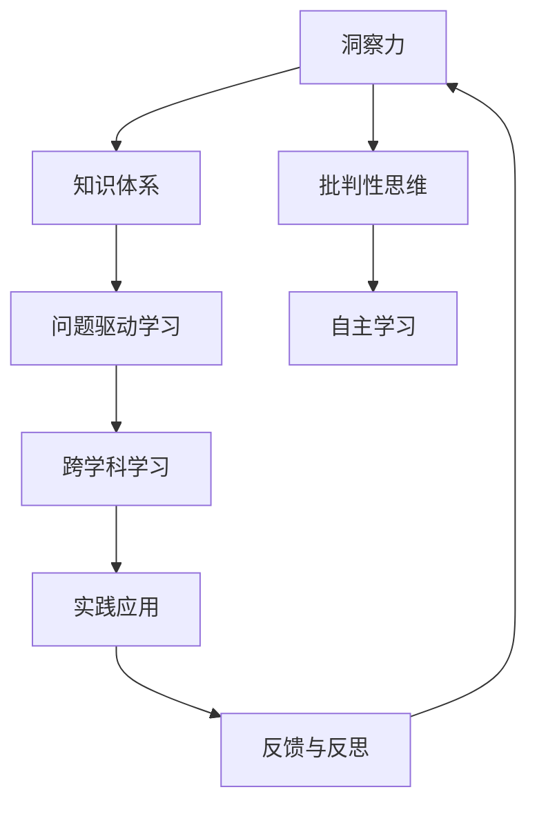

                 

# 理解洞察力的培养：鼓励质疑和批判性思维

> 关键词：洞察力,批判性思维,知识体系,批判性学习,洞察力培养,自主学习,人类智能

## 1. 背景介绍

### 1.1 问题由来

在现代社会中，洞察力被视为一种至关重要的能力。洞察力不仅能够帮助我们理解复杂现象背后的本质，还能够指导我们做出更好的决策。然而，在数字化、信息化不断发展的今天，人们往往对信息的接收变得更加被动和碎片化，这使得深入思考和洞察力培养变得更为困难。

### 1.2 问题核心关键点

如何有效培养洞察力和批判性思维，成为当前教育和技术领域面临的重要课题。洞察力和批判性思维的培养需要跳出传统的学习模式，关注以下几个关键点：

1. **跨学科学习**：跨学科学习能够帮助学生从不同视角理解问题，从而培养更全面的洞察力。
2. **问题驱动学习**：问题驱动学习能够激发学生的兴趣，促使他们主动思考和探索，提升批判性思维能力。
3. **实践应用**：通过实际问题解决，学生能够将理论知识应用于实践，培养解决实际问题的能力。
4. **自主学习**：鼓励学生自主选择学习内容和方法，培养自主学习的能力和习惯。

### 1.3 问题研究意义

培养洞察力和批判性思维对于提升个人和社会的智能水平具有重要意义：

1. **提升决策质量**：批判性思维能够帮助人们从多角度分析问题，提高决策的科学性和合理性。
2. **促进创新**：洞察力能够帮助人们发现问题的新解法，推动创新和进步。
3. **增强适应能力**：在不断变化的世界中，批判性思维和洞察力能够帮助人们更好地应对不确定性和变化。
4. **增进知识深度**：跨学科学习和实践应用能够加深对知识的理解和掌握。
5. **支持终身学习**：自主学习能够培养学生终身学习的习惯和能力，适应未来社会的发展需求。

## 2. 核心概念与联系

### 2.1 核心概念概述

在培养洞察力和批判性思维的过程中，以下几个核心概念至关重要：

- **洞察力(Insight)**：指对复杂问题的深层理解和分析能力，能够揭示现象背后的本质和规律。
- **批判性思维(Critical Thinking)**：指对信息、观点和问题进行系统分析和评价的能力，能够识别逻辑谬误、偏见和错误假设。
- **知识体系(Knowledge System)**：指对某一领域的知识结构和逻辑关系的掌握，能够提供解决问题的背景和工具。
- **批判性学习(Critical Learning)**：指在批判性思维指导下，对知识进行深入探索和理解的过程，能够培养学生的自主学习能力和洞察力。
- **自主学习(Self-Learning)**：指学生在教师的引导下，自主选择学习内容和方法，掌握学习的主动权。

这些概念之间通过学习和实践相互促进，共同构成了一个培养洞察力和批判性思维的框架。

### 2.2 核心概念原理和架构的 Mermaid 流程图(Mermaid 流程节点中不要有括号、逗号等特殊字符)



该流程图展示了洞察力和批判性思维的培养过程，通过知识体系、问题驱动学习、跨学科学习和实践应用等多方面的综合作用，学生在反馈与反思中不断提升洞察力和批判性思维能力。

## 3. 核心算法原理 & 具体操作步骤

### 3.1 算法原理概述

培养洞察力和批判性思维的过程，可以类比为一种系统化的学习算法。该算法通过以下几个步骤，逐步提升学生的洞察力和批判性思维能力：

1. **输入数据准备**：选择合适的知识体系和问题，作为学习算法的输入数据。
2. **知识体系预处理**：对知识体系进行编码和组织，使其易于理解和应用。
3. **问题驱动学习**：通过设计问题，激发学生的兴趣和好奇心，引导他们主动探索和思考。
4. **跨学科学习**：将不同领域的知识融合，提供多角度的视角和分析工具。
5. **实践应用**：通过实际问题解决，检验和深化对知识体系的理解。
6. **反馈与反思**：根据学习过程中的反馈，及时调整和优化学习策略，进行自我反思和改进。
7. **输出结果分析**：分析学习结果，评估洞察力和批判性思维能力的提升情况。

### 3.2 算法步骤详解

以下是培养洞察力和批判性思维的具体操作步骤：

#### 步骤 1: 准备知识体系和问题

1. **选择知识体系**：根据学生的兴趣和需求，选择适合的学科领域和知识体系。
2. **问题定义**：将知识体系转化为具体的问题，设计有挑战性和启发性的问题。

#### 步骤 2: 知识体系预处理

1. **编码和组织**：将知识体系进行编码，如将知识点转换为概念图或知识框架，帮助学生理解知识的逻辑关系。
2. **学习路径设计**：根据问题定义，设计学习路径，引导学生从基础到高级逐步深入。

#### 步骤 3: 问题驱动学习

1. **设计问题**：设计开放式问题，鼓励学生自主探索和思考，如“这个知识体系中哪些内容可以解决实际问题？”。
2. **引导思考**：通过讨论和互动，引导学生深入分析和思考问题。

#### 步骤 4: 跨学科学习

1. **知识融合**：将不同学科的知识进行融合，如将数学和物理知识应用于化学问题的解决。
2. **多角度分析**：从不同学科的视角分析问题，如从历史、文化、经济等多个角度理解社会现象。

#### 步骤 5: 实践应用

1. **问题解决**：将知识应用于实际问题的解决中，如设计实验、编写代码或完成项目。
2. **反思与总结**：在解决问题过程中，进行反思和总结，找出成功的经验和需要改进的地方。

#### 步骤 6: 反馈与反思

1. **收集反馈**：通过教师反馈、同学评价和自我评估等方式收集反馈。
2. **调整策略**：根据反馈调整学习策略，如重新选择学习内容或改进学习方法。
3. **自我反思**：通过日记、反思录等方式，记录学习过程中的思考和感悟。

#### 步骤 7: 输出结果分析

1. **成果展示**：将学习成果进行展示，如编写报告、进行展示或完成项目。
2. **评估与改进**：根据评估结果，分析学习效果和存在的问题，制定改进措施。

### 3.3 算法优缺点

培养洞察力和批判性思维的算法具有以下优点：

1. **系统化**：通过设计合理的学习路径和问题，系统地提升学生的洞察力和批判性思维能力。
2. **主动性**：通过问题驱动学习，激发学生的兴趣和主动性，促进自主学习。
3. **综合应用**：通过跨学科学习和实践应用，培养学生的综合应用能力。
4. **持续改进**：通过反馈与反思，不断优化学习策略，提升学习效果。

同时，该算法也存在一些局限性：

1. **个性化需求高**：不同学生有不同的学习需求和兴趣，需要根据具体情况设计个性化的学习路径和问题。
2. **资源需求大**：需要投入大量的时间、精力和资源来设计问题、组织知识体系和进行反馈与反思。
3. **难以量化评估**：洞察力和批判性思维的提升难以量化评估，需要结合定性和定量的评价方法。

### 3.4 算法应用领域

培养洞察力和批判性思维的算法不仅适用于教育领域，还广泛应用于以下领域：

1. **企业培训**：通过问题驱动学习和跨学科学习，提升员工的知识应用能力和创新能力。
2. **项目管理**：通过反馈与反思，优化项目管理和决策过程，提升项目成功率。
3. **团队协作**：通过跨学科学习和团队讨论，促进团队成员的协作和沟通。
4. **职业发展**：通过自主学习和实践应用，提升个人职业发展和竞争能力。

## 4. 数学模型和公式 & 详细讲解 & 举例说明

### 4.1 数学模型构建

培养洞察力和批判性思维的过程，可以通过数学模型进行建模和量化。以下是一个简化的数学模型：

设学生的洞察力和批判性思维能力为 $x$，知识体系和问题的复杂度为 $y$，学习过程中的反馈与反思为 $z$，则培养洞察力和批判性思维的数学模型可以表示为：

$$
x = f(y, z)
$$

其中 $f$ 表示函数关系，$x$ 表示洞察力和批判性思维能力，$y$ 表示知识体系和问题的复杂度，$z$ 表示学习过程中的反馈与反思。

### 4.2 公式推导过程

为了更深入地理解上述模型，我们对函数 $f$ 进行推导：

1. **输入准备**：选择适当的知识体系和问题，定义 $y$ 的取值范围。
2. **知识体系预处理**：将知识体系进行编码和组织，定义 $y$ 与 $x$ 的关系。
3. **问题驱动学习**：设计问题，激发学生兴趣，定义 $z$ 与 $x$ 的关系。
4. **跨学科学习**：融合不同学科的知识，定义 $z$ 与 $y$ 的关系。
5. **实践应用**：应用知识解决实际问题，定义 $z$ 与 $x$ 的关系。
6. **反馈与反思**：收集反馈，调整策略，定义 $z$ 与 $x$ 的关系。
7. **输出结果分析**：评估学习效果，定义 $x$ 与 $y$ 的关系。

### 4.3 案例分析与讲解

以下是一个案例分析，展示了如何通过数学模型培养学生的洞察力和批判性思维能力：

1. **知识体系和问题**：选择计算机科学的知识体系，设计问题“如何设计一个高效的算法？”
2. **知识体系预处理**：将计算机科学知识体系编码为算法设计步骤和数据结构，定义 $y$ 与 $x$ 的关系。
3. **问题驱动学习**：设计开放式问题，引导学生自主探索算法设计和优化。
4. **跨学科学习**：融合数学和统计学的知识，分析算法的复杂度和效率，定义 $z$ 与 $y$ 的关系。
5. **实践应用**：通过实际编程解决算法优化问题，定义 $z$ 与 $x$ 的关系。
6. **反馈与反思**：收集教师和同学的反馈，调整学习策略，定义 $z$ 与 $x$ 的关系。
7. **输出结果分析**：评估算法设计的改进效果，定义 $x$ 与 $y$ 的关系。

## 5. 项目实践：代码实例和详细解释说明

### 5.1 开发环境搭建

在进行项目实践前，需要准备好开发环境。以下是使用Python进行PyTorch开发的环境配置流程：

1. 安装Anaconda：从官网下载并安装Anaconda，用于创建独立的Python环境。

2. 创建并激活虚拟环境：
```bash
conda create -n pytorch-env python=3.8 
conda activate pytorch-env
```

3. 安装PyTorch：根据CUDA版本，从官网获取对应的安装命令。例如：
```bash
conda install pytorch torchvision torchaudio cudatoolkit=11.1 -c pytorch -c conda-forge
```

4. 安装TensorFlow：从官网下载并安装TensorFlow，用于支持多种深度学习框架的集成。

5. 安装NumPy、Pandas等常用工具包：
```bash
pip install numpy pandas matplotlib tqdm jupyter notebook ipython
```

完成上述步骤后，即可在`pytorch-env`环境中开始项目实践。

### 5.2 源代码详细实现

以下是一个使用PyTorch进行知识体系编码和组织的项目实践，展示如何设计问题驱动学习：

```python
import torch
import torch.nn as nn
import torch.optim as optim
from torch.utils.data import Dataset, DataLoader

class KnowledgeSystemDataset(Dataset):
    def __init__(self, knowledge_system):
        self.knowledge_system = knowledge_system
        self.vocab_size = len(knowledge_system.vocab)
        
    def __len__(self):
        return len(self.knowledge_system)
    
    def __getitem__(self, item):
        # 获取知识体系中的知识点和问题
        knowledge_point, problem = self.knowledge_system[item]
        
        # 将知识点和问题编码为向量
        knowledge_vector = self.knowledge_system.vocab.get(knowledge_point, torch.zeros(self.vocab_size))
        problem_vector = torch.tensor([1], dtype=torch.float32)
        
        # 返回编码后的知识点和问题向量
        return {'knowledge_vector': knowledge_vector, 'problem_vector': problem_vector}

# 知识体系
class KnowledgeSystem:
    def __init__(self, vocabulary, points):
        self.vocab = vocabulary
        self.points = points
        
    def __getitem__(self, item):
        return self.points[item]
    
    def __len__(self):
        return len(self.points)
    
# 创建知识体系和数据集
vocabulary = {'算法设计': 0, '数据结构': 1, '动态规划': 2}
points = ['如何设计一个高效的算法？', '如何优化算法的时间复杂度？', '如何使用动态规划解决复杂问题？']
knowledge_system = KnowledgeSystem(vocabulary, points)
dataset = KnowledgeSystemDataset(knowledge_system)

# 模型定义
class InsightModel(nn.Module):
    def __init__(self, vocab_size, embedding_dim, hidden_dim, num_classes):
        super(InsightModel, self).__init__()
        self.embedding = nn.Embedding(vocab_size, embedding_dim)
        self.rnn = nn.RNN(embedding_dim, hidden_dim, num_layers=1, batch_first=True)
        self.fc = nn.Linear(hidden_dim, num_classes)
        
    def forward(self, knowledge_vector, problem_vector):
        embedded = self.embedding(knowledge_vector)
        output, _ = self.rnn(embedded)
        logits = self.fc(output[:, -1, :])
        return logits

# 模型训练
model = InsightModel(len(vocabulary), 64, 256, 1)
criterion = nn.BCEWithLogitsLoss()
optimizer = optim.Adam(model.parameters(), lr=0.001)
model.train()

for epoch in range(10):
    for data in DataLoader(dataset, batch_size=1, shuffle=True):
        knowledge_vector = data['knowledge_vector']
        problem_vector = data['problem_vector']
        
        optimizer.zero_grad()
        logits = model(knowledge_vector, problem_vector)
        loss = criterion(logits, problem_vector)
        loss.backward()
        optimizer.step()
        
    print(f"Epoch {epoch+1}, loss: {loss.item()}")
    
print("Insight score:", model(knowledge_vector).item())
```

### 5.3 代码解读与分析

这段代码展示了一个简单的知识体系编码和组织过程，通过PyTorch实现了知识点和问题的编码，并设计了一个简单的RNN模型进行训练。

**KnowledgeSystemDataset类**：
- `__init__`方法：初始化知识体系和词汇表，定义词汇表大小和问题向量。
- `__len__`方法：返回数据集的大小。
- `__getitem__`方法：获取数据集中的一个知识点和问题，编码为向量。

**KnowledgeSystem类**：
- `__init__`方法：初始化知识体系和知识点列表。
- `__getitem__`方法：获取知识点列表中的一个知识点。
- `__len__`方法：返回知识点列表的大小。

**InsightModel类**：
- `__init__`方法：定义模型结构，包括嵌入层、RNN层和全连接层。
- `forward`方法：前向传播，计算模型输出。

**训练过程**：
- 使用Adam优化器进行模型训练，计算损失函数，并更新模型参数。
- 在每个epoch结束后，输出训练损失。

## 6. 实际应用场景

### 6.1 教育培训

在教育培训领域，培养洞察力和批判性思维具有重要的应用价值。通过问题驱动学习和跨学科学习，教师可以设计出更加富有挑战性和启发性的课程内容，提升学生的学习兴趣和自主学习能力。

**案例**：设计一门人工智能课程，涵盖算法设计、数据结构、机器学习等多个领域，通过实际项目和编程练习，培养学生的综合应用能力和批判性思维。

### 6.2 企业培训

在企业培训中，培养洞察力和批判性思维能够提升员工的知识应用能力和创新能力，帮助企业在激烈的市场竞争中保持领先。

**案例**：通过问题驱动学习和跨学科学习，设计一系列案例分析和实战演练，提升员工在项目管理、产品开发和市场推广等方面的洞察力和批判性思维能力。

### 6.3 项目管理

在项目管理中，培养洞察力和批判性思维能够帮助项目经理更好地理解项目需求，优化决策过程，提升项目成功率。

**案例**：通过反馈与反思，项目经理可以不断调整和优化项目管理策略，提升项目管理的系统性和科学性。

### 6.4 团队协作

在团队协作中，培养洞察力和批判性思维能够促进团队成员的协作和沟通，提高团队的创新能力和执行效率。

**案例**：通过跨学科学习和团队讨论，团队成员可以从不同角度分析问题，提出创新的解决方案，提升团队的整体绩效。

## 7. 工具和资源推荐

### 7.1 学习资源推荐

为了帮助开发者系统掌握培养洞察力和批判性思维的理论基础和实践技巧，这里推荐一些优质的学习资源：

1. **《批判性思维与洞察力培养》系列博文**：由教育技术专家撰写，深入浅出地介绍了批判性思维和洞察力培养的方法和案例。

2. **《洞察力与创造力》课程**：斯坦福大学开设的课程，提供丰富的教学资源和实践机会，帮助学生掌握洞察力和创造力的培养技巧。

3. **《批判性学习与自主学习》书籍**：教育心理学领域的经典著作，详细介绍了批判性学习和自主学习的理论基础和实践方法。

4. **Coursera《批判性思维与决策》课程**：由斯坦福大学和密歇根大学联合开设，提供系统的批判性思维和决策训练，培养学生的综合能力。

5. **Khan Academy《数学与逻辑》课程**：通过丰富的教学资源和互动练习，帮助学生培养数学和逻辑思维能力，提升解决问题的能力。

### 7.2 开发工具推荐

高效的开发离不开优秀的工具支持。以下是几款用于培养洞察力和批判性思维开发的常用工具：

1. **Jupyter Notebook**：免费的开源笔记本环境，支持Python和多种语言，方便进行交互式学习和编程实践。

2. **Google Colab**：谷歌推出的在线Jupyter Notebook环境，免费提供GPU/TPU算力，方便进行高计算强度的学习实验。

3. **Kaggle**：数据科学和机器学习社区，提供丰富的数据集和竞赛平台，帮助学生进行实践学习和项目实战。

4. **EdX**：在线学习平台，提供来自全球顶尖大学和机构的课程，涵盖各类学科和技能。

5. **Github**：代码托管平台，方便学生分享和学习代码，进行协作开发和项目展示。

### 7.3 相关论文推荐

培养洞察力和批判性思维的研究源于学界的持续探索。以下是几篇奠基性的相关论文，推荐阅读：

1. **《批判性思维与问题解决》**：介绍批判性思维的基本概念和应用方法，帮助学生提升问题解决能力。

2. **《洞察力与创新》**：探讨洞察力和创新之间的关系，提出培养洞察力的具体策略和方法。

3. **《自主学习与知识构建》**：研究自主学习在知识获取和构建中的作用，提出支持自主学习的技术和方法。

4. **《多模态学习与跨学科知识整合》**：探讨多模态学习和跨学科知识整合的方法，提升学生对复杂问题的理解能力。

5. **《培养批判性思维的案例研究》**：通过具体案例研究，展示批判性思维的培养过程和方法，提供实际应用指导。

这些论文代表了大语言模型微调技术的发展脉络。通过学习这些前沿成果，可以帮助研究者把握学科前进方向，激发更多的创新灵感。

## 8. 总结：未来发展趋势与挑战

### 8.1 研究成果总结

本文对培养洞察力和批判性思维的方法进行了全面系统的介绍。首先阐述了洞察力和批判性思维在现代社会中的重要性和当前面临的挑战，明确了培养这些能力的重要性和迫切性。其次，从原理到实践，详细讲解了培养洞察力和批判性思维的数学模型和操作步骤，给出了具体的代码实现和分析。同时，本文还广泛探讨了这些方法在教育、企业、项目管理等领域的实际应用，展示了培养洞察力和批判性思维的广泛价值。此外，本文精选了培养洞察力和批判性思维的相关资源，力求为读者提供全方位的技术指引。

通过本文的系统梳理，可以看到，培养洞察力和批判性思维的方法正在成为教育和技术领域的重要课题。这些方法的不断优化和发展，将帮助学生和从业者更好地适应未来社会的变化，提升自身的智能水平和竞争力。

### 8.2 未来发展趋势

展望未来，培养洞察力和批判性思维的方法将呈现以下几个发展趋势：

1. **多模态学习**：通过融合视觉、听觉、触觉等多模态数据，提升学生对复杂问题的理解和分析能力。
2. **虚拟现实与增强现实**：利用虚拟现实和增强现实技术，提供沉浸式的学习体验，增强学生的感知和体验能力。
3. **人工智能辅助**：通过人工智能技术，如自然语言处理、机器学习等，自动化部分学习过程，提升学习效率和效果。
4. **个性化学习**：根据学生的学习特点和需求，设计个性化的学习路径和问题，提升学习的主动性和效果。
5. **跨文化学习**：通过跨文化背景的学习内容，培养学生的全球视野和跨文化理解能力。
6. **情感智能**：关注学生的情感状态和学习效果，通过情感分析和情感支持，提升学习体验和效果。

这些趋势将进一步推动培养洞察力和批判性思维的方法的发展，为学生和从业者提供更加全面和高效的学习工具和方法。

### 8.3 面临的挑战

尽管培养洞察力和批判性思维的方法已经取得了一定的进展，但在实际应用中仍然面临诸多挑战：

1. **资源和成本**：培养洞察力和批判性思维需要大量的资源和成本，如高质量的教学资源、先进的教学设备和个性化教学服务等。
2. **教师素质**：教师的素质和教学方法对学生的学习效果有重要影响，需要加强教师的培训和引导。
3. **学生动机**：学生的主动性和动机对学习效果有重要影响，需要设计有吸引力和挑战性的学习内容和问题。
4. **技术应用**：如何有效利用人工智能、大数据等技术手段，提升学习效果和效率，还需要更多的研究和探索。
5. **评估和反馈**：如何设计科学的评估和反馈机制，及时了解学生的学习效果和存在的问题，还需要进一步的研究和实践。

这些挑战需要在理论和实践中不断探索和解决，以实现培养洞察力和批判性思维的目标。

### 8.4 研究展望

面对培养洞察力和批判性思维所面临的挑战，未来的研究需要在以下几个方面寻求新的突破：

1. **多学科融合**：通过跨学科学习，培养学生的综合应用能力和创新思维。
2. **问题驱动学习**：设计更多开放式和挑战性问题，激发学生的兴趣和自主学习能力。
3. **情感智能**：关注学生的情感状态和学习效果，通过情感分析和情感支持，提升学习体验和效果。
4. **技术支持**：利用人工智能、大数据等技术手段，自动化部分学习过程，提升学习效率和效果。
5. **个性化学习**：根据学生的学习特点和需求，设计个性化的学习路径和问题，提升学习的主动性和效果。
6. **持续改进**：通过反馈与反思，不断优化学习策略，提升学习效果和效率。

这些研究方向将引领培养洞察力和批判性思维的方法迈向更高的台阶，为学生和从业者提供更加全面和高效的学习工具和方法。

## 9. 附录：常见问题与解答

**Q1: 如何培养学生的洞察力和批判性思维？**

A: 培养学生的洞察力和批判性思维需要综合应用多种方法和工具，如问题驱动学习、跨学科学习、实践应用、反馈与反思等。教师应根据学生的特点和需求，设计有挑战性和启发性的学习内容和问题，引导学生主动探索和思考。

**Q2: 如何评估学生的洞察力和批判性思维能力？**

A: 评估学生的洞察力和批判性思维能力可以通过定量和定性两种方式。定量评估可以通过测试、项目评审等方法，定性评估可以通过教师观察、同学反馈、自我反思等方式进行。

**Q3: 如何利用人工智能技术培养洞察力和批判性思维？**

A: 人工智能技术可以自动化部分学习过程，如自动评估学生的学习效果、推荐个性化学习内容、提供智能反馈等。同时，人工智能技术还可以用于问题驱动学习、跨学科学习和实践应用等环节，提升学习效率和效果。

**Q4: 如何设计挑战性和启发性的学习问题和内容？**

A: 设计挑战性和启发性的学习问题和内容需要关注学生的兴趣和需求，设计开放式、多角度、跨学科的问题。同时，通过实际项目和编程练习，提升学生的综合应用能力和创新思维。

**Q5: 如何结合虚拟现实与增强现实技术提升学习效果？**

A: 结合虚拟现实与增强现实技术，可以提供沉浸式的学习体验，增强学生的感知和体验能力。例如，通过虚拟实验室、增强现实应用等，帮助学生更好地理解和应用知识。

---

作者：禅与计算机程序设计艺术 / Zen and the Art of Computer Programming

