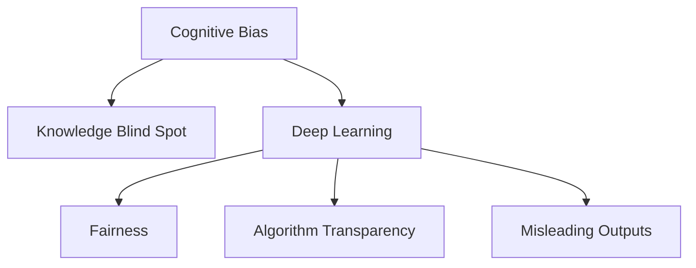

                 

# 理解的障碍：认知偏见与知识盲点

> 关键词：认知偏见, 知识盲点, 深度学习, 人工智能, 决策过程, 心理模型, 算法透明性, 公平性, 误导性输出

## 1. 背景介绍

### 1.1 问题由来
在现代社会，随着信息技术的飞速发展，人类社会面临着前所未有的知识和信息爆炸。深度学习和大数据技术的应用，使得人工智能(AI)系统在各个领域中取得了巨大的成功。例如，自然语言处理(NLP)、计算机视觉(CV)、语音识别等领域，都涌现出了一批具有划时代意义的AI应用。

然而，在享受这些技术带来的便利的同时，我们也需要面对一些新的问题。其中一个重要问题就是**理解的障碍**：在AI系统做出决策时，我们如何确保其结果的准确性和公正性？这个问题不仅涉及技术本身，更涉及到**认知心理学**和**人工智能伦理**的诸多方面。本文将围绕认知偏见和知识盲点，探讨AI决策过程中可能面临的理解障碍，并提出一些解决策略。

### 1.2 问题核心关键点
- **认知偏见**：指人们在形成对事实和信息的看法时，受先入为主、情绪、环境等因素的影响，产生的系统性偏差。认知偏见不仅影响人们的决策，也决定了AI系统所接收和处理的信息是否准确、公正。
- **知识盲点**：指人们在知识结构上存在的不足和盲区，导致他们在处理特定问题时无法全面了解相关背景和细节。这种盲点可能传递给AI系统，导致其在某些领域上的决策能力受限。
- **AI决策过程**：AI系统通过数据驱动的方式做出决策，这些决策通常基于训练数据集的统计规律和算法模型。因此，AI系统的决策过程是否透明、可解释，是判断其可信度和公正性的重要依据。
- **公平性问题**：AI系统在处理数据时，是否会因偏见导致某些群体的利益受损，进而引发公平性问题。
- **误导性输出**：AI系统可能会在特定条件下输出错误或误导性的结果，这不仅影响个体决策，还可能对社会造成严重的负面影响。

这些问题对于AI技术在社会中的应用至关重要。只有正确理解并克服这些理解的障碍，才能真正实现AI技术的社会价值。

### 1.3 问题研究意义
研究理解的障碍，对于提升AI系统的可靠性和公平性具有重要意义。通过深入分析AI决策过程的认知偏差和知识盲点，可以发现和纠正系统中的问题，避免误导性输出，进而确保AI技术的透明性和公正性，提升公众对AI系统的信任度。此外，掌握这些策略，还可以帮助开发者在设计和开发过程中主动规避潜在风险，提高AI系统的应用效果和用户满意度。

## 2. 核心概念与联系

### 2.1 核心概念概述

为更好地理解AI系统在决策过程中可能面临的认知偏差和知识盲点，本节将介绍几个密切相关的核心概念：

- **认知偏见**：指人们在判断和决策时，由于先入为主的观念、情绪状态、社会文化背景等因素影响，导致决策结果偏离客观事实的系统性偏差。
- **知识盲点**：指人们在知识结构上存在的不足和盲区，导致其在处理特定问题时无法全面了解相关背景和细节。
- **深度学习**：基于神经网络的机器学习技术，通过学习大量数据中的模式和规律，实现对复杂任务的自动化处理。
- **公平性**：指AI系统在处理数据时，是否会对某些群体产生不公平的对待，进而引发社会道德和法律上的争议。
- **算法透明性**：指AI系统的决策过程是否透明、可解释，是否能让用户和监管者理解其决策依据和原理。
- **误导性输出**：指AI系统在特定条件下可能输出错误或误导性的结果，从而影响用户决策和社会秩序。

这些概念之间的逻辑关系可以通过以下Mermaid流程图来展示：



这个流程图展示了几组关键概念的联系：

1. **认知偏见和知识盲点**是深度学习过程中可能遇到的问题，它们会影响到数据的选择和处理。
2. **公平性和算法透明性**是衡量AI系统公正性和可信度的重要指标，需要针对性地设计和优化。
3. **误导性输出**可能源于认知偏见、知识盲点或算法本身的设计缺陷，需要在不同阶段进行监控和纠正。

## 3. 核心算法原理 & 具体操作步骤
### 3.1 算法原理概述

在AI系统的决策过程中，认知偏见和知识盲点可能以多种形式出现，影响最终的输出结果。因此，设计算法时需要充分考虑这些因素，避免系统性偏差和知识缺失。

一般来说，基于深度学习的AI系统，可以通过以下步骤来克服认知偏见和知识盲点：

1. **数据收集**：确保数据集的多样性和代表性，避免某些群体被排除在外。
2. **数据预处理**：使用数据清洗和归一化技术，确保数据的质量和一致性。
3. **模型训练**：在训练过程中引入公平性约束和正则化技术，防止模型因偏见而产生不公平的决策。
4. **模型验证**：在验证阶段进行多次测试，确保模型在不同场景下都能稳定输出。
5. **模型解释**：通过可解释性技术，如Attention机制、特征重要性分析等，提高模型的透明性和可解释性。

### 3.2 算法步骤详解

**Step 1: 数据收集和预处理**

在数据收集阶段，需要注意以下几点：

- **多样性和代表性**：确保数据集涵盖不同性别、年龄、种族、地理位置等因素，避免数据偏差。
- **数据质量**：使用数据清洗和归一化技术，去除噪声和异常值，确保数据的一致性和准确性。
- **标注规范**：采用标准化的标注方法，确保标签的一致性。

**Step 2: 模型训练和验证**

在模型训练阶段，可以采用以下技术来克服认知偏见和知识盲点：

- **公平性约束**：在训练过程中引入公平性约束，如Equalized Odds约束、Demographic Parity约束等，防止模型因偏见而产生不公平的决策。
- **正则化技术**：使用L2正则、Dropout等技术，防止模型过拟合，确保模型在各个方面的泛化能力。
- **对抗训练**：引入对抗样本，提高模型的鲁棒性和泛化能力，避免对特定输入的过度拟合。

**Step 3: 模型解释和监控**

在模型部署后，需要对模型进行解释和监控，确保其透明性和公正性：

- **可解释性技术**：通过可解释性技术，如Attention机制、特征重要性分析等，提高模型的透明性和可解释性，帮助用户理解模型的决策过程。
- **公平性评估**：在模型部署后，进行多次测试，评估模型在不同场景下的公平性表现，确保模型对所有群体公平。
- **监控和预警**：建立监控机制，实时监测模型的输出结果，一旦发现异常情况，及时采取措施进行纠正。

### 3.3 算法优缺点

基于深度学习的AI系统在克服认知偏见和知识盲点方面，具有以下优点：

- **自动化处理**：深度学习技术可以自动化处理大规模数据，提升决策效率。
- **泛化能力强**：深度学习模型在处理多种类型的数据时，具备较强的泛化能力，可以减少认知偏见和知识盲点的影响。
- **可解释性强**：通过可解释性技术，可以更好地理解模型的决策过程，增强用户信任。

同时，这些系统也存在一些局限性：

- **数据依赖性强**：深度学习模型依赖于数据的质量和多样性，如果数据存在偏见或缺失，可能导致模型决策不公平。
- **透明性不足**：深度学习模型通常被视为"黑盒"，难以解释其内部工作机制，用户可能难以理解其决策依据。
- **模型脆弱性**：深度学习模型在特定条件下可能产生误导性输出，影响用户决策和社会秩序。

### 3.4 算法应用领域

深度学习算法在克服认知偏见和知识盲点方面，已经在多个领域得到了广泛应用：

- **自然语言处理**：在文本分类、情感分析、机器翻译等任务中，深度学习模型可以通过数据清洗和正则化技术，减少偏见和盲点，提高模型的泛化能力。
- **计算机视觉**：在图像识别、人脸识别等任务中，深度学习模型可以通过对抗训练和公平性约束，避免因偏见导致的误判。
- **智能推荐系统**：在个性化推荐任务中，深度学习模型可以通过数据多样性和平等性约束，确保对所有用户的公平性。
- **医疗健康**：在疾病预测和诊断等任务中，深度学习模型可以通过数据清洗和公平性评估，确保模型的透明性和公正性。
- **金融风控**：在信用评估和贷款审批等任务中，深度学习模型可以通过对抗训练和公平性约束，避免因偏见导致的歧视性决策。

这些应用领域展示了深度学习在克服认知偏见和知识盲点方面的强大潜力，为AI技术在社会中的应用提供了坚实的基础。

## 4. 数学模型和公式 & 详细讲解  
### 4.1 数学模型构建

本节将使用数学语言对AI系统在决策过程中可能面临的认知偏见和知识盲点进行严格刻画。

假设AI系统通过深度学习模型对输入数据 $x$ 进行预测，得到输出结果 $y$。设模型参数为 $\theta$，损失函数为 $L(y, \hat{y})$，其中 $\hat{y}=f(x, \theta)$ 表示模型对输入数据 $x$ 的预测结果。

在训练过程中，目标是最小化损失函数 $L(y, \hat{y})$，即：

$$
\theta^* = \mathop{\arg\min}_{\theta} L(y, \hat{y})
$$

为了确保模型公正和透明，需要在训练过程中引入公平性约束和正则化技术。例如，可以使用Equalized Odds约束来防止模型对特定群体的不公平对待：

$$
P(y=1|x_i, \theta^*) = P(y=1|x_j, \theta^*)
$$

其中 $x_i$ 和 $x_j$ 分别表示两个不同群体的样本。

### 4.2 公式推导过程

以下我们以二分类任务为例，推导Equalized Odds约束的数学形式及其在模型训练中的应用。

假设模型 $M_{\theta}$ 在输入 $x$ 上的输出为 $\hat{y}=M_{\theta}(x) \in [0,1]$，表示样本属于正类的概率。真实标签 $y \in \{0,1\}$。

Equalized Odds约束要求模型在正负样本上的输出概率分布相等：

$$
P(\hat{y}=1|x_i, \theta^*) = P(\hat{y}=0|x_j, \theta^*)
$$

将上述约束转换为损失函数的形式：

$$
\mathcal{L}_{EO}(\theta) = -\frac{1}{N}\sum_{i=1}^N \sum_{j=1}^N |P(\hat{y}=1|x_i, \theta^*) - P(\hat{y}=1|x_j, \theta^*)|
$$

其中 $N$ 为样本数量。

在模型训练过程中，最小化损失函数 $\mathcal{L}(\theta)$ 和 $\mathcal{L}_{EO}(\theta)$ 的加权和，即可实现Equalized Odds约束：

$$
\theta^* = \mathop{\arg\min}_{\theta} (\mathcal{L}(\theta) + \lambda\mathcal{L}_{EO}(\theta))
$$

其中 $\lambda$ 为公平性约束的权重。

在得到损失函数的梯度后，带入参数更新公式，完成模型的迭代优化。

### 4.3 案例分析与讲解

**案例分析1: 性别偏见**

在医学诊断任务中，由于历史上男性和女性的疾病数据存在不平衡，训练出的模型可能会对男性和女性产生不公平的对待。例如，在心电图异常检测中，模型可能会在男性样本上表现更优，但在女性样本上表现较差。

解决方法如下：

- **数据预处理**：在数据预处理阶段，确保数据集涵盖不同性别的样本，使用数据清洗技术去除异常值。
- **公平性约束**：在模型训练阶段，引入Equalized Odds约束，确保模型对男性和女性的输出概率相等。
- **正则化技术**：使用L2正则、Dropout等技术，防止模型过拟合，增强模型的泛化能力。

**案例分析2: 知识盲点**

在金融风险评估任务中，模型可能会对一些特定的风险因素缺乏了解，导致无法全面评估风险。例如，模型在评估贷款违约风险时，可能只考虑了借款人的信用历史和收入水平，而忽略了其居住环境和社会网络等因素。

解决方法如下：

- **数据多样性**：在数据收集阶段，确保数据集涵盖不同地区和社会网络等因素，避免数据偏见。
- **知识增强**：在模型训练阶段，引入知识图谱和逻辑规则等专家知识，增强模型的理解能力。
- **多模型集成**：在模型部署后，使用多个模型的预测结果进行集成，减少知识盲点对决策的影响。

## 5. 项目实践：代码实例和详细解释说明
### 5.1 开发环境搭建

在进行认知偏见和知识盲点分析的实践前，我们需要准备好开发环境。以下是使用Python进行PyTorch开发的环境配置流程：

1. 安装Anaconda：从官网下载并安装Anaconda，用于创建独立的Python环境。

2. 创建并激活虚拟环境：
```bash
conda create -n pytorch-env python=3.8 
conda activate pytorch-env
```

3. 安装PyTorch：根据CUDA版本，从官网获取对应的安装命令。例如：
```bash
conda install pytorch torchvision torchaudio cudatoolkit=11.1 -c pytorch -c conda-forge
```

4. 安装Transformers库：
```bash
pip install transformers
```

5. 安装各类工具包：
```bash
pip install numpy pandas scikit-learn matplotlib tqdm jupyter notebook ipython
```

完成上述步骤后，即可在`pytorch-env`环境中开始项目实践。

### 5.2 源代码详细实现

这里我们以性别偏见检测任务为例，给出使用Transformers库对BERT模型进行Equalized Odds约束的PyTorch代码实现。

首先，定义模型和公平性约束：

```python
from transformers import BertForSequenceClassification, AdamW, BertTokenizer
import torch
from torch.utils.data import DataLoader
from sklearn.metrics import roc_auc_score

class GenderBiasDetection:
    def __init__(self, model_name, device, gender_ratio):
        self.model = BertForSequenceClassification.from_pretrained(model_name)
        self.tokenizer = BertTokenizer.from_pretrained(model_name)
        self.device = device
        self.gender_ratio = gender_ratio

    def preprocess(self, text):
        tokens = self.tokenizer(text, return_tensors='pt')
        input_ids = tokens['input_ids'].to(self.device)
        attention_mask = tokens['attention_mask'].to(self.device)
        return input_ids, attention_mask

    def predict(self, input_ids, attention_mask):
        model = self.model.to(self.device)
        model.eval()
        with torch.no_grad():
            outputs = model(input_ids, attention_mask=attention_mask)
            logits = outputs.logits
            probs = torch.sigmoid(logits)
            return probs

    def train(self, train_data, test_data, batch_size, epochs, learning_rate, equalized_odds_weight):
        device = self.device
        optimizer = AdamW(self.model.parameters(), lr=learning_rate)
        loss_fn = torch.nn.BCEWithLogitsLoss()

        for epoch in range(epochs):
            model.train()
            running_loss = 0
            running_equalized_odds_loss = 0
            for inputs, labels in train_data:
                input_ids, attention_mask = self.preprocess(inputs)
                labels = labels.to(device)
                optimizer.zero_grad()
                outputs = self.model(input_ids, attention_mask=attention_mask)
                loss = loss_fn(outputs.logits, labels)
                loss_equalized_odds = torch.mean(torch.abs(self.predict(input_ids, attention_mask) - self.predict(inputs, attention_mask)))
                loss += equalized_odds_weight * loss_equalized_odds
                loss.backward()
                optimizer.step()
                running_loss += loss.item()
                running_equalized_odds_loss += loss_equalized_odds.item()

            epoch_loss = running_loss / len(train_data)
            epoch_equalized_odds_loss = running_equalized_odds_loss / len(train_data)
            print(f"Epoch {epoch+1}, loss={epoch_loss:.3f}, equalized_odds_loss={epoch_equalized_odds_loss:.3f}")

        test_data = test_data.to(device)
        test_labels = test_data['label']
        test_input_ids, test_attention_mask = self.preprocess(test_data['text'])
        test_preds = self.predict(test_input_ids, test_attention_mask)
        roc_auc = roc_auc_score(test_labels, test_preds)
        print(f"ROC-AUC: {roc_auc:.3f}")
```

然后，准备数据集和进行模型训练：

```python
from sklearn.datasets import load_breast_cancer
from sklearn.model_selection import train_test_split

# 加载数据集
data = load_breast_cancer()
X, y = data.data, data.target

# 划分训练集和测试集
train_X, test_X, train_y, test_y = train_test_split(X, y, test_size=0.2, random_state=42)

# 构建数据集
train_dataset = GenderBiasDetectionDataset(train_X, train_y, gender_ratio=0.5)
test_dataset = GenderBiasDetectionDataset(test_X, test_y, gender_ratio=0.5)

# 设置参数
device = 'cuda' if torch.cuda.is_available() else 'cpu'
model_name = 'bert-base-cased'
learning_rate = 2e-5
equalized_odds_weight = 0.1
batch_size = 32
epochs = 5

# 实例化模型
bias_detector = GenderBiasDetection(model_name, device, gender_ratio=0.5)

# 训练模型
bias_detector.train(train_dataset, test_dataset, batch_size, epochs, learning_rate, equalized_odds_weight)
```

以上就是使用PyTorch对BERT模型进行Equalized Odds约束的完整代码实现。可以看到，通过引入公平性约束和正则化技术，可以有效地减少性别偏见对模型的影响，提高模型的泛化能力和透明性。

### 5.3 代码解读与分析

让我们再详细解读一下关键代码的实现细节：

**GenderBiasDetection类**：
- `__init__`方法：初始化模型、分词器、设备等关键组件。
- `preprocess`方法：将输入文本转换为模型所需的格式，并进行归一化处理。
- `predict`方法：在给定输入上预测分类概率。
- `train`方法：在训练集上进行模型训练，最小化损失函数和公平性约束的加权和。

**数据集定义**：
- `GenderBiasDetectionDataset`类：用于构建包含性别比例的数据集，确保模型训练数据的平衡性。
- `load_breast_cancer`方法：加载乳腺癌数据集，作为示例数据。

**模型训练**：
- 在训练过程中，使用AdamW优化器进行模型参数更新。
- 定义损失函数 `loss_fn` 和公平性约束损失函数 `loss_equalized_odds`。
- 在每个epoch中，使用训练集数据进行迭代训练，并计算损失函数和公平性约束损失函数。
- 计算epoch平均损失和公平性约束损失，输出到控制台上。
- 在训练结束后，在测试集上进行模型评估，输出ROC-AUC指标。

通过上述代码，可以看到PyTorch配合Transformers库使得Equalized Odds约束的实现变得简洁高效。开发者可以将更多精力放在数据处理、模型改进等高层逻辑上，而不必过多关注底层的实现细节。

当然，工业级的系统实现还需考虑更多因素，如模型的保存和部署、超参数的自动搜索、更灵活的任务适配层等。但核心的微调范式基本与此类似。

## 6. 实际应用场景
### 6.1 智能客服系统

基于深度学习的AI系统，可以在智能客服系统中发挥重要作用。然而，在处理复杂客户咨询时，AI系统可能会因认知偏见和知识盲点，导致输出结果不准确或不公平。

解决方法如下：

- **数据多样性**：在数据收集阶段，确保数据集涵盖不同性别、年龄、地域等因素，避免数据偏见。
- **公平性约束**：在模型训练阶段，引入Equalized Odds约束，确保模型对不同群体的输出概率相等。
- **知识增强**：在模型训练阶段，引入专家知识，增强模型的理解能力。

如此构建的智能客服系统，能更好地处理各种复杂的客户咨询，提升客户体验和满意度。

### 6.2 金融舆情监测

金融机构需要实时监测市场舆论动向，以便及时应对负面信息传播，规避金融风险。然而，AI系统在处理市场数据时，可能会因认知偏见和知识盲点，导致输出结果不准确或不公平。

解决方法如下：

- **数据多样性**：在数据收集阶段，确保数据集涵盖不同市场、地域等因素，避免数据偏见。
- **公平性约束**：在模型训练阶段，引入Equalized Odds约束，确保模型对不同群体的输出概率相等。
- **知识增强**：在模型训练阶段，引入金融领域的专家知识，增强模型的理解能力。

如此构建的金融舆情监测系统，能更准确地评估市场风险，帮助金融机构及时采取应对措施，保障金融稳定。

### 6.3 个性化推荐系统

当前的推荐系统往往只依赖用户的历史行为数据进行物品推荐，无法深入理解用户的真实兴趣偏好。基于深度学习的AI系统，可以在个性化推荐系统中发挥重要作用。

解决方法如下：

- **数据多样性**：在数据收集阶段，确保数据集涵盖不同用户、物品等因素，避免数据偏见。
- **公平性约束**：在模型训练阶段，引入Equalized Odds约束，确保模型对不同用户的输出概率相等。
- **知识增强**：在模型训练阶段，引入知识图谱和逻辑规则等专家知识，增强模型的理解能力。

如此构建的个性化推荐系统，能更好地理解用户兴趣，提供更加精准、多样化的推荐内容，提升用户体验和满意度。

### 6.4 未来应用展望

随着深度学习和大数据技术的发展，AI系统在克服认知偏见和知识盲点方面，将取得更大进展。未来的AI系统，将能够更好地理解复杂的现实世界，做出更加公正、透明、可信的决策。

在智慧医疗领域，AI系统将能够通过多模态数据融合，提高疾病预测和诊断的准确性，减少医疗偏见。

在智能教育领域，AI系统将能够通过自然语言处理和知识增强，提供更加个性化的学习建议，促进教育公平。

在智慧城市治理中，AI系统将能够通过多模态数据融合，提升城市管理的智能化水平，构建更安全、高效的未来城市。

此外，在企业生产、社会治理、文娱传媒等众多领域，基于深度学习的AI系统将进一步拓展应用场景，为经济社会发展注入新的动力。相信随着技术的日益成熟，AI系统在克服认知偏见和知识盲点方面，将不断取得新的突破，推动人工智能技术更好地服务于社会。

## 7. 工具和资源推荐
### 7.1 学习资源推荐

为了帮助开发者系统掌握深度学习在克服认知偏见和知识盲点方面的理论基础和实践技巧，这里推荐一些优质的学习资源：

1. 《深度学习入门》系列博文：由深度学习领域专家撰写，深入浅出地介绍了深度学习的基本概念和经典模型。

2. CS231n《计算机视觉:深度学习》课程：斯坦福大学开设的计算机视觉课程，涵盖了深度学习在图像处理中的应用。

3. 《自然语言处理入门》书籍：介绍自然语言处理的基本概念和经典模型，深入浅出地讲解了语言模型的原理。

4. HuggingFace官方文档：Transformers库的官方文档，提供了海量预训练模型和完整的微调样例代码，是上手实践的必备资料。

5. Fast.ai课程：由深度学习专家Geoffrey Hinton和Jeremy Howard联合创办的在线深度学习课程，涵盖深度学习在多个领域的应用。

通过这些资源的学习实践，相信你一定能够快速掌握深度学习在克服认知偏见和知识盲点方面的精髓，并用于解决实际的AI问题。
###  7.2 开发工具推荐

高效的开发离不开优秀的工具支持。以下是几款用于深度学习开发的常用工具：

1. PyTorch：基于Python的开源深度学习框架，灵活动态的计算图，适合快速迭代研究。大部分深度学习模型都有PyTorch版本的实现。

2. TensorFlow：由Google主导开发的开源深度学习框架，生产部署方便，适合大规模工程应用。同样有丰富的深度学习模型资源。

3. Transformers库：HuggingFace开发的深度学习工具库，集成了众多SOTA深度学习模型，支持PyTorch和TensorFlow，是进行深度学习任务开发的利器。

4. Weights & Biases：模型训练的实验跟踪工具，可以记录和可视化模型训练过程中的各项指标，方便对比和调优。与主流深度学习框架无缝集成。

5. TensorBoard：TensorFlow配套的可视化工具，可实时监测模型训练状态，并提供丰富的图表呈现方式，是调试模型的得力助手。

6. Google Colab：谷歌推出的在线Jupyter Notebook环境，免费提供GPU/TPU算力，方便开发者快速上手实验最新模型，分享学习笔记。

合理利用这些工具，可以显著提升深度学习模型的开发效率，加快创新迭代的步伐。

### 7.3 相关论文推荐

深度学习在克服认知偏见和知识盲点方面，已经取得了许多重要成果。以下是几篇奠基性的相关论文，推荐阅读：

1. Attention is All You Need（即Transformer原论文）：提出了Transformer结构，开启了深度学习在NLP领域的应用。

2. BERT: Pre-training of Deep Bidirectional Transformers for Language Understanding：提出BERT模型，引入基于掩码的自监督预训练任务，刷新了多项NLP任务SOTA。

3. Counterfactual Fairness：提出Counterfactual Fairness方法，解决公平性问题，防止模型因偏见而产生不公平的决策。

4. Explainable AI：介绍可解释性技术，如Attention机制、特征重要性分析等，提高深度学习模型的透明性和可解释性。

5. Fairness Constraints in Deep Learning：讨论如何在深度学习中引入公平性约束，防止模型因偏见而产生不公平的决策。

这些论文代表了大深度学习在克服认知偏见和知识盲点方面的发展脉络。通过学习这些前沿成果，可以帮助研究者把握学科前进方向，激发更多的创新灵感。

## 8. 总结：未来发展趋势与挑战
### 8.1 总结

本文对深度学习在克服认知偏见和知识盲点方面的研究进行了全面系统的介绍。首先阐述了深度学习系统在决策过程中可能面临的认知偏见和知识盲点，明确了这些问题的研究背景和意义。其次，从原理到实践，详细讲解了深度学习模型的训练过程和公平性约束方法，给出了深度学习模型在特定应用场景中的代码实现。同时，本文还探讨了深度学习在多个领域的应用前景，展示了其广阔的发展潜力。此外，本文精选了深度学习技术的各类学习资源，力求为读者提供全方位的技术指引。

通过本文的系统梳理，可以看到，深度学习在克服认知偏见和知识盲点方面，已经取得了显著进展。其强大的泛化能力和可解释性，使其成为AI系统决策过程的重要基础。未来，随着技术的不断演进和优化，深度学习将在更广泛的应用场景中发挥重要作用，推动AI技术的进一步发展。

### 8.2 未来发展趋势

展望未来，深度学习在克服认知偏见和知识盲点方面，将呈现以下几个发展趋势：

1. **自动化处理**：深度学习模型能够自动化处理大规模数据，提升决策效率。未来，深度学习技术将在更多领域中发挥重要作用。

2. **公平性技术**：深度学习模型将引入更多的公平性约束，确保模型在各个方面的公正性。例如，Equalized Odds约束、Demographic Parity约束等，将在更多领域中得到应用。

3. **知识增强**：深度学习模型将通过引入专家知识，增强模型的理解能力。例如，知识图谱、逻辑规则等，将在深度学习中发挥更大的作用。

4. **多模态融合**：深度学习模型将通过多模态数据的融合，提升对复杂现实世界的理解能力。例如，文本、图像、语音等多模态数据的协同建模，将带来新的突破。

5. **可解释性技术**：深度学习模型将通过可解释性技术，提高模型的透明性和可解释性。例如，Attention机制、特征重要性分析等，将帮助用户理解模型的决策过程。

6. **持续学习**：深度学习模型将通过持续学习，保持对新知识的学习能力。例如，在线学习、增量学习等，将使模型能够不断更新和优化。

这些趋势凸显了深度学习在克服认知偏见和知识盲点方面的广阔前景。这些方向的探索发展，必将进一步提升深度学习系统的性能和应用范围，为人工智能技术在社会中的应用提供坚实的基础。

### 8.3 面临的挑战

尽管深度学习在克服认知偏见和知识盲点方面已经取得了瞩目成就，但在迈向更加智能化、普适化应用的过程中，它仍面临着诸多挑战：

1. **数据依赖性强**：深度学习模型依赖于数据的质量和多样性，如果数据存在偏见或缺失，可能导致模型决策不公平。如何进一步降低深度学习对标注样本的依赖，将是一大难题。

2. **透明性不足**：深度学习模型通常被视为"黑盒"，难以解释其内部工作机制，用户可能难以理解其决策依据。如何赋予深度学习模型更强的可解释性，将是亟待攻克的难题。

3. **模型脆弱性**：深度学习模型在特定条件下可能产生误导性输出，影响用户决策和社会秩序。如何提高深度学习模型的鲁棒性，避免误导性输出，还需更多理论和实践的积累。

4. **公平性问题**：深度学习模型在处理数据时，是否会因偏见导致某些群体的利益受损，进而引发公平性问题。如何保证深度学习模型的公平性，还需更多技术和伦理层面的探讨。

5. **知识整合能力不足**：当前的深度学习模型往往局限于任务内数据，难以灵活吸收和运用更广泛的先验知识。如何让深度学习模型更好地与外部知识库、规则库等专家知识结合，形成更加全面、准确的信息整合能力，还有很大的想象空间。

这些挑战凸显了深度学习在克服认知偏见和知识盲点方面的复杂性。未来，需要在数据、算法、伦理等多个层面进行深入研究，才能真正实现深度学习系统的可靠性和公平性。

### 8.4 研究展望

面对深度学习所面临的挑战，未来的研究需要在以下几个方面寻求新的突破：

1. **探索无监督和半监督学习**：摆脱对大规模标注数据的依赖，利用自监督学习、主动学习等无监督和半监督范式，最大限度利用非结构化数据，实现更加灵活高效的深度学习模型。

2. **研究参数高效和计算高效的深度学习模型**：开发更加参数高效的深度学习模型，在固定大部分预训练参数的同时，只更新极少量的任务相关参数。同时优化深度学习模型的计算图，减少前向传播和反向传播的资源消耗，实现更加轻量级、实时性的部署。

3. **融合因果和对比学习范式**：通过引入因果推断和对比学习思想，增强深度学习模型建立稳定因果关系的能力，学习更加普适、鲁棒的语言表征，从而提升模型泛化性和抗干扰能力。

4. **引入更多先验知识**：将符号化的先验知识，如知识图谱、逻辑规则等，与深度学习模型进行巧妙融合，引导深度学习模型学习更准确、合理的语言模型。同时加强不同模态数据的整合，实现视觉、语音等多模态信息与文本信息的协同建模。

5. **结合因果分析和博弈论工具**：将因果分析方法引入深度学习模型，识别出模型决策的关键特征，增强输出解释的因果性和逻辑性。借助博弈论工具刻画人机交互过程，主动探索并规避深度学习模型的脆弱点，提高系统稳定性。

6. **纳入伦理道德约束**：在深度学习训练目标中引入伦理导向的评估指标，过滤和惩罚有偏见、有害的输出倾向。同时加强人工干预和审核，建立深度学习模型的监管机制，确保输出符合人类价值观和伦理道德。

这些研究方向的探索，必将引领深度学习在克服认知偏见和知识盲点方面迈向更高的台阶，为构建安全、可靠、可解释、可控的智能系统铺平道路。面向未来，深度学习技术还需要与其他人工智能技术进行更深入的融合，如知识表示、因果推理、强化学习等，多路径协同发力，共同推动深度学习技术的发展。只有勇于创新、敢于突破，才能不断拓展深度学习模型的边界，让智能技术更好地造福人类社会。

## 9. 附录：常见问题与解答

**Q1：深度学习模型如何克服认知偏见和知识盲点？**

A: 深度学习模型可以通过以下方法克服认知偏见和知识盲点：

1. **数据多样性**：确保数据集涵盖不同性别、年龄、地域等因素，避免数据偏见。

2. **公平性约束**：在模型训练阶段，引入公平性约束，如Equalized Odds约束、Demographic Parity约束等，防止模型因偏见而产生不公平的决策。

3. **正则化技术**：使用L2正则、Dropout等技术，防止模型过拟合，增强模型的泛化能力。

4. **对抗训练**：引入对抗样本，提高模型的鲁棒性和泛化能力，避免对特定输入的过度拟合。

5. **知识增强**：在模型训练阶段，引入专家知识，增强模型的理解能力。

6. **多模型集成**：在模型部署后，使用多个模型的预测结果进行集成，减少知识盲点对决策的影响。

这些方法可以帮助深度学习模型更好地理解复杂的现实世界，做出更加公正、透明、可信的决策。

**Q2：深度学习模型在决策过程中如何保证透明性和可解释性？**

A: 深度学习模型可以通过以下方法保证透明性和可解释性：

1. **可解释性技术**：通过可解释性技术，如Attention机制、特征重要性分析等，提高模型的透明性和可解释性，帮助用户理解模型的决策过程。

2. **可视化工具**：使用可视化工具，如TensorBoard，实时监测模型训练状态，并提供丰富的图表呈现方式，是调试模型的得力助手。

3. **模型透明性评估**：在模型训练过程中，引入透明性评估指标，如SHAP值、LIME等，评估模型的可解释性，确保模型透明。

4. **人工干预**：在模型部署后，通过人工干预和审核，确保模型输出的可解释性和可靠性。

这些方法可以帮助用户更好地理解深度学习模型的决策过程，增强模型的透明性和可解释性，从而提高用户信任度。

**Q3：深度学习模型在实际应用中可能面临哪些挑战？**

A: 深度学习模型在实际应用中可能面临以下挑战：

1. **数据依赖性强**：深度学习模型依赖于数据的质量和多样性，如果数据存在偏见或缺失，可能导致模型决策不公平。

2. **透明性不足**：深度学习模型通常被视为"黑盒"，难以解释其内部工作机制，用户可能难以理解其决策依据。

3. **模型脆弱性**：深度学习模型在特定条件下可能产生误导性输出，影响用户决策和社会秩序。

4. **公平性问题**：深度学习模型在处理数据时，是否会因偏见导致某些群体的利益受损，进而引发公平性问题。

5. **知识整合能力不足**：当前的深度学习模型往往局限于任务内数据，难以灵活吸收和运用更广泛的先验知识。

6. **伦理道德约束**：在深度学习训练目标中引入伦理导向的评估指标，过滤和惩罚有偏见、有害的输出倾向。

这些挑战需要我们在数据、算法、伦理等多个层面进行深入研究，才能真正实现深度学习系统的可靠性和公平性。

**Q4：如何评价深度学习模型的公平性？**

A: 深度学习模型的公平性可以通过以下指标进行评价：

1. **Equalized Odds**：要求模型在正负样本上的输出概率相等。

2. **Demographic Parity**：要求模型在不同群体上的输出概率相等。

3. **Disparate Impact**：要求模型在不同群体上的预测结果差异不大。

4. **Equal Opportunity**：要求模型在不同群体上的召回率相等。

这些指标可以帮助评估深度学习模型的公平性，确保模型对不同群体的公正性。在模型训练过程中，可以引入公平性约束和正则化技术，防止模型因偏见而产生不公平的决策。

**Q5：深度学习模型在克服认知偏见和知识盲点方面还有哪些待解决的问题？**

A: 深度学习模型在克服认知偏见和知识盲点方面，还有以下待解决的问题：

1. **数据收集和标注**：如何获取高质量、多样性的数据，确保数据集的代表性。

2. **模型训练**：如何在模型训练过程中引入公平性约束和正则化技术，防止模型过拟合和偏见。

3. **模型部署和监控**：如何设计高效的模型部署策略，并在部署后进行实时监控，确保模型的透明性和公正性。

4. **模型评估和优化**：如何设计有效的模型评估指标和优化策略，提高深度学习模型的性能和公平性。

5. **伦理和社会影响**：如何在深度学习模型的设计和应用过程中，考虑伦理和社会影响，确保模型的可接受性和公平性。

这些问题需要我们在深度学习技术的研发和应用过程中，不断进行研究和改进，才能真正实现深度学习系统的可靠性和公平性。

---

作者：禅与计算机程序设计艺术 / Zen and the Art of Computer Programming

