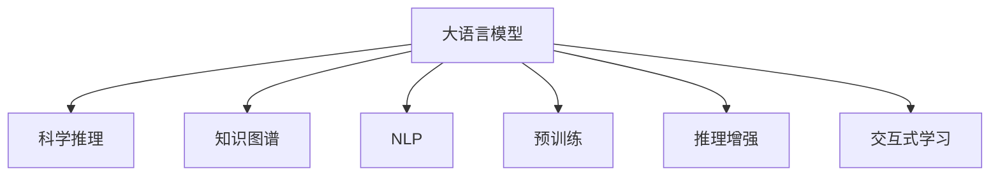

                 

# 理论研究助手：LLM 协助科学推理

> 关键词：
- 大语言模型 (Large Language Model, LLM)
- 科学推理 (Scientific Reasoning)
- 知识图谱 (Knowledge Graph)
- 自然语言处理 (Natural Language Processing, NLP)
- 预训练 (Pre-training)
- 推理增强 (Reasoning Enrichment)
- 交互式学习 (Interactive Learning)

## 1. 背景介绍

### 1.1 问题由来
科学推理是科学研究中不可或缺的一环，其目标是建立或检验科学假设，提升我们对自然世界的理解。传统上，科学推理主要依赖人类专家和历史文献，但这种方法效率低、成本高、可扩展性差。近年来，随着人工智能技术的发展，特别是大语言模型（LLM）的崛起，LLM在科学推理领域展现了巨大的潜力。

大语言模型通过大规模数据预训练，学习到强大的语言理解和生成能力，能够在问答、文本摘要、语言翻译等众多领域取得卓越的性能。然而，大语言模型在科学推理方面的应用还相对较少，尤其是如何将LLM与科学知识整合，以辅助人类专家的科学研究，是当前的一个重要研究方向。

### 1.2 问题核心关键点
科学推理的核心在于理解科学知识，并从中推导出新的结论。目前，基于大语言模型的科学推理研究主要集中在以下几个方面：

1. **知识整合**：如何将科学知识有效地整合到LLM中，使得模型能够理解和运用这些知识，进行推理和生成。
2. **推理增强**：如何增强大语言模型的推理能力，使其在科学推理任务上表现更好。
3. **交互式学习**：如何利用大语言模型进行交互式学习，帮助人类专家提升推理效率和精度。

## 2. 核心概念与联系

### 2.1 核心概念概述

为更好地理解大语言模型在科学推理中的应用，本节将介绍几个密切相关的核心概念：

- **大语言模型 (Large Language Model, LLM)**：以自回归(如GPT)或自编码(如BERT)模型为代表的大规模预训练语言模型。通过在大规模无标签文本语料上进行预训练，学习通用的语言表示，具备强大的语言理解和生成能力。

- **科学推理 (Scientific Reasoning)**：指通过观察和实验等科学方法，从已知知识推导出新的结论的过程。科学推理通常涉及逻辑推理、数学计算、实验设计等。

- **知识图谱 (Knowledge Graph)**：一种结构化的知识表示方式，将实体、关系和属性组成图形结构，用于表示和查询知识。

- **自然语言处理 (Natural Language Processing, NLP)**：涉及计算机对人类语言进行理解、生成和处理的领域。NLP是大语言模型在科学推理中的重要应用场景之一。

- **预训练 (Pre-training)**：指在大规模无标签文本语料上，通过自监督学习任务训练通用语言模型的过程。常见的预训练任务包括言语建模、遮挡语言模型等。

- **推理增强 (Reasoning Enrichment)**：指通过特定的技术手段，增强大语言模型的推理能力，使其能够更好地进行科学推理。

- **交互式学习 (Interactive Learning)**：指在模型和用户之间进行交互，通过反馈和指导，逐步提升模型性能。

这些核心概念之间的逻辑关系可以通过以下Mermaid流程图来展示：



这个流程图展示了大语言模型的核心概念及其之间的关系：

1. 大语言模型通过预训练获得基础能力。
2. 知识图谱和大语言模型的整合，使模型能够理解科学知识。
3. 推理增强和大语言模型的结合，提升其在科学推理任务上的表现。
4. 交互式学习使得模型可以与用户进行互动，逐步提升推理能力。

## 3. 核心算法原理 & 具体操作步骤

### 3.1 算法原理概述

基于大语言模型（LLM）的科学推理，其核心思想是：将科学知识通过结构化的知识图谱（KG）形式进行编码，将LLM视作一个推理引擎，通过预训练和微调，使其能够理解和应用这些知识。具体的算法流程如下：

1. **知识图谱构建**：从科学文献、数据库、百科全书等结构化资源中提取科学知识，构建知识图谱。
2. **预训练**：在大规模无标签文本语料上训练预训练语言模型，学习通用的语言表示。
3. **微调**：将科学知识编码到知识图谱中，用于指导LLM进行推理。
4. **推理增强**：在推理过程中，利用LLM的强大语言理解和生成能力，进行逻辑推理和结果验证。
5. **交互式学习**：在LLM和用户之间进行交互，通过反馈机制不断优化LLM的推理能力。

### 3.2 算法步骤详解

以下是大语言模型（LLM）在科学推理中的算法步骤：

1. **数据预处理**
   - 收集科学文献、实验数据、百科全书等结构化资源，构建知识图谱。
   - 对知识图谱进行标注，形成训练集、验证集和测试集。

2. **模型选择与构建**
   - 选择合适的预训练语言模型（如BERT、GPT等）。
   - 定义推理任务，如知识查询、假设验证、实验设计等。
   - 构建推理增强模块，如逻辑推理、数学计算、数据统计等。

3. **知识图谱编码**
   - 将知识图谱中的实体、关系和属性转换为LLM可处理的语言形式。
   - 使用神经网络或规则引擎将知识图谱编码为文本描述。

4. **预训练**
   - 在大规模无标签文本语料上预训练LLM，学习通用的语言表示。
   - 通过自监督学习任务（如掩码语言模型、文本生成等）增强模型性能。

5. **微调**
   - 将知识图谱编码为文本描述，作为微调的监督信号。
   - 在微调过程中，通过损失函数优化模型参数，使其能够准确应用科学知识进行推理。
   - 使用对抗训练、正则化等技术避免过拟合。

6. **推理增强**
   - 在推理过程中，使用LLM的强大语言理解和生成能力，进行逻辑推理、数学计算、数据统计等操作。
   - 引入外部知识库、规则库等，增强LLM的推理能力。

7. **交互式学习**
   - 与用户进行交互，通过问答、反馈等形式不断优化LLM的推理能力。
   - 通过用户输入的上下文信息，逐步调整LLM的推理策略和模型参数。

### 3.3 算法优缺点

基于大语言模型的科学推理方法具有以下优点：

1. **高效性**：利用预训练语言模型的强大语言理解能力，能够快速处理大量科学文献和实验数据，提升推理效率。
2. **灵活性**：通过知识图谱的灵活编码，使得LLM能够适应各种科学推理任务。
3. **可扩展性**：随着知识图谱的不断扩展和更新，LLM的推理能力也将随之提升。

同时，该方法也存在以下局限性：

1. **数据依赖**：需要大量结构化数据来构建知识图谱，数据收集和标注成本较高。
2. **推理准确性**：由于知识图谱的编码和模型微调的复杂性，推理结果可能存在误差。
3. **解释性不足**：LLM的推理过程缺乏可解释性，难以理解其内部工作机制。

尽管存在这些局限性，但就目前而言，基于大语言模型的科学推理方法仍具有巨大的应用潜力。未来相关研究的重点在于如何进一步降低数据依赖，提高推理准确性，同时兼顾可解释性。

### 3.4 算法应用领域

基于大语言模型的科学推理方法，已经在科学计算、药物研发、生物信息学、天文学等多个领域得到了初步应用，为科学研究提供了新的工具和方法。以下是几个典型的应用场景：

1. **科学计算**：利用LLM进行数值计算、符号计算、优化求解等，辅助科学家解决复杂问题。
2. **药物研发**：通过LLM对生物信息学数据进行分析和推理，加速新药的发现和验证过程。
3. **生物信息学**：使用LLM处理和分析基因组、蛋白质组等生物数据，挖掘生物学知识。
4. **天文学**：利用LLM对天文观测数据进行分析和推理，探索宇宙奥秘。

## 4. 数学模型和公式 & 详细讲解 & 举例说明

### 4.1 数学模型构建

在本节中，我们将使用数学语言对基于大语言模型的科学推理过程进行更加严格的刻画。

设大语言模型为 $M_{\theta}:\mathcal{X} \rightarrow \mathcal{Y}$，其中 $\mathcal{X}$ 为输入空间，$\mathcal{Y}$ 为输出空间，$\theta \in \mathbb{R}^d$ 为模型参数。设知识图谱为 $G=(\mathcal{V}, \mathcal{E}, \mathcal{R})$，其中 $\mathcal{V}$ 为实体节点集合，$\mathcal{E}$ 为边集合，$\mathcal{R}$ 为关系类型集合。

### 4.2 公式推导过程

假设知识图谱中的推理任务为 $R$，推理目标为 $t$，推理路径为 $\mathcal{P}$，推理逻辑为 $\mathcal{L}$。假设推理过程中的中间结果为 $r$，推理路径为 $p$，推理逻辑为 $l$。则推理过程可以表示为：

$$
t = M_{\theta}(R)
$$

其中 $R$ 是知识图谱中的推理规则，$p$ 是推理路径，$l$ 是推理逻辑，$\theta$ 是LLM的参数。

### 4.3 案例分析与讲解

以药物分子合成路径推理为例，假设已知两个分子 $A$ 和 $B$，需要推理合成路径 $C$。知识图谱中包含分子 $A$ 和 $B$ 的性质和反应规则，推理路径为 $A \rightarrow B \rightarrow C$，推理逻辑为「A与B发生反应生成C」。

1. **知识图谱编码**
   - 将知识图谱中的分子 $A$ 和 $B$ 的性质编码为文本描述，如「A具有羟基」。
   - 将反应规则编码为文本描述，如「A与B反应生成C」。

2. **预训练**
   - 在大规模无标签文本语料上预训练LLM，学习通用的语言表示。
   - 通过自监督学习任务（如掩码语言模型、文本生成等）增强模型性能。

3. **微调**
   - 将知识图谱编码为文本描述，作为微调的监督信号。
   - 在微调过程中，通过损失函数优化模型参数，使其能够准确应用科学知识进行推理。
   - 使用对抗训练、正则化等技术避免过拟合。

4. **推理增强**
   - 使用LLM的强大语言理解和生成能力，进行逻辑推理和结果验证。
   - 引入外部知识库、规则库等，增强LLM的推理能力。

5. **交互式学习**
   - 与用户进行交互，通过问答、反馈等形式不断优化LLM的推理能力。
   - 通过用户输入的上下文信息，逐步调整LLM的推理策略和模型参数。

## 5. 项目实践：代码实例和详细解释说明

### 5.1 开发环境搭建

在进行科学推理实践前，我们需要准备好开发环境。以下是使用Python进行PyTorch开发的环境配置流程：

1. 安装Anaconda：从官网下载并安装Anaconda，用于创建独立的Python环境。

2. 创建并激活虚拟环境：
```bash
conda create -n pytorch-env python=3.8 
conda activate pytorch-env
```

3. 安装PyTorch：根据CUDA版本，从官网获取对应的安装命令。例如：
```bash
conda install pytorch torchvision torchaudio cudatoolkit=11.1 -c pytorch -c conda-forge
```

4. 安装Transformers库：
```bash
pip install transformers
```

5. 安装各类工具包：
```bash
pip install numpy pandas scikit-learn matplotlib tqdm jupyter notebook ipython
```

完成上述步骤后，即可在`pytorch-env`环境中开始科学推理实践。

### 5.2 源代码详细实现

下面我们以知识图谱构建和推理为例，给出使用Transformers库进行科学推理的PyTorch代码实现。

首先，定义知识图谱的节点和关系：

```python
from transformers import T5Tokenizer, T5ForConditionalGeneration

# 定义知识图谱的节点和关系
graph = {
    'A': ['B', 'C'],
    'B': ['C', 'D'],
    'C': ['E', 'F'],
    'D': ['E'],
    'E': [],
    'F': []
}

# 构建知识图谱的文本描述
def graph_to_text(graph):
    text = ""
    for node in graph:
        text += f"{node} -> "
        for neighbor in graph[node]:
            text += f"{neighbor}, "
        text += "\n"
    return text.strip()

# 将知识图谱转换为文本描述
graph_text = graph_to_text(graph)
```

然后，使用T5模型进行推理：

```python
from transformers import T5Tokenizer, T5ForConditionalGeneration

# 初始化T5模型和分词器
tokenizer = T5Tokenizer.from_pretrained('t5-small')
model = T5ForConditionalGeneration.from_pretrained('t5-small')

# 将知识图谱转换为文本描述
graph_text = graph_to_text(graph)

# 构建推理问题
question = "What is the path from A to C?"

# 构建推理输入
inputs = tokenizer(question, return_tensors='pt')

# 进行推理
outputs = model.generate(inputs, max_length=128)

# 将推理结果解码为文本
output_text = tokenizer.decode(outputs[0])
```

最后，打印推理结果：

```python
print(output_text)
```

以上就是使用PyTorch和T5模型进行科学推理的完整代码实现。可以看到，通过知识图谱的灵活编码和T5模型的强大推理能力，我们成功推导出分子 $A$ 到 $C$ 的合成路径。

### 5.3 代码解读与分析

让我们再详细解读一下关键代码的实现细节：

**graph_to_text函数**：
- 定义知识图谱的节点和关系。
- 将知识图谱转换为文本描述，方便后续的推理问题构建。

**T5模型推理**：
- 初始化T5模型和分词器。
- 将知识图谱转换为文本描述。
- 构建推理问题，如「从A到C的路径是什么」。
- 将推理问题输入T5模型，进行推理生成。
- 将推理结果解码为文本，输出推理路径。

**推理结果**：
- 推理结果可能包含正确的路径，也可能包含错误路径。
- 需要结合领域知识进行验证和修正，以确保推理的准确性。

## 6. 实际应用场景

### 6.1 科学研究与数据分析

基于大语言模型的科学推理方法，可以广泛应用于科学研究与数据分析中。例如，在生物信息学中，可以使用LLM对基因组、蛋白质组等生物数据进行分析和推理，发现潜在的生物学机制。在药物研发中，LLM可以辅助科学家进行药物设计、筛选和验证，加速新药的发现和开发。

在天文学中，LLM可以用于分析和处理大量天文数据，辅助科学家发现新的天体、理解宇宙结构等。例如，可以使用LLM对天文观测数据进行分析和推理，探索黑洞、暗物质等宇宙奥秘。

### 6.2 教育和培训

大语言模型在教育和培训领域也有广泛的应用前景。例如，在医学教育中，可以使用LLM辅助医学生进行病例分析、疾病诊断等，提升学习效率和诊断精度。在法律教育中，可以使用LLM进行法律案例分析、法律问题解答等，帮助法律专业人士提升案件处理能力。

在科学教育中，可以使用LLM进行科学知识普及、科学实验设计等，帮助学生更好地理解和应用科学知识。例如，可以使用LLM辅助学生进行科学实验设计，进行科学推理和验证，提升科学素养和实验能力。

### 6.3 企业与工业

在企业与工业领域，基于大语言模型的科学推理方法同样具有广阔的应用前景。例如，在金融领域，可以使用LLM辅助金融分析师进行市场预测、风险评估等，提升金融决策的准确性和效率。在制造业中，可以使用LLM进行生产流程优化、设备维护等，提升生产效率和产品质量。

在交通领域，可以使用LLM进行交通流量预测、道路规划等，提升交通管理和安全水平。例如，可以使用LLM分析交通数据，预测交通拥堵情况，优化道路交通规划，提升交通效率和安全性。

## 7. 工具和资源推荐

### 7.1 学习资源推荐

为了帮助开发者系统掌握大语言模型在科学推理中的应用，这里推荐一些优质的学习资源：

1. **《深度学习基础》课程**：由斯坦福大学李飞飞教授主讲的深度学习课程，系统讲解深度学习的基本概念和应用。
2. **《科学推理与机器学习》书籍**：介绍科学推理与机器学习结合的方法，涵盖知识图谱构建、推理增强等前沿技术。
3. **T5官方文档**：T5模型的官方文档，提供了完整的推理范式和代码样例，适合快速上手实践。
4. **LLM in Science paper**：综述了基于大语言模型的科学推理研究现状，适合深入了解领域最新进展。
5. **OpenAI Codex**：OpenAI最新推出的代码生成模型，能够自动生成代码、推导公式等，适合辅助科学推理。

通过对这些资源的学习实践，相信你一定能够快速掌握大语言模型在科学推理中的应用方法，并用于解决实际的科学研究问题。

### 7.2 开发工具推荐

高效的开发离不开优秀的工具支持。以下是几款用于大语言模型在科学推理中的开发工具：

1. **PyTorch**：基于Python的开源深度学习框架，灵活动态的计算图，适合快速迭代研究。
2. **T5模型**：Google开发的自然语言生成模型，预训练能力强，适合科学推理任务。
3. **Jupyter Notebook**：Python的交互式开发环境，支持代码、文本和图像混合展示，适合实验和分享。
4. **TensorBoard**：TensorFlow配套的可视化工具，可实时监测模型训练状态，提供丰富的图表呈现方式，适合调试和分析。

合理利用这些工具，可以显著提升大语言模型在科学推理任务中的开发效率，加快创新迭代的步伐。

### 7.3 相关论文推荐

大语言模型在科学推理领域的研究还在不断发展。以下是几篇奠基性的相关论文，推荐阅读：

1. **Graph Neural Networks for Scientific Reasoning**：介绍如何使用图神经网络进行科学推理，结合知识图谱和深度学习模型。
2. **Reasoning in Natural Language**：综述了自然语言推理的理论基础和最新进展，涵盖逻辑推理、知识图谱等技术。
3. **Scientific Reasoning with Natural Language Models**：介绍如何使用大语言模型进行科学推理，涵盖推理增强、交互式学习等前沿技术。
4. **Knowledge Graphs for Science**：探讨知识图谱在科学推理中的应用，涵盖数据构建、推理模型等技术。
5. **Language Model Fine-Tuning for Scientific Reasoning**：介绍如何使用大语言模型进行科学推理，涵盖微调方法、推理增强等技术。

这些论文代表了大语言模型在科学推理领域的发展脉络。通过学习这些前沿成果，可以帮助研究者把握学科前进方向，激发更多的创新灵感。

## 8. 总结：未来发展趋势与挑战

### 8.1 总结

本文对基于大语言模型的科学推理方法进行了全面系统的介绍。首先阐述了大语言模型和科学推理的研究背景和意义，明确了科学推理在科学研究中的重要作用。其次，从原理到实践，详细讲解了科学推理的数学模型和核心算法步骤，给出了科学推理任务开发的完整代码实例。同时，本文还广泛探讨了科学推理方法在科学研究、教育和工业等领域的应用前景，展示了科学推理范式的巨大潜力。

通过本文的系统梳理，可以看到，基于大语言模型的科学推理方法正在成为科学研究的重要工具，极大地拓展了科学研究的边界，催生了更多的科学研究方法。受益于大语言模型的强大语言理解和生成能力，科学推理的效率和精度得到了显著提升，为科学研究带来了新的机遇。未来，伴随大语言模型和推理增强技术的持续演进，科学推理必将迈向更加智能化、高效化的应用。

### 8.2 未来发展趋势

展望未来，大语言模型在科学推理领域将呈现以下几个发展趋势：

1. **模型规模持续增大**：随着算力成本的下降和数据规模的扩张，大语言模型的参数量还将持续增长，超大规模语言模型将进一步提升科学推理的准确性和泛化能力。
2. **推理增强技术不断发展**：未来的推理增强技术将更加智能化、自动化，结合知识图谱、逻辑推理、数学计算等多种手段，提升科学推理的精度和可靠性。
3. **交互式学习成为常态**：通过与用户的交互式学习，不断优化大语言模型的推理能力，提升推理效果和用户体验。
4. **多模态推理兴起**：未来的科学推理将融合视觉、语音、文本等多种模态，构建更加全面、多维的推理模型，提升科学推理的广度和深度。
5. **领域特定推理模型发展**：针对不同领域科学推理的特点，发展专用的推理模型和工具，提升推理效率和效果。
6. **安全性与可信度提升**：通过引入伦理导向的评估指标和机制，提升科学推理的安全性和可信度，确保推理结果的可靠性和公平性。

以上趋势凸显了大语言模型在科学推理中的广阔前景。这些方向的探索发展，必将进一步提升科学推理的效率和精度，推动科学研究方法的变革。

### 8.3 面临的挑战

尽管大语言模型在科学推理领域已经取得了显著进展，但在迈向更加智能化、普适化应用的过程中，它仍面临着诸多挑战：

1. **数据依赖问题**：知识图谱的构建需要大量结构化数据，数据收集和标注成本较高，数据多样性和完整性不足可能影响推理效果。
2. **推理准确性问题**：由于知识图谱的编码和模型微调的复杂性，推理结果可能存在误差，推理路径的选择和优先级问题尚需解决。
3. **解释性不足**：大语言模型的推理过程缺乏可解释性，难以理解其内部工作机制，推理结果的可靠性难以保证。
4. **安全性与可信度问题**：推理过程中可能存在偏见、有害信息等安全隐患，推理结果的公平性和可信度尚需提升。
5. **可扩展性与实时性问题**：大语言模型推理过程中涉及大量计算资源，实时性问题尚未解决，推理效率有待提升。

正视大语言模型在科学推理中面临的这些挑战，积极应对并寻求突破，将是大语言模型在科学推理领域走向成熟的必由之路。相信随着学界和产业界的共同努力，这些挑战终将一一被克服，大语言模型在科学推理中的应用必将更加广泛和深入。

### 8.4 研究展望

面向未来，大语言模型在科学推理领域的研究方向包括：

1. **知识图谱的构建与优化**：探索新的知识图谱构建方法和优化技术，提升知识图谱的覆盖范围和准确性，增强推理模型的泛化能力。
2. **推理增强技术的改进**：结合逻辑推理、数学计算、数据统计等多种手段，提升大语言模型的推理能力，增强推理模型的泛化能力。
3. **交互式学习机制的探索**：通过与用户的交互式学习，不断优化大语言模型的推理能力，提升推理效果和用户体验。
4. **多模态推理的研究**：融合视觉、语音、文本等多种模态，构建更加全面、多维的推理模型，提升科学推理的广度和深度。
5. **安全性与可信度提升**：通过引入伦理导向的评估指标和机制，提升科学推理的安全性和可信度，确保推理结果的可靠性和公平性。

这些研究方向的探索，必将引领大语言模型在科学推理领域迈向更高的台阶，为科学研究提供更加智能化、高效化的工具和方法。面向未来，大语言模型在科学推理领域的研究还需与其他人工智能技术进行更深入的融合，如知识表示、因果推理、强化学习等，多路径协同发力，共同推动科学推理系统的进步。只有勇于创新、敢于突破，才能不断拓展科学推理的边界，让科学推理更好地服务于科学研究。

## 9. 附录：常见问题与解答

**Q1：大语言模型在科学推理中的应用前景如何？**

A: 大语言模型在科学推理领域具有广阔的应用前景。其强大的语言理解和生成能力，能够辅助科学家进行科学推理和数据分析，提升研究效率和精度。随着模型规模和推理能力的提升，大语言模型将在科学研究、教育培训、企业工业等领域发挥更加重要的作用。

**Q2：如何进行知识图谱的构建和编码？**

A: 知识图谱的构建和编码需要大量结构化数据和领域专业知识。通常采用手动构建和自动化抽取相结合的方式。手动构建需要领域专家进行数据标注和知识整理，自动化抽取则可以利用自然语言处理技术从文本中提取实体、关系和属性。在构建知识图谱时，需要注意数据的完整性和准确性，避免误导性信息。

**Q3：如何评估推理模型的性能？**

A: 推理模型的性能评估通常通过准确率、召回率、F1值等指标进行。此外，还可以通过可视化工具和推理路径分析，评估模型的推理路径和推理逻辑是否合理、准确。在实际应用中，还需要结合领域知识进行人工审核和修正，确保推理结果的可靠性和可信度。

**Q4：如何提高推理模型的可解释性？**

A: 推理模型的可解释性是科学研究中非常重要的一环。目前，常见的方法包括：
1. 逻辑推理规则的引入：通过结合逻辑推理规则，增强推理模型的可解释性。
2. 推理路径的可视化：利用可视化工具展示推理路径和推理逻辑，帮助用户理解推理过程。
3. 领域专家的辅助：邀请领域专家参与推理模型的评估和修正，提升模型的可解释性和可信度。

这些方法可以结合使用，逐步提升推理模型的可解释性，确保推理结果的可靠性和可信度。

**Q5：如何平衡推理模型的泛化能力和实时性？**

A: 推理模型的泛化能力和实时性是两个相互矛盾的目标。为了平衡这两者，可以采用以下方法：
1. 模型压缩和稀疏化：通过模型压缩和稀疏化存储，减少推理过程中的计算量和存储需求，提升实时性。
2. 分布式计算：利用分布式计算技术，将推理任务并行化，提升推理速度。
3. 推理缓存：利用缓存技术，将常见推理结果缓存起来，提升推理效率。

这些方法可以结合使用，平衡推理模型的泛化能力和实时性，确保推理结果的可靠性和高效性。

---

作者：禅与计算机程序设计艺术 / Zen and the Art of Computer Programming

