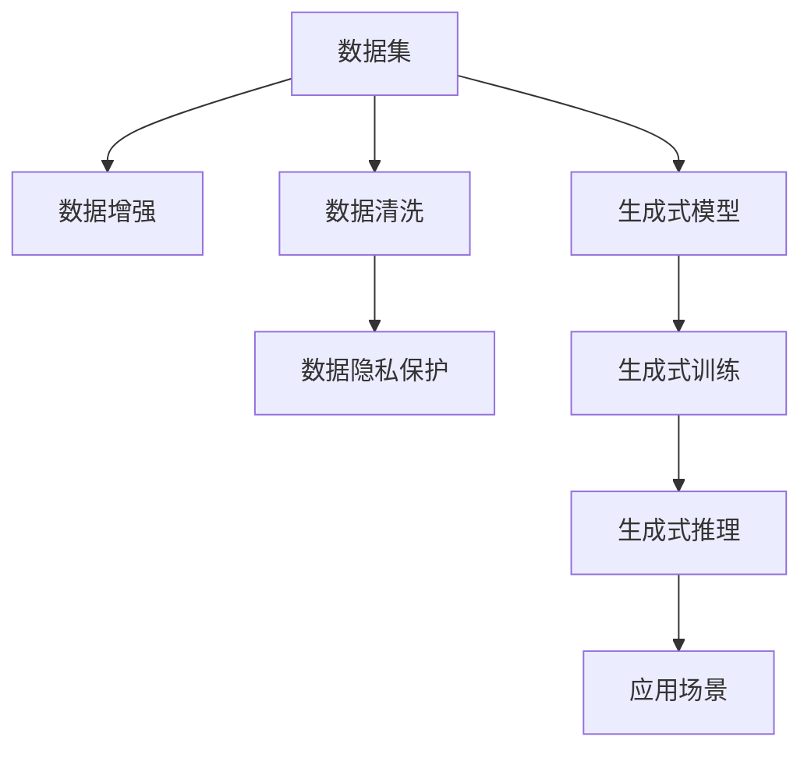

                 

# 生成式 AI：数据集的未来

> 关键词：生成式AI, 数据集, 自动化, 生成式模型, 数据驱动, 机器学习

## 1. 背景介绍

### 1.1 问题由来
随着深度学习技术的迅猛发展，生成式AI（Generative AI）已经成为人工智能领域的核心技术之一。生成式AI可以通过对大量数据的训练，生成符合特定规则或要求的文本、图像、音频等内容。然而，生成式AI的发展也伴随着数据集的问题。数据集是生成式AI的基础，其质量、规模和多样性直接影响模型的训练效果和应用效果。如何有效管理和利用数据集，成为生成式AI发展的一个关键挑战。

### 1.2 问题核心关键点
数据集在生成式AI中扮演着至关重要的角色，但其问题也尤为突出：

- **数据质量**：高质量的数据集是生成式AI训练的基础，但现实中往往存在标签错误、噪声污染等问题。
- **数据规模**：生成式AI需要大规模数据进行训练，但数据采集、标注等工作成本高昂。
- **数据多样性**：生成式AI需要覆盖广泛的数据分布，但不同场景下的数据多样性难以统一。
- **数据隐私**：生成式AI应用场景中的数据隐私保护，是保障数据使用的关键。

这些问题影响着生成式AI的性能、可靠性和可扩展性。因此，如何优化数据集，成为生成式AI发展的核心课题之一。

### 1.3 问题研究意义
优化数据集对生成式AI的发展至关重要，具有以下重要意义：

- **提升模型性能**：高质量、大规模、多样性的数据集有助于生成式AI训练出更精准、泛化能力更强的模型。
- **保障数据安全**：通过有效管理和利用数据集，保障生成式AI在数据隐私保护方面的合规性和安全性。
- **推动技术创新**：高质量数据集的提供，为生成式AI的创新和应用提供了坚实的基础。
- **加速产业化进程**：高效的数据集管理，可以显著降低生成式AI应用的开发成本，推动其规模化应用。

## 2. 核心概念与联系

### 2.1 核心概念概述

生成式AI是指通过深度学习模型生成新数据的AI技术。在生成式AI中，数据集是最基础且最重要的资源。数据集不仅决定了模型的训练效果，还对模型的生成能力和泛化能力有着重要影响。生成式AI涉及的核心概念包括：

- **数据集**：用于训练生成式模型的数据资源，包括图像、文本、音频等各类数据。
- **生成式模型**：能够从已有数据中学习生成新数据的模型，如生成对抗网络（GANs）、变分自编码器（VAEs）、语言模型等。
- **数据增强**：通过对已有数据进行变换、扩充等操作，生成新的训练样本，提高数据集的多样性和质量。
- **数据清洗**：对数据集进行预处理，去除噪声、标签错误等问题，提升数据集的质量。
- **数据隐私保护**：在数据集使用过程中，保障用户隐私和数据安全，防止数据泄露和滥用。

这些概念之间的逻辑关系可以通过以下Mermaid流程图来展示：



这个流程图展示了生成式AI的数据集管理流程：

1. 数据集通过数据增强和清洗，提升数据质量和多样性。
2. 生成式模型在清洗后的数据集上进行训练，学习生成新数据的能力。
3. 训练好的模型进行生成式推理，生成符合特定要求的新数据。
4. 生成式数据应用于各种场景，提升业务效率和用户体验。

## 3. 核心算法原理 & 具体操作步骤
### 3.1 算法原理概述

生成式AI的核心在于训练一个能够生成新数据的模型。生成式模型的训练需要大量高质量的数据集。数据集的质量和规模直接影响模型的生成效果。生成式AI的训练过程通常包括以下几个步骤：

1. **数据集准备**：收集、标注、预处理数据集，去除噪声和错误标签。
2. **数据增强**：通过各种变换操作，生成更多的训练样本，提升数据集的多样性和质量。
3. **模型训练**：使用生成式模型在处理后的数据集上进行训练，学习生成新数据的能力。
4. **生成式推理**：在训练好的模型上进行推理，生成符合特定要求的新数据。
5. **模型优化**：通过各种优化技术，提升模型的生成能力和泛化能力。

### 3.2 算法步骤详解

生成式AI的数据集管理流程如下：

**Step 1: 数据集准备**
- 收集数据：从公开数据集、网络爬虫等渠道获取数据。
- 数据标注：对数据进行人工标注或自动标注，生成标签。
- 数据预处理：进行数据清洗、归一化、降维等预处理，提升数据质量。

**Step 2: 数据增强**
- 扩充数据集：通过对已有数据进行翻转、旋转、裁剪等变换，生成新的训练样本。
- 生成对抗样本：使用对抗样本生成技术，生成扰动样本，提升模型的鲁棒性。
- 增加多样性：通过不同的变换方式，增加数据集的多样性，覆盖更多数据分布。

**Step 3: 模型训练**
- 选择模型：选择合适的生成式模型，如GANs、VAEs、语言模型等。
- 设定超参数：调整学习率、批大小、迭代次数等超参数，优化模型训练过程。
- 训练模型：在增强后的数据集上进行模型训练，学习生成新数据的能力。

**Step 4: 生成式推理**
- 推理生成：在训练好的模型上进行推理，生成符合特定要求的新数据。
- 后处理：对生成的数据进行后处理，如滤除噪声、调整格式等，确保数据质量。

**Step 5: 模型优化**
- 超参数调优：通过网格搜索、随机搜索等方式，寻找最优超参数组合。
- 模型评估：使用各种指标评估模型性能，如生成质量、多样性等。
- 迭代优化：根据评估结果，反复迭代优化模型和数据集，提升生成能力。

### 3.3 算法优缺点

生成式AI的数据集管理方法具有以下优点：

1. **提升数据质量**：数据增强和清洗技术可以显著提升数据集的质量，减少噪声和错误标签。
2. **增加数据多样性**：通过数据变换和扩充，生成更多的训练样本，提高数据集的多样性。
3. **降低数据标注成本**：数据增强可以在不增加标注成本的情况下，扩大数据集规模。
4. **提升模型生成能力**：高质量、大规模的数据集有助于训练出生成能力更强的模型。

然而，生成式AI的数据集管理方法也存在以下缺点：

1. **数据处理复杂**：数据清洗、增强等操作复杂，需要大量人工参与。
2. **计算资源消耗大**：大规模数据集的增强和模型训练，需要大量计算资源。
3. **数据隐私问题**：数据集的使用涉及隐私保护，需要严格遵守数据隐私法规。
4. **生成样本多样性有限**：数据集的多样性可能受限于数据采集方式，生成样本的多样性有限。

尽管存在这些缺点，但总体而言，生成式AI的数据集管理方法能够有效提升数据集的质量和多样性，推动生成式AI技术的进步。

### 3.4 算法应用领域

生成式AI的数据集管理方法在多个领域中得到了广泛应用：

- **计算机视觉**：用于图像生成、图像修复、图像超分辨率等任务。
- **自然语言处理**：用于文本生成、对话系统、机器翻译等任务。
- **音频处理**：用于音频生成、语音合成、音乐创作等任务。
- **推荐系统**：用于推荐生成、商品生成等任务。
- **游戏开发**：用于游戏场景生成、角色生成等任务。

## 4. 数学模型和公式 & 详细讲解  
### 4.1 数学模型构建

生成式AI的数据集管理涉及的数学模型包括：

- **生成式模型**：如GANs、VAEs等，用于生成新数据。
- **数据增强**：通过各种变换操作生成新的训练样本。
- **数据清洗**：去除噪声和错误标签，提升数据质量。
- **数据隐私保护**：使用差分隐私等技术，保障数据隐私。

### 4.2 公式推导过程

以GANs模型为例，其生成式训练过程涉及以下关键公式：

1. **生成器训练**：
$$
\theta_G = \mathop{\arg\min}_{\theta_G} D_{KL}(P_G||P_{real})
$$

其中 $P_G$ 为生成器的输出概率分布，$P_{real}$ 为真实数据的概率分布，$D_{KL}$ 为KL散度。

2. **判别器训练**：
$$
\theta_D = \mathop{\arg\min}_{\theta_D} D_{KL}(P_D||P_{real})
$$

其中 $P_D$ 为判别器的输出概率分布。

3. **联合训练**：
$$
\mathcal{L}_{total} = \mathcal{L}_G + \mathcal{L}_D
$$

其中 $\mathcal{L}_G$ 为生成器的损失函数，$\mathcal{L}_D$ 为判别器的损失函数。

这些公式展示了GANs模型在生成式训练中的关键步骤。通过这些公式，可以构建和训练生成式模型，生成新数据。

### 4.3 案例分析与讲解

以下以图像生成为例，介绍生成式AI的数据集管理流程：

**数据集准备**：
- 收集高质量的图像数据集，如CIFAR-10、ImageNet等。
- 进行图像标注，生成标签。
- 进行图像预处理，如归一化、裁剪等。

**数据增强**：
- 通过翻转、旋转、裁剪等操作，生成新的训练样本。
- 使用对抗样本生成技术，生成扰动样本。

**模型训练**：
- 使用GANs模型，选择适当的生成器和判别器网络。
- 设定超参数，如学习率、批大小等。
- 在增强后的数据集上进行模型训练，学习生成新图像的能力。

**生成式推理**：
- 在训练好的GANs模型上进行推理，生成新的图像。
- 对生成的图像进行后处理，如滤除噪声、调整格式等。

**模型优化**：
- 使用各种评估指标，如生成图像的清晰度、多样性等。
- 通过网格搜索、随机搜索等方式，寻找最优超参数组合。

通过以上步骤，可以构建高质量、多样性的数据集，并训练出能够生成符合特定要求的新图像的GANs模型。

## 5. 项目实践：代码实例和详细解释说明
### 5.1 开发环境搭建

在进行生成式AI的数据集管理实践前，需要先准备好开发环境。以下是使用Python进行PyTorch开发的环境配置流程：

1. 安装Anaconda：从官网下载并安装Anaconda，用于创建独立的Python环境。

2. 创建并激活虚拟环境：
```bash
conda create -n pytorch-env python=3.8 
conda activate pytorch-env
```

3. 安装PyTorch：根据CUDA版本，从官网获取对应的安装命令。例如：
```bash
conda install pytorch torchvision torchaudio cudatoolkit=11.1 -c pytorch -c conda-forge
```

4. 安装PyTorch Lightning：
```bash
pip install pytorch-lightning
```

5. 安装各类工具包：
```bash
pip install numpy pandas scikit-learn matplotlib tqdm jupyter notebook ipython
```

完成上述步骤后，即可在`pytorch-env`环境中开始生成式AI的数据集管理实践。

### 5.2 源代码详细实现

下面我们以GANs模型进行图像生成为例，给出使用PyTorch Lightning和PyTorch进行GANs模型训练和推理的代码实现。

首先，定义GANs模型的生成器和判别器：

```python
import torch
import torch.nn as nn
import torch.nn.functional as F

class Generator(nn.Module):
    def __init__(self, latent_dim, img_size):
        super(Generator, self).__init__()
        self.latent_dim = latent_dim
        self.img_size = img_size
        self.model = nn.Sequential(
            nn.Linear(latent_dim, 256),
            nn.LeakyReLU(0.2, inplace=True),
            nn.Linear(256, 256),
            nn.LeakyReLU(0.2, inplace=True),
            nn.Linear(256, 784),
            nn.Tanh()
        )
    
    def forward(self, x):
        return self.model(x)

class Discriminator(nn.Module):
    def __init__(self, img_size):
        super(Discriminator, self).__init__()
        self.img_size = img_size
        self.model = nn.Sequential(
            nn.Linear(784, 256),
            nn.LeakyReLU(0.2, inplace=True),
            nn.Linear(256, 1),
            nn.Sigmoid()
        )
    
    def forward(self, x):
        return self.model(x)
```

然后，定义GANs模型的训练函数：

```python
from torch.utils.data import DataLoader
from torch.optim import Adam
from torch.utils.tensorboard import SummaryWriter

def train_gan(generator, discriminator, dataloader, device, batch_size, n_epochs, lr_G=0.0002, lr_D=0.0002, beta1=0.5):
    n_critic = 5
    loss_G = torch.nn.MSELoss()
    loss_D = torch.nn.BCELoss()
    total_step = len(dataloader)
    writer = SummaryWriter()
    for epoch in range(n_epochs):
        for step, (x, _) in enumerate(dataloader):
            x = x.to(device)
            
            # 训练判别器
            D_real = discriminator(x)
            D_real_loss = loss_D(D_real, torch.ones_like(D_real))
            x_fake = generator(x)
            D_fake = discriminator(x_fake)
            D_fake_loss = loss_D(D_fake, torch.zeros_like(D_fake))
            D_loss = (D_real_loss + D_fake_loss) / 2
            
            D_optimizer.zero_grad()
            D_loss.backward()
            D_optimizer.step()
            
            # 训练生成器
            x_fake = generator(x)
            D_fake = discriminator(x_fake)
            G_loss = loss_G(D_fake, torch.ones_like(D_fake))
            
            G_optimizer.zero_grad()
            G_loss.backward()
            G_optimizer.step()
            
            # 记录损失
            if step % 100 == 0:
                print(f'Epoch {epoch+1}, Step {step+1}/{total_step}, D_loss: {D_loss.item():.4f}, G_loss: {G_loss.item():.4f}')
            
            # 可视化
            writer.add_scalar('D_loss', D_loss.item(), step)
            writer.add_scalar('G_loss', G_loss.item(), step)
```

最后，启动GANs模型的训练流程，并可视化训练过程中的损失值：

```python
generator = Generator(latent_dim=100, img_size=784)
discriminator = Discriminator(img_size=784)
dataloader = DataLoader(dataloader, batch_size=batch_size, shuffle=True, device=device)
device = torch.device('cuda') if torch.cuda.is_available() else torch.device('cpu')
train_gan(generator, discriminator, dataloader, device, batch_size, n_epochs, lr_G, lr_D, beta1)
```

以上就是使用PyTorch Lightning和PyTorch进行GANs模型训练的完整代码实现。可以看到，通过PyTorch Lightning，我们可以更简洁地实现GANs模型的训练，同时利用TensorBoard进行损失可视化，方便调试和优化。

### 5.3 代码解读与分析

让我们再详细解读一下关键代码的实现细节：

**Generator类**：
- `__init__`方法：初始化生成器的输入维度、输出维度和模型结构。
- `forward`方法：定义生成器的前向传播过程，将噪声向量输入生成器，生成新的图像。

**Discriminator类**：
- `__init__`方法：初始化判别器的输入维度、输出维度和模型结构。
- `forward`方法：定义判别器的前向传播过程，将输入图像判别为真实或生成。

**train_gan函数**：
- 定义训练过程中的损失函数、优化器和超参数。
- 在每个epoch内，交替训练判别器和生成器，记录损失值。
- 使用TensorBoard可视化损失曲线。

通过以上步骤，可以构建和训练GANs模型，生成符合特定要求的新图像。

## 6. 实际应用场景
### 6.1 图像生成

GANs模型在图像生成领域有着广泛应用。通过GANs模型，可以从噪声向量生成逼真的图像，广泛应用于图像修复、超分辨率、艺术创作等场景。

在实际应用中，GANs模型可以通过以下方式提升图像生成效果：

- **数据增强**：通过生成对抗样本，增加数据集的多样性，提升模型泛化能力。
- **超参数调优**：通过网格搜索、随机搜索等方式，寻找最优超参数组合，提升模型生成质量。
- **模型集成**：通过集成多个GANs模型，提升生成图像的稳定性和多样性。

### 6.2 文本生成

生成式AI在文本生成领域也有着广泛应用。通过语言模型，可以从输入文本生成新的文本，广泛应用于机器翻译、文本摘要、对话系统等场景。

在实际应用中，生成式AI可以通过以下方式提升文本生成效果：

- **数据增强**：通过数据清洗和扩充，提升数据集的质量和多样性。
- **生成对抗训练**：使用对抗样本生成技术，生成扰动样本，提升模型的鲁棒性和生成质量。
- **模型优化**：通过各种优化技术，提升模型的生成能力和泛化能力。

### 6.3 音频生成

生成式AI在音频生成领域也有着广泛应用。通过生成对抗网络，可以从噪声向量生成逼真的音频，广泛应用于音乐创作、语音合成等场景。

在实际应用中，生成式AI可以通过以下方式提升音频生成效果：

- **数据增强**：通过生成对抗样本，增加数据集的多样性，提升模型泛化能力。
- **超参数调优**：通过网格搜索、随机搜索等方式，寻找最优超参数组合，提升模型生成质量。
- **模型集成**：通过集成多个生成式模型，提升生成音频的稳定性和多样性。

## 7. 工具和资源推荐
### 7.1 学习资源推荐

为了帮助开发者系统掌握生成式AI的数据集管理理论基础和实践技巧，这里推荐一些优质的学习资源：

1. 《Generative Adversarial Networks: Training GANs for Researchers》系列博文：由大模型技术专家撰写，深入浅出地介绍了GANs模型的原理和实践方法。

2. CS231n《Convolutional Neural Networks for Visual Recognition》课程：斯坦福大学开设的计算机视觉经典课程，详细讲解了生成对抗网络等前沿技术。

3. 《Generative Models in Reinforcement Learning》书籍：介绍了生成模型在强化学习中的应用，包括生成对抗网络、变分自编码器等。

4. HuggingFace官方文档：提供丰富的生成式AI资源，包括模型实现、微调样例等，是学习生成式AI的重要资料。

5. PapersWithCode：汇聚生成式AI领域的最新研究成果，提供丰富的论文和代码实现，是学术研究的必备工具。

通过对这些资源的学习实践，相信你一定能够快速掌握生成式AI的数据集管理精髓，并用于解决实际的NLP问题。

### 7.2 开发工具推荐

高效的开发离不开优秀的工具支持。以下是几款用于生成式AI开发和训练的工具：

1. PyTorch：基于Python的开源深度学习框架，灵活的动态计算图，适合快速迭代研究。

2. TensorFlow：由Google主导开发的开源深度学习框架，生产部署方便，适合大规模工程应用。

3. PyTorch Lightning：基于PyTorch的模型训练框架，支持自动化的超参数调优和模型保存，简化模型训练过程。

4. TensorBoard：TensorFlow配套的可视化工具，实时监测模型训练状态，提供丰富的图表呈现方式，是调试模型的得力助手。

5. Weights & Biases：模型训练的实验跟踪工具，可以记录和可视化模型训练过程中的各项指标，方便对比和调优。

6. Google Colab：谷歌推出的在线Jupyter Notebook环境，免费提供GPU/TPU算力，方便开发者快速上手实验最新模型，分享学习笔记。

合理利用这些工具，可以显著提升生成式AI的开发效率，加快创新迭代的步伐。

### 7.3 相关论文推荐

生成式AI的发展源于学界的持续研究。以下是几篇奠基性的相关论文，推荐阅读：

1. Generative Adversarial Nets（即GANs原论文）：提出了生成对抗网络，开创了生成式AI的新时代。

2. Image-to-Image Translation with Conditional Adversarial Networks：提出条件生成对抗网络，提升了生成图像的质量和多样性。

3. InfoGAN: Interpretable Representation Learning by Information Maximizing Generative Adversarial Nets：提出InfoGAN模型，生成图像更加符合人类视觉习惯。

4. Denoising Autoencoders with AdaBoost Regularization for Image-Driven Manifold Learning：提出噪声自编码器，提升了生成对抗网络的学习效率和生成效果。

5. Lossy and Lossless Generative Image Models from Learned Density Estimators：提出变分自编码器，生成图像具有更高的生成质量和多样性。

这些论文代表了大模型生成式AI的发展脉络。通过学习这些前沿成果，可以帮助研究者把握学科前进方向，激发更多的创新灵感。

## 8. 总结：未来发展趋势与挑战

### 8.1 总结

本文对生成式AI的数据集管理方法进行了全面系统的介绍。首先阐述了生成式AI的背景和数据集的重要性，明确了数据集在生成式AI训练中的基础作用。其次，从原理到实践，详细讲解了生成式AI的数据集管理流程，包括数据集准备、数据增强、模型训练、生成式推理和模型优化等关键步骤。同时，本文还广泛探讨了生成式AI在图像生成、文本生成、音频生成等多个领域的应用前景，展示了生成式AI技术的巨大潜力。最后，本文精选了生成式AI的相关学习资源和开发工具，力求为读者提供全方位的技术指引。

通过本文的系统梳理，可以看到，生成式AI的数据集管理方法在大规模、高质量数据的支持下，能够显著提升生成式模型的生成能力和泛化能力，推动生成式AI技术的进步。未来，随着数据集的多样性和质量的提升，生成式AI将有望在更多领域取得突破，为人类社会带来更多创新和变革。

### 8.2 未来发展趋势

展望未来，生成式AI的数据集管理技术将呈现以下几个发展趋势：

1. **数据集的自动化采集与标注**：通过自动化工具和算法，自动收集和标注数据，减少人力成本。

2. **数据集的多源融合**：通过多源数据融合技术，提升数据集的多样性和泛化能力。

3. **数据集的持续更新与维护**：通过持续更新数据集，保持其与现实世界的紧密联系，提升生成式模型的时效性和适应性。

4. **数据集的安全与隐私保护**：通过差分隐私、联邦学习等技术，保障数据集的安全和隐私，防止数据泄露和滥用。

5. **数据集的实时生成与处理**：通过流式数据处理技术，实时生成和处理数据集，提升生成式模型的响应速度和稳定性。

以上趋势凸显了生成式AI的数据集管理技术的广阔前景。这些方向的探索发展，必将进一步提升生成式AI的性能和应用范围，为人工智能技术的普及和应用提供坚实的基础。

### 8.3 面临的挑战

尽管生成式AI的数据集管理技术已经取得了显著进展，但在实现其理想应用的过程中，仍面临诸多挑战：

1. **数据质量问题**：高质量数据集的获取成本高昂，数据集的多样性和泛化能力有限，生成式模型的泛化性能受限。

2. **数据隐私问题**：数据集的使用涉及隐私保护，需要严格遵守数据隐私法规，防止数据泄露和滥用。

3. **计算资源消耗大**：生成式模型的训练和推理需要大量计算资源，对硬件设备要求高。

4. **生成样本的多样性有限**：数据集的多样性可能受限于数据采集方式，生成样本的多样性有限。

5. **模型的鲁棒性和稳定性不足**：生成式模型的鲁棒性和稳定性问题亟待解决，防止模型生成误导性信息。

尽管存在这些挑战，但总体而言，生成式AI的数据集管理技术在提升生成式模型的生成能力和泛化能力方面具有重要价值。未来，需要继续探索更高效、更安全、更可靠的数据集管理方法，推动生成式AI技术的发展。

### 8.4 研究展望

面对生成式AI数据集管理面临的挑战，未来的研究需要在以下几个方面寻求新的突破：

1. **数据集自动化生成与标注**：探索自动化的数据集生成和标注方法，减少人工成本，提升数据集的质量和多样性。

2. **多源数据融合技术**：研究多源数据融合技术，提升数据集的多样性和泛化能力，增强生成式模型的泛化性能。

3. **差分隐私与联邦学习**：探索差分隐私和联邦学习技术，保障数据集的安全和隐私，防止数据泄露和滥用。

4. **实时数据生成与处理**：研究流式数据处理技术，实时生成和处理数据集，提升生成式模型的响应速度和稳定性。

5. **模型鲁棒性与稳定性**：研究生成式模型的鲁棒性和稳定性问题，防止模型生成误导性信息，提升生成式模型的可信度。

这些研究方向的探索，必将引领生成式AI数据集管理技术迈向更高的台阶，为生成式AI技术的普及和应用提供坚实的基础。面向未来，生成式AI的数据集管理技术还需要与其他人工智能技术进行更深入的融合，如知识表示、因果推理、强化学习等，多路径协同发力，共同推动生成式AI技术的进步。只有勇于创新、敢于突破，才能不断拓展生成式AI的边界，让生成式AI技术更好地造福人类社会。

## 9. 附录：常见问题与解答

**Q1：生成式AI的数据集管理是否适用于所有生成式任务？**

A: 生成式AI的数据集管理在大多数生成式任务上都能取得不错的效果，特别是对于数据量较小的任务。但对于一些特定领域的任务，如医学、法律等，仅依靠通用语料预训练的模型可能难以很好地适应。此时需要在特定领域语料上进一步预训练，再进行微调，才能获得理想效果。此外，对于一些需要时效性、个性化很强的任务，如对话、推荐等，数据集管理方法也需要针对性的改进优化。

**Q2：如何选择数据集管理工具？**

A: 生成式AI的数据集管理涉及多个环节，包括数据清洗、数据增强、模型训练等。选择合适的工具可以提高数据集管理的效率和质量。以下是一些常用的工具推荐：

1. PyTorch Lightning：适合模型训练和超参数调优，支持自动化的模型保存和可视化。

2. TensorBoard：适用于模型训练和可视化，实时监测模型训练状态，提供丰富的图表呈现方式。

3. Weights & Biases：支持实验跟踪和超参数调优，记录和可视化模型训练过程中的各项指标，方便对比和调优。

4. HuggingFace官方文档：提供丰富的生成式AI资源，包括模型实现、微调样例等，是学习生成式AI的重要资料。

5. PapersWithCode：汇聚生成式AI领域的最新研究成果，提供丰富的论文和代码实现，是学术研究的必备工具。

合理利用这些工具，可以显著提升生成式AI的数据集管理效率，加快创新迭代的步伐。

**Q3：数据集管理过程中需要注意哪些问题？**

A: 数据集管理过程中需要注意以下问题：

1. **数据质量**：高质量的数据集是生成式AI训练的基础，但现实中往往存在标签错误、噪声污染等问题，需要严格的数据清洗和预处理。

2. **数据规模**：生成式AI需要大规模数据进行训练，但数据采集、标注等工作成本高昂，需要探索高效的数据采集和标注方法。

3. **数据隐私**：数据集的使用涉及隐私保护，需要严格遵守数据隐私法规，防止数据泄露和滥用。

4. **生成样本的多样性**：数据集的多样性可能受限于数据采集方式，生成样本的多样性有限，需要探索多源数据融合技术。

5. **计算资源消耗**：生成式模型的训练和推理需要大量计算资源，对硬件设备要求高，需要探索高效的计算资源利用方法。

正视数据集管理面临的这些挑战，积极应对并寻求突破，将是生成式AI数据集管理技术迈向成熟的必由之路。相信随着学界和产业界的共同努力，这些挑战终将一一被克服，生成式AI数据集管理必将在构建人机协同的智能时代中扮演越来越重要的角色。

---

作者：禅与计算机程序设计艺术 / Zen and the Art of Computer Programming

