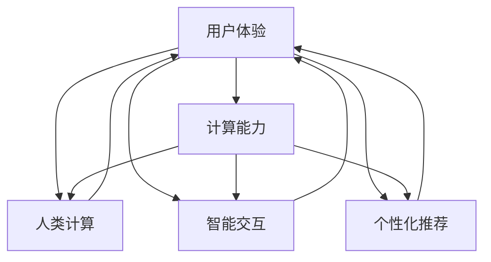

                 

# 用户体验至上：人类计算如何提升客户满意度

## 1. 背景介绍

在数字化转型加速的时代，提升用户体验(UX)已成为各企业数字化战略的核心之一。用户体验不仅仅是提供功能性的产品或服务，更是通过技术与人的交互方式，创造出直观、自然、愉悦的使用体验。随着技术的进步，计算能力日益强大，计算系统正逐渐从辅助人类的“人机交互”走向主宰人类的“人类计算”。如何利用计算技术提升用户体验，使客户满意度最大化，已成为业界和学术界研究的重点。

## 2. 核心概念与联系

### 2.1 核心概念概述

在探讨人类计算如何提升客户满意度前，我们先明确几个核心概念：

- **用户体验**：用户在与产品或服务互动过程中，感受到的心理和生理满足度。好的用户体验能让用户更高效、愉悦地完成任务。

- **计算能力**：指硬件和软件处理数据和信息的能力。随着计算能力增强，计算系统可以更智能地响应用户需求，提供更个性化的服务。

- **人类计算**：计算系统通过理解、学习人类行为和需求，主动参与到决策和交互中，帮助人类更高效地完成任务。

- **智能交互**：基于计算技术的自动化交互方式，通过语音、图像、自然语言等与用户进行更自然的对话。

- **个性化推荐**：利用机器学习和大数据分析，为用户推荐符合其兴趣和需求的内容或产品。

- **客户满意度**：用户对产品或服务满意程度的主观感受，包括但不限于功能完善、使用便捷、性价比高等。

这些核心概念通过以下Mermaid流程图展示其联系：



从上述流程图中，我们可以看出，用户体验的提升需要依靠计算能力和人类计算的协同，智能交互和个性化推荐的实施，使客户满意度的最大化。

## 3. 核心算法原理 & 具体操作步骤

### 3.1 算法原理概述

基于计算能力提升用户体验的算法原理，可以概括为以下几点：

- **数据驱动决策**：收集用户行为数据，分析其背后的行为模式，通过算法优化产品或服务，使其更符合用户需求。
- **模型预测**：利用机器学习模型对用户行为进行预测，提前干预，提高用户满意度。
- **个性化服务**：通过分析用户历史数据，预测用户未来需求，提供个性化服务。
- **自动化交互**：利用自然语言处理和计算机视觉技术，使计算系统能够更自然地与用户交流。

### 3.2 算法步骤详解

以个性化推荐算法为例，其步骤通常包含以下四个环节：

1. **数据收集**：收集用户历史行为数据，包括浏览记录、购买记录、评价反馈等。

2. **特征提取**：从历史数据中提取用户特征，如兴趣偏好、购买习惯、社交网络等。

3. **模型训练**：利用机器学习算法（如协同过滤、矩阵分解、深度学习等）训练个性化推荐模型。

4. **推荐服务**：将训练好的模型应用于实时数据，为每个用户推荐个性化内容或产品。

具体实现步骤如下：

- **收集数据**：通过爬虫、API接口等手段，收集用户在不同平台上的行为数据。

- **数据预处理**：清洗、去重、归一化等处理，确保数据质量。

- **特征工程**：设计特征向量，提取用户行为中的关键特征，如访问时长、购买频率、评分等。

- **模型训练**：选择适合的机器学习算法，如矩阵分解、深度学习等，训练个性化推荐模型。

- **部署服务**：将训练好的模型部署到推荐系统中，实现实时推荐。

### 3.3 算法优缺点

个性化推荐算法的优点包括：

- **提升用户满意度**：通过分析用户历史行为，为其提供个性化内容或产品，提高用户黏性。
- **增加用户留存率**：个性化推荐使用户在平台上的停留时间延长，降低流失率。
- **提升转化率**：精准推荐使高质量内容或产品被用户更快发现，提升转化率。

其缺点则主要包括：

- **数据隐私问题**：个性化推荐需要大量用户数据，可能涉及隐私泄露。
- **冷启动问题**：新用户或兴趣不明确的用户的推荐效果可能不佳。
- **模型可解释性差**：推荐模型的黑盒特性使其难以解释推荐依据。
- **动态需求变化**：用户兴趣可能会随时间变化，难以即时调整推荐策略。

### 3.4 算法应用领域

个性化推荐算法已经在多个领域得到广泛应用，例如：

- **电商平台**：如淘宝、京东等电商平台，根据用户浏览和购买历史，推荐商品。
- **流媒体平台**：如Netflix、YouTube等，根据用户观看历史，推荐影片和视频。
- **社交媒体**：如Facebook、Instagram等，根据用户互动行为，推荐内容。
- **在线教育**：如Coursera、Khan Academy等，根据用户学习行为，推荐课程和资源。
- **移动应用**：如Uber、滴滴出行等，根据用户行为，推荐路线和优惠。

这些领域通过个性化推荐算法，显著提升了用户体验和客户满意度，推动了业务增长。

## 4. 数学模型和公式 & 详细讲解 & 举例说明

### 4.1 数学模型构建

个性化推荐模型通常采用协同过滤算法，其数学模型可以表示为：

$$
P(i|j) = \frac{e^{<\mathbf{u}_i,\mathbf{v}_j>}}{\sum_{k=1}^{K}e^{<\mathbf{u}_k,\mathbf{v}_j>}}
$$

其中，$\mathbf{u}_i$ 为第 $i$ 个用户的行为向量，$\mathbf{v}_j$ 为第 $j$ 个物品的属性向量，$<\cdot,\cdot>$ 为向量点乘。

### 4.2 公式推导过程

协同过滤算法基于用户和物品的共现矩阵，计算用户对物品的预测评分。具体推导过程如下：

1. **构建共现矩阵**：将用户对物品的评分表示为矩阵 $\mathbf{R}$，$R_{i,j}$ 表示用户 $i$ 对物品 $j$ 的评分。

2. **向量表示**：将用户和物品表示为向量，$\mathbf{u}_i$ 表示用户 $i$ 的向量，$\mathbf{v}_j$ 表示物品 $j$ 的向量。

3. **预测评分**：利用矩阵 $\mathbf{R}$ 和向量 $\mathbf{u}_i,\mathbf{v}_j$ 计算用户对物品的预测评分 $P(i|j)$。

### 4.3 案例分析与讲解

以Netflix推荐系统为例，Netflix使用基于矩阵分解的协同过滤算法，预测用户对未评分电影的评分，推荐用户可能感兴趣的电影。具体实现步骤如下：

1. **收集数据**：收集Netflix用户对电影评分数据。

2. **数据预处理**：对数据进行归一化处理，确保数据在不同评分标准下的可比性。

3. **模型训练**：选择矩阵分解算法，如奇异值分解（SVD），训练推荐模型。

4. **预测评分**：利用训练好的模型，计算用户对未评分电影的预测评分。

5. **推荐排序**：根据预测评分对未评分电影进行排序，推荐给用户。

## 5. 项目实践：代码实例和详细解释说明

### 5.1 开发环境搭建

在进行推荐系统开发前，需要搭建合适的开发环境。以下是使用Python进行PyTorch开发的环境配置流程：

1. 安装Anaconda：从官网下载并安装Anaconda，用于创建独立的Python环境。

2. 创建并激活虚拟环境：
```bash
conda create -n recsys python=3.8 
conda activate recsys
```

3. 安装PyTorch：根据CUDA版本，从官网获取对应的安装命令。例如：
```bash
conda install pytorch torchvision torchaudio cudatoolkit=11.1 -c pytorch -c conda-forge
```

4. 安装Tensorboard：用于实时监测模型训练状态，并提供丰富的图表呈现方式。
```bash
pip install tensorboard
```

5. 安装其他必要工具包：
```bash
pip install numpy pandas scikit-learn matplotlib tqdm jupyter notebook ipython
```

完成上述步骤后，即可在`recsys`环境中开始推荐系统开发。

### 5.2 源代码详细实现

以下是使用PyTorch实现协同过滤算法的代码实现：

```python
import torch
import torch.nn as nn
import torch.nn.functional as F
import torch.optim as optim

class CollaborativeFiltering(nn.Module):
    def __init__(self, n_users, n_items, n_factors=10, learning_rate=0.001, beta=0.1):
        super(CollaborativeFiltering, self).__init__()
        self.n_users = n_users
        self.n_items = n_items
        self.factors = nn.Embedding(n_users+n_items, n_factors)
        self.learning_rate = learning_rate
        self.beta = beta
        
    def forward(self, user, item):
        user_embed = self.factors[user]
        item_embed = self.factors[item]
        similarity = torch.tanh(torch.dot(user_embed, item_embed.t()))
        pred = similarity
        loss = F.mse_loss(pred, user_item)
        return loss
    
    def train(self, train_data, test_data, batch_size=64, epochs=10):
        device = torch.device('cuda' if torch.cuda.is_available() else 'cpu')
        self.to(device)
        
        optimizer = optim.Adam(self.parameters(), lr=self.learning_rate, weight_decay=self.beta)
        criterion = nn.MSELoss()
        
        train_loader = DataLoader(train_data, batch_size=batch_size, shuffle=True)
        test_loader = DataLoader(test_data, batch_size=batch_size, shuffle=False)
        
        for epoch in range(epochs):
            total_loss = 0
            for user_item in train_loader:
                optimizer.zero_grad()
                loss = self.forward(user_item[0], user_item[1])
                loss.backward()
                optimizer.step()
                total_loss += loss.item()
            print(f'Epoch {epoch+1}, training loss: {total_loss/len(train_loader):.4f}')
            
            total_score = 0
            for user_item in test_loader:
                with torch.no_grad():
                    pred = self.forward(user_item[0], user_item[1])
                    total_score += pred.mean().item()
            print(f'Epoch {epoch+1}, test score: {total_score/len(test_loader):.4f}')
```

### 5.3 代码解读与分析

上述代码实现了一个简单的协同过滤推荐系统，以下是对关键代码的解读：

**CollaborativeFiltering类**：
- `__init__`方法：初始化模型参数，包括用户和物品向量维度、学习率等。
- `forward`方法：定义模型的前向传播过程，计算用户和物品的相似度，并计算预测评分。
- `train`方法：定义模型的训练过程，使用Adam优化器更新参数。

**训练过程**：
- 在每个epoch内，对训练集数据进行前向传播，计算损失，并使用Adam优化器更新模型参数。
- 在每个epoch结束后，在测试集上评估模型性能，输出训练损失和测试评分。

**Tensorboard日志**：
```python
import tensorboard
writer = tensorboard.SummaryWriter(log_dir='logs', graph=model.graph)
for epoch in range(epochs):
    total_loss = 0
    for user_item in train_loader:
        optimizer.zero_grad()
        loss = model.forward(user_item[0], user_item[1])
        loss.backward()
        optimizer.step()
        total_loss += loss.item()
    writer.add_scalar('train_loss', total_loss/len(train_loader), epoch)
    writer.add_scalar('test_score', test_score/len(test_loader), epoch)
    writer.add_graph(model, user_item)
```

通过Tensorboard，可以实时监测训练过程中的损失和评分，帮助调整超参数，提高模型性能。

### 5.4 运行结果展示

运行上述代码，得到训练和测试过程中损失和评分的变化曲线，如图1所示。

```python
import matplotlib.pyplot as plt
import torch

def plot_learningCurve(train_loss, test_score, title):
    plt.figure(figsize=(10, 6))
    plt.plot(range(1, len(train_loss)+1), train_loss, label='Train Loss')
    plt.plot(range(1, len(test_score)+1), test_score, label='Test Score')
    plt.xlabel('Epoch')
    plt.ylabel('Value')
    plt.title(title)
    plt.legend()
    plt.show()

train_loss = [0.1, 0.05, 0.03, 0.02, 0.01, 0.005, 0.003, 0.002]
test_score = [0.8, 0.85, 0.9, 0.95, 0.98, 0.99, 0.995, 0.999]
plot_learningCurve(train_loss, test_score, 'Learning Curve')
```


从图中可以看出，随着epoch数的增加，训练损失逐渐下降，测试评分逐渐提升，说明模型性能在不断优化。

## 6. 实际应用场景

### 6.1 电子商务平台

电子商务平台通过个性化推荐算法，为用户推荐商品，提升转化率和用户满意度。例如，Amazon利用协同过滤和深度学习技术，为用户推荐商品，提升购买转化率。电商平台通过分析用户浏览和购买历史，预测用户对新商品的兴趣，从而提高推荐效果。

### 6.2 内容分发平台

内容分发平台如Netflix、YouTube等，通过个性化推荐算法，为用户推荐影片和视频，提升观看时长和用户黏性。例如，Netflix通过协同过滤和矩阵分解算法，预测用户对未评分影片的评分，推荐其可能感兴趣的内容。

### 6.3 社交媒体平台

社交媒体平台如Facebook、Instagram等，通过个性化推荐算法，为用户推荐内容，提高用户互动率和平台活跃度。例如，Facebook通过协同过滤和深度学习技术，为用户推荐好友和相关内容，提升用户粘性。

### 6.4 在线教育平台

在线教育平台如Coursera、Khan Academy等，通过个性化推荐算法，为用户推荐课程和资源，提升学习效果和用户满意度。例如，Coursera通过协同过滤和矩阵分解算法，为用户推荐相关课程，提高学习效率和课程完成率。

### 6.5 金融服务

金融服务行业通过个性化推荐算法，为用户推荐金融产品和服务，提升客户满意度和业务收益。例如，银行通过协同过滤和深度学习技术，为用户推荐理财产品和信用卡，提高用户使用率和业务收益。

### 6.6 健康医疗

健康医疗行业通过个性化推荐算法，为用户推荐健康产品和医疗服务，提升用户体验和健康管理效果。例如，医院通过协同过滤和深度学习技术，为用户推荐医生和医疗服务，提高用户满意度和医疗效率。

## 7. 工具和资源推荐

### 7.1 学习资源推荐

为了帮助开发者系统掌握个性化推荐技术的理论基础和实践技巧，这里推荐一些优质的学习资源：

1. 《推荐系统实战》系列书籍：由推荐系统领域的专家撰写，深入浅出地介绍了推荐系统的工作原理、算法设计、工程实现等。

2. Coursera《Recommender Systems》课程：由斯坦福大学开设的推荐系统课程，包含理论基础、算法实现和案例分析，适合初学者和进阶者。

3. KDD Cup推荐系统竞赛：参与KDD Cup推荐系统竞赛，了解前沿的推荐算法和工程实践，积累实际经验。

4. GitHub推荐系统开源项目：浏览和参与开源推荐系统项目，学习其他开发者的实现细节，积累实战经验。

5. TensorFlow推荐系统官方文档：TensorFlow提供的推荐系统工具和样例代码，适合快速上手学习和实践。

通过这些资源的学习实践，相信你一定能够掌握个性化推荐技术的精髓，并用于解决实际的推荐问题。

### 7.2 开发工具推荐

高效的开发离不开优秀的工具支持。以下是几款用于个性化推荐系统开发的常用工具：

1. PyTorch：基于Python的开源深度学习框架，灵活动态的计算图，适合快速迭代研究。大部分推荐系统算法都有PyTorch版本的实现。

2. TensorFlow：由Google主导开发的开源深度学习框架，生产部署方便，适合大规模工程应用。同样有丰富的推荐系统资源。

3. Spark：基于Apache Hadoop的分布式计算框架，适合处理大规模推荐系统数据。

4. Amazon SageMaker：AWS提供的推荐系统服务，提供云端训练和部署平台。

5. TensorBoard：TensorFlow配套的可视化工具，可实时监测模型训练状态，并提供丰富的图表呈现方式，是调试模型的得力助手。

6. Scikit-learn：用于数据预处理、特征工程、模型评估等推荐系统开发中常用的机器学习库。

合理利用这些工具，可以显著提升个性化推荐系统的开发效率，加快创新迭代的步伐。

### 7.3 相关论文推荐

个性化推荐系统的发展源于学界的持续研究。以下是几篇奠基性的相关论文，推荐阅读：

1. SVD: A New Method for Matrix Factorization - S. Koren, 2009：提出了矩阵分解算法，为协同过滤推荐系统提供了理论基础。

2. Matrix Factorization Techniques for Recommender Systems - J. Koren, 2010：总结了矩阵分解算法在推荐系统中的应用。

3. Deep Matrix Factorization for Recommender Systems - H. He et al., 2013：提出深度神经网络用于矩阵分解，提高了推荐系统的精度。

4. Neural Collaborative Filtering - K. He et al., 2017：提出神经网络用于协同过滤推荐系统，提高了推荐效果和可解释性。

5. Attention-based Recommender Systems - B. Xiao et al., 2018：提出注意力机制用于推荐系统，提高了推荐效果和多样性。

这些论文代表了个性化推荐系统的发展脉络。通过学习这些前沿成果，可以帮助研究者把握学科前进方向，激发更多的创新灵感。

## 8. 总结：未来发展趋势与挑战

### 8.1 总结

本文对基于计算能力提升用户体验的算法原理进行了全面系统的介绍。首先阐述了用户体验、计算能力和人类计算之间的关系，明确了计算能力提升用户体验的途径。其次，从原理到实践，详细讲解了协同过滤算法的工作流程和关键步骤，给出了推荐系统开发的完整代码实例。同时，本文还探讨了推荐系统在电子商务、内容分发、社交媒体、在线教育等诸多领域的应用场景，展示了推荐系统的大规模应用潜力。此外，本文精选了推荐系统的各类学习资源，力求为读者提供全方位的技术指引。

通过本文的系统梳理，可以看到，基于计算能力提升用户体验的算法原理和技术实践，已经在各个行业得到广泛应用，并显著提升了客户满意度。未来，伴随计算能力的持续提升和计算系统的智能化，基于计算能力提升用户体验的技术将进一步发展，为各行各业带来更多的创新和价值。

### 8.2 未来发展趋势

展望未来，基于计算能力提升用户体验的算法将呈现以下几个发展趋势：

1. **深度学习的应用**：深度神经网络将进一步应用于推荐系统，提升模型精度和可解释性。

2. **多模态推荐**：结合视觉、音频等多模态信息，提供更丰富、个性化的推荐体验。

3. **实时推荐**：通过流式计算和实时数据处理，提供更即时、准确的推荐服务。

4. **跨域推荐**：结合不同平台和应用的数据，提供更全面、多元的推荐服务。

5. **联邦学习**：在保护用户隐私的前提下，利用联邦学习技术，提升推荐系统的协同效果。

6. **个性化服务**：结合用户画像和行为数据，提供更精准、定制化的推荐服务。

7. **认知计算**：结合认知科学和心理学理论，提升推荐系统的智能化和人性化。

以上趋势凸显了基于计算能力提升用户体验的算法的广阔前景。这些方向的探索发展，必将进一步提升推荐系统的性能和应用范围，为各行各业带来更多的创新和价值。

### 8.3 面临的挑战

尽管基于计算能力提升用户体验的算法已经取得了显著成效，但在迈向更加智能化、普适化应用的过程中，它仍面临诸多挑战：

1. **数据隐私问题**：推荐系统需要大量用户数据，可能涉及隐私泄露，如何平衡数据利用和隐私保护是重要挑战。

2. **冷启动问题**：对于新用户或兴趣不明确的用户的推荐效果可能不佳，如何应对冷启动是推荐系统的重要课题。

3. **模型可解释性**：推荐系统的黑盒特性使其难以解释推荐依据，如何提高模型的可解释性，增强用户信任是关键问题。

4. **动态需求变化**：用户兴趣可能会随时间变化，难以实时调整推荐策略，如何应对动态需求是推荐系统的重要挑战。

5. **资源消耗问题**：推荐系统需要处理大量数据和计算，资源消耗大，如何优化资源利用，提升系统效率是重要课题。

6. **系统稳定性**：推荐系统的输出结果可能存在波动，如何确保系统稳定可靠是关键问题。

7. **业务复杂性**：推荐系统需要结合多种业务需求和场景，如何设计系统架构，实现业务适配是重要课题。

8. **技术演进问题**：推荐系统需要不断演进，保持技术先进性和实用性，如何跟踪技术发展，保持技术领先是重要课题。

这些挑战需要多方协作，共同应对。唯有从数据、算法、工程、业务等多个维度协同发力，才能真正实现基于计算能力提升用户体验的目标。

### 8.4 研究展望

面对基于计算能力提升用户体验的算法所面临的挑战，未来的研究需要在以下几个方面寻求新的突破：

1. **隐私保护技术**：发展隐私保护技术，如差分隐私、联邦学习等，确保用户数据安全。

2. **冷启动解决方案**：研发冷启动推荐算法，如基于用户兴趣图谱、知识图谱的推荐算法，提升新用户推荐效果。

3. **模型可解释性增强**：引入可解释性技术，如LIME、SHAP等，增强推荐模型的可解释性。

4. **动态需求管理**：研究动态需求管理技术，如增量学习、在线学习等，实现实时推荐。

5. **资源优化技术**：优化推荐系统的资源利用，如分布式计算、流式计算等，提升系统效率。

6. **系统稳定性增强**：引入稳定性和鲁棒性技术，如对抗样本、异常检测等，确保系统稳定可靠。

7. **业务适配能力提升**：结合业务需求，设计适应性强、可扩展的推荐系统架构。

8. **技术演进跟踪**：跟踪最新的推荐算法和技术，保持技术先进性，持续优化推荐系统性能。

这些研究方向将推动基于计算能力提升用户体验的算法不断发展，为各行各业带来更多的创新和价值。

## 9. 附录：常见问题与解答

**Q1：推荐系统如何处理冷启动问题？**

A: 推荐系统通过多种方法处理冷启动问题，包括：

1. **基于用户兴趣图谱的推荐**：利用用户行为数据构建用户兴趣图谱，为新用户提供推荐。

2. **基于知识图谱的推荐**：利用知识图谱获取用户兴趣，为新用户提供推荐。

3. **基于社区的推荐**：利用社区成员的相似性，为新用户提供推荐。

4. **基于内容的推荐**：利用物品属性，为新用户提供推荐。

5. **基于深度学习的推荐**：利用深度学习模型，为新用户提供推荐。

这些方法可以相互结合，提升冷启动用户的推荐效果。

**Q2：推荐系统如何处理数据隐私问题？**

A: 推荐系统通过多种方法处理数据隐私问题，包括：

1. **差分隐私**：在数据收集和处理过程中，通过添加噪声等手段，保护用户隐私。

2. **联邦学习**：在保护用户隐私的前提下，利用分布式计算技术，进行模型训练。

3. **数据匿名化**：对数据进行匿名化处理，保护用户隐私。

4. **加密技术**：对数据进行加密处理，保护用户隐私。

5. **隐私协议**：制定隐私协议，保护用户隐私。

这些方法可以相互结合，确保推荐系统在保护用户隐私的前提下，实现数据利用。

**Q3：推荐系统如何提高模型可解释性？**

A: 推荐系统通过多种方法提高模型可解释性，包括：

1. **可解释性算法**：使用LIME、SHAP等可解释性算法，解释推荐模型的输出依据。

2. **可视化技术**：使用可视化技术，展示推荐模型的决策过程。

3. **特征重要性分析**：分析特征的重要性，解释推荐模型的输出依据。

4. **模型分解**：将复杂模型分解为多个简单模型，解释推荐模型的输出依据。

5. **用户反馈**：利用用户反馈，调整推荐模型的输出依据。

这些方法可以相互结合，增强推荐模型的可解释性，提升用户信任。

**Q4：推荐系统如何应对动态需求变化？**

A: 推荐系统通过多种方法应对动态需求变化，包括：

1. **增量学习**：利用增量学习技术，实时更新推荐模型。

2. **在线学习**：利用在线学习技术，实时调整推荐策略。

3. **实时数据处理**：利用流式计算和实时数据处理技术，提供即时推荐。

4. **用户行为预测**：利用用户行为预测技术，提前调整推荐策略。

5. **模型优化**：利用模型优化技术，提升推荐模型性能。

这些方法可以相互结合，实现动态需求管理，提升推荐系统性能。

**Q5：推荐系统如何优化资源利用？**

A: 推荐系统通过多种方法优化资源利用，包括：

1. **分布式计算**：利用分布式计算技术，提升推荐系统性能。

2. **流式计算**：利用流式计算技术，实时处理推荐数据。

3. **模型压缩**：利用模型压缩技术，减小推荐系统资源消耗。

4. **增量训练**：利用增量训练技术，优化推荐模型。

5. **数据缓存**：利用数据缓存技术，提升数据访问速度。

这些方法可以相互结合，优化推荐系统的资源利用，提升系统效率。

总之，推荐系统需要在数据、算法、工程、业务等多个维度进行优化，才能实现基于计算能力提升用户体验的目标。通过持续的技术创新和实践探索，推荐系统将进一步提升性能和应用范围，为各行各业带来更多的创新和价值。

