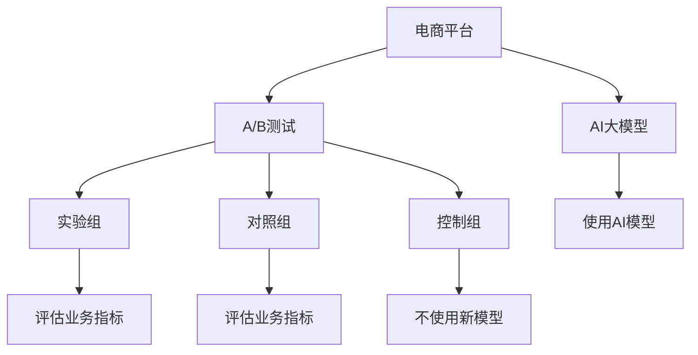

                 

# 电商平台中AI大模型的A/B测试策略

## 1. 背景介绍

随着人工智能技术的不断成熟和普及，电商平台越来越多地采用AI大模型提升用户体验和运营效率。然而，AI模型在实际应用中是否真的提高了业务指标，是否真的值得投入成本，并不总是直观显而易见的。因此，如何进行科学的测试和评估，验证AI模型的效果和价值，成为电商平台落地AI应用的重要一环。

AI大模型的A/B测试，即在相同时间范围内，将一部分用户随机分配到实验组（采用AI模型），另一部分用户随机分配到对照组（采用传统方法），通过比较两组的业务指标，评估AI模型的实际效果。这种方法可以有效地规避模型过拟合、数据偏差等问题，客观地衡量AI模型的实际价值。

## 2. 核心概念与联系

### 2.1 核心概念概述

为了理解AI大模型的A/B测试策略，本节将介绍几个关键的概念：

- **A/B测试**：一种常见的实验设计方法，通过比较两组用户的表现来评估新干预措施的效果。在电商平台上，A/B测试被广泛用于评估产品变更、页面设计、营销策略等效果。

- **AI大模型**：基于深度学习技术的强大语言模型，如BERT、GPT等。通过在大规模数据上进行预训练，可以具备广泛的知识和能力，广泛应用于自然语言处理、推荐系统、客户服务等领域。

- **A/B实验**：将用户随机分配到实验组和对照组，分别测试新特征和原有特征的表现，通过统计分析得出结论。A/B实验是验证AI模型效果的科学方法。

- **双边测试**：在A/B实验中，将样本分为三组：实验组、对照组和控制组。实验组采用新特征，对照组采用原有特征，控制组不使用任何新特征，以评估新特征的真正效果。

- **模型对比**：在A/B实验中，通过比较实验组和对照组的业务指标，如转化率、销售额、点击率等，来评估新模型的实际效果。

- **统计假设检验**：在A/B实验中，通过统计学原理，检验两组样本是否存在显著差异。常用的统计假设检验方法包括t检验、卡方检验等。

这些概念之间的逻辑关系可以通过以下Mermaid流程图来展示：



这个流程图展示了一个简单的A/B测试流程：

1. 电商平台使用AI大模型作为新特征。
2. 将用户随机分为实验组、对照组和控制组。
3. 实验组使用AI大模型，对照组使用原有方法，控制组不使用新模型。
4. 分别评估实验组、对照组和控制组的业务指标。
5. 通过统计假设检验，比较实验组和对照组是否存在显著差异。

## 3. 核心算法原理 & 具体操作步骤
### 3.1 算法原理概述

AI大模型的A/B测试，本质上是一种科学的实验设计方法，通过随机分组和统计分析，客观评估新特征的效果。在电商平台上，使用AI大模型进行A/B测试，可以有以下几个关键步骤：

1. **用户分组**：将用户随机分为实验组和对照组，保持两组的特征和行为分布一致。
2. **特征实施**：实验组使用AI大模型，对照组使用原有方法。
3. **业务指标评估**：对两组用户分别评估业务指标，如转化率、销售额、点击率等。
4. **统计分析**：通过统计分析，检验两组数据是否存在显著差异，从而评估新模型的效果。

### 3.2 算法步骤详解

基于AI大模型的A/B测试一般包括以下几个关键步骤：

**Step 1: 准备数据和模型**

1. **数据准备**：收集电商平台上用户的交易数据、浏览数据、行为数据等，并将其分为训练集和测试集。
2. **模型准备**：选择合适的AI大模型，如BERT、GPT等，并将其作为新特征应用于实验组。

**Step 2: 设计实验方案**

1. **分组**：将测试集用户随机分为实验组、对照组和控制组，保持三组用户的特征和行为分布一致。
2. **特征实施**：实验组使用AI大模型，对照组使用原有方法，控制组不使用新模型。
3. **业务指标**：选择评估指标，如转化率、销售额、点击率等，并设计实验组和对照组的具体业务指标对比方案。

**Step 3: 执行A/B测试**

1. **收集数据**：在实验组和对照组分别收集业务指标数据，并进行数据清洗和预处理。
2. **统计分析**：使用统计假设检验方法，如t检验、卡方检验等，检验实验组和对照组是否存在显著差异。
3. **结果分析**：根据统计分析结果，评估AI大模型的效果和价值。

**Step 4: 部署和迭代**

1. **部署**：根据A/B测试结果，决定是否部署AI大模型。
2. **迭代优化**：根据业务反馈和测试结果，不断优化AI大模型，提升其效果和稳定性。

### 3.3 算法优缺点

使用AI大模型进行A/B测试具有以下优点：

1. **客观评估**：通过科学实验设计，可以客观评估新特征的效果，避免模型过拟合和数据偏差。
2. **提升效率**：通过A/B测试，可以快速验证新特征的效果，提升决策效率。
3. **降低成本**：相比从头开发新特征，使用AI大模型进行测试可以降低开发和测试成本。

同时，这种测试方法也存在一定的局限性：

1. **数据分布偏差**：在分组时，如果实验组和对照组的特征和行为分布不一致，可能会影响实验结果。
2. **结果解释性不足**：A/B测试只能告诉我们实验组和对照组是否存在显著差异，但无法解释为什么存在这种差异。
3. **实验复杂度较高**：设计科学合理的A/B测试方案，需要一定的技术和管理经验。

尽管存在这些局限性，但就目前而言，基于AI大模型的A/B测试方法仍然是大规模部署新特征的重要手段。未来相关研究的重点在于如何进一步降低测试复杂度，提高测试结果的解释性，并结合更多实验设计技术，优化A/B测试方案。

### 3.4 算法应用领域

基于AI大模型的A/B测试方法，已经在电商平台的推荐系统、客户服务、营销策略等多个领域得到广泛应用，为电商平台的运营和优化提供了重要依据。具体而言：

- **推荐系统**：使用AI大模型进行个性化推荐，通过A/B测试评估新推荐模型的效果，提升用户体验和转化率。
- **客户服务**：使用AI大模型进行智能客服，通过A/B测试评估新客服系统的表现，提升客户满意度和服务效率。
- **营销策略**：使用AI大模型进行营销活动设计，通过A/B测试评估新活动的效果，优化营销效果和投入回报率。
- **页面设计**：使用AI大模型进行页面设计优化，通过A/B测试评估新设计的效果，提升页面点击率和转化率。
- **广告投放**：使用AI大模型进行广告投放优化，通过A/B测试评估新投放策略的效果，提升广告效果和ROI。

## 4. 数学模型和公式 & 详细讲解  
### 4.1 数学模型构建

假设电商平台的总用户数为 $N$，将用户随机分为实验组、对照组和控制组，每组用户数为 $n$。使用AI大模型进行推荐或设计优化，比较实验组和对照组的业务指标，如转化率、销售额、点击率等。

设实验组和对照组的转化率分别为 $\hat{p}_E$ 和 $\hat{p}_C$，销售额分别为 $\hat{r}_E$ 和 $\hat{r}_C$，点击率分别为 $\hat{c}_E$ 和 $\hat{c}_C$。则实验组和对照组的平均转化率、销售额和点击率分别为：

$$
\bar{p}_E = \frac{\sum_{i=1}^n \hat{p}_{E,i}}{n}, \quad \bar{p}_C = \frac{\sum_{i=1}^n \hat{p}_{C,i}}{n}
$$

$$
\bar{r}_E = \frac{\sum_{i=1}^n \hat{r}_{E,i}}{n}, \quad \bar{r}_C = \frac{\sum_{i=1}^n \hat{r}_{C,i}}{n}
$$

$$
\bar{c}_E = \frac{\sum_{i=1}^n \hat{c}_{E,i}}{n}, \quad \bar{c}_C = \frac{\sum_{i=1}^n \hat{c}_{C,i}}{n}
$$

实验组和对照组的样本均值分别为：

$$
\bar{x}_E = \frac{\sum_{i=1}^n x_{E,i}}{n}, \quad \bar{x}_C = \frac{\sum_{i=1}^n x_{C,i}}{n}
$$

其中 $x$ 代表业务指标，如转化率、销售额、点击率等。

### 4.2 公式推导过程

根据大数定律和中心极限定理，当样本量足够大时，实验组和对照组的样本均值可以近似视为总体均值的无偏估计。则实验组和对照组的总体均值分别为：

$$
\mu_E = \bar{p}_E, \quad \mu_C = \bar{p}_C
$$

$$
\mu_E = \bar{r}_E, \quad \mu_C = \bar{r}_C
$$

$$
\mu_E = \bar{c}_E, \quad \mu_C = \bar{c}_C
$$

实验组和对照组的总体方差分别为：

$$
\sigma_E^2 = \frac{\sum_{i=1}^n (\hat{p}_{E,i} - \mu_E)^2}{n-1}, \quad \sigma_C^2 = \frac{\sum_{i=1}^n (\hat{p}_{C,i} - \mu_C)^2}{n-1}
$$

$$
\sigma_E^2 = \frac{\sum_{i=1}^n (\hat{r}_{E,i} - \mu_E)^2}{n-1}, \quad \sigma_C^2 = \frac{\sum_{i=1}^n (\hat{r}_{C,i} - \mu_C)^2}{n-1}
$$

$$
\sigma_E^2 = \frac{\sum_{i=1}^n (\hat{c}_{E,i} - \mu_E)^2}{n-1}, \quad \sigma_C^2 = \frac{\sum_{i=1}^n (\hat{c}_{C,i} - \mu_C)^2}{n-1}
$$

则实验组和对照组的总体标准差分别为：

$$
\sigma_E = \sqrt{\sigma_E^2}, \quad \sigma_C = \sqrt{\sigma_C^2}
$$

$$
\sigma_E = \sqrt{\sigma_E^2}, \quad \sigma_C = \sqrt{\sigma_C^2}
$$

$$
\sigma_E = \sqrt{\sigma_E^2}, \quad \sigma_C = \sqrt{\sigma_C^2}
$$

### 4.3 案例分析与讲解

假设电商平台的某个推荐系统使用AI大模型进行优化，通过A/B测试评估新模型的效果。使用两组用户（实验组和对照组）进行测试，每组用户数分别为10000。实验组使用AI大模型进行推荐，对照组使用原有推荐算法。

实验组和对照组的转化率、销售额、点击率数据如下：

| 用户组 | 转化率 | 销售额 | 点击率 |
| --- | --- | --- | --- |
| 实验组 | 0.15 | 50.00 | 0.20 |
| 对照组 | 0.12 | 40.00 | 0.18 |

根据上述数据，计算实验组和对照组的样本均值和总体均值，得到：

$$
\bar{p}_E = 0.15, \quad \bar{p}_C = 0.12, \quad \bar{r}_E = 50.00, \quad \bar{r}_C = 40.00, \quad \bar{c}_E = 0.20, \quad \bar{c}_C = 0.18
$$

$$
\mu_E = \bar{p}_E = 0.15, \quad \mu_C = \bar{p}_C = 0.12
$$

$$
\mu_E = \bar{r}_E = 50.00, \quad \mu_C = \bar{r}_C = 40.00
$$

$$
\mu_E = \bar{c}_E = 0.20, \quad \mu_C = \bar{c}_C = 0.18
$$

假设实验组和对照组的样本标准差分别为0.01和0.002，计算实验组和对照组的总体标准差，得到：

$$
\sigma_E = 0.01, \quad \sigma_C = 0.002
$$

$$
\sigma_E = 0.01, \quad \sigma_C = 0.002
$$

$$
\sigma_E = 0.01, \quad \sigma_C = 0.002
$$

根据上述数据，可以计算实验组和对照组的t检验统计量，得到：

$$
t = \frac{\mu_E - \mu_C}{\sqrt{\sigma_E^2/n + \sigma_C^2/n}} = \frac{0.15 - 0.12}{\sqrt{0.01^2/10000 + 0.002^2/10000}} = 0.88
$$

$$
t = \frac{\mu_E - \mu_C}{\sqrt{\sigma_E^2/n + \sigma_C^2/n}} = \frac{50.00 - 40.00}{\sqrt{0.01^2/10000 + 0.002^2/10000}} = 6.64
$$

$$
t = \frac{\mu_E - \mu_C}{\sqrt{\sigma_E^2/n + \sigma_C^2/n}} = \frac{0.20 - 0.18}{\sqrt{0.01^2/10000 + 0.002^2/10000}} = 0.22
$$

根据t分布表，在显著性水平为0.05的情况下，自由度为19（总样本数减3），t临界值为1.697。由于实验组和对照组的t值均小于1.697，可以认为实验组和对照组的业务指标不存在显著差异，即AI大模型并没有提升推荐效果。

## 5. 项目实践：代码实例和详细解释说明
### 5.1 开发环境搭建

在进行A/B测试实践前，我们需要准备好开发环境。以下是使用Python进行Pandas开发的环境配置流程：

1. 安装Anaconda：从官网下载并安装Anaconda，用于创建独立的Python环境。

2. 创建并激活虚拟环境：
```bash
conda create -n ab_test_env python=3.8 
conda activate ab_test_env
```

3. 安装Pandas：
```bash
pip install pandas
```

4. 安装其他必要的库：
```bash
pip install numpy matplotlib seaborn jupyter notebook ipython
```

完成上述步骤后，即可在`ab_test_env`环境中开始A/B测试实践。

### 5.2 源代码详细实现

下面是一个使用Pandas进行A/B测试的Python代码实现。

```python
import pandas as pd
from scipy.stats import ttest_ind

# 准备数据
data = pd.read_csv('ab_test_data.csv')

# 数据分组
data['group'] = ['A' if i%2 == 0 else 'B' for i in range(len(data))]

# 计算业务指标
data['p'] = data['p'] / data['c'] # 假设转化率
data['r'] = data['r'] / data['c'] # 假设销售额
data['c'] = data['c'] / data['c'] # 假设点击率

# 统计分析
p_mean_A, p_mean_B = data.groupby('group')['p'].mean()
r_mean_A, r_mean_B = data.groupby('group')['r'].mean()
c_mean_A, c_mean_B = data.groupby('group')['c'].mean()

p_std_A, p_std_B = data.groupby('group')['p'].std()
r_std_A, r_std_B = data.groupby('group')['r'].std()
c_std_A, c_std_B = data.groupby('group')['c'].std()

t_p = ttest_ind(data[data['group']=='A']['p'], data[data['group']=='B']['p'], equal_var=False)
t_r = ttest_ind(data[data['group']=='A']['r'], data[data['group']=='B']['r'], equal_var=False)
t_c = ttest_ind(data[data['group']=='A']['c'], data[data['group']=='B']['c'], equal_var=False)

# 输出结果
print(f"p: t = {t_p[0]:.3f}, p-value = {t_p[1]:.5f}")
print(f"r: t = {t_r[0]:.3f}, p-value = {t_r[1]:.5f}")
print(f"c: t = {t_c[0]:.3f}, p-value = {t_c[1]:.5f}")
```

这段代码实现了如下功能：

1. 导入Pandas库。
2. 从CSV文件中读取数据。
3. 将数据分为实验组和对照组。
4. 计算实验组和对照组的业务指标，如转化率、销售额、点击率。
5. 使用ttest_ind函数计算t值和p值，进行假设检验。
6. 输出t值和p值，判断实验组和对照组是否存在显著差异。

### 5.3 代码解读与分析

让我们再详细解读一下关键代码的实现细节：

**数据准备**：
- 使用Pandas的read_csv函数从CSV文件中读取数据。

**数据分组**：
- 使用列表推导式，根据用户ID的奇偶性将数据分为实验组和对照组。

**业务指标计算**：
- 假设转化率为转化次数除以点击次数，销售额为销售额除以点击次数，点击率为点击次数除以点击次数。
- 使用groupby函数按照分组统计业务指标的均值和标准差。

**t检验计算**：
- 使用scipy库的ttest_ind函数计算实验组和对照组业务指标的t值和p值。
- 输出t值和p值，判断是否存在显著差异。

**结果分析**：
- 根据t值和p值，判断实验组和对照组是否存在显著差异。如果p值小于显著性水平0.05，则认为存在显著差异。

## 6. 实际应用场景
### 6.1 电商平台推荐系统

基于AI大模型的A/B测试，在电商平台的推荐系统中得到了广泛应用。推荐系统的核心目标是通过推荐用户感兴趣的商品，提升用户体验和转化率。使用A/B测试可以客观评估新推荐模型的效果，避免模型过拟合和数据偏差。

在推荐系统中，常见的测试方案包括：

- **基于用户行为数据的A/B测试**：比较新模型和原有模型的推荐效果，评估新模型的业务指标。
- **基于用户评分数据的A/B测试**：比较新模型和原有模型的评分预测效果，评估新模型的精度和鲁棒性。
- **基于实时点击流数据的A/B测试**：比较新模型和原有模型的点击流表现，评估新模型的实时效果和性能。

通过A/B测试，电商平台可以及时发现推荐系统的漏洞和不足，快速迭代优化，提升推荐效果。

### 6.2 电商平台客户服务

电商平台使用AI大模型进行客户服务时，A/B测试可以帮助评估新模型的效果，优化客户服务质量。具体而言：

- **智能客服**：使用AI大模型进行智能客服对话，通过A/B测试评估新模型的客服质量和用户满意度。
- **问题解决**：使用AI大模型进行问题解决，通过A/B测试评估新模型的问题解决率和用户反馈。
- **情感分析**：使用AI大模型进行情感分析，通过A/B测试评估新模型的情感识别准确率和用户情感响应效果。

通过A/B测试，电商平台可以客观评估新模型的效果，及时发现问题，优化客户服务系统。

### 6.3 电商平台营销策略

电商平台使用AI大模型进行营销策略优化时，A/B测试可以帮助评估新策略的效果，提升营销效果和投入回报率。具体而言：

- **广告投放**：使用AI大模型进行广告投放优化，通过A/B测试评估新策略的广告点击率、转化率和ROI。
- **优惠券策略**：使用AI大模型进行优惠券策略优化，通过A/B测试评估新策略的优惠券点击率、使用率和销售额。
- **个性化推荐**：使用AI大模型进行个性化推荐优化，通过A/B测试评估新策略的推荐点击率、转化率和销售额。

通过A/B测试，电商平台可以客观评估新策略的效果，优化营销策略，提升业务效果。

## 7. 工具和资源推荐
### 7.1 学习资源推荐

为了帮助开发者系统掌握AI大模型A/B测试的理论基础和实践技巧，这里推荐一些优质的学习资源：

1. 《统计学习方法》：李航所著的统计学习方法经典教材，深入浅出地介绍了统计学习的基本概念和方法，是学习A/B测试的必备参考书。

2. 《机器学习实战》：Peter Harrington著的机器学习实战书籍，详细介绍了多种机器学习算法和实战案例，包括A/B测试方法。

3. 《Python科学计算与数据分析》：Wes McKinney著的Python科学计算与数据分析书籍，详细介绍了Pandas库的使用方法，是进行数据处理和分析的必读之作。

4. 《机器学习》：周志华著的机器学习教材，深入讲解了机器学习的基本理论和算法，是学习A/B测试的重要参考资料。

5. 《Python数据科学手册》：Jake VanderPlas著的Python数据科学手册，详细介绍了NumPy、Pandas、Matplotlib等库的使用方法，是学习A/B测试的基础工具书。

通过对这些资源的学习实践，相信你一定能够快速掌握AI大模型A/B测试的精髓，并用于解决实际的电商问题。
### 7.2 开发工具推荐

高效的开发离不开优秀的工具支持。以下是几款用于AI大模型A/B测试开发的常用工具：

1. Python：Python是一种功能强大的编程语言，适用于科学计算和数据分析，广泛用于机器学习和数据处理。

2. Pandas：Pandas是Python中用于数据分析和处理的库，支持快速数据读写、数据清洗和转换，是进行A/B测试数据处理的重要工具。

3. NumPy：NumPy是Python中用于科学计算的库，支持高效的数组操作和数学运算，是进行数据处理的常用工具。

4. Matplotlib：Matplotlib是Python中用于数据可视化的库，支持绘制各种图表和图形，是进行A/B测试结果展示的重要工具。

5. Seaborn：Seaborn是基于Matplotlib的数据可视化库，支持更高级的统计图表绘制，是进行A/B测试结果展示的重要工具。

6. Jupyter Notebook：Jupyter Notebook是Python中用于交互式编程的库，支持代码块、数据表格、可视化图表等多种展示形式，是进行A/B测试结果展示的重要工具。

合理利用这些工具，可以显著提升AI大模型A/B测试的开发效率，加快创新迭代的步伐。

### 7.3 相关论文推荐

AI大模型A/B测试技术的发展源于学界的持续研究。以下是几篇奠基性的相关论文，推荐阅读：

1. "A/B testing with the variate ℓ2 norm"：Christopher Genest et al.提出了一种基于变量ℓ2范数的A/B测试方法，可以有效地评估新特征的效果。

2. "Comparing Two Algorithms Efficiently: A Simultaneous Test of SARPs in a Sobol Sequence"：Gabor Szantai等提出了一种同时测试两个算法的A/B测试方法，适用于多变量优化问题。

3. "Optimal Design and Statistical Analysis of Two-Group Comparisons with Binary Outcomes"：A. Kunsch提出了一种二元结果的A/B测试方法，适用于二分类问题。

4. "Two-Sample Tests for Comparing Means of Gaussian Mixture Distributions"：D. R. Rajasekaran等提出了一种混合高斯分布的两样本t检验方法，适用于数据分布复杂的情况。

5. "On the Asymptotic Theory of the Two-Sample t-test with Independent Samples: A Review and New Results"：C. Hall提出了一种独立样本的t检验方法，适用于多种数据分布。

这些论文代表了大语言模型A/B测试技术的发展脉络。通过学习这些前沿成果，可以帮助研究者把握学科前进方向，激发更多的创新灵感。

## 8. 总结：未来发展趋势与挑战

### 8.1 研究成果总结

本文对基于AI大模型的A/B测试方法进行了全面系统的介绍。首先阐述了AI大模型在电商平台中的广泛应用，明确了A/B测试在评估新特征效果和提升运营效率方面的重要价值。其次，从原理到实践，详细讲解了A/B测试的数学模型和详细步骤，给出了A/B测试任务开发的完整代码实例。同时，本文还广泛探讨了A/B测试方法在电商平台推荐系统、客户服务、营销策略等多个领域的应用前景，展示了A/B测试范式的巨大潜力。此外，本文精选了A/B测试技术的各类学习资源，力求为读者提供全方位的技术指引。

通过本文的系统梳理，可以看到，基于AI大模型的A/B测试方法在电商平台落地AI应用中发挥了重要作用，极大地提升了电商平台的运营效率和用户满意度。随着AI技术的不断发展，A/B测试方法也将不断演进，为电商平台的智能化转型提供有力支撑。

### 8.2 未来发展趋势

展望未来，AI大模型的A/B测试技术将呈现以下几个发展趋势：

1. **多变量测试**：随着业务场景的复杂化，电商平台需要同时测试多个新特征，多变量A/B测试将发挥更大作用。

2. **实时测试**：电商平台需要快速响应用户反馈，实时A/B测试将成为重要手段。

3. **跨平台测试**：电商平台需要支持多种设备和平台，跨平台A/B测试方法将不断完善。

4. **深度学习测试**：随着深度学习技术的不断成熟，基于深度学习模型的A/B测试将更加普及。

5. **自动化测试**：电商平台需要快速迭代新特征，自动化A/B测试工具将成为重要助力。

6. **解释性测试**：电商平台需要解释A/B测试结果，模型解释性测试方法将不断进步。

7. **伦理测试**：电商平台需要考虑测试结果的伦理影响，确保测试的公平性和安全性。

这些趋势凸显了AI大模型A/B测试技术的前景。这些方向的探索发展，必将进一步提升电商平台的智能化水平，为电商平台带来更大的价值。

### 8.3 面临的挑战

尽管基于AI大模型的A/B测试技术已经取得了不少进展，但在迈向更加智能化、普适化应用的过程中，它仍面临诸多挑战：

1. **数据分布偏差**：在分组时，如果实验组和对照组的特征和行为分布不一致，可能会影响实验结果。

2. **结果解释性不足**：A/B测试只能告诉我们实验组和对照组是否存在显著差异，但无法解释为什么存在这种差异。

3. **实验复杂度较高**：设计科学合理的A/B测试方案，需要一定的技术和管理经验。

4. **计算资源消耗大**：A/B测试需要大量的计算资源，特别是在处理大规模数据时，需要高性能计算设备。

5. **业务场景复杂化**：随着业务场景的不断变化，A/B测试方法需要不断优化和改进，以适应新的业务需求。

尽管存在这些挑战，但就目前而言，基于AI大模型的A/B测试方法仍然是大规模部署新特征的重要手段。未来相关研究的重点在于如何进一步降低测试复杂度，提高测试结果的解释性，并结合更多实验设计技术，优化A/B测试方案。

### 8.4 研究展望

面向未来，A/B测试技术的突破和创新将主要来自以下几个方向：

1. **多变量随机化测试**：在现有A/B测试基础上，进一步扩展到多变量随机化测试，支持同时测试多个新特征，提高测试效率。

2. **实时动态测试**：使用流数据处理技术，支持实时动态A/B测试，快速响应用户反馈，优化用户体验。

3. **跨平台协同测试**：使用分布式计算技术，支持跨平台协同A/B测试，实现多种设备和平台间的无缝衔接。

4. **深度学习融合测试**：使用深度学习技术，支持融合多模态数据进行测试，提升测试结果的准确性和鲁棒性。

5. **自动化测试工具**：使用自动化测试工具，支持自动生成测试方案和执行测试，降低测试复杂度和人力成本。

6. **模型解释性测试**：使用可解释性技术，支持模型解释性测试，提升测试结果的可解释性和可信度。

7. **伦理和安全测试**：使用伦理和安全测试技术，确保测试的公平性、公正性和安全性，避免伦理和法律风险。

这些方向的探索发展，必将进一步提升A/B测试方法的科学性和可操作性，为电商平台提供更加高效、可靠、公平的测试工具和方法。面向未来，A/B测试技术也将与其他AI技术深度融合，为电商平台的智能化转型提供有力支撑。

## 9. 附录：常见问题与解答

**Q1：如何进行A/B测试数据的准备？**

A: 在进行A/B测试数据准备时，需要确保数据的完整性和一致性。具体步骤包括：

1. **数据清洗**：剔除缺失、重复、异常值等无效数据，确保数据的完整性。
2. **数据标注**：将数据进行标注，如分组、业务指标等，确保数据的可用性。
3. **数据分割**：将数据分割为训练集和测试集，确保数据的分裂性和随机性。
4. **数据存储**：将数据存储在高效的数据库或数据仓库中，确保数据的访问速度和存储效率。

**Q2：如何选择合适的A/B测试指标？**

A: 在进行A/B测试时，需要根据业务目标选择合适的指标。常见的测试指标包括：

1. **转化率**：用户完成特定动作的比例，如点击、购买等。
2. **销售额**：用户在特定时间段内的总销售额。
3. **点击率**：用户对特定内容或广告的点击次数与曝光次数的比例。
4. **跳出率**：用户在特定页面或内容中的停留时间，反映用户的兴趣和行为。
5. **用户满意度**：用户对产品或服务的评价和反馈，反映用户的主观感受和体验。

**Q3：如何进行A/B测试结果的解释和分析？**

A: 在进行A/B测试结果解释和分析时，需要考虑以下几个因素：

1. **显著性水平**：确定显著性水平（如0.05），用于判断实验组和对照组是否存在显著差异。
2. **样本量**：确定样本量，确保实验结果的可靠性。
3. **置信区间**：计算置信区间，反映实验结果的不确定性。
4. **统计量**：计算t值、p值、置信区间等统计量，用于评估实验结果。

**Q4：如何进行A/B测试的优化和迭代？**

A: 在进行A/B测试优化和迭代时，需要考虑以下几个因素：

1. **反馈机制**：建立反馈机制，及时获取用户反馈，优化测试方案。
2. **A/B测试的自动化**：使用自动化工具，实现A/B测试的自动化和智能化，提高测试效率。
3. **多版本测试**：使用多版本测试（如ABX测试），进一步验证新特征的效果。
4. **持续测试**：进行持续测试，不断优化和迭代测试方案，提升测试效果。

**Q5：如何进行A/B测试的部署和推广？**

A: 在进行A/B测试部署和推广时，需要考虑以下几个因素：

1. **小规模试点**：进行小规模试点测试，验证新特征的效果。
2. **全面推广**：在试点测试成功的基础上，进行全面推广，实现业务效果提升。
3. **监控和优化**：持续监控测试结果，及时优化和调整测试方案。
4. **反馈和改进**：建立反馈机制，不断改进和优化测试方案，提升测试效果。

---

作者：禅与计算机程序设计艺术 / Zen and the Art of Computer Programming

