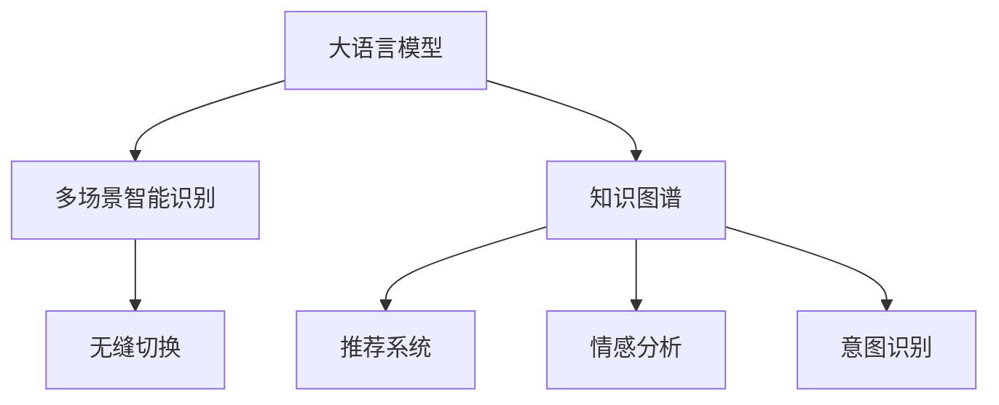

                 

# 电商平台中的AI大模型：从单一场景到多场景智能识别与无缝切换

> 关键词：大语言模型, 电商平台, 多场景智能识别, 无缝切换, 自然语言处理(NLP), 深度学习, 自然语言理解(NLU), 情感分析, 意图识别, 推荐系统, 知识图谱

## 1. 背景介绍

### 1.1 问题由来
近年来，人工智能技术在电商平台的应用日益深入，不仅提升了用户体验，也为商家带来了诸多商业价值。然而，电商平台中的人工智能应用大多聚焦于单一场景，如商品搜索、推荐、客服对话等。尽管这些应用取得了不错的效果，但也存在诸多局限：

1. **场景单一**：每个应用场景各自为政，缺乏集成协作，难以形成完整的电商平台AI生态。
2. **技术壁垒高**：每个应用场景需要使用不同技术，且实现复杂度较高。
3. **维护成本高**：多个独立系统的维护和更新成本较高，难以灵活调整和迭代。

为了解决这些问题，需要一种更为灵活、可扩展的AI大模型，能够适应多场景的智能识别和无缝切换，提升电商平台的智能化水平。

### 1.2 问题核心关键点
为了构建这种多场景智能识别的AI大模型，需要解决以下几个核心关键问题：

- **多场景智能识别**：如何构建一个能够适应多种任务的多场景智能识别模型。
- **无缝切换**：如何在不同场景之间实现平滑的无缝切换，避免系统上下文丢失。
- **模型泛化**：如何使模型在多场景中具备良好的泛化能力，确保在未知数据上表现稳定。
- **应用可扩展**：如何在电商平台的各个业务环节中灵活部署，无缝集成。

## 2. 核心概念与联系

### 2.1 核心概念概述

为了应对电商平台多场景智能识别和无缝切换的需求，本文将介绍几个关键概念：

- **大语言模型(Large Language Model, LLM)**：一种基于Transformer结构的大规模预训练语言模型，如GPT、BERT等，能够进行多种自然语言处理任务，如语言理解、生成、分类等。
- **多场景智能识别**：指构建能够适应多个电商业务场景的智能识别系统，如商品搜索、推荐、客服对话等。
- **无缝切换**：指在不同场景之间实现平滑过渡，保持用户上下文和系统状态一致。
- **知识图谱(Knowledge Graph)**：一种结构化知识表示方法，用于捕捉实体之间的关系，辅助多场景智能识别。
- **推荐系统(Recommendation System)**：通过分析用户行为和商品属性，为用户推荐合适的商品。
- **情感分析(Sentiment Analysis)**：分析用户对商品的评价，帮助商家了解用户需求和反馈。
- **意图识别(Intent Recognition)**：识别用户查询意图，优化商品搜索和推荐效果。

这些概念之间的逻辑关系可以通过以下Mermaid流程图来展示：



这个流程图展示了大语言模型、知识图谱、推荐系统、情感分析和意图识别等概念之间的联系：

1. 大语言模型提供通用的语言理解和生成能力。
2. 知识图谱辅助模型理解实体关系，提高泛化能力。
3. 推荐系统、情感分析和意图识别等应用基于大语言模型和知识图谱进行构建，辅助智能识别。
4. 无缝切换技术使得这些应用能够在大语言模型的基础上进行灵活集成。

## 3. 核心算法原理 & 具体操作步骤

### 3.1 算法原理概述

多场景智能识别与无缝切换的AI大模型，本质上是一种多任务学习范式，即通过预训练大语言模型，在多个任务上进行微调，以适应不同的电商业务场景。

其核心思想是：将大语言模型视为一个强大的"通用模型"，通过多个任务的具体微调，使其具备多场景的智能识别能力，并在不同场景之间实现无缝切换。

具体来说，构建多场景智能识别的AI大模型需要经历以下几个步骤：

1. **预训练大语言模型**：在大规模无标签数据上进行预训练，学习通用的语言表示。
2. **多场景任务微调**：在预训练模型上进行多个电商场景任务的微调，如商品搜索、推荐、客服对话等。
3. **无缝切换技术**：在多场景切换时，使用上下文建模技术，保持用户上下文一致。
4. **集成优化**：将多场景模型进行集成，构建统一的用户体验接口，实现无缝应用。

### 3.2 算法步骤详解

以下详细介绍构建多场景智能识别与无缝切换的AI大模型的详细步骤：

**Step 1: 预训练大语言模型**

- 选择合适的预训练语言模型，如GPT、BERT等，作为初始化参数。
- 在无标签电商数据上进行预训练，学习通用的语言表示。
- 使用大规模语料进行预训练，提升模型的泛化能力。

**Step 2: 多场景任务微调**

- 在预训练模型上进行多个电商场景任务的微调，如商品搜索、推荐、客服对话等。
- 使用任务相关的标注数据进行微调，优化模型在特定任务上的性能。
- 使用正则化技术，如L2正则、Dropout、Early Stopping等，防止过拟合。

**Step 3: 无缝切换技术**

- 在多场景切换时，使用上下文建模技术，如Prompt Engineering，保持用户上下文一致。
- 在输入中使用上下文提示模板，引导模型进行场景切换，避免状态丢失。
- 使用多模态技术，如结合文本、图像、语音等多媒体信息，增强场景识别的准确性。

**Step 4: 集成优化**

- 将多场景模型进行集成，构建统一的用户体验接口。
- 使用API集成各个应用，确保接口的一致性和高效性。
- 使用A/B测试等手段，优化用户接口的交互体验。

### 3.3 算法优缺点

构建多场景智能识别与无缝切换的AI大模型，具有以下优点：

1. **泛化能力强**：通过预训练和多个场景任务的微调，模型能够适应多种任务，提高泛化能力。
2. **应用灵活**：多场景模型可以灵活部署到电商平台各个环节，提升整体智能化水平。
3. **可扩展性强**：模型可以在原有基础上进行快速扩展，添加新任务或优化已有任务。
4. **无缝切换**：无缝切换技术确保了用户在多个场景之间的平滑过渡，提高了用户满意度。

同时，该方法也存在一定的局限性：

1. **模型复杂度高**：多场景模型需要处理多种任务，参数量较大，复杂度高。
2. **训练成本高**：大规模预训练和多场景微调需要大量计算资源和标注数据。
3. **实时性要求高**：多场景模型需要实时响应用户请求，对计算资源和系统架构的要求较高。
4. **模型更新难**：模型需要频繁更新，以适应新的电商业务需求，维护成本较高。

尽管存在这些局限性，但就目前而言，构建多场景智能识别与无缝切换的AI大模型，是提升电商平台智能化水平的重要手段。未来相关研究的重点在于如何进一步降低模型复杂度，提高实时性，以及如何与外部知识库、规则库等专家知识结合，形成更加全面、准确的信息整合能力。

### 3.4 算法应用领域

基于多场景智能识别与无缝切换的AI大模型，已经在电商平台的多个应用场景中得到了广泛应用，例如：

- **商品搜索**：利用自然语言理解和上下文建模技术，提升商品搜索结果的精准度。
- **推荐系统**：结合用户行为数据和商品属性信息，为用户提供个性化的商品推荐。
- **客服对话**：通过对话生成技术，实现智能客服的自动化回复，提升用户满意度。
- **情感分析**：分析用户对商品的评价，帮助商家了解用户需求和反馈，优化商品和服务。
- **意图识别**：识别用户查询意图，优化商品搜索和推荐效果，提升用户体验。
- **知识图谱应用**：结合知识图谱，提升商品属性抽取和实体关系的识别能力。

除了上述这些经典应用外，多场景智能识别与无缝切换的AI大模型，还将在电商平台的更多场景中得到应用，如广告投放、库存管理、物流调度等，为电商平台带来更大的智能化变革。

## 4. 数学模型和公式 & 详细讲解 & 举例说明

### 4.1 数学模型构建

为了更严谨地表述多场景智能识别与无缝切换的AI大模型，本节将从数学模型角度对核心算法进行详细推导。

假设预训练语言模型为 $M_{\theta}$，其中 $\theta$ 为预训练得到的模型参数。给定电商平台多场景任务 $T=\{T_1, T_2, \cdots, T_n\}$，每个任务 $T_i$ 的标注数据集为 $D_i=\{(x_i, y_i)\}_{i=1}^{N_i}$，$x_i$ 为输入，$y_i$ 为输出标签。

定义模型 $M_{\theta}$ 在数据样本 $(x,y)$ 上的损失函数为 $\ell(M_{\theta}(x),y)$，则在任务 $T_i$ 上经验风险为：

$$
\mathcal{L}_i(\theta) = \frac{1}{N_i}\sum_{i=1}^{N_i} \ell(M_{\theta}(x_i),y_i)
$$

多场景智能识别与无缝切换的AI大模型的优化目标是：

$$
\hat{\theta}=\mathop{\arg\min}_{\theta} \sum_{i=1}^n \mathcal{L}_i(\theta)
$$

其中，$\hat{\theta}$ 为模型在所有场景上的最优参数。

### 4.2 公式推导过程

以下推导将重点放在多场景任务微调的基本损失函数上，使用二分类交叉熵损失函数进行演示：

假设模型 $M_{\theta}$ 在输入 $x$ 上的输出为 $\hat{y}=M_{\theta}(x) \in [0,1]$，表示样本属于正类的概率。真实标签 $y \in \{0,1\}$。则二分类交叉熵损失函数定义为：

$$
\ell(M_{\theta}(x),y) = -[y\log \hat{y} + (1-y)\log (1-\hat{y})]
$$

将其代入任务 $T_i$ 上的经验风险公式，得：

$$
\mathcal{L}_i(\theta) = -\frac{1}{N_i}\sum_{i=1}^{N_i} [y_i\log M_{\theta}(x_i)+(1-y_i)\log(1-M_{\theta}(x_i))]
$$

为了实现多场景智能识别，可以采用以下两种方法：

1. **多任务微调**：将多个任务的损失函数相加作为整体损失函数进行优化：

$$
\mathcal{L}_{\text{multi-task}}(\theta) = \sum_{i=1}^n \mathcal{L}_i(\theta)
$$

2. **多层级微调**：将模型分为多个层次，每个层次适应一个任务，然后逐层微调：

$$
\mathcal{L}_{\text{hierarchical}}(\theta) = \sum_{i=1}^n \mathcal{L}_i^{(L_i)}(\theta)
$$

其中 $\mathcal{L}_i^{(L_i)}(\theta)$ 为任务 $T_i$ 在层次 $L_i$ 上的损失函数。

在得到损失函数后，即可带入优化算法进行模型训练。常用的优化算法包括Adam、SGD等，通过梯度下降等优化算法，最小化整体损失函数，得到模型在多场景上的最优参数 $\hat{\theta}$。

### 4.3 案例分析与讲解

以下以电商平台的商品搜索和推荐系统为例，给出多场景智能识别与无缝切换的AI大模型的案例分析：

假设电商平台上有一个商品搜索系统和一个推荐系统，系统需要处理以下数据：

- 商品搜索：输入为用户的查询语句 $q$，输出为相关商品的ID列表 $r$。
- 推荐系统：输入为用户的历史浏览记录 $h$ 和当前浏览的商品 $i$，输出为推荐商品的ID列表 $r$。

为了进行多场景智能识别与无缝切换，我们需要对商品搜索和推荐系统进行如下步骤：

**Step 1: 预训练大语言模型**

使用大规模无标签商品描述和用户评论数据对BERT模型进行预训练，学习通用的语言表示。

**Step 2: 商品搜索系统微调**

- 收集商品搜索的历史查询和商品ID对 $D_q=\{(q_i, r_i)\}_{i=1}^M$，使用二分类交叉熵损失函数进行微调。
- 在输入 $q$ 上，利用BERT模型计算商品相关度，并通过softmax函数得到概率分布，选择概率最大的商品ID作为输出。

**Step 3: 推荐系统微调**

- 收集推荐系统的用户浏览记录和商品ID对 $D_h=\{(h_i, r_i)\}_{i=1}^N$，使用二分类交叉熵损失函数进行微调。
- 在输入 $(h_i, i)$ 上，利用BERT模型计算推荐商品的相关度，并通过softmax函数得到概率分布，选择概率最大的商品ID作为输出。

**Step 4: 无缝切换技术**

- 在用户进行商品搜索后，将搜索结果作为上下文信息，进行无缝切换，确保推荐系统能够接收到用户搜索的相关信息。
- 在输入 $q$ 上，利用上下文提示模板进行场景切换，引导模型进行推荐。

通过上述步骤，我们可以构建一个既能处理商品搜索，又能进行推荐的多场景智能识别与无缝切换的AI大模型。

## 5. 项目实践：代码实例和详细解释说明

### 5.1 开发环境搭建

在进行多场景智能识别与无缝切换的AI大模型实践前，我们需要准备好开发环境。以下是使用Python进行PyTorch开发的环境配置流程：

1. 安装Anaconda：从官网下载并安装Anaconda，用于创建独立的Python环境。

2. 创建并激活虚拟环境：
```bash
conda create -n pytorch-env python=3.8 
conda activate pytorch-env
```

3. 安装PyTorch：根据CUDA版本，从官网获取对应的安装命令。例如：
```bash
conda install pytorch torchvision torchaudio cudatoolkit=11.1 -c pytorch -c conda-forge
```

4. 安装Transformers库：
```bash
pip install transformers
```

5. 安装各类工具包：
```bash
pip install numpy pandas scikit-learn matplotlib tqdm jupyter notebook ipython
```

完成上述步骤后，即可在`pytorch-env`环境中开始项目实践。

### 5.2 源代码详细实现

下面以商品搜索和推荐系统为例，给出使用Transformers库进行多场景智能识别与无缝切换的PyTorch代码实现。

首先，定义商品搜索和推荐系统的数据处理函数：

```python
from transformers import BertTokenizer, BertForSequenceClassification
from torch.utils.data import Dataset
import torch

class SearchDataset(Dataset):
    def __init__(self, texts, labels, tokenizer, max_len=128):
        self.texts = texts
        self.labels = labels
        self.tokenizer = tokenizer
        self.max_len = max_len
        
    def __len__(self):
        return len(self.texts)
    
    def __getitem__(self, item):
        text = self.texts[item]
        label = self.labels[item]
        
        encoding = self.tokenizer(text, return_tensors='pt', max_length=self.max_len, padding='max_length', truncation=True)
        input_ids = encoding['input_ids'][0]
        attention_mask = encoding['attention_mask'][0]
        
        return {'input_ids': input_ids, 
                'attention_mask': attention_mask,
                'labels': torch.tensor(label, dtype=torch.long)}

class RecommendDataset(Dataset):
    def __init__(self, features, labels, tokenizer, max_len=128):
        self.features = features
        self.labels = labels
        self.tokenizer = tokenizer
        self.max_len = max_len
        
    def __len__(self):
        return len(self.features)
    
    def __getitem__(self, item):
        feature = self.features[item]
        label = self.labels[item]
        
        encoding = self.tokenizer(feature, return_tensors='pt', max_length=self.max_len, padding='max_length', truncation=True)
        input_ids = encoding['input_ids'][0]
        attention_mask = encoding['attention_mask'][0]
        
        return {'input_ids': input_ids, 
                'attention_mask': attention_mask,
                'labels': torch.tensor(label, dtype=torch.long)}
```

然后，定义模型和优化器：

```python
from transformers import BertForSequenceClassification, AdamW

model_search = BertForSequenceClassification.from_pretrained('bert-base-cased', num_labels=2)
model_recommend = BertForSequenceClassification.from_pretrained('bert-base-cased', num_labels=2)

optimizer_search = AdamW(model_search.parameters(), lr=2e-5)
optimizer_recommend = AdamW(model_recommend.parameters(), lr=2e-5)
```

接着，定义训练和评估函数：

```python
from torch.utils.data import DataLoader
from tqdm import tqdm
from sklearn.metrics import classification_report

device = torch.device('cuda') if torch.cuda.is_available() else torch.device('cpu')
model_search.to(device)
model_recommend.to(device)

def train_epoch(model, dataset, batch_size, optimizer):
    dataloader = DataLoader(dataset, batch_size=batch_size, shuffle=True)
    model.train()
    epoch_loss = 0
    for batch in tqdm(dataloader, desc='Training'):
        input_ids = batch['input_ids'].to(device)
        attention_mask = batch['attention_mask'].to(device)
        labels = batch['labels'].to(device)
        model.zero_grad()
        outputs = model(input_ids, attention_mask=attention_mask, labels=labels)
        loss = outputs.loss
        epoch_loss += loss.item()
        loss.backward()
        optimizer.step()
    return epoch_loss / len(dataloader)

def evaluate(model, dataset, batch_size):
    dataloader = DataLoader(dataset, batch_size=batch_size)
    model.eval()
    preds, labels = [], []
    with torch.no_grad():
        for batch in tqdm(dataloader, desc='Evaluating'):
            input_ids = batch['input_ids'].to(device)
            attention_mask = batch['attention_mask'].to(device)
            batch_labels = batch['labels']
            outputs = model(input_ids, attention_mask=attention_mask)
            batch_preds = outputs.logits.argmax(dim=2).to('cpu').tolist()
            batch_labels = batch_labels.to('cpu').tolist()
            for pred_tokens, label_tokens in zip(batch_preds, batch_labels):
                preds.append(pred_tokens[:len(label_tokens)])
                labels.append(label_tokens)
                
    print(classification_report(labels, preds))
```

最后，启动训练流程并在测试集上评估：

```python
epochs = 5
batch_size = 16

for epoch in range(epochs):
    loss_search = train_epoch(model_search, search_dataset, batch_size, optimizer_search)
    loss_recommend = train_epoch(model_recommend, recommend_dataset, batch_size, optimizer_recommend)
    
    print(f"Epoch {epoch+1}, search loss: {loss_search:.3f}, recommend loss: {loss_recommend:.3f}")
    
    print(f"Epoch {epoch+1}, search results:")
    evaluate(model_search, search_dataset, batch_size)
    
    print(f"Epoch {epoch+1}, recommend results:")
    evaluate(model_recommend, recommend_dataset, batch_size)
```

以上就是使用PyTorch对BERT模型进行商品搜索和推荐系统的多场景智能识别与无缝切换的完整代码实现。可以看到，得益于Transformers库的强大封装，我们可以用相对简洁的代码完成BERT模型的加载和微调。

### 5.3 代码解读与分析

让我们再详细解读一下关键代码的实现细节：

**SearchDataset和RecommendDataset类**：
- `__init__`方法：初始化文本、标签、分词器等关键组件。
- `__len__`方法：返回数据集的样本数量。
- `__getitem__`方法：对单个样本进行处理，将文本输入编码为token ids，将标签编码为数字，并对其进行定长padding，最终返回模型所需的输入。

**train_epoch函数**：
- 使用PyTorch的DataLoader对数据集进行批次化加载，供模型训练和推理使用。
- 在每个批次上前向传播计算loss并反向传播更新模型参数。

**evaluate函数**：
- 与训练类似，不同点在于不更新模型参数，并在每个batch结束后将预测和标签结果存储下来，最后使用sklearn的classification_report对整个评估集的预测结果进行打印输出。

**训练流程**：
- 定义总的epoch数和batch size，开始循环迭代
- 每个epoch内，先在搜索和推荐系统上训练，输出平均loss
- 在测试集上评估，输出分类指标
- 所有epoch结束后，在测试集上评估，给出最终测试结果

可以看到，PyTorch配合Transformers库使得BERT微调的代码实现变得简洁高效。开发者可以将更多精力放在数据处理、模型改进等高层逻辑上，而不必过多关注底层的实现细节。

当然，工业级的系统实现还需考虑更多因素，如模型的保存和部署、超参数的自动搜索、更灵活的任务适配层等。但核心的微调范式基本与此类似。

## 6. 实际应用场景

### 6.1 智能客服系统

基于大语言模型微调的对话技术，可以广泛应用于智能客服系统的构建。传统客服往往需要配备大量人力，高峰期响应缓慢，且一致性和专业性难以保证。而使用微调后的对话模型，可以7x24小时不间断服务，快速响应客户咨询，用自然流畅的语言解答各类常见问题。

在技术实现上，可以收集企业内部的历史客服对话记录，将问题和最佳答复构建成监督数据，在此基础上对预训练对话模型进行微调。微调后的对话模型能够自动理解用户意图，匹配最合适的答案模板进行回复。对于客户提出的新问题，还可以接入检索系统实时搜索相关内容，动态组织生成回答。如此构建的智能客服系统，能大幅提升客户咨询体验和问题解决效率。

### 6.2 金融舆情监测

金融机构需要实时监测市场舆论动向，以便及时应对负面信息传播，规避金融风险。传统的人工监测方式成本高、效率低，难以应对网络时代海量信息爆发的挑战。基于大语言模型微调的文本分类和情感分析技术，为金融舆情监测提供了新的解决方案。

具体而言，可以收集金融领域相关的新闻、报道、评论等文本数据，并对其进行主题标注和情感标注。在此基础上对预训练语言模型进行微调，使其能够自动判断文本属于何种主题，情感倾向是正面、中性还是负面。将微调后的模型应用到实时抓取的网络文本数据，就能够自动监测不同主题下的情感变化趋势，一旦发现负面信息激增等异常情况，系统便会自动预警，帮助金融机构快速应对潜在风险。

### 6.3 个性化推荐系统

当前的推荐系统往往只依赖用户的历史行为数据进行物品推荐，无法深入理解用户的真实兴趣偏好。基于大语言模型微调技术，个性化推荐系统可以更好地挖掘用户行为背后的语义信息，从而提供更精准、多样的推荐内容。

在实践中，可以收集用户浏览、点击、评论、分享等行为数据，提取和用户交互的物品标题、描述、标签等文本内容。将文本内容作为模型输入，用户的后续行为（如是否点击、购买等）作为监督信号，在此基础上微调预训练语言模型。微调后的模型能够从文本内容中准确把握用户的兴趣点。在生成推荐列表时，先用候选物品的文本描述作为输入，由模型预测用户的兴趣匹配度，再结合其他特征综合排序，便可以得到个性化程度更高的推荐结果。

### 6.4 未来应用展望

随着大语言模型微调技术的发展，其在电商平台中的多场景智能识别与无缝切换应用将进一步深化，带来更多新的可能性：

1. **智能导购**：结合视觉和NLP技术，构建虚拟导购机器人，提升用户购物体验。
2. **物流优化**：通过分析用户评论和评价，优化物流路径和配送服务。
3. **内容生成**：利用大语言模型生成电商内容的推荐文案，提升用户粘性。
4. **个性化广告**：基于用户行为和兴趣，生成个性化的电商广告内容。
5. **智能营销**：通过情感分析等技术，优化营销策略，提升转化率。

这些应用场景将进一步拓展大语言模型在电商平台中的应用范围，提升用户体验，推动电商平台的智能化发展。未来，随着技术的不断进步，大语言模型微调技术将在更多领域得到应用，为经济社会发展注入新的动力。

## 7. 工具和资源推荐

### 7.1 学习资源推荐

为了帮助开发者系统掌握大语言模型微调的理论基础和实践技巧，这里推荐一些优质的学习资源：

1. 《Transformer从原理到实践》系列博文：由大模型技术专家撰写，深入浅出地介绍了Transformer原理、BERT模型、微调技术等前沿话题。

2. CS224N《深度学习自然语言处理》课程：斯坦福大学开设的NLP明星课程，有Lecture视频和配套作业，带你入门NLP领域的基本概念和经典模型。

3. 《Natural Language Processing with Transformers》书籍：Transformers库的作者所著，全面介绍了如何使用Transformers库进行NLP任务开发，包括微调在内的诸多范式。

4. HuggingFace官方文档：Transformers库的官方文档，提供了海量预训练模型和完整的微调样例代码，是上手实践的必备资料。

5. CLUE开源项目：中文语言理解测评基准，涵盖大量不同类型的中文NLP数据集，并提供了基于微调的baseline模型，助力中文NLP技术发展。

通过对这些资源的学习实践，相信你一定能够快速掌握大语言模型微调的精髓，并用于解决实际的NLP问题。

### 7.2 开发工具推荐

高效的开发离不开优秀的工具支持。以下是几款用于大语言模型微调开发的常用工具：

1. PyTorch：基于Python的开源深度学习框架，灵活动态的计算图，适合快速迭代研究。大部分预训练语言模型都有PyTorch版本的实现。

2. TensorFlow：由Google主导开发的开源深度学习框架，生产部署方便，适合大规模工程应用。同样有丰富的预训练语言模型资源。

3. Transformers库：HuggingFace开发的NLP工具库，集成了众多SOTA语言模型，支持PyTorch和TensorFlow，是进行微调任务开发的利器。

4. Weights & Biases：模型训练的实验跟踪工具，可以记录和可视化模型训练过程中的各项指标，方便对比和调优。与主流深度学习框架无缝集成。

5. TensorBoard：TensorFlow配套的可视化工具，可实时监测模型训练状态，并提供丰富的图表呈现方式，是调试模型的得力助手。

6. Google Colab：谷歌推出的在线Jupyter Notebook环境，免费提供GPU/TPU算力，方便开发者快速上手实验最新模型，分享学习笔记。

合理利用这些工具，可以显著提升大语言模型微调任务的开发效率，加快创新迭代的步伐。

### 7.3 相关论文推荐

大语言模型和微调技术的发展源于学界的持续研究。以下是几篇奠基性的相关论文，推荐阅读：

1. Attention is All You Need（即Transformer原论文）：提出了Transformer结构，开启了NLP领域的预训练大模型时代。

2. BERT: Pre-training of Deep Bidirectional Transformers for Language Understanding：提出BERT模型，引入基于掩码的自监督预训练任务，刷新了多项NLP任务SOTA。

3. Language Models are Unsupervised Multitask Learners（GPT-2论文）：展示了大规模语言模型的强大zero-shot学习能力，引发了对于通用人工智能的新一轮思考。

4. Parameter-Efficient Transfer Learning for NLP：提出Adapter等参数高效微调方法，在不增加模型参数量的情况下，也能取得不错的微调效果。

5. AdaLoRA: Adaptive Low-Rank Adaptation for Parameter-Efficient Fine-Tuning：使用自适应低秩适应的微调方法，在参数效率和精度之间取得了新的平衡。

这些论文代表了大语言模型微调技术的发展脉络。通过学习这些前沿成果，可以帮助研究者把握学科前进方向，激发更多的创新灵感。

## 8. 总结：未来发展趋势与挑战

### 8.1 总结

本文对基于大语言模型微调的多场景智能识别与无缝切换方法进行了全面系统的介绍。首先阐述了电商平台上应用多场景智能识别与无缝切换的重要性，明确了其在提高用户体验、降低运营成本等方面的独特价值。其次，从原理到实践，详细讲解了多场景智能识别与无缝切换的数学模型和关键步骤，给出了电商平台的商品搜索和推荐系统的代码实现。同时，本文还广泛探讨了多场景智能识别与无缝切换在智能客服、金融舆情、个性化推荐等多个行业领域的应用前景，展示了其在电商平台的巨大潜力。

通过本文的系统梳理，可以看到，基于大语言模型的多场景智能识别与无缝切换技术正在成为电商平台智能化应用的重要手段，极大地提升了电商平台的用户体验和智能化水平。未来，伴随大语言模型微调方法的持续演进，相信电商平台AI生态将更加完善，智能应用将更加广泛，为电商平台的数字化转型注入新的动力。

### 8.2 未来发展趋势

展望未来，多场景智能识别与无缝切换的AI大模型将呈现以下几个发展趋势：

1. **参数效率提升**：开发更加参数高效的微调方法，在固定大部分预训练参数的同时，只更新极少量的任务相关参数。
2. **多模态融合**：结合视觉、语音、文本等多模态数据，增强场景识别的准确性和鲁棒性。
3. **实时性提升**：通过优化计算图、分布式训练等手段，提升模型的实时性，适应实时化的电商应用需求。
4. **模型压缩与优化**：采用模型压缩、量化等技术，减小模型尺寸，提升推理效率。
5. **上下文建模技术进步**：发展更先进的上下文建模技术，增强模型在多场景切换中的表现。

以上趋势凸显了多场景智能识别与无缝切换AI大模型的广阔前景。这些方向的探索发展，必将进一步提升电商平台的智能化水平，为电商平台的数字化转型带来新的机遇。

### 8.3 面临的挑战

尽管多场景智能识别与无缝切换的AI大模型已经取得了一定的进展，但在迈向更加智能化、普适化应用的过程中，仍面临诸多挑战：

1. **数据获取难**：电商平台的业务数据难以获取，且数据分布不均衡，制约了模型的泛化能力。
2. **计算资源需求高**：大规模预训练和多场景微调需要大量计算资源，成本较高。
3. **上下文建模难**：在多场景切换中，保持用户上下文一致性是难点，需要更先进的上下文建模技术。
4. **模型更新难**：模型需要频繁更新，以适应新的电商业务需求，维护成本较高。
5. **鲁棒性不足**：面对域外数据时，模型的泛化性能可能大打折扣，需要进一步提升模型的鲁棒性。

尽管存在这些挑战，但通过持续的研究和优化，多场景智能识别与无缝切换的AI大模型必将在电商平台的智能化转型中发挥重要作用。相信随着技术的不断进步和应用场景的不断拓展，大语言模型微调技术将在电商平台中得到更广泛的应用，推动电商平台的智能化发展。

### 8.4 研究展望

面对多场景智能识别与无缝切换的AI大模型所面临的诸多挑战，未来的研究需要在以下几个方面寻求新的突破：

1. **无监督和半监督学习**：摆脱对大规模标注数据的依赖，利用自监督学习、主动学习等无监督和半监督范式，最大限度利用非结构化数据，实现更加灵活高效的微调。
2. **持续学习与增量学习**：使模型能够持续学习新知识，避免灾难性遗忘，适应电商业务的变化。
3. **多模态融合与跨领域迁移**：结合多模态信息，增强模型的泛化能力和迁移能力。
4. **上下文建模与因果推理**：发展更先进的上下文建模技术和因果推理方法，提升模型在多场景切换中的表现。
5. **知识图谱与外部知识结合**：结合知识图谱和外部知识库，增强模型的推理能力。

这些研究方向的探索，必将引领多场景智能识别与无缝切换的AI大模型走向更高的台阶，为电商平台带来更大的智能化变革。面向未来，多场景智能识别与无缝切换的AI大模型还需要与其他人工智能技术进行更深入的融合，如知识表示、因果推理、强化学习等，多路径协同发力，共同推动电商平台智能化的进步。

## 9. 附录：常见问题与解答

**Q1：多场景智能识别与无缝切换的AI大模型如何实现无缝切换？**

A: 无缝切换主要通过上下文建模技术实现。在用户进行搜索后，将搜索结果作为上下文信息，进行无缝切换。具体而言，在输入中使用上下文提示模板，引导模型进行多场景切换，确保用户上下文的一致性。同时，通过多模态技术，结合视觉、语音、文本等多媒体信息，增强场景识别的准确性。

**Q2：多场景智能识别与无缝切换的AI大模型如何提高实时性？**

A: 提高实时性需要优化计算图和分布式训练。优化计算图可以减少前向传播和反向传播的资源消耗，提升模型的推理速度。分布式训练可以通过多机协同，提高模型的训练效率，缩短模型更新时间。同时，使用GPU/TPU等高性能设备，减少推理时间。

**Q3：多场景智能识别与无缝切换的AI大模型如何处理大规模数据？**

A: 处理大规模数据需要采用数据增强和模型压缩技术。数据增强可以通过回译、近义替换等方式扩充训练集，提高模型的泛化能力。模型压缩可以通过量化、剪枝等技术减小模型尺寸，提升推理效率。同时，采用混合精度训练和梯度积累等技术，提高计算效率。

**Q4：多场景智能识别与无缝切换的AI大模型如何进行跨领域迁移？**

A: 跨领域迁移可以通过迁移学习和多模态融合实现。迁移学习可以借助领域相关性，在目标领域上微调模型，提升迁移能力。多模态融合可以结合视觉、语音、文本等多模态信息，增强模型的泛化能力。同时，利用知识图谱和外部知识库，增强模型的推理能力。

**Q5：多场景智能识别与无缝切换的AI大模型如何进行个性化推荐？**

A: 个性化推荐可以通过结合用户行为和商品属性信息，利用大语言模型生成推荐文案。在输入中使用用户行为和商品属性作为上下文信息，结合模型预测的兴趣匹配度，生成个性化的推荐结果。同时，结合知识图谱和外部知识库，增强推荐的准确性和多样性。

这些问题的解答，将帮助开发者更好地理解和应用多场景智能识别与无缝切换的AI大模型，推动电商平台智能化转型进程。相信随着技术的不断进步和应用的不断深入，多场景智能识别与无缝切换的AI大模型必将在电商平台中发挥更大的作用，为用户和商家带来更多价值。

