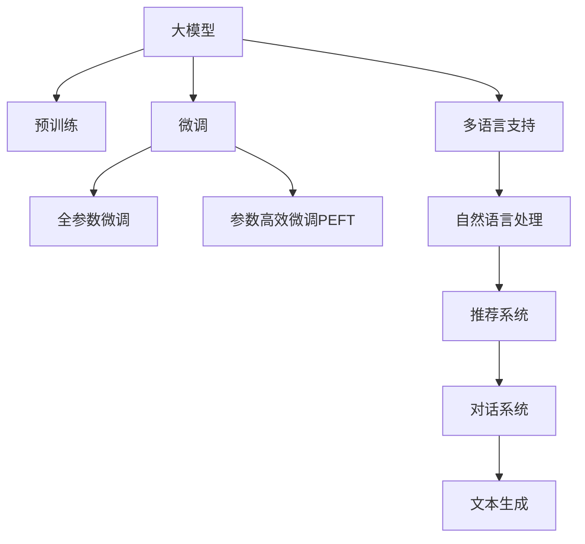

                 

# 电商平台中的AI大模型：从单一语言到多语言支持

> 关键词：
- 大模型
- 多语言
- 自然语言处理
- 电商平台
- 跨语言
- 用户个性化
- 推荐系统
- 文本分类
- 对话系统

## 1. 背景介绍

### 1.1 问题由来

随着全球化商业的不断深入，电商平台正在成为连接全球消费者和商家的重要桥梁。然而，语言障碍仍然是影响跨境电商发展的显著因素。传统的多语言支持通常依赖于昂贵的人工翻译，且效率低下，难以满足日益增长的国际化需求。为了应对这一挑战，AI大模型为电商平台带来了新的希望。

大模型通过在海量数据上进行自监督学习，学习到了丰富的语言知识和语义表示能力，具备跨语言理解和生成能力。利用大模型，电商平台可以在单一语言和多种语言之间实现无缝转换，不仅提升了用户体验，也极大地降低了多语言处理的成本。

### 1.2 问题核心关键点

目前，大模型在电商平台的应用主要集中在以下几个方面：

- **自然语言处理(NLP)**：通过文本分类、情感分析、意图识别等技术，为电商平台提供强大的用户理解能力。
- **推荐系统**：利用用户行为数据和文本信息，实现个性化商品推荐，提升转化率和用户体验。
- **对话系统**：构建多语言客服系统，实现人机对话，提升客户服务效率和满意度。
- **文本生成**：自动生成商品描述、广告文案等，提升内容创作的效率和质量。

通过大模型的应用，电商平台能够更好地满足全球用户的语言需求，提供更加智能和高效的服务体验。

### 1.3 问题研究意义

大模型在电商平台中的应用，对电商行业的数字化转型具有重要意义：

1. **降低成本**：替代传统的多语言翻译方式，减少人工翻译成本。
2. **提升效率**：大模型能够快速处理海量文本，提升业务处理速度。
3. **增强用户体验**：提供多语言支持，满足全球用户的多元化需求。
4. **数据驱动决策**：基于用户行为数据和文本信息，实现精准营销和个性化推荐。
5. **促进国际化**：推动电商平台业务全球化，拓展市场空间。

大模型的应用，为电商平台提供了更加智能化、高效化的解决方案，促进了电商行业的数字化、智能化发展。

## 2. 核心概念与联系

### 2.1 核心概念概述

为了更好地理解大模型在电商平台中的应用，本节将介绍几个密切相关的核心概念：

- **大模型(Large Language Model, LLM)**：指基于Transformer架构的语言模型，如GPT、BERT等。通过在海量数据上进行自监督预训练，学习到了丰富的语言知识和语义表示能力。
- **预训练(Pre-training)**：指在大规模无标签文本数据上进行自监督学习，学习语言表示的过程。常见预训练任务包括掩码语言建模、自编码器等。
- **微调(Fine-tuning)**：指在预训练模型的基础上，使用有标签数据进行任务特定的优化，使其适应特定任务。
- **多语言支持(Multilingual Support)**：指在单一语言和多种语言之间实现无缝转换和理解。
- **自然语言处理(NLP)**：指处理、分析和生成人类语言的技术，涉及文本分类、情感分析、意图识别等。
- **推荐系统(Recommendation System)**：利用用户行为数据和文本信息，为用户提供个性化推荐。
- **对话系统(Chatbot)**：利用NLP技术构建的人机对话系统，提供客户服务。
- **文本生成(Text Generation)**：利用语言模型自动生成文本内容，如商品描述、广告文案等。

这些核心概念之间的逻辑关系可以通过以下Mermaid流程图来展示：



这个流程图展示了核心概念之间的联系：大模型通过预训练学习语言表示，通过微调适应特定任务，支持多语言处理，结合NLP技术提升用户体验，实现推荐和对话等功能，自动生成文本内容。

## 3. 核心算法原理 & 具体操作步骤

### 3.1 算法原理概述

大模型在电商平台中的应用，主要依赖于以下几个核心算法：

- **自然语言处理(NLP)**：通过文本分类、情感分析、意图识别等技术，为电商平台提供强大的用户理解能力。
- **推荐系统**：利用用户行为数据和文本信息，实现个性化商品推荐，提升转化率和用户体验。
- **对话系统**：构建多语言客服系统，实现人机对话，提升客户服务效率和满意度。
- **文本生成**：自动生成商品描述、广告文案等，提升内容创作的效率和质量。

这些算法的基础是大模型对语言的理解和生成能力，通过预训练和微调过程，使得模型能够适应特定任务，提供高效的服务。

### 3.2 算法步骤详解

#### 3.2.1 自然语言处理(NLP)

自然语言处理(NLP)在大模型中的应用主要包括以下几个步骤：

1. **数据收集**：收集电商平台上的文本数据，如商品描述、用户评论、搜索记录等。
2. **预处理**：对文本数据进行分词、去停用词、词形还原等预处理操作。
3. **特征提取**：利用词向量、TF-IDF等方法将文本转换为向量表示。
4. **模型训练**：使用预训练模型进行微调，学习特定任务的表示。
5. **推理预测**：将新文本输入模型，得到相应的分类结果或情感分析结果。

#### 3.2.2 推荐系统

推荐系统在大模型中的应用主要包括以下几个步骤：

1. **数据收集**：收集用户行为数据和商品信息。
2. **特征提取**：将用户行为数据和商品信息转换为向量表示。
3. **模型训练**：使用预训练模型进行微调，学习用户行为和商品之间的关系。
4. **推理预测**：根据用户行为数据和商品信息，生成推荐结果。

#### 3.2.3 对话系统

对话系统在大模型中的应用主要包括以下几个步骤：

1. **数据收集**：收集用户与客服之间的对话记录。
2. **预处理**：对对话数据进行去噪、去重、分句等预处理操作。
3. **模型训练**：使用预训练模型进行微调，学习对话生成能力。
4. **推理预测**：根据用户输入，生成回复。

#### 3.2.4 文本生成

文本生成在大模型中的应用主要包括以下几个步骤：

1. **数据收集**：收集商品描述、广告文案等文本数据。
2. **预处理**：对文本数据进行分词、去停用词等预处理操作。
3. **模型训练**：使用预训练模型进行微调，学习文本生成能力。
4. **推理预测**：根据输入文本，生成新的文本内容。

### 3.3 算法优缺点

大模型在电商平台中的应用具有以下优点：

- **高效性**：大模型能够快速处理海量文本，提升业务处理速度。
- **低成本**：替代传统的多语言翻译方式，减少人工翻译成本。
- **多功能性**：能够支持自然语言处理、推荐系统、对话系统、文本生成等多种功能。
- **高度定制化**：通过微调，大模型能够适应特定电商平台的业务需求。

同时，大模型在电商平台中的应用也存在以下局限性：

- **资源消耗大**：大模型的计算和存储需求较高，对硬件设施要求严格。
- **模型训练时间长**：预训练和微调过程需要大量的计算资源和时间。
- **数据隐私风险**：电商平台上涉及大量敏感用户数据，需要谨慎处理隐私问题。
- **模型鲁棒性不足**：在面对噪声数据和攻击时，模型的鲁棒性不足。

### 3.4 算法应用领域

大模型在电商平台中的应用非常广泛，涵盖以下几个主要领域：

1. **商品搜索**：通过文本分类和意图识别技术，提升商品搜索的准确性和个性化。
2. **个性化推荐**：利用用户行为数据和文本信息，实现精准推荐。
3. **客服系统**：构建多语言客服系统，提升客户服务效率。
4. **广告文案生成**：自动生成商品广告文案，提升广告效果。
5. **舆情分析**：分析用户评论和反馈，提升产品和服务质量。

这些应用领域展示了大模型在电商平台中的强大潜力和广泛应用前景。

## 4. 数学模型和公式 & 详细讲解 & 举例说明

### 4.1 数学模型构建

假设大模型为 $M_{\theta}$，其中 $\theta$ 为模型参数。假设电商平台上的文本数据为 $D=\{x_1, x_2, ..., x_N\}$，每个文本 $x_i$ 的长度为 $l_i$。预训练模型为 $M_{\theta}$，初始化参数为 $\theta_0$。

定义模型 $M_{\theta}$ 在输入 $x$ 上的预测概率为 $p(y|x; \theta)$，其中 $y$ 为输出标签，$x$ 为输入文本。则电商平台上的自然语言处理任务可以表示为：

$$
\min_{\theta} \sum_{i=1}^N L_i(p(y_i|x_i; \theta), y_i)
$$

其中 $L_i$ 为损失函数，用于衡量预测结果和真实标签之间的差异。常见损失函数包括交叉熵损失、均方误差损失等。

### 4.2 公式推导过程

以文本分类任务为例，使用交叉熵损失函数进行推导：

$$
L_i(p(y_i|x_i; \theta), y_i) = -\sum_{k=1}^K y_{ik} \log p(y_k|x_i; \theta)
$$

其中 $K$ 为类别数，$y_{ik}$ 为文本 $x_i$ 属于第 $k$ 类别的真实标签。则电商平台上的自然语言处理任务可以表示为：

$$
\min_{\theta} \sum_{i=1}^N \sum_{k=1}^K y_{ik} \log \frac{p(y_k|x_i; \theta)}{\sum_{j=1}^K p(y_j|x_i; \theta)}
$$

在得到损失函数之后，可以带入优化算法，如梯度下降算法，更新模型参数 $\theta$，最小化损失函数，实现模型的微调。

### 4.3 案例分析与讲解

以电商平台上的个性化推荐为例，展示大模型如何实现推荐系统：

1. **数据收集**：收集用户行为数据 $D_u = \{(u_i, v_i)\}_{i=1}^N$，其中 $u_i$ 为用户ID，$v_i$ 为历史行为序列。
2. **特征提取**：将用户行为序列和商品信息 $I_i$ 转换为向量表示 $V_{u_i}$ 和 $I_{i}$。
3. **模型训练**：使用预训练模型进行微调，学习用户行为和商品之间的关系 $p(V_{u_i}, I_i|I_j, I_k)$。
4. **推理预测**：根据新用户行为 $V_{u'}$，生成推荐商品序列 $I_{re}$。

## 5. 项目实践：代码实例和详细解释说明

### 5.1 开发环境搭建

在进行大模型应用实践前，我们需要准备好开发环境。以下是使用Python进行PyTorch开发的环境配置流程：

1. 安装Anaconda：从官网下载并安装Anaconda，用于创建独立的Python环境。

2. 创建并激活虚拟环境：
```bash
conda create -n pytorch-env python=3.8 
conda activate pytorch-env
```

3. 安装PyTorch：根据CUDA版本，从官网获取对应的安装命令。例如：
```bash
conda install pytorch torchvision torchaudio cudatoolkit=11.1 -c pytorch -c conda-forge
```

4. 安装Transformers库：
```bash
pip install transformers
```

5. 安装各类工具包：
```bash
pip install numpy pandas scikit-learn matplotlib tqdm jupyter notebook ipython
```

完成上述步骤后，即可在`pytorch-env`环境中开始应用实践。

### 5.2 源代码详细实现

下面我们以电商平台上的文本分类任务为例，给出使用Transformers库对BERT模型进行微调的PyTorch代码实现。

首先，定义文本分类任务的数据处理函数：

```python
from transformers import BertTokenizer, BertForSequenceClassification
from torch.utils.data import Dataset
import torch

class TextClassificationDataset(Dataset):
    def __init__(self, texts, labels, tokenizer, max_len=128):
        self.texts = texts
        self.labels = labels
        self.tokenizer = tokenizer
        self.max_len = max_len
        
    def __len__(self):
        return len(self.texts)
    
    def __getitem__(self, item):
        text = self.texts[item]
        label = self.labels[item]
        
        encoding = self.tokenizer(text, return_tensors='pt', max_length=self.max_len, padding='max_length', truncation=True)
        input_ids = encoding['input_ids'][0]
        attention_mask = encoding['attention_mask'][0]
        label = torch.tensor(label, dtype=torch.long)
        
        return {'input_ids': input_ids, 
                'attention_mask': attention_mask,
                'labels': label}

# 创建dataset
tokenizer = BertTokenizer.from_pretrained('bert-base-cased')

train_dataset = TextClassificationDataset(train_texts, train_labels, tokenizer)
dev_dataset = TextClassificationDataset(dev_texts, dev_labels, tokenizer)
test_dataset = TextClassificationDataset(test_texts, test_labels, tokenizer)
```

然后，定义模型和优化器：

```python
from transformers import AdamW

model = BertForSequenceClassification.from_pretrained('bert-base-cased', num_labels=num_labels)

optimizer = AdamW(model.parameters(), lr=2e-5)
```

接着，定义训练和评估函数：

```python
from torch.utils.data import DataLoader
from tqdm import tqdm
from sklearn.metrics import accuracy_score

device = torch.device('cuda') if torch.cuda.is_available() else torch.device('cpu')
model.to(device)

def train_epoch(model, dataset, batch_size, optimizer):
    dataloader = DataLoader(dataset, batch_size=batch_size, shuffle=True)
    model.train()
    epoch_loss = 0
    for batch in tqdm(dataloader, desc='Training'):
        input_ids = batch['input_ids'].to(device)
        attention_mask = batch['attention_mask'].to(device)
        labels = batch['labels'].to(device)
        model.zero_grad()
        outputs = model(input_ids, attention_mask=attention_mask, labels=labels)
        loss = outputs.loss
        epoch_loss += loss.item()
        loss.backward()
        optimizer.step()
    return epoch_loss / len(dataloader)

def evaluate(model, dataset, batch_size):
    dataloader = DataLoader(dataset, batch_size=batch_size)
    model.eval()
    preds, labels = [], []
    with torch.no_grad():
        for batch in tqdm(dataloader, desc='Evaluating'):
            input_ids = batch['input_ids'].to(device)
            attention_mask = batch['attention_mask'].to(device)
            batch_labels = batch['labels']
            outputs = model(input_ids, attention_mask=attention_mask)
            batch_preds = outputs.logits.argmax(dim=2).to('cpu').tolist()
            batch_labels = batch_labels.to('cpu').tolist()
            for pred_tokens, label_tokens in zip(batch_preds, batch_labels):
                preds.append(pred_tokens)
                labels.append(label_tokens)
                
    print(accuracy_score(labels, preds))
```

最后，启动训练流程并在测试集上评估：

```python
epochs = 5
batch_size = 16

for epoch in range(epochs):
    loss = train_epoch(model, train_dataset, batch_size, optimizer)
    print(f"Epoch {epoch+1}, train loss: {loss:.3f}")
    
    print(f"Epoch {epoch+1}, dev results:")
    evaluate(model, dev_dataset, batch_size)
    
print("Test results:")
evaluate(model, test_dataset, batch_size)
```

以上就是使用PyTorch对BERT进行文本分类任务微调的完整代码实现。可以看到，得益于Transformers库的强大封装，我们可以用相对简洁的代码完成BERT模型的加载和微调。

### 5.3 代码解读与分析

让我们再详细解读一下关键代码的实现细节：

**TextClassificationDataset类**：
- `__init__`方法：初始化文本、标签、分词器等关键组件。
- `__len__`方法：返回数据集的样本数量。
- `__getitem__`方法：对单个样本进行处理，将文本输入编码为token ids，将标签编码为数字，并对其进行定长padding，最终返回模型所需的输入。

**训练和评估函数**：
- 使用PyTorch的DataLoader对数据集进行批次化加载，供模型训练和推理使用。
- 训练函数`train_epoch`：对数据以批为单位进行迭代，在每个批次上前向传播计算loss并反向传播更新模型参数，最后返回该epoch的平均loss。
- 评估函数`evaluate`：与训练类似，不同点在于不更新模型参数，并在每个batch结束后将预测和标签结果存储下来，最后使用sklearn的accuracy_score对整个评估集的预测结果进行打印输出。

**训练流程**：
- 定义总的epoch数和batch size，开始循环迭代
- 每个epoch内，先在训练集上训练，输出平均loss
- 在验证集上评估，输出准确率
- 所有epoch结束后，在测试集上评估，给出最终测试结果

可以看到，PyTorch配合Transformers库使得BERT微调的代码实现变得简洁高效。开发者可以将更多精力放在数据处理、模型改进等高层逻辑上，而不必过多关注底层的实现细节。

当然，工业级的系统实现还需考虑更多因素，如模型的保存和部署、超参数的自动搜索、更灵活的任务适配层等。但核心的微调范式基本与此类似。

## 6. 实际应用场景

### 6.1 智能客服系统

基于大模型的智能客服系统，可以广泛应用于电商平台的用户服务。传统客服往往需要配备大量人力，高峰期响应缓慢，且一致性和专业性难以保证。而使用大模型的智能客服系统，可以7x24小时不间断服务，快速响应客户咨询，用自然流畅的语言解答各类常见问题。

在技术实现上，可以收集电商平台的用户咨询记录，将问题-答案对作为微调数据，训练模型学习匹配答案。对于客户提出的新问题，还可以接入检索系统实时搜索相关内容，动态组织生成回答。如此构建的智能客服系统，能大幅提升客户咨询体验和问题解决效率。

### 6.2 个性化推荐系统

当前的推荐系统往往只依赖用户的历史行为数据进行物品推荐，无法深入理解用户的真实兴趣偏好。基于大模型的推荐系统可以更好地挖掘用户行为背后的语义信息，从而实现个性化推荐。

在实践中，可以收集用户浏览、点击、评论、分享等行为数据，提取和商品交互的物品标题、描述、标签等文本内容。将文本内容作为模型输入，用户的后续行为（如是否点击、购买等）作为监督信号，在此基础上微调预训练语言模型。微调后的模型能够从文本内容中准确把握用户的兴趣点。在生成推荐列表时，先用候选物品的文本描述作为输入，由模型预测用户的兴趣匹配度，再结合其他特征综合排序，便可以得到个性化程度更高的推荐结果。

### 6.3 广告文案生成

大模型可以自动生成商品描述、广告文案等文本内容，提升内容创作的效率和质量。在电商平台上，通过收集商品信息，利用大模型生成富有吸引力的广告文案，可以显著提升广告点击率和转化率。

具体而言，可以定义广告文案的格式和样式，训练模型学习生成符合格式的文本。对于新的商品信息，通过微调模型生成相应的广告文案，并进行A/B测试，选择效果最佳的版本。

### 6.4 未来应用展望

随着大模型和微调方法的不断发展，基于大模型的方法将在更多领域得到应用，为电商行业的数字化转型提供新的动力。

在智慧物流领域，利用大模型优化仓储管理、配送路线等流程，提升物流效率和用户体验。

在个性化营销中，基于用户画像和行为数据，定制化推荐商品、优惠券等，提升用户粘性和复购率。

在金融风控中，利用大模型进行风险评估和欺诈检测，降低金融风险。

此外，在企业服务、娱乐产业等众多领域，基于大模型的人工智能应用也将不断涌现，为电商平台的业务创新提供新的技术路径。

## 7. 工具和资源推荐

### 7.1 学习资源推荐

为了帮助开发者系统掌握大模型在电商平台中的应用理论基础和实践技巧，这里推荐一些优质的学习资源：

1. 《自然语言处理入门》系列博文：深入浅出地介绍了自然语言处理的基本概念和常用技术，涵盖文本分类、情感分析、意图识别等。

2. 《深度学习与自然语言处理》课程：斯坦福大学开设的NLP明星课程，系统讲解了NLP的基本原理和前沿技术，并提供丰富的实践机会。

3. 《自然语言处理工具与技术》书籍：详细介绍了各种NLP工具和技术的实现原理，包括BERT、GPT等预训练模型，以及微调方法。

4. HuggingFace官方文档：提供了丰富的预训练语言模型资源和微调样例代码，是学习大模型应用的必备资料。

5. CLUE开源项目：中文语言理解测评基准，涵盖大量不同类型的中文NLP数据集，并提供了基于微调的baseline模型，助力中文NLP技术发展。

通过对这些资源的学习实践，相信你一定能够快速掌握大模型在电商平台中的应用精髓，并用于解决实际的NLP问题。

### 7.2 开发工具推荐

高效的开发离不开优秀的工具支持。以下是几款用于大模型应用的常用工具：

1. PyTorch：基于Python的开源深度学习框架，灵活动态的计算图，适合快速迭代研究。大部分预训练语言模型都有PyTorch版本的实现。

2. TensorFlow：由Google主导开发的开源深度学习框架，生产部署方便，适合大规模工程应用。同样有丰富的预训练语言模型资源。

3. Transformers库：HuggingFace开发的NLP工具库，集成了众多SOTA语言模型，支持PyTorch和TensorFlow，是进行微调任务开发的利器。

4. Weights & Biases：模型训练的实验跟踪工具，可以记录和可视化模型训练过程中的各项指标，方便对比和调优。与主流深度学习框架无缝集成。

5. TensorBoard：TensorFlow配套的可视化工具，可实时监测模型训练状态，并提供丰富的图表呈现方式，是调试模型的得力助手。

6. Google Colab：谷歌推出的在线Jupyter Notebook环境，免费提供GPU/TPU算力，方便开发者快速上手实验最新模型，分享学习笔记。

合理利用这些工具，可以显著提升大模型应用开发的效率，加快创新迭代的步伐。

### 7.3 相关论文推荐

大模型在电商平台中的应用源于学界的持续研究。以下是几篇奠基性的相关论文，推荐阅读：

1. Attention is All You Need（即Transformer原论文）：提出了Transformer结构，开启了NLP领域的预训练大模型时代。

2. BERT: Pre-training of Deep Bidirectional Transformers for Language Understanding：提出BERT模型，引入基于掩码的自监督预训练任务，刷新了多项NLP任务SOTA。

3. Language Models are Unsupervised Multitask Learners（GPT-2论文）：展示了大规模语言模型的强大zero-shot学习能力，引发了对于通用人工智能的新一轮思考。

4. Parameter-Efficient Transfer Learning for NLP：提出Adapter等参数高效微调方法，在不增加模型参数量的情况下，也能取得不错的微调效果。

5. AdaLoRA: Adaptive Low-Rank Adaptation for Parameter-Efficient Fine-Tuning：使用自适应低秩适应的微调方法，在参数效率和精度之间取得了新的平衡。

这些论文代表了大模型应用在电商平台中的发展脉络。通过学习这些前沿成果，可以帮助研究者把握学科前进方向，激发更多的创新灵感。

## 8. 总结：未来发展趋势与挑战

### 8.1 总结

本文对大模型在电商平台中的应用进行了全面系统的介绍。首先阐述了大模型和微调技术的研究背景和意义，明确了电商平台的数字化转型需求。其次，从原理到实践，详细讲解了大模型在电商平台中的核心算法和具体操作步骤，给出了微调任务开发的完整代码实例。同时，本文还广泛探讨了电商平台上大模型的应用场景，展示了其强大的潜力和广泛的应用前景。

通过本文的系统梳理，可以看到，大模型在电商平台中的应用为电商行业的数字化转型提供了全新的解决方案。借助大模型的自然语言处理、推荐系统、对话系统、文本生成等功能，电商平台能够更好地满足全球用户的语言需求，提供更加智能和高效的服务体验。

### 8.2 未来发展趋势

展望未来，大模型在电商平台中的应用将呈现以下几个发展趋势：

1. **多语言支持提升**：随着大模型在多语言处理上的不断突破，电商平台将能够更便捷地支持多语言服务，拓展国际市场。
2. **跨领域融合**：大模型将与物联网、人工智能等技术深度融合，构建更加智能化的电商平台。
3. **数据驱动决策**：基于用户行为数据和文本信息，实现更加精准的个性化推荐和营销策略。
4. **安全性增强**：引入数据脱敏、隐私保护等技术，提升电商平台的隐私保护能力。
5. **用户交互升级**：通过多语言对话系统，提升客户服务效率和用户体验。

这些趋势将推动大模型在电商平台中的应用不断深化，为电商行业的数字化转型带来新的机遇和挑战。

### 8.3 面临的挑战

尽管大模型在电商平台中的应用取得了显著成效，但在迈向更加智能化、普适化应用的过程中，仍面临以下挑战：

1. **数据隐私问题**：电商平台涉及大量敏感用户数据，数据隐私和合规问题需谨慎处理。
2. **模型鲁棒性不足**：在面对噪声数据和攻击时，模型的鲁棒性需进一步提升。
3. **计算资源限制**：大模型的计算和存储需求较高，硬件设施需持续优化。
4. **模型泛化能力**：模型需具备更强的泛化能力，适应电商平台上多变的业务需求。
5. **用户信任建立**：需在用户信任和隐私保护之间找到平衡，提升用户对人工智能技术的接受度。

这些挑战需要行业各方共同努力，通过技术创新和政策规范，逐步解决。

### 8.4 研究展望

面对大模型在电商平台中的面临的挑战，未来的研究需要在以下几个方面寻求新的突破：

1. **多语言处理提升**：开发更高效的跨语言处理技术，提升多语言支持的准确性和流畅度。
2. **模型优化策略**：引入更多优化技术，如自适应学习率、混合精度训练等，提升模型训练效率和推理速度。
3. **数据隐私保护**：引入联邦学习、差分隐私等技术，保护用户隐私和数据安全。
4. **跨领域应用拓展**：将大模型应用于更多领域，推动电商平台的跨领域融合和业务创新。
5. **用户交互优化**：构建更加智能化的对话系统，提升客户服务效率和满意度。

这些研究方向将进一步推动大模型在电商平台中的应用，为电商行业的数字化转型提供新的动力。

## 9. 附录：常见问题与解答

**Q1：大模型在电商平台上是否适用于所有任务？**

A: 大模型在电商平台上能够适用于大多数NLP任务，如文本分类、情感分析、意图识别等。但对于一些特定领域的任务，如医学、法律等，仅依靠通用语料预训练的模型可能难以很好地适应。此时需要在特定领域语料上进一步预训练，再进行微调，才能获得理想效果。

**Q2：大模型在电商平台上是否存在计算和存储瓶颈？**

A: 大模型的计算和存储需求较高，对硬件设施要求严格。但是随着技术的发展，如模型压缩、量化加速等技术的应用，可以缓解这一问题。同时，可以通过云服务等方式降低硬件成本。

**Q3：大模型在电商平台上如何处理噪声数据？**

A: 大模型在处理噪声数据时，可以通过引入正则化技术、对抗训练等方法，提高模型的鲁棒性。同时，可以通过数据清洗、预处理等手段，降低噪声数据的影响。

**Q4：大模型在电商平台上如何保证用户隐私？**

A: 电商平台上涉及大量敏感用户数据，需引入数据脱敏、隐私保护等技术，保护用户隐私和数据安全。同时，需制定明确的隐私政策，确保用户知情同意。

**Q5：大模型在电商平台上如何进行跨领域迁移学习？**

A: 大模型可以通过跨领域微调，适应不同领域的NLP任务。在特定领域上，可以进行领域自适应微调，进一步提升模型在特定领域的表现。

这些问答内容可以帮助开发者更好地理解大模型在电商平台中的应用，解决实际问题。

