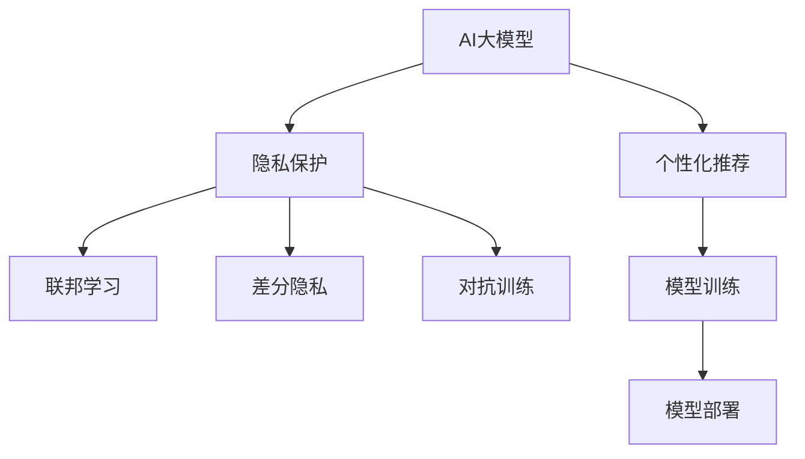

                 

# 电商平台中的AI大模型：隐私保护与个性化的平衡

## 1. 背景介绍

### 1.1 问题由来

随着人工智能（AI）技术的迅猛发展，电商平台越来越多地引入AI模型，以提高用户体验和运营效率。AI大模型，如BERT、GPT等，在个性化推荐、智能客服、内容生成等方面展示了巨大的潜力。然而，在提供这些智能化服务的同时，隐私保护和数据安全问题变得愈发重要，需要在模型设计和应用中加以妥善处理。

### 1.2 问题核心关键点

在电商平台中，AI大模型的应用面临两个核心挑战：隐私保护和个性化推荐。隐私保护要求用户数据得到合理处理，防止数据泄露和滥用；个性化推荐则需利用用户行为数据，提升用户体验和满意度。这两个目标在AI大模型的设计和应用中往往存在矛盾，如何找到平衡点，是平台面临的关键问题。

### 1.3 问题研究意义

本研究旨在探讨在电商平台中应用AI大模型时，如何平衡隐私保护与个性化推荐。这不仅有助于提升用户体验和运营效率，还能增强用户信任，促进电商平台的健康发展。通过研究这一问题，我们可以提出更符合用户需求和法律法规的AI应用方案，推动AI技术的良性发展。

## 2. 核心概念与联系

### 2.1 核心概念概述

为更好地理解在电商平台中应用AI大模型的方法，我们首先介绍几个核心概念：

- **AI大模型**：以BERT、GPT等预训练模型为代表的深度学习模型，通过在大规模无标签数据上进行预训练，获得了广泛的通用知识，能够进行自然语言处理、图像识别、语音识别等多种任务。

- **个性化推荐**：利用用户的历史行为数据，预测其未来需求，提供个性化商品推荐，提升用户满意度和平台转化率。

- **隐私保护**：在AI模型训练和应用过程中，采取多种措施保护用户数据，防止数据泄露、滥用和非法访问。

- **联邦学习**：一种分布式机器学习框架，允许多个参与方在不共享原始数据的情况下，共同训练一个全局模型，保护数据隐私。

- **差分隐私**：一种隐私保护技术，通过在数据中引入噪声，使得攻击者无法通过单个样本推断出用户隐私信息。

- **对抗训练**：通过引入对抗样本，增强模型的鲁棒性和泛化能力，防止模型在对抗性攻击下崩溃。

这些概念通过以下Mermaid流程图展示了它们之间的联系：



此图展示了AI大模型在电商平台中的应用流程，从数据收集、模型训练到模型部署，隐私保护和个性化推荐在各个环节中都有体现。

## 3. 核心算法原理 & 具体操作步骤

### 3.1 算法原理概述

AI大模型在电商平台中的应用通常涉及以下步骤：

1. **数据收集**：收集用户行为数据，如浏览记录、购买历史、评价等。
2. **预训练**：在大规模无标签数据上进行预训练，获得通用的语言模型。
3. **微调**：利用平台的数据集，对预训练模型进行微调，训练出适应平台需求的模型。
4. **个性化推荐**：基于微调后的模型，提供个性化的商品推荐。
5. **隐私保护**：在模型训练和应用过程中，采取隐私保护措施，保护用户数据安全。

### 3.2 算法步骤详解

以下详细介绍每个步骤的具体操作：

#### 3.2.1 数据收集

数据收集是AI大模型应用的基础。电商平台通常会收集用户的浏览、点击、购买等行为数据。这些数据需要经过预处理，如去噪、归一化、特征工程等步骤，以便用于模型训练。

#### 3.2.2 预训练

预训练是使用大规模无标签数据，训练通用语言模型。预训练模型如BERT、GPT等，通过在大规模文本数据上进行自监督学习，获得对语言的深刻理解。

#### 3.2.3 微调

微调是利用平台数据集，对预训练模型进行有监督学习，以适应平台的具体需求。微调过程中，需选择合适的学习率、优化算法、正则化技术等，以避免过拟合和欠拟合问题。

#### 3.2.4 个性化推荐

个性化推荐系统利用微调后的模型，对用户行为进行分析和预测，提供个性化的商品推荐。推荐系统的评估指标包括点击率、转化率、用户满意度等。

#### 3.2.5 隐私保护

隐私保护在AI大模型的应用中至关重要。在模型训练和应用过程中，需采取隐私保护技术，如差分隐私、联邦学习、对抗训练等，以防止数据泄露和滥用。

### 3.3 算法优缺点

#### 3.3.1 优点

- **提高用户满意度**：通过个性化推荐，电商平台能够提供更加符合用户需求的商品，提升用户满意度和平台转化率。
- **降低运营成本**：自动化推荐系统可以显著降低人力运营成本，提高运营效率。
- **提升数据利用率**：利用AI大模型进行数据挖掘和分析，能够从大量用户数据中提取有价值的信息。

#### 3.3.2 缺点

- **数据隐私风险**：用户数据在模型训练和应用过程中可能存在泄露风险，需采取隐私保护措施。
- **模型复杂性**：AI大模型通常具有较高的计算复杂度，对硬件资源要求较高。
- **模型解释性差**：AI大模型通常是黑盒模型，难以解释其内部决策逻辑。

### 3.4 算法应用领域

AI大模型在电商平台中的应用广泛，主要体现在以下几个领域：

- **个性化推荐**：利用用户行为数据，预测用户需求，提供个性化商品推荐。
- **智能客服**：利用自然语言处理技术，自动解答用户问题，提高客服效率。
- **内容生成**：自动生成商品描述、营销文案等内容，提升平台内容质量。
- **风险控制**：利用模型预测交易风险，防止欺诈行为，保护平台和用户安全。

## 4. 数学模型和公式 & 详细讲解

### 4.1 数学模型构建

在电商平台中，AI大模型的应用通常涉及以下数学模型：

1. **用户行为模型**：描述用户在不同商品上的行为，如浏览、点击、购买等。
2. **推荐模型**：基于用户行为数据，预测用户对商品的需求。
3. **对抗攻击模型**：描述对抗样本对模型的影响，确保模型在对抗攻击下仍能保持稳定性。

### 4.2 公式推导过程

以推荐模型为例，假设用户行为数据为 $\mathbf{x} = (x_1, x_2, ..., x_n)$，商品特征数据为 $\mathbf{y} = (y_1, y_2, ..., y_m)$。推荐模型可以表示为：

$$
\hat{\mathbf{y}} = \mathbf{W} \mathbf{x} + \mathbf{b}
$$

其中 $\mathbf{W}$ 为权重矩阵，$\mathbf{b}$ 为偏置向量。推荐模型的损失函数通常为均方误差（Mean Squared Error, MSE）：

$$
\mathcal{L} = \frac{1}{N} \sum_{i=1}^{N} (\hat{y}_i - y_i)^2
$$

### 4.3 案例分析与讲解

以电商平台中的个性化推荐为例，假设有一家电商平台的推荐系统，通过AI大模型进行推荐。该模型在大量用户数据上进行预训练，并在平台数据上进行微调。模型的训练流程可以表示为：

1. **数据收集**：收集用户浏览、点击、购买等行为数据。
2. **预训练**：在大规模无标签数据上训练通用语言模型。
3. **微调**：利用平台数据集，对预训练模型进行有监督学习。
4. **评估**：在验证集上评估模型的性能，调整模型参数。
5. **部署**：将微调后的模型部署到推荐系统中，提供个性化推荐服务。

## 5. 项目实践：代码实例和详细解释说明

### 5.1 开发环境搭建

在实践中，我们通常使用Python和TensorFlow或PyTorch进行AI模型的开发。以下是开发环境的搭建步骤：

1. 安装Python和相关依赖库，如TensorFlow或PyTorch。
2. 安装数据处理库，如Pandas、NumPy等。
3. 安装模型库，如Keras、TensorFlow、PyTorch等。

### 5.2 源代码详细实现

以下是一个使用TensorFlow进行推荐系统微调的示例代码：

```python
import tensorflow as tf
from tensorflow.keras.layers import Dense, Input, Embedding, Concatenate
from tensorflow.keras.models import Model

# 定义输入层
user_input = Input(shape=(1,))
item_input = Input(shape=(1,))

# 定义用户行为嵌入层
user_embedding = Embedding(input_dim=num_users, output_dim=embedding_dim)(user_input)
user_embedding = tf.keras.layers.GlobalAveragePooling1D()(user_embedding)

# 定义商品特征嵌入层
item_embedding = Embedding(input_dim=num_items, output_dim=embedding_dim)(item_input)
item_embedding = tf.keras.layers.GlobalAveragePooling1D()(item_embedding)

# 定义全连接层
concatenated = Concatenate()([user_embedding, item_embedding])
dense = Dense(units=1, activation='sigmoid')(concatenated)

# 定义推荐模型
model = Model(inputs=[user_input, item_input], outputs=dense)

# 编译模型
model.compile(optimizer=tf.keras.optimizers.Adam(), loss='binary_crossentropy')

# 训练模型
model.fit([user_data, item_data], target_data, epochs=num_epochs, batch_size=batch_size)
```

### 5.3 代码解读与分析

上述代码实现了基于用户行为数据和商品特征数据的推荐模型。代码中，我们首先定义了用户输入和商品输入的嵌入层，然后使用全连接层进行特征融合，最后通过sigmoid激活函数输出预测结果。模型使用Adam优化器和二元交叉熵损失函数进行编译和训练。

### 5.4 运行结果展示

在训练完成后，我们可以使用测试集对模型进行评估：

```python
test_loss, test_acc = model.evaluate([test_user_data, test_item_data], test_target_data)
print('Test accuracy:', test_acc)
```

## 6. 实际应用场景

### 6.1 个性化推荐

在个性化推荐场景中，AI大模型可以显著提升推荐系统的准确性和多样性。通过微调后的模型，电商平台能够根据用户历史行为数据，预测其未来需求，提供更加精准和个性化的商品推荐。

### 6.2 智能客服

智能客服系统利用AI大模型进行自然语言处理，自动解答用户问题，提供24小时不间断的客服服务。通过微调后的模型，智能客服能够更好地理解和回答用户问题，提升用户体验和满意度。

### 6.3 内容生成

电商平台的商品描述、营销文案等内容通常由机器自动生成。通过AI大模型进行内容生成，电商平台能够快速生成高质量的商品描述，提升平台内容质量和用户阅读体验。

### 6.4 未来应用展望

未来，AI大模型将在电商平台中发挥更加重要的作用。随着技术的不断进步，AI模型将更加智能化、个性化和人性化，能够更好地满足用户需求，提升电商平台的用户体验和运营效率。

## 7. 工具和资源推荐

### 7.1 学习资源推荐

为了更好地掌握在电商平台中应用AI大模型的技术和方法，推荐以下学习资源：

1. **《深度学习》**（Ian Goodfellow著）：详细介绍了深度学习的基本原理和算法，适合初学者入门。
2. **《TensorFlow官方文档》**：提供了TensorFlow的详细使用指南和示例代码，适合实践开发。
3. **《PyTorch官方文档》**：提供了PyTorch的详细使用指南和示例代码，适合实践开发。
4. **《联邦学习：从理论到算法》**（Deng Cai, Wen Sun, Ke Chen著）：介绍了联邦学习的理论和算法，适合研究者深入学习。
5. **《差分隐私：一种隐私保护技术》**（Cynthia Dwork著）：介绍了差分隐私的基本原理和算法，适合研究者深入学习。

### 7.2 开发工具推荐

在实践中，常用的开发工具包括：

1. **TensorFlow**：由Google开发的深度学习框架，支持分布式计算和模型优化。
2. **PyTorch**：由Facebook开发的深度学习框架，支持动态计算图和自动微分。
3. **Keras**：高层次的深度学习框架，支持快速原型开发和模型部署。
4. **Jupyter Notebook**：交互式开发环境，适合进行数据分析和模型训练。
5. **Google Colab**：免费的在线开发环境，适合进行模型实验和分享笔记。

### 7.3 相关论文推荐

为了更好地了解在电商平台中应用AI大模型的最新研究进展，推荐以下相关论文：

1. **《深度学习中的联邦学习》**（Aijaz Hussain, Yunqing Xiong, Dian Zeng等）：介绍了联邦学习在深度学习中的实现和应用。
2. **《差分隐私保护下的深度学习》**（Guangchen Jin, Chunxiao Guo, Yang Li等）：介绍了差分隐私保护深度学习的方法和应用。
3. **《对抗训练中的深度学习》**（Xu Sun, Hai Qin, Fangcai Liu等）：介绍了对抗训练在深度学习中的实现和应用。
4. **《基于联邦学习的个性化推荐系统》**（Linfeng Wang, Hongjun Shi, Kang Xu等）：介绍了联邦学习在个性化推荐系统中的应用。

## 8. 总结：未来发展趋势与挑战

### 8.1 总结

本文探讨了在电商平台中应用AI大模型的隐私保护与个性化推荐问题。在现代电商平台上，AI大模型已成为提高用户体验和运营效率的重要手段。然而，在模型训练和应用过程中，隐私保护和数据安全问题变得愈发重要。如何在隐私保护的前提下，实现个性化的推荐，是平台面临的关键挑战。

### 8.2 未来发展趋势

未来，AI大模型将在电商平台中发挥更加重要的作用。随着技术的不断进步，AI模型将更加智能化、个性化和人性化，能够更好地满足用户需求，提升电商平台的用户体验和运营效率。然而，AI大模型的应用也面临着隐私保护和数据安全的挑战。未来，如何在隐私保护的前提下，实现个性化的推荐，将是一个重要的研究方向。

### 8.3 面临的挑战

在电商平台中应用AI大模型，面临以下挑战：

1. **隐私保护**：在模型训练和应用过程中，如何保护用户数据隐私，防止数据泄露和滥用。
2. **数据分布不均衡**：电商平台中的用户行为数据往往分布不均衡，如何从少量样本中提取有价值的信息。
3. **模型复杂度**：AI大模型通常具有较高的计算复杂度，如何提高模型的训练和推理效率。
4. **对抗攻击**：在对抗攻击下，如何保持模型的鲁棒性和稳定性。

### 8.4 研究展望

为了解决上述挑战，未来的研究需要从以下几个方面进行突破：

1. **隐私保护技术**：研究和应用隐私保护技术，如差分隐私、联邦学习等，保护用户数据隐私。
2. **数据增强技术**：利用数据增强技术，提高模型对少量样本的学习能力，解决数据分布不均衡问题。
3. **模型优化技术**：研究和应用模型优化技术，如知识蒸馏、模型压缩等，提高模型的训练和推理效率。
4. **对抗训练技术**：研究和应用对抗训练技术，增强模型在对抗攻击下的鲁棒性和稳定性。

未来，需要在隐私保护和个性化推荐之间找到平衡点，推动AI大模型在电商平台中的健康发展，为用户带来更加优质的购物体验。

## 9. 附录：常见问题与解答

### Q1: 如何在电商平台上实现隐私保护？

A: 在电商平台上实现隐私保护，可以采用以下方法：

1. **差分隐私**：在数据收集和模型训练过程中，引入噪声，防止攻击者推断出用户隐私信息。
2. **联邦学习**：允许多个参与方在不共享原始数据的情况下，共同训练一个全局模型，保护数据隐私。
3. **对抗训练**：通过引入对抗样本，增强模型的鲁棒性和泛化能力，防止模型在对抗性攻击下崩溃。

### Q2: 如何在电商平台上进行个性化推荐？

A: 在电商平台上进行个性化推荐，可以采用以下方法：

1. **用户行为分析**：收集用户浏览、点击、购买等行为数据，分析用户兴趣和需求。
2. **模型训练**：使用用户行为数据训练推荐模型，预测用户对商品的需求。
3. **推荐系统设计**：设计推荐系统，将推荐结果展示给用户。

### Q3: 在电商平台中应用AI大模型的注意事项？

A: 在电商平台中应用AI大模型，需要注意以下事项：

1. **数据隐私保护**：保护用户数据隐私，防止数据泄露和滥用。
2. **模型效率优化**：提高模型的训练和推理效率，满足电商平台的实时性要求。
3. **模型鲁棒性增强**：增强模型在对抗攻击下的鲁棒性和稳定性。

### Q4: 如何评估电商平台的推荐系统？

A: 电商平台的推荐系统通常使用以下评估指标：

1. **点击率（Click-Through Rate, CTR）**：衡量用户点击商品的概率。
2. **转化率（Conversion Rate, CR）**：衡量用户购买商品的概率。
3. **用户满意度（User Satisfaction, US）**：衡量用户对推荐结果的满意程度。

### Q5: 如何在电商平台上进行智能客服？

A: 在电商平台上进行智能客服，可以采用以下方法：

1. **自然语言处理**：利用自然语言处理技术，自动解答用户问题。
2. **对话管理**：设计对话管理模型，维护用户对话上下文。
3. **用户意图识别**：分析用户意图，提供更加精准的回复。

---

作者：禅与计算机程序设计艺术 / Zen and the Art of Computer Programming

