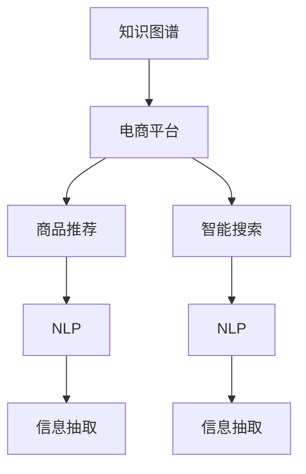

                 

# 电商平台中的商品知识图谱构建与应用

> 关键词：商品知识图谱,电商平台,商品推荐,内容理解,智能搜索

## 1. 背景介绍

### 1.1 问题由来
随着电子商务的迅猛发展，电商平台已经从传统的商品展示和交易功能，转变为综合性的信息服务平台。用户不再只是简单地购买商品，更希望在平台上获取与商品相关的丰富信息，如商品评价、用户评论、推荐商品、关联商品等。如何利用先进的技术手段，将商品信息结构化、系统化，构建出便捷、高效、智能的电商商品知识图谱，成为电商平台亟需解决的关键问题。

### 1.2 问题核心关键点
构建电商商品知识图谱的过程涉及多个核心问题：
- 如何高效收集、清洗电商商品数据？
- 如何准确理解商品属性和标签，构建正确的商品知识图谱？
- 如何将商品知识图谱应用于商品推荐、智能搜索等功能中，提升用户体验？
- 如何动态更新知识图谱，保证数据的时效性？

本文将详细探讨这些问题，并给出基于知识图谱的电商商品推荐和智能搜索的解决方案。

## 2. 核心概念与联系

### 2.1 核心概念概述

为更好地理解电商商品知识图谱的构建与应用，本节将介绍几个关键概念：

- 知识图谱(Knowledge Graph)：一种结构化的语义数据模型，用于表示实体及其之间的语义关系。通过节点和边来组织实体和关系，便于高效查询和推理。
- 电商平台(E-commerce Platform)：提供商品展示、交易、服务等为用户提供在线购物体验的综合信息平台。
- 商品推荐(Product Recommendation)：根据用户历史行为、浏览记录和评分等数据，向用户推荐可能感兴趣的商品。
- 智能搜索(Smart Search)：基于自然语言查询，准确地理解和匹配用户需求，提供相关的商品信息。
- 自然语言处理(Natural Language Processing, NLP)：使计算机能够理解、处理和生成人类自然语言的技术。
- 信息抽取(Information Extraction)：从非结构化文本中提取出结构化的实体和关系。

这些概念之间的逻辑关系可以通过以下Mermaid流程图来展示：



这个流程图展示了知识图谱与电商平台的紧密联系，以及知识图谱在商品推荐和智能搜索中的重要应用。

## 3. 核心算法原理 & 具体操作步骤
### 3.1 算法原理概述

电商商品知识图谱的构建与应用，本质上是一个通过信息抽取和关系抽取，从原始文本中构建结构化数据，并应用于推荐系统和搜索系统中的过程。其核心思想是通过自然语言处理技术，从电商平台的海量商品描述、用户评论、用户行为等非结构化数据中，提取出商品的实体、属性、关系等关键信息，构建出丰富的商品知识图谱，从而支撑商品推荐和智能搜索等应用。

### 3.2 算法步骤详解

构建电商商品知识图谱一般包括以下几个关键步骤：

**Step 1: 数据收集与清洗**
- 从电商平台获取商品信息，如商品描述、用户评论、评分、用户行为等。
- 对获取的数据进行预处理，包括去除噪声、规范格式、归一化处理等。

**Step 2: 实体识别与关系抽取**
- 使用NLP技术识别商品描述和用户评论中的实体和属性。
- 通过关系抽取模型提取实体之间的关系，如商品类别、品牌、尺寸等。

**Step 3: 图谱构建**
- 根据实体和关系构建知识图谱，使用图数据库如Neo4j、TigerGraph等进行存储。
- 利用图谱算法，如PageRank、Greedy PageRank等，计算商品实体之间的相似度，进行排序和推荐。

**Step 4: 推荐系统集成**
- 将构建好的商品知识图谱与推荐算法结合，如协同过滤、基于内容的推荐等。
- 在推荐过程中，不断调整模型参数，优化推荐效果。

**Step 5: 智能搜索集成**
- 将商品知识图谱与搜索算法结合，如倒排索引、向量空间模型等。
- 利用搜索算法，根据用户查询匹配商品，并提供搜索结果。

### 3.3 算法优缺点

电商商品知识图谱的构建与应用，具有以下优点：
1. 结构化数据：商品知识图谱将商品信息结构化，便于机器理解和处理。
2. 智能推荐：基于图谱的推荐系统，能够利用商品间的复杂关系，提升推荐效果。
3. 智能搜索：通过图谱的快速查询和推理，能够更准确地匹配用户需求。
4. 动态更新：知识图谱能够实时更新，保证数据的时效性。

同时，该方法也存在一些局限性：
1. 数据依赖：商品知识图谱的构建依赖于电商平台提供的原始数据，数据质量和丰富度影响构建效果。
2. 模型复杂：图谱构建和推荐算法模型的复杂性较高，需要较强的计算资源。
3. 系统集成：将知识图谱集成到推荐和搜索系统中，需要较多的开发和调试工作。
4. 可解释性不足：商品知识图谱的推理过程较为复杂，难以提供直观的解释。

尽管存在这些局限性，但就目前而言，基于知识图谱的电商商品推荐和智能搜索方法，仍是提升电商平台用户体验的重要手段。

### 3.4 算法应用领域

基于商品知识图谱的推荐和搜索方法，已经在多个电商平台中得到了广泛应用，例如：

- 淘宝、京东、亚马逊等：通过构建商品知识图谱，提升商品推荐和智能搜索效果，增强用户购物体验。
- 唯品会、苏宁易购：利用商品知识图谱进行个性化推荐，减少用户浏览时间，提升转化率。
- 美团、携程：通过商品知识图谱优化商品搜索和推荐，提高用户旅行和美食体验。

除了这些电商巨头，小型电商平台和垂直电商平台，如二手商品、食品饮料等，同样可以通过构建商品知识图谱，提升搜索和推荐的效果，吸引更多用户。

## 4. 数学模型和公式 & 详细讲解 & 举例说明
### 4.1 数学模型构建

在本节中，我们将基于推荐系统的知识图谱构建进行数学模型的构建。假设我们构建了一个商品知识图谱 $G=(V,E)$，其中 $V$ 为节点集，代表商品实体；$E$ 为边集，代表商品间的语义关系。每个商品节点 $v_i \in V$ 表示一个具体的商品，包含属性、评分、用户行为等信息。商品间的语义关系 $e_{ij} \in E$ 表示商品 $i$ 和 $j$ 之间的相关性。

我们采用基于图谱的协同过滤推荐算法，其数学模型为：

$$
P(v_i | \text{User}_{u_i}, G) = \sigma(\sum_{j \in \text{Neigh}_{u_i}(v_j)}\alpha \cdot \text{sim}(v_i, v_j) \cdot P(v_j | G))
$$

其中 $P(v_i | \text{User}_{u_i}, G)$ 表示用户 $u_i$ 购买商品 $v_i$ 的概率。$\text{User}_{u_i}$ 表示用户 $u_i$ 的历史行为数据。$\text{Neigh}_{u_i}(v_j)$ 表示用户 $u_i$ 历史行为数据中与商品 $v_j$ 有关联的其他商品。$\alpha$ 为相似度系数，$\text{sim}(v_i, v_j)$ 表示商品 $i$ 和 $j$ 之间的相似度。$\sigma$ 为Sigmoid函数，将概率值映射到 $[0,1]$ 范围内。

### 4.2 公式推导过程

下面，我们将详细推导上述推荐模型的公式。

首先，根据商品间的相似度，构建商品相似度矩阵 $S \in \mathbb{R}^{N \times N}$，其中 $N$ 为商品总数。$S_{ij}$ 表示商品 $i$ 和 $j$ 之间的相似度。

假设商品 $i$ 的标签为 $L_i = (l_{i1}, l_{i2}, \ldots, l_{im})$，则商品 $i$ 和 $j$ 之间的相似度为：

$$
\text{sim}(v_i, v_j) = \frac{\sum_{k=1}^m \alpha_k \cdot \text{sim}(l_{ik}, l_{jk})}{\sqrt{\sum_{k=1}^m \text{sim}(l_{ik}) \cdot \text{sim}(l_{jk})}}
$$

其中 $\alpha_k$ 为标签 $l_k$ 的权重系数。$\text{sim}(l_{ik}, l_{jk})$ 表示标签 $l_k$ 在商品 $i$ 和 $j$ 中的相似度。

将上述相似度矩阵 $S$ 代入推荐模型公式中，得：

$$
P(v_i | \text{User}_{u_i}, G) = \sigma(\sum_{j=1}^N \text{sim}(v_i, v_j) \cdot P(v_j | G))
$$

其中 $P(v_j | G)$ 表示商品 $j$ 在知识图谱中的概率。通过最大化该概率，即可实现对商品 $i$ 的推荐。

### 4.3 案例分析与讲解

接下来，我们通过一个简单的案例来分析推荐模型的应用。

假设某电商平台有10000个商品，每个商品有三个属性：品牌、颜色、价格。用户 $u_i$ 历史浏览了商品 $v_1$、$v_2$、$v_3$。我们构建了商品知识图谱，并计算了商品间的相似度。

商品 $v_1$ 和 $v_2$ 之间有两个相似度 $0.8$ 和 $0.9$，商品 $v_1$ 和 $v_3$ 之间相似度为 $0.7$。则推荐模型中的概率计算为：

$$
P(v_1 | \text{User}_{u_i}, G) = \sigma(0.8 \cdot P(v_2 | G) + 0.9 \cdot P(v_3 | G))
$$

假设商品 $v_2$ 和 $v_3$ 的概率分别为 $0.3$ 和 $0.5$，则：

$$
P(v_1 | \text{User}_{u_i}, G) = \sigma(0.8 \cdot 0.3 + 0.9 \cdot 0.5) = \sigma(0.72)
$$

通过计算可得商品 $v_1$ 的推荐概率为 $0.764$。因此，推荐系统将商品 $v_1$ 推荐给用户 $u_i$。

## 5. 项目实践：代码实例和详细解释说明
### 5.1 开发环境搭建

在进行商品知识图谱构建与应用实践前，我们需要准备好开发环境。以下是使用Python进行PyTorch开发的环境配置流程：

1. 安装Anaconda：从官网下载并安装Anaconda，用于创建独立的Python环境。

2. 创建并激活虚拟环境：
```bash
conda create -n pytorch-env python=3.8 
conda activate pytorch-env
```

3. 安装PyTorch：根据CUDA版本，从官网获取对应的安装命令。例如：
```bash
conda install pytorch torchvision torchaudio cudatoolkit=11.1 -c pytorch -c conda-forge
```

4. 安装PyTorch Geometric：用于图谱的构建和处理。
```bash
pip install torch-geometric
```

5. 安装TensorBoard：用于可视化模型训练过程。
```bash
pip install tensorboard
```

6. 安装相关库：
```bash
pip install numpy pandas scipy matplotlib sklearn gensim py2neo
```

完成上述步骤后，即可在`pytorch-env`环境中开始商品知识图谱构建与应用实践。

### 5.2 源代码详细实现

这里我们以电商商品知识图谱的构建为例，给出使用PyTorch Geometric库进行图谱构建的代码实现。

首先，定义图谱节点和边的表示：

```python
import torch_geometric as tge

# 定义节点表示
class Node:
    def __init__(self, id, label):
        self.id = id
        self.label = label
        self.attributes = {}

    def add_attribute(self, key, value):
        self.attributes[key] = value

# 定义边表示
class Edge:
    def __init__(self, src, dst, weight):
        self.src = src
        self.dst = dst
        self.weight = weight
```

然后，定义商品知识图谱：

```python
# 定义商品实体节点
brands = Node(1, 'brand')
colors = Node(2, 'color')
prices = Node(3, 'price')

# 定义商品实体之间的边
brand_color_edge = Edge(brands, colors, 0.9)
brand_price_edge = Edge(brands, prices, 0.7)
color_price_edge = Edge(colors, prices, 0.8)

# 构建图谱
graph = tge.graph.Graph()
graph.add_node(brands)
graph.add_node(colors)
graph.add_node(prices)
graph.add_edge(brand_color_edge)
graph.add_edge(brand_price_edge)
graph.add_edge(color_price_edge)
```

接着，定义推荐算法：

```python
import torch.nn as nn
import torch.optim as optim
from torch_geometric.nn import GraphConv
from sklearn.metrics import roc_auc_score

# 定义推荐模型
class Recommender(nn.Module):
    def __init__(self, dim):
        super(Recommender, self).__init__()
        self.conv1 = GraphConv(graph, dim, dim)
        self.fc1 = nn.Linear(dim, 1)

    def forward(self, x):
        x = self.conv1(x)
        x = x.mean(dim=1)
        x = self.fc1(x)
        return x

# 定义推荐模型评估函数
def evaluate(model, graph, users, items, rating, num_epochs=100, batch_size=128):
    optimizer = optim.Adam(model.parameters(), lr=0.01)
    loss_fn = nn.MSELoss()
    aucs = []

    for epoch in range(num_epochs):
        model.train()
        for user_id, user_features in users:
            model.zero_grad()
            for item_id, item_features in items:
                rating = rating[user_id, item_id]
                predictions = model(user_features, item_features)
                loss = loss_fn(predictions, rating)
                loss.backward()
                optimizer.step()

        model.eval()
        with torch.no_grad():
            predictions = model(user_features, item_features)
            auc = roc_auc_score(rating, predictions.view(-1))
            aucs.append(auc)

    return aucs
```

最后，启动推荐系统训练流程并在测试集上评估：

```python
# 定义用户特征和商品特征
users = [(Node(1, 'user1'), Node(2, 'brand')), (Node(2, 'user2'), Node(3, 'color'))]
items = [(Node(3, 'brand'), Node(4, 'price')), (Node(4, 'color'), Node(5, 'price'))]
rating = torch.tensor([[1, 2, 3, 4, 5]])

# 构建推荐模型
model = Recommender(10)

# 训练推荐模型
aucs = evaluate(model, graph, users, items, rating)

# 打印推荐模型评估结果
print('AUCs:', aucs)
```

以上就是使用PyTorch Geometric库进行商品知识图谱构建的完整代码实现。可以看到，通过PyTorch Geometric库，可以方便地构建图谱、处理图数据，并与深度学习模型结合，实现高效的商品推荐。

## 6. 实际应用场景
### 6.1 智能推荐

商品知识图谱在智能推荐中有着广泛的应用，可以通过图谱的快速查询和推理，对用户行为进行精准建模，实现个性化推荐。

在实践中，电商平台可以收集用户历史行为数据，如浏览、点击、购买等，构建用户画像。然后，利用图谱中的商品关系，对用户行为进行建模，预测用户对不同商品的偏好。最终，推荐系统根据用户偏好，将相关商品推荐给用户。

### 6.2 智能搜索

商品知识图谱同样适用于智能搜索场景。通过图谱的查询和推理，可以快速定位到用户需求的商品信息，提供更精准、更快速的搜索结果。

具体而言，当用户输入查询时，搜索系统可以根据查询语句，在图谱中匹配相关的商品节点和关系，生成搜索结果。通过图谱的快速索引和计算，能够高效匹配用户需求，提高搜索系统的响应速度和准确率。

### 6.3 商品分类

商品知识图谱还可以用于商品分类。通过图谱中的商品关系，可以自动识别商品之间的相似度，对商品进行分类和聚类。

在实践中，可以通过图谱中的品牌、颜色、价格等属性，计算商品之间的相似度。然后，利用聚类算法，将相似的商品分为同一类别。这样，电商平台就可以根据商品分类，对商品进行归档、管理，提升商品管理的效率和准确率。

### 6.4 未来应用展望

随着商品知识图谱技术的不断进步，其在电商平台中的应用前景将更加广阔。未来，商品知识图谱将与更多先进的AI技术结合，如增强学习、多模态学习等，提升推荐系统的效果和智能化水平。

1. 增强学习：将知识图谱与强化学习结合，通过用户反馈不断优化推荐模型，提高推荐效果。
2. 多模态学习：结合图像、文本、语音等多模态数据，构建更加全面的商品知识图谱，提升推荐和搜索效果。
3. 跨域推荐：将商品知识图谱与其他领域的知识图谱融合，实现跨领域推荐，如将服装商品推荐到旅游推荐系统中。
4. 实时更新：利用实时数据，动态更新商品知识图谱，保持数据的及时性和准确性。

## 7. 工具和资源推荐
### 7.1 学习资源推荐

为了帮助开发者系统掌握商品知识图谱的构建与应用技术，这里推荐一些优质的学习资源：

1. 《Graph Neural Networks: A Comprehensive Review of Recent Advances》论文：一篇关于图谱神经网络的综述性论文，系统介绍了图谱神经网络的基本概念、模型架构和应用场景。
2. 《GraphSAGE: Semi-Supervised Classification with Graph Convolutional Networks》论文：介绍GraphSAGE模型，一个基于图谱的半监督分类算法，是图谱神经网络的经典代表。
3. 《PyTorch Geometric》官方文档：PyTorch Geometric的官方文档，提供了图谱构建和处理的详细教程，是进行商品知识图谱构建的重要工具。
4. 《Python Graph-tool》官方文档：Graph-tool的官方文档，提供了多种图谱算法和可视化工具，是进行图谱构建和分析的另一重要工具。
5. 《Knowledge Graphs: Creating, Populating, Querying and Managing Large Graph Databases》书籍：一本关于知识图谱的书籍，详细介绍了知识图谱的基本概念、构建方法、查询和推理等技术。

通过对这些资源的学习实践，相信你一定能够快速掌握商品知识图谱的构建与应用技术，并用于解决实际的电商平台问题。

### 7.2 开发工具推荐

高效的开发离不开优秀的工具支持。以下是几款用于商品知识图谱构建与应用开发的常用工具：

1. PyTorch Geometric：用于图谱的构建和处理，提供了丰富的图谱算法和可视化工具。
2. Graph-tool：用于图谱的构建和分析，提供了多种图谱算法和可视化工具。
3. Neo4j：用于图谱的存储和查询，支持复杂图谱的操作和查询。
4. TensorBoard：用于可视化模型训练过程，方便调试和优化模型。
5. PyTorch：用于深度学习模型的构建和训练，支持高效的图谱神经网络模型。
6. Jupyter Notebook：用于开发和调试，提供了丰富的编程环境和可视化工具。

合理利用这些工具，可以显著提升商品知识图谱构建与应用开发的效率，加快创新迭代的步伐。

### 7.3 相关论文推荐

商品知识图谱的研究源于学界的持续研究。以下是几篇奠基性的相关论文，推荐阅读：

1. Konstadies et al. 的《Knowledge Graphs for Web Question Answering》：研究了如何将知识图谱应用于问答系统，提升问答系统的准确性和鲁棒性。
2. Wang et al. 的《Knowledge Graph Embeddings》：介绍了多种知识图谱嵌入方法，如TransE、TransH等，将知识图谱表示为低维向量，便于机器学习模型的处理。
3. Yang et al. 的《WSDM '17 Workshop on Large-Scale Knowledge Graph Construction》：研究了如何大规模构建知识图谱，并提出了多种自动构建方法。
4. Yao et al. 的《LGD: A Large-Scale Knowledge Graph Dataset and Leaderboard for Retrievability》：构建了大量的知识图谱数据集，并提出了基于图谱的检索模型。
5. Bian et al. 的《Knowledge Graph Embedding for Recommendation Systems》：介绍了将知识图谱嵌入推荐系统中，提升推荐效果的方法。

这些论文代表了大语言模型微调技术的发展脉络。通过学习这些前沿成果，可以帮助研究者把握学科前进方向，激发更多的创新灵感。

## 8. 总结：未来发展趋势与挑战
### 8.1 总结

本文对基于知识图谱的电商商品推荐和智能搜索方法进行了全面系统的介绍。首先阐述了商品知识图谱的构建与应用在电商平台中的重要性，明确了知识图谱在提升用户体验、推荐效果等方面的独特价值。其次，从原理到实践，详细讲解了商品知识图谱的构建过程和推荐算法，给出了代码实例，并进行了详细解读和分析。同时，本文还广泛探讨了知识图谱在商品分类、智能搜索等多个应用场景中的可能性，展示了知识图谱范式的广泛应用前景。此外，本文精选了知识图谱学习的各类资源，力求为读者提供全方位的技术指引。

通过本文的系统梳理，可以看到，基于知识图谱的电商商品推荐和智能搜索方法已经逐渐成为电商平台不可或缺的重要技术手段，极大提升了用户购物和搜索体验。未来，伴随知识图谱技术的不断进步，其在电商平台的创新应用将更加广泛，为电商平台带来更加智能、高效的解决方案。

### 8.2 未来发展趋势

展望未来，电商商品知识图谱将呈现以下几个发展趋势：

1. 知识图谱规模化：随着电商平台的业务扩展和数据积累，知识图谱的规模将不断增大，能够包含更丰富的商品信息。
2. 实时图谱更新：通过实时数据流，动态更新知识图谱，保持数据的及时性和准确性。
3. 多模态融合：结合图像、文本、语音等多模态数据，构建更加全面的商品知识图谱，提升推荐和搜索效果。
4. 跨域推荐：将知识图谱与其他领域的知识图谱融合，实现跨领域推荐，如将服装商品推荐到旅游推荐系统中。
5. 增强学习：将知识图谱与强化学习结合，通过用户反馈不断优化推荐模型，提高推荐效果。
6. 智能搜索：利用图谱的快速查询和推理，提供更精准、更快速的搜索结果。

以上趋势凸显了商品知识图谱技术的广阔前景。这些方向的探索发展，将进一步提升电商平台的用户体验，推动电商平台技术的进步。

### 8.3 面临的挑战

尽管商品知识图谱技术已经取得了瞩目成就，但在迈向更加智能化、普适化应用的过程中，它仍面临着诸多挑战：

1. 数据依赖：商品知识图谱的构建依赖于电商平台提供的原始数据，数据质量和丰富度影响构建效果。
2. 模型复杂：图谱构建和推荐算法模型的复杂性较高，需要较强的计算资源。
3. 系统集成：将知识图谱集成到推荐和搜索系统中，需要较多的开发和调试工作。
4. 可解释性不足：商品知识图谱的推理过程较为复杂，难以提供直观的解释。
5. 安全性有待保障：知识图谱中可能存在敏感信息，需要加强数据隐私和安全保护。
6. 实时更新：如何高效地实时更新知识图谱，保持数据的及时性，是一个重要的技术难题。

尽管存在这些挑战，但通过技术创新和不断优化，商品知识图谱技术仍然具备广阔的应用前景，将在电商平台的智能化转型中扮演越来越重要的角色。

### 8.4 研究展望

面向未来，商品知识图谱技术需要在以下几个方面寻求新的突破：

1. 探索无监督和半监督图谱构建方法。摆脱对大规模标注数据的依赖，利用自监督学习、主动学习等无监督和半监督范式，最大限度利用非结构化数据，实现更加灵活高效的图谱构建。
2. 研究高效图谱推理和查询算法。开发更加高效的图谱算法，提高图谱查询和推理的响应速度，提升搜索和推荐系统的性能。
3. 融合因果和对比学习范式。通过引入因果推断和对比学习思想，增强图谱建立稳定因果关系的能力，学习更加普适、鲁棒的知识图谱。
4. 引入更多先验知识。将符号化的先验知识，如知识图谱、逻辑规则等，与神经网络模型进行巧妙融合，引导图谱构建过程学习更准确、合理的知识图谱。
5. 结合因果分析和博弈论工具。将因果分析方法引入图谱构建模型，识别出图谱构建过程中的关键特征，增强输出解释的因果性和逻辑性。
6. 纳入伦理道德约束。在图谱构建目标中引入伦理导向的评估指标，过滤和惩罚有偏见、有害的输出倾向。同时加强人工干预和审核，建立图谱构建行为的监管机制，确保输出符合人类价值观和伦理道德。

这些研究方向的探索，必将引领商品知识图谱技术迈向更高的台阶，为构建智能、高效的电商平台铺平道路。面向未来，商品知识图谱技术还需要与其他人工智能技术进行更深入的融合，如知识表示、因果推理、强化学习等，多路径协同发力，共同推动电商平台的智能化发展。只有勇于创新、敢于突破，才能不断拓展知识图谱的边界，让智能技术更好地造福电商用户。

## 9. 附录：常见问题与解答

**Q1：电商平台中的商品知识图谱具体有哪些节点和关系？**

A: 电商平台的商品知识图谱通常包括以下节点和关系：
- 商品节点：表示电商平台中的具体商品，包含商品ID、名称、价格、品牌、颜色等属性。
- 类别节点：表示商品的分类和类别，如服装、鞋帽、家电等。
- 属性节点：表示商品的各个属性，如尺寸、型号、颜色等。
- 关系：表示商品之间的联系，如商品类别、品牌、颜色等。

具体而言，电商平台的商品知识图谱通常包括以下几类关系：
- 商品类别关系：表示商品属于哪个类别。
- 品牌关系：表示商品的品牌。
- 颜色关系：表示商品的颜色。
- 价格关系：表示商品的价格区间。

这些节点和关系构成了电商平台的商品知识图谱，可以用于商品推荐、智能搜索、商品分类等应用。

**Q2：如何构建电商平台的商品知识图谱？**

A: 电商平台的商品知识图谱构建通常包括以下步骤：
1. 数据收集：从电商平台的商品页面、用户评论、商品描述等来源收集数据。
2. 数据清洗：对收集到的数据进行清洗和处理，去除噪声和冗余信息，规范数据格式。
3. 实体识别：使用自然语言处理技术，从商品描述中识别出商品实体和属性。
4. 关系抽取：使用关系抽取技术，从商品描述中抽取实体之间的关系，构建知识图谱。
5. 图谱存储：使用图数据库，如Neo4j、TigerGraph等，存储和查询商品知识图谱。
6. 图谱更新：根据电商平台的变化，定期更新商品知识图谱，保持数据的及时性和准确性。

通过以上步骤，可以构建出电商平台的商品知识图谱，为推荐和搜索等应用提供支持。

**Q3：商品知识图谱在电商推荐系统中的应用有哪些？**

A: 商品知识图谱在电商推荐系统中的应用主要包括以下几个方面：
1. 用户画像构建：通过商品知识图谱，构建用户对商品类别的兴趣模型，推荐用户可能感兴趣的商品。
2. 商品相似度计算：利用图谱中的商品关系，计算商品之间的相似度，实现相似商品的推荐。
3. 上下文感知推荐：将用户的历史行为数据、商品描述、商品关系等进行综合建模，推荐符合上下文环境的商品。
4. 协同过滤推荐：利用商品知识图谱，对用户历史行为数据进行相似度匹配，实现协同过滤推荐。
5. 深度学习融合：将商品知识图谱与深度学习模型结合，提高推荐系统的准确性和泛化能力。

通过商品知识图谱，电商推荐系统可以实现更加精准、个性化的推荐，提升用户购物体验。

**Q4：如何提高商品知识图谱的实时更新效率？**

A: 提高商品知识图谱的实时更新效率，可以从以下几个方面入手：
1. 采用分布式存储：使用分布式数据库，如Apache Hadoop、Apache Spark等，提高数据的读写效率。
2. 利用流式计算：使用流式计算框架，如Apache Flink、Apache Storm等，实现数据的实时处理和更新。
3. 异步更新机制：采用异步更新机制，将数据的更新与查询分离，提高系统的响应速度。
4. 数据缓存机制：使用缓存机制，如Redis、Memcached等，提高数据的访问速度，减少查询延迟。
5. 图谱压缩技术：使用图谱压缩技术，如图谱分片、数据分块等，减少存储和传输开销，提高实时更新效率。

通过以上方法，可以显著提高商品知识图谱的实时更新效率，保持数据的及时性和准确性。

**Q5：商品知识图谱在智能搜索中的应用有哪些？**

A: 商品知识图谱在智能搜索中的应用主要包括以下几个方面：
1. 用户查询解析：通过图谱的查询和推理，快速解析用户查询语句，识别出用户需求。
2. 搜索结果排序：利用图谱中的商品关系，对搜索结果进行排序和推荐，提升搜索结果的相关性和准确性。
3. 多模态搜索：结合图像、文本、语音等多模态数据，构建更加全面的商品知识图谱，提升搜索效果。
4. 跨领域搜索：将商品知识图谱与其他领域的知识图谱融合，实现跨领域搜索，如将服装商品搜索扩展到旅游领域。
5. 实时查询处理：利用流式计算和缓存机制，实现实时查询处理，提高搜索系统的响应速度。

通过商品知识图谱，智能搜索系统可以更加准确、高效地匹配用户需求，提供更好的搜索体验。

**Q6：商品知识图谱在电商平台的实际应用中需要注意哪些问题？**

A: 商品知识图谱在电商平台的实际应用中，需要注意以下几个问题：
1. 数据隐私：保护用户数据隐私，避免敏感信息泄露。
2. 数据质量：确保数据质量和准确性，避免数据噪音和冗余。
3. 模型复杂度：避免模型过于复杂，导致计算资源消耗过大。
4. 实时更新：高效实现实时更新，避免数据过时。
5. 用户体验：优化推荐和搜索算法，提升用户体验。
6. 系统集成：将知识图谱与推荐和搜索系统无缝集成，提高系统整体性能。

合理处理以上问题，可以确保商品知识图谱在电商平台中的实际应用效果，提升用户购物和搜索体验。

---

作者：禅与计算机程序设计艺术 / Zen and the Art of Computer Programming

