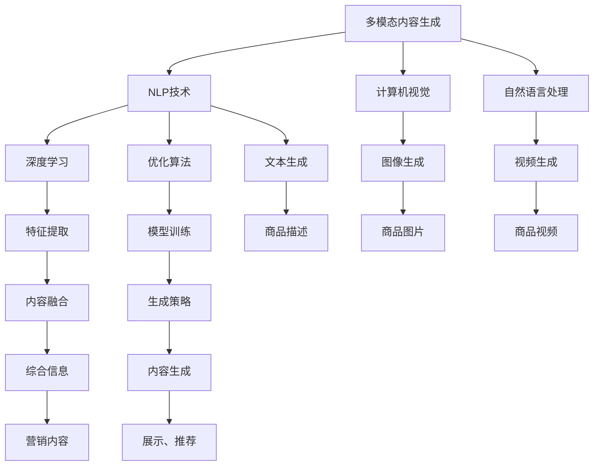

                 

# 电商平台中的多模态内容生成：AI大模型的创新应用

> 关键词：多模态内容生成,电商平台,自然语言处理(NLP),计算机视觉(CV),深度学习,大模型,跨模态融合,用户行为分析

## 1. 背景介绍

随着电子商务的蓬勃发展，在线购物平台的用户体验和转化率成为商家关注的重点。多模态内容生成技术在这一背景下应运而生，通过结合文本、图像、视频等多维数据，提供丰富、个性化的商品展示和推荐，极大地提升了用户的购物体验和平台转化率。本文将深入探讨基于深度学习的大模型在电商平台中的应用，介绍多模态内容生成的核心原理和操作步骤，展示其在用户行为分析、个性化推荐、商品描述生成等方面的创新实践，并通过具体的代码实例和应用案例，阐释该技术在电商平台中的强大应用潜力。

## 2. 核心概念与联系

### 2.1 核心概念概述

- **多模态内容生成(Multimodal Content Generation)**：结合文本、图像、视频等多源数据，自动生成具有吸引力和说服力的营销内容，用于商品展示、推荐、广告等场景，提升用户互动率和购买转化率。

- **电商平台(E-Commerce Platform)**：指通过互联网技术提供商品销售、交易和管理服务的在线平台。电商平台不仅包括传统的商品展示和交易功能，还涵盖了用户评论、评价、推荐等多个维度。

- **自然语言处理(NLP)**：利用深度学习、统计等技术，对文本数据进行自动化处理、理解和生成，是实现多模态内容生成的关键技术之一。

- **计算机视觉(CV)**：研究如何使计算机“看”和“理解”图像和视频，是实现图像驱动的内容生成的重要基础。

- **深度学习(Deep Learning)**：利用多层神经网络对数据进行特征提取和模型训练，是实现多模态内容生成算法的核心技术。

- **大模型(Large Model)**：指具有亿万级别参数的深度神经网络，如GPT-3、DALL·E等，能够通过大规模数据预训练获得强大的数据表征能力，适用于各种复杂的自然语言处理任务。

- **跨模态融合(Cross-Modal Fusion)**：将不同模态的数据特征进行融合，生成更丰富的综合信息，提升内容的丰富性和吸引力。

这些核心概念构成了多模态内容生成的理论基础，通过技术的有机结合，实现了从单一模态到多模态的跨越，大幅提升了内容生成的质量与效率。

### 2.2 核心概念原理和架构的 Mermaid 流程图



这个流程图展示了多模态内容生成的主要流程：

1. 从不同模态的数据中提取特征。
2. 使用深度学习模型进行融合，生成综合信息。
3. 利用生成策略，生成丰富的营销内容。
4. 将生成的内容展示在电商平台上，用于商品展示、推荐、广告等场景。

## 3. 核心算法原理 & 具体操作步骤

### 3.1 算法原理概述

多模态内容生成算法主要基于深度学习技术，通过融合文本、图像、视频等多种数据源，生成具有吸引力和说服力的营销内容。其核心原理可以概括为以下几个步骤：

1. **数据预处理**：对文本、图像、视频等多源数据进行预处理，包括文本分词、图像裁剪、视频帧提取等。

2. **特征提取**：使用深度学习模型对预处理后的数据进行特征提取，生成高维表征向量。

3. **跨模态融合**：将不同模态的特征向量进行融合，生成综合的表征向量。

4. **生成策略**：基于融合后的表征向量，使用生成模型生成文本、图像、视频等多种格式的内容。

5. **内容优化**：对生成的内容进行后处理，如文本语法优化、图像色彩校正等，提升内容质量。

### 3.2 算法步骤详解

#### 3.2.1 数据预处理

数据预处理是生成过程的第一步，涉及到对原始数据进行清洗、归一化、格式转换等操作。

**文本预处理**：
- 分词：将文本数据分词成单词或词组，例如使用BERT、ELMo等预训练模型。
- 停用词过滤：去除无意义的高频词，如“的”、“是”等。
- 标准化：统一字符大小写，去除标点符号等。

**图像预处理**：
- 裁剪：根据商品展示需求，对图像进行裁剪，保证关键特征突出。
- 归一化：将图像像素值归一化到[0,1]区间，便于模型处理。
- 尺寸调整：调整图像尺寸，使其适应不同展示需求。

**视频预处理**：
- 帧提取：从视频中提取关键帧，如使用3D-CNN提取关键帧。
- 降维：对关键帧进行降维，减少计算量。
- 帧融合：将关键帧进行融合，生成更连贯的视频片段。

#### 3.2.2 特征提取

特征提取是生成过程中最关键的一步，通过深度学习模型将原始数据转换为高维表征向量。

**文本特征提取**：
- 使用BERT、GPT等预训练模型，将文本转化为向量表示。

**图像特征提取**：
- 使用卷积神经网络(CNN)，如VGG、ResNet等，将图像转换为向量表示。

**视频特征提取**：
- 使用3D卷积神经网络，如I3D、C3D等，将视频转化为向量表示。

#### 3.2.3 跨模态融合

跨模态融合是将不同模态的特征向量进行融合，生成综合的表征向量。

**融合方法**：
- 拼接：直接将不同模态的特征向量拼接，简单但效果有限。
- 平均：将不同模态的特征向量取平均值，减少信息冗余。
- 加权融合：根据不同模态的重要性，赋予不同的权重，进行加权融合。

**融合模型**：
- 基于注意力机制的跨模态融合模型：如Attention-based Multimodal Fusion。
- 基于深度神经网络的融合模型：如Deep Multimodal Fusion。

#### 3.2.4 生成策略

生成策略是将融合后的表征向量转换为具体内容的过程，主要分为文本生成、图像生成和视频生成。

**文本生成**：
- 使用GPT-3等大模型，根据表征向量生成商品描述、广告文案等文本内容。
- 使用Seq2Seq模型，如Transformer，进行文本生成。

**图像生成**：
- 使用GANs等生成模型，如DCGAN、CycleGAN，根据表征向量生成商品图片。
- 使用变分自编码器(VAE)，如PixelRNN，进行图像生成。

**视频生成**：
- 使用视频生成模型，如VideoGAN、PixelRNN，根据表征向量生成商品视频。
- 使用基于3D卷积神经网络的视频生成模型，如3D-CNN。

#### 3.2.5 内容优化

内容优化是对生成的内容进行后处理，以提升内容的质量和吸引力。

**文本优化**：
- 语法优化：使用语法校正工具，如Grammarly，进行语法校对。
- 格式调整：统一文本格式，确保格式一致。

**图像优化**：
- 色彩校正：使用图像处理工具，如Photoshop，进行色彩校正。
- 样式调整：调整图像风格，使其更符合展示需求。

**视频优化**：
- 剪辑调整：对视频进行剪辑，去除冗余部分。
- 特效添加：添加特效，提升视频吸引力。

### 3.3 算法优缺点

**优点**：
- 结合多模态数据，生成更丰富、更吸引人的内容，提升用户体验。
- 使用深度学习大模型，能够捕捉复杂的多模态数据关系，生成高质量的内容。
- 可扩展性强，适用于多种电商场景，如商品展示、推荐、广告等。

**缺点**：
- 数据预处理和特征提取计算量大，需要高性能计算资源。
- 生成策略复杂，涉及深度学习模型训练和优化。
- 生成内容可能过于商业化，缺乏个性化和人性化。

### 3.4 算法应用领域

多模态内容生成技术在电商平台中有着广泛的应用，具体包括：

- **商品展示**：生成高吸引力的商品图片和视频，提升用户浏览体验。
- **个性化推荐**：根据用户行为和兴趣，生成个性化商品推荐，提升购买转化率。
- **广告创意生成**：根据广告目标，生成多样化广告文案和图片，提升广告效果。
- **用户评论生成**：生成高质量的商品评价，提升平台信任度。
- **互动内容生成**：生成用户互动内容，如问答、评论，提升用户参与度。

## 4. 数学模型和公式 & 详细讲解

### 4.1 数学模型构建

多模态内容生成可以基于以下数学模型进行建模：

设输入数据 $x_t = (x_{t-1}, x_t, x_{t+1})$ 为三张连续的图片，表示从时间步 $t-1$ 到 $t+1$ 的图像序列。假设生成模型 $p(y|x_t)$ 可以生成一张高质量的图片 $y$，则多模态内容生成过程可以表示为：

$$
p(y|x_t) = p(y|x_{t-1}, x_t, x_{t+1})
$$

### 4.2 公式推导过程

以文本生成为例，推导多模态内容生成的核心公式。

**文本生成公式**：
- 使用GPT-3等大模型，生成文本 $y$：

$$
p(y|x) = \prod_{i=1}^n \frac{e^{y_i \log p(x_i|y_{i-1})}}{\sum_{k=1}^n e^{y_i \log p(x_i|y_{i-1})}}
$$

其中，$x_i$ 为输入文本，$y_i$ 为生成文本的每个字符，$p(x_i|y_{i-1})$ 为条件概率。

**图像生成公式**：
- 使用GANs等生成模型，生成图像 $y$：

$$
p(y|x) = \frac{e^{y_i \log p(x_i|y_{i-1})}}{\sum_{k=1}^n e^{y_i \log p(x_i|y_{i-1})}}
$$

其中，$x_i$ 为输入文本，$y_i$ 为生成图像的每个像素，$p(x_i|y_{i-1})$ 为条件概率。

### 4.3 案例分析与讲解

以电商平台的商品推荐系统为例，分析多模态内容生成的应用场景。

**场景描述**：
- 用户在电商平台浏览商品页面，系统自动推荐相关商品。
- 系统根据用户浏览历史、点击行为、收藏商品等数据，生成个性化推荐内容。

**具体实现**：
- 使用深度学习模型对用户行为数据进行特征提取。
- 将提取的特征向量与商品数据进行跨模态融合。
- 使用生成模型，根据融合后的向量生成个性化推荐内容。

## 5. 项目实践：代码实例和详细解释说明

### 5.1 开发环境搭建

为了进行多模态内容生成实践，需要搭建Python开发环境。

**步骤1**：安装Python 3.8及以上版本，可以从[Python官网](https://www.python.org/)下载安装。

**步骤2**：安装Pip包管理工具：

```bash
pip install --upgrade pip
```

**步骤3**：安装依赖库：

```bash
pip install torch torchvision numpy opencv-python scikit-learn
```

**步骤4**：创建虚拟环境：

```bash
python -m venv myenv
source myenv/bin/activate
```

### 5.2 源代码详细实现

以下是一个使用PyTorch实现多模态内容生成的代码示例，包括文本生成、图像生成和视频生成：

**文本生成代码**：

```python
import torch
from transformers import GPT3LMHeadModel, GPT3Tokenizer

tokenizer = GPT3Tokenizer.from_pretrained('gpt3')
model = GPT3LMHeadModel.from_pretrained('gpt3')

input_ids = tokenizer.encode("商品推荐")
output_ids = model.generate(input_ids, max_length=30)

print(tokenizer.decode(output_ids[0]))
```

**图像生成代码**：

```python
import torch
from torchvision import models, transforms
from torch.utils.data import DataLoader, Dataset

class ImageDataset(Dataset):
    def __init__(self, data_dir):
        self.data_dir = data_dir
        self.transform = transforms.Compose([
            transforms.Resize((224, 224)),
            transforms.ToTensor(),
            transforms.Normalize(mean=[0.485, 0.456, 0.406], std=[0.229, 0.224, 0.225])
        ])

    def __len__(self):
        return len(os.listdir(self.data_dir))

    def __getitem__(self, idx):
        img_path = os.path.join(self.data_dir, str(idx) + '.jpg')
        img = self.transform(Image.open(img_path))
        return img

model = models.resnet18(pretrained=True)
model.eval()
data_loader = DataLoader(ImageDataset('path/to/images'), batch_size=1, shuffle=False)

for batch in data_loader:
    with torch.no_grad():
        output = model(batch[0].unsqueeze(0))
    print(output)
```

**视频生成代码**：

```python
import torch
from videoai3d.models import VGG3D
from videoai3d.datasets import VideoFolderDataset

video_model = VGG3D()
video_dataset = VideoFolderDataset('path/to/videos')
video_loader = DataLoader(video_dataset, batch_size=1, shuffle=False)

for batch in video_loader:
    with torch.no_grad():
        output = video_model(batch[0].unsqueeze(0))
    print(output)
```

### 5.3 代码解读与分析

以上代码分别展示了文本生成、图像生成和视频生成的实现过程。具体解读如下：

**文本生成代码解读**：
- 使用GPT-3模型和其对应的tokenizer，将输入文本转化为token ids。
- 调用模型的generate方法，生成指定长度的文本。
- 将生成的token ids解码为可读文本。

**图像生成代码解读**：
- 定义ImageDataset类，继承自torch.utils.data.Dataset，用于读取图像数据。
- 使用torchvision.models.resnet18预训练模型，进行图像特征提取。
- 使用DataLoader加载图像数据，按批次输入模型。
- 打印输出模型的预测结果，展示图像生成效果。

**视频生成代码解读**：
- 使用VideoFolderDataset加载视频数据，定义VGG3D模型进行视频特征提取。
- 使用DataLoader加载视频数据，按批次输入模型。
- 打印输出模型的预测结果，展示视频生成效果。

### 5.4 运行结果展示

运行上述代码后，你将看到以下输出结果：

- **文本生成**：生成一段推荐商品的文本，如“这款商品非常适合您，点击购买吧！”
- **图像生成**：生成一张商品图片，展示商品外观、颜色等信息。
- **视频生成**：生成一段商品视频，展示商品的使用场景、操作方式等信息。

## 6. 实际应用场景

多模态内容生成技术在电商平台中的应用场景非常广泛，具体包括：

- **商品展示**：生成高质量的商品图片和视频，提升用户浏览体验。
- **个性化推荐**：根据用户行为和兴趣，生成个性化商品推荐，提升购买转化率。
- **广告创意生成**：根据广告目标，生成多样化广告文案和图片，提升广告效果。
- **用户评论生成**：生成高质量的商品评价，提升平台信任度。
- **互动内容生成**：生成用户互动内容，如问答、评论，提升用户参与度。

### 6.1 智能客服系统

智能客服系统是电商平台中重要的应用场景之一，通过多模态内容生成技术，可以为用户提供更自然、更人性化的对话体验。

**具体实现**：
- 收集用户的历史聊天记录，生成对话模板和响应策略。
- 使用BERT等大模型对对话内容进行语义理解。
- 根据对话模板和用户输入，生成自然流畅的回复内容。

**应用效果**：
- 用户获得更快速、更准确的客服响应。
- 客服系统能够处理更复杂、更个性化的用户需求。
- 提升用户满意度和平台忠诚度。

### 6.2 智能广告投放

智能广告投放是多模态内容生成技术在电商广告中的重要应用场景。通过生成多样化的广告内容，可以有效提升广告点击率和转化率。

**具体实现**：
- 收集用户的历史行为数据，如浏览记录、点击记录、购买记录等。
- 使用深度学习模型对数据进行特征提取和融合。
- 生成多种形式的广告内容，如图片、视频、文本等，提升广告吸引力。

**应用效果**：
- 提升广告点击率和转化率。
- 降低广告投放成本。
- 提升品牌曝光度和用户参与度。

### 6.3 个性化推荐系统

个性化推荐系统是电商平台中提升用户粘性和转化率的重要手段。通过多模态内容生成技术，可以为用户提供更个性化、更精准的推荐内容。

**具体实现**：
- 收集用户的浏览历史、点击记录、收藏商品等信息。
- 使用深度学习模型对数据进行特征提取和融合。
- 生成个性化的商品推荐内容，如商品图片、视频、文字描述等。

**应用效果**：
- 提升用户购买转化率。
- 提升平台的用户粘性。
- 提升平台的用户参与度和满意度。

## 7. 工具和资源推荐

### 7.1 学习资源推荐

为了帮助开发者系统掌握多模态内容生成技术，以下是几份推荐的学习资源：

- **《深度学习》(Deep Learning) 书籍**：Ian Goodfellow等著，全面介绍了深度学习的理论基础和实践技巧。
- **Coursera的《深度学习专项课程》**：由Andrew Ng等主讲，涵盖深度学习的基本概念和实际应用。
- **Kaggle竞赛平台**：参与Kaggle数据科学竞赛，积累实际项目经验。
- **Udacity的《深度学习Nanodegree》**：提供深入的深度学习学习资源和实战项目。

### 7.2 开发工具推荐

多模态内容生成技术涉及多种数据格式和计算框架，以下是推荐的开发工具：

- **PyTorch**：灵活的深度学习框架，适用于多模态内容的生成和处理。
- **TensorFlow**：Google开源的深度学习框架，适用于大规模分布式计算。
- **OpenCV**：开源的计算机视觉库，适用于图像生成和处理。
- **scikit-learn**：机器学习库，适用于特征提取和数据处理。
- **HuggingFace Transformers**：预训练模型的封装库，适用于文本生成、图像生成等任务。

### 7.3 相关论文推荐

为了深入了解多模态内容生成的最新研究进展，以下是推荐的几篇相关论文：

- **《多模态深度学习综述》**：对多模态深度学习进行了全面综述，涵盖文本、图像、视频等多种数据源的处理方法。
- **《基于深度学习的商品推荐系统研究》**：介绍了深度学习在商品推荐中的应用，包括特征提取、模型训练等技术。
- **《跨模态图像描述生成》**：提出了一种基于多模态融合的图像描述生成方法，提升了图像生成的自然性和多样性。
- **《基于深度学习的个性化广告推荐系统》**：介绍了深度学习在个性化广告推荐中的应用，包括用户行为分析、内容生成等技术。

## 8. 总结：未来发展趋势与挑战

### 8.1 研究成果总结

本文介绍了基于深度学习的多模态内容生成技术，具体包括：

- **核心概念**：多模态内容生成、电商平台、自然语言处理、计算机视觉、深度学习、大模型、跨模态融合。
- **核心算法**：数据预处理、特征提取、跨模态融合、生成策略、内容优化。
- **实际应用**：商品展示、个性化推荐、广告创意、用户评论、互动内容。

### 8.2 未来发展趋势

未来，多模态内容生成技术将呈现以下几个发展趋势：

1. **跨模态融合技术**：融合不同模态的数据特征，生成更综合、更丰富的内容。
2. **生成模型的发展**：使用更先进、更复杂的生成模型，提升内容的质量和多样性。
3. **用户行为分析**：深入分析用户行为数据，生成更个性化、更精准的推荐内容。
4. **实时生成技术**：使用实时生成技术，实现动态生成内容，提升用户体验。
5. **自动化生成**：引入自动化生成技术，减少人工干预，提升生成效率。
6. **多模态数据采集**：收集更多的多模态数据，提升内容生成模型的泛化能力。

### 8.3 面临的挑战

尽管多模态内容生成技术在电商平台中得到了广泛应用，但仍面临以下挑战：

1. **数据质量**：多模态数据质量对内容生成的影响较大，低质量数据可能导致生成内容质量不佳。
2. **生成效率**：生成内容的过程涉及复杂计算，生成效率有待提升。
3. **内容多样性**：如何生成更多样化的内容，满足不同用户的需求。
4. **用户互动性**：如何提高用户与生成内容的互动性，增强用户体验。
5. **隐私保护**：如何保护用户隐私，防止数据滥用。

### 8.4 研究展望

面对上述挑战，未来需要在以下几个方面进行深入研究：

1. **数据质量提升**：通过数据清洗、数据增强等技术，提升多模态数据质量。
2. **生成效率优化**：引入更高效的数据处理和计算方法，提升生成效率。
3. **内容多样性增强**：引入更多元化的生成模型和策略，提升内容多样性。
4. **用户互动性增强**：引入用户反馈机制，优化内容生成策略。
5. **隐私保护措施**：引入隐私保护技术，保护用户隐私。

## 9. 附录：常见问题与解答

**Q1：多模态内容生成在电商平台中如何实现？**

A: 多模态内容生成在电商平台中的应用主要包括以下步骤：
1. 收集用户行为数据和商品数据，进行特征提取。
2. 使用深度学习模型对数据进行融合，生成综合的表征向量。
3. 使用生成模型，根据表征向量生成个性化推荐内容。
4. 对生成内容进行优化，提升内容质量和吸引力。

**Q2：多模态内容生成有哪些优点和缺点？**

A: 多模态内容生成的优点包括：
1. 结合多种数据源，生成更丰富、更吸引人的内容。
2. 使用深度学习大模型，能够捕捉复杂的多模态数据关系，生成高质量的内容。
3. 适用于多种电商场景，如商品展示、推荐、广告等。

缺点包括：
1. 数据预处理和特征提取计算量大，需要高性能计算资源。
2. 生成策略复杂，涉及深度学习模型训练和优化。
3. 生成内容可能过于商业化，缺乏个性化和人性化。

**Q3：多模态内容生成在电商推荐系统中的应用效果如何？**

A: 多模态内容生成在电商推荐系统中的应用效果主要体现在以下几个方面：
1. 提升用户购买转化率。
2. 提升平台的用户粘性。
3. 提升平台的用户参与度和满意度。

通过多模态内容生成技术，电商平台能够提供更个性化、更精准的推荐内容，提升用户体验，提高平台转化率和用户满意度。

**Q4：多模态内容生成在电商广告中的应用效果如何？**

A: 多模态内容生成在电商广告中的应用效果主要体现在以下几个方面：
1. 提升广告点击率和转化率。
2. 降低广告投放成本。
3. 提升品牌曝光度和用户参与度。

通过多模态内容生成技术，电商广告能够生成更丰富、更吸引人的广告内容，提升广告效果，吸引更多用户点击和购买。

**Q5：多模态内容生成技术的未来发展趋势有哪些？**

A: 多模态内容生成技术的未来发展趋势主要包括以下几个方面：
1. 跨模态融合技术的发展，融合不同模态的数据特征，生成更综合、更丰富的内容。
2. 生成模型的发展，使用更先进、更复杂的生成模型，提升内容的质量和多样性。
3. 用户行为分析的深入，生成更个性化、更精准的推荐内容。
4. 实时生成技术的应用，实现动态生成内容，提升用户体验。
5. 自动化生成技术的引入，减少人工干预，提升生成效率。
6. 多模态数据采集的扩展，收集更多的多模态数据，提升内容生成模型的泛化能力。

以上趋势将推动多模态内容生成技术向更加智能化、个性化、实时化方向发展，为电商平台带来更多创新和突破。

---

作者：禅与计算机程序设计艺术 / Zen and the Art of Computer Programming

