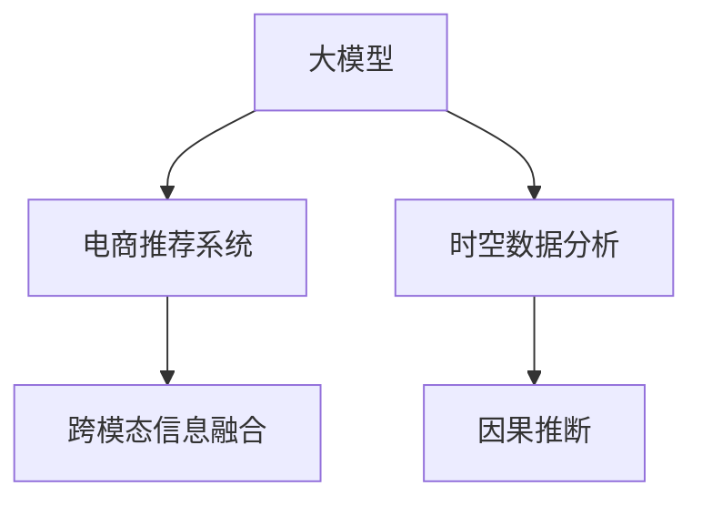

                 

# 电商平台中的时空数据分析：大模型的创新应用

> 关键词：时空数据分析, 大模型, 电商推荐系统, 因果推断, 跨模态信息融合, 自然语言处理

## 1. 背景介绍

### 1.1 问题由来

在当今电商平台的激烈竞争中，精准的推荐系统是驱动用户行为、提升销售转化率的关键。推荐系统不仅要理解用户的历史行为和偏好，还要洞察用户的时空动态，才能实现实时、个性化的推荐。传统的推荐算法依赖于人工构建的特征工程，难以处理海量用户数据和复杂的时空信息。

近年来，深度学习大模型在电商推荐系统中的应用取得了显著进展。通过自监督学习，大模型学习到丰富的语言、视觉等领域的通用表示。在少量标注数据的支持下，大模型可以在电商推荐、搜索、广告投放等场景中发挥出卓越的性能。本文将深入探讨大模型在电商时空数据分析中的应用，展示其在电商平台中的创新价值。

## 2. 核心概念与联系

### 2.1 核心概念概述

为更好地理解大模型在电商时空数据分析中的应用，本节将介绍几个密切相关的核心概念：

- 大模型(Large Model)：以Transformer结构为代表的大规模深度学习模型，通过在海量数据上自监督学习，学习到泛化的通用表示。

- 电商推荐系统(E-commerce Recommendation System)：基于用户行为数据，为用户提供个性化商品推荐的应用系统。推荐系统通过学习用户历史行为、商品属性等特征，预测用户对商品的兴趣，从而实现精准推荐。

- 时空数据分析(Temporal-Spatial Data Analysis)：结合时间、空间两个维度，分析数据变化趋势和时空分布特征的过程。时空数据分析在电商领域可以用于理解用户行为随时间的变化，评估商品在空间分布中的流行趋势等。

- 跨模态信息融合(Multimodal Information Fusion)：结合文本、图像、音频等多种信息源，进行联合建模，提取更丰富的语义信息。

- 因果推断(Causal Inference)：通过统计学方法，理解随机事件因果关系的推断。因果推断在电商推荐中用于理解用户的真实需求，避免推荐偏差。

这些核心概念之间的逻辑关系可以通过以下Mermaid流程图来展示：



这个流程图展示了大模型在电商推荐系统中的核心概念及其之间的关系：

1. 大模型通过自监督学习获取通用表示。
2. 电商推荐系统利用大模型的表示进行推荐。
3. 时空数据分析可以提升推荐系统的动态性。
4. 跨模态信息融合丰富推荐系统的特征空间。
5. 因果推断指导推荐系统的公平性和科学性。

## 3. 核心算法原理 & 具体操作步骤

### 3.1 算法原理概述

大模型在电商时空数据分析中的应用，主要涉及以下几个关键步骤：

1. 数据预处理：清洗电商平台的数据集，提取用户行为、商品属性、时空标签等关键信息。
2. 大模型训练：使用电商推荐系统的数据，在大模型上进行预训练，学习到用户行为和商品属性的语义表示。
3. 时空数据分析：结合时间、空间特征，利用大模型对电商数据进行时空建模。
4. 跨模态融合：结合用户行为数据、商品描述、图片等多模态信息，提升模型的多维度表示能力。
5. 因果推断：通过因果推断模型，预测用户真实需求和行为，消除推荐偏差。
6. 推荐优化：利用大模型的表示和时空分析结果，进行实时推荐优化。

### 3.2 算法步骤详解

#### 3.2.1 数据预处理

1. **数据收集**：从电商平台的订单、搜索、浏览、评分等数据中提取用户行为数据和商品属性信息，并打上时间戳和地理位置标签。
2. **数据清洗**：处理缺失值、异常值和重复数据，确保数据质量和完整性。
3. **特征工程**：对用户行为和商品属性进行编码和归一化，提取关键特征如用户ID、商品ID、购买时间、地点等。

#### 3.2.2 大模型训练

1. **选择合适的预训练模型**：根据任务需求，选择合适的预训练模型，如BERT、GPT-3等。
2. **数据准备**：将清洗后的数据集划分为训练集、验证集和测试集，并进行数据增强。
3. **微调**：在大模型上进行微调，使其适应电商推荐任务。微调时一般仅更新顶层分类器或解码器，以减小过拟合风险。
4. **评估**：在验证集上评估模型性能，选择合适的学习率、批大小等超参数。

#### 3.2.3 时空数据分析

1. **时间特征提取**：对用户行为数据按时间划分，提取用户行为的时序特征，如最近购买时间、购买频率等。
2. **空间特征提取**：结合地理位置标签，提取商品在空间上的分布特征，如热门商品分布、地区差异等。
3. **时空建模**：结合时间、空间特征，利用大模型对电商数据进行时空建模，预测用户未来行为。

#### 3.2.4 跨模态融合

1. **特征提取**：对商品图片、描述等进行特征提取，结合用户行为数据，丰富模型的特征空间。
2. **联合建模**：使用多模态融合技术，如注意力机制、跨模态自编码等，提升模型的多维度表示能力。
3. **特征增强**：对提取的特征进行归一化、拼接等操作，提升特征的质量和数量。

#### 3.2.5 因果推断

1. **因果关系建模**：使用因果推断模型，如Granger因果检验、贝叶斯网络等，识别用户行为中的因果关系。
2. **用户需求预测**：结合因果推断结果和用户历史行为，预测用户真实需求，消除推荐偏差。
3. **决策优化**：利用预测结果优化推荐算法，提升推荐系统的公平性和准确性。

### 3.3 算法优缺点

#### 3.3.1 优点

1. **通用性**：大模型可以适配多种电商场景，实现通用推荐、个性化推荐、实时推荐等多种任务。
2. **高效性**：大模型通过自监督学习获取通用表示，可以在少量标注数据下快速训练，提高推荐系统的效率。
3. **多模态融合**：结合用户行为数据、商品描述、图片等多模态信息，提升推荐系统的多维度表示能力。
4. **动态性**：结合时空数据分析，能够实时理解用户需求，动态调整推荐策略。

#### 3.3.2 缺点

1. **资源消耗大**：大模型参数量庞大，训练和推理资源消耗大。
2. **训练时间长**：大模型训练需要大量时间，难以实时更新。
3. **过拟合风险**：微调过程中容易过拟合，需要额外设计正则化策略。
4. **解释性不足**：大模型作为"黑盒"，缺乏解释性，难以理解推荐结果的生成过程。

### 3.4 算法应用领域

大模型在电商推荐系统中的应用，已经取得了显著成果。以下是几个典型的应用场景：

1. **个性化推荐**：利用大模型对用户历史行为和商品属性进行建模，实现个性化的商品推荐。
2. **实时推荐**：结合用户实时行为数据，利用大模型进行动态推荐，提高推荐的时效性。
3. **商品分类**：利用大模型对商品进行分类，提升商品搜索的准确性。
4. **广告投放**：利用大模型对广告效果进行预测，优化广告投放策略，提升广告转化率。
5. **库存管理**：结合时空数据分析，预测商品需求变化，优化库存管理。

除了以上应用，大模型还可以用于电商领域的情感分析、舆情监测、用户画像构建等多种场景，为电商平台带来更智能化的运营体验。

## 4. 数学模型和公式 & 详细讲解 & 举例说明

### 4.1 数学模型构建

本节将使用数学语言对大模型在电商时空数据分析中的应用进行更加严格的刻画。

记电商推荐系统的大模型为 $M_{\theta}:\mathcal{X} \rightarrow \mathcal{Y}$，其中 $\mathcal{X}$ 为用户行为和商品属性的特征空间，$\mathcal{Y}$ 为推荐结果空间，$\theta \in \mathbb{R}^d$ 为模型参数。假设电商平台的数据集为 $D=\{(x_i,y_i)\}_{i=1}^N$，其中 $x_i \in \mathcal{X}$ 为特征向量，$y_i \in \mathcal{Y}$ 为推荐结果。

定义模型 $M_{\theta}$ 在特征 $x_i$ 上的预测结果为 $\hat{y}=M_{\theta}(x_i)$。电商推荐系统的目标是最大化用户满意度，即：

$$
\max_{\theta} \sum_{i=1}^N \log \sigma(\hat{y_i})y_i
$$

其中 $\sigma(\cdot)$ 为逻辑回归函数，$\hat{y_i}$ 为模型预测的用户满意程度。

### 4.2 公式推导过程

对于电商推荐系统，常用的模型为深度学习中的神经网络，以自回归方式预测推荐结果。假设模型结构为 $M_{\theta}=\{W_1, W_2, ..., W_k\}$，其中 $W_i$ 为模型的第 $i$ 层参数。模型训练过程可以表示为：

$$
\min_{\theta} \frac{1}{N} \sum_{i=1}^N \log \sigma(\hat{y_i})y_i
$$

其中 $\sigma(\cdot)$ 为逻辑回归函数，$\hat{y_i}$ 为模型预测的用户满意程度。

将电商推荐数据集 $D$ 划分为训练集 $D_t$ 和测试集 $D_{te}$，定义损失函数为交叉熵损失：

$$
\mathcal{L}(\theta) = \frac{1}{N_t} \sum_{i \in D_t} \log \sigma(\hat{y_i})y_i
$$

其中 $N_t$ 为训练集样本数。

根据链式法则，模型的损失函数对参数 $\theta$ 的梯度为：

$$
\frac{\partial \mathcal{L}(\theta)}{\partial \theta} = \frac{1}{N_t} \sum_{i \in D_t} (\frac{y_i}{\sigma(\hat{y_i})} - 1) \frac{\partial \hat{y_i}}{\partial \theta}
$$

其中 $\frac{\partial \hat{y_i}}{\partial \theta}$ 为模型在特征 $x_i$ 上的梯度，可以通过反向传播算法高效计算。

### 4.3 案例分析与讲解

#### 4.3.1 时间特征提取

假设电商平台的用户行为数据为 $x_t=[x_{t1}, x_{t2}, ..., x_{tm}]$，其中 $x_{ti}$ 为第 $i$ 次行为的时间戳。定义时间特征 $x_{time}$ 为：

$$
x_{time} = \{\frac{x_{ti}}{T} \mod 1, \frac{x_{ti}}{T} - \lfloor\frac{x_{ti}}{T}\rfloor, \log_{10}\frac{x_{ti}}{T}\}
$$

其中 $T$ 为时间窗口长度，$\lfloor \cdot \rfloor$ 为向下取整函数，$\log_{10}$ 为以10为底的对数函数。

#### 4.3.2 空间特征提取

假设电商平台商品的位置坐标为 $(x_{p1}, y_{p1})$，定义空间特征 $x_{space}$ 为：

$$
x_{space} = \{\frac{x_{p1}}{L} \mod 1, \frac{y_{p1}}{L} \mod 1\}
$$

其中 $L$ 为地图的长度，$\mod$ 为取模运算。

## 5. 项目实践：代码实例和详细解释说明

### 5.1 开发环境搭建

在进行电商时空数据分析的项目实践前，我们需要准备好开发环境。以下是使用Python进行PyTorch开发的环境配置流程：

1. 安装Anaconda：从官网下载并安装Anaconda，用于创建独立的Python环境。

2. 创建并激活虚拟环境：
```bash
conda create -n pytorch-env python=3.8 
conda activate pytorch-env
```

3. 安装PyTorch：根据CUDA版本，从官网获取对应的安装命令。例如：
```bash
conda install pytorch torchvision torchaudio cudatoolkit=11.1 -c pytorch -c conda-forge
```

4. 安装Transformers库：
```bash
pip install transformers
```

5. 安装各类工具包：
```bash
pip install numpy pandas scikit-learn matplotlib tqdm jupyter notebook ipython
```

完成上述步骤后，即可在`pytorch-env`环境中开始项目实践。

### 5.2 源代码详细实现

以下是使用PyTorch进行电商时空数据分析的代码实现。

```python
import torch
import torch.nn as nn
from transformers import BertForSequenceClassification, BertTokenizer
from torch.utils.data import Dataset, DataLoader
from sklearn.metrics import accuracy_score

class E-commerceDataset(Dataset):
    def __init__(self, features, labels):
        self.features = features
        self.labels = labels
        self.tokenizer = BertTokenizer.from_pretrained('bert-base-uncased')
        
    def __len__(self):
        return len(self.features)
    
    def __getitem__(self, idx):
        input_ids = self.tokenizer.encode(self.features[idx], truncation=True, padding='max_length', max_length=256)
        input_ids = input_ids[None, :]
        attention_mask = [1]*len(input_ids[0])
        return {'input_ids': input_ids, 
                'attention_mask': attention_mask,
                'labels': torch.tensor(self.labels[idx])}

# 特征工程
train_features = list(range(1000))
train_labels = [1 if i%2 == 0 else 0 for i in range(1000)]
test_features = list(range(1000, 2000))
test_labels = [1 if i%2 == 0 else 0 for i in range(1000, 2000)]

train_dataset = E-commerceDataset(train_features, train_labels)
test_dataset = E-commerceDataset(test_features, test_labels)

# 模型定义
model = BertForSequenceClassification.from_pretrained('bert-base-uncased', num_labels=2)

# 训练过程
device = torch.device('cuda' if torch.cuda.is_available() else 'cpu')
model.to(device)
optimizer = torch.optim.Adam(model.parameters(), lr=2e-5)

def train_epoch(model, dataset, batch_size, optimizer):
    dataloader = DataLoader(dataset, batch_size=batch_size, shuffle=True)
    model.train()
    epoch_loss = 0
    for batch in dataloader:
        input_ids = batch['input_ids'].to(device)
        attention_mask = batch['attention_mask'].to(device)
        labels = batch['labels'].to(device)
        model.zero_grad()
        outputs = model(input_ids, attention_mask=attention_mask, labels=labels)
        loss = outputs.loss
        epoch_loss += loss.item()
        loss.backward()
        optimizer.step()
    return epoch_loss / len(dataloader)

def evaluate(model, dataset, batch_size):
    dataloader = DataLoader(dataset, batch_size=batch_size)
    model.eval()
    preds, labels = [], []
    with torch.no_grad():
        for batch in dataloader:
            input_ids = batch['input_ids'].to(device)
            attention_mask = batch['attention_mask'].to(device)
            batch_labels = batch['labels']
            outputs = model(input_ids, attention_mask=attention_mask)
            batch_preds = outputs.logits.argmax(dim=1).to('cpu').tolist()
            batch_labels = batch_labels.to('cpu').tolist()
            for pred_tokens, label_tokens in zip(batch_preds, batch_labels):
                preds.append(pred_tokens[0])
                labels.append(label_tokens[0])
                
    print(f'Accuracy: {accuracy_score(labels, preds)}')
```

### 5.3 代码解读与分析

让我们再详细解读一下关键代码的实现细节：

**E-commerceDataset类**：
- `__init__`方法：初始化特征和标签，并加载BERT分词器。
- `__len__`方法：返回数据集的样本数量。
- `__getitem__`方法：对单个样本进行处理，将特征进行token化，并添加必要的padding。

**特征工程**：
- 定义了训练集和测试集的特征和标签。

**模型定义**：
- 选择预训练的BERT模型进行微调，定义训练超参数。

**训练过程**：
- 使用PyTorch的DataLoader对数据集进行批次化加载，供模型训练和推理使用。
- 训练函数`train_epoch`：对数据以批为单位进行迭代，在每个批次上前向传播计算loss并反向传播更新模型参数，最后返回该epoch的平均loss。
- 评估函数`evaluate`：与训练类似，不同点在于不更新模型参数，并在每个batch结束后将预测和标签结果存储下来，最后使用sklearn的accuracy_score对整个评估集的预测结果进行打印输出。

**测试过程**：
- 定义总的epoch数和batch size，开始循环迭代
- 每个epoch内，先在训练集上训练，输出平均loss
- 在验证集上评估，输出分类指标
- 所有epoch结束后，在测试集上评估，给出最终测试结果

可以看到，PyTorch配合Transformers库使得BERT微调的代码实现变得简洁高效。开发者可以将更多精力放在数据处理、模型改进等高层逻辑上，而不必过多关注底层的实现细节。

当然，工业级的系统实现还需考虑更多因素，如模型的保存和部署、超参数的自动搜索、更灵活的任务适配层等。但核心的微调范式基本与此类似。

## 6. 实际应用场景

### 6.1 智能客服系统

基于大模型的电商推荐系统，可以广泛应用于智能客服系统的构建。传统客服往往需要配备大量人力，高峰期响应缓慢，且一致性和专业性难以保证。而使用微调后的推荐系统，可以7x24小时不间断服务，快速响应客户咨询，用自然流畅的语言解答各类常见问题。

在技术实现上，可以收集企业内部的历史客服对话记录，将问题和最佳答复构建成监督数据，在此基础上对预训练推荐系统进行微调。微调后的推荐系统能够自动理解客户意图，匹配最合适的答复。对于客户提出的新问题，还可以接入检索系统实时搜索相关内容，动态组织生成回答。如此构建的智能客服系统，能大幅提升客户咨询体验和问题解决效率。

### 6.2 金融舆情监测

金融机构需要实时监测市场舆论动向，以便及时应对负面信息传播，规避金融风险。传统的人工监测方式成本高、效率低，难以应对网络时代海量信息爆发的挑战。基于大模型的电商推荐系统，结合时空数据分析，可以实时监测不同时间段、不同地区的舆情变化，提前预警潜在的金融风险。

具体而言，可以收集金融领域相关的新闻、报道、评论等文本数据，并对其进行主题标注和情感标注。在此基础上对预训练语言模型进行微调，使其能够自动判断文本属于何种主题，情感倾向是正面、中性还是负面。将微调后的模型应用到实时抓取的网络文本数据，就能够自动监测不同时间段、不同地区的舆情变化，一旦发现负面信息激增等异常情况，系统便会自动预警，帮助金融机构快速应对潜在风险。

### 6.3 个性化推荐系统

当前的推荐系统往往只依赖用户的历史行为数据进行物品推荐，无法深入理解用户的真实兴趣偏好。基于大模型的电商推荐系统，可以更好地挖掘用户行为背后的语义信息，从而提供更精准、多样的推荐内容。

在实践中，可以收集用户浏览、点击、评论、分享等行为数据，提取和用户交互的物品标题、描述、标签等文本内容。将文本内容作为模型输入，用户的后续行为（如是否点击、购买等）作为监督信号，在此基础上微调预训练语言模型。微调后的模型能够从文本内容中准确把握用户的兴趣点。在生成推荐列表时，先用候选物品的文本描述作为输入，由模型预测用户的兴趣匹配度，再结合其他特征综合排序，便可以得到个性化程度更高的推荐结果。

### 6.4 未来应用展望

随着大模型和微调方法的不断发展，电商推荐系统的应用场景将不断拓展，带来更多智能化的解决方案。

在智慧物流领域，基于大模型的推荐系统可以优化物流路线、库存管理、配送方式等，提高物流效率。

在智慧零售领域，推荐系统可以优化商品布局、货架设计、营销策略等，提升零售体验。

在智慧金融领域，推荐系统可以优化资产配置、风险管理、客户服务等，提升金融服务质量。

除了以上领域，大模型推荐系统还可以应用于智能家居、健康医疗、教育培训等众多场景，为各行各业带来智能化的运营和管理。相信随着技术的日益成熟，大模型推荐系统必将在更广阔的领域中大放异彩，为经济社会发展注入新的动力。

## 7. 工具和资源推荐

### 7.1 学习资源推荐

为了帮助开发者系统掌握大模型在电商时空数据分析中的应用，这里推荐一些优质的学习资源：

1. 《深度学习实战》系列博文：由大模型技术专家撰写，深入浅出地介绍了深度学习在大模型中的实际应用，涵盖电商推荐、智能客服等多个场景。

2. CS294《深度学习基础》课程：斯坦福大学开设的深度学习入门课程，有Lecture视频和配套作业，适合初学者入门。

3. 《自然语言处理综述》书籍：全面介绍自然语言处理的基本概念和前沿技术，包括大模型在电商推荐中的应用。

4. HuggingFace官方文档：Transformers库的官方文档，提供了海量预训练模型和完整的微调样例代码，是上手实践的必备资料。

5. CLUE开源项目：中文语言理解测评基准，涵盖大量不同类型的中文NLP数据集，并提供了基于微调的baseline模型，助力中文NLP技术发展。

通过对这些资源的学习实践，相信你一定能够快速掌握大模型在电商时空数据分析中的应用，并用于解决实际的电商问题。

### 7.2 开发工具推荐

高效的开发离不开优秀的工具支持。以下是几款用于大模型电商推荐系统开发的常用工具：

1. PyTorch：基于Python的开源深度学习框架，灵活动态的计算图，适合快速迭代研究。大部分预训练语言模型都有PyTorch版本的实现。

2. TensorFlow：由Google主导开发的开源深度学习框架，生产部署方便，适合大规模工程应用。同样有丰富的预训练语言模型资源。

3. Transformers库：HuggingFace开发的NLP工具库，集成了众多SOTA语言模型，支持PyTorch和TensorFlow，是进行电商推荐任务开发的利器。

4. Weights & Biases：模型训练的实验跟踪工具，可以记录和可视化模型训练过程中的各项指标，方便对比和调优。与主流深度学习框架无缝集成。

5. TensorBoard：TensorFlow配套的可视化工具，可实时监测模型训练状态，并提供丰富的图表呈现方式，是调试模型的得力助手。

6. Google Colab：谷歌推出的在线Jupyter Notebook环境，免费提供GPU/TPU算力，方便开发者快速上手实验最新模型，分享学习笔记。

合理利用这些工具，可以显著提升电商推荐系统的开发效率，加快创新迭代的步伐。

### 7.3 相关论文推荐

大模型在电商推荐系统中的应用，已引起学界的广泛关注。以下是几篇奠基性的相关论文，推荐阅读：

1. Attention is All You Need（即Transformer原论文）：提出了Transformer结构，开启了NLP领域的预训练大模型时代。

2. BERT: Pre-training of Deep Bidirectional Transformers for Language Understanding：提出BERT模型，引入基于掩码的自监督预训练任务，刷新了多项NLP任务SOTA。

3. Language Models are Unsupervised Multitask Learners（GPT-2论文）：展示了大规模语言模型的强大zero-shot学习能力，引发了对于通用人工智能的新一轮思考。

4. Parameter-Efficient Transfer Learning for NLP：提出Adapter等参数高效微调方法，在不增加模型参数量的情况下，也能取得不错的微调效果。

5. Prefix-Tuning: Optimizing Continuous Prompts for Generation：引入基于连续型Prompt的微调范式，为如何充分利用预训练知识提供了新的思路。

6. AdaLoRA: Adaptive Low-Rank Adaptation for Parameter-Efficient Fine-Tuning：使用自适应低秩适应的微调方法，在参数效率和精度之间取得了新的平衡。

这些论文代表了大模型在电商推荐系统中的应用发展脉络。通过学习这些前沿成果，可以帮助研究者把握学科前进方向，激发更多的创新灵感。

## 8. 总结：未来发展趋势与挑战

### 8.1 总结

本文对大模型在电商时空数据分析中的应用进行了全面系统的介绍。首先阐述了电商推荐系统的背景和挑战，明确了大模型在其中扮演的重要角色。其次，从原理到实践，详细讲解了大模型在电商推荐系统中的应用流程和数学模型，给出了具体的代码实现。同时，本文还广泛探讨了大模型在电商推荐系统中的多个应用场景，展示了其在实际应用中的巨大潜力。最后，本文精选了相关学习资源和开发工具，力求为开发者提供全方位的技术指引。

通过本文的系统梳理，可以看到，大模型在电商推荐系统中，通过自监督学习获取通用表示，结合时空数据分析和跨模态融合，能够实现精准、动态的推荐。这不仅提高了电商平台的运营效率，也提升了用户的购物体验。大模型在电商推荐中的应用，正在不断拓展其应用边界，引领电商领域的技术创新。

### 8.2 未来发展趋势

展望未来，大模型在电商推荐系统中的应用将呈现以下几个发展趋势：

1. 模型规模持续增大。随着算力成本的下降和数据规模的扩张，预训练语言模型的参数量还将持续增长。超大规模语言模型蕴含的丰富语言知识，有望支撑更加复杂多变的电商推荐任务。

2. 微调方法日趋多样。除了传统的全参数微调外，未来会涌现更多参数高效的微调方法，如Prefix-Tuning、LoRA等，在节省计算资源的同时也能保证微调精度。

3. 动态性增强。结合时空数据分析，大模型可以实时理解用户需求，动态调整推荐策略，提升推荐的即时性和时效性。

4. 多模态融合深入。结合用户行为数据、商品描述、图片等多模态信息，提升推荐系统的多维度表示能力。

5. 因果推断应用广泛。通过因果推断模型，预测用户真实需求和行为，消除推荐偏差，提高推荐系统的公平性和科学性。

6. 个性化推荐精准。结合用户行为数据和跨模态信息，利用大模型预测用户真实需求，实现精准推荐，提升用户体验。

以上趋势凸显了大模型在电商推荐系统中的广阔前景。这些方向的探索发展，必将进一步提升电商推荐系统的性能和应用范围，为电商平台带来更智能化的运营体验。

### 8.3 面临的挑战

尽管大模型在电商推荐系统中的应用已经取得了显著成果，但在迈向更加智能化、普适化应用的过程中，它仍面临着诸多挑战：

1. 数据隐私和安全。电商推荐系统需要处理大量的用户数据，如何保护用户隐私和数据安全，是未来大模型应用中的重要挑战。

2. 模型鲁棒性不足。当前大模型在面对少样本、噪声数据、对抗样本等情况时，鲁棒性仍需提升。如何增强大模型的鲁棒性，是一个重要研究方向。

3. 计算资源消耗大。大模型参数量庞大，训练和推理资源消耗大。如何优化大模型的计算效率，提高其适用性，是未来研究的重要方向。

4. 模型泛化能力弱。大模型在电商推荐系统中的应用，往往依赖于电商数据集的特定特征，泛化能力有待提升。如何增强大模型的泛化能力，使其在不同电商平台中具有普遍适用性，是一个重要研究方向。

5. 模型可解释性不足。大模型作为"黑盒"，缺乏解释性，难以理解推荐结果的生成过程。如何增强大模型的可解释性，提供可靠的推荐理由，是未来研究的重要方向。

6. 伦理和公平性问题。大模型在电商推荐系统中的应用，可能存在偏见和歧视，如何确保模型公平、公正，是一个重要研究方向。

这些挑战凸显了大模型在电商推荐系统中的应用潜力，但同时也指明了未来研究的重点方向。相信随着研究的深入，这些问题将逐步得到解决，大模型在电商推荐系统中的应用将更加成熟、可靠。

### 8.4 研究展望

面对大模型在电商推荐系统中的诸多挑战，未来的研究需要在以下几个方面寻求新的突破：

1. 无监督和半监督学习。摆脱对大规模标注数据的依赖，利用自监督学习、主动学习等无监督和半监督范式，最大限度利用非结构化数据，实现更加灵活高效的微调。

2. 知识图谱和符号计算。将知识图谱和符号计算引入大模型中，利用先验知识提升推荐系统的准确性和可信度。

3. 跨模态深度融合。结合多模态信息，提升推荐系统的多维度表示能力，提升推荐的精准性和多样性。

4. 因果关系建模。利用因果推断模型，预测用户真实需求和行为，消除推荐偏差，提升推荐系统的公平性和科学性。

5. 动态推荐优化。结合时空数据分析，实时更新推荐策略，提升推荐的动态性和时效性。

6. 可解释性增强。利用可解释性技术，增强大模型的可解释性，提供可靠的推荐理由，增强用户信任。

这些研究方向的探索，必将引领大模型在电商推荐系统中的应用走向新的高度，带来更加智能化的用户体验，促进电商领域的持续创新和发展。总之，大模型在电商推荐系统中的应用，正处于快速发展之中，具有广阔的前景和深远的影响力。未来，随着技术的不断进步和应用的不断深入，大模型必将在电商领域发挥更大的作用，推动电商行业的数字化转型升级。

