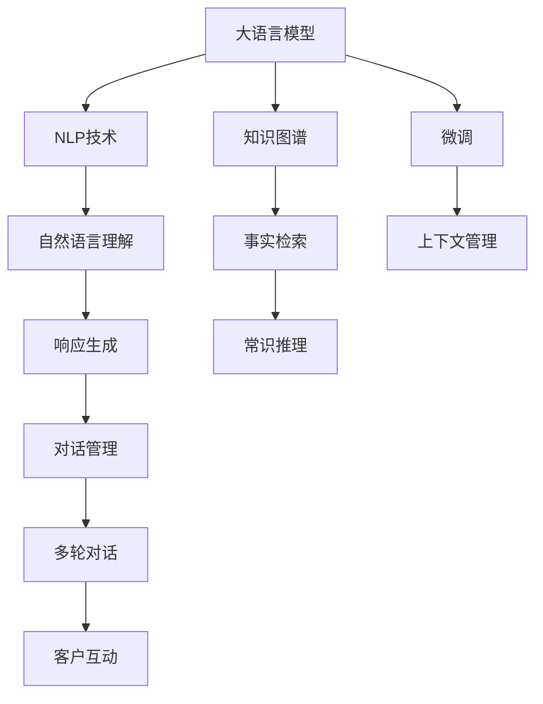

                 

# 电商平台中的智能问答系统：大模型的创新应用

## 1. 背景介绍

### 1.1 问题由来
电商平台作为连接消费者与商家的重要纽带，已经成为人们日常购物的重要渠道。然而，随着平台商品数量激增和用户需求日趋个性化，传统的人力客服模式越来越难以应对。消费者在购物过程中遇到的各种问题，如商品详情、物流状态、售后服务等，需要通过智能问答系统（Chatbot）快速响应，提高用户体验和服务效率。

大语言模型（Large Language Model, LLM）通过大规模预训练获得了丰富的语言理解和生成能力。通过在电商平台中引入大语言模型，可以构建高效、智能的智能问答系统，解决消费者在购物过程中遇到的各种问题，提升电商平台的用户体验和服务效率。

### 1.2 问题核心关键点
- **自然语言理解与生成**：智能问答系统需要具备强大的自然语言理解能力，能够准确理解用户输入的文本，并生成符合语境的回应。
- **知识图谱与常识推理**：系统需要整合商品、物流、用户评价等多维度的信息，进行事实检索和常识推理，提供准确的答案。
- **多轮对话与上下文管理**：智能问答系统需要具备多轮对话的能力，理解上下文，持续跟踪对话，提供连贯的回答。
- **高效部署与扩展**：系统需要能够在电商平台中进行高效部署，具备高并发处理能力，能够扩展到大规模的客户互动场景中。

## 2. 核心概念与联系

### 2.1 核心概念概述

为更好地理解智能问答系统在大电商平台中的应用，本节将介绍几个密切相关的核心概念：

- **大语言模型**：以自回归（如GPT）或自编码（如BERT）模型为代表的大规模预训练语言模型。通过在大规模无标签文本语料上进行预训练，学习通用的语言表示，具备强大的语言理解和生成能力。

- **知识图谱**：结构化的知识库，将实体、关系和属性映射到图形结构中。通过知识图谱，系统可以更好地理解实体之间的复杂关系，进行事实检索和推理。

- **自然语言处理（NLP）**：涉及计算机与人类语言交互的各类技术，包括分词、词性标注、句法分析、语义分析、文本生成等。智能问答系统需要利用NLP技术，将自然语言转换为机器可理解的形式，并生成自然语言响应。

- **深度学习**：通过多层神经网络模拟人脑处理复杂任务的方式，用于自然语言处理、计算机视觉、语音识别等领域的任务。智能问答系统广泛使用了深度学习模型，如Transformer、BERT等。

- **微调（Fine-Tuning）**：指在预训练模型的基础上，使用下游任务的少量标注数据，通过有监督地训练优化模型在该任务上的性能。智能问答系统可以通过微调，优化模型在特定任务上的表现，提高对话的准确性和流畅性。

这些核心概念之间的逻辑关系可以通过以下Mermaid流程图来展示：



这个流程图展示了大语言模型、知识图谱、NLP技术、微调等核心概念及其之间的关系：

1. 大语言模型通过预训练获得基础能力。
2. 知识图谱提供结构化的信息检索和推理能力。
3. NLP技术将自然语言转换为机器可理解的形式。
4. 微调优化模型在特定任务上的性能。
5. 对话管理实现多轮对话的上下文跟踪。
6. 常识推理提高回答的准确性和合理性。
7. 上下文管理保持对话的连贯性。

## 3. 核心算法原理 & 具体操作步骤

### 3.1 算法原理概述

智能问答系统在大电商平台中的核心算法，基于深度学习和大语言模型的预训练-微调范式。其核心思想是：将大语言模型作为强大的"特征提取器"，通过在电商平台的用户提问和回答中进行有监督的微调，使得模型能够根据电商平台的特定需求，输出高质量的回答。

形式化地，假设大语言模型为 $M_{\theta}$，其中 $\theta$ 为预训练得到的模型参数。给定电商平台的问答数据集 $D=\{(x_i, y_i)\}_{i=1}^N$，其中 $x_i$ 为用户的输入问题，$y_i$ 为系统的输出回答。微调的目标是找到新的模型参数 $\hat{\theta}$，使得：

$$
\hat{\theta}=\mathop{\arg\min}_{\theta} \mathcal{L}(M_{\theta},D)
$$

其中 $\mathcal{L}$ 为针对问答任务设计的损失函数，用于衡量模型预测输出与真实标签之间的差异。常见的损失函数包括交叉熵损失、均方误差损失等。

通过梯度下降等优化算法，微调过程不断更新模型参数 $\theta$，最小化损失函数 $\mathcal{L}$，使得模型输出逼近真实标签。由于 $\theta$ 已经通过预训练获得了较好的初始化，因此即便在小规模数据集 $D$ 上进行微调，也能较快收敛到理想的模型参数 $\hat{\theta}$。

### 3.2 算法步骤详解

智能问答系统在大电商平台中的微调过程，一般包括以下几个关键步骤：

**Step 1: 准备预训练模型和数据集**
- 选择合适的预训练语言模型 $M_{\theta}$ 作为初始化参数，如 BERT、GPT等。
- 准备电商平台的问答数据集 $D$，划分为训练集、验证集和测试集。一般要求标注数据与预训练数据的分布不要差异过大。

**Step 2: 添加任务适配层**
- 根据电商平台问答任务的需求，在预训练模型顶层设计合适的输出层和损失函数。
- 对于文本匹配任务，通常在顶层添加分类器输出任务标签。
- 对于问答生成任务，通常使用语言模型的解码器输出概率分布，并以负对数似然为损失函数。

**Step 3: 设置微调超参数**
- 选择合适的优化算法及其参数，如 AdamW、SGD 等，设置学习率、批大小、迭代轮数等。
- 设置正则化技术及强度，包括权重衰减、Dropout、Early Stopping 等。
- 确定冻结预训练参数的策略，如仅微调顶层，或全部参数都参与微调。

**Step 4: 执行梯度训练**
- 将训练集数据分批次输入模型，前向传播计算损失函数。
- 反向传播计算参数梯度，根据设定的优化算法和学习率更新模型参数。
- 周期性在验证集上评估模型性能，根据性能指标决定是否触发 Early Stopping。
- 重复上述步骤直到满足预设的迭代轮数或 Early Stopping 条件。

**Step 5: 测试和部署**
- 在测试集上评估微调后模型 $M_{\hat{\theta}}$ 的性能，对比微调前后的精度提升。
- 使用微调后的模型对新样本进行推理预测，集成到实际的应用系统中。
- 持续收集新的数据，定期重新微调模型，以适应数据分布的变化。

以上是智能问答系统在大电商平台中的微调流程。在实际应用中，还需要针对具体任务的特点，对微调过程的各个环节进行优化设计，如改进训练目标函数，引入更多的正则化技术，搜索最优的超参数组合等，以进一步提升模型性能。

### 3.3 算法优缺点

智能问答系统在大电商平台中的微调方法具有以下优点：
1. 快速响应：基于大语言模型的微调系统能够快速理解用户输入，提供即时响应。
2. 泛化能力强：预训练模型已经在大量无标签文本数据上进行了训练，具有较强的泛化能力，能够适应电商平台的多种场景。
3. 效果好：微调后的系统在电商平台的问答任务上，能够取得比从头训练更高的精度和效率。
4. 扩展性好：微调过程灵活，易于在不同任务之间进行迁移，便于持续优化和扩展。

同时，该方法也存在一定的局限性：
1. 依赖标注数据：微调的效果很大程度上取决于标注数据的质量和数量，获取高质量标注数据的成本较高。
2. 模型复杂度：大语言模型的规模较大，资源消耗较高，需要高性能的硬件支持。
3. 可解释性不足：微调模型在电商平台的特定任务上表现较好，但整体推理过程缺乏可解释性。
4. 数据隐私：在用户对话中可能涉及敏感信息，如何保护用户隐私，是一个重要的挑战。

尽管存在这些局限性，但就目前而言，基于大语言模型的微调方法仍然是大电商平台智能问答系统的核心技术。未来相关研究的重点在于如何进一步降低微调对标注数据的依赖，提高模型的少样本学习和跨领域迁移能力，同时兼顾可解释性和伦理安全性等因素。

### 3.4 算法应用领域

智能问答系统在大电商平台中的应用，已经覆盖了多种不同类型的任务，例如：

- **产品推荐**：根据用户提问，推荐相关商品或信息。通过微调，系统能够理解用户的查询意图，提供个性化的商品推荐。
- **物流查询**：提供物流状态查询服务，回答用户关于包裹的配送、退换货等问题。通过微调，系统能够实时更新物流信息，确保回答的准确性。
- **售后服务**：处理用户的退换货、维修、质保等问题，提供即时响应。通过微调，系统能够掌握常见问题的解决方案，提供快速有效的服务。
- **商品咨询**：回答用户关于商品材质、成分、使用方法等具体问题，提供详细的商品信息。通过微调，系统能够整合商品标签和说明书等信息，提供准确的回答。
- **投诉处理**：处理用户的投诉和反馈，提供有效的解决方案。通过微调，系统能够快速理解用户的诉求，提供合理的处理建议。

除了上述这些经典任务外，智能问答系统还被创新性地应用到更多场景中，如智能导购、商品评价分析、客户画像构建等，为电商平台带来了全新的用户体验和运营效率。

## 4. 数学模型和公式 & 详细讲解  
### 4.1 数学模型构建

本节将使用数学语言对智能问答系统在大电商平台中的微调过程进行更加严格的刻画。

记大语言模型为 $M_{\theta}$，其中 $\theta$ 为模型参数。假设电商平台问答任务的数据集为 $D=\{(x_i,y_i)\}_{i=1}^N$，其中 $x_i$ 为用户的输入问题，$y_i$ 为系统的输出回答。

定义模型 $M_{\theta}$ 在输入 $x$ 上的输出为 $\hat{y}=M_{\theta}(x)$，表示系统预测的回答。定义损失函数为交叉熵损失函数：

$$
\ell(M_{\theta}(x),y) = -y\log M_{\theta}(x) - (1-y)\log(1-M_{\theta}(x))
$$

则经验风险为：

$$
\mathcal{L}(\theta) = \frac{1}{N} \sum_{i=1}^N \ell(M_{\theta}(x_i),y_i)
$$

微调的优化目标是最小化经验风险，即找到最优参数：

$$
\theta^* = \mathop{\arg\min}_{\theta} \mathcal{L}(\theta)
$$

在实践中，我们通常使用基于梯度的优化算法（如SGD、Adam等）来近似求解上述最优化问题。设 $\eta$ 为学习率，$\lambda$ 为正则化系数，则参数的更新公式为：

$$
\theta \leftarrow \theta - \eta \nabla_{\theta}\mathcal{L}(\theta) - \eta\lambda\theta
$$

其中 $\nabla_{\theta}\mathcal{L}(\theta)$ 为损失函数对参数 $\theta$ 的梯度，可通过反向传播算法高效计算。

### 4.2 公式推导过程

以下我们以电商平台中的文本匹配任务为例，推导交叉熵损失函数及其梯度的计算公式。

假设模型 $M_{\theta}$ 在输入 $x$ 上的输出为 $\hat{y}=M_{\theta}(x) \in [0,1]$，表示系统预测的回答属于回答集合 $\{A_1, A_2, ..., A_k\}$ 中的概率。真实标签 $y \in \{0,1\}$，其中 $y=1$ 表示用户的回答为 $A_i$。则二分类交叉熵损失函数定义为：

$$
\ell(M_{\theta}(x),y) = -y\log \hat{y} - (1-y)\log(1-\hat{y})
$$

将其代入经验风险公式，得：

$$
\mathcal{L}(\theta) = -\frac{1}{N}\sum_{i=1}^N [y_i\log M_{\theta}(x_i)+(1-y_i)\log(1-M_{\theta}(x_i))]
$$

根据链式法则，损失函数对参数 $\theta_k$ 的梯度为：

$$
\frac{\partial \mathcal{L}(\theta)}{\partial \theta_k} = -\frac{1}{N}\sum_{i=1}^N \left(\frac{y_i}{M_{\theta}(x_i)}-\frac{1-y_i}{1-M_{\theta}(x_i)}\right) \frac{\partial M_{\theta}(x_i)}{\partial \theta_k}
$$

其中 $\frac{\partial M_{\theta}(x_i)}{\partial \theta_k}$ 可进一步递归展开，利用自动微分技术完成计算。

在得到损失函数的梯度后，即可带入参数更新公式，完成模型的迭代优化。重复上述过程直至收敛，最终得到适应电商平台问答任务的最优模型参数 $\theta^*$。

## 5. 项目实践：代码实例和详细解释说明
### 5.1 开发环境搭建

在进行智能问答系统微调实践前，我们需要准备好开发环境。以下是使用Python进行PyTorch开发的环境配置流程：

1. 安装Anaconda：从官网下载并安装Anaconda，用于创建独立的Python环境。

2. 创建并激活虚拟环境：
```bash
conda create -n pytorch-env python=3.8 
conda activate pytorch-env
```

3. 安装PyTorch：根据CUDA版本，从官网获取对应的安装命令。例如：
```bash
conda install pytorch torchvision torchaudio cudatoolkit=11.1 -c pytorch -c conda-forge
```

4. 安装Transformers库：
```bash
pip install transformers
```

5. 安装各类工具包：
```bash
pip install numpy pandas scikit-learn matplotlib tqdm jupyter notebook ipython
```

完成上述步骤后，即可在`pytorch-env`环境中开始微调实践。

### 5.2 源代码详细实现

下面我们以电商平台中的文本匹配任务为例，给出使用Transformers库对BERT模型进行微调的PyTorch代码实现。

首先，定义文本匹配任务的数据处理函数：

```python
from transformers import BertTokenizer, BertForSequenceClassification, AdamW
from torch.utils.data import Dataset
import torch

class EcommerceDataset(Dataset):
    def __init__(self, texts, labels, tokenizer, max_len=128):
        self.texts = texts
        self.labels = labels
        self.tokenizer = tokenizer
        self.max_len = max_len
        
    def __len__(self):
        return len(self.texts)
    
    def __getitem__(self, item):
        text = self.texts[item]
        label = self.labels[item]
        
        encoding = self.tokenizer(text, return_tensors='pt', max_length=self.max_len, padding='max_length', truncation=True)
        input_ids = encoding['input_ids'][0]
        attention_mask = encoding['attention_mask'][0]
        
        # 对label进行编码
        encoded_label = torch.tensor([label], dtype=torch.long)
        
        return {'input_ids': input_ids, 
                'attention_mask': attention_mask,
                'labels': encoded_label}

# 定义label与id的映射
label2id = {'Negative': 0, 'Positive': 1}
id2label = {v: k for k, v in label2id.items()}

# 创建dataset
tokenizer = BertTokenizer.from_pretrained('bert-base-cased')

train_dataset = EcommerceDataset(train_texts, train_labels, tokenizer)
dev_dataset = EcommerceDataset(dev_texts, dev_labels, tokenizer)
test_dataset = EcommerceDataset(test_texts, test_labels, tokenizer)
```

然后，定义模型和优化器：

```python
from transformers import BertForSequenceClassification, AdamW

model = BertForSequenceClassification.from_pretrained('bert-base-cased', num_labels=len(label2id))

optimizer = AdamW(model.parameters(), lr=2e-5)
```

接着，定义训练和评估函数：

```python
from torch.utils.data import DataLoader
from tqdm import tqdm
from sklearn.metrics import classification_report

device = torch.device('cuda') if torch.cuda.is_available() else torch.device('cpu')
model.to(device)

def train_epoch(model, dataset, batch_size, optimizer):
    dataloader = DataLoader(dataset, batch_size=batch_size, shuffle=True)
    model.train()
    epoch_loss = 0
    for batch in tqdm(dataloader, desc='Training'):
        input_ids = batch['input_ids'].to(device)
        attention_mask = batch['attention_mask'].to(device)
        labels = batch['labels'].to(device)
        model.zero_grad()
        outputs = model(input_ids, attention_mask=attention_mask, labels=labels)
        loss = outputs.loss
        epoch_loss += loss.item()
        loss.backward()
        optimizer.step()
    return epoch_loss / len(dataloader)

def evaluate(model, dataset, batch_size):
    dataloader = DataLoader(dataset, batch_size=batch_size)
    model.eval()
    preds, labels = [], []
    with torch.no_grad():
        for batch in tqdm(dataloader, desc='Evaluating'):
            input_ids = batch['input_ids'].to(device)
            attention_mask = batch['attention_mask'].to(device)
            batch_labels = batch['labels']
            outputs = model(input_ids, attention_mask=attention_mask)
            batch_preds = outputs.logits.argmax(dim=1).to('cpu').tolist()
            batch_labels = batch_labels.to('cpu').tolist()
            for pred, label in zip(batch_preds, batch_labels):
                preds.append(pred)
                labels.append(label)
                
    print(classification_report(labels, preds))
```

最后，启动训练流程并在测试集上评估：

```python
epochs = 5
batch_size = 16

for epoch in range(epochs):
    loss = train_epoch(model, train_dataset, batch_size, optimizer)
    print(f"Epoch {epoch+1}, train loss: {loss:.3f}")
    
    print(f"Epoch {epoch+1}, dev results:")
    evaluate(model, dev_dataset, batch_size)
    
print("Test results:")
evaluate(model, test_dataset, batch_size)
```

以上就是使用PyTorch对BERT进行电商问答任务微调的完整代码实现。可以看到，得益于Transformers库的强大封装，我们可以用相对简洁的代码完成BERT模型的加载和微调。

### 5.3 代码解读与分析

让我们再详细解读一下关键代码的实现细节：

**EcommerceDataset类**：
- `__init__`方法：初始化文本、标签、分词器等关键组件。
- `__len__`方法：返回数据集的样本数量。
- `__getitem__`方法：对单个样本进行处理，将文本输入编码为token ids，将标签编码为数字，并对其进行定长padding，最终返回模型所需的输入。

**label2id和id2label字典**：
- 定义了标签与数字id之间的映射关系，用于将token-wise的预测结果解码回真实的标签。

**训练和评估函数**：
- 使用PyTorch的DataLoader对数据集进行批次化加载，供模型训练和推理使用。
- 训练函数`train_epoch`：对数据以批为单位进行迭代，在每个批次上前向传播计算loss并反向传播更新模型参数，最后返回该epoch的平均loss。
- 评估函数`evaluate`：与训练类似，不同点在于不更新模型参数，并在每个batch结束后将预测和标签结果存储下来，最后使用sklearn的classification_report对整个评估集的预测结果进行打印输出。

**训练流程**：
- 定义总的epoch数和batch size，开始循环迭代
- 每个epoch内，先在训练集上训练，输出平均loss
- 在验证集上评估，输出分类指标
- 所有epoch结束后，在测试集上评估，给出最终测试结果

可以看到，PyTorch配合Transformers库使得BERT微调的代码实现变得简洁高效。开发者可以将更多精力放在数据处理、模型改进等高层逻辑上，而不必过多关注底层的实现细节。

当然，工业级的系统实现还需考虑更多因素，如模型的保存和部署、超参数的自动搜索、更灵活的任务适配层等。但核心的微调范式基本与此类似。

## 6. 实际应用场景
### 6.1 智能客服系统

智能客服系统作为电商平台的重要组成部分，承担着与用户交互、解答疑问的重要任务。传统客服往往需要配备大量人力，高峰期响应缓慢，且一致性和专业性难以保证。而使用微调后的智能客服系统，可以7x24小时不间断服务，快速响应客户咨询，用自然流畅的语言解答各类常见问题。

在技术实现上，可以收集企业内部的历史客服对话记录，将问题和最佳答复构建成监督数据，在此基础上对预训练对话模型进行微调。微调后的对话模型能够自动理解用户意图，匹配最合适的答案模板进行回复。对于客户提出的新问题，还可以接入检索系统实时搜索相关内容，动态组织生成回答。如此构建的智能客服系统，能大幅提升客户咨询体验和问题解决效率。

### 6.2 商品推荐系统

商品推荐系统是电商平台的核心功能之一，通过推荐个性化的商品，提升用户体验和销售额。传统的推荐系统往往只依赖用户的历史行为数据进行物品推荐，无法深入理解用户的真实兴趣偏好。基于大语言模型微调技术，个性化推荐系统可以更好地挖掘用户行为背后的语义信息，从而提供更精准、多样的推荐内容。

在实践中，可以收集用户浏览、点击、评论、分享等行为数据，提取和用户交互的物品标题、描述、标签等文本内容。将文本内容作为模型输入，用户的后续行为（如是否点击、购买等）作为监督信号，在此基础上微调预训练语言模型。微调后的模型能够从文本内容中准确把握用户的兴趣点。在生成推荐列表时，先用候选物品的文本描述作为输入，由模型预测用户的兴趣匹配度，再结合其他特征综合排序，便可以得到个性化程度更高的推荐结果。

### 6.3 客户画像构建

客户画像是大电商平台数据分析的重要应用场景，通过深入了解客户特征，能够更好地进行精准营销和个性化服务。传统的客户画像构建需要大量手工标注和特征工程，成本较高且难以自动化。而基于大语言模型的微调技术，可以自动构建客户画像，快速生成客户特征报告，提升数据驱动决策的能力。

具体而言，可以收集客户的历史浏览、购买、评价等数据，通过自然语言处理技术提取文本信息。将文本内容作为模型输入，结合客户的其他特征（如年龄、性别、地域等），进行多模态数据融合，得到客户画像的详细报告。通过微调，模型能够更好地理解客户的语义信息，提供更加全面、准确的客户画像。

### 6.4 未来应用展望

随着大语言模型微调技术的发展，其应用场景将不断拓展，为电商平台的运营带来新的突破。

在智慧物流领域，基于大语言模型的智能问答系统可以提升物流服务的智能化水平，辅助物流客服解决各种问题，提高客户满意度。

在个性化推荐系统方面，未来可以引入多轮对话和上下文管理，提高推荐系统的互动性和个性化程度，使推荐过程更加自然流畅。

在客户服务方面，未来可以结合情感分析、自然语言推理等技术，提供更加精准、人性化的服务体验。

此外，在企业内部运营、市场营销、供应链管理等众多领域，基于大语言模型的智能问答系统也将不断涌现，为电商平台的数字化转型提供新的动力。相信随着技术的日益成熟，大语言模型微调技术必将在构建智能电商平台中扮演越来越重要的角色。

## 7. 工具和资源推荐
### 7.1 学习资源推荐

为了帮助开发者系统掌握大语言模型微调的理论基础和实践技巧，这里推荐一些优质的学习资源：

1. 《Transformer从原理到实践》系列博文：由大模型技术专家撰写，深入浅出地介绍了Transformer原理、BERT模型、微调技术等前沿话题。

2. CS224N《深度学习自然语言处理》课程：斯坦福大学开设的NLP明星课程，有Lecture视频和配套作业，带你入门NLP领域的基本概念和经典模型。

3. 《Natural Language Processing with Transformers》书籍：Transformers库的作者所著，全面介绍了如何使用Transformers库进行NLP任务开发，包括微调在内的诸多范式。

4. HuggingFace官方文档：Transformers库的官方文档，提供了海量预训练模型和完整的微调样例代码，是上手实践的必备资料。

5. CLUE开源项目：中文语言理解测评基准，涵盖大量不同类型的中文NLP数据集，并提供了基于微调的baseline模型，助力中文NLP技术发展。

通过对这些资源的学习实践，相信你一定能够快速掌握大语言模型微调的精髓，并用于解决实际的NLP问题。
###  7.2 开发工具推荐

高效的开发离不开优秀的工具支持。以下是几款用于大语言模型微调开发的常用工具：

1. PyTorch：基于Python的开源深度学习框架，灵活动态的计算图，适合快速迭代研究。大部分预训练语言模型都有PyTorch版本的实现。

2. TensorFlow：由Google主导开发的开源深度学习框架，生产部署方便，适合大规模工程应用。同样有丰富的预训练语言模型资源。

3. Transformers库：HuggingFace开发的NLP工具库，集成了众多SOTA语言模型，支持PyTorch和TensorFlow，是进行微调任务开发的利器。

4. Weights & Biases：模型训练的实验跟踪工具，可以记录和可视化模型训练过程中的各项指标，方便对比和调优。与主流深度学习框架无缝集成。

5. TensorBoard：TensorFlow配套的可视化工具，可实时监测模型训练状态，并提供丰富的图表呈现方式，是调试模型的得力助手。

6. Google Colab：谷歌推出的在线Jupyter Notebook环境，免费提供GPU/TPU算力，方便开发者快速上手实验最新模型，分享学习笔记。

合理利用这些工具，可以显著提升大语言模型微调任务的开发效率，加快创新迭代的步伐。

### 7.3 相关论文推荐

大语言模型和微调技术的发展源于学界的持续研究。以下是几篇奠基性的相关论文，推荐阅读：

1. Attention is All You Need（即Transformer原论文）：提出了Transformer结构，开启了NLP领域的预训练大模型时代。

2. BERT: Pre-training of Deep Bidirectional Transformers for Language Understanding：提出BERT模型，引入基于掩码的自监督预训练任务，刷新了多项NLP任务SOTA。

3. Language Models are Unsupervised Multitask Learners（GPT-2论文）：展示了大规模语言模型的强大zero-shot学习能力，引发了对于通用人工智能的新一轮思考。

4. Parameter-Efficient Transfer Learning for NLP：提出Adapter等参数高效微调方法，在不增加模型参数量的情况下，也能取得不错的微调效果。

5. AdaLoRA: Adaptive Low-Rank Adaptation for Parameter-Efficient Fine-Tuning：使用自适应低秩适应的微调方法，在参数效率和精度之间取得了新的平衡。

6. Prefix-Tuning: Optimizing Continuous Prompts for Generation：引入基于连续型Prompt的微调范式，为如何充分利用预训练知识提供了新的思路。

这些论文代表了大语言模型微调技术的发展脉络。通过学习这些前沿成果，可以帮助研究者把握学科前进方向，激发更多的创新灵感。

## 8. 总结：未来发展趋势与挑战

### 8.1 总结

本文对基于大语言模型的智能问答系统在大电商平台中的应用进行了全面系统的介绍。首先阐述了智能问答系统在大电商平台中的背景和需求，明确了微调在提升用户体验和服务效率方面的重要价值。其次，从原理到实践，详细讲解了智能问答系统的数学原理和关键步骤，给出了微调任务开发的完整代码实例。同时，本文还广泛探讨了智能问答系统在电商平台中的实际应用场景，展示了微调范式的巨大潜力。此外，本文精选了微调技术的各类学习资源，力求为读者提供全方位的技术指引。

通过本文的系统梳理，可以看到，基于大语言模型的微调方法正在成为大电商平台智能问答系统的核心技术，极大地提升了电商平台的运营效率和客户满意度。未来，伴随预训练语言模型和微调方法的持续演进，相信智能问答系统将在更广阔的应用领域大放异彩，深刻影响电商平台的业务模式和用户体验。

### 8.2 未来发展趋势

展望未来，智能问答系统在大电商平台中的应用将呈现以下几个发展趋势：

1. **多轮对话与上下文管理**：未来的智能问答系统将具备多轮对话的能力，能够理解上下文，持续跟踪对话，提供连贯的回答。通过引入记忆机制，如Transformer的self-attention和Transformer-XL的相对位置编码，系统能够更好地处理多轮对话。

2. **知识图谱与实体链接**：引入知识图谱，系统能够整合商品、物流、用户评价等多维度的信息，进行事实检索和推理。通过实体链接技术，系统能够将自然语言中的实体映射到知识图谱中的节点，提高回答的准确性和合理性。

3. **情感分析与情绪感知**：引入情感分析技术，系统能够识别用户输入中的情绪，提供更加人性化的服务体验。通过情绪感知，系统能够更好地理解用户的情感状态，提供情感化回答。

4. **个性化推荐与动态调整**：基于用户的历史行为和实时输入，系统能够进行个性化推荐，并提供动态调整策略。通过引入推荐系统中的协同过滤和协同训练技术，系统能够更好地理解用户的兴趣偏好，提供精准推荐。

5. **多模态融合与交互**：未来系统将不仅限于文本输入，还将支持语音输入和输出，提供多模态的交互体验。通过结合图像、视频等多模态信息，系统能够更好地理解用户需求，提供更加丰富的服务内容。

6. **主动学习与少样本学习**：未来系统将能够主动学习用户反馈，进行少样本学习和适应用户个性化需求。通过引入主动学习技术，系统能够不断优化回答，提高用户满意度。

以上趋势凸显了智能问答系统在大电商平台中的广阔前景。这些方向的探索发展，必将进一步提升电商平台的运营效率和用户满意度，为电商平台的数字化转型提供新的动力。

### 8.3 面临的挑战

尽管智能问答系统在大电商平台中的应用已经取得了显著进展，但在迈向更加智能化、普适化应用的过程中，它仍面临着诸多挑战：

1. **数据隐私与安全**：在用户对话中可能涉及敏感信息，如何保护用户隐私，是一个重要的挑战。系统需要在数据采集、处理和存储过程中，严格遵守数据隐私和安全法规，保障用户数据的安全性。

2. **多模态数据融合**：不同模态的数据往往具有不同的特征，如何有效地融合多模态数据，提升系统的综合能力，是一个重要的研究课题。

3. **模型复杂度与效率**：大语言模型虽然精度高，但在实际部署时往往面临推理速度慢、内存占用大等效率问题。如何优化模型结构，提升推理速度，优化资源占用，将是重要的优化方向。

4. **可解释性与透明性**：智能问答系统在电商平台的特定任务上表现较好，但整体推理过程缺乏可解释性。对于医疗、金融等高风险应用，算法的可解释性和可审计性尤为重要。如何赋予模型更强的可解释性，将是亟待攻克的难题。

5. **情感分析与情绪感知**：情感分析技术的引入，虽然可以提升系统的互动性和个性化程度，但在不同文化背景下，情感表达方式和情感识别难度不同，如何优化情感分析模型，提高情感识别的准确性，是一个重要的挑战。

6. **知识图谱与实体链接**：知识图谱的构建和实体链接技术的引入，虽然可以提高系统的推理能力，但在复杂实体关系和多实体关系场景下，如何高效构建和查询知识图谱，是一个重要的研究课题。

7. **少样本与无监督学习**：少样本学习和无监督学习是未来的重要研究方向，但如何在小数据集上训练出高效的系统，并推广到新任务和新领域，是一个重要的挑战。

正视智能问答系统在大电商平台中面临的这些挑战，积极应对并寻求突破，将是大语言模型微调走向成熟的必由之路。相信随着学界和产业界的共同努力，这些挑战终将一一被克服，智能问答系统必将在构建智能电商平台中扮演越来越重要的角色。

### 8.4 研究展望

面对智能问答系统在大电商平台中面临的种种挑战，未来的研究需要在以下几个方面寻求新的突破：

1. **多轮对话与上下文管理**：开发更加高效的多轮对话模型，提高系统在多轮对话场景中的表现。引入Transformer-XL的相对位置编码，或使用LSTM等序列模型，提升系统的上下文理解能力。

2. **知识图谱与实体链接**：研究如何高效构建和查询知识图谱，提升系统在复杂实体关系和多实体关系场景下的表现。引入Graph Transformer等模型，优化知识图谱的表示和推理过程。

3. **情感分析与情绪感知**：开发更加高效的情感分析模型，提高系统在情感识别和情绪感知场景中的表现。引入多模态数据融合技术，综合利用文本、语音等多模态信息，提升情感识别的准确性。

4. **多模态数据融合与交互**：研究如何高效融合多模态数据，提升系统的综合能力和用户体验。引入多模态特征提取和融合技术，如多模态自编码器，优化多模态数据的表示和融合过程。

5. **知识图谱与实体链接**：开发更加高效的实体链接模型，提高系统在多实体关系场景下的表现。引入注意力机制和融合技术，优化实体链接模型的性能。

6. **主动学习与少样本学习**：开发更加高效的主动学习算法，提升系统在小数据集上的表现。引入半监督学习和自监督学习技术，提高系统在少样本场景下的泛化能力。

7. **多模态数据融合与交互**：研究如何高效融合多模态数据，提升系统的综合能力和用户体验。引入多模态特征提取和融合技术，如多模态自编码器，优化多模态数据的表示和融合过程。

8. **可解释性与透明性**：开发更加可解释的智能问答系统，提高系统的透明性和可审计性。引入可解释性技术，如LIME、SHAP等，优化系统的解释性。

这些研究方向的探索，必将引领智能问答系统在大电商平台中的应用走向更高的台阶，为电商平台的用户体验和服务效率带来新的突破。

## 9. 附录：常见问题与解答

**Q1：大语言模型微调是否适用于所有NLP任务？**

A: 大语言模型微调在大多数NLP任务上都能取得不错的效果，特别是对于数据量较小的任务。但对于一些特定领域的任务，如医学、法律等，仅仅依靠通用语料预训练的模型可能难以很好地适应。此时需要在特定领域语料上进一步预训练，再进行微调，才能获得理想效果。此外，对于一些需要时效性、个性化很强的任务，如对话、推荐等，微调方法也需要针对性的改进优化。

**Q2：微调过程中如何选择合适的学习率？**

A: 微调的学习率一般要比预训练时小1-2个数量级，如果使用过大的学习率，容易破坏预训练权重，导致过拟合。一般建议从1e-5开始调参，逐步减小学习率，直至收敛。也可以使用warmup策略，在开始阶段使用较小的学习率，再逐渐过渡到预设值。需要注意的是，不同的优化器(如AdamW、Adafactor等)以及不同的学习率调度策略，可能需要设置不同的学习率阈值。

**Q3：采用大模型微调时会面临哪些资源瓶颈？**

A: 目前主流的预训练大模型动辄以亿计的参数规模，对算力、内存、存储都提出了很高的要求。GPU/TPU等高性能设备是必不可少的，但即便如此，超大批次的训练和推理也可能遇到显存不足的问题。因此需要采用一些资源优化技术，如梯度积累、混合精度训练、模型并行等，来突破硬件瓶颈。同时，模型的存储和读取也可能占用大量时间和空间，需要采用模型压缩、稀疏化存储等方法进行优化。

**Q4：如何缓解微调过程中的过拟合问题？**

A: 过拟合是微调面临的主要挑战，尤其是在标注数据不足的情况下。常见的缓解策略包括：
1. 数据增强：通过回译、近义替换等方式扩充训练集
2. 正则化：使用L2正则、Dropout、Early Stopping等避免过拟合
3. 对抗训练：引入对抗样本，提高模型鲁棒性
4. 参数高效微调：只调整少量参数(如Adapter、Prefix等)，减小过拟合风险
5. 多模型集成：训练多个微调模型，取平均输出，抑制过拟合

这些策略往往需要根据具体任务和数据特点进行灵活组合。只有在数据、模型、训练、推理等各环节进行全面优化，才能最大限度地发挥大模型微调的威力。

**Q5：微调模型在落地部署时需要注意哪些问题？**

A: 将微调模型转化为实际应用，还需要考虑以下因素：
1. 模型裁剪：去除不必要的层和参数，减小模型尺寸，加快推理速度
2. 量化加速：将浮点模型转为定点模型，压缩存储空间，提高计算效率
3. 服务化封装：将模型封装为标准化服务接口，便于集成调用
4. 弹性伸缩：根据请求流量动态调整资源配置，平衡服务质量和成本
5. 监控告警：实时采集系统指标，设置异常告警阈值，确保服务稳定性
6. 安全防护：采用访问鉴权、数据脱敏等措施，保障数据和模型安全

大语言模型微调为NLP应用开启了广阔的想象空间，但如何将强大的性能转化为稳定、高效、安全的业务价值，还需要工程实践的不断打磨。唯有从数据、算法、工程、业务等多个维度协同发力，才能真正实现人工智能技术在垂直行业的规模化落地。总之，微调需要开发者根据具体任务，不断迭代和优化模型、数据和算法，方能得到理想的效果。

---

作者：禅与计算机程序设计艺术 / Zen and the Art of Computer Programming

