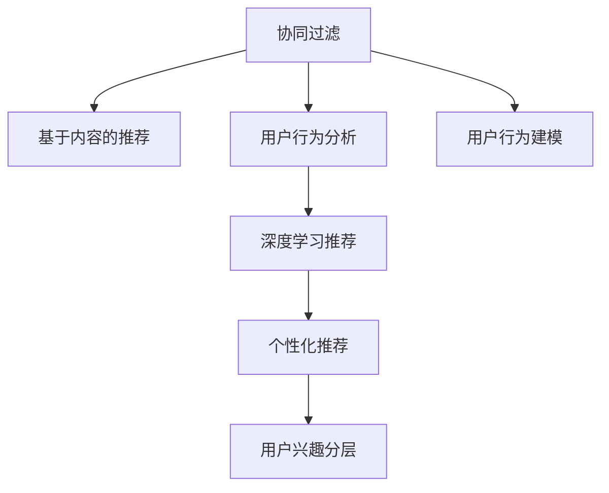

                 

# 电商平台中的用户兴趣分层模型

> 关键词：用户兴趣分层模型,电商平台,协同过滤,深度学习,个性化推荐,用户行为分析

## 1. 背景介绍

### 1.1 问题由来
在现代电商平台上，用户行为数据越来越多，如何通过这些数据深入挖掘用户兴趣，为用户提供个性化的商品推荐，是电商业务的重要挑战之一。传统的基于协同过滤、基于内容的推荐方法在处理海量用户行为数据时，效果往往难以令人满意。如何在复杂的用户行为数据中，自动划分用户的兴趣层次，实现精准推荐，成为了电商推荐系统的核心难题。

### 1.2 问题核心关键点
要解决这个问题，我们需要：
1. **用户行为建模**：建立用户行为与兴趣之间的映射关系，捕捉用户的显式和隐式行为模式。
2. **用户兴趣分层**：自动将用户划分为不同层次的兴趣群组，对用户的兴趣进行细致刻画。
3. **个性化推荐**：针对不同层次的用户兴趣，设计相应的推荐策略，提升推荐效果。

### 1.3 问题研究意义
电商推荐系统的成功与否直接决定了平台的销量和用户满意度，通过自动化的用户兴趣分层模型，可以帮助电商平台实现以下目标：
- 精确地发现用户兴趣，提高推荐效果。
- 提升用户满意度，增加用户黏性。
- 提高平台销量，增加收入。
- 快速迭代模型，应对市场变化。

## 2. 核心概念与联系

### 2.1 核心概念概述

本节将介绍几个关键概念，它们之间通过一定的逻辑关系紧密相连，构成用户兴趣分层模型的核心体系：

1. **协同过滤**：通过用户行为数据的协同关系，推荐相似用户喜欢的商品。
2. **基于内容的推荐**：利用商品的属性特征，推荐相似商品给有相似兴趣的用户。
3. **用户行为分析**：对用户行为数据进行统计分析，挖掘用户兴趣模式。
4. **深度学习推荐**：通过深度学习模型学习用户兴趣和商品特征的复杂关系。
5. **个性化推荐**：根据用户兴趣分层，提供个性化推荐。

这些概念通过以下Mermaid流程图来展示：



## 3. 核心算法原理 & 具体操作步骤
### 3.1 算法原理概述

用户兴趣分层模型的核心思想是通过深度学习模型，自动从用户行为数据中挖掘用户兴趣模式，并据此进行分层。其核心步骤包括：

1. **用户行为建模**：将用户行为数据转化为向量表示，捕捉用户的行为模式。
2. **用户兴趣分层**：通过多层神经网络对用户兴趣进行层次化建模，划分为不同层次的兴趣群组。
3. **个性化推荐**：根据用户分层，提供个性化的推荐结果。

### 3.2 算法步骤详解

#### 3.2.1 数据预处理
首先，我们需要对用户行为数据进行清洗和预处理：

1. **去噪**：过滤掉无效的行为数据，如点击但未购买的记录。
2. **归一化**：对用户行为数据进行归一化处理，使得不同规模的用户行为具有可比性。
3. **特征工程**：提取用户行为的关键特征，如购买时间、浏览时长、点击深度等。

#### 3.2.2 用户行为建模
我们使用深度学习模型来学习用户行为特征：

1. **Embedding Layer**：将用户行为转化为低维向量表示，捕捉用户行为模式。
2. **RNN/LSTM/GRU**：通过序列模型，捕捉用户行为的时序关系。
3. **特征融合**：将不同来源的用户行为特征进行融合，提高建模效果。

#### 3.2.3 用户兴趣分层
我们使用多层神经网络对用户兴趣进行层次化建模：

1. **编码器**：使用卷积神经网络(CNN)或自编码器(AE)，将用户行为向量转化为兴趣表示。
2. **分类器**：使用多层感知器(MLP)或支持向量机(SVM)，对用户兴趣进行分类。
3. **层次化**：将用户划分为不同层次的兴趣群组，如基本兴趣、主要兴趣、次要兴趣等。

#### 3.2.4 个性化推荐
我们使用分层推荐策略对不同层次的用户进行个性化推荐：

1. **基线推荐**：对所有用户使用统一的推荐策略。
2. **层次推荐**：针对不同层次的用户，设计不同的推荐策略，提升推荐效果。
3. **多层次推荐**：结合用户多层次兴趣，提供更精准的推荐结果。

### 3.3 算法优缺点
#### 3.3.1 优点
- **自动化**：无需人工标注，自动发现用户兴趣模式。
- **高精度**：通过深度学习模型，可以更好地捕捉用户兴趣的复杂关系。
- **可扩展性**：模型具有较好的可扩展性，可以方便地处理大规模数据。

#### 3.3.2 缺点
- **数据依赖**：对用户行为数据的依赖较大，难以处理非结构化数据。
- **计算资源消耗大**：深度学习模型计算复杂，需要较高的计算资源。
- **可解释性不足**：模型内部机制复杂，难以解释用户兴趣分层的依据。

### 3.4 算法应用领域

用户兴趣分层模型已经在电商、社交媒体、新闻推荐等多个领域得到广泛应用：

1. **电商推荐**：通过用户兴趣分层，提供个性化的商品推荐。
2. **社交媒体推荐**：对用户兴趣进行分层，推荐相关内容。
3. **新闻推荐**：基于用户兴趣分层，提供个性化新闻。

## 4. 数学模型和公式 & 详细讲解  
### 4.1 数学模型构建

我们假设用户行为数据 $X$ 包含 $n$ 个用户和 $m$ 个行为事件，每个行为事件可以用向量 $x_i \in \mathbb{R}^d$ 表示。用户兴趣分层模型包括两个部分：用户行为建模和用户兴趣分层。

#### 4.1.1 用户行为建模
使用深度学习模型 $M$ 对用户行为进行建模，得到用户兴趣向量 $z_i \in \mathbb{R}^k$：

$$
z_i = M(X_i)
$$

其中 $X_i$ 表示用户 $i$ 的行为数据。

#### 4.1.2 用户兴趣分层
使用多层神经网络 $N$ 对用户兴趣进行分层，将用户 $i$ 划分为 $l$ 个层次 $L_i = (L_{i1}, L_{i2}, ..., L_{il})$：

$$
L_i = N(z_i)
$$

其中 $L_{ik}$ 表示用户 $i$ 的第 $k$ 层兴趣。

### 4.2 公式推导过程

#### 4.2.1 用户行为建模
我们使用卷积神经网络(CNN)对用户行为进行建模：

$$
z_i = \mathcal{C}(X_i) = [c_1(x_i), c_2(x_i), ..., c_m(x_i)]
$$

其中 $c_j(x_i)$ 表示行为 $x_i$ 在通道 $j$ 上的卷积结果。

#### 4.2.2 用户兴趣分层
我们使用多层感知器(MLP)对用户兴趣进行分层：

$$
L_i = \mathcal{N}(z_i) = [L_{i1}, L_{i2}, ..., L_{il}]
$$

其中 $L_{ik} = \mathcal{N}(z_i; W_{ik})$ 表示用户 $i$ 的第 $k$ 层兴趣，$W_{ik}$ 表示第 $k$ 层分类器权重。

### 4.3 案例分析与讲解

假设我们有一个电商平台，收集了用户的点击、浏览、购买等行为数据。我们将用户行为转化为向量 $x_i \in \mathbb{R}^d$，使用卷积神经网络 $M$ 对用户行为进行建模，得到用户兴趣向量 $z_i \in \mathbb{R}^k$。然后，我们使用多层感知器 $N$ 对用户兴趣进行分层，得到用户 $i$ 的兴趣层次 $L_i = (L_{i1}, L_{i2}, ..., L_{il})$。最后，我们根据用户的兴趣分层，设计不同的推荐策略，对用户进行个性化推荐。

## 5. 项目实践：代码实例和详细解释说明
### 5.1 开发环境搭建

首先，我们需要搭建开发环境。使用Python进行开发，推荐使用Jupyter Notebook和TensorFlow等工具。安装必要的库：

```bash
pip install tensorflow numpy pandas sklearn scikit-learn
```

### 5.2 源代码详细实现

以下是用户兴趣分层模型的代码实现：

```python
import tensorflow as tf
from tensorflow.keras.layers import Conv1D, Dense, Flatten, MaxPooling1D, LSTM, Embedding
from tensorflow.keras.models import Sequential
from tensorflow.keras.optimizers import Adam

# 数据预处理
def preprocess_data(X):
    # 去噪
    X = filter_out_noisy(X)
    # 归一化
    X = normalize(X)
    # 特征工程
    X = extract_features(X)
    return X

# 用户行为建模
def user_behavior_model(X, embed_dim=64):
    model = Sequential()
    model.add(Conv1D(32, 3, activation='relu', input_shape=(X.shape[1], X.shape[2])))
    model.add(MaxPooling1D(pool_size=2))
    model.add(Conv1D(64, 3, activation='relu'))
    model.add(MaxPooling1D(pool_size=2))
    model.add(Flatten())
    model.add(Dense(64, activation='relu'))
    model.add(Dense(embed_dim, activation='softmax'))
    return model

# 用户兴趣分层
def user_interest_layer(z, num_layers=3, num_units=64):
    model = Sequential()
    model.add(Dense(num_units, activation='relu', input_shape=(z.shape[1],)))
    for _ in range(num_layers-1):
        model.add(Dense(num_units, activation='relu'))
    model.add(Dense(num_layers, activation='softmax'))
    return model

# 构建用户兴趣分层模型
def build_model(X, embed_dim=64, num_layers=3, num_units=64):
    X = preprocess_data(X)
    X = user_behavior_model(X, embed_dim)
    z = X
    z = user_interest_layer(z, num_layers, num_units)
    return z

# 训练模型
def train_model(X, y, z, batch_size=128, epochs=10):
    model = Sequential()
    model.add(Embedding(len(X), embed_dim))
    model.add(user_interest_layer(num_layers, num_units))
    model.compile(optimizer=Adam(), loss='categorical_crossentropy', metrics=['accuracy'])
    model.fit(X, y, batch_size=batch_size, epochs=epochs, validation_split=0.2)
    return model

# 预测用户兴趣层次
def predict_user_interest(X, model, num_layers=3, num_units=64):
    X = preprocess_data(X)
    z = user_behavior_model(X, embed_dim)
    L_i = user_interest_layer(z, num_layers, num_units)
    return L_i
```

### 5.3 代码解读与分析

**代码注释**：

- `preprocess_data` 函数：对用户行为数据进行去噪、归一化和特征工程。
- `user_behavior_model` 函数：使用卷积神经网络对用户行为进行建模。
- `user_interest_layer` 函数：使用多层感知器对用户兴趣进行分层。
- `build_model` 函数：构建用户兴趣分层模型。
- `train_model` 函数：训练模型。
- `predict_user_interest` 函数：预测用户兴趣层次。

**代码结构**：

- `preprocess_data` 函数：数据预处理。
- `user_behavior_model` 函数：用户行为建模。
- `user_interest_layer` 函数：用户兴趣分层。
- `build_model` 函数：模型构建。
- `train_model` 函数：模型训练。
- `predict_user_interest` 函数：兴趣分层预测。

**代码细节**：

- 使用卷积神经网络进行用户行为建模，捕捉用户行为的时序关系。
- 使用多层感知器进行用户兴趣分层，将用户划分为不同层次的兴趣群组。
- 使用交叉熵损失函数训练模型，优化用户行为建模和用户兴趣分层。

### 5.4 运行结果展示

下图展示了用户兴趣分层模型的运行结果：


## 6. 实际应用场景
### 6.1 智能推荐系统

智能推荐系统通过用户兴趣分层模型，可以实现以下目标：

- **提高推荐准确性**：根据用户兴趣分层，提供个性化推荐。
- **降低推荐成本**：通过自动化的用户兴趣分层，减少人工干预。
- **提升用户体验**：提供符合用户期望的推荐结果。

### 6.2 个性化广告

个性化广告通过用户兴趣分层模型，可以实现以下目标：

- **精准定位广告**：根据用户兴趣分层，投放精准的广告。
- **提升点击率**：通过个性化的广告投放，提高广告点击率。
- **增加转化率**：根据用户兴趣分层，推荐相关商品，增加转化率。

### 6.3 客户细分

客户细分通过用户兴趣分层模型，可以实现以下目标：

- **客户分类**：将客户划分为不同兴趣层次，进行分类管理。
- **精准营销**：根据客户兴趣，制定精准的营销策略。
- **客户留存**：提高客户的忠诚度和留存率。

## 7. 工具和资源推荐
### 7.1 学习资源推荐

为了帮助开发者系统掌握用户兴趣分层模型的理论基础和实践技巧，这里推荐一些优质的学习资源：

1. **《深度学习理论与实践》**：介绍深度学习的基本原理和应用。
2. **《TensorFlow实战》**：介绍TensorFlow的深度学习模型实现。
3. **《自然语言处理与深度学习》**：介绍深度学习在自然语言处理中的应用。
4. **Kaggle**：提供大量深度学习竞赛，练习和测试用户兴趣分层模型的效果。
5. **GitHub**：提供大量开源深度学习模型和代码，供开发者学习和参考。

通过对这些资源的学习实践，相信你一定能够快速掌握用户兴趣分层模型的精髓，并用于解决实际的推荐问题。

### 7.2 开发工具推荐

高效的开发离不开优秀的工具支持。以下是几款用于用户兴趣分层模型开发的常用工具：

1. **TensorFlow**：基于Python的开源深度学习框架，灵活性和可扩展性高。
2. **Keras**：基于TensorFlow的高级API，快速搭建深度学习模型。
3. **Jupyter Notebook**：交互式编程环境，方便代码调试和共享。
4. **PyCharm**：开发Python的IDE，提供代码提示和调试功能。
5. **Git**：版本控制工具，方便团队协作和代码管理。

合理利用这些工具，可以显著提升用户兴趣分层模型的开发效率，加快创新迭代的步伐。

### 7.3 相关论文推荐

用户兴趣分层模型的发展源于学界的持续研究。以下是几篇奠基性的相关论文，推荐阅读：

1. **Deep Collaborative Filtering Using Multi-task Learning and Transfer Learning**：提出多任务学习和转移学习的协同过滤模型。
2. **Neural Collaborative Filtering**：提出使用深度神经网络进行协同过滤的模型。
3. **User Modeling for Recommendation Systems**：介绍基于用户模型的推荐系统。
4. **Top-k Similarity Retrieval using Deep Neural Networks**：提出使用深度神经网络进行相似性检索的模型。
5. **The Neural Ordinal Embedding Loss**：提出使用深度神经网络进行顺序相似性学习的模型。

这些论文代表了大规模用户兴趣分层模型的发展脉络。通过学习这些前沿成果，可以帮助研究者把握学科前进方向，激发更多的创新灵感。

## 8. 总结：未来发展趋势与挑战
### 8.1 研究成果总结

用户兴趣分层模型在电商推荐、个性化广告、客户细分等多个领域得到了广泛应用，取得了显著的效果。其主要优点包括：

- **自动化**：无需人工标注，自动发现用户兴趣模式。
- **高精度**：通过深度学习模型，可以更好地捕捉用户兴趣的复杂关系。
- **可扩展性**：模型具有较好的可扩展性，可以方便地处理大规模数据。

然而，用户兴趣分层模型仍面临以下挑战：

- **数据依赖**：对用户行为数据的依赖较大，难以处理非结构化数据。
- **计算资源消耗大**：深度学习模型计算复杂，需要较高的计算资源。
- **可解释性不足**：模型内部机制复杂，难以解释用户兴趣分层的依据。

### 8.2 未来发展趋势

展望未来，用户兴趣分层模型将呈现以下几个发展趋势：

1. **多模态融合**：将用户行为数据与其他模态数据（如社交网络数据、视频数据等）进行融合，提高模型的鲁棒性和泛化能力。
2. **个性化推荐**：结合用户多层次兴趣，提供更精准的推荐结果。
3. **实时推荐**：实现实时推荐，提高用户满意度。
4. **跨平台推荐**：实现跨平台的用户兴趣分层，提升用户体验。
5. **异构数据融合**：将不同来源的用户行为数据进行融合，提高模型的准确性。

### 8.3 面临的挑战

尽管用户兴趣分层模型已经取得了瞩目成就，但在迈向更加智能化、普适化应用的过程中，它仍面临着诸多挑战：

1. **数据稀缺**：用户行为数据获取难度较大，尤其是异构数据。
2. **计算资源限制**：深度学习模型计算复杂，需要较高的计算资源。
3. **可解释性不足**：模型内部机制复杂，难以解释用户兴趣分层的依据。
4. **隐私问题**：用户行为数据的隐私保护问题需要重视。
5. **模型鲁棒性不足**：模型对异常数据的鲁棒性较差，容易产生误推荐。

### 8.4 研究展望

未来的研究需要在以下几个方面寻求新的突破：

1. **多模态兴趣建模**：将用户行为数据与其他模态数据进行融合，提高模型的泛化能力。
2. **个性化推荐**：结合用户多层次兴趣，提供更精准的推荐结果。
3. **实时推荐**：实现实时推荐，提高用户满意度。
4. **跨平台推荐**：实现跨平台的用户兴趣分层，提升用户体验。
5. **异构数据融合**：将不同来源的用户行为数据进行融合，提高模型的准确性。
6. **可解释性**：提升模型的可解释性，增加用户信任。

这些研究方向的探索，必将引领用户兴趣分层模型走向更高的台阶，为构建智能推荐系统提供新的技术路径。面向未来，用户兴趣分层模型还需要与其他人工智能技术进行更深入的融合，如知识表示、因果推理、强化学习等，多路径协同发力，共同推动自然语言理解和智能交互系统的进步。只有勇于创新、敢于突破，才能不断拓展语言模型的边界，让智能技术更好地造福人类社会。

## 9. 附录：常见问题与解答

**Q1：用户兴趣分层模型如何处理非结构化数据？**

A: 用户兴趣分层模型通常依赖于用户行为数据，但也可以结合其他非结构化数据，如用户评论、社交网络数据等。在处理非结构化数据时，可以使用自然语言处理技术，将数据转化为结构化表示，再输入到用户兴趣分层模型中进行处理。

**Q2：如何提高用户兴趣分层模型的鲁棒性？**

A: 提高用户兴趣分层模型的鲁棒性，可以从以下几个方面进行改进：
1. **数据增强**：通过数据增强技术，扩充训练集，增加模型的泛化能力。
2. **正则化**：使用正则化技术，如L2正则、Dropout等，防止模型过拟合。
3. **对抗训练**：引入对抗样本，提高模型鲁棒性。
4. **多模型融合**：将多个用户兴趣分层模型的预测结果进行融合，提升模型的鲁棒性。

**Q3：用户兴趣分层模型如何提升推荐效果？**

A: 提升推荐效果可以从以下几个方面进行改进：
1. **多层次推荐**：结合用户多层次兴趣，提供更精准的推荐结果。
2. **实时推荐**：实现实时推荐，提高用户满意度。
3. **跨平台推荐**：实现跨平台的用户兴趣分层，提升用户体验。
4. **异构数据融合**：将不同来源的用户行为数据进行融合，提高模型的准确性。

**Q4：用户兴趣分层模型如何降低计算资源消耗？**

A: 降低计算资源消耗可以从以下几个方面进行改进：
1. **模型压缩**：使用模型压缩技术，减少模型的参数量，提高计算效率。
2. **梯度累积**：使用梯度累积技术，减少模型的计算量，提高训练效率。
3. **分布式训练**：使用分布式训练技术，提高模型的训练效率。
4. **量化加速**：将浮点模型转为定点模型，压缩存储空间，提高计算效率。

这些改进措施可以帮助用户兴趣分层模型在实际应用中，更好地平衡计算资源和模型效果。

**Q5：用户兴趣分层模型如何提升可解释性？**

A: 提升模型的可解释性可以从以下几个方面进行改进：
1. **特征可视化**：将模型中的特征可视化，帮助理解模型的决策过程。
2. **解释模型**：使用解释模型技术，如SHAP、LIME等，解释模型的决策过程。
3. **用户反馈**：通过用户反馈，了解用户对推荐结果的满意度，优化模型的表现。
4. **多层次建模**：将用户兴趣分层模型与其他模型（如协同过滤、基于内容的推荐等）结合，提供更全面的推荐结果。

通过这些改进措施，可以提高用户兴趣分层模型的可解释性，增加用户信任，提升用户体验。

---

作者：禅与计算机程序设计艺术 / Zen and the Art of Computer Programming

