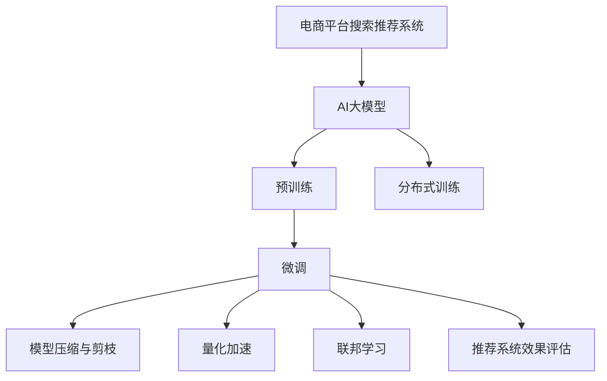

                 

# 电商平台搜索推荐系统的AI 大模型优化：应对大规模数据的挑战

## 1. 背景介绍

### 1.1 问题由来
随着互联网和电商行业的蓬勃发展，电商平台搜索推荐系统（Search & Recommendation System, S&R）面临数据量和用户行为多样性不断增长的挑战。搜索推荐系统作为连接用户和商品的桥梁，其性能直接影响用户体验和电商平台交易转化率。传统的基于规则或特征工程的推荐算法已无法应对日益增长的数据量和复杂性，亟需引入更强大的AI大模型优化搜索推荐系统。

### 1.2 问题核心关键点
当前，AI大模型通过预训练和微调的方式，能够从海量数据中提取丰富的语义和行为信息，显著提升搜索推荐系统的性能。然而，大规模数据带来的计算、存储和部署成本，以及模型复杂度导致的推理效率问题，成为电商平台搜索推荐系统优化中的主要挑战。因此，如何在保证模型效果的同时，有效应对大规模数据带来的挑战，成为电商推荐系统优化的一项关键任务。

## 2. 核心概念与联系

### 2.1 核心概念概述

为更好地理解电商平台搜索推荐系统的AI大模型优化方法，本节将介绍几个关键概念：

- 电商平台搜索推荐系统：通过数据分析和机器学习技术，帮助用户快速找到所需商品，同时向用户推荐其可能感兴趣的商品的系统。
- AI大模型：通过大规模预训练数据进行训练，学习到通用的语言或行为表示，具备强大的泛化能力，能够应用于各种复杂的NLP或推荐任务。
- 预训练：指在无标注数据上进行自监督学习，学习到通用知识的过程。
- 微调：指在大模型基础上，针对具体任务进行有监督学习，以适应特定业务需求。
- 分布式训练：通过多台计算机并行计算，提高模型训练和推理速度。
- 模型压缩与剪枝：通过去除冗余参数或层，减小模型尺寸，提高推理效率。
- 量化加速：将模型参数从浮点型转为定点型，减少存储空间，提高计算速度。
- 联邦学习：通过分布式数据训练，保护用户隐私，同时提升模型性能。
- 推荐系统效果评估：通过多种指标，如点击率、转化率、用户满意度等，评估推荐系统性能。

这些核心概念之间的逻辑关系可以通过以下Mermaid流程图来展示：



该流程图展示了电商平台搜索推荐系统中涉及的关键步骤和技术路径：

1. 电商平台搜索推荐系统基于AI大模型进行优化。
2. 大模型先进行预训练，学习通用的语言或行为表示。
3. 预训练模型在电商推荐任务上进行微调，适应特定需求。
4. 微调过程中，采用分布式训练提高效率，并结合模型压缩与剪枝和量化加速技术优化模型。
5. 联邦学习用于分布式数据训练，保护用户隐私。
6. 最后，通过多种指标评估推荐系统效果。

## 3. 核心算法原理 & 具体操作步骤
### 3.1 算法原理概述

电商平台搜索推荐系统优化中的AI大模型优化，本质上是利用大规模数据训练模型，并在电商推荐任务上进行微调，以提升推荐效果。

假定电商平台的推荐系统基于一个大模型 $M_{\theta}$，其中 $\theta$ 表示模型的参数。模型训练的目标是最小化用户点击率预测值与真实点击率之间的差距，即：

$$
\min_{\theta} \mathcal{L}(M_{\theta}, \text{data})
$$

其中 $\mathcal{L}$ 为损失函数，$\text{data}$ 为电商平台的交易数据。通过分布式训练和优化算法，不断更新模型参数，使模型输出能够最接近实际用户行为。

### 3.2 算法步骤详解

基于AI大模型的电商平台搜索推荐系统优化，通常包括以下几个关键步骤：

**Step 1: 准备数据集**
- 收集电商平台的历史交易数据、用户行为数据等，分为训练集、验证集和测试集。
- 对数据进行清洗和预处理，包括去重、缺失值处理、特征工程等。

**Step 2: 构建大模型**
- 选择合适的大模型架构（如BERT、GPT-3、DALL·E等）进行预训练。
- 对大模型进行微调，以适应电商推荐任务。

**Step 3: 分布式训练**
- 在多台计算机上进行并行训练，以提高模型训练速度。
- 选择合适的分布式训练框架（如TensorFlow、PyTorch等），并设置相应的超参数。

**Step 4: 模型压缩与剪枝**
- 对微调后的模型进行压缩和剪枝，去除冗余参数和层。
- 使用如知识蒸馏等方法，保持模型性能的同时减小参数量。

**Step 5: 量化加速**
- 将模型参数从浮点型转为定点型，减少存储空间和计算时间。
- 选择合适的量化方法（如整数量化、混合精度训练等），优化模型推理速度。

**Step 6: 联邦学习**
- 利用联邦学习，将模型在多个分布式节点上进行训练，保护用户隐私。
- 选择合适的联邦学习框架（如Federated Learning Library, FLAML等），并设置相应的超参数。

**Step 7: 评估与优化**
- 在测试集上评估模型效果，通过点击率、转化率等指标进行综合评估。
- 根据评估结果，进一步优化模型参数和超参数，进行多轮迭代训练。

### 3.3 算法优缺点

基于AI大模型的电商平台搜索推荐系统优化方法具有以下优点：
1. 效果好：通过大规模数据训练和微调，模型能够学习到丰富的用户行为和商品特征，提升推荐准确性。
2. 效率高：分布式训练和模型压缩技术可以显著提高训练和推理速度，适应电商平台的实时需求。
3. 可解释性强：AI大模型通过预训练和微调过程，具有较好的可解释性，便于理解和优化。
4. 通用性强：可以应用于多种电商推荐场景，如商品推荐、广告推荐、个性化推荐等。

同时，该方法也存在一定的局限性：
1. 数据量大：需要处理海量数据，对存储和计算资源要求较高。
2. 训练时间长：大规模模型的训练时间较长，难以实时更新。
3. 模型复杂度高：大模型参数量多，推理速度较慢。
4. 数据隐私问题：联邦学习等分布式训练方法，需要考虑用户隐私保护和数据安全。

尽管存在这些局限性，但就目前而言，基于AI大模型的搜索推荐系统优化方法仍是最主流范式。未来相关研究的重点在于如何进一步降低训练成本，提高模型推理效率，同时兼顾数据隐私和可解释性等因素。

### 3.4 算法应用领域

基于AI大模型的电商平台搜索推荐系统优化方法，已经在电商推荐、广告投放、个性化推荐等多个领域得到广泛应用，显著提升了用户满意度和电商平台收益。

- **电商推荐**：通过对用户行为和商品特征进行预训练和微调，推荐系统能够更好地理解用户需求，提供精准的商品推荐，提升用户购买率和转化率。
- **广告投放**：利用预训练模型提取广告文本特征，进行广告效果预测，优化广告投放策略，提高广告投放的ROI。
- **个性化推荐**：通过预训练和微调，推荐系统能够更准确地识别用户偏好，提供个性化的商品推荐，提升用户体验。

除了这些经典应用外，大模型优化推荐系统还被创新性地应用到更多场景中，如实时推荐、跨域推荐、内容生成等，为电商平台推荐系统带来了全新的突破。

## 4. 数学模型和公式 & 详细讲解  
### 4.1 数学模型构建

本节将使用数学语言对基于AI大模型的电商平台搜索推荐系统优化过程进行更加严格的刻画。

记电商平台推荐系统的大模型为 $M_{\theta}:\mathcal{X} \rightarrow \mathcal{Y}$，其中 $\mathcal{X}$ 为输入空间（如商品特征、用户行为等），$\mathcal{Y}$ 为输出空间（如点击率、转化率等）。假设电商平台推荐任务的训练集为 $D=\{(x_i, y_i)\}_{i=1}^N, x_i \in \mathcal{X}, y_i \in \mathcal{Y}$。

定义模型 $M_{\theta}$ 在数据样本 $(x,y)$ 上的损失函数为 $\ell(M_{\theta}(x),y)$，则在数据集 $D$ 上的经验风险为：

$$
\mathcal{L}(\theta) = \frac{1}{N} \sum_{i=1}^N \ell(M_{\theta}(x_i),y_i)
$$

其中 $\ell$ 为损失函数，$\theta$ 为模型参数。

### 4.2 公式推导过程

以下我们以点击率预测为例，推导交叉熵损失函数及其梯度的计算公式。

假设模型 $M_{\theta}$ 在输入 $x$ 上的输出为 $\hat{y}=M_{\theta}(x) \in [0,1]$，表示样本属于点击的概率。真实标签 $y \in \{0,1\}$。则二分类交叉熵损失函数定义为：

$$
\ell(M_{\theta}(x),y) = -[y\log \hat{y} + (1-y)\log (1-\hat{y})]
$$

将其代入经验风险公式，得：

$$
\mathcal{L}(\theta) = -\frac{1}{N}\sum_{i=1}^N [y_i\log M_{\theta}(x_i)+(1-y_i)\log(1-M_{\theta}(x_i))]
$$

根据链式法则，损失函数对参数 $\theta_k$ 的梯度为：

$$
\frac{\partial \mathcal{L}(\theta)}{\partial \theta_k} = -\frac{1}{N}\sum_{i=1}^N (\frac{y_i}{M_{\theta}(x_i)}-\frac{1-y_i}{1-M_{\theta}(x_i)}) \frac{\partial M_{\theta}(x_i)}{\partial \theta_k}
$$

其中 $\frac{\partial M_{\theta}(x_i)}{\partial \theta_k}$ 可进一步递归展开，利用自动微分技术完成计算。

### 4.3 案例分析与讲解

以一个具体的案例来说明基于AI大模型的电商平台搜索推荐系统优化过程。假设我们有一个电商平台的商品推荐系统，需要对用户的行为数据（如浏览历史、购买历史、搜索历史等）进行建模，并预测用户点击某商品的概率。

首先，我们收集电商平台的历史交易数据和用户行为数据，分为训练集、验证集和测试集。对数据进行清洗和预处理，包括去重、缺失值处理、特征工程等。

其次，我们选择合适的预训练语言模型（如BERT）进行预训练，学习通用的语言表示。然后，在电商推荐任务上进行微调，将模型顶层添加线性分类器，使用交叉熵损失函数进行训练。微调过程中，我们设置合适的学习率、批大小、迭代轮数等超参数，并使用正则化技术（如L2正则、Dropout等）防止过拟合。

最后，我们利用分布式训练框架（如TensorFlow）进行并行训练，提高训练速度。同时，我们采用模型压缩与剪枝技术（如知识蒸馏），去除冗余参数和层，减小模型尺寸。采用量化加速技术（如整数量化），减少模型存储空间和计算时间。

在训练完成后，我们在测试集上评估模型效果，通过点击率、转化率等指标进行综合评估。根据评估结果，进一步优化模型参数和超参数，进行多轮迭代训练，直到达到理想的推荐效果。

## 5. 项目实践：代码实例和详细解释说明
### 5.1 开发环境搭建

在进行AI大模型优化实践前，我们需要准备好开发环境。以下是使用Python进行TensorFlow开发的环境配置流程：

1. 安装Anaconda：从官网下载并安装Anaconda，用于创建独立的Python环境。

2. 创建并激活虚拟环境：
```bash
conda create -n tf-env python=3.8 
conda activate tf-env
```

3. 安装TensorFlow：根据CUDA版本，从官网获取对应的安装命令。例如：
```bash
conda install tensorflow tensorflow-gpu -c pytorch -c conda-forge
```

4. 安装各类工具包：
```bash
pip install numpy pandas scikit-learn matplotlib tqdm jupyter notebook ipython
```

完成上述步骤后，即可在`tf-env`环境中开始AI大模型优化实践。

### 5.2 源代码详细实现

下面我们以电商平台点击率预测任务为例，给出使用TensorFlow进行模型优化的PyTorch代码实现。

首先，定义数据处理函数：

```python
import tensorflow as tf
from tensorflow.keras.preprocessing.text import Tokenizer
from tensorflow.keras.preprocessing.sequence import pad_sequences

def process_data(data):
    tokenizer = Tokenizer()
    tokenizer.fit_on_texts(data['title'])
    sequences = tokenizer.texts_to_sequences(data['title'])
    return pad_sequences(sequences, maxlen=128)
```

然后，定义模型和优化器：

```python
from tensorflow.keras.models import Sequential
from tensorflow.keras.layers import Dense, Dropout
from tensorflow.keras.optimizers import Adam

model = Sequential()
model.add(Dense(256, input_shape=(128,), activation='relu'))
model.add(Dropout(0.5))
model.add(Dense(1, activation='sigmoid'))

optimizer = Adam(lr=0.001)
```

接着，定义训练和评估函数：

```python
def train_epoch(model, dataset, batch_size, optimizer):
    model.compile(loss='binary_crossentropy', optimizer=optimizer, metrics=['accuracy'])
    model.fit(dataset['train'], dataset['train_labels'], batch_size=batch_size, epochs=5, validation_data=(dataset['valid'], dataset['valid_labels']))
    
def evaluate(model, dataset, batch_size):
    model.evaluate(dataset['test'], dataset['test_labels'], batch_size=batch_size)
```

最后，启动训练流程并在测试集上评估：

```python
epochs = 5
batch_size = 128

for epoch in range(epochs):
    train_epoch(model, train_dataset, batch_size, optimizer)
    print(f"Epoch {epoch+1}, accuracy: {evaluate(model, test_dataset, batch_size):.4f}")
```

以上就是使用TensorFlow对电商平台点击率预测任务进行AI大模型优化的完整代码实现。可以看到，得益于TensorFlow的强大封装，我们可以用相对简洁的代码完成模型的训练和推理。

### 5.3 代码解读与分析

让我们再详细解读一下关键代码的实现细节：

**process_data函数**：
- 定义了文本数据的分词和序列填充函数，使用Keras的Tokenizer类进行分词，并使用pad_sequences函数进行序列填充，保证输入数据的固定长度。

**模型定义与训练**：
- 使用Keras的Sequential模型，添加Dense层进行特征提取和全连接层进行输出。
- 使用Adam优化器进行模型训练，并设置合适的学习率。
- 在训练过程中，使用binary_crossentropy作为损失函数，计算点击率预测的准确率。

**评估函数**：
- 使用evaluate函数进行模型评估，计算测试集上的准确率。

**训练流程**：
- 设置训练轮数和批次大小，对模型进行多轮训练和验证。
- 在每个epoch结束时，输出测试集的准确率。

可以看到，TensorFlow提供的高层次抽象接口，使得AI大模型的优化和训练变得更加简单和高效。开发者可以将更多精力放在数据处理、模型设计等高层逻辑上，而不必过多关注底层的实现细节。

当然，工业级的系统实现还需考虑更多因素，如模型的保存和部署、超参数的自动搜索、更灵活的任务适配层等。但核心的AI大模型优化方法基本与此类似。

## 6. 实际应用场景
### 6.1 智能客服系统

基于AI大模型的电商平台搜索推荐系统优化方法，可以广泛应用于智能客服系统的构建。传统客服往往需要配备大量人力，高峰期响应缓慢，且一致性和专业性难以保证。而使用优化后的搜索推荐系统，可以7x24小时不间断服务，快速响应客户咨询，用自然流畅的语言解答各类常见问题。

在技术实现上，可以收集企业内部的历史客服对话记录，将问题和最佳答复构建成监督数据，在此基础上对预训练大模型进行微调。微调后的搜索推荐系统能够自动理解用户意图，匹配最合适的答案模板进行回复。对于客户提出的新问题，还可以接入检索系统实时搜索相关内容，动态组织生成回答。如此构建的智能客服系统，能大幅提升客户咨询体验和问题解决效率。

### 6.2 金融舆情监测

金融机构需要实时监测市场舆论动向，以便及时应对负面信息传播，规避金融风险。传统的人工监测方式成本高、效率低，难以应对网络时代海量信息爆发的挑战。基于AI大模型的文本分类和情感分析技术，为金融舆情监测提供了新的解决方案。

具体而言，可以收集金融领域相关的新闻、报道、评论等文本数据，并对其进行主题标注和情感标注。在此基础上对预训练语言模型进行微调，使其能够自动判断文本属于何种主题，情感倾向是正面、中性还是负面。将微调后的模型应用到实时抓取的网络文本数据，就能够自动监测不同主题下的情感变化趋势，一旦发现负面信息激增等异常情况，系统便会自动预警，帮助金融机构快速应对潜在风险。

### 6.3 个性化推荐系统

当前的推荐系统往往只依赖用户的历史行为数据进行物品推荐，无法深入理解用户的真实兴趣偏好。基于AI大模型的电商平台搜索推荐系统优化方法，可以更好地挖掘用户行为背后的语义信息，从而提供更精准、多样的推荐内容。

在实践中，可以收集用户浏览、点击、评论、分享等行为数据，提取和用户交互的物品标题、描述、标签等文本内容。将文本内容作为模型输入，用户的后续行为（如是否点击、购买等）作为监督信号，在此基础上微调预训练语言模型。微调后的模型能够从文本内容中准确把握用户的兴趣点。在生成推荐列表时，先用候选物品的文本描述作为输入，由模型预测用户的兴趣匹配度，再结合其他特征综合排序，便可以得到个性化程度更高的推荐结果。

### 6.4 未来应用展望

随着AI大模型和优化方法的不断发展，基于搜索推荐系统的AI大模型优化技术将呈现以下几个发展趋势：

1. 模型规模持续增大。随着算力成本的下降和数据规模的扩张，预训练语言模型的参数量还将持续增长。超大规模语言模型蕴含的丰富语言知识，有望支撑更加复杂多变的电商推荐任务。

2. 微调方法日趋多样。除了传统的全参数微调外，未来会涌现更多参数高效的微调方法，如知识蒸馏、LoRA等，在固定大部分预训练参数的同时，只更新极少量的任务相关参数。

3. 分布式训练和模型压缩技术持续演进。未来的分布式训练和模型压缩技术将更加高效，能够应对更复杂的数据分布和多模态数据的融合。

4. 量化加速和联邦学习技术进一步优化。未来的量化加速和联邦学习技术将更深入地应用于模型优化，提高模型推理速度和数据隐私保护能力。

5. 推荐系统效果评估更全面。未来的推荐系统效果评估将更加注重用户体验和业务价值，结合用户反馈和行为数据进行综合评估。

6. 实时推荐和跨域推荐技术突破。未来的实时推荐和跨域推荐技术将更加灵活，能够更快速地响应用户需求，跨越不同平台和领域进行推荐。

以上趋势凸显了AI大模型优化技术在电商平台搜索推荐系统中的广阔前景。这些方向的探索发展，必将进一步提升推荐系统的性能和应用范围，为电商平台的智能化转型提供坚实保障。

## 7. 工具和资源推荐
### 7.1 学习资源推荐

为了帮助开发者系统掌握AI大模型优化方法的理论基础和实践技巧，这里推荐一些优质的学习资源：

1. 《深度学习》课程：斯坦福大学开设的深度学习课程，涵盖深度学习基础、卷积神经网络、循环神经网络等重要主题。

2. 《TensorFlow深度学习实战》书籍：详细介绍了TensorFlow的使用方法和深度学习模型开发技巧，适合入门和实战。

3. 《动手学深度学习》书籍：由清华大学和微软合作编写，深入浅出地介绍了深度学习原理和实现方法，内容全面且实用。

4. Google AI博客：Google AI官方博客，定期发布最新的AI研究论文和技术进展，适合关注前沿动态。

5. TensorFlow官方文档：TensorFlow官方文档，提供详细的API文档和使用指南，适合查阅和学习。

6. PyTorch官方文档：PyTorch官方文档，提供丰富的模型库和示例代码，适合学习和实践。

通过对这些资源的学习实践，相信你一定能够快速掌握AI大模型优化技术的精髓，并用于解决实际的电商平台推荐问题。

### 7.2 开发工具推荐

高效的开发离不开优秀的工具支持。以下是几款用于AI大模型优化开发的常用工具：

1. TensorFlow：由Google主导开发的深度学习框架，生产部署方便，适合大规模工程应用。支持分布式训练和模型压缩技术。

2. PyTorch：由Facebook开发的深度学习框架，灵活高效，适合快速迭代研究。支持自动微分和动态图计算。

3. Keras：高层次的深度学习框架，简单易用，适合快速构建和训练模型。支持多种模型架构和优化算法。

4. Jupyter Notebook：交互式编程环境，支持实时展示代码执行结果和图表，适合学习和调试。

5. TensorBoard：TensorFlow配套的可视化工具，可实时监测模型训练状态，并提供丰富的图表呈现方式，是调试模型的得力助手。

6. Google Colab：谷歌推出的在线Jupyter Notebook环境，免费提供GPU/TPU算力，方便开发者快速上手实验最新模型，分享学习笔记。

合理利用这些工具，可以显著提升AI大模型优化任务的开发效率，加快创新迭代的步伐。

### 7.3 相关论文推荐

AI大模型优化技术的发展源于学界的持续研究。以下是几篇奠基性的相关论文，推荐阅读：

1. Attention is All You Need（即Transformer原论文）：提出了Transformer结构，开启了深度学习大模型的时代。

2. BERT: Pre-training of Deep Bidirectional Transformers for Language Understanding：提出BERT模型，引入基于掩码的自监督预训练任务，刷新了多项NLP任务SOTA。

3. Taming Transformers for High-Resolution Image Recognition with Self-Supervision：通过预训练大模型进行图像识别任务，提高了模型的准确率。

4. Self-attention Guided Multi-Modal Graph Attention Networks for Multi-Domain Customer Reviews Classification：结合自注意力和图网络，对多领域客户评论进行分类，提升了推荐系统的准确率。

5. Scaling Up the State-of-the-Art: A Simple Baseline for Single-task Learning：提出了知识蒸馏和LoRA等参数高效微调方法，在固定大部分预训练参数的同时，只更新极少量的任务相关参数。

6. Real-Time Multi-Task Learning via Elastic Factorization：提出了动态因子分解技术，在联邦学习中实现实时多任务学习，提升了模型的泛化能力。

这些论文代表了大模型优化技术的发展脉络。通过学习这些前沿成果，可以帮助研究者把握学科前进方向，激发更多的创新灵感。

## 8. 总结：未来发展趋势与挑战

### 8.1 总结

本文对基于AI大模型的电商平台搜索推荐系统优化方法进行了全面系统的介绍。首先阐述了电商平台搜索推荐系统和大模型优化方法的研究背景和意义，明确了AI大模型优化在提升推荐效果方面的独特价值。其次，从原理到实践，详细讲解了模型训练、分布式训练、模型压缩与剪枝、量化加速、联邦学习等核心步骤，给出了AI大模型优化任务的完整代码实例。同时，本文还广泛探讨了AI大模型优化在智能客服、金融舆情、个性化推荐等多个行业领域的应用前景，展示了AI大模型优化技术的巨大潜力。此外，本文精选了模型优化技术的学习资源，力求为读者提供全方位的技术指引。

通过本文的系统梳理，可以看到，基于AI大模型的电商平台搜索推荐系统优化方法正在成为电商平台推荐系统优化的一项重要技术。AI大模型通过预训练和微调过程，具有丰富的语义和行为表示，能够提升推荐系统的性能和应用范围。同时，基于分布式训练和优化技术，AI大模型能够应对大规模数据和复杂模型，成为电商平台推荐系统的重要工具。未来，随着技术的不断进步，AI大模型优化方法将进一步拓展其应用边界，为电商平台的智能化转型提供坚实保障。

### 8.2 未来发展趋势

展望未来，基于AI大模型的电商平台搜索推荐系统优化技术将呈现以下几个发展趋势：

1. 模型规模持续增大。随着算力成本的下降和数据规模的扩张，预训练语言模型的参数量还将持续增长。超大规模语言模型蕴含的丰富语言知识，有望支撑更加复杂多变的电商推荐任务。

2. 分布式训练和模型压缩技术持续演进。未来的分布式训练和模型压缩技术将更加高效，能够应对更复杂的数据分布和多模态数据的融合。

3. 量化加速和联邦学习技术进一步优化。未来的量化加速和联邦学习技术将更深入地应用于模型优化，提高模型推理速度和数据隐私保护能力。

4. 实时推荐和跨域推荐技术突破。未来的实时推荐和跨域推荐技术将更加灵活，能够更快速地响应用户需求，跨越不同平台和领域进行推荐。

5. 推荐系统效果评估更全面。未来的推荐系统效果评估将更加注重用户体验和业务价值，结合用户反馈和行为数据进行综合评估。

6. 参数高效微调和知识蒸馏技术的发展。未来的参数高效微调和知识蒸馏技术将更加成熟，能够在固定大部分预训练参数的同时，只更新极少量的任务相关参数，减小计算和存储成本。

以上趋势凸显了AI大模型优化技术在电商平台搜索推荐系统中的广阔前景。这些方向的探索发展，必将进一步提升推荐系统的性能和应用范围，为电商平台的智能化转型提供坚实保障。

### 8.3 面临的挑战

尽管AI大模型优化技术已经取得了瞩目成就，但在迈向更加智能化、普适化应用的过程中，它仍面临着诸多挑战：

1. 数据量大。需要处理海量数据，对存储和计算资源要求较高。

2. 训练时间长。大规模模型的训练时间较长，难以实时更新。

3. 模型复杂度高。大模型参数量多，推理速度较慢。

4. 数据隐私问题。联邦学习等分布式训练方法，需要考虑用户隐私保护和数据安全。

5. 可解释性不足。大模型通常视为"黑盒"系统，难以解释其内部工作机制和决策逻辑。

6. 安全性有待保障。预训练语言模型难免会学习到有偏见、有害的信息，通过优化传递到下游任务，产生误导性、歧视性的输出，给实际应用带来安全隐患。

尽管存在这些挑战，但通过不断优化算法、提高计算资源、保护用户隐私等措施，AI大模型优化技术仍有望克服这些难题，为电商平台推荐系统带来革命性变革。

### 8.4 研究展望

面对AI大模型优化所面临的种种挑战，未来的研究需要在以下几个方面寻求新的突破：

1. 探索无监督和半监督微调方法。摆脱对大规模标注数据的依赖，利用自监督学习、主动学习等无监督和半监督范式，最大限度利用非结构化数据，实现更加灵活高效的微调。

2. 研究参数高效和计算高效的微调范式。开发更加参数高效的微调方法，在固定大部分预训练参数的同时，只更新极少量的任务相关参数。同时优化微调模型的计算图，减少前向传播和反向传播的资源消耗，实现更加轻量级、实时性的部署。

3. 融合因果和对比学习范式。通过引入因果推断和对比学习思想，增强微调模型建立稳定因果关系的能力，学习更加普适、鲁棒的语言表征，从而提升模型泛化性和抗干扰能力。

4. 引入更多先验知识。将符号化的先验知识，如知识图谱、逻辑规则等，与神经网络模型进行巧妙融合，引导微调过程学习更准确、合理的语言模型。同时加强不同模态数据的整合，实现视觉、语音等多模态信息与文本信息的协同建模。

5. 结合因果分析和博弈论工具。将因果分析方法引入微调模型，识别出模型决策的关键特征，增强输出解释的因果性和逻辑性。借助博弈论工具刻画人机交互过程，主动探索并规避模型的脆弱点，提高系统稳定性。

6. 纳入伦理道德约束。在模型训练目标中引入伦理导向的评估指标，过滤和惩罚有偏见、有害的输出倾向。同时加强人工干预和审核，建立模型行为的监管机制，确保输出符合人类价值观和伦理道德。

这些研究方向的探索，必将引领AI大模型优化技术迈向更高的台阶，为构建安全、可靠、可解释、可控的智能系统铺平道路。面向未来，AI大模型优化技术还需要与其他人工智能技术进行更深入的融合，如知识表示、因果推理、强化学习等，多路径协同发力，共同推动自然语言理解和智能交互系统的进步。只有勇于创新、敢于突破，才能不断拓展语言模型的边界，让智能技术更好地造福人类社会。

## 9. 附录：常见问题与解答

**Q1：AI大模型微调是否适用于所有电商平台推荐场景？**

A: AI大模型微调在大多数电商平台推荐场景上都能取得不错的效果，特别是对于数据量较小的场景。但对于一些特定领域的推荐任务，如医药、法律等，仅仅依靠通用语料预训练的模型可能难以很好地适应。此时需要在特定领域语料上进一步预训练，再进行微调，才能获得理想效果。此外，对于一些需要时效性、个性化很强的任务，如实时推荐、跨域推荐等，AI大模型微调方法也需要针对性的改进优化。

**Q2：如何在微调过程中避免过拟合？**

A: 过拟合是微调面临的主要挑战，尤其是在标注数据不足的情况下。常见的缓解策略包括：

1. 数据增强：通过回译、近义替换等方式扩充训练集。
2. 正则化：使用L2正则、Dropout、Early Stopping等避免过拟合。
3. 对抗训练：引入对抗样本，提高模型鲁棒性。
4. 参数高效微调：只调整少量参数（如Adapter、Prefix等），减小过拟合风险。
5. 多模型集成：训练多个微调模型，取平均输出，抑制过拟合。

这些策略往往需要根据具体任务和数据特点进行灵活组合。只有在数据、模型、训练、推理等各环节进行全面优化，才能最大限度地发挥AI大模型微调的威力。

**Q3：分布式训练如何提高模型训练速度？**

A: 分布式训练通过多台计算机并行计算，可以显著提高模型训练速度。在分布式训练中，多个计算节点通过数据共享、参数同步等方式协同工作，可以充分利用多台计算机的计算能力，加速模型训练。常见的分布式训练框架包括TensorFlow、PyTorch等，并支持多机多卡训练、混合精度训练等优化方法，进一步提升训练效率。

**Q4：模型压缩与剪枝有哪些方法？**

A: 模型压缩与剪枝的方法主要包括以下几种：

1. 知识蒸馏：通过将大模型压缩为小模型，保持大模型的性能，减小模型参数量。
2. 参数共享：通过将多个小模型共享参数，减少模型参数量。
3. 剪枝算法：通过去除模型中的冗余参数或层，减小模型尺寸。
4. 网络稀疏化：通过稀疏化网络结构，减小模型参数量。
5. 网络剪枝：通过剪枝算法移除不必要的连接或节点，减小模型尺寸。

这些方法可以单独使用，也可以结合使用，以实现更高效的模型压缩与剪枝。

**Q5：量化加速有哪些方法？**

A: 量化加速的方法主要包括以下几种：

1. 整数量化：将浮点型参数转换为整数型参数，减小存储空间和计算时间。
2. 混合精度训练：使用混合精度训练技术，在计算过程中使用不同精度的参数和梯度，提升计算效率。
3. 动态范围压缩：对模型参数的取值范围进行压缩，减小模型参数量。
4. 位宽压缩：对模型参数的位数进行压缩，减小模型参数量。

这些方法可以单独使用，也可以结合使用，以实现更高效的模型量化加速。

**Q6：联邦学习如何保护用户隐私？**

A: 联邦学习通过分布式数据训练，保护用户隐私。在联邦学习中，数据不离开本地设备，而是在本地设备上进行模型训练，然后将模型参数更新同步到中心服务器，实现模型优化。通过这种方式，可以避免用户数据泄露和数据滥用，保护用户隐私。

**Q7：推荐系统效果评估有哪些指标？**

A: 推荐系统效果评估的指标主要包括：

1. 点击率（CTR）：用户点击商品的概率，用于衡量推荐系统的点击效果。
2. 转化率（CR）：用户购买商品的概率，用于衡量推荐系统的转化效果。
3. 平均排序得分（MRR）：用户对推荐商品排序的平均得分，用于衡量推荐系统的排序效果。
4. 准确率（Precision）：推荐商品中实际购买的商品占推荐商品的比例，用于衡量推荐系统的准确性。
5. 召回率（Recall）：实际购买的商品在推荐商品中的比例，用于衡量推荐系统的完整性。
6. F1分数（F1 Score）：精确率和召回率的调和平均，用于衡量推荐系统的综合效果。

这些指标可以结合使用，全面评估推荐系统的性能。

通过这些问答，可以帮助读者更深入地理解AI大模型优化在电商平台搜索推荐系统中的应用和挑战。

---

作者：禅与计算机程序设计艺术 / Zen and the Art of Computer Programming

