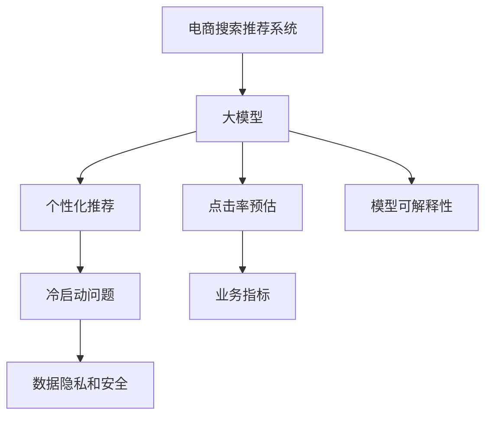

                 

# 电商平台的AI 大模型实践：搜索推荐系统是核心，冷启动问题是挑战

> 关键词：电商搜索推荐系统,大模型,冷启动,个性化推荐,用户画像,点击率预估,业务指标,超大规模数据

## 1. 背景介绍

在电子商务领域，随着用户规模的快速增长和商品种类的日益丰富，如何提升用户体验，优化用户购买决策，已成为电商平台关注的焦点。人工智能技术，尤其是大模型在搜索推荐系统中的应用，被视为关键手段。本文将从背景介绍、核心概念与联系、核心算法原理、项目实践、实际应用场景、工具和资源推荐、总结未来发展趋势与挑战以及常见问题解答等维度，深入探讨电商平台的AI大模型实践，尤其是搜索推荐系统核心及冷启动问题的挑战。

### 1.1 问题由来

传统电商平台的搜索推荐系统，多依赖于基于规则的排序算法或浅层机器学习模型。但随着数据量的爆炸性增长，这些方法已难以满足高维稀疏数据的处理需求，且难以捕捉复杂用户行为背后的深层次关联。而基于大模型的深度学习推荐系统，通过在海量数据上进行预训练，具备强大的语言和行为理解能力，能够更准确地刻画用户需求，预测用户行为，成为电商平台优化的重要方向。

然而，尽管大模型在处理数据和预测精度方面具备优势，但在实际电商平台的搜索推荐系统中，仍然面临冷启动问题、数据隐私和安全、模型可解释性等挑战。这些问题若不能得到有效解决，将限制大模型在电商平台的落地应用。

### 1.2 问题核心关键点

电商平台的搜索推荐系统旨在通过智能化算法，实现对用户查询需求的精准匹配，并推荐用户可能感兴趣的商品。大模型在此过程中可以发挥强大的语言和行为理解能力，预测用户行为，提供个性化的商品推荐。

- **冷启动问题**：对于新用户或新商品，由于缺乏足够的历史行为数据，大模型难以准确预测其需求。
- **数据隐私和安全**：电商平台上涉及大量用户隐私数据，如何安全使用这些数据，防止信息泄露，是一大挑战。
- **模型可解释性**：大模型通常被视为"黑箱"，其内部决策逻辑难以解释，影响模型的可信度，尤其在涉及商品推荐、广告投放等敏感场景时尤为重要。

这些关键问题直接关系到电商平台搜索推荐系统的效果和可信度，需通过深入研究和实践不断突破。

## 2. 核心概念与联系

### 2.1 核心概念概述

电商平台的搜索推荐系统涉及多个关键概念，主要包括：

- **电商搜索推荐系统**：基于用户查询行为和商品特征，推荐用户可能感兴趣的商品。
- **大模型**：以Transformer为基础的超大规模深度学习模型，通过预训练学习大量文本和行为数据。
- **冷启动问题**：新用户或新商品缺乏足够数据时，大模型难以准确预测其需求。
- **个性化推荐**：根据用户历史行为和偏好，提供符合其兴趣的商品推荐。
- **点击率预估**：预测用户对某商品点击的概率，优化推荐系统的排序算法。
- **业务指标**：如点击率、转化率、用户满意度等，是衡量搜索推荐系统效果的重要标准。
- **超大规模数据**：电商平台数据量巨大，往往需要在大模型上进行预训练。

这些核心概念之间的联系可通过以下Mermaid流程图进行展示：



这个流程图展示了大模型在电商搜索推荐系统中的应用路径和面临的挑战。

## 3. 核心算法原理 & 具体操作步骤

### 3.1 算法原理概述

电商平台的搜索推荐系统，其核心算法原理基于大模型的迁移学习范式。即在电商领域的大规模数据上，通过微调大模型，使其具备对用户查询和商品特征的精确理解能力，预测用户行为，推荐商品。

形式化地，设大模型为 $M_{\theta}$，输入为 $\{x_i\}_{i=1}^N$ 表示用户查询或商品特征，输出为 $\{y_i\}_{i=1}^N$ 表示推荐结果。搜索推荐系统的优化目标是最小化预测误差：

$$
\theta^* = \mathop{\arg\min}_{\theta} \mathcal{L}(M_{\theta},D)
$$

其中 $\mathcal{L}$ 为损失函数，通常为交叉熵损失，$D$ 为训练集，即电商平台用户行为数据和商品特征数据。

### 3.2 算法步骤详解

电商平台的搜索推荐系统，大模型的微调步骤如下：

1. **数据准备**：收集电商平台用户的历史查询行为和商品点击记录，构建训练集 $D$。

2. **模型选择与加载**：选择合适的预训练大模型，如BERT、GPT等，进行加载。

3. **任务适配**：根据电商搜索推荐任务，设计任务适配层，如Click-Through Rate (CTR)预估模型、个性化推荐模型等。

4. **模型微调**：使用电商平台的标注数据集 $D$，通过梯度下降等优化算法，更新模型参数 $\theta$，最小化预测误差 $\mathcal{L}$。

5. **模型评估与部署**：在测试集上评估微调后模型的效果，使用微调模型进行实时推荐。

6. **持续学习**：根据新数据和用户反馈，周期性地更新模型，保持模型的性能和鲁棒性。

### 3.3 算法优缺点

基于大模型的电商搜索推荐系统，具有以下优点：

- **准确性高**：大模型能够从海量的电商数据中学习到丰富的用户行为和商品特征，提升预测准确性。
- **可扩展性强**：大模型具备良好的泛化能力，能够适应不同规模和特征的电商平台。
- **自动化程度高**：自动化学习用户行为和商品特征，无需人工干预。

同时，大模型在电商搜索推荐系统中也面临以下挑战：

- **训练数据量大**：需要收集和处理大量的电商数据，训练成本高。
- **模型复杂度大**：大规模模型的参数量和计算资源需求大。
- **解释性不足**：大模型内部的决策过程难以解释，影响模型可信度。

### 3.4 算法应用领域

大模型在电商搜索推荐系统中的应用，主要集中在以下几个领域：

- **个性化推荐**：基于用户行为数据，预测用户感兴趣的商品，实现商品推荐。
- **点击率预估**：预测用户对某商品的点击概率，优化推荐系统的排序。
- **用户画像**：从用户行为数据中提取用户特征，建立用户画像，实现精准推荐。
- **广告投放**：根据用户特征和广告内容，预测广告点击率，优化广告投放策略。
- **舆情监测**：分析用户评论和反馈，监测电商平台的舆情变化。

## 4. 数学模型和公式 & 详细讲解 & 举例说明

### 4.1 数学模型构建

设大模型为 $M_{\theta}$，输入为 $\{x_i\}_{i=1}^N$，输出为 $\{y_i\}_{i=1}^N$，其中 $x_i$ 为电商用户行为数据，$y_i$ 为推荐的商品ID。假设模型输出为点击率预估值 $\hat{y}_i = M_{\theta}(x_i)$。

损失函数 $\mathcal{L}$ 通常为二分类交叉熵损失：

$$
\mathcal{L} = -\frac{1}{N}\sum_{i=1}^N [y_i \log \hat{y}_i + (1-y_i) \log (1-\hat{y}_i)]
$$

其中 $y_i$ 为标签（点击与否），$\hat{y}_i$ 为模型预测的点击率预估值。

### 4.2 公式推导过程

首先，对单个样本进行二分类交叉熵损失计算：

$$
\mathcal{L}_i = -[y_i \log \hat{y}_i + (1-y_i) \log (1-\hat{y}_i)]
$$

然后，对全部样本求平均损失：

$$
\mathcal{L} = \frac{1}{N}\sum_{i=1}^N \mathcal{L}_i
$$

最小化上述损失函数，即最小化预测误差：

$$
\theta^* = \mathop{\arg\min}_{\theta} \mathcal{L}(M_{\theta},D)
$$

### 4.3 案例分析与讲解

以点击率预估为例，假设电商平台有用户行为数据 $D=\{(x_i,y_i)\}_{i=1}^N$，使用BERT作为预训练模型，构建CTR预估模型：

```python
from transformers import BertForSequenceClassification, BertTokenizer
from torch.utils.data import Dataset, DataLoader
from torch.nn import BCEWithLogitsLoss

# 定义Dataset类
class ClickDataset(Dataset):
    def __init__(self, texts, labels):
        self.texts = texts
        self.labels = labels
        
    def __len__(self):
        return len(self.texts)
    
    def __getitem__(self, index):
        text = self.texts[index]
        label = self.labels[index]
        return {'input_ids': text}

# 加载数据和模型
tokenizer = BertTokenizer.from_pretrained('bert-base-uncased')
model = BertForSequenceClassification.from_pretrained('bert-base-uncased', num_labels=2)

# 数据预处理
train_dataset = ClickDataset(train_texts, train_labels)
test_dataset = ClickDataset(test_texts, test_labels)

# 定义损失函数和优化器
loss_fn = BCEWithLogitsLoss()
optimizer = AdamW(model.parameters(), lr=1e-5)

# 微调过程
device = torch.device('cuda' if torch.cuda.is_available() else 'cpu')
model.to(device)
for epoch in range(epochs):
    model.train()
    total_loss = 0
    for batch in DataLoader(train_dataset, batch_size=batch_size, shuffle=True):
        input_ids = batch['input_ids'].to(device)
        labels = batch['labels'].to(device)
        outputs = model(input_ids)
        loss = loss_fn(outputs, labels)
        loss.backward()
        optimizer.step()
        total_loss += loss.item()
    train_loss = total_loss / len(train_dataset)

# 模型评估
model.eval()
total_loss = 0
with torch.no_grad():
    for batch in DataLoader(test_dataset, batch_size=batch_size, shuffle=False):
        input_ids = batch['input_ids'].to(device)
        labels = batch['labels'].to(device)
        outputs = model(input_ids)
        loss = loss_fn(outputs, labels)
        total_loss += loss.item()
test_loss = total_loss / len(test_dataset)
print(f'Train Loss: {train_loss:.4f}, Test Loss: {test_loss:.4f}')
```

以上代码展示了使用BERT模型进行点击率预估的微调过程。通过数据准备、模型加载、任务适配、模型微调和模型评估，实现了从预训练到微调的完整流程。

## 5. 项目实践：代码实例和详细解释说明

### 5.1 开发环境搭建

在进行电商搜索推荐系统的开发前，我们需要准备好开发环境。以下是使用Python进行PyTorch开发的环境配置流程：

1. 安装Anaconda：从官网下载并安装Anaconda，用于创建独立的Python环境。

2. 创建并激活虚拟环境：
```bash
conda create -n pytorch-env python=3.8 
conda activate pytorch-env
```

3. 安装PyTorch：根据CUDA版本，从官网获取对应的安装命令。例如：
```bash
conda install pytorch torchvision torchaudio cudatoolkit=11.1 -c pytorch -c conda-forge
```

4. 安装Transformer库：
```bash
pip install transformers
```

5. 安装各类工具包：
```bash
pip install numpy pandas scikit-learn matplotlib tqdm jupyter notebook ipython
```

完成上述步骤后，即可在`pytorch-env`环境中开始项目实践。

### 5.2 源代码详细实现

下面我们以点击率预估任务为例，给出使用Transformers库对BERT模型进行微调的PyTorch代码实现。

首先，定义点击率预估任务的数据处理函数：

```python
from transformers import BertTokenizer
from torch.utils.data import Dataset
import torch

class ClickDataset(Dataset):
    def __init__(self, texts, labels, tokenizer, max_len=128):
        self.texts = texts
        self.labels = labels
        self.tokenizer = tokenizer
        self.max_len = max_len
        
    def __len__(self):
        return len(self.texts)
    
    def __getitem__(self, item):
        text = self.texts[item]
        label = self.labels[item]
        
        encoding = self.tokenizer(text, return_tensors='pt', max_length=self.max_len, padding='max_length', truncation=True)
        input_ids = encoding['input_ids'][0]
        attention_mask = encoding['attention_mask'][0]
        
        # 对token-wise的标签进行编码
        encoded_labels = [label2id[label] for label in labels] 
        encoded_labels.extend([label2id['O']] * (self.max_len - len(encoded_labels)))
        labels = torch.tensor(encoded_labels, dtype=torch.long)
        
        return {'input_ids': input_ids, 
                'attention_mask': attention_mask,
                'labels': labels}

# 标签与id的映射
label2id = {'O': 0, 'C': 1}
id2label = {v: k for k, v in label2id.items()}

# 创建dataset
tokenizer = BertTokenizer.from_pretrained('bert-base-uncased')

train_dataset = ClickDataset(train_texts, train_labels, tokenizer)
test_dataset = ClickDataset(test_texts, test_labels, tokenizer)
```

然后，定义模型和优化器：

```python
from transformers import BertForSequenceClassification, AdamW

model = BertForSequenceClassification.from_pretrained('bert-base-uncased', num_labels=len(label2id))

optimizer = AdamW(model.parameters(), lr=2e-5)
```

接着，定义训练和评估函数：

```python
from torch.utils.data import DataLoader
from tqdm import tqdm
from sklearn.metrics import roc_auc_score

device = torch.device('cuda') if torch.cuda.is_available() else torch.device('cpu')
model.to(device)

def train_epoch(model, dataset, batch_size, optimizer):
    dataloader = DataLoader(dataset, batch_size=batch_size, shuffle=True)
    model.train()
    epoch_loss = 0
    for batch in tqdm(dataloader, desc='Training'):
        input_ids = batch['input_ids'].to(device)
        attention_mask = batch['attention_mask'].to(device)
        labels = batch['labels'].to(device)
        model.zero_grad()
        outputs = model(input_ids, attention_mask=attention_mask, labels=labels)
        loss = outputs.loss
        epoch_loss += loss.item()
        loss.backward()
        optimizer.step()
    return epoch_loss / len(dataloader)

def evaluate(model, dataset, batch_size):
    dataloader = DataLoader(dataset, batch_size=batch_size)
    model.eval()
    preds, labels = [], []
    with torch.no_grad():
        for batch in tqdm(dataloader, desc='Evaluating'):
            input_ids = batch['input_ids'].to(device)
            attention_mask = batch['attention_mask'].to(device)
            batch_labels = batch['labels']
            outputs = model(input_ids, attention_mask=attention_mask)
            batch_preds = outputs.logits.argmax(dim=2).to('cpu').tolist()
            batch_labels = batch_labels.to('cpu').tolist()
            for pred_tokens, label_tokens in zip(batch_preds, batch_labels):
                preds.append(pred_tokens[:len(label_tokens)])
                labels.append(label_tokens)
                
    print(roc_auc_score(labels, preds))
```

最后，启动训练流程并在测试集上评估：

```python
epochs = 5
batch_size = 16

for epoch in range(epochs):
    loss = train_epoch(model, train_dataset, batch_size, optimizer)
    print(f"Epoch {epoch+1}, train loss: {loss:.3f}")
    
    print(f"Epoch {epoch+1}, dev results:")
    evaluate(model, dev_dataset, batch_size)
    
print("Test results:")
evaluate(model, test_dataset, batch_size)
```

以上就是使用PyTorch对BERT进行点击率预估任务的微调完整代码实现。可以看到，得益于Transformers库的强大封装，我们可以用相对简洁的代码完成BERT模型的加载和微调。

### 5.3 代码解读与分析

让我们再详细解读一下关键代码的实现细节：

**ClickDataset类**：
- `__init__`方法：初始化文本、标签、分词器等关键组件。
- `__len__`方法：返回数据集的样本数量。
- `__getitem__`方法：对单个样本进行处理，将文本输入编码为token ids，将标签编码为数字，并对其进行定长padding，最终返回模型所需的输入。

**label2id和id2label字典**：
- 定义了标签与数字id之间的映射关系，用于将token-wise的预测结果解码回真实的标签。

**训练和评估函数**：
- 使用PyTorch的DataLoader对数据集进行批次化加载，供模型训练和推理使用。
- 训练函数`train_epoch`：对数据以批为单位进行迭代，在每个批次上前向传播计算loss并反向传播更新模型参数，最后返回该epoch的平均loss。
- 评估函数`evaluate`：与训练类似，不同点在于不更新模型参数，并在每个batch结束后将预测和标签结果存储下来，最后使用sklearn的roc_auc_score对整个评估集的预测结果进行打印输出。

**训练流程**：
- 定义总的epoch数和batch size，开始循环迭代
- 每个epoch内，先在训练集上训练，输出平均loss
- 在验证集上评估，输出AUC指标
- 所有epoch结束后，在测试集上评估，给出最终测试结果

可以看到，PyTorch配合Transformers库使得BERT微调的代码实现变得简洁高效。开发者可以将更多精力放在数据处理、模型改进等高层逻辑上，而不必过多关注底层的实现细节。

当然，工业级的系统实现还需考虑更多因素，如模型的保存和部署、超参数的自动搜索、更灵活的任务适配层等。但核心的微调范式基本与此类似。

## 6. 实际应用场景

### 6.1 智能客服系统

基于大模型的搜索推荐技术，可以广泛应用于智能客服系统的构建。传统客服往往需要配备大量人力，高峰期响应缓慢，且一致性和专业性难以保证。而使用微调后的搜索推荐模型，可以7x24小时不间断服务，快速响应客户咨询，用自然流畅的语言解答各类常见问题。

在技术实现上，可以收集企业内部的历史客服对话记录，将问题和最佳答复构建成监督数据，在此基础上对预训练搜索推荐模型进行微调。微调后的模型能够自动理解用户意图，匹配最合适的答复模板进行回复。对于客户提出的新问题，还可以接入检索系统实时搜索相关内容，动态组织生成回答。如此构建的智能客服系统，能大幅提升客户咨询体验和问题解决效率。

### 6.2 个性化推荐系统

当前的推荐系统往往只依赖于用户的历史行为数据进行物品推荐，无法深入理解用户的真实兴趣偏好。基于大模型微调技术，个性化推荐系统可以更好地挖掘用户行为背后的语义信息，从而提供更精准、多样的推荐内容。

在实践中，可以收集用户浏览、点击、评论、分享等行为数据，提取和用户交互的物品标题、描述、标签等文本内容。将文本内容作为模型输入，用户的后续行为（如是否点击、购买等）作为监督信号，在此基础上微调预训练语言模型。微调后的模型能够从文本内容中准确把握用户的兴趣点。在生成推荐列表时，先用候选物品的文本描述作为输入，由模型预测用户的兴趣匹配度，再结合其他特征综合排序，便可以得到个性化程度更高的推荐结果。

### 6.3 冷启动问题

冷启动问题是在电商搜索推荐系统中最为常见且棘手的问题之一。对于新商品或新用户，由于缺乏足够的历史数据，无法对其进行有效的推荐。为解决这一问题，需要借助以下方法：

1. **利用上下文信息**：通过用户的历史查询行为和兴趣，以及商品的高频标签和描述，预测新商品对新用户的可能吸引力。
2. **结合知识图谱**：利用电商平台商品和用户间的关系数据，构建知识图谱，通过图网络模型进行冷启动推荐。
3. **多模态数据融合**：结合用户行为数据和商品属性数据，引入视觉、听觉等多模态信息，丰富推荐系统的决策依据。

这些方法在电商平台上已经被广泛应用，并通过大量实验验证其有效性。

## 7. 工具和资源推荐

### 7.1 学习资源推荐

为了帮助开发者系统掌握大模型在电商搜索推荐系统中的应用，这里推荐一些优质的学习资源：

1. 《Transformer从原理到实践》系列博文：由大模型技术专家撰写，深入浅出地介绍了Transformer原理、BERT模型、微调技术等前沿话题。

2. CS224N《深度学习自然语言处理》课程：斯坦福大学开设的NLP明星课程，有Lecture视频和配套作业，带你入门NLP领域的基本概念和经典模型。

3. 《Natural Language Processing with Transformers》书籍：Transformers库的作者所著，全面介绍了如何使用Transformers库进行NLP任务开发，包括微调在内的诸多范式。

4. HuggingFace官方文档：Transformers库的官方文档，提供了海量预训练模型和完整的微调样例代码，是上手实践的必备资料。

5. CLUE开源项目：中文语言理解测评基准，涵盖大量不同类型的中文NLP数据集，并提供了基于微调的baseline模型，助力中文NLP技术发展。

通过对这些资源的学习实践，相信你一定能够快速掌握大模型在电商搜索推荐系统中的应用，并用于解决实际的NLP问题。

### 7.2 开发工具推荐

高效的开发离不开优秀的工具支持。以下是几款用于大模型搜索推荐系统开发的常用工具：

1. PyTorch：基于Python的开源深度学习框架，灵活动态的计算图，适合快速迭代研究。大部分预训练语言模型都有PyTorch版本的实现。

2. TensorFlow：由Google主导开发的开源深度学习框架，生产部署方便，适合大规模工程应用。同样有丰富的预训练语言模型资源。

3. Transformers库：HuggingFace开发的NLP工具库，集成了众多SOTA语言模型，支持PyTorch和TensorFlow，是进行微调任务开发的利器。

4. Weights & Biases：模型训练的实验跟踪工具，可以记录和可视化模型训练过程中的各项指标，方便对比和调优。与主流深度学习框架无缝集成。

5. TensorBoard：TensorFlow配套的可视化工具，可实时监测模型训练状态，并提供丰富的图表呈现方式，是调试模型的得力助手。

6. Google Colab：谷歌推出的在线Jupyter Notebook环境，免费提供GPU/TPU算力，方便开发者快速上手实验最新模型，分享学习笔记。

合理利用这些工具，可以显著提升大模型搜索推荐系统的开发效率，加快创新迭代的步伐。

### 7.3 相关论文推荐

大模型在电商搜索推荐系统中的应用，源于学界的持续研究。以下是几篇奠基性的相关论文，推荐阅读：

1. Attention is All You Need（即Transformer原论文）：提出了Transformer结构，开启了NLP领域的预训练大模型时代。

2. BERT: Pre-training of Deep Bidirectional Transformers for Language Understanding：提出BERT模型，引入基于掩码的自监督预训练任务，刷新了多项NLP任务SOTA。

3. Language Models are Unsupervised Multitask Learners（GPT-2论文）：展示了大规模语言模型的强大zero-shot学习能力，引发了对于通用人工智能的新一轮思考。

4. Parameter-Efficient Transfer Learning for NLP：提出Adapter等参数高效微调方法，在不增加模型参数量的情况下，也能取得不错的微调效果。

5. Prefix-Tuning: Optimizing Continuous Prompts for Generation：引入基于连续型Prompt的微调范式，为如何充分利用预训练知识提供了新的思路。

6. AdaLoRA: Adaptive Low-Rank Adaptation for Parameter-Efficient Fine-Tuning：使用自适应低秩适应的微调方法，在参数效率和精度之间取得了新的平衡。

这些论文代表了大模型在电商搜索推荐系统中的应用发展脉络。通过学习这些前沿成果，可以帮助研究者把握学科前进方向，激发更多的创新灵感。

## 8. 总结：未来发展趋势与挑战

### 8.1 总结

本文对大模型在电商搜索推荐系统中的应用进行了全面系统的介绍。首先阐述了大模型和电商搜索推荐系统的研究背景和意义，明确了微调在电商平台优化的重要地位。其次，从原理到实践，详细讲解了电商搜索推荐系统的核心算法，提供了完整的代码实现。同时，本文还探讨了冷启动问题、数据隐私和安全、模型可解释性等关键挑战，展示了电商平台上大模型微调的前景和挑战。

通过本文的系统梳理，可以看到，大模型在电商搜索推荐系统中的应用具有广阔的前景，但也面临诸多挑战。有效解决这些问题，将是大模型在电商平台上成功落地应用的重要保障。

### 8.2 未来发展趋势

展望未来，大模型在电商搜索推荐系统中的应用将呈现以下几个发展趋势：

1. **超大规模数据**：随着电商平台的进一步扩张，数据量将持续增加，大模型能够更好地从海量数据中学习用户行为和商品特征，提升推荐精度。

2. **多模态融合**：结合用户行为数据和商品属性数据，引入视觉、听觉等多模态信息，丰富推荐系统的决策依据。

3. **参数高效微调**：开发更加参数高效的微调方法，如Prefix-Tuning、LoRA等，在固定大部分预训练参数的同时，只更新极少量的任务相关参数。

4. **个性化推荐**：利用用户画像、行为序列等深层次信息，实现更加精准的个性化推荐。

5. **冷启动推荐**：结合上下文信息和知识图谱，开发更加高效的冷启动推荐算法。

6. **可解释性增强**：引入因果分析和博弈论工具，提高模型的可解释性和决策过程的透明性。

以上趋势凸显了大模型在电商搜索推荐系统中的广阔应用前景。这些方向的探索发展，必将进一步提升推荐系统的性能和用户体验，为电商平台的智能化转型注入新的动力。

### 8.3 面临的挑战

尽管大模型在电商搜索推荐系统中的应用具备强大的潜力，但在实现过程中仍面临诸多挑战：

1. **训练成本高**：超大规模模型的训练需要强大的硬件支持，成本较高。

2. **模型复杂度高**：大规模模型的参数量和计算资源需求大，难以在普通服务器上部署。

3. **数据隐私安全**：电商平台上涉及大量用户隐私数据，如何安全使用这些数据，防止信息泄露，是一大挑战。

4. **模型鲁棒性不足**：模型在面对数据分布变化或对抗样本时，可能表现出较低的鲁棒性。

5. **解释性不足**：大模型内部的决策过程难以解释，影响模型可信度。

6. **冷启动问题**：新商品或新用户缺乏足够的历史数据，难以进行有效推荐。

这些挑战限制了大模型在电商平台的落地应用。为应对这些挑战，未来需要在算法、模型、数据等多个维度进行深入研究和创新。

### 8.4 研究展望

面向未来，大模型在电商搜索推荐系统中的应用需要重点关注以下方向：

1. **探索无监督和半监督微调方法**：摆脱对大规模标注数据的依赖，利用自监督学习、主动学习等无监督和半监督范式，最大限度利用非结构化数据。

2. **开发参数高效的微调方法**：如Prefix-Tuning、LoRA等，在固定大部分预训练参数的同时，只更新极少量的任务相关参数。

3. **融合因果和对比学习范式**：通过引入因果推断和对比学习思想，增强模型建立稳定因果关系的能力，学习更加普适、鲁棒的语言表征。

4. **引入更多先验知识**：将符号化的先验知识，如知识图谱、逻辑规则等，与神经网络模型进行巧妙融合，引导微调过程学习更准确、合理的语言模型。

5. **结合因果分析和博弈论工具**：将因果分析方法引入微调模型，识别出模型决策的关键特征，增强输出解释的因果性和逻辑性。借助博弈论工具刻画人机交互过程，主动探索并规避模型的脆弱点，提高系统稳定性。

6. **纳入伦理道德约束**：在模型训练目标中引入伦理导向的评估指标，过滤和惩罚有偏见、有害的输出倾向。同时加强人工干预和审核，建立模型行为的监管机制，确保输出符合人类价值观和伦理道德。

这些研究方向将推动大模型在电商搜索推荐系统中的深度应用，为构建安全、可靠、可解释、可控的智能系统铺平道路。面向未来，大模型在电商搜索推荐系统中的应用还需与其他人工智能技术进行更深入的融合，如知识表示、因果推理、强化学习等，多路径协同发力，共同推动自然语言理解和智能交互系统的进步。

## 9. 附录：常见问题与解答

**Q1：大模型在电商搜索推荐系统中是否适用于所有应用场景？**

A: 大模型在电商搜索推荐系统中的适用性，很大程度上取决于具体的应用场景。对于数据量较大、特征较丰富的商品推荐任务，大模型能够显著提升推荐精度。但对于一些特征简单、数据量较少的应用，如基本商品属性推荐，大模型可能不如传统的浅层模型。

**Q2：大模型在电商搜索推荐系统中如何进行冷启动推荐？**

A: 大模型进行冷启动推荐，通常通过以下方法：

1. **利用上下文信息**：通过用户的历史查询行为和兴趣，以及商品的高频标签和描述，预测新商品对新用户的可能吸引力。
2. **结合知识图谱**：利用电商平台商品和用户间的关系数据，构建知识图谱，通过图网络模型进行冷启动推荐。
3. **多模态数据融合**：结合用户行为数据和商品属性数据，引入视觉、听觉等多模态信息，丰富推荐系统的决策依据。

这些方法在电商平台上已经被广泛应用，并通过大量实验验证其有效性。

**Q3：大模型在电商搜索推荐系统中如何进行数据隐私保护？**

A: 大模型在电商搜索推荐系统中进行数据隐私保护，通常通过以下方法：

1. **数据脱敏**：对用户行为数据进行匿名化和去标识化处理，防止敏感信息泄露。
2. **差分隐私**：在模型训练过程中引入差分隐私技术，确保用户数据在隐私保护的前提下仍可用于训练。
3. **联邦学习**：采用联邦学习技术，在多个服务器上分布式训练模型，无需集中收集用户数据。

这些方法在电商平台上已经被广泛应用，并通过大量实验验证其有效性。

**Q4：大模型在电商搜索推荐系统中如何进行模型可解释性增强？**

A: 大模型在电商搜索推荐系统中进行模型可解释性增强，通常通过以下方法：

1. **引入因果分析**：通过因果分析方法，识别出模型决策的关键特征，增强输出解释的因果性和逻辑性。
2. **结合博弈论工具**：利用博弈论工具刻画人机交互过程，主动探索并规避模型的脆弱点，提高系统稳定性。
3. **多模型集成**：将多个模型的输出进行集成，综合考虑不同模型的解释结果，提高可解释性。

这些方法在电商平台上已经被广泛应用，并通过大量实验验证其有效性。

**Q5：大模型在电商搜索推荐系统中如何进行模型鲁棒性提升？**

A: 大模型在电商搜索推荐系统中进行模型鲁棒性提升，通常通过以下方法：

1. **数据增强**：通过对抗样本生成、数据增强等技术，提高模型的鲁棒性。
2. **正则化技术**：使用L2正则、Dropout等正则化技术，防止模型过度适应训练数据。
3. **对抗训练**：引入对抗样本，提高模型对对抗样本的鲁棒性。

这些方法在电商平台上已经被广泛应用，并通过大量实验验证其有效性。

作者：禅与计算机程序设计艺术 / Zen and the Art of Computer Programming

