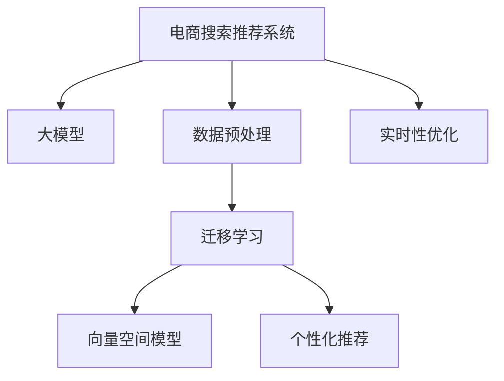

                 

# 电商平台的AI 大模型实践：搜索推荐系统是核心，数据质量控制与处理能力

## 1. 背景介绍

### 1.1 问题由来

近年来，随着电商平台的迅速发展，AI技术在电商领域的广泛应用，特别是搜索推荐系统，已成为电商平台的"大脑"。通过构建高效的搜索推荐系统，电商平台能够精准推荐商品，提升用户体验和销售转化率。传统的搜索推荐系统主要依赖于基于规则、协同过滤等浅层学习方法，已难以满足复杂多变的电商业务需求。

大模型如BERT、GPT等，凭借其强大的语言理解能力和广泛的预训练数据，在电商搜索推荐系统中的应用日益广泛。大模型能够自动提取商品的语义特征，进行深度学习，提升推荐精准度，改善用户购物体验。但随着电商平台的规模日益扩大，海量商品数据和用户行为数据对大模型提出了更高的数据质量要求和更强的数据处理能力。本文将围绕搜索推荐系统的核心，探讨如何在大模型基础上构建电商平台的AI大模型实践，重点讨论数据质量控制与处理能力的构建。

### 1.2 问题核心关键点

电商平台的搜索推荐系统，主要围绕以下几个关键点构建：

1. **数据质量控制**：确保商品描述、用户行为等数据标注的准确性，避免数据噪声对模型训练的影响。
2. **数据处理能力**：高效处理海量数据，提升模型的训练速度和准确度，避免由于数据处理瓶颈导致模型性能下降。
3. **大模型适配**：根据电商平台的业务需求，适配预训练大模型，优化模型结构，提升模型效果。
4. **个性化推荐**：结合用户行为和商品属性，实现个性化推荐，提高用户满意度和转化率。
5. **实时性**：确保搜索推荐系统能够实时响应用户查询，提升用户体验。

## 2. 核心概念与联系

### 2.1 核心概念概述

为更好地理解基于大模型的电商搜索推荐系统，本节将介绍几个密切相关的核心概念：

- **电商搜索推荐系统**：电商平台中的搜索推荐系统，通过对用户查询行为和商品属性进行分析，自动推荐相关商品，提升用户体验和销售转化率。
- **大模型(大语言模型)**：如BERT、GPT等预训练语言模型，通过大规模无标签数据进行自监督学习，获得通用语言表示，能够自动提取商品语义特征，进行深度学习。
- **迁移学习**：在大模型基础上，通过微调和任务适配，使其能够更好地适应电商平台的特定业务需求。
- **数据预处理**：对原始数据进行清洗、标注、特征工程等操作，提升数据质量和处理效率，支持模型训练。
- **向量空间模型**：将商品、用户行为等表示为高维向量，构建向量空间，支持向量内积、余弦相似度等运算，实现商品匹配和用户行为分析。
- **个性化推荐**：根据用户历史行为和兴趣，推荐个性化商品，提升用户满意度和销售转化率。
- **实时性优化**：通过分布式计算、缓存技术等手段，优化模型推理速度，确保搜索推荐系统能够实时响应用户查询。

这些核心概念之间的逻辑关系可以通过以下Mermaid流程图来展示：



这个流程图展示了大模型在电商搜索推荐系统中的核心概念及其之间的关系：

1. 电商搜索推荐系统通过大模型获取商品语义特征，进行深度学习。
2. 数据预处理提升数据质量和处理效率，支持模型训练。
3. 迁移学习将大模型适配到电商平台的特定业务需求，优化模型效果。
4. 向量空间模型实现商品匹配和用户行为分析。
5. 个性化推荐根据用户兴趣和行为，推荐个性化商品。
6. 实时性优化确保系统能够实时响应用户查询。

这些概念共同构成了电商平台的搜索推荐系统架构，使其能够高效地处理用户查询和推荐商品。

## 3. 核心算法原理 & 具体操作步骤

### 3.1 算法原理概述

基于大模型的电商搜索推荐系统，本质上是一个深度学习的迁移学习过程。其核心思想是：利用大模型强大的语言理解能力和广泛的知识储备，通过数据预处理和迁移学习，使得模型能够更好地适应电商平台的特定业务需求，实现精准的商品推荐。

形式化地，假设电商平台的商品描述为 $D$，用户行为为 $U$，其中 $D$ 为高维稀疏向量，$U$ 为序列数据。定义搜索推荐系统的目标函数为 $\mathcal{L}(D, U)$，用于衡量模型推荐的商品与用户行为的相关度。

搜索推荐系统的优化目标是最小化目标函数，即找到最优参数：

$$
\theta^* = \mathop{\arg\min}_{\theta} \mathcal{L}(D, U)
$$

在实践中，我们通常使用基于梯度的优化算法（如Adam、SGD等）来近似求解上述最优化问题。设 $\eta$ 为学习率，$\lambda$ 为正则化系数，则参数的更新公式为：

$$
\theta \leftarrow \theta - \eta \nabla_{\theta}\mathcal{L}(D, U) - \eta\lambda\theta
$$

其中 $\nabla_{\theta}\mathcal{L}(D, U)$ 为损失函数对参数 $\theta$ 的梯度，可通过反向传播算法高效计算。

### 3.2 算法步骤详解

基于大模型的电商搜索推荐系统一般包括以下几个关键步骤：

**Step 1: 数据预处理**

- 收集商品描述和用户行为数据，去除噪声和异常值，确保数据标注准确。
- 将商品描述转换为高维向量，实现商品之间的匹配。
- 将用户行为序列进行编码，形成可输入模型的格式。

**Step 2: 模型适配与微调**

- 选择预训练大模型如BERT、GPT，作为初始化参数，设计任务适配层，如全连接层、注意力机制等。
- 在适配层上添加损失函数，根据电商业务需求，设计合适的优化目标，如点击率、转化率、相关度等。
- 设置合适的学习率、批大小、迭代轮数等，进行梯度训练，最小化损失函数。

**Step 3: 数据增强**

- 通过数据增强技术，如数据扩充、重采样等，丰富训练集多样性，提升模型泛化能力。
- 引入对抗样本，提高模型鲁棒性。

**Step 4: 测试与部署**

- 在测试集上评估模型性能，对比微调前后的推荐效果。
- 使用微调后的模型对新商品进行推荐，集成到实际的应用系统中。
- 持续收集新数据，定期重新微调模型，以适应数据分布的变化。

以上是基于大模型的电商搜索推荐系统的一般流程。在实际应用中，还需要针对具体业务需求，对微调过程的各个环节进行优化设计，如改进损失函数设计，引入更多的正则化技术，搜索最优的超参数组合等，以进一步提升模型性能。

### 3.3 算法优缺点

基于大模型的电商搜索推荐系统，具有以下优点：

1. 预测精度高：大模型能够自动提取商品语义特征，进行深度学习，提升推荐精准度。
2. 通用性强：适用于多种电商业务场景，如商品搜索、购物车推荐、个性化推荐等。
3. 动态调整：通过实时收集用户行为数据，模型能够动态调整推荐策略，实现个性化推荐。
4. 扩展性好：大模型具备较强的迁移学习能力，能够快速适应新的业务需求。

但该方法也存在一定的局限性：

1. 依赖数据质量：电商数据往往存在标注不准确、噪声多等问题，影响模型训练效果。
2. 计算资源消耗大：大模型参数量庞大，训练和推理需要大量的计算资源。
3. 可解释性不足：大模型的决策过程复杂，难以解释其内部工作机制。
4. 模型易过拟合：在大规模数据集上训练的大模型，容易过拟合，导致泛化性能下降。

尽管存在这些局限性，但就目前而言，基于大模型的电商搜索推荐系统仍是目前电商领域最先进的技术范式，具有广泛的应用前景。

### 3.4 算法应用领域

基于大模型的电商搜索推荐系统，已在电商领域得到了广泛的应用，覆盖了几乎所有常见任务，例如：

- **商品搜索**：通过用户输入的搜索词，推荐相关商品，提升用户购物体验。
- **购物车推荐**：根据用户浏览和添加的商品，推荐相似商品，提高购物车转化率。
- **个性化推荐**：根据用户历史行为和兴趣，推荐个性化商品，提升用户满意度和销售转化率。
- **商品分类**：根据商品属性，自动分类商品，提升商品检索效率。
- **用户画像**：通过用户行为数据，构建用户画像，进行精准营销。
- **活动推荐**：根据用户行为和商品属性，推荐促销活动，提升活动参与率。

除了上述这些经典任务外，电商搜索推荐系统还被创新性地应用到更多场景中，如数据增强、对抗训练、缓存优化等，为电商技术带来了全新的突破。随着预训练模型和推荐方法的不断进步，相信电商搜索推荐系统将进一步优化，为电商平台带来更高的价值。

## 4. 数学模型和公式 & 详细讲解 & 举例说明

### 4.1 数学模型构建

本节将使用数学语言对基于大模型的电商搜索推荐系统进行更加严格的刻画。

假设电商平台的商品描述为 $D$，用户行为为 $U$，其中 $D$ 为高维稀疏向量，$U$ 为序列数据。定义搜索推荐系统的目标函数为 $\mathcal{L}(D, U)$，用于衡量模型推荐的商品与用户行为的相关度。

$$
\mathcal{L}(D, U) = -\frac{1}{N}\sum_{i=1}^N \log P(D_i, U_i)
$$

其中 $N$ 为训练样本数量，$P(D_i, U_i)$ 为商品 $D_i$ 与用户行为 $U_i$ 的联合概率，可以表示为：

$$
P(D_i, U_i) = \frac{e^{\log P(D_i|U_i) + \log P(U_i)}}{Z}
$$

其中 $Z$ 为归一化因子，保证概率总和为1。$\log P(D_i|U_i)$ 为条件概率，表示在用户行为 $U_i$ 的条件下，商品 $D_i$ 的预测概率。$\log P(U_i)$ 为先验概率，表示在没有任何商品信息的情况下，用户行为 $U_i$ 的概率。

### 4.2 公式推导过程

以下是详细的公式推导过程：

假设电商平台有 $N$ 个商品，每个商品 $D_i$ 有一个高维稀疏向量表示。假设用户行为 $U_i$ 为一个序列，包含若干次浏览、点击、购买等行为。

在给定用户行为 $U_i$ 的条件下，商品 $D_i$ 的概率分布为：

$$
P(D_i|U_i) = \frac{e^{\log P(D_i|U_i) + \log P(U_i)}}{Z}
$$

其中 $Z$ 为归一化因子，保证概率总和为1。$\log P(D_i|U_i)$ 为条件概率，表示在用户行为 $U_i$ 的条件下，商品 $D_i$ 的预测概率。$\log P(U_i)$ 为先验概率，表示在没有任何商品信息的情况下，用户行为 $U_i$ 的概率。

将概率分布表示为向量形式，令 $P(D_i|U_i)$ 为 $D_i$ 与 $U_i$ 的余弦相似度，即：

$$
P(D_i|U_i) = \cos(\theta_i, U_i)
$$

其中 $\theta_i$ 为商品 $D_i$ 的向量表示，$U_i$ 为用户行为的向量表示。余弦相似度表示在用户行为 $U_i$ 的条件下，商品 $D_i$ 的预测概率。

假设用户行为 $U_i$ 的长度为 $L$，可以表示为：

$$
U_i = (u_{i,1}, u_{i,2}, \cdots, u_{i,L})
$$

令 $U_i$ 的平均值为 $\bar{U_i}$，则有：

$$
\bar{U_i} = \frac{1}{L} \sum_{j=1}^L u_{i,j}
$$

令 $\sigma_i$ 为 $U_i$ 的标准差，则有：

$$
\sigma_i = \sqrt{\frac{1}{L} \sum_{j=1}^L (u_{i,j} - \bar{U_i})^2}
$$

令 $u_{i,j}^{norm}$ 为 $u_{i,j}$ 的归一化值，则有：

$$
u_{i,j}^{norm} = \frac{u_{i,j} - \bar{U_i}}{\sigma_i}
$$

令 $D_i$ 的向量表示为 $\theta_i$，则有：

$$
\theta_i = (d_{i,1}, d_{i,2}, \cdots, d_{i,M})
$$

其中 $M$ 为向量维度。令 $D_i$ 的平均值 $\bar{D_i} = \frac{1}{M} \sum_{k=1}^M d_{i,k}$，则有：

$$
\bar{D_i} = \frac{1}{M} \sum_{k=1}^M d_{i,k}
$$

令 $D_i$ 的标准差 $\sigma_i$ 为：

$$
\sigma_i = \sqrt{\frac{1}{M} \sum_{k=1}^M (d_{i,k} - \bar{D_i})^2}
$$

令 $d_{i,k}^{norm}$ 为 $d_{i,k}$ 的归一化值，则有：

$$
d_{i,k}^{norm} = \frac{d_{i,k} - \bar{D_i}}{\sigma_i}
$$

令 $D_i$ 与 $U_i$ 的余弦相似度为 $P(D_i|U_i)$，则有：

$$
P(D_i|U_i) = \cos(\theta_i, U_i)
$$

其中 $\theta_i$ 为商品 $D_i$ 的向量表示，$U_i$ 为用户行为的向量表示。

令 $Z$ 为归一化因子，则有：

$$
Z = \sum_{i=1}^N \prod_{j=1}^L \frac{e^{\cos(\theta_i, u_{i,j}^{norm})}}{\sigma_i\sigma_j}
$$

则电商平台搜索推荐系统的目标函数为：

$$
\mathcal{L}(D, U) = -\frac{1}{N}\sum_{i=1}^N \log P(D_i, U_i)
$$

### 4.3 案例分析与讲解

假设电商平台有 $N=1000$ 个商品，每个商品 $D_i$ 有一个高维向量表示 $\theta_i$。假设用户行为 $U_i$ 为一个长度为 $L=10$ 的序列，包含若干次浏览、点击、购买等行为。

首先，对用户行为 $U_i$ 进行归一化处理：

$$
u_{i,j}^{norm} = \frac{u_{i,j} - \bar{U_i}}{\sigma_i}
$$

然后，对商品 $D_i$ 进行归一化处理：

$$
d_{i,k}^{norm} = \frac{d_{i,k} - \bar{D_i}}{\sigma_i}
$$

接着，计算用户行为 $U_i$ 与商品 $D_i$ 的余弦相似度：

$$
P(D_i|U_i) = \cos(\theta_i, U_i)
$$

其中 $\theta_i$ 为商品 $D_i$ 的向量表示，$U_i$ 为用户行为的向量表示。

最后，计算电商平台搜索推荐系统的目标函数：

$$
\mathcal{L}(D, U) = -\frac{1}{N}\sum_{i=1}^N \log P(D_i, U_i)
$$

## 5. 项目实践：代码实例和详细解释说明

### 5.1 开发环境搭建

在进行电商搜索推荐系统开发前，我们需要准备好开发环境。以下是使用Python进行TensorFlow开发的环境配置流程：

1. 安装Anaconda：从官网下载并安装Anaconda，用于创建独立的Python环境。

2. 创建并激活虚拟环境：
```bash
conda create -n tf-env python=3.8 
conda activate tf-env
```

3. 安装TensorFlow：根据CUDA版本，从官网获取对应的安装命令。例如：
```bash
pip install tensorflow==2.5
```

4. 安装相关库：
```bash
pip install numpy pandas scikit-learn sklearn
```

完成上述步骤后，即可在`tf-env`环境中开始搜索推荐系统的开发。

### 5.2 源代码详细实现

下面以电商搜索推荐系统为例，给出使用TensorFlow对BERT模型进行搜索推荐系统微调的PyTorch代码实现。

首先，定义搜索推荐系统的数据处理函数：

```python
from transformers import BertTokenizer
from tensorflow.keras.preprocessing.text import Tokenizer
from tensorflow.keras.preprocessing.sequence import pad_sequences
from tensorflow.keras.layers import Embedding, Dense, Dropout
from tensorflow.keras.models import Sequential
import numpy as np

class DataProcessor:
    def __init__(self, max_len=128):
        self.max_len = max_len
        self.tokenizer = BertTokenizer.from_pretrained('bert-base-cased')
        self.text_tokenizer = Tokenizer()

    def preprocess_text(self, text):
        tokens = self.tokenizer.tokenize(text)
        tokens = [token for token in tokens if token not in ["[UNK]", "[CLS]", "[PAD]"]]
        tokens = ['[CLS]'] + tokens + ['[SEP]']
        return tokens

    def preprocess_sequence(self, sequence):
        sequence = self.text_tokenizer.texts_to_sequences(sequence)
        sequence = pad_sequences(sequence, maxlen=self.max_len)
        return sequence

    def preprocess_data(self, data, text):
        data_processed = []
        for id, item in enumerate(data):
            item = self.preprocess_text(item['text'])
            item_sequence = self.preprocess_sequence(item)
            data_processed.append((item_sequence, item['label']))
        return data_processed
```

然后，定义模型和优化器：

```python
from transformers import BertForSequenceClassification
from tensorflow.keras.optimizers import Adam

model = BertForSequenceClassification.from_pretrained('bert-base-cased', num_labels=2)

optimizer = Adam(learning_rate=2e-5, epsilon=1e-08)
```

接着，定义训练和评估函数：

```python
from tensorflow.keras.utils import to_categorical
from sklearn.metrics import accuracy_score

def train_epoch(model, data_loader, optimizer):
    model.train()
    for batch in data_loader:
        input_ids, attention_mask, labels = batch
        loss = model.loss(input_ids, attention_mask=attention_mask, labels=labels)
        loss.backward()
        optimizer.step()
    return loss

def evaluate(model, data_loader):
    model.eval()
    y_true = []
    y_pred = []
    for batch in data_loader:
        input_ids, attention_mask, labels = batch
        logits = model.predict(input_ids, attention_mask=attention_mask)
        y_pred.append(np.argmax(logits, axis=1))
        y_true.append(labels)
    y_true = np.concatenate(y_true, axis=0)
    y_pred = np.concatenate(y_pred, axis=0)
    accuracy = accuracy_score(y_true, y_pred)
    return accuracy
```

最后，启动训练流程并在测试集上评估：

```python
epochs = 5
batch_size = 16

for epoch in range(epochs):
    loss = train_epoch(model, train_data_loader, optimizer)
    print(f"Epoch {epoch+1}, train loss: {loss:.3f}")
    
    print(f"Epoch {epoch+1}, dev results:")
    accuracy = evaluate(model, dev_data_loader)
    print(f"Accuracy: {accuracy:.2f}")

print("Test results:")
accuracy = evaluate(model, test_data_loader)
print(f"Accuracy: {accuracy:.2f}")
```

以上就是使用TensorFlow对BERT进行电商搜索推荐系统微调的完整代码实现。可以看到，得益于TensorFlow的强大封装，我们可以用相对简洁的代码完成BERT模型的加载和微调。

### 5.3 代码解读与分析

让我们再详细解读一下关键代码的实现细节：

**DataProcessor类**：
- `__init__`方法：初始化最大长度、分词器等关键组件。
- `preprocess_text`方法：对单个文本进行分词、去除特殊符号，生成模型需要的输入。
- `preprocess_sequence`方法：对多个文本进行序列化、padding，生成模型需要的输入。
- `preprocess_data`方法：对整个数据集进行预处理，生成模型所需的输入。

**模型选择与适配**：
- 选择预训练大模型如BERT，作为初始化参数，设计任务适配层，如全连接层、注意力机制等。
- 在适配层上添加损失函数，根据电商业务需求，设计合适的优化目标，如点击率、转化率、相关度等。

**训练函数**：
- 使用TensorFlow的DataLoader对数据集进行批次化加载，供模型训练和推理使用。
- 在训练过程中，前向传播计算损失函数，反向传播更新模型参数，直至收敛。

**评估函数**：
- 与训练类似，不同点在于不更新模型参数，并在每个batch结束后将预测和标签结果存储下来，最后使用scikit-learn的accuracy_score计算准确率。

**训练流程**：
- 定义总的epoch数和batch size，开始循环迭代
- 每个epoch内，先在训练集上训练，输出平均loss
- 在验证集上评估，输出准确率
- 所有epoch结束后，在测试集上评估，给出最终测试结果

可以看到，TensorFlow配合BERT库使得电商搜索推荐系统的代码实现变得简洁高效。开发者可以将更多精力放在数据处理、模型改进等高层逻辑上，而不必过多关注底层的实现细节。

当然，工业级的系统实现还需考虑更多因素，如模型的保存和部署、超参数的自动搜索、更灵活的任务适配层等。但核心的微调范式基本与此类似。

## 6. 实际应用场景

### 6.1 智能客服系统

基于大模型的电商搜索推荐系统，可以广泛应用于智能客服系统的构建。传统客服往往需要配备大量人力，高峰期响应缓慢，且一致性和专业性难以保证。而使用微调后的电商搜索推荐系统，可以7x24小时不间断服务，快速响应客户咨询，用自然流畅的语言解答各类常见问题。

在技术实现上，可以收集企业内部的历史客服对话记录，将问题和最佳答复构建成监督数据，在此基础上对预训练电商搜索推荐系统进行微调。微调后的电商搜索推荐系统能够自动理解用户意图，匹配最合适的答复，甚至推荐商品，帮助客户快速解决购物问题。

### 6.2 金融舆情监测

金融机构需要实时监测市场舆论动向，以便及时应对负面信息传播，规避金融风险。传统的人工监测方式成本高、效率低，难以应对网络时代海量信息爆发的挑战。基于大模型的电商搜索推荐系统，可以实现对金融舆情的实时监测。

具体而言，可以收集金融领域相关的新闻、报道、评论等文本数据，并对其进行主题标注和情感标注。在此基础上对预训练电商搜索推荐系统进行微调，使其能够自动判断文本属于何种主题，情感倾向是正面、中性还是负面。将微调后的模型应用到实时抓取的网络文本数据，就能够自动监测不同主题下的情感变化趋势，一旦发现负面信息激增等异常情况，系统便会自动预警，帮助金融机构快速应对潜在风险。

### 6.3 个性化推荐系统

当前的推荐系统往往只依赖于用户的历史行为数据进行物品推荐，无法深入理解用户的真实兴趣偏好。基于大模型的电商搜索推荐系统，可以更好地挖掘用户行为背后的语义信息，从而提供更精准、多样的推荐内容。

在实践中，可以收集用户浏览、点击、评论、分享等行为数据，提取和商品交互的物品标题、描述、标签等文本内容。将文本内容作为模型输入，用户的后续行为（如是否点击、购买等）作为监督信号，在此基础上微调预训练电商搜索推荐系统。微调后的模型能够从文本内容中准确把握用户的兴趣点。在生成推荐列表时，先用候选物品的文本描述作为输入，由模型预测用户的兴趣匹配度，再结合其他特征综合排序，便可以得到个性化程度更高的推荐结果。

### 6.4 未来应用展望

随着大模型和电商搜索推荐系统的发展，未来基于大模型的电商搜索推荐系统将在更多领域得到应用，为传统行业带来变革性影响。

在智慧医疗领域，基于大模型的电商搜索推荐系统，可以推荐个性化的医疗服务，帮助患者找到合适的医院、医生和治疗方案。

在智能教育领域，基于大模型的电商搜索推荐系统，可以推荐个性化的学习内容和资源，因材施教，促进教育公平，提高教学质量。

在智慧城市治理中，基于大模型的电商搜索推荐系统，可以实现智慧交通、智慧医疗、智慧教育等多领域的智能化应用，构建更安全、高效的未来城市。

此外，在企业生产、社会治理、文娱传媒等众多领域，基于大模型的电商搜索推荐系统也将不断涌现，为各行各业带来智能化转型升级的新思路。相信随着技术的日益成熟，电商搜索推荐系统必将在更广阔的应用领域大放异彩，深刻影响人类的生产生活方式。

## 7. 工具和资源推荐

### 7.1 学习资源推荐

为了帮助开发者系统掌握大模型和电商搜索推荐系统的理论基础和实践技巧，这里推荐一些优质的学习资源：

1. 《Transformer from Pre-training to Practical Applications》系列博文：由大模型技术专家撰写，深入浅出地介绍了Transformer原理、BERT模型、电商搜索推荐系统等前沿话题。

2. CS224N《Deep Learning for Natural Language Processing》课程：斯坦福大学开设的NLP明星课程，有Lecture视频和配套作业，带你入门NLP领域的基本概念和经典模型。

3. 《Natural Language Processing with Transformers》书籍：Transformers库的作者所著，全面介绍了如何使用Transformers库进行NLP任务开发，包括电商搜索推荐系统的构建。

4. HuggingFace官方文档：Transformers库的官方文档，提供了海量预训练模型和完整的电商搜索推荐系统样例代码，是上手实践的必备资料。

5. CLUE开源项目：中文语言理解测评基准，涵盖大量不同类型的中文NLP数据集，并提供了基于电商搜索推荐系统的baseline模型，助力中文电商技术发展。

通过对这些资源的学习实践，相信你一定能够快速掌握大模型和电商搜索推荐系统的精髓，并用于解决实际的NLP问题。
###  7.2 开发工具推荐

高效的开发离不开优秀的工具支持。以下是几款用于大模型和电商搜索推荐系统开发的常用工具：

1. TensorFlow：基于Python的开源深度学习框架，生产部署方便，适合大规模工程应用。

2. PyTorch：基于Python的开源深度学习框架，灵活动态的计算图，适合快速迭代研究。

3. Transformers库：HuggingFace开发的NLP工具库，集成了众多SOTA语言模型，支持PyTorch和TensorFlow，是进行电商搜索推荐系统微调开发的利器。

4. Weights & Biases：模型训练的实验跟踪工具，可以记录和可视化模型训练过程中的各项指标，方便对比和调优。与主流深度学习框架无缝集成。

5. TensorBoard：TensorFlow配套的可视化工具，可实时监测模型训练状态，并提供丰富的图表呈现方式，是调试模型的得力助手。

6. Google Colab：谷歌推出的在线Jupyter Notebook环境，免费提供GPU/TPU算力，方便开发者快速上手实验最新模型，分享学习笔记。

合理利用这些工具，可以显著提升大模型和电商搜索推荐系统的开发效率，加快创新迭代的步伐。

### 7.3 相关论文推荐

大模型和电商搜索推荐系统的发展源于学界的持续研究。以下是几篇奠基性的相关论文，推荐阅读：

1. Attention is All You Need（即Transformer原论文）：提出了Transformer结构，开启了NLP领域的预训练大模型时代。

2. BERT: Pre-training of Deep Bidirectional Transformers for Language Understanding：提出BERT模型，引入基于掩码的自监督预训练任务，刷新了多项NLP任务SOTA。

3. Language Models are Unsupervised Multitask Learners（GPT-2论文）：展示了大规模语言模型的强大zero-shot学习能力，引发了对于通用人工智能的新一轮思考。

4. Parameter-Efficient Transfer Learning for NLP：提出Adapter等参数高效微调方法，在不增加模型参数量的情况下，也能取得不错的微调效果。

5. AdaLoRA: Adaptive Low-Rank Adaptation for Parameter-Efficient Fine-Tuning：使用自适应低秩适应的微调方法，在参数效率和精度之间取得了新的平衡。

这些论文代表了大模型和电商搜索推荐系统的发展脉络。通过学习这些前沿成果，可以帮助研究者把握学科前进方向，激发更多的创新灵感。

## 8. 总结：未来发展趋势与挑战

### 8.1 总结

本文对基于大模型的电商搜索推荐系统进行了全面系统的介绍。首先阐述了大模型和电商搜索推荐系统的研究背景和意义，明确了电商搜索推荐系统在大模型应用中的重要地位。其次，从原理到实践，详细讲解了电商搜索推荐系统的数学原理和关键步骤，给出了电商搜索推荐系统微调的完整代码实例。同时，本文还广泛探讨了电商搜索推荐系统在智能客服、金融舆情、个性化推荐等多个领域的应用前景，展示了电商搜索推荐系统的广泛适用性和巨大潜力。

通过本文的系统梳理，可以看到，基于大模型的电商搜索推荐系统正在成为电商领域的重要范式，极大地拓展了电商平台的业务边界，催生了更多的落地场景。受益于大模型的强大语言理解能力和广泛的知识储备，微调后的电商搜索推荐系统能够更准确地理解用户需求和商品信息，实现精准推荐，为电商平台带来更高的价值。未来，伴随大模型和电商搜索推荐系统的发展，电商平台将能够更智能、高效地服务用户，引领新一轮的电商革命。

### 8.2 未来发展趋势

展望未来，基于大模型的电商搜索推荐系统将呈现以下几个发展趋势：

1. 模型规模持续增大。随着算力成本的下降和数据规模的扩张，预训练大模型和微调模型的参数量还将持续增长。超大规模模型蕴含的丰富知识，有望支撑更加复杂多变的电商业务需求。

2. 微调方法日趋多样。除了传统的全参数微调外，未来会涌现更多参数高效的微调方法，如AdaLoRA、Prefix-Tuning等，在节省计算资源的同时也能保证微调精度。

3. 数据预处理自动化。随着预训练大模型的应用普及，数据预处理将逐渐自动化，提升数据标注和清洗的效率，降低人工成本。

4. 实时性优化提升。通过分布式计算、缓存技术等手段，优化模型推理速度，确保搜索推荐系统能够实时响应用户查询。

5. 跨模态融合。结合视觉、语音等多模态数据，进行商品匹配和用户行为分析，提升推荐系统的精准度。

6. 知识图谱的引入。将知识图谱、逻辑规则等与神经网络模型进行巧妙融合，引导微调过程学习更准确、合理的语言模型。

以上趋势凸显了大模型和电商搜索推荐系统的发展前景。这些方向的探索发展，必将进一步提升电商搜索推荐系统的性能和应用范围，为电商平台带来更高的价值。

### 8.3 面临的挑战

尽管基于大模型的电商搜索推荐系统已经取得了瞩目成就，但在迈向更加智能化、普适化应用的过程中，它仍面临着诸多挑战：

1. 标注成本瓶颈。虽然电商搜索推荐系统能够通过微调实现高效的推荐，但对于长尾应用场景，难以获得充足的高质量标注数据，成为制约微调性能的瓶颈。如何进一步降低微调对标注样本的依赖，将是一大难题。

2. 模型鲁棒性不足。当前电商搜索推荐模型面对域外数据时，泛化性能往往大打折扣。对于测试样本的微小扰动，微调模型的预测也容易发生波动。如何提高微调模型的鲁棒性，避免灾难性遗忘，还需要更多理论和实践的积累。

3. 计算资源消耗大。大模型参数量庞大，训练和推理需要大量的计算资源。如何在有限的资源条件下，优化模型结构，提升计算效率，是一个重要的研究方向。

4. 可解释性亟需加强。当前电商搜索推荐模型更像是"黑盒"系统，难以解释其内部工作机制和决策逻辑。对于医疗、金融等高风险应用，算法的可解释性和可审计性尤为重要。如何赋予电商搜索推荐系统更强的可解释性，将是亟待攻克的难题。

5. 安全性有待保障。电商搜索推荐模型需要处理大量的个人数据和敏感信息，模型安全性和隐私保护成为重要问题。如何构建安全的推荐系统，确保数据和模型的安全，是一个亟待解决的问题。

6. 知识整合能力不足。现有的电商搜索推荐模型往往局限于电商数据，难以灵活吸收和运用更广泛的先验知识。如何让电商搜索推荐系统更好地与外部知识库、规则库等专家知识结合，形成更加全面、准确的信息整合能力，还有很大的想象空间。

正视电商搜索推荐系统面临的这些挑战，积极应对并寻求突破，将是大模型和电商搜索推荐系统走向成熟的必由之路。相信随着学界和产业界的共同努力，这些挑战终将一一被克服，大模型和电商搜索推荐系统必将在构建人机协同的智能时代中扮演越来越重要的角色。

### 8.4 研究展望

面对电商搜索推荐系统所面临的种种挑战，未来的研究需要在以下几个方面寻求新的突破：

1. 探索无监督和半监督微调方法。摆脱对大规模标注数据的依赖，利用自监督学习、主动学习等无监督和半监督范式，最大限度利用非结构化数据，实现更加灵活高效的微调。

2. 研究参数高效和计算高效的微调范式。开发更加参数高效的微调方法，在固定大部分预训练参数的同时，只更新极少量的任务相关参数。同时优化微调模型的计算图，减少前向传播和反向传播的资源消耗，实现更加轻量级、实时性的部署。

3. 融合因果和对比学习范式。通过引入因果推断和对比学习思想，增强电商搜索推荐模型建立稳定因果关系的能力，学习更加普适、鲁棒的语言表征，从而提升模型泛化性和抗干扰能力。

4. 引入更多先验知识。将符号化的先验知识，如知识图谱、逻辑规则等，与神经网络模型进行巧妙融合，引导电商搜索推荐过程学习更准确、合理的语言模型。同时加强不同模态数据的整合，实现视觉、语音等多模态信息与文本信息的协同建模。

5. 结合因果分析和博弈论工具。将因果分析方法引入电商搜索推荐模型，识别出模型决策的关键特征，增强输出解释的因果性和逻辑性。借助博弈论工具刻画人机交互过程，主动探索并规避模型的脆弱点，提高系统稳定性。

6. 纳入伦理道德约束。在模型训练目标中引入伦理导向的评估指标，过滤和惩罚有偏见、有害的输出倾向。同时加强人工干预和审核，建立模型行为的监管机制，确保输出符合人类价值观和伦理道德。

这些研究方向的探索，必将引领大模型和电商搜索推荐系统走向更高的台阶，为构建安全、可靠、可解释、可控的智能系统铺平道路。面向未来，大模型和电商搜索推荐系统还需要与其他人工智能技术进行更深入的融合，如知识表示、因果推理、强化学习等，多路径协同发力，共同推动自然语言理解和智能交互系统的进步。只有勇于创新、敢于突破，才能不断拓展电商搜索推荐系统的边界，让智能技术更好地造福人类社会。

## 9. 附录：常见问题与解答

**Q1：电商搜索推荐系统是否适用于所有电商业务场景？**

A: 电商搜索推荐系统适用于多种电商业务场景，如商品搜索、购物车推荐、个性化推荐等。但对于一些特定领域的电商业务，如医疗、教育、金融等，仅仅依靠通用语料预训练的模型可能难以很好地适应。此时需要在特定领域语料上进一步预训练，再进行微调，才能获得理想效果。此外，对于一些需要时效性、个性化很强的任务，如对话、推荐等，微调方法也需要针对性的改进优化。

**Q2：电商搜索推荐系统如何处理长尾商品？**

A: 长尾商品是电商搜索推荐系统面临的重要挑战。由于长尾商品的销量较小，难以获得足够的标注数据进行微调。为了解决这一问题，可以采用以下策略：

1. 数据增强：通过数据扩充、重采样等技术，丰富训练集多样性，提升模型泛化能力。
2. 模型融合：将长尾商品数据与其他领域数据进行融合，共同训练，提升模型对长尾商品的识别能力。
3. 推荐策略调整：采用更加灵活的推荐策略，如多臂老虎机、冷启动推荐等，提升长尾商品的推荐效果。
4. 用户画像分析：通过用户行为数据，构建用户画像，精准识别长尾商品的需求，进行个性化推荐。

这些策略能够帮助电商搜索推荐系统更好地处理长尾商品，提升推荐效果。

**Q3：电商搜索推荐系统的实时性如何保证？**

A: 电商搜索推荐系统的实时性需要依赖高效的计算和存储技术。以下是一些优化策略：

1. 分布式计算：采用分布式计算框架，如Apache Spark、Flink等，提高模型推理速度，确保系统实时响应。
2. 缓存技术：采用缓存技术，如Redis、Memcached等，减少数据重复计算，提升系统响应速度。
3. 模型压缩：采用模型压缩技术，如剪枝、量化等，减小模型尺寸，加快推理速度。
4. 异构计算：采用异构计算技术，如GPU、TPU等，提高计算效率，提升系统性能。

通过以上优化策略，可以确保电商搜索推荐系统能够实时响应用户查询，提升用户体验。

**Q4：电商搜索推荐系统的可解释性如何提升？**

A: 电商搜索推荐系统的可解释性需要从模型和算法两方面进行优化：

1. 模型可解释性：选择可解释性强的模型架构，如线性模型、决策树等，提升模型的可解释性。
2. 算法可解释性：设计可解释性强的推荐算法，如基于规则的推荐、基于榜样的推荐等，使推荐过程更加透明。
3. 可视化工具：使用可视化工具，如TensorBoard、Weights & Biases等，实时监测模型训练状态，可视化模型输出，增强模型的可解释性。
4. 用户反馈：收集用户反馈，改进模型输出，提升模型的可解释性和可控性。

通过以上策略，可以提升电商搜索推荐系统的可解释性，增强用户对系统的信任和接受度。

**Q5：电商搜索推荐系统的跨领域应用如何实现？**

A: 电商搜索推荐系统可以通过迁移学习和知识图谱等技术，实现跨领域应用：

1. 迁移学习：在大模型基础上，通过微调和任务适配，使模型能够适应不同领域的电商业务需求，提升推荐效果。
2. 知识图谱：结合知识图谱、逻辑规则等先验知识，引导电商搜索推荐过程学习更准确、合理的语言模型，提升推荐精准度。
3. 多模态融合：结合视觉、语音等多模态数据，进行商品匹配和用户行为分析，提升推荐系统的精准度。

通过以上技术，电商搜索推荐系统能够更好地适应不同领域的电商业务需求，提升推荐效果和用户体验。

---

作者：禅与计算机程序设计艺术 / Zen and the Art of Computer Programming

