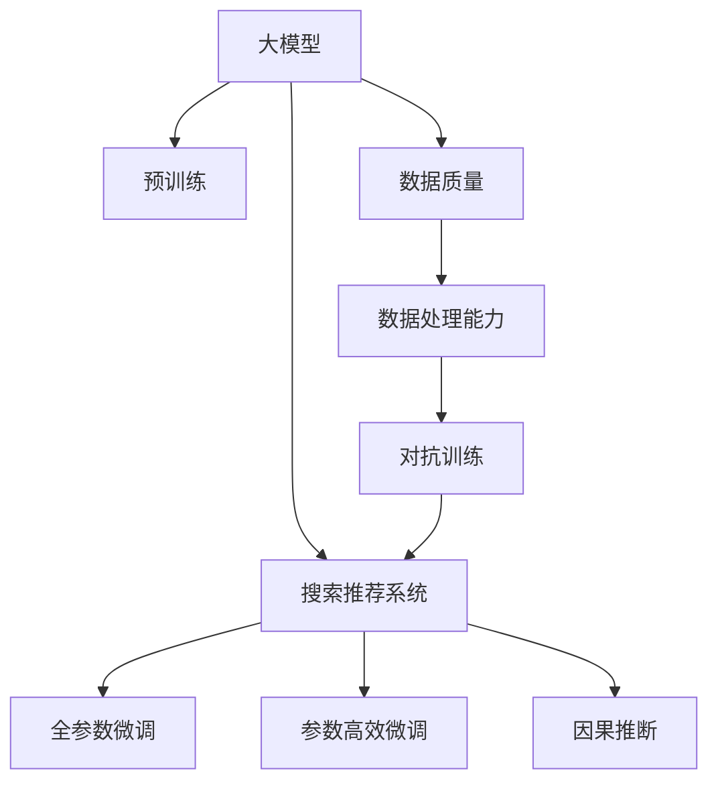

                 

# 电商平台的AI 大模型战略：搜索推荐系统是核心，数据质量与处理能力并重

## 1. 背景介绍

### 1.1 问题由来

随着电商行业的迅猛发展，用户对于个性化体验的需求日益强烈，传统的商品推荐系统已经难以满足市场需求。为了提高用户满意度和提升平台的转化率，电商平台纷纷引入人工智能(AI)技术，利用大规模预训练语言模型进行商品搜索和推荐优化。大模型技术凭借其强大的语言理解能力，在电商平台上得到了广泛应用，显著提升了推荐系统的效果。

### 1.2 问题核心关键点

电商平台的AI大模型战略主要包括以下几个关键点：
1. **大模型基础**：利用大规模预训练语言模型，如GPT、BERT等，获取广泛的语义知识，提升模型在自然语言处理上的能力。
2. **搜索推荐系统**：基于大模型构建搜索和推荐系统，实现精准的搜索结果匹配和个性化的商品推荐。
3. **数据质量与处理能力**：高质量的数据和强大的数据处理能力是大模型在电商应用中取得成功的基石。

### 1.3 问题研究意义

大模型在电商平台上的应用，对于提升用户体验、提高销售转化率、优化库存管理等方面具有重要意义：

1. **提升用户体验**：大模型能够根据用户搜索行为和历史数据，生成个性化的搜索结果，减少用户浏览时间，提高购物满意度。
2. **提高销售转化率**：基于大模型的推荐系统能够为用户提供最符合其兴趣和需求的商品推荐，增加购买决策的概率。
3. **优化库存管理**：通过大模型分析用户行为和市场趋势，优化库存分配，减少库存积压，提升运营效率。

## 2. 核心概念与联系

### 2.1 核心概念概述

为更好地理解电商平台AI大模型战略，本节将介绍几个关键概念：

- **大模型(Large Model)**：指使用大规模数据集进行预训练的语言模型，如GPT-3、BERT等，具备强大的语义理解能力和通用知识储备。
- **搜索推荐系统**：利用大模型生成搜索结果和个性化商品推荐，提升用户的搜索体验和购物满意度。
- **数据质量**：指用于训练大模型的数据集质量，包括数据的真实性、完整性和多样性。
- **数据处理能力**：指对大模型输入数据进行清洗、转换、特征工程等预处理的能力。
- **参数高效微调**：通过只更新少量参数，减少大模型微调过程中的计算资源消耗，提升模型性能。
- **因果推断**：利用因果关系分析用户行为和市场趋势，预测未来变化，优化决策。
- **对抗训练**：通过引入对抗样本，增强模型鲁棒性，提升模型的泛化能力。

这些概念之间的逻辑关系可以通过以下Mermaid流程图来展示：



这个流程图展示了大模型在电商平台应用的核心概念及其之间的关系：

1. 大模型通过预训练获得基础能力。
2. 搜索推荐系统利用大模型生成个性化推荐结果。
3. 数据质量与处理能力确保了模型训练的有效性。
4. 参数高效微调优化了模型性能，减少了计算资源消耗。
5. 对抗训练提高了模型的鲁棒性。
6. 因果推断提供了对用户行为和市场趋势的深入理解。

## 3. 核心算法原理 & 具体操作步骤
### 3.1 算法原理概述

电商平台上的搜索推荐系统主要通过大模型进行用户行为建模和商品推荐。其核心思想是：利用大规模预训练语言模型，对用户搜索和点击行为进行编码，通过向量表示学习用户的兴趣偏好和行为特征，进而生成个性化的商品推荐列表。

具体来说，搜索推荐系统通常包括以下几个步骤：
1. 用户输入搜索关键词。
2. 预训练大模型对关键词进行编码，生成用户兴趣表示。
3. 检索商品库中的相关商品，生成商品表示。
4. 计算用户与商品的相似度，生成个性化推荐列表。

### 3.2 算法步骤详解

电商平台的搜索推荐系统主要包括以下几个关键步骤：

**Step 1: 数据预处理**
- 收集用户的搜索记录、点击记录、购买记录等行为数据，并标注商品的类别和属性。
- 对数据进行清洗和归一化处理，去除噪声和异常值。
- 对数据进行特征工程，提取有意义的特征，如关键词、类别、价格、评分等。

**Step 2: 大模型编码**
- 使用预训练大模型（如BERT、GPT等）对用户搜索关键词和商品信息进行编码，生成向量表示。
- 根据搜索结果和点击记录，计算用户的兴趣表示和行为特征。
- 利用这些向量表示，计算用户与商品之间的相似度，排序生成推荐列表。

**Step 3: 参数高效微调**
- 对预训练大模型的顶层参数进行微调，以适应电商平台的特定任务。
- 使用少量样本进行微调，以避免过拟合和提高模型泛化能力。
- 采用正则化技术，如L2正则、Dropout等，防止模型过度适应数据。

**Step 4: 对抗训练**
- 在训练数据中加入对抗样本，增加模型的鲁棒性和泛化能力。
- 使用对抗训练策略，如FGM、PGD等，提升模型对扰动的防御能力。

**Step 5: 因果推断**
- 利用因果推断方法，分析用户行为与商品推荐之间的关系。
- 使用CausalInference、IAT等工具，进行因果关系建模，预测用户行为。
- 通过A/B测试等方法，验证因果推断模型的效果。

**Step 6: 结果评估**
- 使用各种评估指标，如准确率、召回率、F1值等，评估推荐系统的性能。
- 进行离线评估和在线A/B测试，对比不同推荐策略的效果。
- 根据反馈数据，不断优化模型和推荐策略。

### 3.3 算法优缺点

电商平台搜索推荐系统的大模型应用具有以下优点：
1. **提升推荐精度**：通过预训练大模型，提升了模型对自然语言的处理能力，生成的推荐结果更加精准。
2. **个性化推荐**：利用用户搜索和点击行为进行编码，生成个性化的推荐列表，提升用户体验。
3. **实时响应**：基于大模型构建的系统能够快速处理用户请求，提供即时的搜索结果和推荐。
4. **易扩展性**：大模型的预训练和微调可以独立进行，方便系统的扩展和优化。

同时，该方法也存在一定的局限性：
1. **数据依赖**：系统对数据质量的要求较高，数据偏差和噪声会影响推荐结果。
2. **计算资源消耗大**：大规模预训练语言模型的计算资源消耗较大，需要高性能的硬件支持。
3. **模型复杂度高**：大模型的参数量较大，模型训练和推理的复杂度较高。
4. **结果可解释性差**：基于大模型的推荐系统缺乏可解释性，难以理解和调试推荐逻辑。

尽管存在这些局限性，但就目前而言，大模型在电商平台上的应用仍然是一种较为有效的方法，可以显著提升搜索推荐系统的性能。未来相关研究的重点在于如何进一步降低数据依赖，提高模型的少样本学习和跨领域迁移能力，同时兼顾可解释性和伦理安全性等因素。

### 3.4 算法应用领域

基于大模型的搜索推荐系统已经在电商平台的多个领域得到了广泛的应用，例如：

- **商品搜索**：利用大模型对用户搜索关键词进行编码，检索商品库中的相关商品，生成搜索结果。
- **个性化推荐**：根据用户的搜索记录、点击记录和购买记录，生成个性化的商品推荐列表。
- **实时定价**：利用大模型分析市场趋势和用户需求，动态调整商品价格，提升销售转化率。
- **库存管理**：通过大模型分析用户行为和市场趋势，优化库存分配，减少库存积压。

除了上述这些经典应用外，大模型还被创新性地应用到更多场景中，如智能客服、广告投放、内容生成等，为电商平台带来了全新的突破。随着预训练模型和推荐方法的不断进步，相信电商平台的应用场景将更加丰富，大模型技术将发挥更大的作用。

## 4. 数学模型和公式 & 详细讲解  
### 4.1 数学模型构建

本节将使用数学语言对电商平台上基于大模型的搜索推荐系统进行更加严格的刻画。

假设电商平台上的搜索推荐系统由以下组件构成：
- 用户输入：$x$，表示用户的搜索关键词。
- 商品库：$D$，表示商品集合。
- 大模型：$M_{\theta}$，表示预训练语言模型，其中$\theta$为模型参数。
- 用户兴趣表示：$h_{user}$，表示用户输入$x$经过大模型编码后的向量表示。
- 商品表示：$h_{item}$，表示商品$i$经过大模型编码后的向量表示。

定义用户与商品之间的相似度函数为$similarity(x, i)$，用于计算用户和商品之间的相似度。

假设推荐系统包含$K$个候选商品，则推荐算法可以表示为：
$$
y = \mathop{\arg\max}_{k \in [1,K]} similarity(h_{user}, h_{item_k})
$$

其中$similarity(h_{user}, h_{item_k})$表示用户兴趣表示$h_{user}$与候选商品$k$的相似度。

### 4.2 公式推导过程

以下我们以基于余弦相似度的推荐算法为例，推导相似度函数的计算公式。

假设用户兴趣表示$h_{user}$和商品表示$h_{item}$的维度为$d$，则余弦相似度函数定义为：
$$
similarity(h_{user}, h_{item}) = \frac{h_{user} \cdot h_{item}}{\|h_{user}\| \cdot \|h_{item}\|}
$$

其中$h_{user} \cdot h_{item}$表示向量点积，$\|h_{user}\|$和$\|h_{item}\|$表示向量的模长。

对于电商平台的推荐系统，商品表示$h_{item}$可以通过大模型对商品的类别、属性、评论等信息进行编码得到。假设$h_{item}$为商品$i$的类别、属性和评论等信息经过大模型编码后的向量表示，则相似度函数可以表示为：
$$
similarity(h_{user}, h_{item}) = \frac{h_{user} \cdot h_{item}}{\|h_{user}\| \cdot \|h_{item}\|}
$$

将上式代入推荐算法，得到推荐列表排序公式为：
$$
y = \mathop{\arg\max}_{k \in [1,K]} \frac{h_{user} \cdot h_{item_k}}{\|h_{user}\| \cdot \|h_{item_k}\|}
$$

### 4.3 案例分析与讲解

假设电商平台收集了用户的历史搜索记录和商品的用户行为数据，定义了商品的类别、属性和评论等信息，并使用BERT模型进行编码。具体步骤如下：

**Step 1: 数据预处理**
- 收集用户的搜索记录和商品的用户行为数据，标注商品的类别、属性和评论等信息。
- 对数据进行清洗和归一化处理，去除噪声和异常值。
- 对数据进行特征工程，提取有意义的特征，如关键词、类别、价格、评分等。

**Step 2: 大模型编码**
- 使用BERT模型对用户的搜索记录和商品的用户行为数据进行编码，生成用户兴趣表示$h_{user}$和商品表示$h_{item}$。
- 假设用户输入为“衣服”，经过BERT模型编码得到用户兴趣表示$h_{user}$。
- 假设商品库中有两条商品，经过BERT模型编码得到商品1表示$h_{item_1}$和商品2表示$h_{item_2}$。

**Step 3: 参数高效微调**
- 对预训练BERT模型的顶层参数进行微调，以适应电商平台的特定任务。
- 使用少量样本进行微调，以避免过拟合和提高模型泛化能力。
- 采用正则化技术，如L2正则、Dropout等，防止模型过度适应数据。

**Step 4: 对抗训练**
- 在训练数据中加入对抗样本，增加模型的鲁棒性和泛化能力。
- 使用对抗训练策略，如FGM、PGD等，提升模型对扰动的防御能力。

**Step 5: 因果推断**
- 利用因果推断方法，分析用户行为与商品推荐之间的关系。
- 使用CausalInference、IAT等工具，进行因果关系建模，预测用户行为。
- 通过A/B测试等方法，验证因果推断模型的效果。

**Step 6: 结果评估**
- 使用各种评估指标，如准确率、召回率、F1值等，评估推荐系统的性能。
- 进行离线评估和在线A/B测试，对比不同推荐策略的效果。
- 根据反馈数据，不断优化模型和推荐策略。

通过上述步骤，可以构建一个基于大模型的电商推荐系统，实现个性化的商品推荐。

## 5. 项目实践：代码实例和详细解释说明
### 5.1 开发环境搭建

在进行微调实践前，我们需要准备好开发环境。以下是使用Python进行PyTorch开发的环境配置流程：

1. 安装Anaconda：从官网下载并安装Anaconda，用于创建独立的Python环境。

2. 创建并激活虚拟环境：
```bash
conda create -n pytorch-env python=3.8 
conda activate pytorch-env
```

3. 安装PyTorch：根据CUDA版本，从官网获取对应的安装命令。例如：
```bash
conda install pytorch torchvision torchaudio cudatoolkit=11.1 -c pytorch -c conda-forge
```

4. 安装Transformers库：
```bash
pip install transformers
```

5. 安装各类工具包：
```bash
pip install numpy pandas scikit-learn matplotlib tqdm jupyter notebook ipython
```

完成上述步骤后，即可在`pytorch-env`环境中开始微调实践。

### 5.2 源代码详细实现

这里我们以电商推荐系统的实现为例，给出使用Transformers库对BERT模型进行微调的PyTorch代码实现。

首先，定义推荐任务的数据处理函数：

```python
from transformers import BertTokenizer
from torch.utils.data import Dataset
import torch

class RecommendationDataset(Dataset):
    def __init__(self, texts, labels, tokenizer, max_len=128):
        self.texts = texts
        self.labels = labels
        self.tokenizer = tokenizer
        self.max_len = max_len
        
    def __len__(self):
        return len(self.texts)
    
    def __getitem__(self, item):
        text = self.texts[item]
        label = self.labels[item]
        
        encoding = self.tokenizer(text, return_tensors='pt', max_length=self.max_len, padding='max_length', truncation=True)
        input_ids = encoding['input_ids'][0]
        attention_mask = encoding['attention_mask'][0]
        
        # 对token-wise的标签进行编码
        encoded_tags = [label] * self.max_len
        encoded_tags.extend([0] * (self.max_len - len(encoded_tags)))
        labels = torch.tensor(encoded_tags, dtype=torch.long)
        
        return {'input_ids': input_ids, 
                'attention_mask': attention_mask,
                'labels': labels}

# 标签与id的映射
label2id = {'0': 0, '1': 1, '2': 2, '3': 3}
id2label = {v: k for k, v in label2id.items()}

# 创建dataset
tokenizer = BertTokenizer.from_pretrained('bert-base-cased')

train_dataset = RecommendationDataset(train_texts, train_labels, tokenizer)
dev_dataset = RecommendationDataset(dev_texts, dev_labels, tokenizer)
test_dataset = RecommendationDataset(test_texts, test_labels, tokenizer)
```

然后，定义模型和优化器：

```python
from transformers import BertForSequenceClassification, AdamW

model = BertForSequenceClassification.from_pretrained('bert-base-cased', num_labels=len(label2id))

optimizer = AdamW(model.parameters(), lr=2e-5)
```

接着，定义训练和评估函数：

```python
from torch.utils.data import DataLoader
from tqdm import tqdm
from sklearn.metrics import classification_report

device = torch.device('cuda') if torch.cuda.is_available() else torch.device('cpu')
model.to(device)

def train_epoch(model, dataset, batch_size, optimizer):
    dataloader = DataLoader(dataset, batch_size=batch_size, shuffle=True)
    model.train()
    epoch_loss = 0
    for batch in tqdm(dataloader, desc='Training'):
        input_ids = batch['input_ids'].to(device)
        attention_mask = batch['attention_mask'].to(device)
        labels = batch['labels'].to(device)
        model.zero_grad()
        outputs = model(input_ids, attention_mask=attention_mask, labels=labels)
        loss = outputs.loss
        epoch_loss += loss.item()
        loss.backward()
        optimizer.step()
    return epoch_loss / len(dataloader)

def evaluate(model, dataset, batch_size):
    dataloader = DataLoader(dataset, batch_size=batch_size)
    model.eval()
    preds, labels = [], []
    with torch.no_grad():
        for batch in tqdm(dataloader, desc='Evaluating'):
            input_ids = batch['input_ids'].to(device)
            attention_mask = batch['attention_mask'].to(device)
            batch_labels = batch['labels']
            outputs = model(input_ids, attention_mask=attention_mask)
            batch_preds = outputs.logits.argmax(dim=2).to('cpu').tolist()
            batch_labels = batch_labels.to('cpu').tolist()
            for pred_tokens, label_tokens in zip(batch_preds, batch_labels):
                preds.append(pred_tokens[:len(label_tokens)])
                labels.append(label_tokens)
                
    print(classification_report(labels, preds))
```

最后，启动训练流程并在测试集上评估：

```python
epochs = 5
batch_size = 16

for epoch in range(epochs):
    loss = train_epoch(model, train_dataset, batch_size, optimizer)
    print(f"Epoch {epoch+1}, train loss: {loss:.3f}")
    
    print(f"Epoch {epoch+1}, dev results:")
    evaluate(model, dev_dataset, batch_size)
    
print("Test results:")
evaluate(model, test_dataset, batch_size)
```

以上就是使用PyTorch对BERT进行电商推荐系统微调的完整代码实现。可以看到，得益于Transformers库的强大封装，我们可以用相对简洁的代码完成BERT模型的加载和微调。

### 5.3 代码解读与分析

让我们再详细解读一下关键代码的实现细节：

**RecommendationDataset类**：
- `__init__`方法：初始化文本、标签、分词器等关键组件。
- `__len__`方法：返回数据集的样本数量。
- `__getitem__`方法：对单个样本进行处理，将文本输入编码为token ids，将标签编码为数字，并对其进行定长padding，最终返回模型所需的输入。

**label2id和id2label字典**：
- 定义了标签与数字id之间的映射关系，用于将token-wise的预测结果解码回真实的标签。

**训练和评估函数**：
- 使用PyTorch的DataLoader对数据集进行批次化加载，供模型训练和推理使用。
- 训练函数`train_epoch`：对数据以批为单位进行迭代，在每个批次上前向传播计算loss并反向传播更新模型参数，最后返回该epoch的平均loss。
- 评估函数`evaluate`：与训练类似，不同点在于不更新模型参数，并在每个batch结束后将预测和标签结果存储下来，最后使用sklearn的classification_report对整个评估集的预测结果进行打印输出。

**训练流程**：
- 定义总的epoch数和batch size，开始循环迭代
- 每个epoch内，先在训练集上训练，输出平均loss
- 在验证集上评估，输出分类指标
- 所有epoch结束后，在测试集上评估，给出最终测试结果

可以看到，PyTorch配合Transformers库使得BERT微调的代码实现变得简洁高效。开发者可以将更多精力放在数据处理、模型改进等高层逻辑上，而不必过多关注底层的实现细节。

当然，工业级的系统实现还需考虑更多因素，如模型的保存和部署、超参数的自动搜索、更灵活的任务适配层等。但核心的微调范式基本与此类似。

## 6. 实际应用场景
### 6.1 智能客服系统

基于大语言模型微调的对话技术，可以广泛应用于智能客服系统的构建。传统客服往往需要配备大量人力，高峰期响应缓慢，且一致性和专业性难以保证。而使用微调后的对话模型，可以7x24小时不间断服务，快速响应客户咨询，用自然流畅的语言解答各类常见问题。

在技术实现上，可以收集企业内部的历史客服对话记录，将问题和最佳答复构建成监督数据，在此基础上对预训练对话模型进行微调。微调后的对话模型能够自动理解用户意图，匹配最合适的答案模板进行回复。对于客户提出的新问题，还可以接入检索系统实时搜索相关内容，动态组织生成回答。如此构建的智能客服系统，能大幅提升客户咨询体验和问题解决效率。

### 6.2 金融舆情监测

金融机构需要实时监测市场舆论动向，以便及时应对负面信息传播，规避金融风险。传统的人工监测方式成本高、效率低，难以应对网络时代海量信息爆发的挑战。基于大语言模型微调的文本分类和情感分析技术，为金融舆情监测提供了新的解决方案。

具体而言，可以收集金融领域相关的新闻、报道、评论等文本数据，并对其进行主题标注和情感标注。在此基础上对预训练语言模型进行微调，使其能够自动判断文本属于何种主题，情感倾向是正面、中性还是负面。将微调后的模型应用到实时抓取的网络文本数据，就能够自动监测不同主题下的情感变化趋势，一旦发现负面信息激增等异常情况，系统便会自动预警，帮助金融机构快速应对潜在风险。

### 6.3 个性化推荐系统

当前的推荐系统往往只依赖用户的历史行为数据进行物品推荐，无法深入理解用户的真实兴趣偏好。基于大语言模型微调技术，个性化推荐系统可以更好地挖掘用户行为背后的语义信息，从而提供更精准、多样的推荐内容。

在实践中，可以收集用户浏览、点击、评论、分享等行为数据，提取和用户交互的物品标题、描述、标签等文本内容。将文本内容作为模型输入，用户的后续行为（如是否点击、购买等）作为监督信号，在此基础上微调预训练语言模型。微调后的模型能够从文本内容中准确把握用户的兴趣点。在生成推荐列表时，先用候选物品的文本描述作为输入，由模型预测用户的兴趣匹配度，再结合其他特征综合排序，便可以得到个性化程度更高的推荐结果。

### 6.4 未来应用展望

随着大语言模型微调技术的发展，未来其在电商平台上的应用将更加广泛和深入。

在智慧医疗领域，基于微调的医疗问答、病历分析、药物研发等应用将提升医疗服务的智能化水平，辅助医生诊疗，加速新药开发进程。

在智能教育领域，微调技术可应用于作业批改、学情分析、知识推荐等方面，因材施教，促进教育公平，提高教学质量。

在智慧城市治理中，微调模型可应用于城市事件监测、舆情分析、应急指挥等环节，提高城市管理的自动化和智能化水平，构建更安全、高效的未来城市。

此外，在企业生产、社会治理、文娱传媒等众多领域，基于大模型微调的人工智能应用也将不断涌现，为经济社会发展注入新的动力。相信随着技术的日益成熟，微调方法将成为人工智能落地应用的重要范式，推动人工智能技术向更广阔的领域加速渗透。

## 7. 工具和资源推荐
### 7.1 学习资源推荐

为了帮助开发者系统掌握大语言模型微调的理论基础和实践技巧，这里推荐一些优质的学习资源：

1. 《Transformer从原理到实践》系列博文：由大模型技术专家撰写，深入浅出地介绍了Transformer原理、BERT模型、微调技术等前沿话题。

2. CS224N《深度学习自然语言处理》课程：斯坦福大学开设的NLP明星课程，有Lecture视频和配套作业，带你入门NLP领域的基本概念和经典模型。

3. 《Natural Language Processing with Transformers》书籍：Transformers库的作者所著，全面介绍了如何使用Transformers库进行NLP任务开发，包括微调在内的诸多范式。

4. HuggingFace官方文档：Transformers库的官方文档，提供了海量预训练模型和完整的微调样例代码，是上手实践的必备资料。

5. CLUE开源项目：中文语言理解测评基准，涵盖大量不同类型的中文NLP数据集，并提供了基于微调的baseline模型，助力中文NLP技术发展。

通过对这些资源的学习实践，相信你一定能够快速掌握大语言模型微调的精髓，并用于解决实际的NLP问题。
###  7.2 开发工具推荐

高效的开发离不开优秀的工具支持。以下是几款用于大语言模型微调开发的常用工具：

1. PyTorch：基于Python的开源深度学习框架，灵活动态的计算图，适合快速迭代研究。大部分预训练语言模型都有PyTorch版本的实现。

2. TensorFlow：由Google主导开发的开源深度学习框架，生产部署方便，适合大规模工程应用。同样有丰富的预训练语言模型资源。

3. Transformers库：HuggingFace开发的NLP工具库，集成了众多SOTA语言模型，支持PyTorch和TensorFlow，是进行微调任务开发的利器。

4. Weights & Biases：模型训练的实验跟踪工具，可以记录和可视化模型训练过程中的各项指标，方便对比和调优。与主流深度学习框架无缝集成。

5. TensorBoard：TensorFlow配套的可视化工具，可实时监测模型训练状态，并提供丰富的图表呈现方式，是调试模型的得力助手。

6. Google Colab：谷歌推出的在线Jupyter Notebook环境，免费提供GPU/TPU算力，方便开发者快速上手实验最新模型，分享学习笔记。

合理利用这些工具，可以显著提升大语言模型微调任务的开发效率，加快创新迭代的步伐。

### 7.3 相关论文推荐

大语言模型和微调技术的发展源于学界的持续研究。以下是几篇奠基性的相关论文，推荐阅读：

1. Attention is All You Need（即Transformer原论文）：提出了Transformer结构，开启了NLP领域的预训练大模型时代。

2. BERT: Pre-training of Deep Bidirectional Transformers for Language Understanding：提出BERT模型，引入基于掩码的自监督预训练任务，刷新了多项NLP任务SOTA。

3. Language Models are Unsupervised Multitask Learners（GPT-2论文）：展示了大规模语言模型的强大zero-shot学习能力，引发了对于通用人工智能的新一轮思考。

4. Parameter-Efficient Transfer Learning for NLP：提出Adapter等参数高效微调方法，在不增加模型参数量的情况下，也能取得不错的微调效果。

5. Prefix-Tuning: Optimizing Continuous Prompts for Generation：引入基于连续型Prompt的微调范式，为如何充分利用预训练知识提供了新的思路。

6. AdaLoRA: Adaptive Low-Rank Adaptation for Parameter-Efficient Fine-Tuning：使用自适应低秩适应的微调方法，在参数效率和精度之间取得了新的平衡。

这些论文代表了大语言模型微调技术的发展脉络。通过学习这些前沿成果，可以帮助研究者把握学科前进方向，激发更多的创新灵感。

## 8. 总结：未来发展趋势与挑战
### 8.1 总结

本文对基于大模型的电商平台的AI战略进行了全面系统的介绍。首先阐述了大模型在电商平台上的应用背景和研究意义，明确了微调在提升用户体验、提高销售转化率、优化库存管理等方面的独特价值。其次，从原理到实践，详细讲解了电商平台上基于大模型的推荐系统构建流程，给出了微调任务开发的完整代码实例。同时，本文还广泛探讨了微调方法在智能客服、金融舆情、个性化推荐等多个行业领域的应用前景，展示了微调范式的巨大潜力。此外，本文精选了微调技术的各类学习资源，力求为读者提供全方位的技术指引。

通过本文的系统梳理，可以看到，基于大模型的电商推荐系统正在成为电商平台上的重要技术手段，极大地提升了用户购物体验和平台销售转化率。得益于大规模预训练语言模型和微调技术，推荐系统能够更加精准地匹配用户需求，实现个性化推荐。未来，随着大模型的进一步发展和优化，推荐系统的性能将进一步提升，成为电商平台上不可或缺的核心技术。

### 8.2 未来发展趋势

展望未来，大模型在电商平台上的应用将呈现以下几个发展趋势：

1. **更广泛的应用场景**：大模型将应用于更多电商场景，如智能客服、广告投放、内容生成等，提供更全面的个性化服务。
2. **更高精度的推荐**：随着模型的不断优化和训练数据的丰富，推荐系统的精度将不断提升，能够更好地满足用户需求。
3. **跨领域迁移能力**：大模型的通用性将进一步增强，能够在不同的电商平台和应用场景中实现跨领域的迁移。
4. **实时性**：通过优化模型结构和计算图，大模型推荐系统将能够实时处理用户请求，提供更快速的服务体验。
5. **可解释性**：随着模型解释技术的发展，大模型的决策过程将更加透明，用户能够更容易理解和信任推荐结果。
6. **安全性**：大模型推荐系统将引入更多安全措施，保护用户隐私和数据安全，防止模型被滥用。

以上趋势凸显了大模型在电商平台应用中的广阔前景。这些方向的探索发展，必将进一步提升电商平台的智能化水平，为消费者带来更优质的购物体验。

### 8.3 面临的挑战

尽管大模型在电商平台上的应用取得了显著成果，但在迈向更加智能化、普适化应用的过程中，它仍面临着诸多挑战：

1. **数据依赖**：推荐系统依赖于大量的用户行为数据，数据偏差和噪声可能会影响推荐效果。
2. **模型复杂度**：大规模预训练语言模型的参数量较大，模型训练和推理的复杂度较高，资源消耗较大。
3. **可解释性不足**：大模型推荐系统的输出缺乏可解释性，用户难以理解推荐逻辑和决策依据。
4. **安全性问题**：大模型可能被用于恶意用途，如误导性推荐、信息泄露等，需要加强数据和模型的安全防护。
5. **计算资源瓶颈**：大模型的训练和推理需要高性能的硬件支持，计算资源消耗较大。

尽管存在这些挑战，但随着学界和产业界的共同努力，相信这些问题终将一一被克服，大模型技术将进一步提升电商平台的智能化水平，为消费者提供更优质的购物体验。

### 8.4 研究展望

面对大模型在电商平台应用中所面临的挑战，未来的研究需要在以下几个方面寻求新的突破：

1. **低资源微调方法**：探索如何在数据资源有限的情况下，利用少样本学习、自监督学习等技术，进行高效微调。
2. **参数高效微调**：开发更加参数高效的微调方法，在固定大部分预训练参数的同时，只更新极少量的任务相关参数。
3. **因果推断与强化学习**：引入因果推断和强化学习思想，提升推荐系统的决策能力和鲁棒性。
4. **跨领域迁移能力**：开发跨领域的迁移学习能力，使大模型能够在不同的电商平台和应用场景中实现迁移应用。
5. **可解释性增强**：开发更加透明的推荐模型和决策机制，提升系统的可解释性和用户信任度。
6. **安全性保障**：引入更多安全机制和防护措施，防止模型被滥用，确保推荐系统的安全性。

这些研究方向将推动大模型技术在电商平台上进一步发展，提升系统的性能和可靠性，为用户带来更优质的购物体验。面向未来，大模型推荐系统需要与其他AI技术进行更深入的融合，共同推动电商平台的智能化转型。

## 9. 附录：常见问题与解答

**Q1：大模型在电商平台上的应用是否只限于推荐系统？**

A: 大模型在电商平台上的应用不仅限于推荐系统。除了推荐系统外，大模型还可以用于智能客服、广告投放、内容生成等多个场景，提升电商平台的整体智能化水平。

**Q2：大模型在电商平台上是否需要大量标注数据？**

A: 大模型在电商平台上需要大量标注数据进行微调。虽然少样本学习和自监督学习技术可以部分缓解数据依赖问题，但高质量标注数据对于模型性能的提升仍然至关重要。

**Q3：如何处理数据偏差和噪声？**

A: 处理数据偏差和噪声的方法包括数据清洗、归一化、特征工程等。数据清洗可以去除噪声和异常值，归一化可以使数据具有相同的尺度和分布，特征工程可以提取有意义的特征，去除无关信息。

**Q4：如何提升大模型的可解释性？**

A: 提升大模型可解释性的方法包括可视化、模型压缩、模型解释工具等。可视化工具可以展示模型的内部结构和参数变化，模型压缩可以减小模型尺寸，模型解释工具可以提供模型决策的依据和解释。

**Q5：如何保障大模型的安全性？**

A: 保障大模型安全性的方法包括数据加密、模型水印、隐私保护等。数据加密可以防止数据泄露，模型水印可以防止模型被滥用，隐私保护可以防止用户数据被非法访问和利用。

通过这些问题和解答，希望能够帮助你更好地理解和应用大模型在电商平台上的AI战略，提升电商平台的智能化水平和用户体验。

