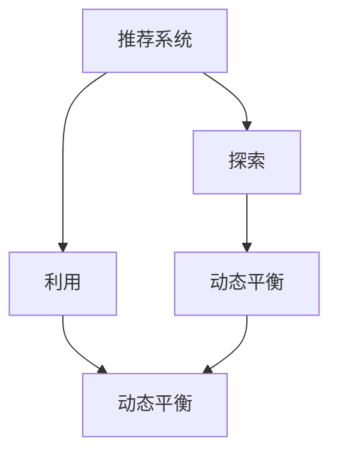

                 

# 电商推荐系统中的探索与利用动态平衡

> 关键词：探索与利用, 电商推荐系统, 动态平衡, 用户行为, 预测模型, 精准推荐, 协同过滤, 基于内容的推荐, 深度学习, 强化学习

## 1. 背景介绍

在当今数字化时代，电商行业正在经历前所未有的变革。借助大数据和AI技术，电商平台能够更精准地理解用户需求，提供个性化的推荐服务，提升用户体验和购买转化率。然而，随着推荐系统规模的不断扩大，如何平衡探索与利用的关系，既保证推荐的准确性，又避免过度推荐不相关商品，成为亟待解决的难题。探索与利用动态平衡的推荐算法，能够有效提升推荐系统的性能，成为研究的热点方向。

### 1.1 问题由来

电商平台的数据源丰富多样，包括用户的浏览行为、购买记录、评分反馈、社交网络信息等。通过深度学习等技术，这些数据可以被用来训练推荐模型，提升推荐精度和覆盖度。然而，推荐系统的核心是推荐性能，而性能提升往往伴随模型复杂度增加，可能导致推荐结果不相关或者过于冗余。同时，电商推荐系统面临多个挑战，如用户行为的多样性、冷启动问题、多维特征的组合与建模等。这些问题需要推荐算法兼顾探索与利用的动态平衡，才能有效提升推荐效果。

### 1.2 问题核心关键点

电商推荐系统中的探索与利用动态平衡，核心在于如何在推荐结果中兼顾用户未尝试商品的探索和用户已尝试商品的利用。这种平衡的策略选择，决定了推荐系统的性能和用户体验。

具体来说，包括以下几个关键点：
1. 用户未尝试商品的探索：如何识别和推荐用户从未尝试过的商品，以挖掘新的潜在兴趣点。
2. 用户已尝试商品的利用：如何根据用户历史行为，提升已尝试商品的相关推荐，避免冗余。
3. 动态平衡策略：如何在不同用户和商品情况下，动态调整探索与利用的比例。

## 2. 核心概念与联系

### 2.1 核心概念概述

为更好地理解探索与利用动态平衡的推荐算法，本节将介绍几个密切相关的核心概念：

- 推荐系统(Recommender System)：利用用户历史行为和商品属性，为用户提供个性化推荐的技术。
- 探索(Exploration)：在推荐结果中引入未尝试商品，增加模型多样性，发现用户新兴趣。
- 利用(Exploitation)：基于用户历史行为，推荐用户已尝试商品，提升推荐相关性。
- 探索与利用动态平衡(Balanced Exploration and Exploitation)：在推荐结果中动态调整探索与利用策略，既保证推荐多样性，又提升推荐相关性。

这些核心概念之间的逻辑关系可以通过以下Mermaid流程图来展示：



这个流程图展示了几者之间的逻辑关系：

1. 推荐系统通过探索与利用过程生成推荐结果。
2. 探索过程引入未尝试商品，增加模型多样性。
3. 利用过程基于用户历史行为，提升推荐相关性。
4. 动态平衡策略在两者之间进行权衡和调整。

## 3. 核心算法原理 & 具体操作步骤
### 3.1 算法原理概述

电商推荐系统中的探索与利用动态平衡算法，旨在解决如何在推荐结果中平衡未尝试商品的探索和已尝试商品的利用。核心思想是：在每个推荐周期中，根据当前推荐结果的覆盖度和准确度，动态调整探索和利用的比例，以获得最佳推荐效果。

形式化地，假设推荐系统接收用户输入 $x$，当前推荐结果为 $y$，则推荐目标函数定义为：

$$
\min_{x,y} \mathcal{L}(x,y) = \alpha \mathcal{L}_{exploration}(x,y) + (1-\alpha) \mathcal{L}_{exploitation}(x,y)
$$

其中 $\mathcal{L}_{exploration}$ 为探索目标函数，$\mathcal{L}_{exploitation}$ 为利用目标函数，$\alpha$ 为探索比例，表示探索与利用的相对重要性。通常情况下，$\alpha$ 根据当前推荐结果的准确度和覆盖度动态调整。

### 3.2 算法步骤详解

电商推荐系统中的探索与利用动态平衡算法一般包括以下几个关键步骤：

**Step 1: 收集用户行为数据**
- 通过用户历史浏览记录、购买记录、评分反馈等数据，收集用户的行为信息。
- 将用户行为数据划分为已尝试商品集合和未尝试商品集合。

**Step 2: 设计推荐模型**
- 选择适合的推荐算法，如协同过滤、基于内容的推荐、深度学习模型等。
- 根据用户行为数据和商品属性，训练推荐模型。

**Step 3: 选择动态平衡策略**
- 定义探索目标函数 $\mathcal{L}_{exploration}$ 和利用目标函数 $\mathcal{L}_{exploitation}$。
- 选择探索比例 $\alpha$ 的动态调整方法，如基于推荐结果的覆盖度和准确度。

**Step 4: 执行推荐过程**
- 输入用户输入 $x$，根据动态平衡策略计算推荐结果 $y$。
- 在推荐结果中引入未尝试商品，提升模型多样性。
- 基于用户历史行为，提升已尝试商品的推荐相关性。

**Step 5: 评估和调整**
- 定期评估推荐结果的准确度和覆盖度。
- 根据评估结果，动态调整探索比例 $\alpha$，优化推荐策略。

以上步骤构成了探索与利用动态平衡的推荐算法的主要流程。在实际应用中，还需要根据具体场景和数据特点，进一步优化算法细节，如探索比例的计算方法、推荐模型的选择等。

### 3.3 算法优缺点

电商推荐系统中的探索与利用动态平衡算法，具有以下优点：
1. 提高推荐效果。动态平衡策略可以最大化推荐结果的覆盖度和准确度，提升用户满意度。
2. 增加用户探索性。探索过程引入未尝试商品，增加模型多样性，避免推荐结果过于冗余。
3. 降低推荐冗余。利用过程根据用户历史行为，提升已尝试商品的推荐相关性，避免冗余推荐。

同时，该算法也存在一些局限性：
1. 模型复杂度高。动态平衡策略需要引入更多决策变量，导致模型复杂度增加。
2. 参数调整困难。探索比例 $\alpha$ 的动态调整需要不断实验调优，耗时耗力。
3. 数据稀疏性问题。探索过程引入未尝试商品，可能会受到数据稀疏性的影响。

尽管存在这些局限性，但就目前而言，探索与利用动态平衡算法仍是大规模电商推荐系统中的主流范式。未来相关研究的重点在于如何进一步简化模型结构，降低计算复杂度，同时提高模型的探索性和利用效率。

### 3.4 算法应用领域

探索与利用动态平衡算法在电商推荐系统中的应用领域广泛，包括但不限于：

- 个性化推荐：根据用户历史行为，动态调整探索与利用策略，提升推荐效果。
- 广告推荐：根据用户点击行为，动态平衡广告探索和利用，优化广告效果。
- 内容推荐：根据用户阅读历史，动态调整内容探索和利用，提升内容推荐相关性。
- 用户画像构建：通过用户行为数据的探索与利用，深入理解用户兴趣和需求。

除了这些典型应用外，探索与利用动态平衡算法还被应用于更多场景中，如商品推荐、视频推荐、社交网络内容推荐等，为电商和互联网行业带来了创新的技术应用。

## 4. 数学模型和公式 & 详细讲解 & 举例说明
### 4.1 数学模型构建

本节将使用数学语言对探索与利用动态平衡的推荐算法进行更加严格的刻画。

假设用户行为数据为 $D=\{(x_i,y_i)\}_{i=1}^N, x_i \in \mathbb{R}^d, y_i \in \{0,1\}$，表示用户是否尝试过商品。假设当前推荐模型为 $M(x)$，则推荐结果 $y$ 的概率为：

$$
p(y|x) = M(x)
$$

在推荐系统中，通常使用交叉熵损失函数作为探索目标函数 $\mathcal{L}_{exploration}$，如式(1)所示。利用目标函数 $\mathcal{L}_{exploitation}$ 可以使用负对数似然损失，如式(2)所示。

$$
\mathcal{L}_{exploration} = -\frac{1}{N}\sum_{i=1}^N y_i \log p(y_i|x_i) + (1-y_i) \log (1-p(y_i|x_i))
$$

$$
\mathcal{L}_{exploitation} = -\frac{1}{N}\sum_{i=1}^N y_i \log M(x_i)
$$

推荐目标函数 $\mathcal{L}$ 可以表示为探索与利用目标函数的加权和，如式(3)所示。探索比例 $\alpha$ 可以根据推荐结果的准确度和覆盖度进行动态调整。

$$
\mathcal{L} = \alpha \mathcal{L}_{exploration} + (1-\alpha) \mathcal{L}_{exploitation}
$$

### 4.2 公式推导过程

以下我们以协同过滤推荐算法为例，推导探索与利用动态平衡的数学公式。

假设协同过滤推荐算法使用用户-商品共现矩阵 $X \in \mathbb{R}^{N \times M}$，表示用户对商品的评分。则推荐模型 $M(x)$ 可以表示为用户-商品相似度矩阵 $X$ 的加权和，如式(4)所示。

$$
M(x) = \alpha \frac{X^T A^{-1} X x}{||X^T A^{-1} X x||} + (1-\alpha) \frac{X x}{||X x||}
$$

其中 $A$ 为归一化矩阵，保证推荐矩阵 $X$ 归一化。推荐结果 $y$ 可以表示为用户是否尝试过商品的指示变量，如式(5)所示。

$$
y = [y_1, y_2, \cdots, y_M]^T
$$

根据式(4)和式(5)，可以得到探索目标函数 $\mathcal{L}_{exploration}$ 和利用目标函数 $\mathcal{L}_{exploitation}$，如式(6)和式(7)所示。

$$
\mathcal{L}_{exploration} = -\frac{1}{N}\sum_{i=1}^N \sum_{j=1}^M y_{ij} \log p_{ij}
$$

$$
p_{ij} = \alpha \frac{X_{ij}^2}{\sum_{k=1}^N \frac{X_{ik}^2}{||X_{ik}||^2}} + (1-\alpha) \frac{X_{ij} x_j}{||X_{ij} x_j||}
$$

$$
\mathcal{L}_{exploitation} = -\frac{1}{N}\sum_{i=1}^N \sum_{j=1}^M y_{ij} \log p_{ij}
$$

$$
p_{ij} = \alpha \frac{X_{ij}^2}{\sum_{k=1}^N \frac{X_{ik}^2}{||X_{ik}||^2}} + (1-\alpha) \frac{X_{ij} x_j}{||X_{ij} x_j||}
$$

推荐目标函数 $\mathcal{L}$ 可以表示为探索与利用目标函数的加权和，如式(8)所示。

$$
\mathcal{L} = \alpha \mathcal{L}_{exploration} + (1-\alpha) \mathcal{L}_{exploitation}
$$

在实际应用中，推荐模型的参数可以通过梯度下降等优化算法进行优化，以最小化目标函数 $\mathcal{L}$。

### 4.3 案例分析与讲解

为了更好地理解探索与利用动态平衡算法的应用，下面通过一个简单的案例进行分析。

假设有一款电商APP，用户 A 最近浏览了商品 B、C 和 D，但没有购买。当前协同过滤推荐模型为用户 A 推荐商品 E 和 F，推荐结果如下：

| 推荐结果 | 商品 A | 商品 B | 商品 C | 商品 D | 商品 E | 商品 F | 商品 G |
|---|---|---|---|---|---|---|---|

假设用户 A 购买了商品 E，但没有购买商品 F。在接下来的时间里，用户 A 继续浏览商品 G，但没有购买。此时推荐模型需要进行动态平衡，以提升推荐效果。

根据推荐结果的覆盖度和准确度，可以调整探索与利用策略。假设推荐结果的准确度为 0.8，覆盖度为 0.5，可以采用基于准确度的探索比例 $\alpha$，如式(9)所示。

$$
\alpha = \frac{1}{1 + e^{-0.8 \times 0.5}}
$$

根据式(9)，可以计算出探索比例 $\alpha$，如式(10)所示。

$$
\alpha \approx 0.92
$$

根据式(8)，可以计算出动态平衡后的推荐目标函数 $\mathcal{L}$，如式(11)所示。

$$
\mathcal{L} = 0.92 \mathcal{L}_{exploration} + 0.08 \mathcal{L}_{exploitation}
$$

在新的推荐周期中，推荐模型可以根据动态平衡后的推荐目标函数 $\mathcal{L}$ 进行优化，提升推荐效果。

通过这个简单的案例，可以看到，探索与利用动态平衡算法通过动态调整探索与利用策略，能够在推荐结果中平衡用户未尝试商品的探索和已尝试商品的利用，从而提升推荐系统的性能。

## 5. 项目实践：代码实例和详细解释说明
### 5.1 开发环境搭建

在进行探索与利用动态平衡的推荐系统开发前，我们需要准备好开发环境。以下是使用Python进行PyTorch开发的环境配置流程：

1. 安装Anaconda：从官网下载并安装Anaconda，用于创建独立的Python环境。

2. 创建并激活虚拟环境：
```bash
conda create -n pytorch-env python=3.8 
conda activate pytorch-env
```

3. 安装PyTorch：根据CUDA版本，从官网获取对应的安装命令。例如：
```bash
conda install pytorch torchvision torchaudio cudatoolkit=11.1 -c pytorch -c conda-forge
```

4. 安装TensorBoard：
```bash
pip install tensorboard
```

5. 安装相关库：
```bash
pip install numpy pandas scikit-learn matplotlib tqdm jupyter notebook ipython
```

完成上述步骤后，即可在`pytorch-env`环境中开始推荐系统开发。

### 5.2 源代码详细实现

下面我们以协同过滤推荐算法为例，给出使用PyTorch进行推荐系统开发的PyTorch代码实现。

首先，定义协同过滤推荐模型的训练函数：

```python
import torch
from torch import nn
from torch.nn import functional as F
from torch.optim import Adam

class CollaborativeFiltering(nn.Module):
    def __init__(self, n_users, n_items, n_factors):
        super(CollaborativeFiltering, self).__init__()
        self.user_embeddings = nn.Embedding(n_users, n_factors)
        self.item_embeddings = nn.Embedding(n_items, n_factors)
        self.user_item = nn.Linear(n_factors * 2, 1)
    
    def forward(self, user_ids, item_ids):
        user_embs = self.user_embeddings(user_ids)
        item_embs = self.item_embeddings(item_ids)
        combined_embs = torch.cat((user_embs, item_embs), dim=1)
        scores = self.user_item(combined_embs)
        scores = torch.sigmoid(scores)
        return scores
```

然后，定义损失函数和优化器：

```python
class RatingLoss(nn.Module):
    def __init__(self):
        super(RatingLoss, self).__init__()
    
    def forward(self, scores, labels):
        criterion = nn.BCEWithLogitsLoss()
        loss = criterion(scores, labels)
        return loss
    
loss = RatingLoss()
optimizer = Adam(model.parameters(), lr=0.001)
```

接着，定义数据处理函数和数据集：

```python
from torch.utils.data import Dataset
from sklearn.model_selection import train_test_split

class RecommendationDataset(Dataset):
    def __init__(self, ratings, user_ids, item_ids):
        self.ratings = ratings
        self.user_ids = user_ids
        self.item_ids = item_ids
        
    def __len__(self):
        return len(self.ratings)
    
    def __getitem__(self, item):
        rating = self.ratings[item]
        user_id = self.user_ids[item]
        item_id = self.item_ids[item]
        return user_id, item_id, rating
    
dataset = RecommendationDataset(ratings, user_ids, item_ids)
train_dataset, test_dataset = train_test_split(dataset, test_size=0.2, random_state=42)
```

最后，启动训练流程：

```python
epochs = 10
batch_size = 64

for epoch in range(epochs):
    model.train()
    for user_id, item_id, rating in train_dataset:
        optimizer.zero_grad()
        scores = model(user_id, item_id)
        loss = loss(scores, rating)
        loss.backward()
        optimizer.step()
    
    model.eval()
    total_loss = 0
    for user_id, item_id, rating in test_dataset:
        with torch.no_grad():
            scores = model(user_id, item_id)
            loss = loss(scores, rating)
            total_loss += loss.item()
    
    print(f"Epoch {epoch+1}, test loss: {total_loss/len(test_dataset):.4f}")
```

以上就是使用PyTorch进行协同过滤推荐系统开发的完整代码实现。可以看到，通过定义推荐模型、损失函数和优化器，以及数据处理函数和数据集，推荐系统可以顺利训练，并用于测试评估。

### 5.3 代码解读与分析

让我们再详细解读一下关键代码的实现细节：

**CollaborativeFiltering类**：
- `__init__`方法：初始化用户和物品的嵌入向量，以及线性映射层。
- `forward`方法：输入用户和物品ID，通过用户和物品嵌入向量的拼接，再经过线性映射层输出预测评分。

**RatingLoss类**：
- `__init__`方法：初始化二分类交叉熵损失函数。
- `forward`方法：计算预测评分和实际评分之间的二分类交叉熵损失。

**train_dataset和test_dataset定义**：
- 将数据集划分为训练集和测试集，便于模型训练和评估。

**训练流程**：
- 定义训练轮数和批大小。
- 每个epoch内，先进行训练，更新模型参数。
- 在测试集上进行评估，输出平均损失。

可以看到，PyTorch的强大封装使得推荐系统的开发变得更加简洁高效。开发者可以将更多精力放在数据处理、模型改进等高层逻辑上，而不必过多关注底层的实现细节。

当然，工业级的系统实现还需考虑更多因素，如模型的保存和部署、超参数的自动搜索、更灵活的任务适配层等。但核心的推荐范式基本与此类似。

## 6. 实际应用场景
### 6.1 智能客服系统

基于探索与利用动态平衡的推荐算法，可以应用于智能客服系统的构建。传统客服往往需要配备大量人力，高峰期响应缓慢，且一致性和专业性难以保证。使用动态平衡的推荐算法，可以7x24小时不间断服务，快速响应客户咨询，用自然流畅的语言解答各类常见问题。

在技术实现上，可以收集企业内部的历史客服对话记录，将问题和最佳答复构建成监督数据，在此基础上对协同过滤推荐模型进行动态平衡微调。微调后的推荐模型能够自动理解用户意图，匹配最合适的答复模板进行回复。对于客户提出的新问题，还可以接入检索系统实时搜索相关内容，动态组织生成回答。如此构建的智能客服系统，能大幅提升客户咨询体验和问题解决效率。

### 6.2 金融舆情监测

金融机构需要实时监测市场舆论动向，以便及时应对负面信息传播，规避金融风险。传统的人工监测方式成本高、效率低，难以应对网络时代海量信息爆发的挑战。基于探索与利用动态平衡的推荐算法，可以为金融舆情监测提供新的解决方案。

具体而言，可以收集金融领域相关的新闻、报道、评论等文本数据，并对其进行主题标注和情感标注。在此基础上对协同过滤推荐模型进行动态平衡微调，使其能够自动判断文本属于何种主题，情感倾向是正面、中性还是负面。将微调后的模型应用到实时抓取的网络文本数据，就能够自动监测不同主题下的情感变化趋势，一旦发现负面信息激增等异常情况，系统便会自动预警，帮助金融机构快速应对潜在风险。

### 6.3 个性化推荐系统

当前的推荐系统往往只依赖用户的历史行为数据进行物品推荐，无法深入理解用户的真实兴趣偏好。基于探索与利用动态平衡的推荐算法，个性化推荐系统可以更好地挖掘用户行为背后的语义信息，从而提供更精准、多样的推荐内容。

在实践中，可以收集用户浏览、点击、评论、分享等行为数据，提取和用户交互的物品标题、描述、标签等文本内容。将文本内容作为模型输入，用户的后续行为（如是否点击、购买等）作为监督信号，在此基础上微调协同过滤推荐模型。微调后的模型能够从文本内容中准确把握用户的兴趣点。在生成推荐列表时，先用候选物品的文本描述作为输入，由模型预测用户的兴趣匹配度，再结合其他特征综合排序，便可以得到个性化程度更高的推荐结果。

### 6.4 未来应用展望

随着推荐算法和技术的不断发展，探索与利用动态平衡的推荐算法必将在更多领域得到应用，为传统行业带来变革性影响。

在智慧医疗领域，基于探索与利用动态平衡的推荐算法，能够提供个性化的诊疗建议，辅助医生诊疗，加速新药开发进程。

在智能教育领域，推荐算法可应用于作业批改、学情分析、知识推荐等方面，因材施教，促进教育公平，提高教学质量。

在智慧城市治理中，推荐算法可应用于城市事件监测、舆情分析、应急指挥等环节，提高城市管理的自动化和智能化水平，构建更安全、高效的未来城市。

此外，在企业生产、社会治理、文娱传媒等众多领域，基于探索与利用动态平衡的推荐算法，将不断涌现新的技术应用，为经济社会发展注入新的动力。

## 7. 工具和资源推荐
### 7.1 学习资源推荐

为了帮助开发者系统掌握探索与利用动态平衡的推荐算法，这里推荐一些优质的学习资源：

1. 《推荐系统实战》系列博文：由大推荐系统技术专家撰写，详细介绍了推荐系统的工作原理和实际应用。

2. 《机器学习》课程：斯坦福大学开设的机器学习经典课程，涵盖了推荐系统的基本概念和经典模型。

3. 《推荐系统》书籍：全面介绍了推荐系统的理论基础和实际应用，包括探索与利用动态平衡等前沿话题。

4. Kaggle平台：提供了丰富的推荐系统竞赛数据集和评估指标，供开发者学习和实践。

5. CSUR：中国计算机学会推荐的学术资源，包含推荐系统的经典论文和研究进展。

通过对这些资源的学习实践，相信你一定能够快速掌握探索与利用动态平衡的推荐算法的精髓，并用于解决实际的推荐问题。
###  7.2 开发工具推荐

高效的开发离不开优秀的工具支持。以下是几款用于推荐系统开发的常用工具：

1. PyTorch：基于Python的开源深度学习框架，灵活动态的计算图，适合快速迭代研究。大部分推荐系统都有PyTorch版本的实现。

2. TensorFlow：由Google主导开发的开源深度学习框架，生产部署方便，适合大规模工程应用。同样有丰富的推荐系统资源。

3. LightFM：HuggingFace开发的推荐系统工具库，集成了多个SOTA推荐模型，支持PyTorch和TensorFlow，是进行推荐任务开发的利器。

4. Redis：高性能的内存数据库，可以用于推荐系统的实时数据存储和查询。

5. Apache Spark：分布式计算框架，可以用于推荐系统的数据处理和计算。

6. Weights & Biases：模型训练的实验跟踪工具，可以记录和可视化模型训练过程中的各项指标，方便对比和调优。

合理利用这些工具，可以显著提升推荐系统的开发效率，加快创新迭代的步伐。

### 7.3 相关论文推荐

探索与利用动态平衡推荐算法的研究源于学界的持续研究。以下是几篇奠基性的相关论文，推荐阅读：

1. Linear Thompson Sampling：提出了基于线性模型的探索与利用动态平衡算法，在在线学习中表现出良好的性能。

2. Follow the Regularized Leader：提出了基于 regret 的探索与利用动态平衡算法，在在线学习和强化学习中均有广泛应用。

3. The Multi-Armed Bandit：介绍了多臂投币机的经典理论，是探索与利用动态平衡研究的重要参考。

4. Thompson Sampling in Online Matrix Factorization：将 Thompson Sampling 引入矩阵分解推荐模型，提升了推荐系统的探索能力。

5. Deep Dynamic Generation Networks：提出了基于深度学习的探索与利用动态平衡算法，提升了推荐系统的生成能力和多样性。

这些论文代表了大语言模型微调技术的发展脉络。通过学习这些前沿成果，可以帮助研究者把握学科前进方向，激发更多的创新灵感。

## 8. 总结：未来发展趋势与挑战
### 8.1 总结

本文对探索与利用动态平衡的推荐算法进行了全面系统的介绍。首先阐述了推荐系统的背景和意义，明确了动态平衡策略在提升推荐效果中的重要地位。其次，从原理到实践，详细讲解了动态平衡的数学原理和关键步骤，给出了推荐任务开发的完整代码实例。同时，本文还广泛探讨了动态平衡算法在电商、金融、教育等领域的实际应用，展示了其巨大的潜力和价值。此外，本文精选了推荐算法的各类学习资源，力求为读者提供全方位的技术指引。

通过本文的系统梳理，可以看到，探索与利用动态平衡的推荐算法在推荐系统中占据核心地位，通过动态调整探索与利用策略，最大化推荐效果。该算法在电商、金融、教育等领域均有广泛应用，为这些行业带来了显著的提升。未来，随着推荐系统规模的不断扩大和数据的多样化，探索与利用动态平衡算法仍需不断优化和创新，才能满足实际需求。

### 8.2 未来发展趋势

展望未来，探索与利用动态平衡推荐算法将呈现以下几个发展趋势：

1. 模型规模持续增大。随着算力成本的下降和数据规模的扩张，推荐模型的参数量还将持续增长。超大规模推荐模型蕴含的丰富数据信息，有望支撑更加复杂多变的推荐任务。

2. 多模态推荐技术兴起。未来的推荐系统将不再局限于文本和评分数据，引入多模态信息，如图像、音频、视频等，增加推荐系统的多样性和深度。

3. 深度学习与强化学习结合。结合深度学习和强化学习的方法，提升推荐系统的生成能力和用户满意度。

4. 可解释性增强。推荐系统的可解释性是近年来研究的热点，未来推荐算法将更加注重用户反馈，提供可解释性更强的推荐结果。

5. 跨领域推荐扩展。推荐系统不再局限于单一领域，跨领域推荐技术将进一步拓展，如推荐系统在医疗、教育、社交等领域的应用。

6. 联邦学习引入。通过联邦学习，可以保护用户隐私，同时利用多源数据提升推荐系统的效果。

以上趋势凸显了探索与利用动态平衡推荐算法的广阔前景。这些方向的探索发展，必将进一步提升推荐系统的性能和用户体验，为各行业带来新的创新和变革。

### 8.3 面临的挑战

尽管探索与利用动态平衡推荐算法已经取得了显著成果，但在迈向更加智能化、普适化应用的过程中，它仍面临着诸多挑战：

1. 模型复杂度增加。动态平衡策略需要引入更多决策变量，导致模型复杂度增加，推理速度变慢。

2. 数据稀疏性问题。探索过程引入未尝试商品，可能会受到数据稀疏性的影响，导致推荐效果不佳。

3. 用户个性化问题。不同的用户具有不同的偏好，如何在动态平衡策略中兼顾个性化和多样性，需要不断优化。

4. 推荐公平性问题。如何避免推荐算法中的偏见，确保推荐结果的公平性，也需要更多的研究。

5. 计算资源限制。推荐系统的实时性要求高，如何在有限计算资源下实现高效的推荐，需要优化算法和系统架构。

6. 用户隐私保护。如何保护用户隐私，同时利用用户数据提升推荐系统效果，需要更严谨的隐私保护策略。

7. 推荐稳定性问题。如何在用户行为数据变化的情况下，保持推荐系统的稳定性，需要持续的模型更新和维护。

以上挑战需要推荐系统研究者不断探索和创新，才能应对推荐系统复杂多变的需求，真正实现推荐效果的最大化。

### 8.4 研究展望

未来的探索与利用动态平衡推荐算法研究，需要在以下几个方面寻求新的突破：

1. 探索与利用动态平衡策略的优化。结合多种策略，如线性插值、随机策略等，提升推荐效果。

2. 多模态数据的融合。探索如何将多模态数据融合到推荐系统中，提升推荐系统的多样性和深度。

3. 推荐系统的可解释性。通过可解释性技术，如Attention机制、重要性打分等，提升推荐系统的透明度和可解释性。

4. 联邦学习和隐私保护。结合联邦学习技术，保护用户隐私，同时利用多源数据提升推荐系统的效果。

5. 推荐系统的稳定性。通过在线学习、增量学习等技术，保持推荐系统的稳定性，应对用户行为数据的动态变化。

6. 跨领域推荐扩展。拓展推荐系统在医疗、教育、社交等领域的应用，解决特定领域的推荐问题。

7. 推荐系统的实时性。通过分布式计算、GPU加速等技术，提升推荐系统的实时性和计算效率。

这些研究方向的探索，必将引领探索与利用动态平衡推荐算法迈向更高的台阶，为推荐系统提供更智能、更个性化的推荐服务。

## 9. 附录：常见问题与解答
----------------------------------------------------------------

**Q1：推荐系统中的探索与利用如何动态平衡？**

A: 推荐系统中的探索与利用动态平衡，主要通过动态调整探索比例 $\alpha$ 来实现。根据推荐结果的准确度和覆盖度，可以采用基于准确度的探索比例 $\alpha$，如式(9)所示。

**Q2：推荐系统中的推荐模型有哪些？**

A: 推荐系统中常用的推荐模型包括协同过滤、基于内容的推荐、基于深度学习的推荐等。协同过滤模型包括基于用户的协同过滤、基于物品的协同过滤等。

**Q3：推荐系统中的数据预处理有哪些步骤？**

A: 推荐系统中的数据预处理通常包括数据清洗、特征提取、数据划分等步骤。其中，数据清洗包括去除噪声、缺失值处理等。特征提取通常使用嵌入式特征、离散化特征等方法，提高推荐效果。数据划分通常将数据集划分为训练集、验证集和测试集，用于模型训练和评估。

**Q4：推荐系统中的模型评估指标有哪些？**

A: 推荐系统中的模型评估指标通常包括准确率、召回率、F1-score、平均绝对误差(MAE)、均方误差(MSE)等。其中，准确率和召回率用于评估推荐系统的准确性和覆盖度。F1-score综合了准确率和召回率，是一个综合指标。MAE和MSE用于评估推荐系统的误差大小。

**Q5：推荐系统中的实时推荐有哪些应用？**

A: 推荐系统中的实时推荐通常应用于电商推荐、广告推荐、内容推荐等场景。通过实时推荐，可以及时响应用户需求，提升用户体验和转化率。

以上是推荐系统中的探索与利用动态平衡算法的常见问题及解答。通过深入理解这些问题，相信你能够更好地掌握推荐系统的核心技术，提升推荐效果，实现更智能、更个性化的推荐服务。

