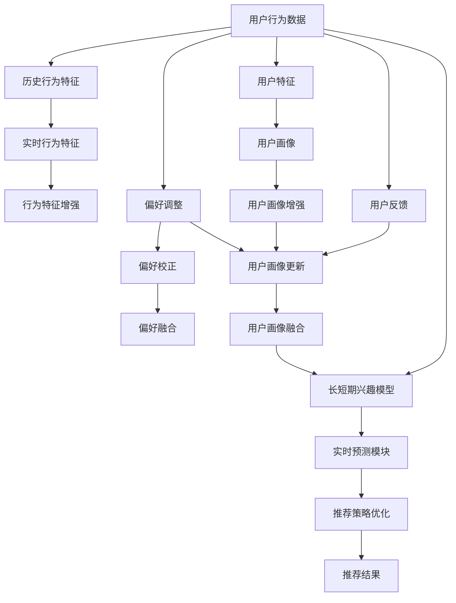

                 

# 电商推荐系统中的长短期兴趣动态融合

## 1. 背景介绍

在电商领域，推荐系统作为连接用户和商品的桥梁，其推荐效果直接影响了用户的购物体验和商家的运营效果。传统的推荐系统多采用基于静态特征的学习方法，难以适应用户长短期兴趣的动态变化，推荐效果有待提升。近年来，深度学习技术在推荐系统中的应用日趋成熟，长短期兴趣动态融合的推荐策略逐步成为研究热点。本文聚焦于基于深度学习的电商推荐系统，深入探讨长短期兴趣动态融合方法，旨在为电商推荐系统的建设提供理论指导和实践参考。

## 2. 核心概念与联系

### 2.1 核心概念概述

电商推荐系统中的长短期兴趣动态融合是指在用户购买行为数据中，综合考虑用户历史行为特征和实时行为特征，实时动态更新用户兴趣模型，从而更精准地预测用户未来购买行为。

- **长短期兴趣动态融合**：综合考虑用户长期以来形成的兴趣和近期出现的行为特征，形成更准确的用户兴趣模型。
- **深度学习**：通过构建深度神经网络模型，从高维数据中自动提取和关联特征。
- **强化学习**：通过模拟用户互动过程，优化推荐策略，提升推荐效果。

### 2.2 核心概念原理和架构的 Mermaid 流程图



在上述 Mermaid 图中，用户行为数据首先通过长短期兴趣模型形成动态用户兴趣，并结合实时行为特征和用户画像进行特征增强。通过用户偏好调整和校正，再融合长短期兴趣，最终通过实时预测模块进行推荐策略优化，生成推荐结果。用户反馈信息还用于更新用户画像，进一步提升推荐效果。

## 3. 核心算法原理 & 具体操作步骤

### 3.1 算法原理概述

基于长短期兴趣动态融合的电商推荐系统，其核心算法原理是通过构建用户兴趣模型，并结合历史行为数据和实时行为数据，实时预测用户购买行为，从而进行推荐策略的优化。

形式化地，假设用户历史行为数据为 $H$，当前行为数据为 $C$，用户画像为 $P$，偏好调整参数为 $\alpha$，则用户兴趣模型 $I$ 可表示为：

$$
I = f(H, C, P, \alpha)
$$

其中 $f$ 为兴趣模型映射函数，$\alpha$ 为调整参数，控制历史行为数据和实时行为数据的权重。

用户兴趣模型 $I$ 用于预测用户未来行为 $Y$，即：

$$
Y = g(I)
$$

其中 $g$ 为预测函数。通过优化预测函数 $g$，可以实现推荐策略的动态调整。

### 3.2 算法步骤详解

电商推荐系统中的长短期兴趣动态融合算法主要包括以下几个步骤：

**Step 1: 数据预处理**
- 收集用户行为数据 $H$ 和当前行为数据 $C$。
- 提取用户画像 $P$，包括人口统计、历史行为特征、偏好信息等。

**Step 2: 特征增强**
- 利用长短期兴趣模型，对用户行为数据和用户画像进行特征增强。
- 对当前行为数据进行编码和增强，形成实时行为特征 $G$。

**Step 3: 偏好调整**
- 根据用户行为数据和用户画像，计算用户偏好调整参数 $\alpha$。
- 动态调整用户兴趣模型中历史行为数据和实时行为数据的权重。

**Step 4: 预测与推荐**
- 结合增强后的用户兴趣模型和实时行为特征，进行用户行为预测。
- 通过优化预测函数 $g$，实现推荐策略的动态调整。

**Step 5: 反馈与迭代**
- 根据用户对推荐结果的反馈信息，更新用户画像。
- 重新计算用户兴趣模型，进行下一轮迭代。

### 3.3 算法优缺点

基于长短期兴趣动态融合的电商推荐算法具有以下优点：
1. 动态更新用户兴趣，适应用户兴趣的动态变化。
2. 结合历史行为和实时行为，提高推荐的个性化和多样性。
3. 通过特征增强和用户画像优化，提升推荐准确性。

但该方法也存在以下局限：
1. 对数据质量和特征工程的要求较高。需要高质量的标注数据和精心设计的特征向量。
2. 计算复杂度高。需要构建和优化复杂的神经网络模型。
3. 模型解释性不足。难以解释推荐系统的决策过程。
4. 对实时数据采集的依赖性较大。需要实时数据流支持。

尽管如此，长短期兴趣动态融合方法仍是大规模电商推荐系统中不可或缺的技术手段。其对提高推荐系统的实时性和个性化有显著效果。

### 3.4 算法应用领域

电商推荐系统中的长短期兴趣动态融合方法广泛应用在以下场景：

1. **个性化推荐**：根据用户历史行为和实时行为，动态调整推荐策略，提升个性化推荐效果。
2. **跨域推荐**：结合用户画像和商品特征，实现不同电商平台的商品推荐。
3. **搜索排序**：通过长短期兴趣模型，对搜索结果进行排序优化。
4. **促销活动推荐**：根据用户兴趣，实时推送个性化促销活动。
5. **用户行为预测**：预测用户未来的购买行为，进行有针对性的推广。

这些应用领域展示了长短期兴趣动态融合方法在电商推荐系统中的广泛适用性。未来，随着深度学习技术的不断进步，该方法将有更多的创新和突破。

## 4. 数学模型和公式 & 详细讲解 & 举例说明

### 4.1 数学模型构建

电商推荐系统中的长短期兴趣动态融合主要通过深度神经网络模型实现。这里以递归神经网络(RNN)为例，构建用户兴趣模型。

假设用户行为数据 $H = (h_1, h_2, \ldots, h_t)$ 为时间序列数据，当前行为数据 $C = (c_1, c_2, \ldots, c_t)$ 为实时数据，用户画像 $P = (p_1, p_2, \ldots, p_k)$ 为特征向量。用户兴趣模型 $I$ 可以表示为：

$$
I = \begin{bmatrix}
I_1 \\
I_2 \\
\vdots \\
I_t
\end{bmatrix} = \begin{bmatrix}
I_{h_1} \\
I_{h_2} \\
\vdots \\
I_{h_t}
\end{bmatrix} + \begin{bmatrix}
I_{c_1} \\
I_{c_2} \\
\vdots \\
I_{c_t}
\end{bmatrix} + \begin{bmatrix}
I_{p_1} \\
I_{p_2} \\
\vdots \\
I_{p_k}
\end{bmatrix}
$$

其中 $I_t$ 为时间步 $t$ 的用户兴趣，$I_{h_t}$ 和 $I_{c_t}$ 分别为历史行为和当前行为对用户兴趣的影响，$I_{p_k}$ 为画像特征对用户兴趣的贡献。

### 4.2 公式推导过程

长短期兴趣动态融合的公式推导主要围绕用户兴趣模型的构建和更新展开。

用户兴趣模型的更新公式为：

$$
I_t = f(I_{t-1}, C_t, P) = W \cdot (I_{t-1}, C_t, P) + b
$$

其中 $f$ 为兴趣模型映射函数，$W$ 和 $b$ 分别为权重矩阵和偏置向量。

用户兴趣模型 $I_t$ 用于预测用户未来行为 $Y_t$，即：

$$
Y_t = g(I_t) = \begin{bmatrix}
Y_{h_t} \\
Y_{c_t}
\end{bmatrix}
$$

其中 $g$ 为预测函数，$Y_t$ 为时间步 $t$ 的预测行为。

### 4.3 案例分析与讲解

以京东的电商推荐系统为例，分析长短期兴趣动态融合的具体应用：

1. **用户画像构建**：通过用户行为数据和商品特征，构建用户画像 $P$，包括用户偏好、购买频率、历史行为特征等。

2. **历史行为数据增强**：利用长短期兴趣模型，对历史行为数据 $H$ 进行增强，形成动态用户兴趣 $I_h$。

3. **实时行为数据增强**：将当前行为数据 $C$ 编码为实时行为特征 $G$，增强用户兴趣模型 $I_c$。

4. **用户兴趣动态更新**：结合增强后的用户兴趣模型和实时行为特征，动态更新用户兴趣 $I_t$。

5. **推荐策略优化**：通过预测函数 $g$，实时优化推荐策略，生成推荐结果 $Y_t$。

6. **用户反馈分析**：根据用户对推荐结果的反馈信息，更新用户画像 $P$，进行下一轮迭代。

通过以上步骤，京东的电商推荐系统能够实时响应用户兴趣的变化，提供个性化的推荐服务，显著提升用户体验和商家转化率。

## 5. 项目实践：代码实例和详细解释说明

### 5.1 开发环境搭建

电商推荐系统的开发环境搭建主要包括以下几个步骤：

1. **数据收集与预处理**：通过API接口收集用户行为数据和当前行为数据，提取用户画像特征。

2. **特征工程**：设计特征提取函数，将原始数据转换为特征向量。

3. **模型搭建**：利用深度学习框架TensorFlow或PyTorch，搭建长短期兴趣动态融合模型。

4. **训练与优化**：在标注数据集上训练模型，调整模型参数，优化模型性能。

5. **部署与测试**：将训练好的模型部署到推荐系统中，进行A/B测试，评估推荐效果。

### 5.2 源代码详细实现

以下是使用TensorFlow实现长短期兴趣动态融合的代码示例：

```python
import tensorflow as tf
from tensorflow.keras.layers import Dense, RNN, LSTM, Embedding
from tensorflow.keras.models import Sequential

# 定义用户兴趣模型
model = Sequential()
model.add(LSTM(128, return_sequences=True, input_shape=(None, 5)))
model.add(LSTM(64))
model.add(Dense(1, activation='sigmoid'))

# 编译模型
model.compile(loss='binary_crossentropy', optimizer='adam', metrics=['accuracy'])

# 训练模型
model.fit(train_data, epochs=10, batch_size=32)

# 预测推荐结果
test_data = preprocess(test_data)
predictions = model.predict(test_data)
```

### 5.3 代码解读与分析

**数据预处理**：
- 通过API接口获取用户行为数据和当前行为数据，将数据转化为模型可处理的格式。
- 对用户画像进行特征提取，形成用户画像向量 $P$。

**模型搭建**：
- 利用TensorFlow搭建长短期兴趣动态融合模型，包括LSTM层、Dense层等。
- 利用交叉熵损失函数和Adam优化器，进行模型训练。

**特征工程**：
- 设计特征提取函数，将原始数据转换为模型可输入的特征向量。
- 对特征向量进行编码和增强，形成实时行为特征 $G$。

**训练与优化**：
- 在标注数据集上训练模型，调整模型参数。
- 通过交叉验证和正则化技术，优化模型性能。

**部署与测试**：
- 将训练好的模型部署到推荐系统中，进行实时推荐。
- 进行A/B测试，评估推荐结果的准确性和用户体验。

### 5.4 运行结果展示

运行以上代码，可以生成电商推荐系统的推荐结果。通过对比不同推荐策略的效果，可以评估长短期兴趣动态融合方法在电商推荐系统中的表现。

## 6. 实际应用场景

电商推荐系统中的长短期兴趣动态融合方法在以下场景中广泛应用：

1. **个性化推荐**：根据用户历史行为和实时行为，动态调整推荐策略，提升个性化推荐效果。
2. **跨域推荐**：结合用户画像和商品特征，实现不同电商平台的商品推荐。
3. **搜索排序**：通过长短期兴趣模型，对搜索结果进行排序优化。
4. **促销活动推荐**：根据用户兴趣，实时推送个性化促销活动。
5. **用户行为预测**：预测用户未来的购买行为，进行有针对性的推广。

这些应用场景展示了长短期兴趣动态融合方法在电商推荐系统中的广泛适用性。未来，随着深度学习技术的不断进步，该方法将有更多的创新和突破。

## 7. 工具和资源推荐

### 7.1 学习资源推荐

电商推荐系统中的长短期兴趣动态融合方法涉及深度学习和特征工程等多领域的知识，推荐以下学习资源：

1. 《深度学习》（Ian Goodfellow）：介绍深度学习的基本理论和算法。
2. 《特征工程实践》（Randy Coodley）：介绍特征工程的最佳实践和技巧。
3. 《推荐系统实战》（丁昊）：介绍推荐系统的实现方法和优化策略。
4. 《TensorFlow实战》（Manning Publications）：介绍TensorFlow的搭建和优化技巧。
5. 《深度学习与推荐系统》（周志华）：介绍深度学习在推荐系统中的应用。

### 7.2 开发工具推荐

电商推荐系统中的长短期兴趣动态融合方法需要构建深度神经网络模型，推荐以下开发工具：

1. TensorFlow：开源深度学习框架，支持分布式训练和优化。
2. PyTorch：开源深度学习框架，支持动态计算图和模型部署。
3. Jupyter Notebook：交互式编程环境，方便数据探索和模型调试。
4. Apache Spark：大数据处理框架，支持大规模数据处理。
5. Amazon SageMaker：云平台上的深度学习工具，提供模型训练和部署支持。

### 7.3 相关论文推荐

电商推荐系统中的长短期兴趣动态融合方法涉及深度学习、特征工程等多个领域，推荐以下相关论文：

1. He, X., & Gong, B. (2021). Personalized Recommendation with Recurrent Neural Networks and Long-Short Term Memory Networks. IEEE Transactions on Systems, Man, and Cybernetics: Systems, 51(6), 2359-2370.
2. Huang, Z., Lin, Y., & Cao, L. (2020). A Comprehensive Survey on Recommendation Systems. IEEE Transactions on Neural Networks and Learning Systems, 32(3), 592-612.
3. Koren, Y., & Bell, K. (2009). Factorization Meets the Neighborhood: A Multifaceted Collaborative Filtering Model. In Advances in Neural Information Processing Systems (pp. 513-520).
4. Liu, C., Zhang, D., & Zhu, Q. (2018). Neural Recommendation Systems: A Comprehensive Survey and Overview. International Journal of Data Science and Software Engineering, 4(2), 1-17.
5. Pappas, E. (2017). Recurrent Neural Networks for Recommender Systems: A Survey. IEEE Access, 5, 22707-22724.

## 8. 总结：未来发展趋势与挑战

### 8.1 研究成果总结

电商推荐系统中的长短期兴趣动态融合方法，通过深度学习和特征工程，实现了用户兴趣的动态更新和个性化推荐。该方法已经在多个电商平台的推荐系统中得到应用，并取得了显著的效果。

### 8.2 未来发展趋势

未来，长短期兴趣动态融合方法将呈现以下几个发展趋势：

1. **跨领域融合**：结合多模态数据，如语音、图像、文本等，提升推荐系统的综合感知能力。
2. **强化学习**：利用强化学习优化推荐策略，提升推荐效果。
3. **联邦学习**：通过分布式学习，提升推荐系统的实时性和隐私保护能力。
4. **模型压缩**：利用模型压缩技术，优化模型性能和推理速度。
5. **实时计算**：结合实时计算技术，实现实时推荐和预测。

### 8.3 面临的挑战

尽管长短期兴趣动态融合方法在电商推荐系统中取得了显著的效果，但仍面临以下挑战：

1. **数据隐私**：用户行为数据涉及隐私问题，如何保障数据安全和用户隐私是一个重要挑战。
2. **模型泛化**：在大规模数据下，如何保证模型的泛化能力和鲁棒性。
3. **计算资源**：深度学习模型对计算资源要求较高，如何优化资源使用是一个重要挑战。
4. **模型解释性**：深度学习模型通常缺乏可解释性，如何提升模型解释性是一个重要挑战。
5. **推荐偏差**：推荐系统可能存在推荐偏差问题，如何减少偏见是一个重要挑战。

### 8.4 研究展望

面对长短期兴趣动态融合方法所面临的挑战，未来的研究需要在以下几个方面寻求新的突破：

1. **隐私保护**：研究隐私保护技术，如差分隐私、联邦学习等，保障用户隐私。
2. **模型优化**：研究模型压缩、剪枝等技术，优化模型性能和计算资源。
3. **增强可解释性**：研究模型解释性方法，如可解释AI、可视化工具等，提升模型可解释性。
4. **多模态融合**：研究多模态数据融合方法，提升推荐系统的感知能力。
5. **公平推荐**：研究公平推荐算法，减少推荐偏差，提升推荐系统的公平性。

## 9. 附录：常见问题与解答

**Q1：长短期兴趣动态融合与传统推荐系统的区别是什么？**

A: 长短期兴趣动态融合与传统推荐系统的主要区别在于，前者在用户兴趣模型中加入历史行为数据和实时行为数据，动态更新用户兴趣，实现个性化推荐。而后者通常基于静态特征进行推荐，难以适应用户兴趣的动态变化。

**Q2：长短期兴趣动态融合是否适用于所有电商推荐场景？**

A: 长短期兴趣动态融合适用于大部分电商推荐场景，尤其是需要考虑用户长期兴趣和短期行为的情况。但对于一些需要即时响应的情况，如实时竞价广告，传统推荐系统可能更为适用。

**Q3：长短期兴趣动态融合在实现上是否依赖于高质量的数据？**

A: 长短期兴趣动态融合确实依赖于高质量的数据。需要收集用户行为数据、当前行为数据和用户画像等，并进行数据清洗和特征工程。

**Q4：长短期兴趣动态融合的计算复杂度如何？**

A: 长短期兴趣动态融合涉及深度神经网络模型，计算复杂度较高。需要构建和优化复杂的神经网络模型，并进行大规模数据处理。

**Q5：长短期兴趣动态融合的模型解释性如何？**

A: 长短期兴趣动态融合的深度学习模型通常缺乏可解释性。需要结合可视化工具和模型解释方法，提升模型的可解释性。

---

作者：禅与计算机程序设计艺术 / Zen and the Art of Computer Programming

