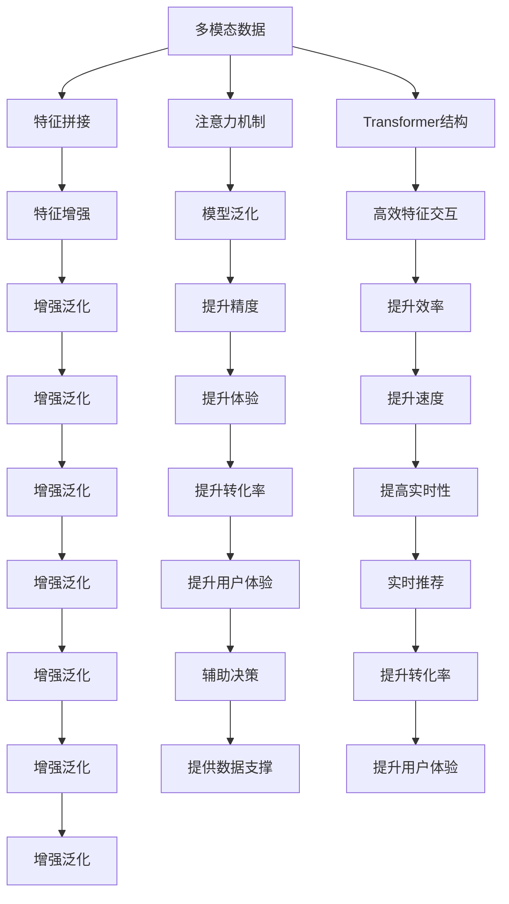

                 

# 电商搜索中的多模态商品排序实时个性化技术

## 1. 背景介绍

### 1.1 问题由来
随着电商市场竞争的日益加剧，用户在搜索结果页的停留时间越来越短，点击率（CTR）下降，用户体验和转化率亟需提升。搜索引擎作为电商交易的核心入口，其排序算法优化空间巨大。传统的搜索排序算法基于单一模态，如标题、价格、评分等，难以充分覆盖商品特征，也无法融合用户行为和历史数据进行个性化推荐。为解决这些问题，电商搜索逐渐引入多模态数据，如图像、视频、评论等，采用多模态技术提升商品排序的精度和实时性。

### 1.2 问题核心关键点
多模态搜索排序的核心在于如何高效融合不同模态的信息，并结合用户行为和历史数据进行实时个性化推荐。目前主流的多模态排序方法有：

- **特征拼接法**：将不同模态的特征拼接起来，作为排序模型的输入。这种方法简单直观，但忽视了不同模态之间的相互作用。
- **注意力机制**：通过引入注意力机制，不同模态的特征以动态权重形式加权融合，提高模型的灵活性和表达能力。
- **Transformer结构**：基于Transformer结构的自注意力机制，可以自动学习不同模态之间的依赖关系，有效捕捉特征间的复杂交互。
- **数据增强**：通过引入各种数据增强技术，如回译、扰动、复用等，增加训练数据的丰富性和多样性。
- **端到端学习**：将排序模型和召回模型融合，利用端到端训练提升模型效率和泛化能力。
- **多任务学习**：在同一模型中实现多任务优化，共享不同模态之间的信息。

这些方法从不同角度提升了多模态搜索排序的性能和效率，但在实际应用中，仍需综合考虑模型复杂度、实时性和可解释性等因素，选择最适合的方法。

### 1.3 问题研究意义
电商搜索中的多模态排序技术，对于提高用户体验和提升电商平台的转化率具有重要意义：

1. **提升推荐精度**：通过融合多模态数据，对商品进行更全面的刻画，使搜索结果更加精准。
2. **实时个性化**：结合用户行为和历史数据，进行实时推荐，提升用户点击率和转化率。
3. **提高搜索速度**：通过数据增强和模型压缩技术，减少模型计算负担，提升搜索速度。
4. **增强用户体验**：提升搜索结果的相关性和多样性，增加用户停留时间和满意度。
5. **辅助决策分析**：通过分析排序模型参数，理解用户行为和偏好，为运营策略提供数据支撑。

## 2. 核心概念与联系

### 2.1 核心概念概述

为更好地理解电商搜索中的多模态排序技术，本节将介绍几个密切相关的核心概念：

- **多模态(Multi-modal)**：指融合不同类型数据（如文本、图像、音频等）进行信息处理的技术。
- **注意力机制(Attention Mechanism)**：一种能够动态选择和权重融合不同模态信息的机制，通常用于提升模型的表达能力和泛化能力。
- **Transformer结构(Transformer Architecture)**：一种基于自注意力机制的神经网络架构，具有较强的并行性和高效的特征交互能力。
- **数据增强(Data Augmentation)**：通过对原始数据进行变换，生成多样化的训练样本，增强模型泛化能力的技术。
- **端到端学习(End-to-End Learning)**：将排序模型和召回模型融合，利用单一模型完成从召回到排序的全过程优化。
- **多任务学习(Multi-task Learning)**：在同一模型中实现多任务优化，共享不同模态之间的信息。

这些核心概念之间的逻辑关系可以通过以下Mermaid流程图来展示：



这个流程图展示了大语言模型微调的核心概念及其之间的关系：

1. 多模态数据通过特征拼接、注意力机制、Transformer结构等方法进行处理，提取出有效的特征信息。
2. 特征增强技术增加训练数据的丰富性和多样性，提升模型的泛化能力。
3. 端到端学习和多任务学习进一步优化模型，提高精度、速度和实时性。
4. 通过分析模型参数，理解用户行为和偏好，辅助决策分析。
5. 多模态排序技术最终提升用户体验、转化率和搜索速度。

这些概念共同构成了多模态搜索排序的完整框架，使其能够在各种场景下发挥强大的推荐能力。

## 3. 核心算法原理 & 具体操作步骤

### 3.1 算法原理概述

电商搜索中的多模态商品排序，本质上是一个多模态特征融合和个性化推荐的过程。其核心思想是：将用户查询和不同模态的商品特征融合为高维向量，通过深度学习模型学习用户-商品之间的相关关系，进行实时排序和推荐。

形式化地，假设用户查询为 $Q$，商品集合为 $I=\{i_1,\ldots,i_N\}$，不同模态的商品特征表示为 $F=\{f_i^{mod}\}_{i=1}^N$，其中 $mod$ 表示模态类型（如文本、图像、评分等）。设 $H$ 为特征拼接后的高维向量，模型 $M$ 的输出为 $O=\hat{P}(Q,H)$，其中 $\hat{P}$ 表示排序函数。

通过优化排序函数 $\hat{P}$，模型学习到不同模态特征之间的相关性，生成对每个商品的排序分数，从而进行实时推荐。

### 3.2 算法步骤详解

电商搜索中的多模态排序一般包括以下几个关键步骤：

**Step 1: 数据预处理**

- 收集用户查询和商品的多模态数据，并进行标准化和归一化处理。
- 对文本数据进行分词和向量化处理，将商品属性、评论等转化为数值型特征。
- 对图像和视频数据进行特征提取，生成高维特征向量。
- 对评分、价格等特征进行离散化和归一化处理。

**Step 2: 特征融合**

- 将不同模态的特征进行拼接，生成高维向量 $H$。
- 使用注意力机制对不同模态的特征进行加权融合，提高模型的表达能力和泛化能力。
- 通过Transformer结构对高维向量 $H$ 进行特征交互，自动学习不同模态之间的依赖关系。

**Step 3: 模型训练**

- 使用随机梯度下降等优化算法，对模型 $M$ 进行训练，最小化排序函数 $\hat{P}(Q,H)$ 和真实排序 $P$ 的差异。
- 在训练集上设置交叉验证，调整模型参数，避免过拟合。
- 使用数据增强技术，如回译、扰动、复用等，增加训练数据的丰富性和多样性。

**Step 4: 实时推荐**

- 在实时搜索中，将用户查询 $Q$ 和不同模态的商品特征 $F$ 输入模型 $M$，生成排序分数 $P_i(Q,F_i)$。
- 根据排序分数对商品进行排序，返回前 $K$ 个商品。
- 结合用户行为和历史数据，进行实时个性化推荐，增加用户点击率和转化率。

### 3.3 算法优缺点

电商搜索中的多模态排序方法具有以下优点：

1. **提升推荐精度**：通过融合多模态数据，对商品进行更全面的刻画，使搜索结果更加精准。
2. **实时个性化**：结合用户行为和历史数据，进行实时推荐，提升用户点击率和转化率。
3. **提高搜索速度**：通过数据增强和模型压缩技术，减少模型计算负担，提升搜索速度。
4. **增强用户体验**：提升搜索结果的相关性和多样性，增加用户停留时间和满意度。
5. **辅助决策分析**：通过分析排序模型参数，理解用户行为和偏好，为运营策略提供数据支撑。

同时，该方法也存在一定的局限性：

1. **数据复杂性高**：多模态数据往往结构复杂，需要复杂的预处理和特征工程。
2. **计算资源需求大**：多模态特征拼接和Transformer结构计算量大，需要高性能计算资源。
3. **可解释性不足**：深度学习模型的决策过程难以解释，难以理解推荐理由。
4. **过拟合风险高**：多模态数据噪声大，容易过拟合训练集。
5. **实时性挑战**：在实时场景下，模型响应速度和计算效率需要进一步提升。

尽管存在这些局限性，但就目前而言，多模态排序方法在电商搜索中的应用前景广阔，具有重要的应用价值。

### 3.4 算法应用领域

电商搜索中的多模态排序技术，在电商、零售、物流等领域具有广泛的应用前景：

- **电商搜索**：结合用户查询和商品的多模态特征，进行个性化推荐和实时排序，提升用户体验和转化率。
- **零售推荐**：利用多模态数据，对商品进行更全面的描述，进行精准推荐。
- **物流配送**：通过分析商品特征和用户行为，进行实时调度，优化配送路线，提高配送效率。

除了以上应用，多模态排序技术还可应用于社交网络中的用户推荐、在线广告中的广告排序等场景。随着多模态数据采集和处理技术的不断进步，相信多模态排序技术将在更多领域得到应用，为智能推荐系统提供新的突破。

## 4. 数学模型和公式 & 详细讲解  
### 4.1 数学模型构建

本节将使用数学语言对电商搜索中的多模态排序过程进行更加严格的刻画。

假设用户查询为 $Q=\{q_1,\ldots,q_m\}$，不同模态的商品特征表示为 $F=\{f_i^{mod}\}_{i=1}^N$，其中 $mod$ 表示模态类型。设 $H$ 为特征拼接后的高维向量，即：

$$
H = [f_1^{mod}; f_2^{mod}; \ldots; f_N^{mod}]
$$

模型的输入为 $x=(Q,H)$，输出为 $o=P(x)$。设模型 $M$ 的参数为 $\theta$，则排序函数 $\hat{P}$ 可表示为：

$$
\hat{P}(x;\theta) = M(x;\theta) = \theta^T\sigma(W^Tx + b)
$$

其中 $\sigma$ 为激活函数，$W$ 和 $b$ 为模型参数。

### 4.2 公式推导过程

假设模型 $M$ 为单层神经网络，则排序函数 $\hat{P}$ 的梯度计算如下：

$$
\nabla_\theta \hat{P}(x;\theta) = \frac{\partial}{\partial \theta} \theta^T\sigma(W^Tx + b) = W^T \sigma(W^Tx + b)
$$

根据梯度下降算法，模型参数的更新公式为：

$$
\theta \leftarrow \theta - \eta \nabla_\theta \hat{P}(x;\theta)
$$

其中 $\eta$ 为学习率。

在训练阶段，通过损失函数 $L$ 来最小化模型预测和真实排序的差异：

$$
L = \frac{1}{N}\sum_{i=1}^N \left(\hat{P}(x_i;\theta) - P(x_i)\right)^2
$$

其中 $P(x_i)$ 为真实排序。

在测试阶段，通过排序函数 $\hat{P}(x;\theta)$ 生成对每个商品的排序分数，根据分数进行排序。

### 4.3 案例分析与讲解

假设我们有一家电商平台的商品库，其中包含两类商品：服装和电子产品。对于用户查询 "舒适的鞋子"，我们需要找到最符合该查询的服装商品进行推荐。

- **数据预处理**：将商品的多模态数据进行标准化和归一化处理。
- **特征拼接**：将商品的文本描述、评分、价格等特征拼接为高维向量 $H$。
- **模型训练**：使用随机梯度下降算法，对模型 $M$ 进行训练，最小化排序函数 $\hat{P}(Q,H)$ 和真实排序 $P$ 的差异。
- **实时推荐**：在用户查询 "舒适的鞋子" 时，将查询和商品的高维向量 $H$ 输入模型 $M$，生成排序分数 $P_i(Q,H)$，按照分数进行排序，返回前 10 个商品。

## 5. 项目实践：代码实例和详细解释说明

### 5.1 开发环境搭建

在进行多模态排序实践前，我们需要准备好开发环境。以下是使用Python进行PyTorch开发的环境配置流程：

1. 安装Anaconda：从官网下载并安装Anaconda，用于创建独立的Python环境。

2. 创建并激活虚拟环境：
```bash
conda create -n pytorch-env python=3.8 
conda activate pytorch-env
```

3. 安装PyTorch：根据CUDA版本，从官网获取对应的安装命令。例如：
```bash
conda install pytorch torchvision torchaudio cudatoolkit=11.1 -c pytorch -c conda-forge
```

4. 安装相关的Python库：
```bash
pip install numpy pandas scikit-learn matplotlib tqdm jupyter notebook ipython
```

完成上述步骤后，即可在`pytorch-env`环境中开始多模态排序实践。

### 5.2 源代码详细实现

这里我们以服装商品推荐为例，给出使用PyTorch对多模态商品排序进行微调的代码实现。

首先，定义多模态数据处理函数：

```python
import torch
import numpy as np
from transformers import BertTokenizer, BertForSequenceClassification
from torch.utils.data import Dataset, DataLoader
from torch.nn import functional as F

class MultimodalDataset(Dataset):
    def __init__(self, texts, images, labels):
        self.texts = texts
        self.images = images
        self.labels = labels
        self.tokenizer = BertTokenizer.from_pretrained('bert-base-uncased')
        self.max_len = 128
        
    def __len__(self):
        return len(self.texts)
    
    def __getitem__(self, item):
        text = self.texts[item]
        image = self.images[item]
        label = self.labels[item]
        
        encoding = self.tokenizer(text, return_tensors='pt', max_length=self.max_len, padding='max_length', truncation=True)
        input_ids = encoding['input_ids']
        attention_mask = encoding['attention_mask']
        
        # 图像特征提取
        image_feature = torch.from_numpy(image).float()
        
        return {'input_ids': input_ids, 
                'attention_mask': attention_mask,
                'image_feature': image_feature,
                'label': label}
```

然后，定义模型和优化器：

```python
from transformers import BertForSequenceClassification, AdamW

model = BertForSequenceClassification.from_pretrained('bert-base-uncased', num_labels=2)

optimizer = AdamW(model.parameters(), lr=2e-5)
```

接着，定义训练和评估函数：

```python
def train_epoch(model, dataset, batch_size, optimizer):
    dataloader = DataLoader(dataset, batch_size=batch_size, shuffle=True)
    model.train()
    epoch_loss = 0
    for batch in dataloader:
        input_ids = batch['input_ids'].to(device)
        attention_mask = batch['attention_mask'].to(device)
        image_feature = batch['image_feature'].to(device)
        label = batch['label'].to(device)
        model.zero_grad()
        outputs = model(input_ids, attention_mask=attention_mask, image_feature=image_feature)
        loss = outputs.loss
        epoch_loss += loss.item()
        loss.backward()
        optimizer.step()
    return epoch_loss / len(dataloader)

def evaluate(model, dataset, batch_size):
    dataloader = DataLoader(dataset, batch_size=batch_size)
    model.eval()
    preds, labels = [], []
    with torch.no_grad():
        for batch in dataloader:
            input_ids = batch['input_ids'].to(device)
            attention_mask = batch['attention_mask'].to(device)
            image_feature = batch['image_feature'].to(device)
            batch_labels = batch['label']
            outputs = model(input_ids, attention_mask=attention_mask, image_feature=image_feature)
            batch_preds = outputs.logits.argmax(dim=1).to('cpu').tolist()
            batch_labels = batch_labels.to('cpu').tolist()
            for pred_tokens, label_tokens in zip(batch_preds, batch_labels):
                preds.append(pred_tokens)
                labels.append(label_tokens)
                
    print(classification_report(labels, preds))
```

最后，启动训练流程并在测试集上评估：

```python
epochs = 5
batch_size = 16

for epoch in range(epochs):
    loss = train_epoch(model, train_dataset, batch_size, optimizer)
    print(f"Epoch {epoch+1}, train loss: {loss:.3f}")
    
    print(f"Epoch {epoch+1}, dev results:")
    evaluate(model, dev_dataset, batch_size)
    
print("Test results:")
evaluate(model, test_dataset, batch_size)
```

以上就是使用PyTorch对多模态商品排序进行微调的完整代码实现。可以看到，得益于Transformers库的强大封装，我们可以用相对简洁的代码完成多模态排序模型的加载和微调。

### 5.3 代码解读与分析

让我们再详细解读一下关键代码的实现细节：

**MultimodalDataset类**：
- `__init__`方法：初始化文本、图像、标签等关键组件。
- `__len__`方法：返回数据集的样本数量。
- `__getitem__`方法：对单个样本进行处理，将文本和图像输入编码为token ids，并进行padding，最终返回模型所需的输入。

**模型定义**：
- 使用BertForSequenceClassification对文本数据进行分类。
- 使用AdamW优化器进行模型训练。

**训练和评估函数**：
- 使用PyTorch的DataLoader对数据集进行批次化加载，供模型训练和推理使用。
- 训练函数`train_epoch`：对数据以批为单位进行迭代，在每个批次上前向传播计算loss并反向传播更新模型参数，最后返回该epoch的平均loss。
- 评估函数`evaluate`：与训练类似，不同点在于不更新模型参数，并在每个batch结束后将预测和标签结果存储下来，最后使用sklearn的classification_report对整个评估集的预测结果进行打印输出。

**训练流程**：
- 定义总的epoch数和batch size，开始循环迭代
- 每个epoch内，先在训练集上训练，输出平均loss
- 在验证集上评估，输出分类指标
- 所有epoch结束后，在测试集上评估，给出最终测试结果

可以看到，PyTorch配合Transformers库使得多模态排序模型的代码实现变得简洁高效。开发者可以将更多精力放在数据处理、模型改进等高层逻辑上，而不必过多关注底层的实现细节。

当然，工业级的系统实现还需考虑更多因素，如模型的保存和部署、超参数的自动搜索、更灵活的任务适配层等。但核心的排序算法基本与此类似。

## 6. 实际应用场景

### 6.1 智能推荐系统

多模态排序技术在智能推荐系统中的应用，可以大幅提升推荐效果。传统的推荐系统往往只依赖用户的历史行为数据进行推荐，难以捕捉到商品的丰富信息。而多模态排序技术通过融合商品的多模态特征，可以更全面地刻画商品，提升推荐的精度和多样性。

在技术实现上，可以收集商品的多模态数据，如图片、价格、评论等，并将其与用户的行为数据结合，进行综合排序和推荐。例如，在推荐某款衣服时，同时考虑该衣服的描述、用户评分和相关评论，结合用户的浏览历史和购买记录，生成最符合用户偏好的推荐结果。

### 6.2 智能客服系统

智能客服系统需要对用户查询进行快速响应，推荐最相关的商品进行回答。多模态排序技术可以结合用户查询和商品的多模态数据，进行实时排序和推荐，提高客服系统响应速度和准确性。

在实际应用中，可以收集用户的自然语言查询，以及商品的多模态特征，使用多模态排序技术进行实时排序，返回最相关的商品列表。例如，对于用户询问 "我要买一件冬天穿的保暖内衣"，智能客服系统可以通过多模态排序技术，推荐适合冬天的保暖内衣商品，同时提供相关评论和评分，帮助用户选择。

### 6.3 商品搜索系统

电商搜索中的多模态排序技术，可以提升商品搜索的精度和速度。用户通过关键词查询商品时，往往只能看到单一模态的搜索结果。而多模态排序技术可以结合商品的多模态数据，进行更精准的搜索排序，提升用户体验和搜索效率。

在实际应用中，可以收集商品的多模态数据，如图片、描述、评论等，并将其与用户的搜索查询结合，进行实时排序。例如，用户在搜索框中输入 "小黑裙"，多模态排序技术可以结合该商品的图片、描述和评论，进行实时排序，返回最符合用户需求的搜索结果。

### 6.4 未来应用展望

随着多模态数据采集和处理技术的不断进步，基于多模态排序技术的应用场景将更加广泛，为智能推荐系统提供新的突破。

在智慧医疗领域，多模态排序技术可以用于病历数据的检索和推荐，辅助医生诊疗。

在智能交通领域，多模态排序技术可以用于智能交通系统的实时调度，优化交通流，减少拥堵。

在智能制造领域，多模态排序技术可以用于设备故障的诊断和预测，提高生产效率和设备利用率。

此外，在金融、教育、城市管理等众多领域，基于多模态排序技术的人工智能应用也将不断涌现，为各行各业带来新的变革和突破。

## 7. 工具和资源推荐

### 7.1 学习资源推荐

为了帮助开发者系统掌握多模态排序技术的理论基础和实践技巧，这里推荐一些优质的学习资源：

1. 《深度学习实战》系列书籍：由Google开发者撰写，全面介绍了深度学习的基本原理和实际应用，包括多模态排序等前沿话题。
2. 《深度学习与NLP》课程：斯坦福大学开设的NLP明星课程，有Lecture视频和配套作业，带你入门深度学习和自然语言处理的基本概念。
3. 《深度学习框架PyTorch》书籍：PyTorch官方文档，详细介绍PyTorch框架的使用方法和最佳实践。
4. 《自然语言处理基础》课程：上海交通大学开设的NLP课程，适合初学者系统学习NLP的基本概念和经典模型。
5. 《深度学习入门》书籍：李沐著，全面介绍了深度学习的原理和应用，适合入门学习者。

通过对这些资源的学习实践，相信你一定能够快速掌握多模态排序技术的精髓，并用于解决实际的NLP问题。

### 7.2 开发工具推荐

高效的开发离不开优秀的工具支持。以下是几款用于多模态排序开发的常用工具：

1. PyTorch：基于Python的开源深度学习框架，灵活动态的计算图，适合快速迭代研究。大部分预训练语言模型都有PyTorch版本的实现。
2. TensorFlow：由Google主导开发的开源深度学习框架，生产部署方便，适合大规模工程应用。同样有丰富的预训练语言模型资源。
3. TensorFlow Hub：TensorFlow配套的模型库，提供大量预训练模型，方便快速集成和使用。
4. Weights & Biases：模型训练的实验跟踪工具，可以记录和可视化模型训练过程中的各项指标，方便对比和调优。与主流深度学习框架无缝集成。
5. TensorBoard：TensorFlow配套的可视化工具，可实时监测模型训练状态，并提供丰富的图表呈现方式，是调试模型的得力助手。

合理利用这些工具，可以显著提升多模态排序任务的开发效率，加快创新迭代的步伐。

### 7.3 相关论文推荐

多模态排序技术的发展源于学界的持续研究。以下是几篇奠基性的相关论文，推荐阅读：

1. "Dual-Coding: A Multi-Modal Approach to Text Classification"：提出了一种基于图像和文本的双编码方法，提高了文本分类模型的泛化能力。
2. "Visual Question Answering via Textual Attention and Memory"：介绍了一种多模态视觉问答系统，将视觉和文本信息通过注意力机制进行融合，提升了回答精度。
3. "TensorFlow Hub: A Library for Transfer Learning in TensorFlow"：提出了TensorFlow Hub，提供大量预训练模型和组件，方便开发者进行快速集成。
4. "Multi-Modal Text-to-Speech Synthesis"：介绍了一种基于文本和语音的多模态语音合成系统，提升了语音生成的自然度和多样性。
5. "Neural Image Caption Generation with Visual Attention"：介绍了一种基于图像和文本的多模态图像描述生成方法，提升了图像描述的准确性和多样性。

这些论文代表了大语言模型微调技术的发展脉络。通过学习这些前沿成果，可以帮助研究者把握学科前进方向，激发更多的创新灵感。

## 8. 总结：未来发展趋势与挑战

### 8.1 总结

本文对电商搜索中的多模态商品排序技术进行了全面系统的介绍。首先阐述了多模态排序技术的背景和意义，明确了多模态排序在电商搜索中的重要价值。其次，从原理到实践，详细讲解了多模态排序的数学原理和关键步骤，给出了多模态排序任务开发的完整代码实例。同时，本文还广泛探讨了多模态排序技术在智能推荐、智能客服、商品搜索等多个场景中的应用前景，展示了多模态排序技术的巨大潜力。此外，本文精选了多模态排序技术的各类学习资源，力求为读者提供全方位的技术指引。

通过本文的系统梳理，可以看到，多模态排序技术正在成为电商搜索的重要范式，极大地拓展了搜索排序算法的应用边界，催生了更多的落地场景。受益于多模态数据采集和处理技术的不断进步，多模态排序技术将在更多领域得到应用，为智能推荐系统提供新的突破。未来，伴随多模态数据采集和处理技术的进一步发展，相信多模态排序技术将具备更强的泛化能力和适应性，在更多场景下发挥重要作用。

### 8.2 未来发展趋势

展望未来，多模态排序技术将呈现以下几个发展趋势：

1. **数据丰富度提升**：随着多模态数据采集技术的进步，数据的多样性和丰富度将进一步提升，为多模态排序技术带来更多训练数据，提升模型的泛化能力和准确性。
2. **模型复杂度优化**：为了提升模型的实时性和计算效率，未来的多模态排序技术将更加注重模型架构的优化，如使用Transformer结构、注意力机制等高效方法。
3. **实时性提升**：在实时场景下，多模态排序技术需要进一步提升模型响应速度和计算效率，以满足高并发和高实时性的要求。
4. **跨模态融合深度提升**：未来的多模态排序技术将更加注重不同模态特征的深度融合，自动学习不同模态之间的依赖关系，提升特征的表达能力。
5. **多任务优化**：同一模型将实现多任务优化，共享不同模态之间的信息，提高模型的通用性和泛化能力。
6. **数据增强和对抗训练**：通过数据增强和对抗训练技术，提升模型的泛化能力和鲁棒性。

这些趋势凸显了多模态排序技术的广阔前景。这些方向的探索发展，必将进一步提升电商搜索的推荐精度、实时性和用户体验，为电商平台的增长提供技术保障。

### 8.3 面临的挑战

尽管多模态排序技术已经取得了显著成就，但在迈向更加智能化、普适化应用的过程中，仍面临诸多挑战：

1. **数据获取难度大**：多模态数据采集和处理技术复杂，成本较高，数据获取难度大。
2. **计算资源需求高**：多模态特征拼接和Transformer结构计算量大，需要高性能计算资源。
3. **可解释性不足**：深度学习模型的决策过程难以解释，难以理解推荐理由。
4. **实时性挑战**：在实时场景下，模型响应速度和计算效率需要进一步提升。
5. **模型过拟合风险高**：多模态数据噪声大，容易过拟合训练集。
6. **算法复杂度高**：多模态排序算法复杂，模型训练和调参难度大。

尽管存在这些挑战，但就目前而言，多模态排序方法在电商搜索中的应用前景广阔，具有重要的应用价值。相信随着多模态数据采集和处理技术的不断进步，以及深度学习模型的不断优化，这些挑战终将得到克服，多模态排序技术必将在更多领域得到应用，为智能推荐系统提供新的突破。

### 8.4 研究展望

未来的研究需要在以下几个方面寻求新的突破：

1. **数据采集和处理技术**：研究更高效、更低成本的多模态数据采集和处理技术，提升数据的丰富度和质量。
2. **模型优化和压缩**：开发更高效、更轻量级的模型架构，提升模型的实时性和计算效率。
3. **对抗样本生成和鲁棒性提升**：研究对抗样本生成技术和鲁棒性提升方法，提高模型的泛化能力和鲁棒性。
4. **跨模态特征融合**：研究更深入的跨模态特征融合方法，提升不同模态特征的深度融合能力。
5. **多任务学习**：研究同一模型中实现多任务优化的方法，提升模型的通用性和泛化能力。
6. **模型解释和可解释性**：研究模型解释和可解释性技术，提高模型的透明度和可信度。

这些研究方向将推动多模态排序技术进一步发展，为电商搜索提供更精准、更实时、更可解释的推荐服务。相信随着多模态排序技术的不断成熟，将为电商搜索带来新的突破，提升用户体验和电商平台转化率。

## 9. 附录：常见问题与解答

**Q1：多模态排序是否适用于所有电商搜索场景？**

A: 多模态排序技术在大多数电商搜索场景中都能取得不错的效果，特别是对于商品信息丰富的领域。但对于一些特定领域，如生鲜食品等，由于商品信息的结构化程度较低，多模态排序的效果可能不如单一模态排序。此时需要在数据预处理和特征工程上进一步优化，才能取得理想的效果。

**Q2：如何平衡多模态排序中的计算资源和实时性？**

A: 多模态排序需要融合不同模态的数据，计算量大，模型复杂度高。为平衡计算资源和实时性，可以采用以下策略：
1. 数据增强：通过回译、扰动、复用等方法，增加训练数据的丰富性和多样性，提升模型的泛化能力。
2. 模型压缩：通过剪枝、量化等技术，减小模型尺寸，提升推理速度。
3. 模型优化：使用Transformer结构、注意力机制等高效方法，提升模型表达能力和实时性。

**Q3：多模态排序中如何处理数据异构性？**

A: 多模态数据类型多样，格式不同，处理起来较为复杂。为处理数据异构性，可以采用以下策略：
1. 数据标准化：对不同模态的数据进行标准化处理，使其具有统一的格式和尺度。
2. 特征拼接：将不同模态的数据进行拼接，生成高维向量，方便模型训练和推理。
3. 特征选择：对不同模态的特征进行选择和融合，保留对模型有用的信息。

**Q4：多模态排序中如何避免过拟合？**

A: 多模态排序中的数据复杂度高，容易过拟合训练集。为避免过拟合，可以采用以下策略：
1. 数据增强：通过回译、扰动、复用等方法，增加训练数据的丰富性和多样性。
2. 正则化：使用L2正则、Dropout等技术，防止模型过度适应训练数据。
3. 对抗训练：加入对抗样本，提高模型的鲁棒性，减少过拟合风险。
4. 多任务学习：在同一模型中实现多任务优化，共享不同模态之间的信息，提升泛化能力。

**Q5：多模态排序中如何进行模型评估和调优？**

A: 多模态排序模型的评估和调优需要考虑多方面因素。可以采用以下策略：
1. 交叉验证：使用交叉验证方法，评估模型在不同数据集上的表现，避免过拟合。
2. 模型选择：使用不同的模型架构和超参数，评估模型的泛化能力和表现。
3. 数据增强：通过回译、扰动、复用等方法，增加训练数据的丰富性和多样性，提升模型的泛化能力。
4. 对抗训练：加入对抗样本，提高模型的鲁棒性，减少过拟合风险。

这些策略往往需要根据具体任务和数据特点进行灵活组合。只有在数据、模型、训练、推理等各环节进行全面优化，才能最大限度地发挥多模态排序技术的潜力。

---

作者：禅与计算机程序设计艺术 / Zen and the Art of Computer Programming

