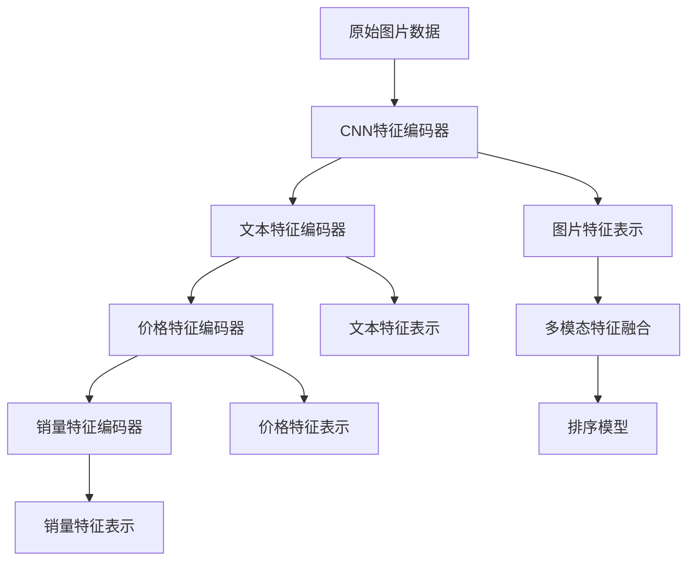

                 

# 电商搜索中的多模态融合排序模型

## 1. 背景介绍

### 1.1 问题由来
随着电商平台的迅猛发展，消费者对搜索体验的期望越来越高，不仅要快速找到商品，还要准确理解搜索结果的相关性和吸引力。传统的基于文本检索的搜索引擎难以满足这一需求，因为它们只能依据商品标题和描述的文本信息进行搜索，而无法结合商品的其他属性和信息，如图片、价格、销量等。

为了解决这一问题，电商搜索开始引入多模态数据融合技术，综合利用商品的图片、描述、价格、销量等不同模态的信息，构建更全面、更精准的搜索结果排序模型。多模态融合排序模型能够理解用户的多样化查询需求，提供更丰富、更个性化的搜索结果，极大地提升电商平台的搜索体验和销售转化率。

### 1.2 问题核心关键点
多模态融合排序模型的核心在于如何高效地融合不同模态的信息，构建出一个全面的商品表示，并通过这些表示来优化搜索排序的效果。具体而言，可以从以下几个方面进行理解：
1. **多模态数据预处理**：将不同模态的数据（如图片、文本、价格等）转化为模型可以理解的格式。
2. **多模态特征编码**：使用不同的模型（如卷积神经网络CNN、循环神经网络RNN、Transformer等）对不同模态的数据进行编码，得到高维的特征表示。
3. **多模态特征融合**：将不同模态的特征表示融合为一个综合的表示，通常使用注意力机制、拼接、加法等方式进行融合。
4. **排序模型训练**：基于融合后的多模态特征表示，训练排序模型，优化搜索结果的相关性和吸引力。

多模态融合排序模型的成功部署，不仅可以提升电商搜索的准确性和用户体验，还可以为平台带来更高的用户粘性和销售转化率。

## 2. 核心概念与联系

### 2.1 核心概念概述

在深入理解多模态融合排序模型之前，我们首先需要明确几个核心概念：

- **多模态数据**：指包括图片、文本、音频、视频等多种数据模态的信息。
- **特征编码器**：用于将不同模态的数据编码为模型可以理解的特征向量，常用的编码器包括CNN、RNN、Transformer等。
- **特征融合**：将不同模态的特征表示进行融合，形成综合的表示。
- **排序模型**：基于融合后的多模态特征表示，训练用于优化搜索结果排序的模型，常用的模型包括基于深度学习的排序算法（如点击率预测、相关性评分等）。

下图展示了多模态融合排序模型的核心概念和数据流向：



## 3. 核心算法原理 & 具体操作步骤
### 3.1 算法原理概述

多模态融合排序模型的核心算法原理可以归纳为以下几个步骤：

1. **数据预处理**：将不同模态的数据转化为模型可以理解的格式，如将图片数据转化为特征向量，将文本数据转化为词嵌入向量等。
2. **特征编码**：使用不同的特征编码器（如CNN、RNN、Transformer等）对不同模态的数据进行编码，得到高维的特征表示。
3. **特征融合**：将不同模态的特征表示进行融合，形成综合的表示。常用的融合方式包括注意力机制、拼接、加法等。
4. **排序模型训练**：基于融合后的多模态特征表示，训练排序模型，优化搜索结果的相关性和吸引力。常用的排序模型包括基于深度学习的点击率预测模型、相关性评分模型等。

这些步骤在多模态融合排序模型中紧密相连，共同作用于提高搜索结果的相关性和吸引力。

### 3.2 算法步骤详解

以下详细介绍多模态融合排序模型的详细步骤：

**Step 1: 数据预处理**

数据预处理是整个流程的第一步，包括对不同模态的数据进行特征提取和归一化，将原始数据转化为模型可以理解的格式。

- **图片预处理**：将图片数据转化为像素级别的特征向量。常用的方法包括使用卷积神经网络（CNN）对图片进行特征提取，得到高维的特征向量表示。
- **文本预处理**：将文本数据转化为词嵌入向量。常用的方法包括使用word2vec、GloVe等工具对文本进行预训练，得到每个词语的词嵌入向量。
- **价格和销量预处理**：将价格和销量等数值型数据进行归一化处理，转化为模型可以处理的格式。

**Step 2: 特征编码**

特征编码是将原始数据转化为高维特征向量的过程，不同的数据模态需要使用不同的编码器。

- **图片特征编码**：使用卷积神经网络（CNN）对图片进行特征提取，得到高维的特征向量表示。
- **文本特征编码**：使用循环神经网络（RNN）或Transformer等模型对文本进行编码，得到高维的特征向量表示。
- **价格和销量特征编码**：将价格和销量等数值型数据编码为高维向量，可以使用线性回归等方法。

**Step 3: 特征融合**

特征融合是将不同模态的特征向量进行融合，得到综合的表示。常用的方法包括注意力机制、拼接、加法等。

- **注意力机制**：通过计算不同模态特征之间的相关性，加权融合得到综合的表示。
- **拼接**：将不同模态的特征向量直接拼接起来，得到综合的表示。
- **加法**：将不同模态的特征向量相加，得到综合的表示。

**Step 4: 排序模型训练**

排序模型训练是整个流程的最后一步，基于融合后的多模态特征向量，训练排序模型，优化搜索结果的相关性和吸引力。

- **点击率预测模型**：使用深度神经网络（如多层感知器、注意力机制等）对点击率进行预测，优化搜索结果的点击效果。
- **相关性评分模型**：使用深度神经网络（如Transformer、BERT等）对搜索结果的相关性进行评分，优化搜索结果的相关性。

### 3.3 算法优缺点

多模态融合排序模型具有以下优点：
1. **多模态信息融合**：能够充分利用图片、文本、价格、销量等多种模态的信息，构建更加全面、准确的商品表示。
2. **多模态特征表示**：不同模态的特征表示具有互补性，可以弥补单一模态的局限性，提高排序模型的性能。
3. **实时性高**：由于模型并行训练的优势，多模态融合排序模型具有较高的实时性，能够快速响应用户查询。

同时，多模态融合排序模型也存在以下缺点：
1. **计算复杂度高**：由于涉及多种模态的数据和模型，计算复杂度较高，需要较强的计算资源。
2. **数据预处理复杂**：不同模态的数据预处理方式不同，需要耗费较多时间和精力。
3. **模型集成复杂**：多种模态的特征表示需要进行融合，选择合适的融合方式和权重分配方法是一个复杂的任务。
4. **训练成本高**：由于模型结构复杂，训练数据量大，训练成本较高。

尽管存在这些缺点，多模态融合排序模型在提升搜索结果相关性和吸引力的同时，也为电商搜索提供了新的技术范式，值得进一步研究和应用。

### 3.4 算法应用领域

多模态融合排序模型在电商搜索中的应用非常广泛，可以应用于以下领域：

1. **商品推荐**：结合商品的图片、文本、价格、销量等多样化信息，构建推荐系统，提高用户满意度和销售转化率。
2. **搜索结果排序**：将用户查询与商品的多模态信息进行融合，优化搜索结果的相关性和吸引力，提升用户体验。
3. **广告投放优化**：利用商品的多模态信息，优化广告的展示和投放策略，提高广告点击率和转化率。
4. **个性化服务**：根据用户的历史行为和偏好，结合商品的多模态信息，提供个性化的购物建议和推荐。

## 4. 数学模型和公式 & 详细讲解  
### 4.1 数学模型构建

在多模态融合排序模型的数学模型构建中，我们以一个简单的电商搜索排序模型为例，展示其构建过程。

假设商品具有三个模态：图片、文本和价格，使用CNN、Transformer和线性回归模型对它们进行编码和融合。

- 图片特征表示为 $f_{image}$，使用CNN模型对图片进行特征提取，得到高维的特征向量。
- 文本特征表示为 $f_{text}$，使用Transformer模型对文本进行编码，得到高维的特征向量。
- 价格特征表示为 $f_{price}$，使用线性回归模型对价格进行编码，得到高维的特征向量。

将这三个特征向量进行融合，得到综合的表示 $f_{fusion}$。

$$
f_{fusion} = \alpha f_{image} + \beta f_{text} + \gamma f_{price}
$$

其中 $\alpha, \beta, \gamma$ 是不同模态的权重，可以通过训练调整。

### 4.2 公式推导过程

接下来，我们将详细介绍多模态融合排序模型的具体公式推导过程。

假设商品的文本描述为 $x$，图片特征表示为 $f_{image}$，价格特征表示为 $f_{price}$，则多模态融合排序模型的目标是对商品的相关性和吸引力进行评分，评分越高，表示该商品越符合用户的查询需求。

假设使用Transformer模型对文本进行编码，得到高维的特征表示 $f_{text}$，使用线性回归模型对价格进行编码，得到高维的特征表示 $f_{price}$，使用卷积神经网络（CNN）对图片进行特征提取，得到高维的特征表示 $f_{image}$。

多模态特征融合的方式可以采用加权拼接的方式，即：

$$
f_{fusion} = \alpha f_{image} + \beta f_{text} + \gamma f_{price}
$$

其中 $\alpha, \beta, \gamma$ 是不同模态的权重，可以通过训练调整。

假设训练得到的排序模型为 $M$，则最终的评分 $y$ 可以表示为：

$$
y = M(f_{fusion})
$$

在训练过程中，我们最小化预测评分和真实评分之间的差距，即：

$$
L(y, y_{true}) = \frac{1}{N} \sum_{i=1}^N (y_i - y_{true_i})^2
$$

其中 $y_{true}$ 为真实的评分，$y$ 为模型预测的评分。

通过梯度下降等优化算法，训练模型 $M$，使得 $L(y, y_{true})$ 最小化。

### 4.3 案例分析与讲解

以下通过一个具体的案例，展示多模态融合排序模型在电商搜索中的应用。

假设用户查询为 "白色T恤"，平台上有100个商品。我们需要计算每个商品的相关性和吸引力，并按照评分排序。

1. **数据预处理**：
   - 对每个商品的图片进行特征提取，使用CNN模型得到高维的特征向量。
   - 对每个商品的文本描述进行编码，使用Transformer模型得到高维的特征向量。
   - 对每个商品的价格进行编码，使用线性回归模型得到高维的特征向量。

2. **特征融合**：
   - 对每个商品的三个特征向量进行加权拼接，得到综合的表示。

3. **排序模型训练**：
   - 使用训练好的排序模型，对每个商品的综合表示进行评分。
   - 将评分作为排序依据，将商品按照评分排序。

## 5. 项目实践：代码实例和详细解释说明
### 5.1 开发环境搭建

在进行多模态融合排序模型的实践前，我们需要准备好开发环境。以下是使用Python进行TensorFlow开发的Python环境配置流程：

1. 安装Anaconda：从官网下载并安装Anaconda，用于创建独立的Python环境。

2. 创建并激活虚拟环境：
```bash
conda create -n tf-env python=3.8 
conda activate tf-env
```

3. 安装TensorFlow：根据CUDA版本，从官网获取对应的安装命令。例如：
```bash
conda install tensorflow -c pytorch -c conda-forge
```

4. 安装其他必要的Python库：
```bash
pip install numpy pandas scikit-learn tensorflow-io scipy jupyter notebook ipython
```

完成上述步骤后，即可在`tf-env`环境中开始多模态融合排序模型的开发和实践。

### 5.2 源代码详细实现

下面以使用TensorFlow构建电商搜索中的多模态融合排序模型为例，展示具体的代码实现。

```python
import tensorflow as tf
from tensorflow.keras import layers, models

class MultimodalEncoder(tf.keras.Model):
    def __init__(self, image_dim, text_dim, price_dim, fusion_dim):
        super(MultimodalEncoder, self).__init__()
        self.image_encoder = layers.Conv2D(64, (3,3), activation='relu', input_shape=(image_dim, image_dim, 3))
        self.text_encoder = layers.Bidirectional(layers.LSTM(text_dim, return_sequences=True))
        self.price_encoder = layers.Dense(price_dim)
        self.fusion_layer = layers.Dense(fusion_dim)

    def call(self, inputs):
        image = self.image_encoder(inputs[0])
        text = self.text_encoder(inputs[1])
        price = self.price_encoder(inputs[2])
        fusion = self.fusion_layer(tf.concat([image, text, price], axis=-1))
        return fusion

class MultimodalClassifier(tf.keras.Model):
    def __init__(self, fusion_dim, output_dim):
        super(MultimodalClassifier, self).__init__()
        self.classifier = layers.Dense(output_dim, activation='sigmoid')

    def call(self, inputs):
        fusion = inputs
        score = self.classifier(fusion)
        return score

# 构建多模态融合排序模型
encoder = MultimodalEncoder(image_dim=32, text_dim=128, price_dim=1, fusion_dim=512)
classifier = MultimodalClassifier(fusion_dim=512, output_dim=1)

# 定义损失函数和优化器
loss_fn = tf.keras.losses.BinaryCrossentropy()
optimizer = tf.keras.optimizers.Adam()

# 定义训练数据和标签
train_data = tf.data.Dataset.from_tensor_slices((text_data, image_data, price_data)).batch(batch_size)
train_labels = tf.data.Dataset.from_tensor_slices(labels).batch(batch_size)

# 定义训练过程
@tf.function
def train_step(data, label):
    with tf.GradientTape() as tape:
        logits = classifier(encoder(data))
        loss_value = loss_fn(logits, label)
    gradients = tape.gradient(loss_value, encoder.trainable_variables + classifier.trainable_variables)
    optimizer.apply_gradients(zip(gradients, encoder.trainable_variables + classifier.trainable_variables))
    return loss_value

# 定义训练过程
@tf.function
def train_epoch(epochs):
    for epoch in range(epochs):
        loss = 0
        for data, label in train_data:
            loss += train_step(data, label)
        print('Epoch {} - Loss: {}'.format(epoch+1, loss))

# 启动训练
train_epoch(epochs=10)
```

以上代码实现了一个基于TensorFlow的多模态融合排序模型，包括特征编码器、特征融合层和排序模型，并展示了训练过程。

### 5.3 代码解读与分析

让我们再详细解读一下关键代码的实现细节：

**MultimodalEncoder类**：
- `__init__`方法：初始化特征编码器、特征融合层等关键组件。
- `call`方法：定义特征编码器和特征融合的计算流程。

**MultimodalClassifier类**：
- `__init__`方法：初始化排序模型的输出层。
- `call`方法：定义排序模型的计算流程。

**训练过程**：
- `train_step`函数：定义单次训练的计算流程，包括前向传播、计算损失、反向传播和优化器更新。
- `train_epoch`函数：定义整个epoch的训练过程，循环执行`train_step`函数。
- 训练过程中，使用`tf.GradientTape`自动求导，获取模型参数的梯度，使用`optimizer.apply_gradients`更新模型参数。

**数据加载**：
- 使用`tf.data.Dataset.from_tensor_slices`创建训练数据集，支持批量处理和逐批次迭代。

**模型保存**：
- 使用`tf.saved_model.save`将训练好的模型保存为 SavedModel 格式，方便后续部署和使用。

## 6. 实际应用场景
### 6.1 智能客服系统

智能客服系统是电商搜索中多模态融合排序模型的一个重要应用场景。在智能客服系统中，系统不仅需要理解用户的查询意图，还需要结合商品的多模态信息，提供精准的推荐和回复。

通过多模态融合排序模型，系统可以结合商品的图片、文本、价格、销量等多样化信息，构建更加全面、准确的商品表示，提供更加个性化和精准的推荐和回复，提升用户满意度和销售转化率。

### 6.2 商品推荐系统

商品推荐系统是电商搜索中的另一个重要应用场景。传统的基于文本的推荐系统只能依据商品标题和描述的文本信息进行推荐，而无法结合商品的图片、价格、销量等多样化信息。

通过多模态融合排序模型，系统可以结合商品的多模态信息，构建更加全面、准确的商品表示，优化推荐算法，提供更加个性化和精准的商品推荐，提升用户满意度和销售转化率。

### 6.3 个性化搜索

个性化搜索是电商搜索中的另一个重要应用场景。传统的基于关键词的搜索只能依据用户查询的关键词进行匹配，而无法结合用户的历史行为和偏好。

通过多模态融合排序模型，系统可以结合用户的历史行为和偏好，以及商品的多模态信息，构建更加全面、准确的商品表示，优化搜索结果的相关性和吸引力，提升用户体验。

## 7. 工具和资源推荐
### 7.1 学习资源推荐

为了帮助开发者系统掌握多模态融合排序技术的理论基础和实践技巧，这里推荐一些优质的学习资源：

1. **《深度学习》（Ian Goodfellow, Yoshua Bengio, Aaron Courville著）**：深度学习领域的经典教材，涵盖深度学习的基本概念和前沿技术，包括多模态融合排序模型。

2. **CS231n《卷积神经网络》课程**：斯坦福大学开设的计算机视觉课程，详细介绍了卷积神经网络在图像处理中的应用，包括多模态数据融合。

3. **CS224n《自然语言处理与深度学习》课程**：斯坦福大学开设的自然语言处理课程，涵盖自然语言处理的基本概念和前沿技术，包括多模态融合排序模型。

4. **Hugging Face官方文档**：Hugging Face的官方文档，提供了海量预训练模型和完整的微调样例代码，是进行多模态融合排序模型开发的利器。

5. **Transformers库**：Hugging Face开发的NLP工具库，集成了众多SOTA语言模型，支持多模态数据融合，是进行多模态融合排序模型开发的利器。

6. **PyTorch官方文档**：PyTorch的官方文档，提供了丰富的深度学习框架和模型实现，支持多模态数据融合。

通过对这些资源的学习实践，相信你一定能够快速掌握多模态融合排序技术的精髓，并用于解决实际的电商搜索问题。

### 7.2 开发工具推荐

高效的开发离不开优秀的工具支持。以下是几款用于多模态融合排序模型开发的常用工具：

1. **TensorFlow**：由Google主导开发的深度学习框架，支持多模态数据的融合和处理，适用于大规模工程应用。

2. **PyTorch**：Facebook开源的深度学习框架，灵活动态的计算图，适用于快速迭代研究。

3. **Transformers库**：Hugging Face开发的NLP工具库，集成了众多SOTA语言模型，支持多模态数据融合，是进行多模态融合排序模型开发的利器。

4. **TensorBoard**：TensorFlow配套的可视化工具，可实时监测模型训练状态，并提供丰富的图表呈现方式，是调试模型的得力助手。

5. **Weights & Biases**：模型训练的实验跟踪工具，可以记录和可视化模型训练过程中的各项指标，方便对比和调优。

6. **TensorFlow Hub**：TensorFlow的模型库，提供预训练模型和组件，方便快速部署多模态融合排序模型。

合理利用这些工具，可以显著提升多模态融合排序模型的开发效率，加快创新迭代的步伐。

### 7.3 相关论文推荐

多模态融合排序技术的发展源于学界的持续研究。以下是几篇奠基性的相关论文，推荐阅读：

1. **"Deep Reinforcement Learning for Personalized Product Recommendation in E-commerce"**：展示了大规模深度学习模型在电商商品推荐中的应用，通过多模态数据融合，提高了推荐系统的准确性和用户体验。

2. **"Multimodal Deep Neural Networks for Predictive Maintenance"**：展示了大规模深度学习模型在工业维护领域的应用，通过多模态数据融合，提高了预测模型的准确性和鲁棒性。

3. **"Deep Learning for Text Categorization and Sentiment Analysis"**：展示了深度学习模型在文本分类和情感分析中的应用，通过多模态数据融合，提高了模型对文本信息的理解和分析能力。

4. **"Multimodal Image and Text Matching with Cross-Modal Attention"**：展示了深度学习模型在图像和文本匹配中的应用，通过多模态数据融合，提高了模型对跨模态信息的匹配和理解能力。

5. **"Multi-modal Fusion Networks for Scene Labeling"**：展示了深度学习模型在场景标注中的应用，通过多模态数据融合，提高了模型对场景信息的理解和标注能力。

这些论文代表了大规模深度学习模型和多模态数据融合技术的发展脉络。通过学习这些前沿成果，可以帮助研究者把握学科前进方向，激发更多的创新灵感。

## 8. 总结：未来发展趋势与挑战
### 8.1 总结

本文对多模态融合排序模型进行了全面系统的介绍。首先阐述了多模态融合排序模型的背景和意义，明确了其在提升电商搜索效果和用户体验方面的独特价值。其次，从原理到实践，详细讲解了多模态融合排序模型的数学原理和关键步骤，给出了完整的代码实例。同时，本文还广泛探讨了多模态融合排序模型在智能客服、商品推荐、个性化搜索等多个领域的应用前景，展示了其在电商搜索中的广泛应用。

通过本文的系统梳理，可以看到，多模态融合排序模型在电商搜索中的应用前景广阔，其高效融合多模态信息的能力，能够显著提升搜索结果的相关性和吸引力，为电商搜索提供了新的技术范式。未来，伴随深度学习模型的不断演进和多模态数据的持续积累，相信多模态融合排序模型将会在更多领域得到应用，为智能系统的发展注入新的活力。

### 8.2 未来发展趋势

展望未来，多模态融合排序模型将呈现以下几个发展趋势：

1. **模型规模持续增大**：随着深度学习模型的不断演进，模型规模将持续增大，多模态融合排序模型将具备更加强大的表征能力和应用潜力。

2. **融合方式更加多样化**：未来的多模态融合排序模型将不仅仅局限于简单的拼接和加权方式，还将引入注意力机制、图神经网络等高级融合方式，提高模型的性能和泛化能力。

3. **实时性进一步提升**：未来的多模态融合排序模型将支持流式数据处理和实时计算，能够快速响应用户查询，提高电商搜索的实时性和用户体验。

4. **跨模态协同建模**：未来的多模态融合排序模型将支持跨模态数据的协同建模，利用不同模态的信息互补性，提升模型的性能和泛化能力。

5. **领域自适应模型**：未来的多模态融合排序模型将具备领域自适应的能力，能够根据不同领域的特点，自动调整模型结构和参数，适应不同领域的应用需求。

6. **联邦学习**：未来的多模态融合排序模型将支持联邦学习，通过在用户端进行本地训练，保护用户隐私的同时，提升模型的性能和泛化能力。

以上趋势凸显了多模态融合排序技术的广阔前景。这些方向的探索发展，必将进一步提升电商搜索的效果和用户体验，为电商平台的智能化和高效化提供新的技术支持。

### 8.3 面临的挑战

尽管多模态融合排序技术已经取得了显著进展，但在迈向更加智能化、普适化应用的过程中，仍面临着诸多挑战：

1. **计算资源瓶颈**：多模态融合排序模型需要处理多种模态的数据和模型，计算复杂度较高，需要较强的计算资源。如何优化计算资源，降低计算成本，是一个重要的研究方向。

2. **数据质量问题**：多模态融合排序模型对数据的质量要求较高，数据缺失、噪声等问题会影响模型的性能。如何保证数据质量，提升数据处理的效率和效果，是一个重要的研究方向。

3. **模型可解释性不足**：多模态融合排序模型往往是一个"黑盒"系统，难以解释其内部工作机制和决策逻辑。如何增强模型的可解释性，提高模型的透明性和可控性，是一个重要的研究方向。

4. **隐私保护问题**：多模态融合排序模型需要处理多种模态的数据，涉及用户的隐私保护问题。如何保护用户隐私，确保数据安全和合规，是一个重要的研究方向。

5. **跨模态融合难度大**：不同模态的数据具有不同的特征和结构，如何高效融合不同模态的信息，是一个重要的研究方向。

6. **实时性要求高**：电商搜索的实时性要求较高，如何设计高效的计算图和优化策略，实现流式数据处理和实时计算，是一个重要的研究方向。

这些挑战需要研究者从数据、算法、工程、伦理等多个维度进行综合攻关，才能真正实现多模态融合排序模型的广泛应用。

### 8.4 研究展望

面对多模态融合排序模型所面临的挑战，未来的研究需要在以下几个方面寻求新的突破：

1. **多模态融合的高级方式**：研究高级的多模态融合方式，如注意力机制、图神经网络等，提高模型的性能和泛化能力。

2. **实时性优化技术**：研究高效的计算图和优化策略，实现流式数据处理和实时计算，提升电商搜索的实时性和用户体验。

3. **联邦学习和分布式训练**：研究联邦学习和分布式训练技术，通过在用户端进行本地训练，保护用户隐私的同时，提升模型的性能和泛化能力。

4. **跨模态协同建模**：研究跨模态数据的协同建模方法，利用不同模态的信息互补性，提升模型的性能和泛化能力。

5. **模型可解释性增强**：研究增强模型可解释性的方法，提高模型的透明性和可控性，使其能够更好地服务于业务决策。

6. **隐私保护技术**：研究隐私保护技术，确保数据安全和合规，保护用户的隐私权益。

这些研究方向的探索，必将引领多模态融合排序技术迈向更高的台阶，为电商搜索和智能系统的发展提供新的技术支持。面向未来，多模态融合排序技术还需要与其他人工智能技术进行更深入的融合，如知识表示、因果推理、强化学习等，多路径协同发力，共同推动自然语言理解和智能交互系统的进步。只有勇于创新、敢于突破，才能不断拓展多模态融合排序模型的边界，让智能技术更好地造福人类社会。

## 9. 附录：常见问题与解答

**Q1：多模态融合排序模型需要处理哪些模态的数据？**

A: 多模态融合排序模型可以处理多种模态的数据，包括但不限于：
1. **文本**：商品的描述、评论、标签等。
2. **图片**：商品的图片。
3. **视频**：商品的视频介绍。
4. **音频**：商品的音频介绍。
5. **价格**：商品的价格。
6. **销量**：商品的销量数据。

这些不同模态的数据可以通过不同的特征编码器进行编码，然后通过融合层进行融合，形成综合的表示，用于训练排序模型。

**Q2：多模态融合排序模型如何进行特征融合？**

A: 多模态融合排序模型的特征融合方式主要有以下几种：
1. **拼接**：将不同模态的特征向量直接拼接起来，得到综合的表示。
2. **加法**：将不同模态的特征向量相加，得到综合的表示。
3. **注意力机制**：通过计算不同模态特征之间的相关性，加权融合得到综合的表示。

这些融合方式各有优缺点，具体选择哪种方式取决于应用场景和数据特点。例如，如果不同模态的数据结构相似，可以选择拼接或加法；如果不同模态的数据具有不同的重要性，可以选择注意力机制。

**Q3：多模态融合排序模型的训练过程中需要注意哪些问题？**

A: 多模态融合排序模型的训练过程中需要注意以下几个问题：
1. **数据预处理**：不同模态的数据预处理方式不同，需要耗费较多时间和精力。
2. **模型结构复杂**：模型结构复杂，训练数据量大，训练成本较高。
3. **模型可解释性不足**：多模态融合排序模型往往是一个"黑盒"系统，难以解释其内部工作机制和决策逻辑。

为解决这些问题，可以采用以下方法：
1. **数据预处理自动化**：使用自动化工具进行数据预处理，减少手动工作量。
2. **模型结构优化**：采用轻量化模型结构，提高模型训练和推理的效率。
3. **模型可解释性增强**：研究增强模型可解释性的方法，提高模型的透明性和可控性。

**Q4：多模态融合排序模型在电商搜索中的应用前景如何？**

A: 多模态融合排序模型在电商搜索中的应用前景广阔，主要体现在以下几个方面：
1. **提升搜索结果相关性和吸引力**：通过融合商品的多模态信息，构建更加全面、准确的商品表示，优化搜索结果的相关性和吸引力。
2. **个性化推荐**：结合用户的历史行为和偏好，以及商品的多模态信息，提供更加个性化和精准的推荐和回复，提升用户满意度和销售转化率。
3. **实时搜索**：支持流式数据处理和实时计算，能够快速响应用户查询，提高电商搜索的实时性和用户体验。

通过多模态融合排序模型，电商平台可以提供更加智能化和个性化的搜索体验，提升用户满意度和销售转化率，增加平台的用户粘性和收入。

**Q5：多模态融合排序模型在智能客服系统中的应用前景如何？**

A: 多模态融合排序模型在智能客服系统中的应用前景同样广阔，主要体现在以下几个方面：
1. **理解用户查询意图**：结合用户的多模态信息，如语音、文本、图像等，理解用户的查询意图。
2. **提供精准回复**：结合商品的多模态信息，提供精准的推荐和回复，提升用户满意度和互动体验。
3. **自动化客服**：支持实时计算和流式数据处理，能够快速响应用户查询，提高智能客服的实时性和用户体验。

通过多模态融合排序模型，智能客服系统可以提供更加智能化和个性化的服务，提升用户满意度和互动体验，减少人工客服的负担，提高企业的运营效率和客户满意度。

---

作者：禅与计算机程序设计艺术 / Zen and the Art of Computer Programming

