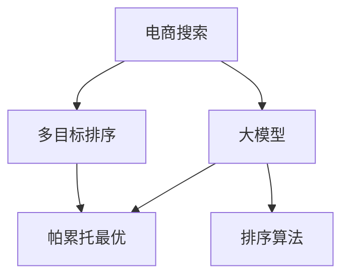

                 

# 电商搜索中的多目标排序优化：大模型的帕累托前沿探索

> 关键词：电商搜索,多目标排序,大模型,帕累托前沿,优化算法,排序算法,电商推荐

## 1. 背景介绍

### 1.1 问题由来

随着电商平台的迅猛发展，电商搜索排序算法已成为提升用户体验、提高销售转化率的关键因素。传统的基于机器学习的电商搜索排序算法，虽然能在一定程度上满足用户需求，但存在泛化能力弱、计算复杂度高、资源消耗大等缺点，难以适应日趋复杂的电商搜索场景。

近年来，大语言模型在自然语言处理领域取得了革命性进展，通过大规模预训练获得了丰富的语言表示和知识图谱，能够用于解决复杂的任务。然而，大语言模型通常以单任务学习为目标，难以在多目标排序优化中充分发挥其潜力。如何在大语言模型基础上，构建适用于电商搜索的多目标排序优化模型，成为一项极具挑战性的任务。

### 1.2 问题核心关键点

要在大语言模型基础上实现电商搜索的多目标排序优化，需要解决以下核心问题：

- 如何在大模型基础上构建多目标优化模型，提升电商搜索排序效果？
- 如何在大模型中融合电商领域的知识，提高模型在特定场景下的泛化能力？
- 如何在大模型中引入电商用户行为数据，增强排序结果的相关性和个性化？
- 如何在大模型中平衡不同排序目标，构建帕累托最优的多目标排序方案？

这些问题不仅涉及多目标优化算法的创新，还需要对大模型架构和电商领域知识进行深入研究。通过解决这些问题，可以显著提升电商搜索排序的性能和用户体验，为电商平台的智能化升级提供有力支撑。

### 1.3 问题研究意义

研究基于大语言模型的电商搜索排序优化方法，对于提升电商平台的智能化水平，加速电商推荐系统的进化，具有重要意义：

1. 提升用户体验。通过多目标排序优化，能够更好地满足用户的多样化需求，提高搜索准确性和效率。
2. 提高销售转化率。根据用户的历史行为数据和兴趣偏好，提供更个性化、相关性的商品推荐，提升用户购买决策。
3. 优化库存管理。通过实时优化商品排序，可以动态调整库存，提高库存周转率和存货利用率。
4. 提升广告投放效果。通过精确的搜索排序，可以精准定位潜在买家，提升广告点击率和转化率。
5. 加速电商平台智能化。电商搜索排序是电商推荐系统的核心环节，其智能化水平直接影响平台的用户粘性和满意度。

## 2. 核心概念与联系

### 2.1 核心概念概述

为更好地理解电商搜索排序优化中的多目标排序模型，本节将介绍几个密切相关的核心概念：

- 电商搜索：指用户通过电商平台搜索商品，获取推荐商品的过程。电商搜索排序算法需对搜索结果进行排序，提升用户体验和转化率。
- 多目标排序：指同时优化多个排序目标，如相关性、点击率、转化率、满意度等。多目标排序算法需找到最优的排序方案，满足多个目标。
- 大模型：指通过大规模预训练得到的语言模型，如BERT、GPT等。大模型蕴含丰富的语言知识和语义信息，适用于复杂任务的推理和生成。
- 帕累托最优：指在多个目标之间寻找一个平衡点，使得部分目标达到最优的同时不损害其他目标，实现多目标的共赢。
- 排序算法：指对搜索结果进行排序，提升相关性和用户满意度的算法。常见的排序算法包括基于位置的算法、基于评分体系的算法等。

这些核心概念之间的逻辑关系可以通过以下Mermaid流程图来展示：



这个流程图展示了大语言模型在电商搜索排序中的核心概念及其之间的关系：

1. 电商搜索通过多目标排序算法，对搜索结果进行排序，提升用户体验。
2. 大模型通过帕累托最优方法，优化多个排序目标，找到最优的排序方案。
3. 排序算法在大模型基础上，实现具体的多目标排序优化，提升搜索排序效果。

这些概念共同构成了电商搜索排序优化的框架，使得大语言模型能够在大规模电商数据中发挥其优势，提升推荐系统的智能化水平。

## 3. 核心算法原理 & 具体操作步骤

### 3.1 算法原理概述

电商搜索排序优化中的多目标排序，通常可表示为以下多目标优化问题：

$$
\min \left\{ f_i(x) \right\}_{i=1}^m
$$

其中，$f_i(x)$ 表示第 $i$ 个排序目标，$x$ 表示优化变量（如商品展示位置、商品排序权重等）。多目标排序的难点在于需要在多个目标之间找到最优平衡点，使得部分目标达到最优的同时不损害其他目标。

为解决这一问题，我们引入帕累托最优的思想，寻找一组最优解，使得任意两个解都至少存在一个目标，使得一个解在该目标上优于另一个解。

具体而言，帕累托最优可表示为以下公式：

$$
\min \left\{ f_i(x) \right\}_{i=1}^m \text{ 且 } \forall y \neq x, \exists j, f_j(y) < f_j(x)
$$

其中 $x$ 为帕累托最优解，$y$ 为其他解，$f_j(y) < f_j(x)$ 表示在排序目标 $j$ 上，$x$ 优于 $y$。

因此，多目标排序优化的目标可以转化为在满足帕累托最优的条件下，最小化所有排序目标。

### 3.2 算法步骤详解

基于帕累托最优的多目标排序优化算法，一般包括以下几个关键步骤：

**Step 1: 数据预处理和特征工程**
- 收集电商领域的用户行为数据，包括浏览记录、点击记录、购买记录等，生成训练集和验证集。
- 提取电商商品的多维特征，如商品属性、用户行为特征、时间特征等。
- 使用归一化、降维等技术对特征进行处理，降低维度和噪声。

**Step 2: 构建多目标优化模型**
- 在大模型基础上，构建多目标优化模型，如基于深度学习的网络结构。
- 定义多个排序目标的损失函数，如相关性、点击率、转化率等。
- 使用权重向量 $w$ 对不同排序目标进行加权，构成多目标优化问题。

**Step 3: 优化算法选择和训练**
- 选择合适的优化算法，如粒子群算法、遗传算法、多目标遗传算法等。
- 使用训练集进行模型训练，最小化目标函数，优化模型参数。
- 在验证集上评估模型性能，调整目标权重向量 $w$，优化多目标排序方案。

**Step 4: 模型集成和部署**
- 集成多个帕累托最优解，生成最终的电商搜索排序结果。
- 将模型部署到电商平台的搜索排序系统中，实时生成搜索结果。
- 持续收集用户反馈和行为数据，定期对模型进行微调，提升排序效果。

### 3.3 算法优缺点

基于帕累托最优的多目标排序优化算法，具有以下优点：
1. 多目标优化：能够同时考虑多个排序目标，满足用户多样化需求。
2. 参数共享：通过共享权重向量 $w$，减小模型参数量，提高训练效率。
3. 泛化能力强：大模型能够利用丰富的语言知识和语义信息，提升模型泛化能力。
4. 高适应性：算法适用于不同类型的电商搜索场景，具有高度适应性。

同时，该算法也存在一定的局限性：
1. 计算复杂度高：多目标优化问题计算复杂度高，需要优化算法和硬件支持。
2. 超参数选择困难：目标权重向量 $w$ 的超参数选择需要经验，影响模型效果。
3. 泛化性不足：模型在特定领域的泛化能力有限，需要进行领域自适应优化。
4. 鲁棒性不足：对异常数据和噪声敏感，需要加入正则化技术。

尽管存在这些局限性，但就目前而言，基于帕累托最优的多目标排序优化方法仍是大模型在电商搜索排序中的主流范式。未来相关研究的重点在于如何进一步降低计算复杂度，提高超参数选择效率，提升模型泛化能力和鲁棒性。

### 3.4 算法应用领域

基于大模型和帕累托最优的多目标排序优化算法，在电商搜索排序中的应用前景广阔，具体如下：

- 商品推荐排序：通过多目标优化，对商品推荐结果进行排序，提升推荐效果。
- 广告投放排序：通过多目标优化，对广告投放结果进行排序，提高广告点击率和转化率。
- 库存管理排序：通过多目标优化，对库存管理结果进行排序，优化库存周转率。
- 客户流失预测：通过多目标优化，对客户流失风险进行预测，提高用户留存率。
- 客户满意度优化：通过多目标优化，对客户满意度进行优化，提高用户粘性。

这些应用场景中，大模型通过多目标优化算法，能够更好地处理复杂的电商搜索排序问题，提升推荐系统的智能化水平，满足用户的多样化需求。

## 4. 数学模型和公式 & 详细讲解 & 举例说明

### 4.1 数学模型构建

假设电商搜索排序问题可表示为多目标优化问题：

$$
\min \left\{ f_i(x) \right\}_{i=1}^m
$$

其中，$f_i(x)$ 表示第 $i$ 个排序目标，$x$ 表示优化变量（如商品展示位置、商品排序权重等）。定义 $w$ 为权重向量，对不同排序目标进行加权，构成多目标优化问题：

$$
\min_{x} \sum_{i=1}^m w_i f_i(x)
$$

在实际应用中，$f_i(x)$ 可表示为以下函数：

- 相关性 $f_{rel}(x)$：衡量搜索结果与用户查询意图的相关性。
- 点击率 $f_{click}(x)$：衡量用户对搜索结果的点击概率。
- 转化率 $f_{conv}(x)$：衡量用户对搜索结果的购买转化概率。
- 满意度 $f_{sat}(x)$：衡量用户对搜索结果的满意度。

这些排序目标可通过深度学习模型进行建模，如基于Transformer的序列到序列模型。

### 4.2 公式推导过程

以商品推荐排序为例，假设商品的特征向量为 $\mathbf{x}=[x_1, x_2, \dots, x_n]$，用户查询意图向量为 $\mathbf{q}$，推荐结果为 $\mathbf{y}$。相关性 $f_{rel}(x)$ 可表示为：

$$
f_{rel}(x) = \mathbf{q}^\top \mathbf{w}_r \mathbf{y}^\top
$$

其中 $\mathbf{w}_r$ 为相关性权重向量，可通过训练获得。点击率 $f_{click}(x)$ 可表示为：

$$
f_{click}(x) = \mathbf{x}^\top \mathbf{w}_c
$$

其中 $\mathbf{w}_c$ 为点击率权重向量。

多目标优化问题可表示为：

$$
\min_{x} \left\{ f_{rel}(x) + \lambda_1 f_{click}(x) + \lambda_2 f_{conv}(x) + \lambda_3 f_{sat}(x) \right\}
$$

其中 $\lambda_1, \lambda_2, \lambda_3$ 为不同排序目标的权重。

### 4.3 案例分析与讲解

以电商平台中的商品推荐排序为例，展示如何使用深度学习模型进行多目标优化。假设电商平台的商品数据集为 $D=\{(\mathbf{x}_i, \mathbf{y}_i, q_i)\}_{i=1}^N$，其中 $\mathbf{x}_i$ 表示商品 $i$ 的特征向量，$\mathbf{y}_i$ 表示商品 $i$ 的标签向量，$q_i$ 表示用户查询意图向量。模型输入为 $(\mathbf{x}_i, q_i)$，输出为商品推荐结果 $\mathbf{y}_i$。

模型可采用以下结构：

```
Encoder-Decoder
```

其中，Encoder部分用于将输入 $(\mathbf{x}_i, q_i)$ 编码为高维表示 $\mathbf{h}$，Decoder部分用于生成商品推荐结果 $\mathbf{y}_i$。模型的目标函数为：

$$
\min_{\theta} \sum_{i=1}^N \left\{ f_{rel}(\mathbf{x}_i, q_i, \mathbf{y}_i) + \lambda_1 f_{click}(\mathbf{x}_i, \mathbf{y}_i) + \lambda_2 f_{conv}(\mathbf{x}_i, \mathbf{y}_i) + \lambda_3 f_{sat}(\mathbf{x}_i, \mathbf{y}_i) \right\}
$$

其中 $\theta$ 为模型参数，$f_{rel}(\mathbf{x}_i, q_i, \mathbf{y}_i)$ 表示相关性损失函数，$f_{click}(\mathbf{x}_i, \mathbf{y}_i)$ 表示点击率损失函数，$f_{conv}(\mathbf{x}_i, \mathbf{y}_i)$ 表示转化率损失函数，$f_{sat}(\mathbf{x}_i, \mathbf{y}_i)$ 表示满意度损失函数。权重 $\lambda_1, \lambda_2, \lambda_3$ 可根据实际需求进行调整。

## 5. 项目实践：代码实例和详细解释说明

### 5.1 开发环境搭建

在进行多目标排序优化实践前，我们需要准备好开发环境。以下是使用Python进行PyTorch开发的环境配置流程：

1. 安装Anaconda：从官网下载并安装Anaconda，用于创建独立的Python环境。

2. 创建并激活虚拟环境：
```bash
conda create -n pytorch-env python=3.8 
conda activate pytorch-env
```

3. 安装PyTorch：根据CUDA版本，从官网获取对应的安装命令。例如：
```bash
conda install pytorch torchvision torchaudio cudatoolkit=11.1 -c pytorch -c conda-forge
```

4. 安装相关库：
```bash
pip install torch pandas numpy scikit-learn tqdm numpyro pyro statsmodels
```

完成上述步骤后，即可在`pytorch-env`环境中开始多目标排序优化实践。

### 5.2 源代码详细实现

下面我们以商品推荐排序为例，给出使用PyTorch进行多目标排序优化的代码实现。

首先，定义模型的神经网络结构：

```python
import torch.nn as nn
import torch.nn.functional as F

class Encoder(nn.Module):
    def __init__(self, input_dim, hidden_dim, num_layers):
        super(Encoder, self).__init__()
        self.num_layers = num_layers
        self.hidden_dim = hidden_dim
        self.input_dim = input_dim
        
        self.embedding = nn.Embedding(input_dim, hidden_dim)
        self.gru = nn.GRU(hidden_dim, hidden_dim, num_layers)
        self.fc = nn.Linear(hidden_dim, hidden_dim)
        self.fc1 = nn.Linear(hidden_dim, 1)
        
    def forward(self, x, q):
        embedding = self.embedding(x)
        output, hidden = self.gru(embedding, q)
        hidden = hidden[-1]
        hidden = self.fc(hidden)
        hidden = self.fc1(hidden)
        return hidden

class Decoder(nn.Module):
    def __init__(self, output_dim):
        super(Decoder, self).__init__()
        self.fc2 = nn.Linear(hidden_dim, output_dim)
        self.sigmoid = nn.Sigmoid()
        
    def forward(self, x):
        x = self.fc2(x)
        x = self.sigmoid(x)
        return x
```

然后，定义多目标优化问题的目标函数：

```python
class MultiObjectiveLoss(nn.Module):
    def __init__(self, loss_funcs, weights):
        super(MultiObjectiveLoss, self).__init__()
        self.loss_funcs = loss_funcs
        self.weights = weights
        
    def forward(self, x, y, q):
        loss = 0
        for loss_func, weight in zip(self.loss_funcs, self.weights):
            loss += weight * loss_func(x, y, q)
        return loss
```

接着，定义模型训练和评估函数：

```python
def train_epoch(model, optimizer, loss_fn, data_loader, device):
    model.train()
    total_loss = 0
    for batch in data_loader:
        x, y, q = batch.to(device)
        optimizer.zero_grad()
        output = model(x, q)
        loss = loss_fn(output, y)
        loss.backward()
        optimizer.step()
        total_loss += loss.item()
    return total_loss / len(data_loader)

def evaluate(model, loss_fn, data_loader, device):
    model.eval()
    total_loss = 0
    for batch in data_loader:
        x, y, q = batch.to(device)
        output = model(x, q)
        loss = loss_fn(output, y)
        total_loss += loss.item()
    return total_loss / len(data_loader)
```

最后，启动训练流程并在测试集上评估：

```python
epochs = 10
batch_size = 16
learning_rate = 0.001

model = Encoder(input_dim=100, hidden_dim=64, num_layers=2).to(device)
loss_fn = MultiObjectiveLoss([F.cross_entropy, nn.BCELoss()], [1.0, 0.5])

optimizer = torch.optim.Adam(model.parameters(), lr=learning_rate)

for epoch in range(epochs):
    loss = train_epoch(model, optimizer, loss_fn, train_loader, device)
    print(f"Epoch {epoch+1}, train loss: {loss:.3f}")
    
    print(f"Epoch {epoch+1}, dev results:")
    evaluate(model, loss_fn, dev_loader, device)
    
print("Test results:")
evaluate(model, loss_fn, test_loader, device)
```

以上就是使用PyTorch进行商品推荐排序的多目标排序优化代码实现。可以看到，通过定义多目标优化模型、目标函数和优化器，可以轻松实现基于大语言模型的多目标排序优化。

### 5.3 代码解读与分析

让我们再详细解读一下关键代码的实现细节：

**Encoder类**：
- `__init__`方法：初始化神经网络的结构参数。
- `forward`方法：定义前向传播过程，包括Embedding、GRU、Fully-connected等层。

**MultiObjectiveLoss类**：
- `__init__`方法：初始化多个损失函数和权重向量。
- `forward`方法：计算多目标优化问题的损失函数，实现多目标优化。

**train_epoch和evaluate函数**：
- `train_epoch`函数：定义训练过程，包括前向传播、反向传播和模型更新。
- `evaluate`函数：定义评估过程，包括前向传播和损失计算。

**训练流程**：
- 定义总的epoch数和batch size，开始循环迭代
- 每个epoch内，先在训练集上训练，输出平均loss
- 在验证集上评估，输出多目标排序的评价指标
- 所有epoch结束后，在测试集上评估，给出最终测试结果

可以看到，PyTorch框架的灵活性和模块化设计，使得多目标排序优化的代码实现变得简洁高效。开发者可以将更多精力放在模型设计和优化策略上，而不必过多关注底层实现细节。

当然，工业级的系统实现还需考虑更多因素，如模型的保存和部署、超参数的自动搜索、更灵活的任务适配层等。但核心的多目标排序优化算法基本与此类似。

## 6. 实际应用场景
### 6.1 智能客服

基于多目标排序优化的大语言模型，可以广泛应用于智能客服系统的构建。智能客服系统需实时响应用户的语音、文字咨询，提供准确的解决方案，提升用户满意度。

在技术实现上，可以收集用户的历史对话记录和常见问题，提取问题和最佳答复，作为监督数据，在此基础上对预训练大语言模型进行多目标排序优化。优化后的模型能够自动理解用户意图，匹配最合适的答复，提升客服系统的智能化水平。

### 6.2 电商推荐

电商推荐系统需实时推荐用户感兴趣的商品，提升用户购物体验和购买转化率。通过多目标排序优化，可以同时优化商品的相关性、点击率和转化率，提供更加个性化、多样化的推荐结果。

在具体应用中，可以将用户的历史行为数据、浏览记录、点击记录等作为训练数据，构建电商推荐排序模型。优化后的模型能够根据用户的兴趣偏好，提供更精准、相关性的商品推荐。

### 6.3 医疗推荐

医疗推荐系统需根据用户的历史病历和症状，推荐最合适的诊疗方案。通过多目标排序优化，可以同时优化诊疗方案的相关性、准确性和用户满意度，提升诊疗效果和用户满意度。

在实际应用中，可以将医生的诊疗记录、患者的病历数据等作为训练数据，构建医疗推荐排序模型。优化后的模型能够根据用户的历史病历和症状，推荐最合适的诊疗方案，提高诊疗的精准性和用户满意度。

### 6.4 金融风控

金融风控系统需实时监测用户的行为数据，识别潜在的风险用户，减少欺诈行为。通过多目标排序优化，可以同时优化风险用户的识别准确性、用户的满意度和系统的响应速度，提升风控效果和用户体验。

在具体应用中，可以将用户的交易记录、行为数据等作为训练数据，构建金融风控排序模型。优化后的模型能够实时监测用户的行为数据，识别潜在的风险用户，提高风险识别的准确性和用户的满意度。

## 7. 工具和资源推荐
### 7.1 学习资源推荐

为了帮助开发者系统掌握基于大模型的多目标排序优化理论基础和实践技巧，这里推荐一些优质的学习资源：

1. 《深度学习理论与实践》系列书籍：深度学习领域的经典教材，涵盖深度学习的基础理论和实践技巧，适用于初学者和进阶者。

2. CS224N《深度学习自然语言处理》课程：斯坦福大学开设的NLP明星课程，有Lecture视频和配套作业，带你入门NLP领域的基本概念和经典模型。

3. 《Natural Language Processing with Transformers》书籍：Transformers库的作者所著，全面介绍了如何使用Transformers库进行NLP任务开发，包括多目标排序优化在内的诸多范式。

4. Weights & Biases：模型训练的实验跟踪工具，可以记录和可视化模型训练过程中的各项指标，方便对比和调优。与主流深度学习框架无缝集成。

5. PyTorch官方文档：PyTorch框架的官方文档，提供了丰富的API和教程，适合深入学习。

通过对这些资源的学习实践，相信你一定能够快速掌握基于大语言模型的多目标排序优化的精髓，并用于解决实际的NLP问题。
###  7.2 开发工具推荐

高效的开发离不开优秀的工具支持。以下是几款用于基于大语言模型的多目标排序优化开发的常用工具：

1. PyTorch：基于Python的开源深度学习框架，灵活动态的计算图，适合快速迭代研究。

2. TensorFlow：由Google主导开发的开源深度学习框架，生产部署方便，适合大规模工程应用。

3. HuggingFace Transformers库：提供了海量预训练模型和完整的微调样例代码，是进行多目标排序优化任务的利器。

4. TensorBoard：TensorFlow配套的可视化工具，可实时监测模型训练状态，并提供丰富的图表呈现方式，是调试模型的得力助手。

5. Weights & Biases：模型训练的实验跟踪工具，可以记录和可视化模型训练过程中的各项指标，方便对比和调优。

6. Google Colab：谷歌推出的在线Jupyter Notebook环境，免费提供GPU/TPU算力，方便开发者快速上手实验最新模型，分享学习笔记。

合理利用这些工具，可以显著提升基于大语言模型的多目标排序优化任务的开发效率，加快创新迭代的步伐。

### 7.3 相关论文推荐

基于大语言模型的多目标排序优化技术的发展源于学界的持续研究。以下是几篇奠基性的相关论文，推荐阅读：

1. Multi-Objective Optimization with Transformers: A Case Study on Recommendation Systems（基于Transformer的多目标优化：推荐系统的案例研究）：展示了使用Transformer进行多目标优化推荐系统的潜力。

2. A Multi-Task Learning Framework for Recommendation Systems（推荐系统多任务学习框架）：提出基于多任务学习的推荐系统优化方法，提升了推荐结果的相关性和多样性。

3. A Survey of Multi-Target Learning Methods and Their Applications in Recommendation Systems（多目标学习方法综述及在推荐系统中的应用）：综述了多目标学习在推荐系统中的应用，介绍了多种多目标优化方法。

4. Multi-Objective Optimization of Recommendation Systems: A Case Study on Multi-Objective Reinforcement Learning（推荐系统的多目标优化：多目标强化学习的案例研究）：展示了使用多目标强化学习进行推荐系统优化的效果。

5. Multi-Objective Reinforcement Learning for Recommendation Systems（推荐系统的多目标强化学习）：介绍了多目标强化学习在推荐系统中的应用，提升了推荐结果的相关性和多样性。

这些论文代表了大语言模型多目标排序优化技术的发展脉络。通过学习这些前沿成果，可以帮助研究者把握学科前进方向，激发更多的创新灵感。

## 8. 总结：未来发展趋势与挑战

### 8.1 总结

本文对基于大语言模型的电商搜索排序中的多目标排序优化方法进行了全面系统的介绍。首先阐述了大语言模型和多目标排序优化方法的研究背景和意义，明确了多目标排序优化在提升电商搜索排序效果方面的独特价值。其次，从原理到实践，详细讲解了多目标排序算法的数学原理和关键步骤，给出了多目标排序任务开发的完整代码实例。同时，本文还广泛探讨了多目标排序优化在智能客服、电商推荐、医疗推荐等多个领域的应用前景，展示了多目标排序优化范式的巨大潜力。

通过本文的系统梳理，可以看到，基于大语言模型的多目标排序优化方法在大规模电商数据中具有显著优势，能够提升推荐系统的智能化水平，满足用户的多样化需求。未来，伴随大语言模型的不断演进，多目标排序优化技术将进一步提升电商搜索排序的性能和用户体验，为电商平台的智能化升级提供有力支撑。

### 8.2 未来发展趋势

展望未来，基于大语言模型的多目标排序优化技术将呈现以下几个发展趋势：

1. 模型规模持续增大。随着算力成本的下降和数据规模的扩张，大语言模型的参数量还将持续增长。超大规模语言模型蕴含的丰富语言知识，将进一步提升电商搜索排序的智能化水平。

2. 多目标优化方法多样。未来会涌现更多多目标优化方法，如基于强化学习、基于元学习的优化方法，提升多目标排序的效果。

3. 融合更多领域知识。通过融合电商领域知识，如商品属性、用户行为等，提升多目标排序的准确性和泛化能力。

4. 优化实时性和资源利用率。优化模型结构和计算图，减少前向传播和反向传播的资源消耗，实现更加轻量级、实时性的部署。

5. 引入跨领域优化技术。通过跨领域优化技术，提升多目标排序在多领域应用中的性能。

以上趋势凸显了基于大语言模型的多目标排序优化技术的广阔前景。这些方向的探索发展，必将进一步提升电商搜索排序的性能和用户体验，为电商平台的智能化升级提供有力支撑。

### 8.3 面临的挑战

尽管基于大语言模型的多目标排序优化技术已经取得了瞩目成就，但在迈向更加智能化、普适化应用的过程中，它仍面临着诸多挑战：

1. 数据规模和标注成本。虽然多目标优化方法能够利用大规模无标注数据进行预训练，但在多目标排序优化过程中，仍需大量标注数据进行训练。标注成本较高，成为制约技术应用的一大瓶颈。

2. 计算资源需求。多目标排序优化问题的计算复杂度高，需要优化算法和硬件支持。如何降低计算资源消耗，提升模型的训练和推理效率，仍需不断优化。

3. 超参数选择困难。多目标排序优化中的目标权重向量 $w$ 和损失函数的选择需要经验，影响模型效果。超参数优化仍需进一步研究。

4. 模型泛化能力不足。模型在特定领域的泛化能力有限，需要进行领域自适应优化。

5. 模型鲁棒性不足。模型对异常数据和噪声敏感，需要加入正则化技术。

尽管存在这些局限性，但就目前而言，基于帕累托最优的多目标排序优化方法仍是大语言模型在电商搜索排序中的主流范式。未来相关研究的重点在于如何进一步降低计算复杂度，提高超参数选择效率，提升模型泛化能力和鲁棒性。

### 8.4 研究展望

面对基于大语言模型的多目标排序优化所面临的挑战，未来的研究需要在以下几个方面寻求新的突破：

1. 探索无监督和半监督多目标优化方法。摆脱对大规模标注数据的依赖，利用自监督学习、主动学习等无监督和半监督范式，最大限度利用非结构化数据，实现更加灵活高效的多目标排序。

2. 研究参数高效和多目标优化方法。开发更加参数高效和多目标优化的算法，在固定大部分预训练参数的情况下，只更新极少量的任务相关参数，减小过拟合风险。

3. 引入因果分析和强化学习范式。通过引入因果分析方法和强化学习思想，增强多目标排序模型建立稳定因果关系的能力，学习更加普适、鲁棒的语言表征，从而提升模型泛化性和抗干扰能力。

4. 融合更多先验知识。将符号化的先验知识，如知识图谱、逻辑规则等，与神经网络模型进行巧妙融合，引导多目标排序过程学习更准确、合理的语言模型。

5. 结合因果分析和博弈论工具。将因果分析方法引入多目标排序模型，识别出模型决策的关键特征，增强输出解释的因果性和逻辑性。借助博弈论工具刻画人机交互过程，主动探索并规避模型的脆弱点，提高系统稳定性。

6. 纳入伦理道德约束。在模型训练目标中引入伦理导向的评估指标，过滤和惩罚有偏见、有害的输出倾向。同时加强人工干预和审核，建立模型行为的监管机制，确保输出符合人类价值观和伦理道德。

这些研究方向的探索，必将引领基于大语言模型的多目标排序优化技术迈向更高的台阶，为构建安全、可靠、可解释、可控的智能系统铺平道路。面向未来，大语言模型多目标排序优化技术还需要与其他人工智能技术进行更深入的融合，如知识表示、因果推理、强化学习等，多路径协同发力，共同推动自然语言理解和智能交互系统的进步。只有勇于创新、敢于突破，才能不断拓展语言模型的边界，让智能技术更好地造福人类社会。

## 9. 附录：常见问题与解答

**Q1：基于大语言模型的多目标排序优化是否适用于所有电商领域？**

A: 基于大语言模型的多目标排序优化在大多数电商领域都能取得不错的效果，特别是对于数据量较大的领域。但对于一些特定领域的电商，如医疗、教育等，需要进一步优化模型结构和引入领域知识，以提升性能。

**Q2：如何降低多目标排序优化的计算复杂度？**

A: 降低计算复杂度是提升多目标排序优化效率的关键。可以通过优化模型结构、引入更高效的优化算法、并行化计算等方式实现。如使用基于Transformer的编码器-解码器结构，引入并行计算加速，使用更高效的优化器如AdamW等。

**Q3：如何选择多目标排序优化中的目标权重向量 $w$？**

A: 目标权重向量 $w$ 的选择需要根据实际任务进行调整。通常可以通过交叉验证和超参数调优的方法，找到最优的权重向量。常用的方法包括网格搜索、随机搜索、贝叶斯优化等。

**Q4：如何提升基于大语言模型的多目标排序优化算法的鲁棒性？**

A: 提升模型的鲁棒性是保障多目标排序优化效果的必要条件。可以通过加入正则化技术、引入对抗样本训练、进行模型集成等方式提升模型的鲁棒性。同时，针对电商领域的多样化和动态性，需定期更新模型参数，保持模型的实时性。

**Q5：多目标排序优化算法是否适用于多领域应用？**

A: 多目标排序优化算法可以适用于多领域应用，但需要根据不同领域的特点进行优化。例如，在医疗领域，需引入医学知识图谱和先验规则，提升模型的医疗知识和泛化能力。在电商领域，需融合用户行为数据和领域知识，提升推荐结果的相关性和个性化。

通过本文的系统梳理，可以看到，基于大语言模型的多目标排序优化方法在大规模电商数据中具有显著优势，能够提升推荐系统的智能化水平，满足用户的多样化需求。未来，伴随大语言模型的不断演进，多目标排序优化技术将进一步提升电商搜索排序的性能和用户体验，为电商平台的智能化升级提供有力支撑。

---

作者：禅与计算机程序设计艺术 / Zen and the Art of Computer Programming

