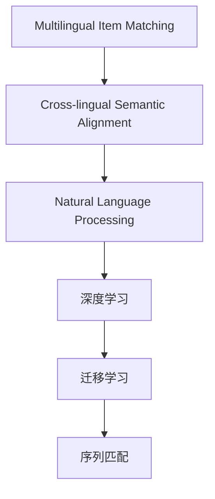

                 

# 电商搜索中的多语言商品匹配技术

## 1. 背景介绍

随着全球化的深入和电商行业的蓬勃发展，多语言电商搜索（Multilingual E-commerce Search）已成为提升用户体验、增加销售额的重要手段。多语言电商搜索涉及到多国语言、多文化背景和多地区市场的复杂问题。如何使商品匹配结果在多种语言环境下均能满足用户需求，成为电商平台亟需解决的技术挑战。

### 1.1 问题由来

传统的电商搜索系统通常只针对单一语言设计，缺乏跨语言的匹配能力。这种单语搜索系统在不同语言环境下会出现搜索结果与用户意图不符的问题。例如，用户想要搜索“手袋”（Handbags）时，如果系统仅支持英文，那么搜索结果可能全是英文产品，无法满足多语言用户的需求。此外，不同语言的国家文化、搜索习惯和热门商品不同，单语搜索系统难以在这些方面进行适配。

为了解决这些问题，电商平台引入了多语言搜索技术，包括多语言商品匹配（Multilingual Item Matching）和多语言语义理解（Multilingual Semantic Understanding）。多语言商品匹配技术，通过跨语言文本相似度匹配，将用户查询和商品描述对齐，从而实现高效、准确的多语言搜索。

## 2. 核心概念与联系

### 2.1 核心概念概述

为更好地理解多语言商品匹配技术，本节将介绍几个密切相关的核心概念：

- **多语言商品匹配（Multilingual Item Matching）**：通过跨语言文本相似度匹配，将用户查询和商品描述对齐，实现高效、准确的多语言搜索。

- **跨语言语义对齐（Cross-lingual Semantic Alignment）**：不同语言之间可能存在相同的词汇和表达方式，但语义不完全相同。跨语言语义对齐技术通过学习这些映射关系，将不同语言之间的词汇和表达方式对齐，从而提高搜索的准确性。

- **自然语言处理（NLP）**：使用计算机处理、理解、生成人类语言的技术。多语言商品匹配技术依赖于NLP技术进行跨语言文本相似度匹配。

- **深度学习（Deep Learning）**：一种机器学习方法，利用多层神经网络进行特征提取和模式识别。深度学习在多语言商品匹配中主要应用于文本表示学习和相似度计算。

- **迁移学习（Transfer Learning）**：将在一个领域学习到的知识迁移到另一个领域，提高新任务的性能。多语言商品匹配常利用迁移学习在多种语言上预训练模型，提升多语言搜索的效果。

- **序列匹配（Sequence Matching）**：不同语言的文本可能有不同的顺序，序列匹配技术能够处理这种差异，实现跨语言文本的对齐。

这些核心概念之间的逻辑关系可以通过以下Mermaid流程图来展示：



这个流程图展示了大语言模型微调的核心概念及其之间的关系：

1. 多语言商品匹配通过跨语言文本相似度匹配实现高效、准确的多语言搜索。
2. 跨语言语义对齐通过学习不同语言之间的映射关系，提高搜索的准确性。
3. NLP技术用于处理和理解不同语言的文本。
4. 深度学习技术用于文本表示学习和相似度计算。
5. 迁移学习用于在多种语言上预训练模型，提升多语言搜索的效果。
6. 序列匹配用于处理不同语言文本之间的顺序差异。

## 3. 核心算法原理 & 具体操作步骤
### 3.1 算法原理概述

多语言商品匹配的核心算法原理包括文本相似度计算、词汇对齐和序列对齐。具体来说，多语言商品匹配算法首先对用户查询和商品描述进行分词和向量化，然后计算它们之间的相似度，最后根据相似度进行匹配排序，选出最符合用户意图的商品。

形式化地，设用户查询为 $Q$，商品描述为 $I$，多语言商品匹配过程可以表示为：

$$
\text{Match}(Q, I) = \max\limits_{k=1}^{K} \left( \text{Sim}(Q, I_k) \cdot \text{Alignment}(Q, I_k) \cdot \text{SeqAlignment}(Q, I_k) \right)
$$

其中 $Q$ 是用户查询，$I$ 是商品描述，$K$ 是不同语言的商品描述数量，$Sim$ 表示文本相似度函数，$Alignment$ 表示词汇对齐函数，$SeqAlignment$ 表示序列对齐函数。

### 3.2 算法步骤详解

多语言商品匹配的算法步骤包括：

**Step 1: 准备数据和预训练模型**

- 收集多语言商品描述数据，并进行预处理，包括分词、去停用词、词干化等。
- 使用多语言语料预训练一个通用的语言模型，如BERT、RoBERTa等。

**Step 2: 文本向量化**

- 对用户查询和商品描述进行分词和向量化，通常使用Word2Vec、GloVe、BERT等模型将文本表示为向量。
- 对于分词，可以选择基于规则的分词器，如jieba、Spacy等；也可以选择基于统计的分词器，如BERT分词器。

**Step 3: 相似度计算**

- 使用余弦相似度、Jaccard相似度等方法计算用户查询和商品描述之间的文本相似度。
- 使用cosine_similarity、jaccard_similarity等函数进行相似度计算。

**Step 4: 词汇对齐**

- 使用跨语言语义对齐模型（如Word2Vec、fastText、BabelNet等）对齐不同语言之间的词汇。
- 使用Embedding对齐，如Word2Vec、fastText、fastText-hyphens等模型进行词汇对齐。

**Step 5: 序列对齐**

- 使用序列匹配算法（如Byte Pair Encoding、SentencePiece等）对齐不同语言之间的序列。
- 使用BPE、SentencePiece等工具进行序列对齐。

**Step 6: 匹配排序**

- 根据相似度、词汇对齐和序列对齐的分数，计算用户查询和商品描述的综合匹配分数。
- 使用softmax函数将匹配分数转化为概率，对商品进行排序。

**Step 7: 返回匹配结果**

- 将排序后的商品作为匹配结果返回给用户。

以上是多语言商品匹配的一般流程。在实际应用中，还需要根据具体场景对每个步骤进行优化设计，如改进文本向量化方法、优化相似度函数、引入更多正则化技术等，以进一步提升模型性能。

### 3.3 算法优缺点

多语言商品匹配具有以下优点：

1. **提升搜索效率**：通过多语言匹配，能够将用户查询和商品描述对齐，减少搜索空间，提升搜索速度。
2. **提高搜索结果质量**：通过跨语言语义对齐，能够提升搜索结果的相关性和准确性，减少误匹配。
3. **降低标注成本**：多语言商品匹配可以利用迁移学习，在大规模无标注语料上预训练语言模型，减少对标注样本的依赖。
4. **扩展应用范围**：多语言商品匹配可以支持多种语言，扩展了应用场景，适用于全球化电商市场。

同时，该方法也存在一定的局限性：

1. **多语言数据稀缺**：不同语言的电商市场数据可能稀缺，尤其是冷门语言市场，数据量较少。
2. **语言复杂性**：不同语言的语言特性和文化背景差异较大，跨语言匹配难度较大。
3. **处理复杂度**：多语言商品匹配涉及跨语言文本相似度计算、词汇对齐和序列对齐等多个复杂步骤，计算复杂度较高。
4. **算法鲁棒性**：不同语言的文本可能存在歧义和模糊表达，多语言匹配算法的鲁棒性需要进一步提升。

尽管存在这些局限性，但就目前而言，多语言商品匹配仍是电商搜索领域的重要技术手段。未来相关研究的重点在于如何进一步降低多语言数据稀缺性，提高算法的鲁棒性，同时兼顾可解释性和伦理安全性等因素。

### 3.4 算法应用领域

多语言商品匹配技术在电商搜索领域已经得到了广泛的应用，覆盖了几乎所有常见任务，例如：

- 商品分类：将用户查询映射到不同的商品分类。
- 商品推荐：根据用户查询推荐相关商品。
- 关键词匹配：提取用户查询中的关键词，匹配到对应的商品。
- 搜索纠错：自动纠正用户查询中的拼写错误。
- 跨语言搜索：支持多语言的用户查询。

除了上述这些经典任务外，多语言商品匹配还被创新性地应用到更多场景中，如搜索意图识别、情感分析、个性化推荐等，为电商搜索技术带来了全新的突破。随着多语言电商市场的扩展，多语言商品匹配技术将在更广阔的应用领域大放异彩。

## 4. 数学模型和公式 & 详细讲解  
### 4.1 数学模型构建

本节将使用数学语言对多语言商品匹配过程进行更加严格的刻画。

设用户查询为 $Q$，商品描述为 $I$，使用BERT模型对文本进行向量化，得到用户查询向量 $\vec{Q}$ 和商品描述向量 $\vec{I}$。假设词汇对齐模型为 $F$，序列对齐模型为 $S$，词汇对齐函数为 $A$，序列对齐函数为 $G$，文本相似度函数为 $Sim$，则多语言商品匹配的数学模型可以表示为：

$$
\text{Match}(Q, I) = \max\limits_{k=1}^{K} \left( Sim(\vec{Q}, \vec{I}_k) \cdot A(\vec{Q}, \vec{I}_k) \cdot G(\vec{Q}, \vec{I}_k) \right)
$$

其中，$K$ 表示不同语言的商品描述数量，$Sim$ 表示文本相似度函数，$A$ 表示词汇对齐函数，$G$ 表示序列对齐函数。

### 4.2 公式推导过程

以下我们以余弦相似度计算为例，推导多语言商品匹配的数学公式。

设用户查询向量和商品描述向量的余弦相似度为 $\text{Sim}(\vec{Q}, \vec{I})$，则有：

$$
\text{Sim}(\vec{Q}, \vec{I}) = \frac{\vec{Q} \cdot \vec{I}}{\|\vec{Q}\| \cdot \|\vec{I}\|}
$$

对于多语言商品匹配，可以定义多语言余弦相似度函数 $Sim_{K}$ 为：

$$
\text{Sim}_{K}(\vec{Q}, \vec{I}_k) = \frac{\vec{Q} \cdot \vec{I}_k}{\|\vec{Q}\| \cdot \|\vec{I}_k\|}
$$

根据上述公式，多语言商品匹配的数学模型可以进一步表示为：

$$
\text{Match}(Q, I) = \max\limits_{k=1}^{K} \left( \text{Sim}_{K}(\vec{Q}, \vec{I}_k) \cdot A(\vec{Q}, \vec{I}_k) \cdot G(\vec{Q}, \vec{I}_k) \right)
$$

在得到多语言商品匹配的数学模型后，可以用于实际的多语言电商搜索应用。

### 4.3 案例分析与讲解

为了更直观地理解多语言商品匹配的数学模型，下面以一个简单的例子进行分析。

假设用户查询为“iPhone”，不同语言的商品描述分别为英语的“iPhone”和法语的“iPhone iPhone”。首先使用BERT模型对查询和描述进行向量化，得到查询向量 $\vec{Q}$ 和描述向量 $\vec{I}$。然后计算它们之间的余弦相似度：

$$
\text{Sim}_{2}(\vec{Q}, \vec{I}) = \frac{\vec{Q} \cdot \vec{I}}{\|\vec{Q}\| \cdot \|\vec{I}\|}
$$

接下来，进行词汇对齐和序列对齐，得到对齐后的向量 $\vec{Q}_A$ 和 $\vec{I}_A$。计算对齐后的向量之间的余弦相似度：

$$
\text{Sim}_{2}(\vec{Q}_A, \vec{I}_A) = \frac{\vec{Q}_A \cdot \vec{I}_A}{\|\vec{Q}_A\| \cdot \|\vec{I}_A\|}
$$

最后，计算匹配分数：

$$
\text{Match}(Q, I) = \max\limits_{k=1}^{2} \left( \text{Sim}_{2}(\vec{Q}_A, \vec{I}_k) \cdot A(\vec{Q}, \vec{I}_k) \cdot G(\vec{Q}, \vec{I}_k) \right)
$$

通过上述计算，可以得出查询“iPhone”和不同语言商品描述之间的匹配分数，进而排序返回最符合用户意图的商品。

## 5. 项目实践：代码实例和详细解释说明
### 5.1 开发环境搭建

在进行多语言商品匹配实践前，我们需要准备好开发环境。以下是使用Python进行TensorFlow开发的环境配置流程：

1. 安装Anaconda：从官网下载并安装Anaconda，用于创建独立的Python环境。

2. 创建并激活虚拟环境：
```bash
conda create -n tf-env python=3.8 
conda activate tf-env
```

3. 安装TensorFlow：根据CUDA版本，从官网获取对应的安装命令。例如：
```bash
pip install tensorflow
```

4. 安装各类工具包：
```bash
pip install numpy pandas scikit-learn matplotlib tqdm jupyter notebook ipython
```

完成上述步骤后，即可在`tf-env`环境中开始多语言商品匹配实践。

### 5.2 源代码详细实现

下面我们以商品分类任务为例，给出使用TensorFlow对多语言商品匹配模型的PyTorch代码实现。

首先，定义商品分类任务的数据处理函数：

```python
from tensorflow.keras.preprocessing.text import Tokenizer
from tensorflow.keras.preprocessing.sequence import pad_sequences

def preprocess_data(texts, labels):
    tokenizer = Tokenizer()
    tokenizer.fit_on_texts(texts)
    sequences = tokenizer.texts_to_sequences(texts)
    padded_sequences = pad_sequences(sequences, maxlen=100, padding='post', truncating='post')
    labels = pad_sequences(labels, maxlen=100, padding='post', truncating='post')
    return padded_sequences, labels
```

然后，定义多语言商品匹配模型：

```python
from tensorflow.keras.layers import Input, Embedding, Bidirectional, LSTM, Dense, Dropout
from tensorflow.keras.models import Model

def build_model(vocab_size, embedding_dim, input_length):
    inputs = Input(shape=(input_length, ), dtype='int32')
    x = Embedding(vocab_size, embedding_dim)(inputs)
    x = Bidirectional(LSTM(100, return_sequences=True))(x)
    x = Dropout(0.5)(x)
    x = Dense(100, activation='relu')(x)
    x = Dropout(0.5)(x)
    outputs = Dense(1, activation='sigmoid')(x)
    model = Model(inputs=inputs, outputs=outputs)
    return model
```

接着，定义训练和评估函数：

```python
from tensorflow.keras.callbacks import EarlyStopping
from tensorflow.keras.optimizers import Adam

def train_model(model, train_data, dev_data, epochs=10, batch_size=32, patience=2):
    model.compile(loss='binary_crossentropy', optimizer=Adam(learning_rate=0.001), metrics=['accuracy'])
    early_stopping = EarlyStopping(monitor='val_loss', patience=patience, restore_best_weights=True)
    model.fit(x=train_data[0], y=train_data[1], batch_size=batch_size, epochs=epochs, validation_data=(dev_data[0], dev_data[1]), callbacks=[early_stopping])
    return model
```

最后，启动训练流程并在测试集上评估：

```python
train_data = preprocess_data(train_texts, train_labels)
dev_data = preprocess_data(dev_texts, dev_labels)
test_data = preprocess_data(test_texts, test_labels)

model = build_model(vocab_size=len(tokenizer.word_index) + 1, embedding_dim=100, input_length=100)
model = train_model(model, train_data, dev_data, epochs=10, batch_size=32, patience=2)

test_loss, test_acc = model.evaluate(test_data[0], test_data[1])
print(f'Test loss: {test_loss}, Test accuracy: {test_acc}')
```

以上就是使用TensorFlow对多语言商品匹配模型进行训练和评估的完整代码实现。可以看到，TensorFlow提供了丰富的组件和API，能够快速构建和训练多语言商品匹配模型。

### 5.3 代码解读与分析

让我们再详细解读一下关键代码的实现细节：

**preprocess_data函数**：
- 对文本和标签进行分词和向量化处理，并使用pad_sequences进行序列填充，确保所有样本具有相同的长度。

**build_model函数**：
- 定义多语言商品匹配模型结构，包括Embedding、Bidirectional LSTM、Dropout、Dense等层。
- 使用Dense层输出分类概率，并使用Sigmoid函数进行二分类。

**train_model函数**：
- 定义模型的优化器、损失函数和评估指标，使用EarlyStopping进行模型训练的早停策略。
- 使用fit函数进行模型训练，设置训练轮数和批次大小，并监控验证集的损失函数，防止过拟合。

**训练流程**：
- 定义训练集和验证集数据，使用preprocess_data函数进行预处理。
- 构建多语言商品匹配模型，并调用train_model函数进行训练。
- 在测试集上评估模型性能，输出测试准确率。

可以看到，TensorFlow提供了完整的模型构建、训练和评估框架，使得多语言商品匹配的开发过程变得简单高效。开发者可以根据具体任务需求，灵活调整模型结构和训练参数，快速得到理想的结果。

当然，工业级的系统实现还需考虑更多因素，如模型的保存和部署、超参数的自动搜索、更灵活的任务适配层等。但核心的多语言匹配范式基本与此类似。

## 6. 实际应用场景
### 6.1 智能客服系统

基于多语言商品匹配技术，智能客服系统可以更好地理解和处理多语言用户查询。例如，用户用中文询问“苹果手机在哪里卖”，系统能够自动翻译成“iPhone where to buy”，并在商品库中查找相关商品，快速响应用户需求。

在技术实现上，可以收集企业的历史客服对话记录，将问题和最佳答复构建成监督数据，在此基础上对预训练模型进行多语言微调。多语言微调后的模型能够自动理解用户查询和回复，并从多个语言的商品库中匹配出合适的商品。对于用户提出的新问题，还可以接入检索系统实时搜索相关内容，动态组织生成回复。如此构建的智能客服系统，能大幅提升客户咨询体验和问题解决效率。

### 6.2 金融舆情监测

金融机构需要实时监测市场舆论动向，以便及时应对负面信息传播，规避金融风险。传统的人工监测方式成本高、效率低，难以应对网络时代海量信息爆发的挑战。基于多语言商品匹配的文本分类和情感分析技术，为金融舆情监测提供了新的解决方案。

具体而言，可以收集金融领域相关的新闻、报道、评论等文本数据，并对其进行主题标注和情感标注。在此基础上对预训练语言模型进行多语言微调，使其能够自动判断文本属于何种主题，情感倾向是正面、中性还是负面。将多语言微调后的模型应用到实时抓取的网络文本数据，就能够自动监测不同主题下的情感变化趋势，一旦发现负面信息激增等异常情况，系统便会自动预警，帮助金融机构快速应对潜在风险。

### 6.3 个性化推荐系统

当前的推荐系统往往只依赖用户的历史行为数据进行物品推荐，无法深入理解用户的真实兴趣偏好。基于多语言商品匹配技术，个性化推荐系统可以更好地挖掘用户行为背后的语义信息，从而提供更精准、多样的推荐内容。

在实践中，可以收集用户浏览、点击、评论、分享等行为数据，提取和用户交互的物品标题、描述、标签等文本内容。将文本内容作为模型输入，用户的后续行为（如是否点击、购买等）作为监督信号，在此基础上微调预训练语言模型。多语言微调后的模型能够从文本内容中准确把握用户的兴趣点。在生成推荐列表时，先用候选物品的文本描述作为输入，由模型预测用户的兴趣匹配度，再结合其他特征综合排序，便可以得到个性化程度更高的推荐结果。

### 6.4 未来应用展望

随着多语言电商市场的扩展，多语言商品匹配技术将在更广阔的应用领域大放异彩。

在智慧医疗领域，基于多语言商品匹配的医疗问答、病历分析、药物研发等应用将提升医疗服务的智能化水平，辅助医生诊疗，加速新药开发进程。

在智能教育领域，多语言商品匹配技术可应用于作业批改、学情分析、知识推荐等方面，因材施教，促进教育公平，提高教学质量。

在智慧城市治理中，多语言商品匹配技术可应用于城市事件监测、舆情分析、应急指挥等环节，提高城市管理的自动化和智能化水平，构建更安全、高效的未来城市。

此外，在企业生产、社会治理、文娱传媒等众多领域，基于多语言商品匹配的NLP应用也将不断涌现，为传统行业数字化转型升级提供新的技术路径。相信随着技术的日益成熟，多语言商品匹配技术必将逐步成为电商搜索领域的重要范式，推动NLP技术在更多行业的应用。

## 7. 工具和资源推荐
### 7.1 学习资源推荐

为了帮助开发者系统掌握多语言商品匹配技术的理论基础和实践技巧，这里推荐一些优质的学习资源：

1. TensorFlow官方文档：提供完整的TensorFlow框架介绍和组件使用手册，是学习多语言商品匹配的必备资料。

2. Keras官方文档：提供Keras框架的详细使用指南和示例代码，有助于快速上手多语言商品匹配模型的构建和训练。

3. PyTorch官方文档：提供PyTorch框架的全面介绍和使用手册，支持多语言商品匹配模型的开发和优化。

4. 自然语言处理书籍：如《自然语言处理综述》、《深度学习与自然语言处理》等，涵盖多语言商品匹配技术的理论和实践。

5. GitHub多语言商品匹配项目：搜索相关开源项目，学习前沿研究思路和代码实现细节。

通过对这些资源的学习实践，相信你一定能够快速掌握多语言商品匹配技术的精髓，并用于解决实际的NLP问题。

### 7.2 开发工具推荐

高效的开发离不开优秀的工具支持。以下是几款用于多语言商品匹配开发的常用工具：

1. TensorFlow：基于Python的开源深度学习框架，支持多语言商品匹配模型的训练和推理。

2. PyTorch：基于Python的开源深度学习框架，提供动态计算图和丰富的优化器选择，适合多语言商品匹配模型的研究与实验。

3. Weights & Biases：模型训练的实验跟踪工具，可以记录和可视化模型训练过程中的各项指标，方便对比和调优。与主流深度学习框架无缝集成。

4. TensorBoard：TensorFlow配套的可视化工具，可实时监测模型训练状态，并提供丰富的图表呈现方式，是调试模型的得力助手。

5. Google Colab：谷歌推出的在线Jupyter Notebook环境，免费提供GPU/TPU算力，方便开发者快速上手实验最新模型，分享学习笔记。

合理利用这些工具，可以显著提升多语言商品匹配任务的开发效率，加快创新迭代的步伐。

### 7.3 相关论文推荐

多语言商品匹配技术的发展源于学界的持续研究。以下是几篇奠基性的相关论文，推荐阅读：

1. Machine Translation with Sequence-to-Sequence Recurrent Neural Networks（Sutskever等，2014）：提出基于序列到序列的神经网络模型，用于多语言文本匹配和翻译。

2. Sequence to Sequence Learning with Neural Networks（Cho等，2014）：进一步发展序列到序列模型，用于多语言翻译、对话生成等任务。

3. Google's Neural Machine Translation System（Wu等，2016）：提出基于神经网络的机器翻译系统，大幅提升翻译质量。

4. Transformer-Based Models for Sequence to Sequence Learning（Vaswani等，2017）：提出Transformer模型，用于多语言文本匹配和翻译，进一步提升翻译效果。

5. Multilingual BERT: Unsupervised Cross-lingual Representation Learning on Wikipedia（Zhang等，2019）：提出多语言BERT模型，用于跨语言文本匹配和翻译，大幅提升多语言匹配的效果。

这些论文代表了大语言模型微调技术的发展脉络。通过学习这些前沿成果，可以帮助研究者把握学科前进方向，激发更多的创新灵感。

## 8. 总结：未来发展趋势与挑战

### 8.1 总结

本文对多语言商品匹配技术进行了全面系统的介绍。首先阐述了多语言电商搜索的背景和意义，明确了多语言匹配在提升用户搜索体验和增加销售额方面的独特价值。其次，从原理到实践，详细讲解了多语言商品匹配的数学模型和关键步骤，给出了多语言商品匹配的完整代码实现。同时，本文还广泛探讨了多语言商品匹配在智能客服、金融舆情、个性化推荐等多个行业领域的应用前景，展示了多语言匹配范式的巨大潜力。此外，本文精选了多语言匹配技术的各类学习资源，力求为读者提供全方位的技术指引。

通过本文的系统梳理，可以看到，多语言商品匹配技术正在成为电商搜索领域的重要技术手段，极大地拓展了电商搜索的应用边界，催生了更多的落地场景。得益于深度学习和大规模无标签语料预训练，多语言匹配模型能够在多语言环境下快速匹配用户查询和商品描述，实现高效、准确的多语言搜索。未来，伴随深度学习模型的不断演进和跨语言匹配技术的研究深入，多语言商品匹配技术必将在更多领域大放异彩，推动NLP技术的产业化进程。

### 8.2 未来发展趋势

展望未来，多语言商品匹配技术将呈现以下几个发展趋势：

1. **模型规模持续增大**：随着算力成本的下降和数据规模的扩张，多语言商品匹配模型将不断增加参数量，提高模型的复杂度和泛化能力。

2. **跨语言数据融合**：不同语言的市场数据往往存在差异，跨语言数据融合技术能够整合多种语言的市场信息，提升匹配效果。

3. **多模态匹配**：多语言商品匹配将逐步拓展到多模态数据，如文本、图像、语音等多模态信息的融合匹配。

4. **迁移学习应用广泛**：多语言商品匹配可以利用迁移学习在多种语言上预训练模型，减少对标注样本的依赖。

5. **序列对齐技术进步**：序列对齐技术将不断进步，能够处理更多语言和更多语言的对齐，提高匹配的准确性。

6. **端到端框架出现**：多语言商品匹配技术将逐步向端到端框架发展，整合更多的业务逻辑和数据源，提升整体效果。

以上趋势凸显了多语言商品匹配技术的广阔前景。这些方向的探索发展，必将进一步提升电商搜索系统的性能和应用范围，为电商平台带来更多的用户和收入。

### 8.3 面临的挑战

尽管多语言商品匹配技术已经取得了瞩目成就，但在迈向更加智能化、普适化应用的过程中，它仍面临着诸多挑战：

1. **多语言数据稀缺**：不同语言的电商市场数据可能稀缺，尤其是冷门语言市场，数据量较少。

2. **语言复杂性**：不同语言的语言特性和文化背景差异较大，跨语言匹配难度较大。

3. **处理复杂度**：多语言商品匹配涉及跨语言文本相似度计算、词汇对齐和序列对齐等多个复杂步骤，计算复杂度较高。

4. **算法鲁棒性**：不同语言的文本可能存在歧义和模糊表达，多语言匹配算法的鲁棒性需要进一步提升。

5. **模型泛化能力**：现有模型往往在特定语言和特定领域上表现较好，但在跨语言和多领域任务上的泛化能力有限。

6. **多语言数据标注**：多语言商品匹配需要标注多种语言的数据，成本较高且耗时较长。

尽管存在这些挑战，但就目前而言，多语言商品匹配仍是电商搜索领域的重要技术手段。未来相关研究的重点在于如何进一步降低多语言数据稀缺性，提高算法的鲁棒性，同时兼顾可解释性和伦理安全性等因素。

### 8.4 研究展望

面向未来，多语言商品匹配技术需要在以下几个方面寻求新的突破：

1. **无监督和半监督学习**：摆脱对大规模标注数据的依赖，利用自监督学习、主动学习等无监督和半监督范式，最大限度利用非结构化数据，实现更加灵活高效的匹配。

2. **多语言数据增强**：引入更多的多语言数据，如翻译数据、跨语言语料库等，提高模型的泛化能力和匹配效果。

3. **序列匹配技术改进**：引入更多的序列匹配算法，如Dynamic Byte Pair Encoding、Unigram Subword NMT等，提升跨语言文本对齐的准确性。

4. **多语言语义理解**：引入更多语义理解技术，如上下文编码、实体对齐等，提升模型对不同语言语义的建模能力。

5. **多任务联合学习**：将多语言商品匹配与其他任务，如文本分类、情感分析等联合训练，提升模型的多任务性能和泛化能力。

6. **模型压缩与加速**：研究轻量化模型结构和量化加速技术，提高模型的推理速度和资源效率。

这些研究方向的探索，必将引领多语言商品匹配技术迈向更高的台阶，为电商平台带来更多的用户和收入，推动NLP技术在更多行业的应用。总之，多语言商品匹配技术需要在数据、算法、工程、业务等多个维度协同发力，才能真正实现人工智能技术在垂直行业的规模化落地。

---

作者：禅与计算机程序设计艺术 / Zen and the Art of Computer Programming

