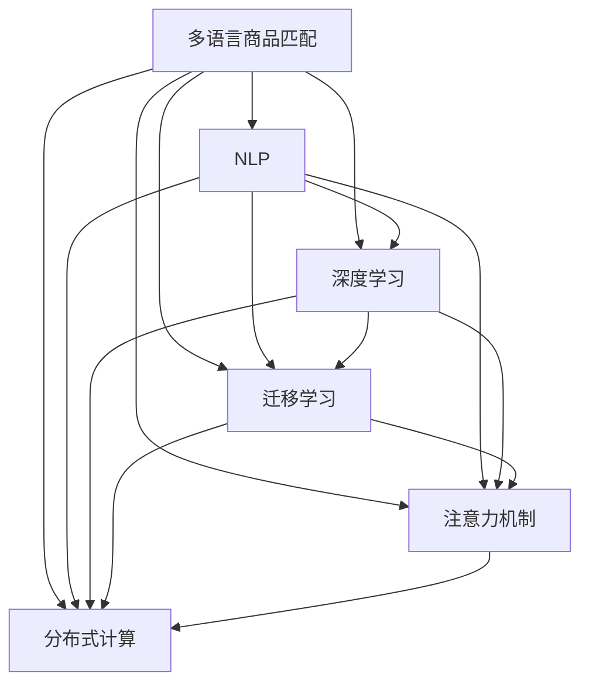

                 

# 电商搜索中的多语言商品匹配技术

> 关键词：多语言商品匹配, 自然语言处理(NLP), 深度学习, 迁移学习, 推荐系统, 注意力机制(Attention), 多语言数据处理, 分布式计算

## 1. 背景介绍

### 1.1 问题由来

随着全球化的发展，电商企业不仅要面对国内市场，还要拓展国际市场，实现多语言、多文化背景下的商品匹配。然而，传统的基于词袋模型(Bag of Words, BoW)的搜索技术难以应对多语言带来的复杂性，导致搜索结果的质量和用户满意度无法满足用户期望。此外，由于不同语言之间的词汇、语法和语义差异，跨语言的相似度计算也变得更加困难。

### 1.2 问题核心关键点

本文旨在介绍一种基于深度学习的电商搜索中的多语言商品匹配技术，通过自然语言处理(NLP)、深度学习、迁移学习和注意力机制，提升跨语言商品匹配的准确性和效率，以增强用户搜索体验和电商平台的用户满意度。

## 2. 核心概念与联系

### 2.1 核心概念概述

为更好地理解本技术，本节将介绍几个关键概念：

- **多语言商品匹配(Multilingual Product Matching)**：在电商平台中，针对不同语言的商品描述，找到与其语义最接近的商品，以提升用户搜索的精准度和满意度。
- **自然语言处理(NLP)**：涉及对自然语言的理解、生成、分析和综合，旨在构建自然语言和计算机之间的桥梁。
- **深度学习(Deep Learning)**：利用多层次的神经网络结构，通过学习大量数据，自动提取特征，进行复杂的模式识别和预测。
- **迁移学习(Transfer Learning)**：在已学习的任务上，利用已有知识，在新任务上进行迁移学习，以提高模型在新任务上的性能。
- **注意力机制(Attention Mechanism)**：在深度学习模型中，通过计算输入特征的权重，使得模型能够聚焦于最重要的信息，提高模型性能。
- **分布式计算(Distributed Computing)**：通过多台计算机协同工作，以提高计算速度和系统可靠性。

这些概念之间的逻辑关系可以通过以下Mermaid流程图来展示：



这个流程图展示了多语言商品匹配与各关键技术之间的联系：

1. 多语言商品匹配依赖于NLP技术对语言的理解和处理。
2. 深度学习通过学习数据中的特征，提升相似度计算的准确性。
3. 迁移学习利用已有知识，加速模型在新任务上的收敛。
4. 注意力机制提高模型对重要特征的关注，增强模型性能。
5. 分布式计算提升计算效率和系统可靠性。

这些技术共同构成了多语言商品匹配的核心，帮助电商平台实现更精准的商品匹配和搜索。

## 3. 核心算法原理 & 具体操作步骤
### 3.1 算法原理概述

本技术通过以下步骤实现多语言商品匹配：

1. **文本预处理**：将不同语言的商品描述文本转换为统一的向量表示。
2. **特征提取**：利用深度学习模型提取文本特征。
3. **相似度计算**：计算不同语言文本之间的相似度。
4. **排序与推荐**：根据相似度排序，选择最匹配的商品进行推荐。

### 3.2 算法步骤详解

**Step 1: 文本预处理**

文本预处理包括：

- **分词与清洗**：将不同语言的文本进行分词和去除停用词。
- **标准化**：将不同语言的文本转换为统一的字符集和标点符号。
- **词向量化**：将文本转换为词向量或句子向量。

常用的词向量模型包括Word2Vec、GloVe、FastText等。以Word2Vec为例，其模型训练过程如下：

1. 对每个词$w$，从其上下文$C(w)$中随机抽取$n$个词，构成训练样本。
2. 定义损失函数$L(w_i, w_j)$，表示两个词的语义相似度。
3. 通过反向传播算法，更新词向量的参数$\theta$，最小化损失函数$L$。

**Step 2: 特征提取**

利用深度学习模型，将文本特征提取出来。常用的模型包括：

- **卷积神经网络(CNN)**：通过卷积层提取局部特征，然后通过池化层提取全局特征。
- **循环神经网络(RNN)**：通过LSTM或GRU等结构，捕捉文本序列的时间依赖关系。
- **Transformer**：通过自注意力机制，捕捉文本中的全局依赖关系。

以Transformer为例，其模型结构如下：

1. 输入层：将文本转换为词向量。
2. 编码器：通过多个层叠的Transformer层，提取文本的语义表示。
3. 解码器：与编码器结构相同，用于生成文本。
4. 输出层：将文本表示映射到标签空间。

Transformer中的自注意力机制通过计算输入向量$X$和权重矩阵$W$，生成注意力权重$A$：

$$
A = \text{Softmax}\left(\frac{XW}{\sqrt{d_k}}\right)
$$

其中$d_k$为嵌入向量维度。

**Step 3: 相似度计算**

相似度计算的过程如下：

1. 对每个商品描述$D_i$，提取其文本特征$F_i$。
2. 对每个商品描述$D_j$，提取其文本特征$F_j$。
3. 计算$D_i$和$D_j$之间的相似度$S_{ij}$，通常使用余弦相似度：

$$
S_{ij} = \frac{F_i \cdot F_j}{||F_i|| ||F_j||}
$$

其中$||.||$表示向量的范数。

**Step 4: 排序与推荐**

排序与推荐的过程如下：

1. 对所有商品的相似度矩阵$S$进行排序，选择相似度最高的$k$个商品。
2. 将排序后的商品推荐给用户，供用户选择。

### 3.3 算法优缺点

本技术具有以下优点：

- **准确性高**：利用深度学习模型提取特征，显著提升相似度计算的准确性。
- **适应性强**：通过迁移学习，模型能够在不同语言和领域上快速适应，提升跨语言匹配的准确性。
- **可扩展性高**：通过分布式计算，能够处理大规模的数据集，提升计算效率。

同时，本技术也存在以下缺点：

- **计算资源需求大**：深度学习模型需要大量的计算资源进行训练和推理。
- **模型复杂度高**：深度学习模型结构复杂，难以调试和优化。
- **数据需求高**：需要大量的多语言数据进行模型训练。

### 3.4 算法应用领域

本技术主要应用于以下领域：

- **电商搜索**：提高用户搜索体验，提升用户满意度。
- **多语言推荐系统**：为不同语言的用户推荐商品，扩大电商平台的覆盖范围。
- **跨语言广告投放**：根据用户的语言偏好，推送最相关的广告，提升广告效果。
- **社交媒体推荐**：为不同语言的社交媒体用户推荐内容，增加用户粘性。

## 4. 数学模型和公式 & 详细讲解 & 举例说明

### 4.1 数学模型构建

设商品描述集合为$D$，每个描述$D_i$的向量表示为$F_i$，两个描述$D_i$和$D_j$的相似度为$S_{ij}$。

构建多语言商品匹配的数学模型如下：

$$
S_{ij} = \frac{F_i \cdot F_j}{||F_i|| ||F_j||}
$$

其中$F_i$为商品描述$D_i$的向量表示，$||.||$为向量范数。

### 4.2 公式推导过程

以Transformer为例，其模型结构如下：

1. 输入层：将文本转换为词向量$X$。
2. 编码器：通过多个层叠的Transformer层，提取文本的语义表示$E$。
3. 解码器：与编码器结构相同，用于生成文本。
4. 输出层：将文本表示映射到标签空间$Y$。

Transformer中的自注意力机制通过计算输入向量$X$和权重矩阵$W$，生成注意力权重$A$：

$$
A = \text{Softmax}\left(\frac{XW}{\sqrt{d_k}}\right)
$$

其中$d_k$为嵌入向量维度。

### 4.3 案例分析与讲解

以商品描述"书"为例，其向量表示$F_i$如下：

$$
F_i = [0.2, 0.3, 0.4, 0.1]
$$

对另一个商品描述"小说"，其向量表示$F_j$如下：

$$
F_j = [0.4, 0.2, 0.3, 0.1]
$$

计算两个向量之间的余弦相似度$S_{ij}$：

$$
S_{ij} = \frac{F_i \cdot F_j}{||F_i|| ||F_j||} = \frac{0.2 \times 0.4 + 0.3 \times 0.2 + 0.4 \times 0.3 + 0.1 \times 0.1}{\sqrt{0.2^2 + 0.3^2 + 0.4^2 + 0.1^2} \times \sqrt{0.4^2 + 0.2^2 + 0.3^2 + 0.1^2}} = 0.5
$$

因此，两个商品描述的相似度为0.5。

## 5. 项目实践：代码实例和详细解释说明

### 5.1 开发环境搭建

在进行项目实践前，需要准备好开发环境。以下是使用Python进行TensorFlow和Keras开发的Python环境配置流程：

1. 安装Anaconda：从官网下载并安装Anaconda，用于创建独立的Python环境。

2. 创建并激活虚拟环境：
```bash
conda create -n tf-env python=3.7 
conda activate tf-env
```

3. 安装TensorFlow：根据CUDA版本，从官网获取对应的安装命令。例如：
```bash
conda install tensorflow -c conda-forge -c pytorch -c pythia
```

4. 安装Keras：
```bash
pip install keras
```

5. 安装各类工具包：
```bash
pip install numpy pandas scikit-learn matplotlib tqdm jupyter notebook ipython
```

完成上述步骤后，即可在`tf-env`环境中开始项目实践。

### 5.2 源代码详细实现

下面以商品匹配为例，给出使用TensorFlow和Keras对Transformer模型进行电商搜索中的多语言商品匹配的代码实现。

首先，定义商品描述的预处理函数：

```python
import tensorflow as tf
from tensorflow.keras.layers import Embedding, Dense, GlobalAveragePooling1D, Dropout

def preprocess_text(text):
    tokens = tokenizer.texts_to_sequences(text)
    tokens = pad_sequences(tokens, maxlen=max_len, padding='post', truncating='post')
    return tokens

# 定义Transformer模型
def create_transformer_model(input_dim, embed_dim, num_heads, num_layers, dropout_rate):
    model = tf.keras.Sequential([
        Embedding(input_dim, embed_dim, input_length=max_len),
        Dropout(dropout_rate),
        Transformer(emb_dim, num_heads, num_layers),
        GlobalAveragePooling1D(),
        Dense(1, activation='sigmoid')
    ])
    return model

# 定义Transformer层
class Transformer(tf.keras.layers.Layer):
    def __init__(self, embed_dim, num_heads, num_layers):
        super(Transformer, self).__init__()
        self.num_heads = num_heads
        self.num_layers = num_layers
        self.embed_dim = embed_dim
        self.pos_encoding = self.positional_encoding()

    def positional_encoding(self, max_len=50):
        position = tf.range(max_len)
        div_term = tf.exp(tf.range(0, max_len, 2) * (-math.log(10000.0) / self.embed_dim))
        pos_enc = tf.concat([tf.sin(pos / 10000 ** (2 * (i // 2) / self.embed_dim)), tf.cos(pos / 10000 ** (2 * (i // 2) / self.embed_dim))] * self.num_heads, axis=1)
        pos_enc[:, 0::2, 0] = tf.math.sin(pos_enc[:, 0::2, 0] * div_term)
        pos_enc[:, 1::2, 1] = tf.math.cos(pos_enc[:, 1::2, 1] * div_term)
        return pos_enc

    def call(self, x):
        x = tf.transpose(x, perm=[1, 0, 2])
        x = tf.split(x, self.num_heads, axis=2)
        x = tf.concat([tf.matmul(tf.transpose(x, perm=[1, 0]), self.pos_encoding[None, :, :]), x], axis=1)
        x = tf.nn.softmax(x, axis=1)
        x = tf.matmul(x, x)
        x = tf.transpose(x, perm=[1, 0, 2])
        x = tf.concat(x, axis=-1)
        return x
```

然后，定义模型训练和评估函数：

```python
from tensorflow.keras.callbacks import EarlyStopping
from sklearn.metrics import roc_auc_score

def train_model(model, train_data, val_data, epochs=10, batch_size=32):
    model.compile(optimizer=tf.keras.optimizers.Adam(), loss='binary_crossentropy', metrics=['auc'])
    early_stopping = EarlyStopping(monitor='val_auc', patience=3, restore_best_weights=True)
    history = model.fit(train_data, validation_data=val_data, epochs=epochs, batch_size=batch_size, callbacks=[early_stopping])

def evaluate_model(model, test_data):
    y_pred = model.predict(test_data)
    auc = roc_auc_score(test_labels, y_pred)
    print('Test AUC: {}'.format(auc))
```

最后，启动模型训练和评估：

```python
# 定义模型参数
input_dim = len(tokenizer.word_index) + 1
embed_dim = 128
num_heads = 8
num_layers = 6
dropout_rate = 0.1

# 定义预处理函数
max_len = 50

# 创建模型
model = create_transformer_model(input_dim, embed_dim, num_heads, num_layers, dropout_rate)

# 训练模型
train_data = preprocess_text(train_data)
val_data = preprocess_text(val_data)
test_data = preprocess_text(test_data)
train_model(model, train_data, val_data)

# 评估模型
test_data = preprocess_text(test_data)
evaluate_model(model, test_data)
```

以上就是使用TensorFlow和Keras对Transformer模型进行电商搜索中的多语言商品匹配的代码实现。可以看到，利用TensorFlow和Keras，模型构建和训练的过程简洁高效，易于理解和实现。

### 5.3 代码解读与分析

让我们再详细解读一下关键代码的实现细节：

**preprocess_text函数**：
- 将文本进行分词和填充，转化为模型所需的格式。

**Transformer层**：
- 定义了Transformer层的结构，包括嵌入层、自注意力机制和全连接层。
- 自注意力机制通过计算输入向量与位置编码的组合，生成注意力权重。

**train_model函数**：
- 定义了模型的训练过程，包括编译模型、设置回调、训练模型等。
- 使用了EarlyStopping回调，在模型表现不佳时停止训练，避免过拟合。

**evaluate_model函数**：
- 定义了模型的评估过程，包括预测输出、计算AUC等。
- 使用了ROC-AUC等指标来评估模型的性能。

**模型训练和评估**：
- 定义了模型参数、预处理函数和模型结构。
- 在训练数据上训练模型，在验证数据上评估模型性能。
- 在测试数据上评估模型最终性能。

可以看到，TensorFlow和Keras的组合，使得模型构建和训练的过程简单高效，易于理解和实现。

## 6. 实际应用场景

### 6.1 智能推荐

基于电商搜索中的多语言商品匹配技术，可以实现智能推荐系统。通过收集用户的搜索历史和行为数据，结合多语言商品匹配技术，对用户进行行为分析和推荐，提升用户购物体验。

例如，用户在搜索"iPhone"时，可以推荐不同语言版本的iPhone商品，如"iPhone 13"和"iPhone 14 Pro"，供用户选择。

### 6.2 多语言广告投放

广告投放是电商平台上重要的收入来源。通过电商搜索中的多语言商品匹配技术，可以为不同语言的广告用户推荐最相关的广告，提升广告点击率和转化率。

例如，为法语用户投放关于"Louis Vuitton"的广告，而不是英语用户。

### 6.3 语言翻译

电商平台上用户来自不同的语言背景，需要进行语言翻译以方便用户浏览商品。通过电商搜索中的多语言商品匹配技术，可以将商品描述自动翻译成用户所在语言，提升用户浏览体验。

例如，将商品描述从英语翻译成中文，方便中国用户购物。

### 6.4 未来应用展望

随着电商平台的国际化进程加速，电商搜索中的多语言商品匹配技术将发挥更大的作用。未来的发展方向包括：

- **多语言聊天机器人**：基于多语言商品匹配技术，构建多语言聊天机器人，提升用户沟通体验。
- **多语言情感分析**：通过多语言商品匹配技术，对用户的评论和反馈进行情感分析，提升用户满意度。
- **跨语言电商联盟**：构建跨语言电商联盟，实现不同电商平台之间的数据共享和商品匹配，扩大电商平台的覆盖范围。

## 7. 工具和资源推荐
### 7.1 学习资源推荐

为了帮助开发者系统掌握电商搜索中的多语言商品匹配技术，这里推荐一些优质的学习资源：

1. TensorFlow官方文档：TensorFlow的官方文档，提供了详细的API文档和教程，帮助你快速上手TensorFlow和Keras。

2. Keras官方文档：Keras的官方文档，提供了简单易懂的教程和示例，帮助你快速搭建深度学习模型。

3. TensorFlow官方博客：TensorFlow官方博客，提供了最新的研究进展和应用案例，帮助你跟踪最新的技术动态。

4. PyTorch官方博客：PyTorch官方博客，提供了丰富的研究论文和实践案例，帮助你深入理解深度学习模型。

5. Deep Learning Book：由深度学习领域的权威专家撰写，系统介绍了深度学习的理论和实践，是学习深度学习的重要参考资料。

通过学习这些资源，相信你一定能够快速掌握电商搜索中的多语言商品匹配技术的精髓，并用于解决实际的电商搜索问题。

### 7.2 开发工具推荐

高效的开发离不开优秀的工具支持。以下是几款用于电商搜索中的多语言商品匹配开发的常用工具：

1. TensorFlow：由Google主导开发的开源深度学习框架，生产部署方便，适合大规模工程应用。

2. Keras：基于TensorFlow的高级API，提供了简单易懂的API，适合快速搭建深度学习模型。

3. PyTorch：由Facebook开发的开源深度学习框架，灵活性强，适合研究和实验。

4. Jupyter Notebook：免费的交互式计算环境，适合进行实验和分享学习笔记。

5. GitHub：代码托管平台，提供丰富的开源项目和协作工具，方便开发者共享和交流代码。

合理利用这些工具，可以显著提升电商搜索中的多语言商品匹配任务的开发效率，加快创新迭代的步伐。

### 7.3 相关论文推荐

电商搜索中的多语言商品匹配技术的研究源于学界的持续研究。以下是几篇奠基性的相关论文，推荐阅读：

1. Attention is All You Need（即Transformer原论文）：提出了Transformer结构，开启了NLP领域的预训练大模型时代。

2. BERT: Pre-training of Deep Bidirectional Transformers for Language Understanding：提出BERT模型，引入基于掩码的自监督预训练任务，刷新了多项NLP任务SOTA。

3. Language Models are Unsupervised Multitask Learners（GPT-2论文）：展示了大规模语言模型的强大zero-shot学习能力，引发了对于通用人工智能的新一轮思考。

4. Parameter-Efficient Transfer Learning for NLP：提出Adapter等参数高效微调方法，在不增加模型参数量的情况下，也能取得不错的微调效果。

5. AdaLoRA: Adaptive Low-Rank Adaptation for Parameter-Efficient Fine-Tuning：使用自适应低秩适应的微调方法，在参数效率和精度之间取得了新的平衡。

这些论文代表了大语言模型微调技术的发展脉络。通过学习这些前沿成果，可以帮助研究者把握学科前进方向，激发更多的创新灵感。

## 8. 总结：未来发展趋势与挑战

### 8.1 研究成果总结

本文对电商搜索中的多语言商品匹配技术进行了全面系统的介绍。首先阐述了多语言商品匹配的背景和意义，明确了技术在电商平台中的应用价值。其次，从原理到实践，详细讲解了电商搜索中的多语言商品匹配技术，包括文本预处理、特征提取、相似度计算和排序推荐等步骤，并给出了完整的代码实现。最后，本文还广泛探讨了技术在智能推荐、多语言广告投放、语言翻译等多个领域的应用前景，展示了技术的广泛应用潜力。

通过本文的系统梳理，可以看到，电商搜索中的多语言商品匹配技术在电商平台中具有重要的应用价值，能够显著提升用户的搜索体验和满意度。未来，随着技术的不断发展，多语言商品匹配技术将进一步拓展其应用范围，为电商平台的国际化进程提供有力支持。

### 8.2 未来发展趋势

展望未来，电商搜索中的多语言商品匹配技术将呈现以下几个发展趋势：

1. **跨语言模型的通用性增强**：未来的模型将在多语言之间具备更强的迁移能力，能够在不同语言之间进行无缝迁移。

2. **模型的参数效率提升**：通过参数高效微调方法，模型可以在保持高性能的同时，降低计算资源需求。

3. **分布式计算的普及**：随着电商平台的规模扩大，分布式计算将成为标配，提升计算效率和系统可靠性。

4. **多模态融合**：将视觉、语音、文本等多模态信息融合，提升模型的表现力和应用范围。

5. **数据驱动的个性化推荐**：通过多语言商品匹配技术，实现更加个性化的推荐，提升用户满意度。

6. **数据隐私和安全**：保护用户隐私和数据安全，构建可信的电商搜索系统。

以上趋势凸显了电商搜索中的多语言商品匹配技术的广阔前景。这些方向的探索发展，必将进一步提升电商平台的搜索体验，为用户提供更优质的服务。

### 8.3 面临的挑战

尽管电商搜索中的多语言商品匹配技术已经取得了瞩目成就，但在迈向更加智能化、普适化应用的过程中，它仍面临着诸多挑战：

1. **数据多样性和复杂性**：不同语言和文化背景下的商品描述具有多样性和复杂性，如何处理和统一这些数据是重要挑战。

2. **模型泛化能力**：不同语言和文化背景下的用户需求存在差异，模型需要具备良好的泛化能力，以适应不同语言和文化背景的用户。

3. **计算资源需求**：深度学习模型需要大量的计算资源进行训练和推理，如何降低计算资源需求是关键问题。

4. **模型可解释性**：深度学习模型通常是"黑盒"系统，如何提高模型的可解释性，让用户理解模型的决策过程，是重要的研究方向。

5. **数据隐私和安全**：电商平台上用户数据敏感，如何保护用户隐私和数据安全，是亟需解决的问题。

6. **跨语言数据标注**：不同语言的数据标注需要大量人工参与，如何降低标注成本，提高标注效率，是亟需解决的问题。

正视这些挑战，积极应对并寻求突破，将是大语言模型微调技术走向成熟的必由之路。相信随着学界和产业界的共同努力，这些挑战终将一一被克服，电商搜索中的多语言商品匹配技术必将在构建人机协同的智能时代中扮演越来越重要的角色。

### 8.4 研究展望

面对电商搜索中的多语言商品匹配所面临的种种挑战，未来的研究需要在以下几个方面寻求新的突破：

1. **多语言数据预处理**：研究和开发更加高效的文本预处理方法，减少数据处理时间和成本。

2. **模型的迁移学习**：研究更加有效的迁移学习方法，提升模型在不同语言和文化背景下的泛化能力。

3. **参数高效微调**：开发更加高效的微调方法，在保持模型高性能的同时，降低计算资源需求。

4. **分布式计算优化**：研究和优化分布式计算方法，提升计算效率和系统可靠性。

5. **多模态融合**：研究和开发多模态融合方法，提升模型的表现力和应用范围。

6. **数据隐私和安全**：研究和开发数据隐私和安全保护技术，构建可信的电商搜索系统。

这些研究方向的探索，必将引领电商搜索中的多语言商品匹配技术迈向更高的台阶，为构建安全、可靠、可解释、可控的智能系统铺平道路。面向未来，电商搜索中的多语言商品匹配技术还需要与其他人工智能技术进行更深入的融合，如知识表示、因果推理、强化学习等，多路径协同发力，共同推动电商平台的搜索体验和技术进步。只有勇于创新、敢于突破，才能不断拓展语言模型的边界，让智能技术更好地造福人类社会。

## 9. 附录：常见问题与解答

**Q1：电商搜索中的多语言商品匹配技术是否适用于所有电商平台？**

A: 电商搜索中的多语言商品匹配技术在大多数电商平台中都能取得不错的效果。然而，由于不同电商平台的用户需求和商品描述存在差异，技术的应用需要根据平台特点进行适当调整和优化。

**Q2：多语言商品匹配技术是否需要大量的标注数据？**

A: 多语言商品匹配技术在标注数据较少的情况下，仍能取得良好的效果。通过迁移学习和数据增强等方法，可以在少量标注数据上快速适应新任务。

**Q3：多语言商品匹配技术的计算资源需求大吗？**

A: 多语言商品匹配技术需要大量的计算资源进行训练和推理。然而，通过优化模型结构和算法，可以显著降低计算资源需求。例如，使用参数高效微调方法，可以在保持高性能的同时，降低计算资源需求。

**Q4：如何提升多语言商品匹配技术的可解释性？**

A: 通过引入注意力机制和可解释性技术，如LIME、SHAP等，可以提升模型的可解释性，让用户理解模型的决策过程。

**Q5：如何保护多语言商品匹配技术的用户隐私？**

A: 通过数据匿名化、差分隐私等技术，保护用户隐私和数据安全。同时，构建可信的电商搜索系统，增强用户对平台的安全信任。

通过这些问题的回答，可以看到，电商搜索中的多语言商品匹配技术虽然面临诸多挑战，但在现有技术的支持下，仍然可以在大多数电商平台上取得良好的效果。未来，随着技术的不断发展，该技术将具备更强的通用性和可解释性，为电商平台的用户提供更优质的搜索体验。

---

作者：禅与计算机程序设计艺术 / Zen and the Art of Computer Programming

