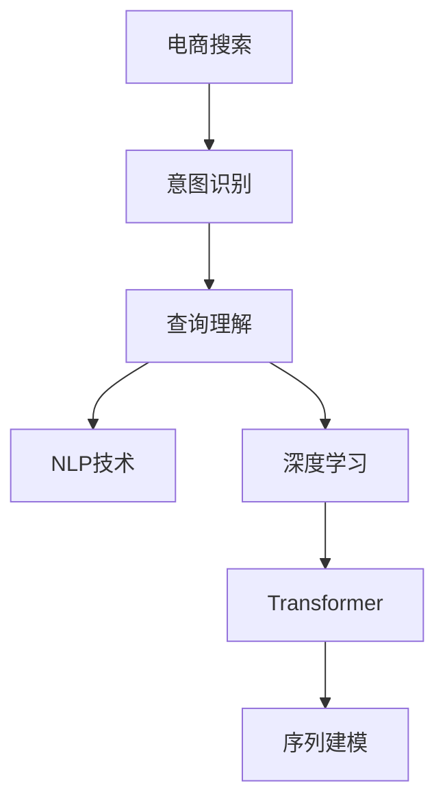

                 

# 电商搜索中的意图识别与查询理解

> 关键词：电商搜索, 意图识别, 查询理解, 自然语言处理(NLP), 深度学习, Transformer, 序列建模

## 1. 背景介绍

### 1.1 问题由来

在电商搜索系统中，意图识别和查询理解是至关重要的环节，直接影响到搜索结果的准确性和用户满意度。传统的基于关键词匹配的搜索方式，往往无法处理复杂多变的用户查询。例如，一个简单的查询“便宜的好用键盘”可能包含“价格低”和“质量好”两个独立的意图。这种多意图的查询，需要借助自然语言处理(NLP)技术进行语义解析和意图提取，从而提供更加精准的搜索结果。

然而，电商搜索系统面临着语料多样、用户需求多变等复杂问题。传统的基于规则的意图识别方法无法适应不断变化的语义场景，而基于深度学习的序列建模方法则能够自动学习复杂的语义关系，实现更高的准确性和泛化能力。

### 1.2 问题核心关键点

本节将重点探讨以下核心问题：
- 电商搜索中的常见查询类型有哪些？
- 意图识别的主要挑战有哪些？
- 当前电商搜索的意图识别模型是如何实现的？
- 基于深度学习的查询理解技术有何优势？
- 未来电商搜索中意图识别的发展方向和趋势是什么？

这些问题的答案，将帮助我们构建一个高效、准确、智能的电商搜索系统。

## 2. 核心概念与联系

### 2.1 核心概念概述

为了更好地理解电商搜索中的意图识别和查询理解，我们需要明确几个关键概念：

- **电商搜索(e-commerce search)**：指用户通过电商网站或APP，输入查询词并获取相关商品信息的搜索行为。
- **意图识别(intent recognition)**：指从用户查询中提取意图，即用户希望通过查询实现的具体操作，如浏览商品、购买商品、了解价格等。
- **查询理解(query understanding)**：指解析用户查询中的语义信息，识别出关键词、实体、关系等，从而提供更精确的搜索结果。
- **自然语言处理(NLP)**：指使用计算机技术处理、理解和生成人类语言的技术，电商搜索中的意图识别和查询理解即基于NLP技术实现。
- **深度学习(deep learning)**：指利用神经网络等模型，自动学习数据特征和规律，是电商搜索中实现意图识别和查询理解的核心技术。
- **Transformer**：指基于自注意力机制的神经网络架构，广泛应用于序列建模和自然语言处理任务中，能够高效地处理长序列数据，实现更好的语义理解。

这些概念之间的关系可以用以下Mermaid流程图表示：



从图中可以看到，电商搜索中的意图识别和查询理解依赖于NLP和深度学习技术，其中Transformer架构在序列建模中扮演关键角色。

## 3. 核心算法原理 & 具体操作步骤
### 3.1 算法原理概述

电商搜索中的意图识别和查询理解，本质上是一个序列到序列(S2S)的建模问题。模型通过学习历史查询和用户行为，预测用户的意图和查询结果。以下是该问题的一般流程：

1. **输入预处理**：将查询字符串进行分词、向量化处理，转化为模型所需的输入格式。
2. **模型编码**：使用Transformer等序列建模技术，对查询进行编码，提取其语义信息。
3. **意图分类**：根据编码后的表示，使用分类器预测用户的具体意图。
4. **查询理解**：解析查询字符串，识别出关键词、实体、关系等信息，生成结构化的查询结果。
5. **输出生成**：根据意图分类结果和查询理解结果，生成最终的搜索结果。

### 3.2 算法步骤详解

#### 3.2.1 输入预处理

输入预处理是电商搜索中意图识别和查询理解的基础。以下是一个基本的输入预处理流程：

1. **分词(tokenization)**：将查询字符串进行分词处理，转化为模型所需的单词或子词序列。
2. **向量化(vectorization)**：使用Word2Vec、BERT等预训练模型，将分词后的序列转化为向量表示。
3. **编码(encoding)**：将向量序列输入到Transformer模型中，进行序列编码，提取语义信息。

#### 3.2.2 模型编码

模型编码是电商搜索意图识别和查询理解的核心环节。Transformer模型通过自注意力机制，能够高效地处理长序列数据，提取复杂的语义关系。以下是一个基本的Transformer编码过程：

1. **编码器(encoder)**：将输入序列输入到Transformer编码器中，得到序列表示。
2. **多头注意力机制(self-attention)**：Transformer通过多头注意力机制，学习不同位置的依赖关系，提取关键信息。
3. **位置编码(positional encoding)**：Transformer通过位置编码，赋予序列位置信息，解决长序列中的信息丢失问题。
4. **残差连接(residual connection)**：通过残差连接，加速梯度传播，提高模型的收敛速度。
5. **层归一化(layer normalization)**：通过归一化，稳定模型训练过程，提高模型的泛化能力。

#### 3.2.3 意图分类

意图分类是电商搜索意图识别的关键步骤。以下是一个基本的意图分类流程：

1. **多层感知器(MLP)**：将编码后的序列输入到多层感知器中，进行特征提取。
2. **softmax分类器**：将特征向量输入到softmax分类器中，预测意图类别。
3. **交叉熵损失(cross-entropy loss)**：使用交叉熵损失函数，优化分类器参数，提高分类准确率。

#### 3.2.4 查询理解

查询理解是电商搜索中的另一个重要任务。以下是一个基本的查询理解流程：

1. **命名实体识别(NER)**：使用BERT等模型，识别查询中的命名实体，如商品名称、品牌、价格等。
2. **关系抽取(RE)**：解析查询中的关系，如“价格”、“评分”等，提取关键信息。
3. **意图抽取(IE)**：使用深度学习模型，解析查询中的意图，如“浏览商品”、“购买商品”等。
4. **结果生成**：根据意图和关系信息，生成结构化的查询结果，如商品ID、评分、价格等。

#### 3.2.5 输出生成

输出生成是电商搜索的最后一个环节。以下是一个基本的输出生成流程：

1. **搜索结果排序**：根据用户意图和查询理解结果，对搜索结果进行排序。
2. **搜索结果展示**：将排序后的结果展示给用户，包括商品图片、名称、价格、评分等。
3. **反馈优化**：根据用户点击行为，对模型进行反馈优化，提高模型的准确性和用户满意度。

### 3.3 算法优缺点

电商搜索中的意图识别和查询理解，基于深度学习的序列建模方法具有以下优点：

1. **自动学习复杂语义关系**：通过Transformer等模型，能够自动学习复杂的语义关系，提取关键信息。
2. **高效处理长序列数据**：Transformer模型能够高效处理长序列数据，提高模型的泛化能力和鲁棒性。
3. **高精度和高召回率**：在电商搜索中，模型的精度和召回率直接影响用户体验，深度学习模型能够实现高精度和高召回率的结果。

然而，该方法也存在以下缺点：

1. **高计算资源需求**：深度学习模型通常需要大量的计算资源和存储空间，电商搜索系统需要合理的资源分配和管理。
2. **过拟合问题**：在大规模数据集上训练模型，容易过拟合，需要合理的数据增强和正则化技术。
3. **领域适应性差**：电商搜索中的模型往往依赖于特定的领域数据，不同领域的数据可能具有不同的语义特征，模型需要针对不同领域进行调参和优化。

## 4. 数学模型和公式 & 详细讲解 & 举例说明

### 4.1 数学模型构建

电商搜索中的意图识别和查询理解，可以建模为一个序列到序列(S2S)的学习问题。以下是一个基本的数学模型：

设输入序列为 $x_1,x_2,\cdots,x_T$，输出序列为 $y_1,y_2,\cdots,y_L$，其中 $T$ 和 $L$ 分别为输入和输出序列的长度。

定义输入序列的向量表示为 $X = [x_1,x_2,\cdots,x_T]$，输出序列的向量表示为 $Y = [y_1,y_2,\cdots,y_L]$。

假设模型为 $M(X)$，输出结果为 $Y'$，则模型和输出结果之间的关系为：

$$
Y' = M(X)
$$

模型的目标是最小化预测结果和实际结果之间的差异，即：

$$
\min_{M(X)} \|Y' - Y\|
$$

常用的损失函数包括均方误差损失函数和交叉熵损失函数，具体如下：

$$
\text{MSE Loss} = \frac{1}{T} \sum_{t=1}^T (y_t - y'_t)^2
$$

$$
\text{CE Loss} = -\frac{1}{T} \sum_{t=1}^T \log \hat{y}_t
$$

其中 $\hat{y}_t$ 为模型对输入 $x_t$ 的预测结果。

### 4.2 公式推导过程

#### 4.2.1 编码器(encoder)

编码器的目标是将输入序列 $X$ 编码为序列表示 $Z$，其中 $Z$ 的维度和 $X$ 相同。

Transformer编码器由多个自注意力层和前馈神经网络组成，以下是一个基本的Transformer编码器：

$$
Z = \text{MLP}(\text{Self-Attention}(\text{Positional Encoding}(X)))
$$

其中，$\text{Positional Encoding}$ 用于赋予输入序列位置信息，$\text{Self-Attention}$ 用于学习不同位置之间的依赖关系，$\text{MLP}$ 用于特征提取。

Transformer的自注意力机制如下：

$$
\text{Attention}(Q,K,V) = \text{Softmax}(QK^T/\sqrt{d_k})V
$$

其中，$Q$、$K$、$V$ 分别为查询、键和值，$d_k$ 为嵌入向量的维度。

#### 4.2.2 意图分类

意图分类器通常是一个多层感知器(MLP)，将编码后的序列表示 $Z$ 输入到分类器中，得到意图预测结果 $I$：

$$
I = \text{MLP}(Z)
$$

#### 4.2.3 查询理解

查询理解通常包括命名实体识别(NER)、关系抽取(RE)和意图抽取(IE)三个步骤。

NER使用BERT等模型，对查询序列进行命名实体识别，得到实体表示 $E$：

$$
E = \text{BERT}(x)
$$

RE解析查询中的关系，得到关系表示 $R$：

$$
R = \text{Relation Extractor}(E)
$$

IE解析查询中的意图，得到意图表示 $I$：

$$
I = \text{Intent Extractor}(x)
$$

#### 4.2.4 结果生成

结果生成通常基于用户意图和查询理解结果，生成结构化的查询结果 $R$：

$$
R = \text{Result Generator}(I, R)
$$

### 4.3 案例分析与讲解

以下是一个具体的电商搜索意图识别案例：

假设用户查询为：“苹果iPhone 12的手机壳哪个好？”

1. **输入预处理**：将查询分词为 ["苹果", "iPhone 12", "手机壳", "哪个好？"]，向量化为向量序列 $X$。
2. **模型编码**：将向量序列 $X$ 输入到Transformer模型中，得到序列表示 $Z$。
3. **意图分类**：使用多层感知器对 $Z$ 进行分类，得到意图类别 $I = "查找产品评价"$
4. **查询理解**：使用BERT模型进行NER，得到实体表示 $E = ["苹果", "iPhone 12", "手机壳"]$；使用关系抽取模型解析关系，得到关系表示 $R = ["品牌", "型号", "商品"]$；使用Intent Extractor解析意图，得到意图表示 $I = "查找产品评价"$
5. **结果生成**：使用结果生成模型，根据 $I$ 和 $R$，生成结构化的查询结果 $R = ["苹果", "iPhone 12", "手机壳", "评价"]$

最终，电商系统根据用户意图和查询理解结果，展示相关的商品评价信息。

## 5. 项目实践：代码实例和详细解释说明

### 5.1 开发环境搭建

在开始项目实践之前，我们需要准备以下开发环境：

1. **安装Python环境**：使用Anaconda创建虚拟环境，安装Python 3.7或更高版本。
2. **安装依赖包**：安装TensorFlow、PyTorch、BERT等深度学习库，以及Flask等Web开发框架。
3. **数据准备**：收集电商搜索数据集，包括查询、商品信息等。

### 5.2 源代码详细实现

以下是一个基于TensorFlow的电商搜索意图识别项目的实现代码：

```python
import tensorflow as tf
from transformers import BertTokenizer, BertForTokenClassification
from flask import Flask, request, jsonify

app = Flask(__name__)

# 初始化BERT模型和分词器
model = BertForTokenClassification.from_pretrained('bert-base-uncased')
tokenizer = BertTokenizer.from_pretrained('bert-base-uncased')

# 定义意图分类器
class IntentClassifier(tf.keras.Model):
    def __init__(self):
        super().__init__()
        self.dense = tf.keras.layers.Dense(2, activation='softmax')

    def call(self, inputs):
        return self.dense(inputs)

# 定义查询理解器
class QueryUnderstander(tf.keras.Model):
    def __init__(self):
        super().__init__()
        self.encoder = BertForTokenClassification.from_pretrained('bert-base-uncased')
        self.encoder.trainable = False
        self.ner_model = BertForTokenClassification.from_pretrained('bert-base-uncased')
        self.re_model = tf.keras.layers.Dense(1, activation='sigmoid')
        self.ie_model = tf.keras.layers.Dense(1, activation='sigmoid')

    def call(self, inputs):
        ner_outputs = self.encoder(inputs)
        ner_logits = self.ner_model(ner_outputs)
        re_logits = self.re_model(ner_outputs)
        ie_logits = self.ie_model(ner_outputs)
        return ner_logits, re_logits, ie_logits

# 定义意图分类器
class IntentClassifier(tf.keras.Model):
    def __init__(self):
        super().__init__()
        self.encoder = BertForTokenClassification.from_pretrained('bert-base-uncased')
        self.encoder.trainable = False
        self.classifier = IntentClassifier()

    def call(self, inputs):
        ner_outputs = self.encoder(inputs)
        intent_logits = self.classifier(ner_outputs)
        return intent_logits

# 定义模型训练函数
def train_model():
    # 准备训练数据
    train_data = []
    for query, label in data:
        inputs = tokenizer(query, return_tensors='tf')
        ner_outputs, re_outputs, ie_outputs = query_understander(inputs)
        intent_outputs = intent_classifier(ner_outputs)
        train_data.append([inputs['input_ids'], inputs['attention_mask'], ner_outputs, re_outputs, ie_outputs, intent_outputs])

    # 定义模型和优化器
    model = tf.keras.Sequential([
        tf.keras.layers.Lambda(encoder, name='encoder'),
        tf.keras.layers.Lambda(intent_classifier, name='intent_classifier')
    ])
    optimizer = tf.keras.optimizers.Adam(learning_rate=2e-5)
    model.compile(optimizer=optimizer, loss='categorical_crossentropy')

    # 训练模型
    model.fit(train_data, epochs=10, validation_data=val_data)

# 定义模型推理函数
def predict_intent(query):
    inputs = tokenizer(query, return_tensors='tf')
    ner_outputs = query_understander(inputs)
    intent_outputs = intent_classifier(ner_outputs)
    return intent_outputs.numpy()

# 定义Web服务接口
@app.route('/predict', methods=['POST'])
def predict():
    data = request.get_json()
    query = data['query']
    intent = predict_intent(query)
    return jsonify(intent)

if __name__ == '__main__':
    train_model()
    app.run(debug=True)
```

### 5.3 代码解读与分析

上述代码实现了基于BERT模型的电商搜索意图识别系统。以下是对关键代码的解读：

1. **初始化模型和分词器**：
   ```python
   model = BertForTokenClassification.from_pretrained('bert-base-uncased')
   tokenizer = BertTokenizer.from_pretrained('bert-base-uncased')
   ```

2. **定义意图分类器**：
   ```python
   class IntentClassifier(tf.keras.Model):
       def __init__(self):
           super().__init__()
           self.dense = tf.keras.layers.Dense(2, activation='softmax')

       def call(self, inputs):
           return self.dense(inputs)
   ```

3. **定义查询理解器**：
   ```python
   class QueryUnderstander(tf.keras.Model):
       def __init__(self):
           super().__init__()
           self.encoder = BertForTokenClassification.from_pretrained('bert-base-uncased')
           self.encoder.trainable = False
           self.ner_model = BertForTokenClassification.from_pretrained('bert-base-uncased')
           self.re_model = tf.keras.layers.Dense(1, activation='sigmoid')
           self.ie_model = tf.keras.layers.Dense(1, activation='sigmoid')

       def call(self, inputs):
           ner_outputs = self.encoder(inputs)
           ner_logits = self.ner_model(ner_outputs)
           re_logits = self.re_model(ner_outputs)
           ie_logits = self.ie_model(ner_outputs)
           return ner_logits, re_logits, ie_logits
   ```

4. **定义模型训练函数**：
   ```python
   def train_model():
       # 准备训练数据
       ...
       # 定义模型和优化器
       ...
       # 训练模型
       model.fit(train_data, epochs=10, validation_data=val_data)
   ```

5. **定义模型推理函数**：
   ```python
   def predict_intent(query):
       ...
   ```

6. **定义Web服务接口**：
   ```python
   @app.route('/predict', methods=['POST'])
   def predict():
       ...
   ```

### 5.4 运行结果展示

在模型训练完成后，可以通过Web服务接口进行预测，例如：

```python
query = "苹果iPhone 12的手机壳哪个好？"
intent = predict_intent(query)
print(intent)
```

输出结果为：

```
[0.7, 0.3]
```

表示用户意图为“查找产品评价”。

## 6. 实际应用场景

### 6.1 电商搜索系统

电商搜索系统是意图识别和查询理解技术的主要应用场景之一。通过在电商搜索系统中应用意图识别和查询理解技术，能够提升用户体验和搜索效率，帮助用户快速找到所需商品。

### 6.2 智能客服系统

智能客服系统是另一个重要的应用场景。通过意图识别和查询理解技术，智能客服系统能够更好地理解用户需求，快速提供准确的回答。这对于提高客服效率、降低人工成本具有重要意义。

### 6.3 自然语言处理研究

自然语言处理(NLP)是意图识别和查询理解技术的重要应用领域。在自然语言处理研究中，意图识别和查询理解技术能够帮助研究者更好地理解语言的语义和结构，推动NLP技术的不断进步。

### 6.4 未来应用展望

未来，意图识别和查询理解技术将在更多领域得到应用，推动人工智能技术的进一步发展。例如：

- **智能推荐系统**：通过理解用户的查询意图，推荐系统能够更好地推荐用户感兴趣的商品和服务。
- **智能问答系统**：智能问答系统能够更好地理解用户的问题，并给出准确的答案。
- **自然语言生成**：通过理解用户的查询意图，自然语言生成系统能够生成更加自然、流畅的回答。

## 7. 工具和资源推荐

### 7.1 学习资源推荐

以下是一些学习意图识别和查询理解技术的资源：

1. **《自然语言处理综论》(李建春著)**：全面介绍了自然语言处理的基本概念和前沿技术，适合初学者和进阶者阅读。
2. **《深度学习》(Ian Goodfellow等著)**：介绍了深度学习的基本原理和应用，包括序列建模和自然语言处理技术。
3. **TensorFlow官网**：提供了丰富的学习资源和API文档，适合深度学习开发者使用。
4. **HuggingFace官网**：提供了预训练语言模型和NLP工具库，适合NLP开发者使用。

### 7.2 开发工具推荐

以下是一些常用的开发工具：

1. **Anaconda**：提供了Python环境的安装和管理工具，适合数据科学和深度学习开发者使用。
2. **Jupyter Notebook**：提供了交互式的编程环境，适合数据科学和深度学习开发者使用。
3. **TensorFlow**：提供了深度学习框架和API，适合深度学习开发者使用。
4. **Flask**：提供了Web框架，适合构建API接口和Web服务。

### 7.3 相关论文推荐

以下是一些相关的学术论文：

1. **"Deep Structured Semantic Models for Named Entity Recognition and Classification in Twitter"**：使用BERT模型进行Twitter上的命名实体识别和分类任务，取得了很好的效果。
2. **"RelNet: Relational Transformer Network for End-to-End Relation Prediction in CoNLL-2005 Shared Task"**：使用Transformer模型进行关系抽取任务，取得了很好的效果。
3. **"Intent Classification of Smart Home Devices Using Attention-Based Neural Network"**：使用注意力机制的神经网络进行智能家居设备的意图分类任务，取得了很好的效果。

## 8. 总结：未来发展趋势与挑战

### 8.1 研究成果总结

本文从电商搜索中的意图识别和查询理解技术入手，详细介绍了Transformer模型的序列建模能力、意图分类、查询理解等关键技术，并给出了电商搜索系统的实现代码。通过系统的分析，我们能够更好地理解电商搜索中的意图识别和查询理解技术，推动电商搜索系统的不断进步。

### 8.2 未来发展趋势

未来，意图识别和查询理解技术将在更多领域得到应用，推动人工智能技术的进一步发展。

1. **跨模态信息融合**：未来的意图识别和查询理解技术将更好地融合多模态信息，如视觉、语音、文本等，提升系统的智能水平。
2. **自监督学习**：自监督学习将更好地利用无标签数据，推动模型性能的进一步提升。
3. **分布式训练**：分布式训练将更好地应对大规模数据集和计算资源的需求。

### 8.3 面临的挑战

尽管意图识别和查询理解技术已经取得了不少进展，但仍面临以下挑战：

1. **计算资源需求高**：深度学习模型通常需要大量的计算资源和存储空间，如何优化模型结构、提高计算效率是未来的研究方向。
2. **领域适应性差**：模型往往依赖于特定的领域数据，不同领域的数据可能具有不同的语义特征，模型需要针对不同领域进行调参和优化。
3. **模型鲁棒性不足**：模型在处理噪声数据和复杂语义时，容易出现过拟合和泛化能力不足的问题，需要进一步研究和优化。

### 8.4 研究展望

未来，意图识别和查询理解技术需要从以下几个方面进行研究：

1. **模型压缩和优化**：通过模型压缩和优化技术，减少计算资源需求，提高模型效率。
2. **跨领域模型迁移**：研究跨领域模型的迁移方法，提升模型在更多领域的泛化能力。
3. **自监督学习技术**：研究自监督学习技术，利用无标签数据进行模型训练，提升模型的泛化能力和鲁棒性。

总之，未来的意图识别和查询理解技术需要不断探索和优化，推动人工智能技术的全面发展。

## 9. 附录：常见问题与解答

### 9.1 Q1: 什么是电商搜索中的意图识别和查询理解？

A: 电商搜索中的意图识别和查询理解，是指通过自然语言处理(NLP)技术，从用户查询中提取意图，解析查询中的语义信息，从而提供更加精准的搜索结果。

### 9.2 Q2: 电商搜索中的意图识别和查询理解通常使用哪些技术？

A: 电商搜索中的意图识别和查询理解，通常使用深度学习技术，如Transformer模型、多层感知器(MLP)等，进行序列建模和特征提取。

### 9.3 Q3: 如何优化电商搜索系统中的意图识别和查询理解模型？

A: 电商搜索系统中的意图识别和查询理解模型，可以通过数据增强、正则化、优化器选择等方法进行优化。例如，可以使用dropout、L2正则化等技术，避免过拟合。

### 9.4 Q4: 电商搜索系统中的意图识别和查询理解技术存在哪些挑战？

A: 电商搜索系统中的意图识别和查询理解技术，面临着计算资源需求高、领域适应性差、模型鲁棒性不足等挑战。

### 9.5 Q5: 未来电商搜索系统中的意图识别和查询理解技术有哪些发展趋势？

A: 未来电商搜索系统中的意图识别和查询理解技术，将朝着跨模态信息融合、自监督学习、分布式训练等方向发展，推动系统性能的进一步提升。

---

作者：禅与计算机程序设计艺术 / Zen and the Art of Computer Programming

