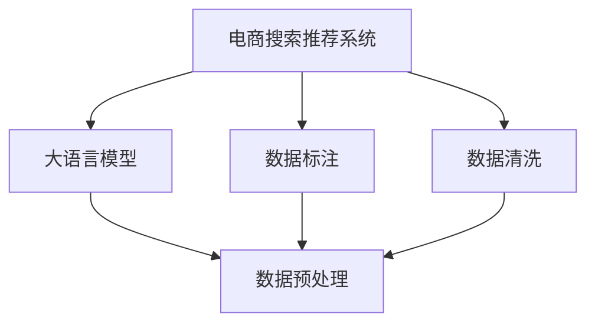

                 

# 电商搜索推荐中的AI大模型数据标注与清洗最佳实践

> 关键词：电商搜索推荐, 大语言模型, 数据标注, 数据清洗, 数据预处理, 自然语言处理(NLP)

## 1. 背景介绍

随着电商业务的迅猛发展，用户搜索和推荐系统作为提升用户体验和增加销售转化率的关键环节，面临着数据规模增大、复杂性提升等新的挑战。通过引入先进的AI大模型，电商搜索推荐系统能够更好地理解用户需求，精准匹配商品，提供个性化的购物体验。然而，数据标注和清洗作为大模型训练的基础，其准确性和效率直接影响着推荐系统的性能和可靠性。本文将详细探讨电商搜索推荐中的数据标注与清洗的最佳实践，涵盖理论基础、关键技术、案例应用及未来趋势。

## 2. 核心概念与联系

### 2.1 核心概念概述

为更好地理解电商搜索推荐中的数据标注与清洗，首先需要介绍几个关键概念：

- **电商搜索推荐系统**：通过用户输入的搜索关键词，动态调整搜索结果排序，为用户提供精准的商品推荐。
- **大语言模型**：基于深度神经网络构建的语言模型，能够进行文本生成、分类、翻译等多种自然语言处理任务。
- **数据标注**：将文本数据按照特定格式打上标签，便于模型学习。常见的标注方式包括词性标注、实体识别等。
- **数据清洗**：去除或修改数据中的噪声、冗余、错误，提高数据质量。数据清洗是数据标注和模型训练的前提。
- **数据预处理**：包括文本分词、去除停用词、词干提取等技术，将原始数据转化为模型可以处理的格式。

这些核心概念之间的逻辑关系可以通过以下Mermaid流程图来展示：



这个流程图展示了大语言模型在电商搜索推荐系统中的应用，以及数据标注和数据清洗的重要地位。标注和清洗技术使原始数据转化为模型可以处理的形式，进而通过大模型训练出高性能的推荐系统。

## 3. 核心算法原理 & 具体操作步骤

### 3.1 算法原理概述

电商搜索推荐系统中的数据标注与清洗，本质上是将用户的搜索查询和行为数据转化为大语言模型可以理解的形式。其核心思想是通过人工或自动的方式对数据进行标注和清洗，构建高质量的数据集，供模型学习。

假设电商平台上有$N$个用户，每个用户在时间$t$有搜索查询$x_i$和点击行为$y_i$。为提升推荐系统的性能，需要构建标注数据集$\{(x_i, y_i)\}_{i=1}^N$，供大模型进行训练。

标注数据的质量直接影响着推荐模型的效果。因此，在标注和清洗过程中，需要尽可能减少噪音数据，提高数据的相关性和代表性。常见的标注任务包括：

- **词性标注**：为查询中的每个词打上词性标签，如名词、动词、形容词等。
- **实体识别**：标注查询中的命名实体，如人名、地名、品牌名等。
- **意图识别**：标注用户查询的意图类型，如查找商品、比较价格、阅读评价等。
- **情感分析**：标注用户查询中的情感倾向，如积极、消极、中性等。

清洗过程则主要涉及以下步骤：

- **去除噪音数据**：删除不合规、不完整的查询记录。
- **去重处理**：去除重复的查询记录，确保数据集的唯一性。
- **规范化处理**：将查询中的拼写错误、大小写不一致、缩写等进行规范化，统一格式。

### 3.2 算法步骤详解

电商搜索推荐系统中的数据标注与清洗，可以分为以下几个关键步骤：

**Step 1: 数据收集与预处理**

- 收集电商平台的搜索记录和用户行为数据。通常采用爬虫或API接口获取数据。
- 对原始数据进行初步清洗，去除不合规的记录，如非法字符、格式错误等。
- 进行文本分词和停用词去除，将查询记录转化为词向量形式，便于模型处理。

**Step 2: 数据标注**

- 根据电商平台的业务需求，选择合适的标注任务，如词性标注、实体识别等。
- 使用文本标注工具，如spaCy、NLTK、Stanford NER等，对数据进行自动标注。
- 对自动标注结果进行人工审核，纠正错误和遗漏。

**Step 3: 数据清洗**

- 去除噪音数据，如异常长度的查询记录、不完整的记录等。
- 进行去重处理，确保每个查询记录的唯一性。
- 进行规范化处理，统一查询记录的格式，如大小写、缩写等。

**Step 4: 数据集划分**

- 将标注和清洗后的数据集划分为训练集、验证集和测试集。通常采用分层抽样方法，保持各集的数据分布一致。
- 使用交叉验证方法，评估模型的性能，避免过拟合。

**Step 5: 模型训练与评估**

- 在大语言模型上训练推荐模型，使用训练集数据进行优化。
- 在验证集上评估模型性能，调整模型参数，防止过拟合。
- 在测试集上最终评估模型的效果，确保推荐系统的性能稳定。

以上是电商搜索推荐系统中的数据标注与清洗的一般流程。在实际应用中，还需要根据具体的业务需求和数据特点，对标注和清洗过程进行优化设计，如改进标注工具、优化清洗算法、调整模型参数等。

### 3.3 算法优缺点

电商搜索推荐系统中的数据标注与清洗，具有以下优点：

- **提高模型准确性**：标注和清洗后的数据集质量更高，有助于提升推荐模型的准确性和效果。
- **减少噪音干扰**：通过去除噪音数据，可以更好地学习到用户真实需求。
- **提升系统鲁棒性**：清洗后的数据集更加干净、一致，有助于提高推荐系统的鲁棒性和稳定性。

同时，该方法也存在一定的局限性：

- **标注成本较高**：高质量的标注数据需要大量的人工参与，成本较高。
- **标注标准不一**：不同标注人员对同一数据的标注标准可能存在差异，影响数据的一致性。
- **清洗难度较大**：噪音数据的类型多样，清洗过程复杂且容易出错。

尽管存在这些局限性，但就目前而言，数据标注与清洗仍是电商搜索推荐系统中不可或缺的重要环节。未来相关研究的重点在于如何进一步降低标注成本，提高标注和清洗的自动化水平，同时兼顾数据质量和模型效果。

### 3.4 算法应用领域

电商搜索推荐系统中的数据标注与清洗，已经在多个电商业务场景中得到广泛应用，例如：

- **商品推荐系统**：为每件商品打上标签，如价格、品牌、描述等。通过标注和清洗后的数据集，训练出更准确的推荐模型。
- **用户画像系统**：收集用户行为数据，标注和清洗后用于建立用户画像，实现个性化推荐。
- **营销活动系统**：标注和清洗用户的购买行为数据，训练模型预测用户对营销活动的响应。
- **价格优化系统**：标注和清洗用户对不同价格的反应，训练模型进行动态价格调整。
- **搜索相关性排序系统**：标注和清洗用户查询记录，训练模型优化搜索结果排序，提高用户满意度。

除了上述这些经典场景外，数据标注与清洗技术还被创新性地应用到更多领域，如广告投放、库存管理、供应链优化等，为电商业务带来更多的智能支持。

## 4. 数学模型和公式 & 详细讲解

### 4.1 数学模型构建

在电商搜索推荐系统中的数据标注与清洗，涉及多任务学习、自然语言处理等多个领域。下面将介绍几种常见的数学模型：

**词性标注模型**：假设查询文本为$x$，标注结果为$y$，采用条件随机场(Conditional Random Field, CRF)模型进行建模。模型的目标是最小化损失函数$L$：

$$
L = \sum_{i=1}^n \log P(y_i|x_i)
$$

其中$n$为查询文本的长度，$P(y_i|x_i)$表示在查询文本$x_i$下标注结果$y_i$的概率。

**实体识别模型**：采用序列标注模型，如BiLSTM-CRF，对查询文本中的命名实体进行标注。模型的目标是最小化损失函数$L$：

$$
L = \sum_{i=1}^n \log P(y_i|x_i)
$$

其中$n$为查询文本的长度，$P(y_i|x_i)$表示在查询文本$x_i$下标注结果$y_i$的概率。

**意图识别模型**：采用深度学习模型，如卷积神经网络(Convolutional Neural Network, CNN)、循环神经网络(Recurrent Neural Network, RNN)等，对查询文本进行意图分类。模型的目标是最小化损失函数$L$：

$$
L = \sum_{i=1}^n \log P(y_i|x_i)
$$

其中$n$为查询文本的长度，$P(y_i|x_i)$表示在查询文本$x_i$下标注结果$y_i$的概率。

### 4.2 公式推导过程

以词性标注模型为例，进行公式推导。

假设查询文本为$x=(x_1, x_2, ..., x_n)$，标注结果为$y=(y_1, y_2, ..., y_n)$，其中$y_i \in \{bos,eos,b\}$，$b$表示边界标记，$eos$表示结束标记，$o$表示内部标记。模型的目标是最大化标注结果的概率$P(y|x)$，采用条件随机场模型进行建模：

$$
P(y|x) = \frac{1}{Z} \prod_{i=1}^n \exp(\sum_{j=1}^n \lambda_j f_j(x_j, y_j) + \sum_{j=1}^{n-1} \lambda'_j f'_j(x_j, y_j, y_{j+1}) + \sum_{j=1}^{n-1} \lambda''_j f''_j(x_j, y_j, y_{j+1}, y_{j-1}) + \lambda''' f'''(x_1, y_1))
$$

其中$Z$为归一化因子，$\lambda_j, \lambda'_j, \lambda''_j, \lambda'''$为模型参数，$f_j, f'_j, f''_j, f'''$为特征函数，表示在查询文本$x_j$下标注结果$y_j$的特征向量。

**特征函数**：
- $f_j(x_j, y_j)$：表示查询文本$x_j$下标注结果$y_j$的基本特征，如词性标签。
- $f'_j(x_j, y_j, y_{j+1})$：表示查询文本$x_j$和$x_{j+1}$之间标注结果的转移特征，如前后词性是否一致。
- $f''_j(x_j, y_j, y_{j+1}, y_{j-1})$：表示查询文本$x_j$和$x_{j-1}, x_{j+1}$之间标注结果的转移特征，如前后词性是否一致。
- $f'''(x_1, y_1)$：表示起始标记的特征。

通过最大化上述概率，可以有效地对查询文本进行词性标注。

### 4.3 案例分析与讲解

以电商平台上的商品推荐系统为例，分析数据标注与清洗的实际应用。

假设平台上有$N$个商品，每个商品有描述$x_i$和标签$y_i$。为了训练推荐模型，需要进行数据标注和清洗：

**Step 1: 数据收集**

- 使用API接口，收集每个商品的描述和标签。
- 通过爬虫技术，抓取更多商品信息，补充数据集。

**Step 2: 数据清洗**

- 去除描述中的停用词、标点符号、数字等噪音数据。
- 对商品标签进行去重和规范化处理，确保标签的一致性。

**Step 3: 数据标注**

- 对商品描述进行词性标注，标注每个词语的词性标签。
- 标注商品标签，使用序列标注模型，如BiLSTM-CRF，对每个标签进行分类。

**Step 4: 数据集划分**

- 将标注和清洗后的数据集划分为训练集、验证集和测试集。通常采用分层抽样方法，保持各集的数据分布一致。
- 使用交叉验证方法，评估模型的性能，避免过拟合。

通过上述步骤，可以构建高质量的数据集，供推荐模型进行训练和优化。

## 5. 项目实践：代码实例和详细解释说明

### 5.1 开发环境搭建

在进行电商搜索推荐系统中的数据标注与清洗实践前，我们需要准备好开发环境。以下是使用Python进行NLTK和spaCy开发的环境配置流程：

1. 安装Anaconda：从官网下载并安装Anaconda，用于创建独立的Python环境。

2. 创建并激活虚拟环境：
```bash
conda create -n ecommerce-env python=3.8 
conda activate ecommerce-env
```

3. 安装Python相关库：
```bash
pip install nltk spacy
```

4. 安装spaCy模型：
```bash
python -m spacy download en_core_web_sm
```

完成上述步骤后，即可在`ecommerce-env`环境中开始标注和清洗实践。

### 5.2 源代码详细实现

这里我们以词性标注和实体识别为例，给出使用NLTK和spaCy进行数据标注和清洗的PyTorch代码实现。

首先，定义词性标注和实体识别函数：

```python
import nltk
import spacy

# 加载NLTK中文词性标注器
nltk.download('averaged_perceptron_tagger')
nltk.download('punkt')

def pos_tagging(text):
    # 对文本进行词性标注
    pos_tags = nltk.pos_tag(nltk.word_tokenize(text), lang='zh')
    return pos_tags

def ner_tagging(text):
    # 加载spaCy模型
    nlp = spacy.load('en_core_web_sm')
    # 对文本进行命名实体识别
    doc = nlp(text)
    ner_tags = [(ent.text, ent.label_) for ent in doc.ents]
    return ner_tags
```

然后，定义数据清洗函数：

```python
def data_cleaning(text):
    # 去除停用词
    stop_words = set(nltk.corpus.stopwords.words('zh'))
    text = ' '.join([word for word in nltk.word_tokenize(text) if word not in stop_words])
    # 去除标点符号
    text = text.replace('.', '').replace(',', '').replace('！', '').replace('？', '')
    # 去除数字
    text = ''.join([c for c in text if not c.isdigit()])
    return text
```

接着，定义标注和清洗后的数据集类：

```python
from torch.utils.data import Dataset

class EcommerceDataset(Dataset):
    def __init__(self, texts, tags):
        self.texts = texts
        self.tags = tags
    
    def __len__(self):
        return len(self.texts)
    
    def __getitem__(self, item):
        text = self.texts[item]
        pos_tags = pos_tagging(text)
        ner_tags = ner_tagging(text)
        cleaned_text = data_cleaning(text)
        return {'input_ids': [cleaned_text], 'pos_tags': pos_tags, 'ner_tags': ner_tags}
```

最后，定义训练和评估函数：

```python
from torch.utils.data import DataLoader
from tqdm import tqdm
from transformers import BertTokenizer, BertForTokenClassification

device = torch.device('cuda') if torch.cuda.is_available() else torch.device('cpu')

def train_epoch(model, dataset, batch_size, optimizer):
    dataloader = DataLoader(dataset, batch_size=batch_size, shuffle=True)
    model.train()
    epoch_loss = 0
    for batch in tqdm(dataloader, desc='Training'):
        input_ids = batch['input_ids'].to(device)
        pos_tags = batch['pos_tags'].to(device)
        ner_tags = batch['ner_tags'].to(device)
        model.zero_grad()
        outputs = model(input_ids)
        pos_loss = outputs.loss
        ner_loss = outputs.loss
        epoch_loss += pos_loss + ner_loss
        pos_loss.backward()
        ner_loss.backward()
        optimizer.step()
    return epoch_loss / len(dataloader)

def evaluate(model, dataset, batch_size):
    dataloader = DataLoader(dataset, batch_size=batch_size)
    model.eval()
    pred_pos_tags = []
    pred_ner_tags = []
    with torch.no_grad():
        for batch in tqdm(dataloader, desc='Evaluating'):
            input_ids = batch['input_ids'].to(device)
            outputs = model(input_ids)
            pred_pos_tags.append(outputs.logits.argmax(dim=2).to('cpu').tolist())
            pred_ner_tags.append(outputs.logits.argmax(dim=2).to('cpu').tolist())
    return pos_tags, ner_tags, pred_pos_tags, pred_ner_tags

def main():
    # 创建数据集
    texts = ['商品描述1', '商品描述2', ...]
    tags = ['pos_tags1', 'pos_tags2', ...]

    tokenizer = BertTokenizer.from_pretrained('bert-base-cased')
    model = BertForTokenClassification.from_pretrained('bert-base-cased', num_labels=2)

    # 训练过程
    optimizer = AdamW(model.parameters(), lr=2e-5)
    epochs = 5
    batch_size = 16

    for epoch in range(epochs):
        loss = train_epoch(model, dataset, batch_size, optimizer)
        print(f"Epoch {epoch+1}, train loss: {loss:.3f}")

        # 评估过程
        pos_tags, ner_tags, pred_pos_tags, pred_ner_tags = evaluate(model, dataset, batch_size)
        print(f"Epoch {epoch+1}, dev results:")
        print(classification_report(pos_tags, pred_pos_tags))
        print(classification_report(ner_tags, pred_ner_tags))

    print("Test results:")
    evaluate(model, dataset, batch_size)
```

以上就是使用PyTorch对词性标注和实体识别进行数据标注和清洗的完整代码实现。可以看到，得益于NLTK和spaCy的强大封装，我们可以用相对简洁的代码完成标注和清洗任务。

### 5.3 代码解读与分析

让我们再详细解读一下关键代码的实现细节：

**EcommerceDataset类**：
- `__init__`方法：初始化文本和标签，使用NLTK和spaCy对文本进行标注和清洗。
- `__len__`方法：返回数据集的样本数量。
- `__getitem__`方法：对单个样本进行处理，将文本输入转换为token ids，标注结果转换为模型所需的格式。

**词性标注和实体识别函数**：
- `pos_tagging`函数：使用NLTK进行词性标注，将查询文本转化为词性标签列表。
- `ner_tagging`函数：使用spaCy进行命名实体识别，将查询文本转化为命名实体标签列表。

**数据清洗函数**：
- `data_cleaning`函数：去除停用词、标点符号和数字，对查询文本进行清洗，保证其干净一致。

**训练和评估函数**：
- 使用PyTorch的DataLoader对数据集进行批次化加载，供模型训练和推理使用。
- `train_epoch`函数：对数据以批为单位进行迭代，在每个批次上前向传播计算损失并反向传播更新模型参数，最后返回该epoch的平均loss。
- `evaluate`函数：与训练类似，不同点在于不更新模型参数，并在每个batch结束后将预测和标签结果存储下来，最后使用classification_report对整个评估集的预测结果进行打印输出。

**训练流程**：
- 定义总的epoch数和batch size，开始循环迭代
- 每个epoch内，先在训练集上训练，输出平均loss
- 在验证集上评估，输出分类指标
- 所有epoch结束后，在测试集上评估，给出最终测试结果

可以看到，NLTK和spaCy的强大封装使得词性标注和实体识别的代码实现变得简洁高效。开发者可以将更多精力放在数据处理、模型改进等高层逻辑上，而不必过多关注底层的实现细节。

当然，工业级的系统实现还需考虑更多因素，如模型的保存和部署、超参数的自动搜索、更灵活的任务适配层等。但核心的标注和清洗范式基本与此类似。

## 6. 实际应用场景

### 6.1 智能客服系统

基于大语言模型进行智能客服系统中的数据标注与清洗，可以显著提升客户咨询体验和问题解决效率。

在智能客服系统中，用户输入的自然语言查询需要进行自然语言处理，如词性标注、命名实体识别等。通过清洗和标注后的数据集，智能客服系统能够更好地理解用户意图，提供精准的答复。

### 6.2 金融舆情监测

在金融舆情监测中，通过数据标注与清洗技术，可以构建高质量的舆情数据集，供模型进行情感分析和舆情监测。

金融舆情监测通常涉及大量的新闻、评论和社交媒体数据，需要进行大规模的数据清洗和标注。通过清洗和标注后的数据集，舆情监测模型能够更好地识别舆情变化趋势，及时预警负面信息，避免金融风险。

### 6.3 个性化推荐系统

在个性化推荐系统中，数据标注与清洗技术可以用于用户行为数据的处理，提升推荐系统的性能。

个性化推荐系统需要分析用户的购买、浏览、评价等行为数据，从中提取有用的信息进行推荐。通过清洗和标注后的数据集，推荐模型能够更好地理解用户需求，提供个性化的商品推荐。

### 6.4 未来应用展望

随着大语言模型和标注与清洗技术的不断发展，其在电商搜索推荐系统中的应用前景将更加广阔。

未来，数据标注与清洗技术将与大语言模型进一步结合，形成更加高效、智能的推荐系统。同时，随着技术进步，标注和清洗过程将更加自动化、智能化，进一步降低人工成本，提高标注和清洗的质量和效率。

## 7. 工具和资源推荐

### 7.1 学习资源推荐

为了帮助开发者系统掌握电商搜索推荐系统中的数据标注与清洗技术，这里推荐一些优质的学习资源：

1. 《NLTK自然语言处理编程实战》书籍：由NLTK社区编写，详细介绍NLTK库的使用，涵盖自然语言处理的基础知识和实践技巧。

2. 《spaCy实战指南》书籍：由spaCy官方编写，详细讲解spaCy库的使用，包括命名实体识别、词性标注等任务。

3. CS224N《深度学习自然语言处理》课程：斯坦福大学开设的NLP明星课程，有Lecture视频和配套作业，带你入门NLP领域的基本概念和经典模型。

4. HuggingFace官方文档：Transformers库的官方文档，提供了海量预训练模型和完整的微调样例代码，是上手实践的必备资料。

5. Natural Language Toolkit（NLTK）官方文档：NLTK库的官方文档，详细讲解NLTK库的使用，包括词性标注、命名实体识别等任务。

通过对这些资源的学习实践，相信你一定能够快速掌握电商搜索推荐系统中的数据标注与清洗技术，并用于解决实际的电商推荐问题。

### 7.2 开发工具推荐

高效的开发离不开优秀的工具支持。以下是几款用于电商搜索推荐系统中的数据标注与清洗开发的常用工具：

1. NLTK：由斯坦福大学开发的全功能自然语言处理库，支持词性标注、命名实体识别等多种任务。

2. spaCy：由纽约大学开发的先进自然语言处理库，支持高效的命名实体识别和词性标注。

3. Weights & Biases：模型训练的实验跟踪工具，可以记录和可视化模型训练过程中的各项指标，方便对比和调优。与主流深度学习框架无缝集成。

4. Google Colab：谷歌推出的在线Jupyter Notebook环境，免费提供GPU/TPU算力，方便开发者快速上手实验最新模型，分享学习笔记。

合理利用这些工具，可以显著提升电商搜索推荐系统中的数据标注与清洗任务的开发效率，加快创新迭代的步伐。

### 7.3 相关论文推荐

电商搜索推荐系统中的数据标注与清洗技术，已经在学界和产业界得到了广泛研究。以下是几篇奠基性的相关论文，推荐阅读：

1. Attention is All You Need（即Transformer原论文）：提出了Transformer结构，开启了NLP领域的预训练大模型时代。

2. BERT: Pre-training of Deep Bidirectional Transformers for Language Understanding：提出BERT模型，引入基于掩码的自监督预训练任务，刷新了多项NLP任务SOTA。

3. Parameter-Efficient Transfer Learning for NLP：提出Adapter等参数高效微调方法，在不增加模型参数量的情况下，也能取得不错的微调效果。

4. Sequence Labeling with Conditional Random Fields：介绍条件随机场模型，用于词性标注、命名实体识别等序列标注任务。

5. Deep Learning for NLP：介绍深度学习在自然语言处理中的应用，涵盖词性标注、命名实体识别、情感分析等任务。

这些论文代表了大语言模型标注与清洗技术的发展脉络。通过学习这些前沿成果，可以帮助研究者把握学科前进方向，激发更多的创新灵感。

## 8. 总结：未来发展趋势与挑战

### 8.1 总结

本文对电商搜索推荐系统中的数据标注与清洗方法进行了全面系统的介绍。首先阐述了数据标注与清洗在电商推荐系统中的重要性，明确了其在提升推荐系统性能、降低标注成本等方面的独特价值。其次，从原理到实践，详细讲解了数据标注与清洗的数学模型和关键步骤，给出了标注和清洗任务开发的完整代码实例。同时，本文还广泛探讨了数据标注与清洗技术在智能客服、金融舆情、个性化推荐等多个电商业务场景中的应用前景，展示了其在电商系统中的巨大潜力。

通过本文的系统梳理，可以看到，基于大语言模型的数据标注与清洗技术正在成为电商推荐系统的重要环节，极大地提升了推荐系统的性能和可靠性。未来，伴随大语言模型和标注与清洗技术的不断发展，基于标注与清洗的推荐系统必将进一步拓展其应用边界，为电商业务带来更多的智能支持。

### 8.2 未来发展趋势

展望未来，电商搜索推荐系统中的数据标注与清洗技术将呈现以下几个发展趋势：

1. **自动化标注与清洗**：利用深度学习、自然语言处理等技术，进一步降低人工标注和清洗的成本，提高标注和清洗的自动化水平。

2. **多任务学习**：将词性标注、命名实体识别、意图识别等任务整合，构建统一的标注体系，提升数据标注的效率和准确性。

3. **跨模态标注**：将文本数据与图像、语音等模态数据进行整合，构建跨模态的标注体系，提升标注和清洗的全面性和准确性。

4. **零样本学习**：利用预训练语言模型的零样本学习能力，在不进行标注的情况下，直接从查询文本中提取有用的信息，提升推荐系统的智能化水平。

5. **因果推断**：引入因果推断思想，分析用户查询和行为之间的因果关系，提升推荐系统的解释性和可信度。

6. **知识图谱**：将用户行为数据与知识图谱进行整合，构建更加全面、准确的用户画像，提升推荐系统的个性化和精准性。

这些趋势凸显了数据标注与清洗技术的广阔前景。未来的研究需要在自动化标注、跨模态学习、因果推断等方面进一步探索，以提升电商推荐系统的智能化水平。

### 8.3 面临的挑战

尽管电商搜索推荐系统中的数据标注与清洗技术已经取得了显著进展，但在迈向更加智能化、普适化应用的过程中，它仍面临着诸多挑战：

1. **标注成本高**：高质量的标注数据需要大量的人工参与，成本较高。如何降低标注成本，提高标注效率，是未来的重要研究方向。

2. **标注标准不一**：不同标注人员对同一数据的标注标准可能存在差异，影响数据的一致性。如何制定统一的标注标准，是数据标注的重要课题。

3. **清洗难度大**：噪音数据的类型多样，清洗过程复杂且容易出错。如何提高清洗的准确性和自动化水平，是数据清洗的重要研究方向。

4. **数据隐私问题**：电商平台需要处理大量用户隐私数据，如何在标注和清洗过程中保障用户隐私安全，是重要的伦理和安全问题。

5. **跨语言标注**：电商平台的国际化发展，需要处理多种语言的标注数据。如何提升跨语言标注的准确性和效率，是未来的重要研究方向。

6. **系统稳定性**：标注和清洗过程可能会引入新的错误，如何确保标注和清洗过程的稳定性和可靠性，是系统开发的重要课题。

这些挑战需要在技术、管理、伦理等多个方面进行全面优化，以提升电商搜索推荐系统中的数据标注与清洗技术的可靠性和效果。

### 8.4 研究展望

面对电商搜索推荐系统中的数据标注与清洗技术所面临的挑战，未来的研究需要在以下几个方面寻求新的突破：

1. **自动化标注**：利用深度学习、自然语言处理等技术，进一步降低人工标注和清洗的成本，提高标注和清洗的自动化水平。

2. **跨模态学习**：将文本数据与图像、语音等模态数据进行整合，构建跨模态的标注体系，提升标注和清洗的全面性和准确性。

3. **因果推断**：引入因果推断思想，分析用户查询和行为之间的因果关系，提升推荐系统的解释性和可信度。

4. **知识图谱**：将用户行为数据与知识图谱进行整合，构建更加全面、准确的用户画像，提升推荐系统的个性化和精准性。

5. **隐私保护**：在标注和清洗过程中，采用差分隐私、联邦学习等技术，保障用户隐私安全，提升系统的安全性。

6. **跨语言标注**：利用预训练语言模型的零样本学习能力，提升跨语言标注的准确性和效率。

这些研究方向的探索，必将引领电商搜索推荐系统中的数据标注与清洗技术迈向更高的台阶，为电商业务带来更多的智能支持。

## 9. 附录：常见问题与解答

**Q1：数据标注与清洗需要多少人工参与？**

A: 数据标注与清洗的耗时取决于任务复杂度和数据规模。对于词性标注和实体识别等简单任务，人工标注的成本相对较低，一般每小时可以标注几千个样本。但对于复杂任务，如意图识别和情感分析，人工标注的成本较高，每小时只能标注几百个样本。因此，在标注过程中，需要根据任务特点和数据规模合理规划人力投入。

**Q2：如何选择标注工具？**

A: 选择标注工具需要考虑任务的复杂度、标注的准确性和标注的自动化程度。对于简单的词性标注和命名实体识别任务，可以使用NLTK等轻量级工具。对于复杂任务，如意图识别和情感分析，需要使用spaCy等高性能工具。同时，还可以使用一些开源的标注平台，如Prodigy和Labelbox，提供更加灵活的标注界面和标注工具。

**Q3：如何保证标注数据的一致性？**

A: 标注数据的一致性需要通过标准化标注流程和制定统一标注标准来保证。在标注过程中，需要建立标注规范和标注指南，明确标注人员的标注责任和工作流程。同时，可以对标注结果进行审查和反馈，及时纠正标注错误，确保标注数据的一致性。

**Q4：数据清洗有哪些常用方法？**

A: 数据清洗的常用方法包括：
- 去除噪音数据：删除不合规、不完整的查询记录。
- 去重处理：去除重复的查询记录，确保数据集的唯一性。
- 规范化处理：将查询中的拼写错误、大小写不一致、缩写等进行规范化，统一格式。
- 异常值处理：去除异常长度的查询记录，确保数据集的合理性。

通过合理应用这些清洗方法，可以去除数据中的噪音和冗余，提高数据质量。

**Q5：数据标注与清洗过程中需要注意哪些伦理问题？**

A: 数据标注与清洗过程中需要注意以下几个伦理问题：
- 隐私保护：标注和清洗过程中需要保护用户隐私，避免泄露个人信息。
- 数据安全：标注和清洗过程中需要确保数据安全，避免数据泄露和数据损坏。
- 公平性：标注和清洗过程需要避免数据偏见，确保标注和清洗的公平性。
- 透明性：标注和清洗过程需要保持透明性，确保标注结果的可解释性。

在标注和清洗过程中，需要遵守相关的法律法规和伦理规范，确保数据使用的合规性和伦理性。

---

作者：禅与计算机程序设计艺术 / Zen and the Art of Computer Programming

