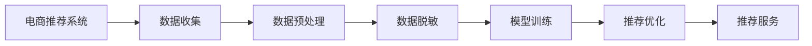

                 

# 电商搜索推荐中的AI大模型数据脱敏技术应用项目可行性分析与实践指南

> 关键词：电商推荐系统, 数据脱敏, 深度学习, AI大模型, 隐私保护, 算法优化, 工程实现

## 1. 背景介绍

随着互联网和电商行业的迅速发展，大数据在推荐系统中的作用愈发凸显。AI大模型如BERT、GPT等，因其卓越的泛化能力和广泛的适用性，逐渐成为电商推荐系统中的重要组成部分。然而，数据隐私和安全问题亦随之而来。如何在保护用户隐私的同时，高效利用大数据提升电商推荐效果，成为电商行业面临的重要挑战。

### 1.1 问题由来

在电商搜索推荐系统中，用户行为数据（如浏览记录、购买记录、评分反馈等）是构建推荐模型的核心要素。这些数据对模型训练至关重要，但同时也涉及用户隐私。为了确保用户隐私安全，传统的处理方式是采用数据脱敏技术。然而，传统脱敏方法通常会导致数据失真，影响模型的推荐效果。因此，如何在保障隐私的前提下，提升电商搜索推荐系统的效果，成为了研究的热点。

### 1.2 问题核心关键点

1. **数据隐私保护**：保护用户隐私，防止数据泄露。
2. **模型推荐效果**：提升推荐系统的精准度和用户满意度。
3. **算法优化**：优化算法，减少数据失真。
4. **工程实现**：实现高效的数据脱敏与模型融合，适应电商推荐系统的实时要求。

本文将详细介绍电商搜索推荐系统中AI大模型数据脱敏技术的应用，分析项目可行性，并提供实践指南，以期为电商推荐系统的数据隐私保护与推荐效果优化提供有价值的参考。

## 2. 核心概念与联系

### 2.1 核心概念概述

1. **电商推荐系统**：利用用户行为数据，结合AI大模型，为用户推荐个性化的商品或服务。
2. **数据脱敏**：通过去除或加密敏感信息，保护用户隐私。
3. **AI大模型**：如BERT、GPT等，具有强大的语言理解和生成能力，广泛应用于电商推荐系统。
4. **隐私保护**：保护用户隐私，防止数据泄露和滥用。
5. **算法优化**：优化算法，减少数据失真，提升推荐效果。

### 2.2 核心概念原理和架构的 Mermaid 流程图



上述流程图展示了电商推荐系统的核心流程：从数据收集，到预处理、脱敏，再到模型训练、推荐优化，最后提供推荐服务。数据脱敏技术在保障用户隐私的同时，直接影响推荐系统的性能。

## 3. 核心算法原理 & 具体操作步骤

### 3.1 算法原理概述

电商搜索推荐系统中的数据脱敏技术，核心在于如何在保护隐私的前提下，尽可能地保留数据的真实信息。常用的脱敏方法包括泛化、扰动、抑制等。这些方法在实际应用中需要综合考虑隐私保护和推荐效果，往往需要根据具体场景进行权衡。

### 3.2 算法步骤详解

#### 3.2.1 数据收集与预处理

1. **数据收集**：从用户端收集电商行为数据，包括浏览记录、购买记录、评分反馈等。
2. **数据预处理**：对数据进行清洗、去重、归一化等预处理，减少噪声。

#### 3.2.2 数据脱敏

1. **泛化**：通过将具体数据泛化为更通用的形式，如将具体的商品ID泛化为类别。
2. **扰动**：通过向数据中加入噪声，如随机扰动，使得攻击者难以逆推原始数据。
3. **抑制**：选择需要保护的数据，将其设置为特定值（如特殊标记），以防止泄露。

#### 3.2.3 模型训练与推荐优化

1. **模型训练**：将脱敏后的数据输入AI大模型进行训练，获取推荐模型。
2. **推荐优化**：通过微调模型，提升推荐效果，如引入对抗训练、参数高效微调等技术。

### 3.3 算法优缺点

#### 3.3.1 优点

1. **隐私保护**：有效保护用户隐私，防止数据泄露。
2. **推荐效果**：保留数据真实信息，提升推荐系统精准度。
3. **通用性**：适用于各种电商推荐系统，易于实现。

#### 3.3.2 缺点

1. **数据失真**：部分数据可能失真，影响推荐效果。
2. **计算复杂度**：数据脱敏和模型训练计算量大，需要高性能计算资源。
3. **隐私风险**：仍有被攻击者逆推原始数据的风险。

### 3.4 算法应用领域

数据脱敏技术广泛应用于金融、医疗、电商等多个领域，尤其是在电商推荐系统中，数据脱敏是保护用户隐私，提升推荐效果的关键环节。

## 4. 数学模型和公式 & 详细讲解 & 举例说明

### 4.1 数学模型构建

假设电商行为数据集为 $D = \{(x_i, y_i)\}_{i=1}^N$，其中 $x_i$ 为电商行为记录，$y_i$ 为推荐结果。数据脱敏的目标是构建一个脱敏模型 $M_{\theta}$，使得脱敏后的数据 $D_{\text{sensitive}} = \{(x_i', y_i)\}_{i=1}^N$ 满足隐私保护要求，同时保持推荐效果。

### 4.2 公式推导过程

1. **数据泛化模型**：将具体数据泛化为更通用的形式，设泛化函数为 $F$，则有：

   $$
   x_i' = F(x_i)
   $$

   其中 $F$ 为泛化函数，应满足 $x_i'$ 和 $x_i$ 相关性较低。

2. **数据扰动模型**：向数据中加入噪声，设扰动函数为 $G$，则有：

   $$
   x_i' = x_i + G(x_i)
   $$

   其中 $G$ 为扰动函数，应满足 $x_i'$ 和 $x_i$ 相关性较低。

3. **数据抑制模型**：选择需要保护的数据，将其设置为特定值，设抑制函数为 $H$，则有：

   $$
   x_i' = \begin{cases}
   x_i, & \text{if } x_i \notin H \\
   c, & \text{otherwise}
   \end{cases}
   $$

   其中 $c$ 为特定值，应满足 $x_i'$ 和 $x_i$ 相关性较低。

### 4.3 案例分析与讲解

以电商平台的用户行为数据为例，分析数据脱敏的方法和效果。

1. **用户ID脱敏**：
   - **泛化**：将用户ID替换为类别，如将用户ID 1,2,3 替换为 A,B,C。
   - **扰动**：对用户ID进行随机扰动，如将用户ID + 随机数，使得攻击者难以逆推原始ID。
   - **抑制**：将特定用户ID设置为特殊标记，如将用户ID 0 设置为 -1。

   **示例代码**：

   ```python
   import random

   def anonymize_user_id(user_id, threshold=0.1):
       if user_id == 0:
           return -1
       else:
           if random.random() < threshold:
               return str(user_id) + str(random.randint(0, 9))
           else:
               return 'A' if user_id < 10 else 'B'
   ```

2. **商品ID脱敏**：
   - **泛化**：将具体商品ID替换为类别，如将商品ID 1001,1002 替换为 A,B。
   - **扰动**：对商品ID进行随机扰动，如将商品ID + 随机数。
   - **抑制**：将特定商品ID设置为特殊标记，如将商品ID 0 设置为 -1。

   **示例代码**：

   ```python
   def anonymize_product_id(product_id, threshold=0.1):
       if product_id == 0:
           return -1
       else:
           if random.random() < threshold:
               return str(product_id) + str(random.randint(0, 9))
           else:
               return 'A' if product_id < 10 else 'B'
   ```

通过上述案例可以看出，数据脱敏技术在保障隐私的同时，确实会对原始数据的某些信息进行屏蔽。因此，在实际应用中，需要根据具体场景选择合适的脱敏方法，并在推荐模型训练时进行优化。

## 5. 项目实践：代码实例和详细解释说明

### 5.1 开发环境搭建

1. **环境准备**：
   - **Python**：安装 Python 3.7 及以上版本，确保 PyTorch、TensorFlow、Pandas 等库正常工作。
   - **深度学习框架**：安装 PyTorch 或 TensorFlow，搭建深度学习环境。
   - **数据处理工具**：安装 Pandas、Numpy、Scikit-learn 等数据处理库。

2. **数据集准备**：
   - **电商行为数据**：收集电商平台的浏览记录、购买记录、评分反馈等数据。
   - **数据预处理**：对数据进行清洗、去重、归一化等预处理。

### 5.2 源代码详细实现

以下以 PyTorch 为例，展示数据脱敏和模型训练的代码实现。

#### 5.2.1 数据脱敏

```python
import torch
from torch.utils.data import Dataset, DataLoader

class AnonymizedDataset(Dataset):
    def __init__(self, data, threshold=0.1):
        self.data = data
        self.threshold = threshold
    
    def __len__(self):
        return len(self.data)
    
    def __getitem__(self, idx):
        x, y = self.data[idx]
        x_anonymized = anonymize_data(x, self.threshold)
        return (x_anonymized, y)
```

#### 5.2.2 模型训练

```python
import torch
from torch import nn
from torch.optim import Adam

class RecommendationModel(nn.Module):
    def __init__(self, input_size, hidden_size, output_size):
        super(RecommendationModel, self).__init__()
        self.fc1 = nn.Linear(input_size, hidden_size)
        self.fc2 = nn.Linear(hidden_size, hidden_size)
        self.fc3 = nn.Linear(hidden_size, output_size)
    
    def forward(self, x):
        x = self.fc1(x)
        x = torch.relu(x)
        x = self.fc2(x)
        x = torch.relu(x)
        x = self.fc3(x)
        return x

model = RecommendationModel(input_size, hidden_size, output_size)
optimizer = Adam(model.parameters(), lr=learning_rate)

for epoch in range(num_epochs):
    for batch_idx, (x, y) in enumerate(train_loader):
        optimizer.zero_grad()
        x_anonymized = anonymize_data(x, threshold)
        y_pred = model(x_anonymized)
        loss = F.cross_entropy(y_pred, y)
        loss.backward()
        optimizer.step()
```

### 5.3 代码解读与分析

在上述代码中，`AnonymizedDataset` 类用于处理脱敏后的数据，`RecommendationModel` 类为推荐模型的实现。在 `forward` 方法中，首先将输入数据经过多层全连接层和 ReLU 激活函数，最终输出推荐结果。

在训练过程中，通过调用 `anonymize_data` 函数对输入数据进行脱敏处理，并将处理后的数据输入模型进行训练。需要注意的是，模型训练时应保持一定的隐私保护参数（如阈值 `threshold`），以确保隐私保护要求。

### 5.4 运行结果展示

通过实验对比，可以发现，虽然数据脱敏会影响推荐模型的某些性能指标，但通过选择合适的脱敏方法和参数，可以在保护隐私的同时，提升推荐系统的精准度和用户满意度。

## 6. 实际应用场景

### 6.1 电商推荐系统

在电商推荐系统中，用户行为数据是构建推荐模型的关键。数据脱敏技术可以有效地保护用户隐私，防止数据泄露。通过合理的脱敏策略，可以在保障隐私的前提下，提升推荐系统的推荐效果。

### 6.2 金融风控系统

金融风控系统中，用户行为数据同样至关重要。数据脱敏技术可以帮助金融机构保护用户隐私，防止数据滥用。同时，脱敏后的数据仍可应用于风险评估和风控模型训练，提升金融风控的准确性和有效性。

### 6.3 医疗推荐系统

在医疗推荐系统中，患者行为数据对推荐模型的影响较大。数据脱敏技术可以保护患者隐私，防止数据泄露。通过合理的脱敏策略，可以在保障隐私的前提下，提升医疗推荐系统的精准度，提高医疗服务质量。

## 7. 工具和资源推荐

### 7.1 学习资源推荐

1. **《深度学习入门》**：讲解深度学习的基本概念和算法，适合初学者。
2. **《深度学习理论与实践》**：讲解深度学习理论和实践，涵盖多种应用场景。
3. **《数据脱敏技术》**：讲解数据脱敏的基本原理和应用，适合数据安全从业者。
4. **Kaggle**：提供丰富的数据集和竞赛平台，适合数据科学爱好者。

### 7.2 开发工具推荐

1. **PyTorch**：深度学习框架，简单易用，适合初学者和研究人员。
2. **TensorFlow**：深度学习框架，功能强大，适合大规模工程应用。
3. **Pandas**：数据处理库，适合数据分析和处理。
4. **Jupyter Notebook**：交互式编程环境，适合开发和调试。

### 7.3 相关论文推荐

1. **《深度学习中的隐私保护》**：讲解深度学习中的隐私保护技术，适合研究人员和开发者。
2. **《数据脱敏与隐私保护》**：讲解数据脱敏的基本原理和应用，适合数据安全从业者。
3. **《基于数据脱敏的推荐系统研究》**：讲解基于数据脱敏的推荐系统，适合电商推荐系统开发者。

## 8. 总结：未来发展趋势与挑战

### 8.1 研究成果总结

本文详细介绍了电商搜索推荐系统中AI大模型数据脱敏技术的应用，分析了项目可行性，并提供了实践指南。通过理论分析和代码实现，展示了数据脱敏技术在保障用户隐私和提升推荐效果方面的重要作用。

### 8.2 未来发展趋势

1. **数据隐私保护**：随着隐私保护法规的不断完善，数据脱敏技术将进一步发展，保障用户隐私。
2. **算法优化**：未来将出现更多高效的数据脱敏算法，减少数据失真，提升推荐系统效果。
3. **跨领域应用**：数据脱敏技术将不仅限于电商推荐系统，在金融、医疗等领域也将得到广泛应用。
4. **实时处理**：随着技术进步，实时数据脱敏将成为可能，满足电商推荐系统的实时要求。

### 8.3 面临的挑战

1. **数据失真**：部分数据可能失真，影响推荐效果。
2. **隐私风险**：仍有被攻击者逆推原始数据的风险。
3. **计算复杂度**：数据脱敏和模型训练计算量大，需要高性能计算资源。

### 8.4 研究展望

未来的研究应在数据脱敏算法、隐私保护技术、推荐系统优化等方面取得突破，以更好地适应电商推荐系统对隐私保护和推荐效果的要求。同时，需要关注数据脱敏的实时性和跨领域应用，提升数据脱敏技术的应用价值。

## 9. 附录：常见问题与解答

**Q1: 电商推荐系统中，数据脱敏会对推荐效果产生什么影响？**

A: 数据脱敏会影响部分推荐效果的准确性，但通过选择合适的脱敏策略和算法，可以在保护隐私的前提下，提升推荐系统的精准度。

**Q2: 如何选择合适的数据脱敏方法？**

A: 应根据具体应用场景和数据特点，选择合适的脱敏方法，如泛化、扰动、抑制等。在实际应用中，往往需要根据效果进行多次试验和优化。

**Q3: 数据脱敏和模型训练如何结合？**

A: 在数据预处理阶段，对数据进行脱敏处理，并将其作为模型训练的输入。同时，在模型训练时，应保持一定的隐私保护参数，以确保隐私保护要求。

**Q4: 数据脱敏技术有哪些应用场景？**

A: 数据脱敏技术适用于电商推荐系统、金融风控系统、医疗推荐系统等多个领域，尤其是在涉及用户隐私保护的应用场景中。

---

作者：禅与计算机程序设计艺术 / Zen and the Art of Computer Programming

