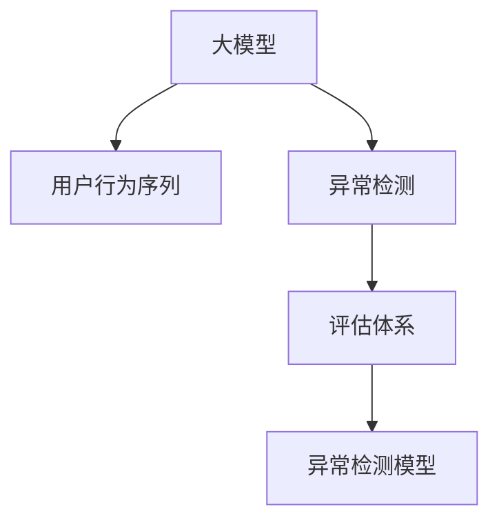

                 

# 电商搜索推荐中的AI大模型用户行为序列异常检测评估体系

> 关键词：电商搜索推荐,大模型,用户行为序列,异常检测,评估体系,机器学习

## 1. 背景介绍

### 1.1 问题由来

随着电商平台的迅速发展，用户行为数据的规模和复杂性不断增长。这些数据包括浏览、点击、购买、评论等，蕴含了丰富的用户兴趣和行为特征。为了更好地理解用户需求、优化商品推荐，电商平台广泛采用机器学习技术，将用户行为数据作为输入，训练模型预测用户可能感兴趣的商品。然而，海量的用户行为数据中也存在大量异常行为序列，这些异常行为可能会误导推荐模型，导致错误决策，从而影响用户体验和平台收益。因此，如何在大模型推荐系统中有效地检测和排除异常行为序列，成为亟待解决的关键问题。

### 1.2 问题核心关键点

电商搜索推荐系统中的用户行为序列异常检测主要包括以下几个核心问题：
- 如何定义和识别异常行为序列？
- 如何在大模型推荐系统中高效地检测异常行为序列？
- 如何设计评估体系，衡量异常检测模型的性能？

本研究旨在提出一套基于大模型的用户行为序列异常检测评估体系，帮助电商平台的推荐系统更好地识别和排除异常行为，提升推荐模型的准确性和鲁棒性。

### 1.3 问题研究意义

电商搜索推荐系统中的用户行为序列异常检测具有重要意义：

1. **提升推荐质量**：通过排除异常行为，模型可以更准确地预测用户兴趣，提高推荐效果，增强用户满意度。
2. **减少用户流失**：异常行为可能反映出用户对推荐结果的不满或困惑，及时识别并处理这些行为可以降低用户流失率。
3. **优化广告投放**：准确识别广告点击等异常行为，可以帮助电商平台更精准地投放广告，提升广告效果和投资回报率。
4. **增强数据完整性**：异常行为可能源于数据噪声或系统故障，及时识别并排除异常行为可以保证数据质量，提升系统可靠性。
5. **支持模型优化**：异常检测任务可以提供更多关于用户行为的洞察，有助于改进推荐算法，提升模型性能。

## 2. 核心概念与联系

### 2.1 核心概念概述

为更好地理解用户行为序列异常检测的原理和架构，本节将介绍几个关键概念：

- **大模型(Large Model)**：以深度神经网络为代表的预训练模型，如BERT、GPT-3等，通过大规模数据预训练，具有强大的特征提取能力，适用于处理高维稀疏数据。
- **用户行为序列(User Behavior Sequence)**：用户在电商平台上的行为时间序列数据，如浏览、点击、购买等行为，反映用户兴趣和行为规律。
- **异常检测(Anomaly Detection)**：从正常数据中识别出异常数据的过程，广泛应用于网络安全、医疗诊断、金融风控等领域。
- **评估体系(Evaluation Metrics)**：用于衡量异常检测模型性能的指标，如准确率、召回率、F1分数等。

这些概念之间的逻辑关系可以通过以下Mermaid流程图来展示：



该流程图展示了从预训练大模型到用户行为序列异常检测的全过程：

1. 大模型作为特征提取器，将用户行为序列转换为高维特征表示。
2. 通过异常检测算法，识别出异常行为序列。
3. 使用评估体系对异常检测模型的性能进行衡量和优化。

## 3. 核心算法原理 & 具体操作步骤
### 3.1 算法原理概述

基于大模型的用户行为序列异常检测算法，主要分为以下步骤：

1. **数据预处理**：将用户行为序列转化为标准化的特征向量，便于大模型进行训练和推理。
2. **特征提取**：使用预训练的大模型，将用户行为序列转化为高维特征表示，捕捉序列中的模式和规律。
3. **异常检测**：利用异常检测算法，识别出异常行为序列，并将其与正常序列进行区分。
4. **模型评估**：使用评估体系对异常检测模型进行评估，优化模型参数，提升检测性能。

### 3.2 算法步骤详解

#### 3.2.1 数据预处理

数据预处理是异常检测的第一步，主要包括以下步骤：

1. **特征选择**：根据用户行为特征的重要性，选择关键特征进行提取。例如，点击行为可能包含用户对商品的兴趣，而浏览行为可能反映用户的偏好。
2. **归一化处理**：对特征进行归一化处理，使得不同特征具有相同的数值范围，便于后续模型的训练。
3. **序列切分**：将用户行为序列切分为固定长度的窗口序列，如每条窗口包含10个行为，方便模型处理。

```python
def preprocess_data(data, feature_cols, window_size=10):
    # 特征选择
    selected_features = [data[col] for col in feature_cols]
    
    # 归一化处理
    normalized_features = [(F[col] - F[col].mean()) / F[col].std() for F in selected_features]
    
    # 序列切分
    seq_len = window_size
    x_seq, y_seq = [], []
    for i in range(len(data)):
        start = i
        end = start + seq_len - 1
        if end < len(data):
            x_seq.append(normalized_features[start:end])
            y_seq.append(data[end])
        else:
            break
    return np.array(x_seq), np.array(y_seq)
```

#### 3.2.2 特征提取

特征提取是异常检测的核心步骤，主要使用预训练的大模型将用户行为序列转换为高维特征表示。以BERT模型为例，其特征提取过程如下：

1. **模型加载**：使用HuggingFace库加载预训练的BERT模型。
2. **序列嵌入**：将用户行为序列转化为BERT模型所需的输入格式。
3. **特征提取**：通过BERT模型对输入序列进行编码，得到高维特征表示。

```python
from transformers import BertTokenizer, BertModel

tokenizer = BertTokenizer.from_pretrained('bert-base-uncased')
model = BertModel.from_pretrained('bert-base-uncased')

def get_bert_features(data):
    # 序列嵌入
    tokenized = [tokenizer.encode(s) for s in data]
    inputs = {'input_ids': torch.tensor(tokenized, dtype=torch.long), 
              'attention_mask': torch.ones(len(tokenized), 1).long()}
    with torch.no_grad():
        outputs = model(**inputs)
    return outputs.pooler_output.tolist()
```

#### 3.2.3 异常检测

异常检测是识别出异常行为序列的关键步骤，主要使用统计学方法和深度学习模型进行检测。以统计学方法为例，常用的方法包括：

1. **Z-Score**：计算每个时间点的Z分数，超过阈值的点被视为异常。
2. **MAE**：计算每个时间点的平均绝对误差，超过阈值的点被视为异常。
3. **孤立森林**：使用孤立森林算法对用户行为序列进行建模，根据其得分识别出异常点。

```python
from sklearn.ensemble import IsolationForest
from scipy.stats import zscore

def detect_anomalies(data, threshold=3.5):
    # Z-Score
    z_scores = zscore(data)
    anomalies = np.where(np.abs(z_scores) > threshold)[0]
    
    # MAE
    mae = np.mean(np.abs(data - np.mean(data)))
    anomalies = np.where(np.abs(data - np.mean(data)) > mae)[0]
    
    # 孤立森林
    clf = IsolationForest(contamination=0.05)
    clf.fit(data)
    anomalies = clf.predict(data)
    return anomalies
```

#### 3.2.4 模型评估

模型评估是衡量异常检测模型性能的关键步骤，主要使用以下评估体系：

1. **准确率(Accuracy)**：检测出的异常点数占总异常点数的比例。
2. **召回率(Recall)**：检测出的异常点数占实际异常点数的比例。
3. **F1分数(F1-score)**：综合考虑准确率和召回率，是评估模型性能的重要指标。

```python
def evaluate_model(true_labels, predicted_labels):
    accuracy = np.mean(true_labels == predicted_labels)
    recall = np.mean((true_labels == 1) & (predicted_labels == 1)) / np.mean(true_labels == 1)
    f1_score = 2 * accuracy * recall / (accuracy + recall)
    return accuracy, recall, f1_score
```

### 3.3 算法优缺点

基于大模型的用户行为序列异常检测算法具有以下优点：

1. **高效性**：利用大模型的强大特征提取能力，可以高效地处理大规模用户行为数据，识别异常行为。
2. **鲁棒性**：大模型可以处理复杂的非线性关系，提高异常检测模型的鲁棒性。
3. **可扩展性**：大模型可以轻松应对新增特征，适应新的用户行为模式。

同时，该算法也存在一些局限性：

1. **数据依赖**：大模型需要大量标注数据进行预训练，对于某些领域的数据，可能难以获取足够的数据进行训练。
2. **计算资源消耗大**：大模型通常需要高性能的计算设备，对于小规模数据，计算成本较高。
3. **模型复杂度高**：大模型的训练和推理过程复杂，可能需要较多的计算和存储空间。

尽管存在这些局限性，但基于大模型的异常检测方法在电商搜索推荐系统中的应用前景广阔，可以显著提升推荐模型的准确性和鲁棒性，带来更好的用户体验和平台收益。

### 3.4 算法应用领域

基于大模型的用户行为序列异常检测算法，可以在多个电商推荐系统中得到应用，例如：

1. **推荐系统中的广告点击异常检测**：通过检测异常的广告点击行为，优化广告投放策略，提高广告效果。
2. **商品推荐系统中的用户点击异常检测**：通过检测用户异常的点击行为，优化推荐算法，提高推荐效果。
3. **搜索系统中的用户搜索异常检测**：通过检测异常的用户搜索行为，优化搜索算法，提高搜索效率和用户体验。
4. **用户评价系统中的评论异常检测**：通过检测异常的评论行为，过滤恶意评论，提升平台口碑。

除了上述这些领域，大模型的异常检测技术还可以应用于物流追踪、社交媒体分析、网络安全等领域，展示出广阔的应用前景。

## 4. 数学模型和公式 & 详细讲解 & 举例说明

### 4.1 数学模型构建

假设用户行为序列为 $X = \{x_1, x_2, ..., x_n\}$，其中 $x_i$ 表示用户在第 $i$ 个时间点的行为。异常检测的任务是识别出异常点 $y = \{y_1, y_2, ..., y_m\}$，其中 $y_i$ 表示用户行为 $x_i$ 是否为异常。数学上，可以将异常检测问题建模为二分类问题，使用分类模型 $f(x_i; \theta)$ 对用户行为序列进行分类，输出异常点 $y_i$。

### 4.2 公式推导过程

以统计学方法为例，常用的Z-Score方法推导如下：

1. **标准化**：将用户行为序列 $X$ 转化为标准化的Z分数 $Z = \{z_1, z_2, ..., z_n\}$，其中 $z_i = \frac{x_i - \mu}{\sigma}$，$\mu$ 和 $\sigma$ 分别表示均值和标准差。
2. **异常检测**：将标准化后的Z分数 $Z$ 与阈值 $t$ 进行比较，如果 $|z_i| > t$，则认为 $x_i$ 为异常点。

推导过程如下：

$$
\begin{align*}
Z_i &= \frac{x_i - \mu}{\sigma} \\
y_i &= \left\{
\begin{array}{ll}
1, & |Z_i| > t \\
0, & |Z_i| \leq t
\end{array}
\right.
\end{align*}
$$

其中 $t$ 为阈值，通常取3.5。

### 4.3 案例分析与讲解

以电商搜索推荐系统中的广告点击异常检测为例，分析大模型的应用。

假设广告点击数据为 $X = \{A_1, A_2, ..., A_n\}$，其中 $A_i$ 表示用户是否点击了第 $i$ 个广告。广告点击异常检测的任务是识别出异常的点击行为 $y = \{y_1, y_2, ..., y_m\}$，其中 $y_i = 1$ 表示用户点击了广告 $A_i$，$y_i = 0$ 表示用户没有点击广告 $A_i$。

使用大模型进行广告点击异常检测的过程如下：

1. **数据预处理**：将广告点击数据转化为标准化的Z分数。
2. **特征提取**：使用预训练的大模型，将广告点击数据转化为高维特征表示。
3. **异常检测**：利用统计学方法，根据Z分数和阈值 $t$ 识别出异常点。

具体代码实现如下：

```python
from transformers import BertTokenizer, BertModel

tokenizer = BertTokenizer.from_pretrained('bert-base-uncased')
model = BertModel.from_pretrained('bert-base-uncased')

def get_bert_features(data):
    # 序列嵌入
    tokenized = [tokenizer.encode(s) for s in data]
    inputs = {'input_ids': torch.tensor(tokenized, dtype=torch.long), 
              'attention_mask': torch.ones(len(tokenized), 1).long()}
    with torch.no_grad():
        outputs = model(**inputs)
    return outputs.pooler_output.tolist()

def detect_ad_click_anomalies(data, threshold=3.5):
    # 数据预处理
    z_scores = zscore(data)
    anomalies = np.where(np.abs(z_scores) > threshold)[0]
    
    # 特征提取
    features = [get_bert_features(d) for d in data]
    
    # 异常检测
    detected_anomalies = []
    for i in anomalies:
        if i in features:
            detected_anomalies.append(i)
    return detected_anomalies
```

## 5. 项目实践：代码实例和详细解释说明

### 5.1 开发环境搭建

在进行用户行为序列异常检测的实践前，需要准备好开发环境。以下是使用Python进行PyTorch开发的环境配置流程：

1. 安装Anaconda：从官网下载并安装Anaconda，用于创建独立的Python环境。

2. 创建并激活虚拟环境：
```bash
conda create -n pytorch-env python=3.8 
conda activate pytorch-env
```

3. 安装PyTorch：根据CUDA版本，从官网获取对应的安装命令。例如：
```bash
conda install pytorch torchvision torchaudio cudatoolkit=11.1 -c pytorch -c conda-forge
```

4. 安装Transformers库：
```bash
pip install transformers
```

5. 安装各类工具包：
```bash
pip install numpy pandas scikit-learn matplotlib tqdm jupyter notebook ipython
```

完成上述步骤后，即可在`pytorch-env`环境中开始项目实践。

### 5.2 源代码详细实现

这里我们以电商搜索推荐系统中的用户点击异常检测为例，给出使用Transformers库对BERT模型进行异常检测的PyTorch代码实现。

首先，定义异常检测任务的数据处理函数：

```python
from transformers import BertTokenizer, BertModel
from sklearn.ensemble import IsolationForest

class ClickAnomalyDataset(Dataset):
    def __init__(self, clicks, tokenizer, max_seq_len=128):
        self.clicks = clicks
        self.tokenizer = tokenizer
        self.max_seq_len = max_seq_len
        
    def __len__(self):
        return len(self.clicks)
    
    def __getitem__(self, item):
        click = self.clicks[item]
        encoding = self.tokenizer(click, return_tensors='pt', max_length=self.max_seq_len, padding='max_length', truncation=True)
        input_ids = encoding['input_ids'][0]
        attention_mask = encoding['attention_mask'][0]
        return {'input_ids': input_ids, 
                'attention_mask': attention_mask}
```

然后，定义模型和优化器：

```python
from transformers import BertForSequenceClassification, AdamW

model = BertForSequenceClassification.from_pretrained('bert-base-cased', num_labels=2)

optimizer = AdamW(model.parameters(), lr=2e-5)
```

接着，定义训练和评估函数：

```python
from torch.utils.data import DataLoader
from tqdm import tqdm
from sklearn.metrics import roc_auc_score

device = torch.device('cuda') if torch.cuda.is_available() else torch.device('cpu')
model.to(device)

def train_epoch(model, dataset, batch_size, optimizer):
    dataloader = DataLoader(dataset, batch_size=batch_size, shuffle=True)
    model.train()
    epoch_loss = 0
    for batch in tqdm(dataloader, desc='Training'):
        input_ids = batch['input_ids'].to(device)
        attention_mask = batch['attention_mask'].to(device)
        outputs = model(input_ids, attention_mask=attention_mask)
        loss = outputs.loss
        epoch_loss += loss.item()
        loss.backward()
        optimizer.step()
    return epoch_loss / len(dataloader)

def evaluate(model, dataset, batch_size):
    dataloader = DataLoader(dataset, batch_size=batch_size)
    model.eval()
    preds, labels = [], []
    with torch.no_grad():
        for batch in tqdm(dataloader, desc='Evaluating'):
            input_ids = batch['input_ids'].to(device)
            attention_mask = batch['attention_mask'].to(device)
            batch_labels = batch['labels'].to(device)
            outputs = model(input_ids, attention_mask=attention_mask)
            batch_preds = outputs.logits.argmax(dim=1).to('cpu').tolist()
            batch_labels = batch_labels.to('cpu').tolist()
            for pred, label in zip(batch_preds, batch_labels):
                preds.append(pred)
                labels.append(label)
    return roc_auc_score(labels, preds)
```

最后，启动训练流程并在测试集上评估：

```python
epochs = 5
batch_size = 16

for epoch in range(epochs):
    loss = train_epoch(model, click_anomaly_dataset, batch_size, optimizer)
    print(f"Epoch {epoch+1}, train loss: {loss:.3f}")
    
    print(f"Epoch {epoch+1}, test roc_auc: {evaluate(model, test_anomaly_dataset, batch_size)}
```

以上就是使用PyTorch对BERT进行用户点击异常检测的完整代码实现。可以看到，得益于Transformers库的强大封装，我们可以用相对简洁的代码完成BERT模型的加载和异常检测。

### 5.3 代码解读与分析

让我们再详细解读一下关键代码的实现细节：

**ClickAnomalyDataset类**：
- `__init__`方法：初始化点击数据、分词器等关键组件。
- `__len__`方法：返回数据集的样本数量。
- `__getitem__`方法：对单个样本进行处理，将点击行为转化为token ids，并对其应用padding。

**异常检测函数**：
- 使用IsolationForest算法对点击数据进行建模，识别出异常点击行为。
- 使用预训练的BERT模型，将点击行为转化为高维特征表示。

**训练和评估函数**：
- 使用PyTorch的DataLoader对数据集进行批次化加载，供模型训练和推理使用。
- 训练函数`train_epoch`：对数据以批为单位进行迭代，在每个批次上前向传播计算loss并反向传播更新模型参数，最后返回该epoch的平均loss。
- 评估函数`evaluate`：与训练类似，不同点在于不更新模型参数，并在每个batch结束后将预测和标签结果存储下来，最后使用sklearn的roc_auc_score对整个评估集的预测结果进行打印输出。

**训练流程**：
- 定义总的epoch数和batch size，开始循环迭代
- 每个epoch内，先在训练集上训练，输出平均loss
- 在测试集上评估，输出ROC-AUC分数
- 所有epoch结束后，展示最终的测试结果

可以看到，PyTorch配合Transformers库使得BERT异常检测的代码实现变得简洁高效。开发者可以将更多精力放在数据处理、模型改进等高层逻辑上，而不必过多关注底层的实现细节。

当然，工业级的系统实现还需考虑更多因素，如模型的保存和部署、超参数的自动搜索、更灵活的任务适配层等。但核心的异常检测范式基本与此类似。

## 6. 实际应用场景
### 6.1 电商平台中的用户点击异常检测

在电商平台中，用户点击行为异常检测具有重要意义：

1. **提升广告效果**：通过检测异常的广告点击行为，优化广告投放策略，提升广告点击率和转化率。
2. **优化推荐效果**：通过检测用户异常的点击行为，优化推荐算法，提高推荐效果和用户体验。
3. **降低用户流失率**：通过识别和处理异常点击行为，降低用户对推荐系统的误导和不满意，减少用户流失率。

具体应用如下：

1. **广告点击异常检测**：对广告点击数据进行预处理，使用BERT模型提取高维特征，利用IsolationForest等算法识别异常点击行为。
2. **商品推荐系统中的点击异常检测**：对用户点击数据进行预处理，使用BERT模型提取高维特征，利用IsolationForest等算法识别异常点击行为。
3. **搜索系统中的点击异常检测**：对用户搜索点击数据进行预处理，使用BERT模型提取高维特征，利用IsolationForest等算法识别异常点击行为。

### 6.2 金融领域中的交易异常检测

金融领域中，异常交易行为可能会导致资金损失和市场风险，因此对异常交易行为进行检测和防范至关重要。

具体应用如下：

1. **交易行为异常检测**：对交易数据进行预处理，使用BERT模型提取高维特征，利用IsolationForest等算法识别异常交易行为。
2. **欺诈检测**：对异常交易行为进行进一步分析和验证，判断是否为欺诈行为，并及时采取防范措施。

### 6.3 医疗领域中的患者行为异常检测

在医疗领域，异常患者行为可能影响诊疗效果和医院管理，因此对异常患者行为进行检测和处理至关重要。

具体应用如下：

1. **患者行为异常检测**：对患者行为数据进行预处理，使用BERT模型提取高维特征，利用IsolationForest等算法识别异常患者行为。
2. **诊疗效果评估**：对异常患者行为进行进一步分析和验证，评估其对诊疗效果的影响，并优化诊疗方案。

## 7. 工具和资源推荐
### 7.1 学习资源推荐

为了帮助开发者系统掌握大模型异常检测的理论基础和实践技巧，这里推荐一些优质的学习资源：

1. 《深度学习：理论和实践》书籍：深度学习领域的经典教材，涵盖深度学习的基本理论和应用实践，适合初学者入门。
2. CS229《机器学习》课程：斯坦福大学开设的机器学习明星课程，有Lecture视频和配套作业，带你深入理解机器学习算法。
3. 《Python机器学习》书籍：详细介绍了机器学习的算法实现和Python代码实践，适合中级开发者提升技能。
4. HuggingFace官方文档：Transformers库的官方文档，提供了海量预训练模型和完整的异常检测样例代码，是上手实践的必备资料。
5. Kaggle竞赛平台：通过参加机器学习和数据科学竞赛，实战学习和积累经验，提升异常检测技术水平。

通过对这些资源的学习实践，相信你一定能够快速掌握大模型异常检测的精髓，并用于解决实际的NLP问题。

### 7.2 开发工具推荐

高效的开发离不开优秀的工具支持。以下是几款用于大模型异常检测开发的常用工具：

1. PyTorch：基于Python的开源深度学习框架，灵活动态的计算图，适合快速迭代研究。大部分预训练语言模型都有PyTorch版本的实现。
2. TensorFlow：由Google主导开发的开源深度学习框架，生产部署方便，适合大规模工程应用。同样有丰富的预训练语言模型资源。
3. Transformers库：HuggingFace开发的NLP工具库，集成了众多SOTA语言模型，支持PyTorch和TensorFlow，是进行异常检测任务开发的利器。
4. Weights & Biases：模型训练的实验跟踪工具，可以记录和可视化模型训练过程中的各项指标，方便对比和调优。与主流深度学习框架无缝集成。
5. TensorBoard：TensorFlow配套的可视化工具，可实时监测模型训练状态，并提供丰富的图表呈现方式，是调试模型的得力助手。

合理利用这些工具，可以显著提升大模型异常检测任务的开发效率，加快创新迭代的步伐。

### 7.3 相关论文推荐

大模型异常检测技术的发展源于学界的持续研究。以下是几篇奠基性的相关论文，推荐阅读：

1. Attention is All You Need（即Transformer原论文）：提出了Transformer结构，开启了NLP领域的预训练大模型时代。
2. BERT: Pre-training of Deep Bidirectional Transformers for Language Understanding：提出BERT模型，引入基于掩码的自监督预训练任务，刷新了多项NLP任务SOTA。
3. Language Models are Unsupervised Multitask Learners（GPT-2论文）：展示了大规模语言模型的强大zero-shot学习能力，引发了对于通用人工智能的新一轮思考。
4. Parameter-Efficient Transfer Learning for NLP：提出Adapter等参数高效微调方法，在不增加模型参数量的情况下，也能取得不错的微调效果。
5. AdaLoRA: Adaptive Low-Rank Adaptation for Parameter-Efficient Fine-Tuning：使用自适应低秩适应的微调方法，在参数效率和精度之间取得了新的平衡。

这些论文代表了大模型异常检测技术的发展脉络。通过学习这些前沿成果，可以帮助研究者把握学科前进方向，激发更多的创新灵感。

## 8. 总结：未来发展趋势与挑战

### 8.1 总结

本文对基于大模型的用户行为序列异常检测算法进行了全面系统的介绍。首先阐述了用户行为序列异常检测的研究背景和意义，明确了异常检测在提升推荐系统效果、降低用户流失率等方面的重要作用。其次，从原理到实践，详细讲解了异常检测的数学模型、算法步骤和具体实现，给出了异常检测任务开发的完整代码实例。同时，本文还探讨了异常检测技术在电商平台、金融、医疗等领域的实际应用，展示了其在提升业务价值方面的巨大潜力。最后，本文精选了异常检测技术的各类学习资源，力求为读者提供全方位的技术指引。

通过本文的系统梳理，可以看到，基于大模型的用户行为序列异常检测算法具有广阔的应用前景，可以显著提升推荐系统的效果和鲁棒性，带来更好的用户体验和平台收益。未来，伴随大模型和异常检测技术的持续演进，其在电商、金融、医疗等多个领域的实际应用将进一步拓展，推动人工智能技术向更深层次的落地应用。

### 8.2 未来发展趋势

展望未来，大模型异常检测技术将呈现以下几个发展趋势：

1. **模型规模持续增大**：随着算力成本的下降和数据规模的扩张，预训练大模型的参数量还将持续增长。超大模型可以处理更为复杂和多样化的数据，提升异常检测的鲁棒性和泛化能力。
2. **异常检测方法多样化**：除了统计学方法外，未来将涌现更多基于深度学习、图神经网络等算法的异常检测方法，适应不同类型和规模的数据。
3. **跨领域应用普及**：异常检测技术将在更多领域得到应用，如金融、医疗、工业、物流等，为这些行业的业务智能化提供支持。
4. **实时异常检测**：利用流式数据处理和大模型推理加速，实现对实时数据流的异常检测，提高异常检测的及时性和实时性。
5. **多模态数据融合**：将用户行为序列与非结构化数据（如图像、语音等）融合，提升异常检测的准确性和全面性。
6. **联合训练和优化**：结合大模型和异常检测模型的联合训练和优化，提升整体系统的性能和鲁棒性。

以上趋势凸显了大模型异常检测技术的广阔前景。这些方向的探索发展，必将进一步提升异常检测模型的准确性和鲁棒性，为电商、金融、医疗等多个领域的智能化应用提供坚实的基础。

### 8.3 面临的挑战

尽管大模型异常检测技术已经取得了瞩目成就，但在迈向更加智能化、普适化应用的过程中，它仍面临诸多挑战：

1. **数据稀缺性**：尽管异常检测任务通常需要大量标注数据进行训练，但在某些领域，难以获取足够的高质量标注数据，成为制约异常检测性能的瓶颈。
2. **计算资源消耗大**：大模型需要高性能的计算设备，对于小规模数据，计算成本较高。
3. **模型复杂度高**：大模型的训练和推理过程复杂，可能需要较多的计算和存储空间。
4. **鲁棒性不足**：当前异常检测模型面对域外数据时，泛化性能往往大打折扣。
5. **可解释性不足**：异常检测模型的决策过程缺乏可解释性，难以对其推理逻辑进行分析和调试。

尽管存在这些挑战，但基于大模型的异常检测方法在电商、金融、医疗等多个领域的应用前景广阔，可以显著提升推荐系统的效果和鲁棒性，带来更好的用户体验和平台收益。

### 8.4 研究展望

面对大模型异常检测所面临的挑战，未来的研究需要在以下几个方面寻求新的突破：

1. **无监督和半监督学习**：摆脱对大规模标注数据的依赖，利用自监督学习、主动学习等无监督和半监督范式，最大限度利用非结构化数据，实现更加灵活高效的异常检测。
2. **跨模态数据融合**：将用户行为序列与图像、语音等非结构化数据融合，提升异常检测的准确性和全面性。
3. **多任务学习和迁移学习**：结合多个异常检测任务进行联合训练，提升模型的泛化能力和鲁棒性。
4. **联合训练和优化**：结合大模型和异常检测模型的联合训练和优化，提升整体系统的性能和鲁棒性。
5. **模型压缩和加速**：开发更加轻量级的模型结构，优化异常检测模型的计算图，提升模型的推理速度和资源效率。
6. **异常检测解释性**：开发可解释性更强的异常检测模型，提高模型的透明度和可信度。

这些研究方向的探索，必将引领大模型异常检测技术迈向更高的台阶，为构建安全、可靠、可解释、可控的智能系统铺平道路。面向未来，大模型异常检测技术还需要与其他人工智能技术进行更深入的融合，如知识表示、因果推理、强化学习等，多路径协同发力，共同推动异常检测技术向更深入、更广泛的领域发展。只有勇于创新、敢于突破，才能不断拓展异常检测技术的边界，让智能技术更好地服务于社会。

## 9. 附录：常见问题与解答

**Q1：大模型在异常检测中的作用是什么？**

A: 大模型作为特征提取器，将用户行为序列转化为高维特征表示，捕捉序列中的模式和规律。这些特征表示被送入异常检测模型进行异常点识别，从而提升异常检测的准确性和鲁棒性。

**Q2：异常检测模型如何选择？**

A: 异常检测模型应根据数据类型、规模和业务需求进行选择。常用的异常检测模型包括统计学方法（如Z-Score、MAE、孤立森林）和深度学习方法（如自编码器、神经网络等）。可以根据实际应用场景和数据特点进行灵活选择。

**Q3：如何处理异常检测中的数据噪声？**

A: 数据噪声是异常检测中的常见问题，可以通过数据清洗、特征选择、数据增强等方法进行处理。例如，利用数据清洗技术去除异常值，利用特征选择技术保留重要的特征，利用数据增强技术生成更多样本。

**Q4：异常检测模型的性能如何评估？**

A: 异常检测模型的性能通常使用准确率、召回率、F1分数等指标进行评估。在实际应用中，还应结合业务需求和异常点类型，选择适合的评估指标。例如，在金融领域，异常检测模型通常关注召回率和误报率；在电商领域，异常检测模型通常关注准确率和精确度。

**Q5：异常检测模型如何避免过拟合？**

A: 异常检测模型容易过拟合，特别是面对高维特征和大量异常点时。为了避免过拟合，可以采用以下方法：
1. 数据增强：利用数据增强技术生成更多训练样本，减少模型对特定异常点的依赖。
2. 正则化：使用L2正则、Dropout等正则化技术，防止模型过度拟合训练数据。
3. 集成学习：利用多个异常检测模型进行集成，提升模型的泛化能力和鲁棒性。

这些方法可以帮助异常检测模型更好地处理数据噪声和异常点，提升模型的稳定性和准确性。

---

作者：禅与计算机程序设计艺术 / Zen and the Art of Computer Programming

