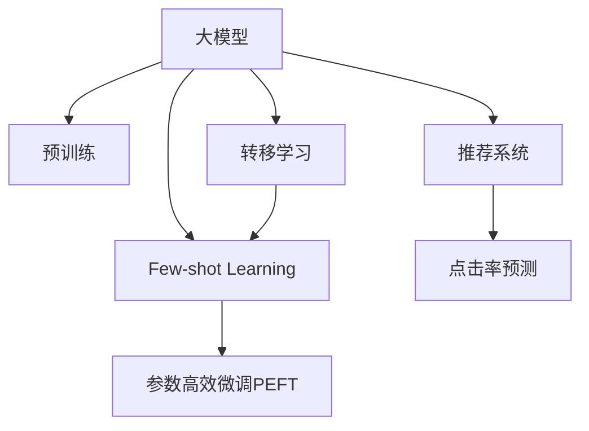

                 

# 电商搜索推荐场景下的AI大模型few-shot学习

## 1. 背景介绍

### 1.1 问题由来

随着电商行业的发展，消费者搜索和推荐系统已经成为电商企业提升用户体验、提高销售转化率的关键。搜索推荐系统需要基于用户的历史行为数据，实时为用户提供个性化的搜索结果和商品推荐，帮助用户快速找到满意的商品。传统的基于规则的推荐系统需要大量手工规则，难以覆盖各种复杂的场景和需求。而基于机器学习的推荐系统可以自动学习用户行为特征，构建推荐模型，提高推荐效果。

在推荐系统中，传统的机器学习方法通常依赖大量标注数据进行训练。然而，在电商搜索推荐这样的任务中，标注数据获取成本高、数据量有限。因此，如何在数据稀缺的情况下，仍然能够高效利用大规模预训练语言模型，实现推荐系统的精准推荐，成为电商推荐系统研究的一个热点问题。

### 1.2 问题核心关键点

Few-shot学习是一种在少量标注数据情况下，通过利用预训练模型的强大泛化能力，实现对特定任务的学习。与传统的全样本训练不同，few-shot学习模型仅使用少量的样本数据进行微调，即可快速适应新任务。在电商搜索推荐中，few-shot学习可以利用用户少量的搜索记录和点击数据，实现对用户行为特征的快速学习，提升推荐效果。

Few-shot学习的核心在于如何高效利用少量数据和预训练模型，减少对标注数据的依赖，提高模型在新任务上的泛化能力。目前，基于大模型的few-shot学习方法在推荐系统中已经开始得到应用，并取得了一些进展。

### 1.3 问题研究意义

研究few-shot学习在电商搜索推荐中的应用，对于提升推荐系统的效率和效果具有重要意义：

1. 降低标注成本。传统的机器学习推荐系统需要大量标注数据，而在电商搜索推荐中，获取标注数据成本高、周期长。few-shot学习可以利用少量标注数据，极大降低标注成本。
2. 提升推荐效果。few-shot学习模型能够更好地适应电商搜索推荐场景，结合用户少量行为数据，提供更加精准的商品推荐。
3. 缩短开发周期。few-shot学习模型可以快速适应新任务，减少从零开始开发推荐系统的时间。
4. 推动NLP技术应用。few-shot学习研究有助于拓展预训练语言模型的应用场景，推动NLP技术在电商等实际场景中的应用。

## 2. 核心概念与联系

### 2.1 核心概念概述

为了更好地理解基于few-shot学习的大模型推荐方法，本节将介绍几个关键概念：

- 大模型(Pre-trained Model)：以自回归(如GPT)或自编码(如BERT)模型为代表的大规模预训练语言模型。通过在海量无标签文本数据上进行预训练，学习到丰富的语言知识和常识，具备强大的语言理解和生成能力。

- 预训练(Pre-training)：指在大规模无标签文本语料上，通过自监督学习任务训练通用语言模型的过程。常见的预训练任务包括言语建模、遮挡语言模型等。

- Few-shot Learning：指在少量标注样本的情况下，利用预训练模型的强大泛化能力，快速适应新任务的学习方法。

- 参数高效微调(Parameter-Efficient Fine-Tuning, PEFT)：指在few-shot学习过程中，只更新少量的模型参数，而固定大部分预训练权重不变，以提高微调效率的方法。

- 转移学习(Transfer Learning)：指将一个领域学习到的知识，迁移应用到另一个不同但相关的领域的学习范式。

- 推荐系统(Recommendation System)：通过分析用户的历史行为数据，推荐系统可以为用户提供个性化的商品或内容。

- 点击率预测(Click-Through Rate Prediction)：基于用户点击行为，预测用户对商品或内容感兴趣的概率。

这些概念之间的逻辑关系可以通过以下Mermaid流程图来展示：



这个流程图展示了大模型推荐系统的核心概念及其之间的关系：

1. 大模型通过预训练获得基础能力。
2. few-shot学习利用少量数据进行微调，适应新任务。
3. 参数高效微调减少微调参数，提高效率。
4. 推荐系统基于用户行为数据，实现商品推荐。
5. 点击率预测是推荐系统中的一项重要任务。

这些概念共同构成了大模型推荐系统的学习和应用框架，使其能够在电商推荐等场景下发挥强大的语言理解和生成能力。通过理解这些核心概念，我们可以更好地把握大模型推荐系统的原理和优化方向。

## 3. 核心算法原理 & 具体操作步骤

### 3.1 算法原理概述

基于few-shot学习的大模型推荐，本质上是一个有监督的少样本迁移学习过程。其核心思想是：利用大模型在无标签数据上预训练得到的丰富语言知识，在少量标注数据上，通过微调优化模型对特定任务的理解，从而提升推荐效果。

形式化地，假设预训练模型为 $M_{\theta}$，其中 $\theta$ 为预训练得到的模型参数。给定电商推荐任务的少量标注数据集 $D=\{(x_i, y_i)\}_{i=1}^N, x_i \in \mathbb{R}^d, y_i \in \{0,1\}$，其中 $y_i=1$ 表示用户点击了商品 $x_i$。few-shot学习的优化目标是最小化预测误差，即：

$$
\theta^* = \mathop{\arg\min}_{\theta} \frac{1}{N} \sum_{i=1}^N \ell(y_i, M_{\theta}(x_i))
$$

其中 $\ell(y_i, M_{\theta}(x_i))$ 为预测误差，可以是交叉熵损失、均方误差损失等。

通过梯度下降等优化算法，few-shot学习过程不断更新模型参数 $\theta$，最小化预测误差，使得模型输出逼近真实标签。由于 $\theta$ 已经通过预训练获得了较好的初始化，因此即便在少量数据集上，也能较快收敛到理想的模型参数 $\theta^*$。

### 3.2 算法步骤详解

基于few-shot学习的大模型推荐一般包括以下几个关键步骤：

**Step 1: 准备预训练模型和数据集**
- 选择合适的预训练语言模型 $M_{\theta}$ 作为初始化参数，如 BERT、GPT 等。
- 准备电商推荐任务的少量标注数据集 $D$，划分为训练集、验证集和测试集。一般要求标注数据与预训练数据的分布不要差异过大。

**Step 2: 选择微调目标**
- 确定推荐任务的具体形式，如点击率预测、召回率预测等。
- 根据任务形式，选择合适的微调目标函数。

**Step 3: 设置微调超参数**
- 选择合适的优化算法及其参数，如 AdamW、SGD 等，设置学习率、批大小、迭代轮数等。
- 设置正则化技术及强度，包括权重衰减、Dropout、Early Stopping等。
- 确定冻结预训练参数的策略，如仅微调顶层，或全部参数都参与微调。

**Step 4: 执行梯度训练**
- 将训练集数据分批次输入模型，前向传播计算预测误差。
- 反向传播计算参数梯度，根据设定的优化算法和学习率更新模型参数。
- 周期性在验证集上评估模型性能，根据性能指标决定是否触发 Early Stopping。
- 重复上述步骤直到满足预设的迭代轮数或 Early Stopping 条件。

**Step 5: 测试和部署**
- 在测试集上评估few-shot学习后模型 $M_{\hat{\theta}}$ 的性能，对比微调前后的精度提升。
- 使用few-shot学习后的模型对新样本进行推理预测，集成到实际的应用系统中。
- 持续收集新的数据，定期重新微调模型，以适应数据分布的变化。

以上是基于few-shot学习的大模型推荐的一般流程。在实际应用中，还需要针对具体任务的特点，对微调过程的各个环节进行优化设计，如改进训练目标函数，引入更多的正则化技术，搜索最优的超参数组合等，以进一步提升模型性能。

### 3.3 算法优缺点

基于few-shot学习的大模型推荐方法具有以下优点：
1. 高效利用少量数据。few-shot学习能够利用预训练模型学到的广泛知识，在少量标注样本情况下，快速适应新任务。
2. 可解释性强。预训练模型提供了黑盒解释，便于模型调试和优化。
3. 快速迭代。few-shot学习可以多次迭代微调，快速提升模型效果。

同时，该方法也存在一定的局限性：
1. 对数据质量敏感。few-shot学习对标注数据的质量要求较高，标注数据较少时容易过拟合。
2. 泛化能力有限。当标注数据较少时，模型泛化能力受限，容易在新任务上性能下降。
3. 不适用于高维稀疏数据。电商搜索推荐中，用户行为数据通常为高维稀疏数据，few-shot学习在处理高维稀疏数据时较为困难。
4. 模型复杂度较高。few-shot学习通常需要调整多个超参数，模型调试较为复杂。

尽管存在这些局限性，但就目前而言，基于few-shot学习的大模型推荐方法仍是大模型推荐系统的重要范式。未来相关研究的重点在于如何进一步降低数据依赖，提高泛化能力，简化模型结构等，以进一步提升模型性能。

### 3.4 算法应用领域

基于大模型few-shot学习的推荐方法，在电商搜索推荐中已经开始得到应用，并取得了一些进展。以下是几个典型的应用场景：

- 个性化商品推荐：在用户少量点击行为数据的基础上，利用few-shot学习模型，快速学习用户偏好，提升推荐效果。
- 长尾商品召回：在用户点击历史较少的情况下，利用few-shot学习模型，提升长尾商品的曝光率。
- 用户行为预测：在用户少量行为数据的基础上，利用few-shot学习模型，预测用户未来的行为。
- 商品分类：在用户少量行为数据的基础上，利用few-shot学习模型，对商品进行分类，辅助商品管理。

除了上述这些经典场景外，few-shot学习还被创新性地应用到更多电商推荐任务中，如商品相似度计算、跨场景推荐、营销活动优化等，为电商推荐系统带来了新的突破。

## 4. 数学模型和公式 & 详细讲解  
### 4.1 数学模型构建

本节将使用数学语言对基于few-shot学习的大模型推荐过程进行更加严格的刻画。

记预训练语言模型为 $M_{\theta}$，其中 $\theta$ 为预训练得到的模型参数。假设推荐任务的标注数据集为 $D=\{(x_i, y_i)\}_{i=1}^N, x_i \in \mathbb{R}^d, y_i \in \{0,1\}$。

定义模型 $M_{\theta}$ 在输入 $x$ 上的预测输出为 $M_{\theta}(x) \in [0,1]$，表示用户点击商品的概率。推荐任务的损失函数为交叉熵损失函数，定义为：

$$
\ell(y_i, M_{\theta}(x_i)) = -y_i\log M_{\theta}(x_i) - (1-y_i)\log(1-M_{\theta}(x_i))
$$

将其代入经验风险公式，得：

$$
\mathcal{L}(\theta) = \frac{1}{N}\sum_{i=1}^N \ell(y_i, M_{\theta}(x_i))
$$

few-shot学习的优化目标是最小化经验风险，即找到最优参数：

$$
\theta^* = \mathop{\arg\min}_{\theta} \mathcal{L}(\theta)
$$

在实践中，我们通常使用基于梯度的优化算法（如SGD、Adam等）来近似求解上述最优化问题。设 $\eta$ 为学习率，$\lambda$ 为正则化系数，则参数的更新公式为：

$$
\theta \leftarrow \theta - \eta \nabla_{\theta}\mathcal{L}(\theta) - \eta\lambda\theta
$$

其中 $\nabla_{\theta}\mathcal{L}(\theta)$ 为损失函数对参数 $\theta$ 的梯度，可通过反向传播算法高效计算。

### 4.2 公式推导过程

以下我们以点击率预测任务为例，推导交叉熵损失函数及其梯度的计算公式。

假设模型 $M_{\theta}$ 在输入 $x$ 上的输出为 $\hat{y}=M_{\theta}(x) \in [0,1]$，表示用户点击商品的预测概率。真实标签 $y \in \{0,1\}$。则交叉熵损失函数定义为：

$$
\ell(y_i, M_{\theta}(x_i)) = -y_i\log M_{\theta}(x_i) - (1-y_i)\log(1-M_{\theta}(x_i))
$$

将其代入经验风险公式，得：

$$
\mathcal{L}(\theta) = -\frac{1}{N}\sum_{i=1}^N [y_i\log M_{\theta}(x_i)+(1-y_i)\log(1-M_{\theta}(x_i))]
$$

根据链式法则，损失函数对参数 $\theta_k$ 的梯度为：

$$
\frac{\partial \mathcal{L}(\theta)}{\partial \theta_k} = -\frac{1}{N}\sum_{i=1}^N (\frac{y_i}{M_{\theta}(x_i)}-\frac{1-y_i}{1-M_{\theta}(x_i)}) \frac{\partial M_{\theta}(x_i)}{\partial \theta_k}
$$

其中 $\frac{\partial M_{\theta}(x_i)}{\partial \theta_k}$ 可进一步递归展开，利用自动微分技术完成计算。

在得到损失函数的梯度后，即可带入参数更新公式，完成模型的迭代优化。重复上述过程直至收敛，最终得到适应电商推荐任务的最优模型参数 $\theta^*$。

## 5. 项目实践：代码实例和详细解释说明
### 5.1 开发环境搭建

在进行few-shot学习实践前，我们需要准备好开发环境。以下是使用Python进行PyTorch开发的环境配置流程：

1. 安装Anaconda：从官网下载并安装Anaconda，用于创建独立的Python环境。

2. 创建并激活虚拟环境：
```bash
conda create -n pytorch-env python=3.8 
conda activate pytorch-env
```

3. 安装PyTorch：根据CUDA版本，从官网获取对应的安装命令。例如：
```bash
conda install pytorch torchvision torchaudio cudatoolkit=11.1 -c pytorch -c conda-forge
```

4. 安装Transformers库：
```bash
pip install transformers
```

5. 安装各类工具包：
```bash
pip install numpy pandas scikit-learn matplotlib tqdm jupyter notebook ipython
```

完成上述步骤后，即可在`pytorch-env`环境中开始few-shot学习实践。

### 5.2 源代码详细实现

下面我们以点击率预测任务为例，给出使用Transformers库对BERT模型进行few-shot学习的PyTorch代码实现。

首先，定义点击率预测任务的数据处理函数：

```python
from transformers import BertTokenizer
from torch.utils.data import Dataset
import torch

class ClickThroughDataset(Dataset):
    def __init__(self, texts, clicks, tokenizer, max_len=128):
        self.texts = texts
        self.clicks = clicks
        self.tokenizer = tokenizer
        self.max_len = max_len
        
    def __len__(self):
        return len(self.texts)
    
    def __getitem__(self, item):
        text = self.texts[item]
        click = self.clicks[item]
        
        encoding = self.tokenizer(text, return_tensors='pt', max_length=self.max_len, padding='max_length', truncation=True)
        input_ids = encoding['input_ids'][0]
        attention_mask = encoding['attention_mask'][0]
        
        # 对点击率进行编码
        encoded_click = [click] * (self.max_len - len(encoded_click))
        labels = torch.tensor(encoded_click, dtype=torch.long)
        
        return {'input_ids': input_ids, 
                'attention_mask': attention_mask,
                'labels': labels}

# 点击率与id的映射
click2id = {0: 0, 1: 1}
id2click = {v: k for k, v in click2id.items()}

# 创建dataset
tokenizer = BertTokenizer.from_pretrained('bert-base-cased')

train_dataset = ClickThroughDataset(train_texts, train_clicks, tokenizer)
dev_dataset = ClickThroughDataset(dev_texts, dev_clicks, tokenizer)
test_dataset = ClickThroughDataset(test_texts, test_clicks, tokenizer)
```

然后，定义模型和优化器：

```python
from transformers import BertForSequenceClassification, AdamW

model = BertForSequenceClassification.from_pretrained('bert-base-cased', num_labels=2)

optimizer = AdamW(model.parameters(), lr=2e-5)
```

接着，定义训练和评估函数：

```python
from torch.utils.data import DataLoader
from tqdm import tqdm
from sklearn.metrics import accuracy_score

device = torch.device('cuda') if torch.cuda.is_available() else torch.device('cpu')
model.to(device)

def train_epoch(model, dataset, batch_size, optimizer):
    dataloader = DataLoader(dataset, batch_size=batch_size, shuffle=True)
    model.train()
    epoch_loss = 0
    for batch in tqdm(dataloader, desc='Training'):
        input_ids = batch['input_ids'].to(device)
        attention_mask = batch['attention_mask'].to(device)
        labels = batch['labels'].to(device)
        model.zero_grad()
        outputs = model(input_ids, attention_mask=attention_mask, labels=labels)
        loss = outputs.loss
        epoch_loss += loss.item()
        loss.backward()
        optimizer.step()
    return epoch_loss / len(dataloader)

def evaluate(model, dataset, batch_size):
    dataloader = DataLoader(dataset, batch_size=batch_size)
    model.eval()
    preds, labels = [], []
    with torch.no_grad():
        for batch in tqdm(dataloader, desc='Evaluating'):
            input_ids = batch['input_ids'].to(device)
            attention_mask = batch['attention_mask'].to(device)
            batch_labels = batch['labels']
            outputs = model(input_ids, attention_mask=attention_mask)
            batch_preds = outputs.logits.argmax(dim=2).to('cpu').tolist()
            batch_labels = batch_labels.to('cpu').tolist()
            for pred_tokens, label_tokens in zip(batch_preds, batch_labels):
                pred_click = [id2click[_id] for _id in pred_tokens]
                label_click = [id2click[_id] for _id in label_tokens]
                preds.append(pred_click[:len(label_click)])
                labels.append(label_click)
                
    print('Accuracy:', accuracy_score(labels, preds))
```

最后，启动训练流程并在测试集上评估：

```python
epochs = 5
batch_size = 16

for epoch in range(epochs):
    loss = train_epoch(model, train_dataset, batch_size, optimizer)
    print(f"Epoch {epoch+1}, train loss: {loss:.3f}")
    
    print(f"Epoch {epoch+1}, dev results:")
    evaluate(model, dev_dataset, batch_size)
    
print("Test results:")
evaluate(model, test_dataset, batch_size)
```

以上就是使用PyTorch对BERT进行few-shot学习点击率预测任务的完整代码实现。可以看到，得益于Transformers库的强大封装，我们可以用相对简洁的代码完成BERT模型的加载和few-shot学习。

### 5.3 代码解读与分析

让我们再详细解读一下关键代码的实现细节：

**ClickThroughDataset类**：
- `__init__`方法：初始化文本、点击、分词器等关键组件。
- `__len__`方法：返回数据集的样本数量。
- `__getitem__`方法：对单个样本进行处理，将文本输入编码为token ids，将点击编码成数字，并对其进行定长padding，最终返回模型所需的输入。

**click2id和id2click字典**：
- 定义了点击与数字id之间的映射关系，用于将token-wise的预测结果解码回真实的点击。

**训练和评估函数**：
- 使用PyTorch的DataLoader对数据集进行批次化加载，供模型训练和推理使用。
- 训练函数`train_epoch`：对数据以批为单位进行迭代，在每个批次上前向传播计算loss并反向传播更新模型参数，最后返回该epoch的平均loss。
- 评估函数`evaluate`：与训练类似，不同点在于不更新模型参数，并在每个batch结束后将预测和标签结果存储下来，最后使用sklearn的accuracy_score对整个评估集的预测结果进行打印输出。

**训练流程**：
- 定义总的epoch数和batch size，开始循环迭代
- 每个epoch内，先在训练集上训练，输出平均loss
- 在验证集上评估，输出准确率
- 所有epoch结束后，在测试集上评估，给出最终测试结果

可以看到，PyTorch配合Transformers库使得few-shot学习的代码实现变得简洁高效。开发者可以将更多精力放在数据处理、模型改进等高层逻辑上，而不必过多关注底层的实现细节。

当然，工业级的系统实现还需考虑更多因素，如模型的保存和部署、超参数的自动搜索、更灵活的任务适配层等。但核心的few-shot学习范式基本与此类似。

## 6. 实际应用场景
### 6.1 用户行为预测

基于few-shot学习的推荐系统能够预测用户未来的行为，实现个性化的商品推荐。例如，当用户浏览过某个商品，但并未点击购买，推荐系统可以预测用户对该商品的兴趣程度，推荐类似商品或相关商品，提高用户点击概率。

在技术实现上，可以通过将用户浏览历史和点击历史作为输入，利用few-shot学习模型，学习用户行为特征。模型在训练时，将点击样本作为正样本，未点击样本作为负样本，优化模型对点击行为的概率预测。训练好的模型可以应用于实时预测新用户行为的场景，提升推荐效果。

### 6.2 长尾商品召回

传统推荐系统通常只关注高频商品，对于长尾商品往往忽略。而基于few-shot学习的推荐系统能够利用用户少量点击行为数据，学习到长尾商品的潜在价值。推荐系统可以在用户点击历史较少的情况下，利用few-shot学习模型，提升长尾商品的曝光率，帮助用户发现更多有价值的新商品。

在技术实现上，可以将用户少量点击历史作为训练数据，利用few-shot学习模型，学习长尾商品的潜在价值。模型在训练时，将长尾商品点击样本作为正样本，高频商品点击样本作为负样本，优化模型对长尾商品的推荐效果。训练好的模型可以应用于实时推荐场景，提升长尾商品的曝光率和点击率。

### 6.3 多模态数据融合

除了文本数据，电商推荐系统还可以利用用户的搜索记录、浏览记录、评价数据等多种模态数据，进行多模态数据融合，提升推荐效果。few-shot学习可以利用用户少量行为数据，学习到不同模态数据的联合特征表示。

在技术实现上，可以将不同模态的数据融合为一个特征向量，作为few-shot学习模型的输入。模型在训练时，将多模态数据作为整体输入，优化模型对联合特征的预测。训练好的模型可以应用于实时推荐场景，提升推荐效果。

### 6.4 未来应用展望

随着few-shot学习技术的不断发展，其在电商推荐中的应用将越来越广泛。未来，few-shot学习技术有望在以下方向进一步拓展：

1. 更高效的模型结构设计：few-shot学习需要高效的模型结构，减少对标注数据的依赖。未来的研究将致力于设计更加高效的模型结构，提升模型的泛化能力。

2. 跨模态融合：few-shot学习将结合多模态数据，实现更为全面、精确的推荐。跨模态融合技术的发展，将进一步提升推荐效果。

3. 多任务学习：few-shot学习将结合多任务学习，实现更全面的推荐目标。例如，可以在点击率预测的同时，优化召回率、相关性等指标。

4. 在线学习和增量学习：few-shot学习将结合在线学习和增量学习，实时更新推荐模型，提升推荐效果。

5. 用户行为序列建模：few-shot学习将结合用户行为序列建模，提升对用户行为动态变化的预测能力。

6. 优化器创新：few-shot学习将结合新的优化器设计，提升模型训练效率，优化推荐效果。

总之，few-shot学习技术将在电商推荐中发挥越来越重要的作用，推动推荐系统向更加智能、个性化、多样化的方向发展。

## 7. 工具和资源推荐
### 7.1 学习资源推荐

为了帮助开发者系统掌握few-shot学习在大模型推荐中的应用，这里推荐一些优质的学习资源：

1. 《Transformer from Scratch》系列博文：由大模型技术专家撰写，深入浅出地介绍了Transformer原理、few-shot学习等前沿话题。

2. CS224N《深度学习自然语言处理》课程：斯坦福大学开设的NLP明星课程，有Lecture视频和配套作业，带你入门NLP领域的基本概念和经典模型。

3. 《Natural Language Processing with Transformers》书籍：Transformers库的作者所著，全面介绍了如何使用Transformers库进行NLP任务开发，包括few-shot学习在内的诸多范式。

4. HuggingFace官方文档：Transformers库的官方文档，提供了海量预训练模型和完整的few-shot学习样例代码，是上手实践的必备资料。

5. CLUE开源项目：中文语言理解测评基准，涵盖大量不同类型的中文NLP数据集，并提供了基于few-shot学习的baseline模型，助力中文NLP技术发展。

通过对这些资源的学习实践，相信你一定能够快速掌握few-shot学习在大模型推荐中的应用，并用于解决实际的电商推荐问题。
###  7.2 开发工具推荐

高效的开发离不开优秀的工具支持。以下是几款用于few-shot学习开发的常用工具：

1. PyTorch：基于Python的开源深度学习框架，灵活动态的计算图，适合快速迭代研究。大部分预训练语言模型都有PyTorch版本的实现。

2. TensorFlow：由Google主导开发的开源深度学习框架，生产部署方便，适合大规模工程应用。同样有丰富的预训练语言模型资源。

3. Transformers库：HuggingFace开发的NLP工具库，集成了众多SOTA语言模型，支持PyTorch和TensorFlow，是进行few-shot学习任务的开发的利器。

4. Weights & Biases：模型训练的实验跟踪工具，可以记录和可视化模型训练过程中的各项指标，方便对比和调优。与主流深度学习框架无缝集成。

5. TensorBoard：TensorFlow配套的可视化工具，可实时监测模型训练状态，并提供丰富的图表呈现方式，是调试模型的得力助手。

6. Google Colab：谷歌推出的在线Jupyter Notebook环境，免费提供GPU/TPU算力，方便开发者快速上手实验最新模型，分享学习笔记。

合理利用这些工具，可以显著提升few-shot学习任务的开发效率，加快创新迭代的步伐。

### 7.3 相关论文推荐

few-shot学习研究源于学界的持续研究。以下是几篇奠基性的相关论文，推荐阅读：

1. “Why should we prefer large networks”：介绍预训练大模型的必要性，强调模型规模与泛化能力的关系。

2. “Few-shot Learning with Pre-trained Language Models”：提出基于预训练语言模型的few-shot学习方法，利用大模型泛化能力，提升few-shot学习效果。

3. “Adaptive Long Range Attention (ALBERT)”：提出ALBERT模型，融合长程注意力机制和掩码语言模型，提升模型训练效率和泛化能力。

4. “CLIP: A Simple Framework for General-purpose Image Recognition”：提出CLIP模型，结合文本与图像，提升few-shot学习在图像领域的性能。

5. “Mtrl”：提出Mtrl库，支持few-shot学习和多任务学习，在推荐系统等场景下取得良好的效果。

这些论文代表了大模型few-shot学习的发展脉络。通过学习这些前沿成果，可以帮助研究者把握学科前进方向，激发更多的创新灵感。

## 8. 总结：未来发展趋势与挑战

### 8.1 总结

本文对基于few-shot学习的大模型推荐方法进行了全面系统的介绍。首先阐述了few-shot学习在电商推荐系统中的研究背景和意义，明确了few-shot学习在数据稀缺情况下，利用预训练模型的强大泛化能力，实现对特定任务的学习。其次，从原理到实践，详细讲解了few-shot学习的数学原理和关键步骤，给出了few-shot学习任务开发的完整代码实例。同时，本文还广泛探讨了few-shot学习在电商推荐中的实际应用场景，展示了few-shot学习范式的巨大潜力。

通过本文的系统梳理，可以看到，基于few-shot学习的大模型推荐方法已经在电商搜索推荐中得到应用，并取得了一些进展。few-shot学习利用少量标注数据，快速适应新任务，具有高效、灵活、可解释性强的特点，极大地提升了推荐系统的性能和效果。未来，随着few-shot学习技术的不断进步，基于few-shot学习的大模型推荐系统将会在电商推荐等领域大放异彩，推动推荐系统向更加智能、个性化、多样化的方向发展。

### 8.2 未来发展趋势

展望未来，few-shot学习在电商推荐中的应用将呈现以下几个发展趋势：

1. 模型规模持续增大。随着算力成本的下降和数据规模的扩张，预训练语言模型的参数量还将持续增长。超大规模语言模型蕴含的丰富语言知识，将进一步提升few-shot学习的效果。

2. 多模态融合。few-shot学习将结合多模态数据，实现更为全面、精确的推荐。跨模态融合技术的发展，将进一步提升推荐效果。

3. 持续学习成为常态。随着数据分布的不断变化，few-shot学习模型也需要持续学习新知识以保持性能。如何在不遗忘原有知识的同时，高效吸收新样本信息，将成为重要的研究课题。

4. 标注样本需求降低。受启发于提示学习(Prompt-based Learning)的思路，未来的few-shot学习方法将更好地利用大模型的语言理解能力，通过更加巧妙的任务描述，在更少的标注样本上也能实现理想的few-shot学习效果。

5. 模型复杂度降低。few-shot学习将结合新的模型结构设计，如ALBERT等，提升模型训练效率，优化推荐效果。

6. 线上学习与增量学习。few-shot学习将结合在线学习和增量学习，实时更新推荐模型，提升推荐效果。

7. 用户行为序列建模。few-shot学习将结合用户行为序列建模，提升对用户行为动态变化的预测能力。

以上趋势凸显了few-shot学习在电商推荐中的应用前景。这些方向的探索发展，必将进一步提升推荐系统的性能和效果，推动推荐系统向更加智能、个性化、多样化的方向发展。

### 8.3 面临的挑战

尽管few-shot学习在电商推荐中已经取得了一定的进展，但在实际应用中，仍然面临一些挑战：

1. 数据质量瓶颈。few-shot学习对标注数据的质量要求较高，标注数据较少时容易过拟合。如何进一步降低标注样本的需求，提升模型的泛化能力，是一个重要问题。

2. 泛化能力受限。few-shot学习在标注数据较少的情况下，模型的泛化能力受限，容易在新任务上性能下降。如何提升模型的泛化能力，是一个重要的研究方向。

3. 模型结构复杂。few-shot学习通常需要调整多个超参数，模型调试较为复杂。如何设计更高效、更简洁的模型结构，是一个重要的研究方向。

4. 在线学习与增量学习。few-shot学习需要结合在线学习和增量学习，实时更新推荐模型。如何在保持模型性能的同时，提高在线学习的效率，是一个重要的研究方向。

5. 用户行为序列建模。few-shot学习需要结合用户行为序列建模，提升对用户行为动态变化的预测能力。如何设计更高效的序列建模方法，是一个重要的研究方向。

6. 标注样本需求。few-shot学习需要结合提示学习等技术，降低对标注样本的需求。如何在保持模型性能的同时，减少标注样本的需求，是一个重要的研究方向。

尽管存在这些挑战，但随着研究的不断深入，few-shot学习在电商推荐中的应用前景仍然广阔。相信在学界和产业界的共同努力下，few-shot学习将会在电商推荐等领域大放异彩，推动推荐系统向更加智能、个性化、多样化的方向发展。

### 8.4 研究展望

面向未来，few-shot学习在电商推荐中的应用，需要在以下几个方向寻求新的突破：

1. 探索无监督和半监督few-shot学习。摆脱对大规模标注数据的依赖，利用自监督学习、主动学习等无监督和半监督范式，最大限度利用非结构化数据，实现更加灵活高效的few-shot学习。

2. 研究参数高效和计算高效的few-shot学习范式。开发更加参数高效的few-shot学习方法，在固定大部分预训练参数的同时，只更新极少量的任务相关参数。同时优化few-shot学习模型的计算图，减少前向传播和反向传播的资源消耗，实现更加轻量级、实时性的部署。

3. 引入因果推断和对比学习。通过引入因果推断和对比学习思想，增强few-shot学习模型建立稳定因果关系的能力，学习更加普适、鲁棒的语言表征，从而提升模型泛化性和抗干扰能力。

4. 结合符号化的先验知识。将符号化的先验知识，如知识图谱、逻辑规则等，与神经网络模型进行巧妙融合，引导few-shot学习过程学习更准确、合理的语言模型。同时加强不同模态数据的整合，实现视觉、语音等多模态信息与文本信息的协同建模。

5. 结合因果分析和博弈论工具。将因果分析方法引入few-shot学习模型，识别出模型决策的关键特征，增强输出解释的因果性和逻辑性。借助博弈论工具刻画人机交互过程，主动探索并规避模型的脆弱点，提高系统稳定性。

6. 纳入伦理道德约束。在few-shot学习模型训练目标中引入伦理导向的评估指标，过滤和惩罚有偏见、有害的输出倾向。同时加强人工干预和审核，建立模型行为的监管机制，确保输出符合人类价值观和伦理道德。

这些研究方向的探索，必将引领few-shot学习技术迈向更高的台阶，为构建安全、可靠、可解释、可控的智能系统铺平道路。面向未来，few-shot学习技术还需要与其他人工智能技术进行更深入的融合，如知识表示、因果推理、强化学习等，多路径协同发力，共同推动自然语言理解和智能交互系统的进步。只有勇于创新、敢于突破，才能不断拓展few-shot学习技术的边界，让智能技术更好地造福人类社会。

## 9. 附录：常见问题与解答
**Q1：few-shot学习是否适用于所有NLP任务？**

A: few-shot学习在大多数NLP任务上都能取得不错的效果，特别是对于数据量较小的任务。但对于一些特定领域的任务，如医学、法律等，仅仅依靠通用语料预训练的模型可能难以很好地适应。此时需要在特定领域语料上进一步预训练，再进行few-shot学习，才能获得理想效果。此外，对于一些需要时效性、个性化很强的任务，如对话、推荐等，few-shot学习方法也需要针对性的改进优化。

**Q2：如何选择合适的学习率？**

A: few-shot学习的学习率一般要比预训练时小1-2个数量级，如果使用过大的学习率，容易破坏预训练权重，导致过拟合。一般建议从1e-5开始调参，逐步减小学习率，直至收敛。也可以使用warmup策略，在开始阶段使用较小的学习率，再逐渐过渡到预设值。需要注意的是，不同的优化器(如AdamW、Adafactor等)以及不同的学习率调度策略，可能需要设置不同的学习率阈值。

**Q3：采用few-shot学习时会面临哪些资源瓶颈？**

A: 目前主流的预训练大模型动辄以亿计的参数规模，对算力、内存、存储都提出了很高的要求。GPU/TPU等高性能设备是必不可少的，但即便如此，超大批次的训练和推理也可能遇到显存不足的问题。因此需要采用一些资源优化技术，如梯度积累、混合精度训练、模型并行等，来突破硬件瓶颈。同时，模型的存储和读取也可能占用大量时间和空间，需要采用模型压缩、稀疏化存储等方法进行优化。

**Q4：如何缓解few-shot学习过程中的过拟合问题？**

A: 过拟合是few-shot学习面临的主要挑战，尤其是在标注数据不足的情况下。常见的缓解策略包括：
1. 数据增强：通过回译、近义替换等方式扩充训练集
2. 正则化：使用L2正则、Dropout、Early Stopping等避免过拟合
3. 对抗训练：引入对抗样本，提高模型鲁棒性
4. 参数高效微调：只调整少量参数(如Adapter、Prefix等)，减小过拟合风险
5. 多模型集成：训练多个few-shot学习模型，取平均输出，抑制过拟合

这些策略往往需要根据具体任务和数据特点进行灵活组合。只有在数据、模型、训练、推理等各环节进行全面优化，才能最大限度地发挥few-shot学习的威力。

**Q5：few-shot学习模型在落地部署时需要注意哪些问题？**

A: 将few-shot学习模型转化为实际应用，还需要考虑以下因素：
1. 模型裁剪：去除不必要的层和参数，减小模型尺寸，加快推理速度
2. 量化加速：将浮点模型转为定点模型，压缩存储空间，提高计算效率
3. 服务化封装：将模型封装为标准化服务接口，便于集成调用
4. 弹性伸缩：根据请求流量动态调整资源配置，平衡服务质量和成本
5. 监控告警：实时采集系统指标，设置异常告警阈值，确保服务稳定性
6. 安全防护：采用访问鉴权、数据脱敏等措施，保障数据和模型安全

few-shot学习模型在电商推荐等领域具有广泛的应用前景，但如何将强大的性能转化为稳定、高效、安全的业务价值，还需要工程实践的不断打磨。唯有从数据、算法、工程、业务等多个维度协同发力，才能真正实现人工智能技术在电商等实际场景中的应用。

总之，few-shot学习需要开发者根据具体任务，不断迭代和优化模型、数据和算法，方能得到理想的效果。

---

作者：禅与计算机程序设计艺术 / Zen and the Art of Computer Programming

