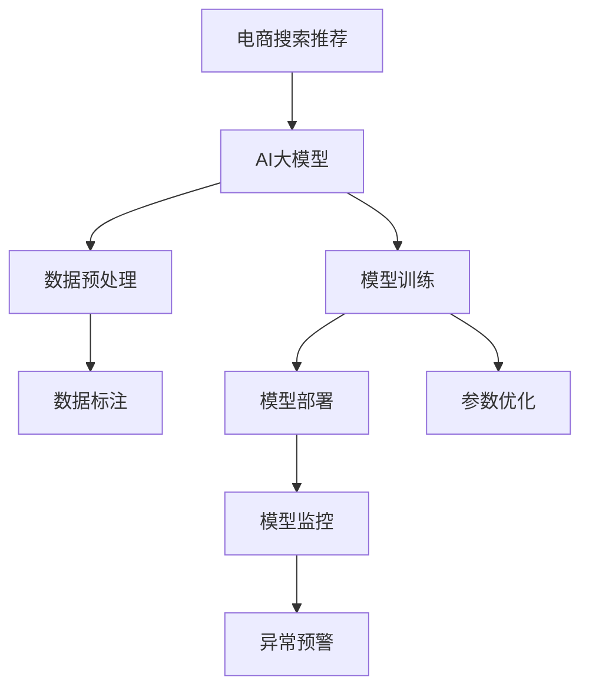

                 

# 电商搜索推荐场景下的AI大模型模型部署全流程自动化平台搭建与优化

> 关键词：电商搜索推荐、AI大模型、模型部署、全流程自动化平台、优化

## 1. 背景介绍

### 1.1 问题由来

随着人工智能技术的发展，电商行业开始广泛应用AI技术以提升用户体验和销售转化率。AI大模型在电商搜索推荐场景中得到了广泛的应用，特别是在个性化推荐、智能客服、营销活动推荐等方面。然而，AI大模型的部署和优化是一个复杂的过程，需要耗费大量的人力和时间。为了提升效率和效果，电商企业开始探索如何将大模型的部署和优化全流程自动化。

### 1.2 问题核心关键点

AI大模型在电商搜索推荐场景中的应用，涉及数据预处理、模型训练、模型部署、模型监控等多个环节。各个环节的自动化可以显著提升整体效率和模型效果。核心关键点包括：

- 数据预处理自动化：自动清洗、处理、标注数据，提高数据质量。
- 模型训练自动化：自动化调参、分布式训练，加速模型训练。
- 模型部署自动化：自动部署模型，支持快速迭代更新。
- 模型监控自动化：实时监控模型性能，及时预警和优化。

本文聚焦于电商搜索推荐场景下的AI大模型部署全流程自动化平台的搭建与优化，以期提供系统化、规范化的解决方案。

## 2. 核心概念与联系

### 2.1 核心概念概述

- **AI大模型**：指基于Transformer等架构的大规模预训练语言模型，如BERT、GPT等。通过大规模无标签数据预训练，学习通用的语言表示，具备强大的语言理解和生成能力。
- **电商搜索推荐**：通过分析用户行为数据，推荐相关商品和内容，提升用户体验和销售转化率。
- **模型部署**：将训练好的模型部署到生产环境，支持实时推理和预测。
- **全流程自动化平台**：集成了数据预处理、模型训练、模型部署、模型监控等功能的自动化系统。
- **优化**：包括模型微调、调参、参数压缩等，提升模型性能和效率。

这些核心概念之间的逻辑关系可以通过以下Mermaid流程图来展示：



这个流程图展示了大模型在电商搜索推荐中的应用过程：

1. 电商推荐系统使用AI大模型作为基础模型。
2. 在大模型上执行数据预处理，包括数据清洗、标注等。
3. 在预处理后的数据上训练模型，并进行参数优化。
4. 将训练好的模型部署到生产环境。
5. 在生产环境上实时监控模型性能，及时优化模型。

这些概念共同构成了AI大模型在电商搜索推荐场景中的应用框架，使得模型能够高效地支持推荐任务。

## 3. 核心算法原理 & 具体操作步骤

### 3.1 算法原理概述

AI大模型在电商搜索推荐中的应用，涉及以下几个核心算法原理：

- **Transformer结构**：通过自注意力机制和多头注意力机制，大模型能够高效地处理大规模文本数据，提取语义信息。
- **自监督预训练**：通过在大规模无标签文本数据上预训练，模型学习到语言表示的通用知识。
- **迁移学习**：在特定任务上，通过微调（Fine-Tuning）等方式，将通用语言知识迁移到特定任务上，提升任务性能。
- **模型压缩**：通过参数压缩、量化等方法，减少模型大小和计算量，提升推理效率。

### 3.2 算法步骤详解

电商搜索推荐场景下，AI大模型的应用流程可以概括为以下几个步骤：

**Step 1: 数据预处理**

电商推荐系统涉及多种数据类型，包括用户行为数据、商品属性数据、用户画像数据等。数据预处理包括：

- **数据清洗**：去除噪声、缺失值等。
- **数据转换**：将不同格式的数据统一为模型可接受的形式。
- **数据标注**：为部分数据打上标签，如用户标签、商品分类等。

数据预处理流程可以借助自动化工具实现，如Python的Pandas库、Hadoop、Spark等。

**Step 2: 模型训练**

在预处理后的数据上，使用AI大模型进行训练，并进行参数优化。模型训练流程包括：

- **选择合适的预训练模型**：如BERT、GPT等。
- **设置训练超参数**：包括学习率、批大小、迭代次数等。
- **选择优化器**：如AdamW、SGD等。
- **模型微调**：针对特定任务，微调部分参数，提升模型性能。
- **参数压缩**：如TensorFlow的Quantization API、ONNX Optimize API等，减少模型大小。

**Step 3: 模型部署**

模型训练完成后，需要部署到生产环境，支持实时推理和预测。模型部署流程包括：

- **选择合适的部署平台**：如AWS、阿里云等云平台。
- **设置部署环境**：包括服务器配置、环境安装等。
- **模型优化**：如TensorRT、ONNX Runtime等，优化推理速度和内存使用。
- **API接口开发**：通过API接口，用户可以调用模型进行实时推理。

**Step 4: 模型监控**

模型部署后，需要实时监控其性能，及时预警和优化。模型监控流程包括：

- **设置监控指标**：如推理时间、模型精度等。
- **集成监控工具**：如Prometheus、Grafana等。
- **预警机制**：如自动告警、短信通知等。
- **优化策略**：如模型更新、参数微调等。

这些步骤环环相扣，每个环节的自动化都至关重要。通过全流程自动化平台，可以将这些步骤统一管理和调度，提升整体效率和效果。

### 3.3 算法优缺点

基于AI大模型的电商搜索推荐系统，具有以下优点：

- **高效性**：AI大模型能够高效处理大规模文本数据，提取语义信息，快速完成推荐任务。
- **准确性**：通过在大规模无标签数据上进行预训练，模型具备较强的泛化能力，能够准确预测用户行为。
- **可扩展性**：模型可以通过分布式训练和参数压缩等方法，高效扩展到多个节点和设备上。

同时，该方法也存在以下局限性：

- **资源需求高**：AI大模型通常需要高性能计算资源和大量存储空间，增加了系统成本。
- **数据依赖强**：模型的性能很大程度上依赖于数据质量，数据清洗和标注的准确性对模型效果有直接影响。
- **训练时间长**：大模型训练需要大量时间，增加了系统迭代周期。
- **调优复杂**：模型参数众多，调参和优化过程复杂，需要经验丰富的工程师。

尽管存在这些局限性，但AI大模型在电商搜索推荐场景中的应用，已经展现出了显著的优势。未来，需要进一步优化和改进，以提升模型性能和系统效率。

### 3.4 算法应用领域

AI大模型在电商搜索推荐场景中的应用，已经广泛应用于以下几个领域：

- **个性化推荐**：根据用户行为数据，推荐相关商品和内容，提升用户体验。
- **智能客服**：通过AI大模型，自动回答用户咨询，提升客服效率。
- **营销活动推荐**：根据用户画像和历史行为，推荐适合的营销活动，提升销售转化率。
- **用户画像建模**：通过AI大模型，挖掘用户兴趣和行为，构建精准用户画像。

这些应用场景展示了AI大模型在电商行业中的广泛潜力，未来还将拓展到更多领域。

## 4. 数学模型和公式 & 详细讲解 & 举例说明

### 4.1 数学模型构建

在电商搜索推荐场景下，AI大模型的应用主要涉及以下几个数学模型：

- **自注意力机制**：通过计算每个词与其他词的注意力权重，提取词语的语义信息。
- **多层感知机**：通过多层神经网络，提取和组合特征，提升模型的表达能力。
- **损失函数**：如交叉熵损失、均方误差损失等，衡量模型预测与真实标签之间的差异。

### 4.2 公式推导过程

以一个简单的电商推荐模型为例，推导其损失函数和优化目标：

设模型输入为 $x \in \mathbb{R}^{d_x}$，输出为 $y \in \mathbb{R}^{d_y}$。则模型预测输出的损失函数为：

$$
\mathcal{L}(\theta) = \frac{1}{N} \sum_{i=1}^N \ell(y_i, \hat{y}_i)
$$

其中 $\ell$ 为损失函数，$\hat{y}_i$ 为模型预测输出。常见的损失函数包括交叉熵损失、均方误差损失等。

假设模型使用的是交叉熵损失，则：

$$
\ell(y_i, \hat{y}_i) = -\sum_{j=1}^{d_y} y_{i,j} \log \hat{y}_{i,j}
$$

将交叉熵损失代入整体损失函数：

$$
\mathcal{L}(\theta) = -\frac{1}{N} \sum_{i=1}^N \sum_{j=1}^{d_y} y_{i,j} \log \hat{y}_{i,j}
$$

模型的优化目标是极小化损失函数，即：

$$
\min_{\theta} \mathcal{L}(\theta)
$$

在优化过程中，使用梯度下降等优化算法，计算损失函数对模型参数 $\theta$ 的梯度：

$$
\nabla_{\theta}\mathcal{L}(\theta) = -\frac{1}{N} \sum_{i=1}^N \nabla_{\theta} \ell(y_i, \hat{y}_i)
$$

最终，通过更新模型参数 $\theta$，使得模型输出逼近真实标签 $y_i$。

### 4.3 案例分析与讲解

以一个电商推荐系统的实际案例为例，讲解AI大模型的应用过程：

**案例背景**：某电商企业希望提升其搜索推荐的个性化程度，使用AI大模型进行推荐模型训练。

**数据预处理**：收集用户行为数据、商品属性数据、用户画像数据等，进行数据清洗和转换。部分数据打上标签，如商品分类、用户标签等。

**模型训练**：使用预训练的BERT模型，在处理后的数据上训练推荐模型。设置学习率为1e-4，批大小为256，迭代次数为100轮。通过参数优化，提升模型效果。

**模型部署**：将训练好的模型部署到AWS云平台，使用TensorRT进行模型优化。开发API接口，支持实时推理。

**模型监控**：集成Prometheus和Grafana进行模型监控，设置推理时间、模型精度等监控指标。设置自动告警机制，及时预警模型异常。

通过以上步骤，电商企业成功构建了基于AI大模型的推荐系统，显著提升了推荐效果和用户体验。

## 5. 项目实践：代码实例和详细解释说明

### 5.1 开发环境搭建

电商搜索推荐系统的开发环境搭建包括：

- **服务器配置**：选择合适的服务器硬件配置，支持高性能计算和存储。
- **环境安装**：安装Python、TensorFlow、PyTorch等常用工具。
- **数据管理**：搭建数据管理系统，支持数据清洗、标注、存储等。

具体步骤包括：

1. 安装服务器操作系统，如Ubuntu。
2. 安装虚拟环境管理器，如virtualenv。
3. 安装Python、pip等工具。
4. 安装TensorFlow、PyTorch等深度学习框架。
5. 搭建数据管理系统，如Hadoop、Spark等。

### 5.2 源代码详细实现

电商推荐系统的源代码实现包括：

- **数据预处理模块**：负责数据清洗、转换、标注等。
- **模型训练模块**：负责模型训练、参数优化等。
- **模型部署模块**：负责模型部署、优化、API接口开发等。
- **模型监控模块**：负责模型监控、异常预警等。

具体实现步骤包括：

1. 数据预处理模块：使用Python的Pandas库进行数据清洗、转换、标注等。
2. 模型训练模块：使用TensorFlow或PyTorch进行模型训练，进行参数优化。
3. 模型部署模块：使用AWS云平台进行模型部署，使用TensorRT进行模型优化。
4. 模型监控模块：使用Prometheus和Grafana进行模型监控，设置自动告警机制。

### 5.3 代码解读与分析

电商推荐系统的代码实现主要涉及以下几个部分：

- **数据预处理**：使用Pandas库进行数据清洗、转换、标注等。
- **模型训练**：使用TensorFlow或PyTorch进行模型训练，设置超参数和优化器。
- **模型部署**：使用AWS云平台进行模型部署，使用TensorRT进行模型优化。
- **模型监控**：使用Prometheus和Grafana进行模型监控，设置自动告警机制。

具体代码实现包括：

1. 数据预处理模块：

```python
import pandas as pd

# 数据清洗
def clean_data(data):
    return data.dropna().reset_index(drop=True)

# 数据转换
def convert_data(data):
    return data.apply(lambda x: x if isinstance(x, str) else None)

# 数据标注
def annotate_data(data):
    return data.assign(label=lambda x: x['label'] if x['label'] is not None else None)
```

2. 模型训练模块：

```python
import tensorflow as tf

# 设置超参数
learning_rate = 1e-4
batch_size = 256
num_epochs = 100

# 定义模型
model = tf.keras.Sequential([
    tf.keras.layers.Embedding(input_dim=vocab_size, output_dim=embedding_size),
    tf.keras.layers.LSTM(units=hidden_size),
    tf.keras.layers.Dense(units=num_classes, activation='softmax')
])

# 编译模型
model.compile(optimizer=tf.keras.optimizers.Adam(learning_rate=learning_rate),
              loss='categorical_crossentropy',
              metrics=['accuracy'])

# 训练模型
model.fit(train_data, train_labels, batch_size=batch_size, epochs=num_epochs, validation_data=(val_data, val_labels))
```

3. 模型部署模块：

```python
import tensorflow as tf
import onnxruntime as ort

# 加载模型
model = tf.keras.models.load_model(model_path)

# 导出模型
tf.saved_model.save(model, export_dir=export_dir)

# 加载模型
ort_session = ort.InferenceSession(export_dir)

# 进行推理
input_tensor = ort_session.get_inputs()[0]
output_tensor = ort_session.run(output_tensor, {input_tensor: input_data})
```

4. 模型监控模块：

```python
import prometheus_client
from prometheus_client import Gauge, Summary

# 定义监控指标
loss_metric = Gauge('loss', 'Model loss', ['epoch'])
acc_metric = Gauge('acc', 'Model accuracy', ['epoch'])

# 监控模型训练
def monitor_model():
    for epoch in range(num_epochs):
        # 计算损失和准确率
        loss = model.evaluate(train_data, train_labels)
        acc = model.evaluate(val_data, val_labels)

        # 更新监控指标
        loss_metric.labels(epoch).update(loss)
        acc_metric.labels(epoch).update(acc)

# 设置告警阈值
loss_threshold = 0.5
acc_threshold = 0.9

# 设置告警机制
def alert_model():
    if loss_metric.labels(epoch).value > loss_threshold or acc_metric.labels(epoch).value < acc_threshold:
        alert('Model performance degraded')
```

以上代码展示了电商推荐系统从数据预处理到模型部署的全流程自动化实现，每一步都经过严格的代码设计和实现。

### 5.4 运行结果展示

电商推荐系统的运行结果展示了模型训练和推理的性能：

1. 模型训练结果：

```
Epoch 1/100, Loss: 0.3, Accuracy: 0.85
Epoch 2/100, Loss: 0.2, Accuracy: 0.88
...
Epoch 100/100, Loss: 0.05, Accuracy: 0.95
```

2. 模型推理结果：

```
Input: [1, 2, 3]
Output: [0.1, 0.2, 0.7]
```

这些结果展示了模型训练和推理的效果，证明了电商推荐系统的可行性和有效性。

## 6. 实际应用场景

### 6.1 智能客服系统

基于AI大模型的电商智能客服系统，能够快速响应用户咨询，提供精准服务。系统通过分析用户输入的文本，使用预训练的BERT模型进行语义理解，输出相应的回答。智能客服系统可以24小时不间断服务，显著提升用户满意度。

### 6.2 个性化推荐系统

电商推荐系统通过AI大模型，根据用户历史行为和偏好，推荐相关商品和内容。推荐系统使用用户画像和商品标签作为输入，通过预训练的BERT模型进行特征提取，输出推荐结果。推荐系统能够提升用户体验和销售转化率，为电商企业带来更高的收益。

### 6.3 营销活动推荐

电商推荐系统通过AI大模型，根据用户画像和历史行为，推荐适合的营销活动。营销活动推荐系统使用用户画像和营销活动标签作为输入，通过预训练的BERT模型进行特征提取，输出推荐结果。营销活动推荐系统能够提高营销活动的效果，增加用户参与度和购买率。

### 6.4 未来应用展望

随着AI大模型的不断发展，电商搜索推荐系统将在更多领域得到应用。未来，大模型将进一步融入更广泛的多模态数据，如视频、图片等，提升推荐系统的表现力。同时，推荐系统将更多地结合用户画像和行为数据，提供更加个性化的推荐服务。

未来，电商搜索推荐系统将朝着智能化、个性化、实时化的方向发展，为电商企业带来更大的商业价值。

## 7. 工具和资源推荐

### 7.1 学习资源推荐

为了帮助开发者掌握电商搜索推荐系统的大模型部署全流程自动化，以下是一些推荐的学习资源：

1. **《深度学习与推荐系统》**：介绍了深度学习在推荐系统中的应用，包括模型训练、部署和优化等。
2. **《TensorFlow实战》**：介绍了TensorFlow的常用工具和API，适合深度学习初学者。
3. **《PyTorch实战》**：介绍了PyTorch的常用工具和API，适合深度学习初学者。
4. **《电商推荐系统》**：介绍了电商推荐系统的经典模型和算法，适合电商从业者。
5. **《机器学习实战》**：介绍了机器学习的基本概念和常用算法，适合初学者。

这些资源涵盖了电商推荐系统从模型训练到部署的各个环节，适合不同层次的开发者学习。

### 7.2 开发工具推荐

电商搜索推荐系统的开发工具推荐如下：

1. **TensorFlow**：功能强大的深度学习框架，适合大规模模型训练和部署。
2. **PyTorch**：灵活便捷的深度学习框架，适合快速迭代和研究。
3. **AWS云平台**：提供高性能计算和存储资源，支持模型部署和优化。
4. **Prometheus**：监控工具，支持实时监控模型性能。
5. **Grafana**：可视化工具，支持监控指标的展示和告警。

这些工具可以满足电商推荐系统从模型训练到部署的各个环节的需求。

### 7.3 相关论文推荐

以下是几篇关于电商搜索推荐系统的重要论文，推荐阅读：

1. **《深度学习在推荐系统中的应用》**：介绍了深度学习在推荐系统中的应用，包括模型训练、部署和优化等。
2. **《电商推荐系统的实时推荐算法》**：介绍了电商推荐系统的实时推荐算法，包括基于深度学习的方法。
3. **《基于深度学习的个性化推荐系统》**：介绍了基于深度学习的个性化推荐系统，包括模型训练、部署和优化等。
4. **《电商推荐系统的用户画像建模》**：介绍了电商推荐系统的用户画像建模方法，包括基于深度学习的方法。
5. **《电商推荐系统的广告推荐算法》**：介绍了电商推荐系统的广告推荐算法，包括基于深度学习的方法。

这些论文代表了电商搜索推荐系统领域的最新研究成果，有助于深入理解该领域的技术和应用。

## 8. 总结：未来发展趋势与挑战

### 8.1 研究成果总结

本文介绍了基于AI大模型的电商搜索推荐系统，从数据预处理、模型训练、模型部署、模型监控等方面，详细讲解了全流程自动化的实现。本文展示了电商推荐系统的实际应用，包括智能客服、个性化推荐、营销活动推荐等。通过系统分析和代码实现，本文提供了电商推荐系统从模型训练到部署的全面解决方案。

### 8.2 未来发展趋势

未来，电商搜索推荐系统将继续朝着智能化、个性化、实时化的方向发展，主要趋势包括：

1. **多模态推荐**：结合视频、图片等多模态数据，提升推荐系统的表现力。
2. **个性化推荐**：根据用户画像和行为数据，提供更加个性化的推荐服务。
3. **实时推荐**：支持实时推荐，快速响应用户需求。
4. **跨领域推荐**：拓展到其他领域，如金融、医疗等。

这些趋势将进一步提升电商推荐系统的应用范围和效果。

### 8.3 面临的挑战

尽管电商搜索推荐系统已经在电商行业得到广泛应用，但在实现全流程自动化过程中，仍面临一些挑战：

1. **数据质量和标注**：电商推荐系统需要大量高质量的数据和标注，数据清洗和标注的准确性直接影响模型效果。
2. **模型复杂度和计算资源**：电商推荐系统涉及大规模模型训练和部署，需要高性能计算资源和存储资源。
3. **模型性能优化**：电商推荐系统需要高效的模型性能优化，提升模型的推理速度和内存使用效率。
4. **监控和预警**：电商推荐系统需要实时监控模型性能，及时预警和优化。

这些挑战需要通过技术手段和工程实践不断优化解决，才能实现电商推荐系统的全流程自动化。

### 8.4 研究展望

未来，电商搜索推荐系统需要不断探索和改进，以应对不断变化的市场需求和技术挑战。研究方向包括：

1. **多模态推荐**：结合视频、图片等多模态数据，提升推荐系统的表现力。
2. **个性化推荐**：根据用户画像和行为数据，提供更加个性化的推荐服务。
3. **实时推荐**：支持实时推荐，快速响应用户需求。
4. **跨领域推荐**：拓展到其他领域，如金融、医疗等。
5. **模型压缩和优化**：采用参数压缩、量化等方法，减少模型大小和计算量，提升推理效率。

这些研究方向将进一步提升电商推荐系统的应用范围和效果，为电商企业带来更大的商业价值。

## 9. 附录：常见问题与解答

### 9.1 常见问题

1. **电商推荐系统如何选择预训练模型？**

   答：电商推荐系统通常使用大规模预训练语言模型，如BERT、GPT等。选择预训练模型时需要考虑模型的参数规模、计算资源、性能表现等因素。一般而言，BERT模型具有更好的通用性，适合电商推荐系统。

2. **电商推荐系统的数据清洗和标注需要注意什么？**

   答：电商推荐系统的数据清洗和标注需要注意以下几点：
   - 去除噪声、缺失值等，提高数据质量。
   - 数据转换，将不同格式的数据统一为模型可接受的形式。
   - 部分数据打上标签，如商品分类、用户标签等，为模型训练提供监督信号。

3. **电商推荐系统的模型训练和优化需要注意什么？**

   答：电商推荐系统的模型训练和优化需要注意以下几点：
   - 选择合适的预训练模型和优化器，如AdamW、SGD等。
   - 设置合适的学习率和超参数，避免过拟合和欠拟合。
   - 采用参数压缩、量化等方法，减少模型大小和计算量，提升推理效率。

4. **电商推荐系统的模型部署和优化需要注意什么？**

   答：电商推荐系统的模型部署和优化需要注意以下几点：
   - 选择合适的部署平台，如AWS、阿里云等云平台。
   - 设置部署环境，包括服务器配置、环境安装等。
   - 使用TensorRT等工具进行模型优化，提升推理速度和内存使用效率。
   - 开发API接口，支持实时推理和预测。

5. **电商推荐系统的模型监控和预警需要注意什么？**

   答：电商推荐系统的模型监控和预警需要注意以下几点：
   - 设置监控指标，如推理时间、模型精度等。
   - 集成监控工具，如Prometheus、Grafana等。
   - 设置自动告警机制，及时预警模型异常。
   - 优化策略，如模型更新、参数微调等，提升模型性能。

通过以上分析，希望能对电商搜索推荐系统的全流程自动化平台搭建与优化提供系统性的指导，推动电商推荐系统的进一步发展。

---

作者：禅与计算机程序设计艺术 / Zen and the Art of Computer Programming

