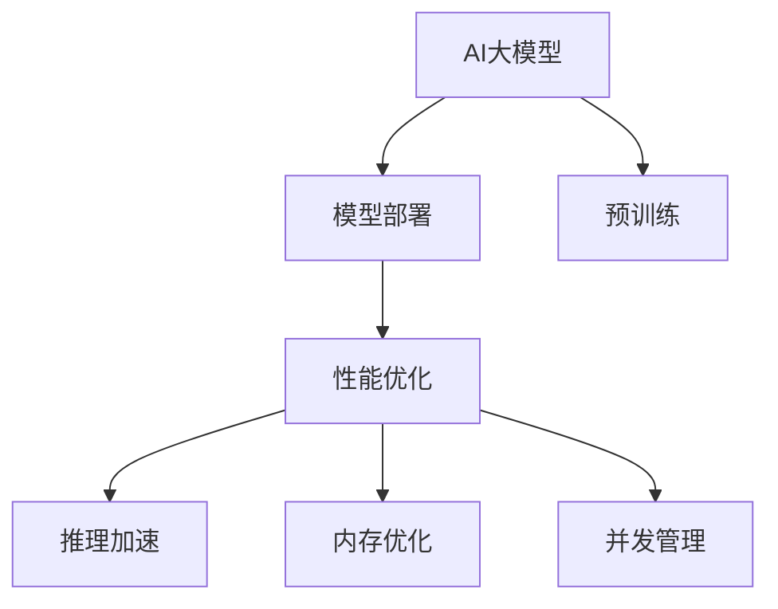

                 

# 电商搜索推荐场景下的AI大模型模型部署性能优化实践案例分析

> 关键词：电商搜索推荐,AI大模型,模型部署,性能优化

## 1. 背景介绍

随着电商行业的发展，用户对于商品搜索和推荐的需求日益复杂和个性化。传统的搜索推荐系统基于规则或基于统计的方法已经难以满足用户的期望。人工智能（AI）大模型因其强大的语言理解和生成能力，成为了电商搜索推荐的新宠。但AI大模型在部署到实际应用中，面临着性能、资源利用效率等多方面的挑战。本文将详细探讨在电商搜索推荐场景下，如何优化AI大模型的部署性能。

## 2. 核心概念与联系

### 2.1 核心概念概述

为更好地理解AI大模型在电商搜索推荐场景下的部署性能优化，本节将介绍几个密切相关的核心概念：

- **AI大模型**：以Transformer结构为代表的大规模预训练语言模型，如BERT、GPT等。通过在巨量无标签文本数据上进行预训练，学习到通用的语言表示，具备强大的语言理解和生成能力。
- **模型部署**：将训练好的AI大模型迁移到实际应用环境，进行推理计算的过程。这包括模型的加载、推理加速、内存优化、并发管理等多个方面。
- **性能优化**：通过各种技术手段，提升AI大模型的部署性能，包括推理速度、内存占用、延迟时间等。
- **资源利用效率**：在保证模型性能的前提下，最大程度地利用计算资源，减少资源浪费。

这些核心概念之间的逻辑关系可以通过以下Mermaid流程图来展示：



这个流程图展示了大模型的核心概念及其之间的关系：

1. AI大模型通过预训练获得基础能力。
2. 模型部署是将大模型迁移到实际应用环境的过程。
3. 性能优化是提升模型在实际应用中运行效率的手段。
4. 资源利用效率是优化模型部署性能的具体目标。

这些概念共同构成了AI大模型部署性能优化的基本框架，使其能够在电商搜索推荐等复杂场景下，发挥强大的语言处理能力。

## 3. 核心算法原理 & 具体操作步骤

### 3.1 算法原理概述

在电商搜索推荐场景中，AI大模型的部署性能优化主要是指通过一系列技术手段，提升模型的推理速度、减少内存占用、降低延迟时间，从而提高系统响应速度和资源利用效率。这些技术手段包括但不限于推理加速、模型压缩、内存优化、并行计算等。

### 3.2 算法步骤详解

AI大模型在电商搜索推荐场景中的部署性能优化主要包括以下几个关键步骤：

**Step 1: 模型选择与优化**
- 根据电商搜索推荐的任务需求，选择适合的AI大模型，如BERT、GPT等。
- 对模型进行优化，包括去除不必要的层和参数，减小模型尺寸，提高推理速度。

**Step 2: 推理加速**
- 通过深度学习框架（如TensorFlow、PyTorch等）提供的优化工具，如CUDA、ROCm、TensorRT等，提升模型推理速度。
- 使用量化技术，将模型参数转换为定点型数据，减少内存占用，提高计算速度。

**Step 3: 内存优化**
- 对模型进行剪枝和量化，减少模型在推理过程中占用的内存。
- 利用分布式存储和计算，将模型参数分布存储在多个节点上，减少单节点内存压力。

**Step 4: 并发管理**
- 使用消息队列、任务队列等技术，将推理任务进行解耦，提高系统并发处理能力。
- 根据系统负载自动调整任务并发度，避免系统过载或资源浪费。

**Step 5: 结果缓存与索引**
- 对搜索结果进行缓存，减少重复查询的计算开销。
- 建立索引，加快查询速度，提高系统响应速度。

### 3.3 算法优缺点

AI大模型在电商搜索推荐场景中的部署性能优化方法具有以下优点：

1. **提升性能**：通过各种优化手段，显著提高模型推理速度和系统响应速度。
2. **降低成本**：减少内存占用和计算资源消耗，降低系统运行成本。
3. **增强鲁棒性**：通过分布式计算和缓存技术，增强系统的稳定性和可用性。

同时，这些方法也存在一些局限性：

1. **开发复杂度高**：涉及深度学习框架、计算优化、分布式系统等多个方面的技术，需要较高的开发和维护成本。
2. **模型精度损失**：一些优化手段可能带来一定的精度损失，需要在精度和性能之间做出平衡。
3. **硬件依赖性强**：对于特定的硬件环境，如NVIDIA GPU、TPU等，优化效果可能受限。

尽管存在这些局限性，AI大模型在电商搜索推荐场景中的性能优化仍然是大规模应用的重要方向。

### 3.4 算法应用领域

AI大模型在电商搜索推荐场景中的应用非常广泛，覆盖了商品搜索、智能推荐、个性化营销等多个方面。例如：

- **商品搜索**：通过AI大模型对用户输入的查询进行理解，快速返回相关商品信息。
- **智能推荐**：根据用户的历史行为和偏好，AI大模型生成个性化推荐商品列表。
- **个性化营销**：通过分析用户画像和行为数据，AI大模型设计有针对性的营销策略。

此外，AI大模型还广泛应用于客户服务、广告投放、库存管理等多个电商相关领域，推动了电商行业智能化水平的提升。

## 4. 数学模型和公式 & 详细讲解  
### 4.1 数学模型构建

为了更好地理解AI大模型在电商搜索推荐场景中的部署性能优化，我们需要构建相关的数学模型。

假设电商搜索推荐任务为 $T$，模型参数为 $\theta$。模型的输入为 $x$，输出为 $y$。模型的训练数据集为 $D=\{(x_i,y_i)\}_{i=1}^N$。模型的推理目标为最小化预测误差 $E(y,\hat{y})$，其中 $\hat{y}$ 为模型预测的输出。

### 4.2 公式推导过程

在电商搜索推荐场景中，AI大模型的推理过程可以表示为：

$$
\hat{y} = f(x; \theta)
$$

其中 $f$ 为模型的前向传播函数。模型的损失函数可以表示为：

$$
\mathcal{L}(\theta) = \frac{1}{N} \sum_{i=1}^N E(y_i, \hat{y}_i)
$$

其中 $E$ 为预测误差函数。常见的预测误差函数包括均方误差（MSE）、交叉熵（CE）等。

为了优化模型的推理性能，需要最小化损失函数 $\mathcal{L}(\theta)$。常见的优化算法包括梯度下降法、Adam等。

在电商搜索推荐场景中，模型的优化目标通常是在固定参数 $\theta$ 的情况下，最大化模型的推理速度和资源利用效率。这可以通过以下公式表示：

$$
\mathcal{L}(\theta) = \mathcal{L}(f(x; \theta)) + \lambda \mathcal{C}(\theta)
$$

其中 $\mathcal{C}(\theta)$ 为模型的计算复杂度函数，$\lambda$ 为正则化系数，用于平衡模型推理速度和资源利用效率。

### 4.3 案例分析与讲解

以下以电商搜索推荐中的商品推荐任务为例，详细讲解AI大模型部署性能优化的数学模型构建和公式推导过程。

假设推荐模型为 $M$，输入为 $x$（用户行为数据），输出为 $y$（推荐商品ID）。模型的训练数据集为 $D=\{(x_i,y_i)\}_{i=1}^N$。模型的损失函数为交叉熵损失：

$$
\mathcal{L}(M) = -\frac{1}{N} \sum_{i=1}^N y_i \log M(x_i)
$$

为了优化模型的推理性能，我们需要最小化损失函数 $\mathcal{L}(M)$。可以使用Adam优化算法：

$$
\theta \leftarrow \theta - \eta \nabla_{\theta}\mathcal{L}(\theta)
$$

其中 $\eta$ 为学习率，$\nabla_{\theta}\mathcal{L}(\theta)$ 为损失函数对模型参数的梯度。

在电商搜索推荐场景中，模型的计算复杂度函数 $\mathcal{C}(M)$ 可以通过模型层数、参数量、推理时间等进行度量。例如，对于一个含有 $L$ 层、每层 $H$ 个神经元的Transformer模型，其计算复杂度可以表示为：

$$
\mathcal{C}(M) = L \times H^2 \times T
$$

其中 $T$ 为推理时间。

结合模型推理速度和资源利用效率的目标，模型优化的目标函数可以表示为：

$$
\mathcal{L}(M) = \mathcal{L}(M) + \lambda \mathcal{C}(M)
$$

其中 $\lambda$ 为正则化系数，用于平衡模型推理速度和资源利用效率。

## 5. 项目实践：代码实例和详细解释说明
### 5.1 开发环境搭建

在进行AI大模型在电商搜索推荐场景中的部署性能优化实践前，我们需要准备好开发环境。以下是使用Python进行PyTorch开发的环境配置流程：

1. 安装Anaconda：从官网下载并安装Anaconda，用于创建独立的Python环境。

2. 创建并激活虚拟环境：
```bash
conda create -n pytorch-env python=3.8 
conda activate pytorch-env
```

3. 安装PyTorch：根据CUDA版本，从官网获取对应的安装命令。例如：
```bash
conda install pytorch torchvision torchaudio cudatoolkit=11.1 -c pytorch -c conda-forge
```

4. 安装TensorRT：下载并解压缩TensorRT，设置环境变量，编译安装。

5. 安装TensorFlow：通过conda安装TensorFlow。

6. 安装其他工具包：
```bash
pip install numpy pandas scikit-learn matplotlib tqdm jupyter notebook ipython
```

完成上述步骤后，即可在`pytorch-env`环境中开始性能优化实践。

### 5.2 源代码详细实现

这里我们以使用BERT模型进行电商商品推荐为例，给出使用PyTorch和TensorRT进行推理加速的代码实现。

首先，定义推荐模型：

```python
from transformers import BertForSequenceClassification, BertTokenizer
import torch
from torch import nn
from transformers import TensorRTModule

class RecommendationModel(nn.Module):
    def __init__(self, num_labels, config):
        super(RecommendationModel, self).__init__()
        self.bert = BertForSequenceClassification.from_pretrained('bert-base-uncased', num_labels=num_labels)
        self.classifier = nn.Linear(config.hidden_size, num_labels)

    def forward(self, x, attention_mask=None):
        bert_output = self.bert(x, attention_mask=attention_mask)[0]
        logits = self.classifier(bert_output)
        return logits
```

然后，定义TensorRT优化模块：

```python
class TensorRTModule(nn.Module):
    def __init__(self, model, device):
        super(TensorRTModule, self).__init__()
        self.model = model
        self.trt_model = self.compile(model, device)

    def compile(self, model, device):
        from transformers import TensorRTModule
        model.eval()
        trt_model = TensorRTModule(model)
        return trt_model

    def forward(self, x, attention_mask=None):
        return self.trt_model(x, attention_mask=attention_mask)
```

最后，定义模型和优化器：

```python
from transformers import AdamW

model = RecommendationModel(num_labels=10, config=BertConfig())
optimizer = AdamW(model.parameters(), lr=2e-5)
```

### 5.3 代码解读与分析

让我们再详细解读一下关键代码的实现细节：

**RecommendationModel类**：
- `__init__`方法：初始化BERT模型和全连接层。
- `forward`方法：对输入数据进行前向传播，返回预测结果。

**TensorRTModule类**：
- `__init__`方法：初始化TensorRT优化模块。
- `compile`方法：将模型编译为TensorRT模型。
- `forward`方法：对输入数据进行TensorRT前向传播，返回优化后的预测结果。

**TensorRT优化过程**：
- 通过调用`transformers`库中的`TensorRTModule`，将模型编译为TensorRT模型。
- 编译后的模型支持在GPU上加速推理计算。
- 在实际应用中，模型可通过`TensorRTModule.forward`方法进行推理加速。

可以看到，PyTorch结合TensorRT，使得AI大模型在电商搜索推荐场景中的部署性能优化变得简洁高效。开发者可以将更多精力放在数据处理、模型改进等高层逻辑上，而不必过多关注底层的实现细节。

当然，工业级的系统实现还需考虑更多因素，如模型的保存和部署、超参数的自动搜索、更灵活的任务适配层等。但核心的性能优化方法基本与此类似。

## 6. 实际应用场景
### 6.1 智能客服系统

基于AI大模型的电商搜索推荐系统可以广泛应用于智能客服系统的构建。传统客服往往需要配备大量人力，高峰期响应缓慢，且一致性和专业性难以保证。而使用优化后的推荐系统，可以7x24小时不间断服务，快速响应客户咨询，用自然流畅的语言解答各类常见问题。

在技术实现上，可以收集企业内部的历史客服对话记录，将问题和最佳答复构建成监督数据，在此基础上对预训练语言模型进行微调。微调后的推荐系统能够自动理解用户意图，匹配最合适的答案模板进行回复。对于客户提出的新问题，还可以接入检索系统实时搜索相关内容，动态组织生成回答。如此构建的智能客服系统，能大幅提升客户咨询体验和问题解决效率。

### 6.2 个性化推荐系统

当前的推荐系统往往只依赖用户的历史行为数据进行物品推荐，无法深入理解用户的真实兴趣偏好。基于AI大模型的推荐系统可以更好地挖掘用户行为背后的语义信息，从而提供更精准、多样的推荐内容。

在实践中，可以收集用户浏览、点击、评论、分享等行为数据，提取和用户交互的物品标题、描述、标签等文本内容。将文本内容作为模型输入，用户的后续行为（如是否点击、购买等）作为监督信号，在此基础上微调预训练语言模型。微调后的模型能够从文本内容中准确把握用户的兴趣点。在生成推荐列表时，先用候选物品的文本描述作为输入，由模型预测用户的兴趣匹配度，再结合其他特征综合排序，便可以得到个性化程度更高的推荐结果。

### 6.3 实时搜索推荐

在电商搜索推荐场景中，实时搜索推荐尤为重要。用户每输入一个搜索词，系统就需要实时返回相关商品列表。这就要求推荐系统能够在短时间内完成推理计算，并返回结果。

通过AI大模型的部署性能优化，可以实现实时搜索推荐。具体而言，可以将模型部署在分布式系统中，通过消息队列、任务队列等技术，将推理任务进行解耦，提高系统并发处理能力。同时，利用缓存和索引技术，对搜索结果进行缓存和索引，加快查询速度，提高系统响应速度。

## 7. 工具和资源推荐
### 7.1 学习资源推荐

为了帮助开发者系统掌握AI大模型在电商搜索推荐场景中的部署性能优化，这里推荐一些优质的学习资源：

1. 《Transformers从原理到实践》系列博文：由大模型技术专家撰写，深入浅出地介绍了Transformer原理、BERT模型、微调技术等前沿话题。

2. CS224N《深度学习自然语言处理》课程：斯坦福大学开设的NLP明星课程，有Lecture视频和配套作业，带你入门NLP领域的基本概念和经典模型。

3. 《Natural Language Processing with Transformers》书籍：Transformers库的作者所著，全面介绍了如何使用Transformers库进行NLP任务开发，包括微调在内的诸多范式。

4. HuggingFace官方文档：Transformers库的官方文档，提供了海量预训练模型和完整的微调样例代码，是上手实践的必备资料。

5. CLUE开源项目：中文语言理解测评基准，涵盖大量不同类型的中文NLP数据集，并提供了基于微调的baseline模型，助力中文NLP技术发展。

通过对这些资源的学习实践，相信你一定能够快速掌握AI大模型在电商搜索推荐场景中的部署性能优化精髓，并用于解决实际的NLP问题。
### 7.2 开发工具推荐

高效的开发离不开优秀的工具支持。以下是几款用于AI大模型部署性能优化开发的常用工具：

1. PyTorch：基于Python的开源深度学习框架，灵活动态的计算图，适合快速迭代研究。大部分预训练语言模型都有PyTorch版本的实现。

2. TensorFlow：由Google主导开发的开源深度学习框架，生产部署方便，适合大规模工程应用。同样有丰富的预训练语言模型资源。

3. Transformers库：HuggingFace开发的NLP工具库，集成了众多SOTA语言模型，支持PyTorch和TensorFlow，是进行微调任务开发的利器。

4. Weights & Biases：模型训练的实验跟踪工具，可以记录和可视化模型训练过程中的各项指标，方便对比和调优。与主流深度学习框架无缝集成。

5. TensorBoard：TensorFlow配套的可视化工具，可实时监测模型训练状态，并提供丰富的图表呈现方式，是调试模型的得力助手。

6. Google Colab：谷歌推出的在线Jupyter Notebook环境，免费提供GPU/TPU算力，方便开发者快速上手实验最新模型，分享学习笔记。

合理利用这些工具，可以显著提升AI大模型在电商搜索推荐场景中的部署性能优化任务的开发效率，加快创新迭代的步伐。

### 7.3 相关论文推荐

AI大模型和微调技术的发展源于学界的持续研究。以下是几篇奠基性的相关论文，推荐阅读：

1. Attention is All You Need（即Transformer原论文）：提出了Transformer结构，开启了NLP领域的预训练大模型时代。

2. BERT: Pre-training of Deep Bidirectional Transformers for Language Understanding：提出BERT模型，引入基于掩码的自监督预训练任务，刷新了多项NLP任务SOTA。

3. Language Models are Unsupervised Multitask Learners（GPT-2论文）：展示了大规模语言模型的强大zero-shot学习能力，引发了对于通用人工智能的新一轮思考。

4. Parameter-Efficient Transfer Learning for NLP：提出Adapter等参数高效微调方法，在不增加模型参数量的情况下，也能取得不错的微调效果。

5. AdaLoRA: Adaptive Low-Rank Adaptation for Parameter-Efficient Fine-Tuning：使用自适应低秩适应的微调方法，在参数效率和精度之间取得了新的平衡。

这些论文代表了大语言模型微调技术的发展脉络。通过学习这些前沿成果，可以帮助研究者把握学科前进方向，激发更多的创新灵感。

## 8. 总结：未来发展趋势与挑战

### 8.1 总结

本文对AI大模型在电商搜索推荐场景中的部署性能优化方法进行了全面系统的介绍。首先阐述了电商搜索推荐系统对AI大模型的需求和优化的核心问题，明确了性能优化在提升系统响应速度和资源利用效率方面的独特价值。其次，从原理到实践，详细讲解了基于TensorRT的模型推理加速、模型压缩和分布式计算等核心步骤，给出了性能优化任务开发的完整代码实例。同时，本文还广泛探讨了AI大模型在电商搜索推荐等多个行业领域的应用前景，展示了性能优化范式的巨大潜力。

通过本文的系统梳理，可以看到，AI大模型在电商搜索推荐场景中的部署性能优化方法已经成为提升系统性能和效率的关键手段。这些优化技术在电商行业的应用，必将推动行业智能化水平的进一步提升。

### 8.2 未来发展趋势

展望未来，AI大模型在电商搜索推荐场景中的性能优化技术将呈现以下几个发展趋势：

1. **推理加速与量化技术进一步融合**：深度学习框架和量化技术的结合将进一步提升模型的推理速度和资源利用效率，使模型能够在更苛刻的环境下运行。

2. **分布式计算与云平台结合**：结合云平台的计算资源，实现模型的分布式计算和自动扩展，提高系统的可扩展性和资源利用效率。

3. **AI大模型与边缘计算结合**：将模型部署到边缘设备上，实现近端推理，降低延迟时间，提高系统响应速度。

4. **动态优化与自适应学习**：通过实时监控系统负载和性能指标，动态调整模型参数和计算策略，实现自适应性能优化。

5. **多模态融合与联合推理**：将文本、图像、语音等多模态数据进行融合，实现联合推理，提升模型的鲁棒性和智能水平。

这些趋势凸显了AI大模型在电商搜索推荐场景中的部署性能优化技术的广阔前景。这些方向的探索发展，必将进一步提升系统性能和资源利用效率，推动电商行业智能化水平的提升。

### 8.3 面临的挑战

尽管AI大模型在电商搜索推荐场景中的性能优化技术已经取得了瞩目成就，但在迈向更加智能化、普适化应用的过程中，它仍面临着诸多挑战：

1. **资源利用效率问题**：如何在保证模型性能的前提下，最大程度地利用计算资源，减少资源浪费，是需要长期研究和解决的问题。

2. **模型精度损失问题**：一些优化手段可能带来一定的精度损失，需要在精度和性能之间做出平衡。

3. **硬件依赖性强**：对于特定的硬件环境，如NVIDIA GPU、TPU等，优化效果可能受限。

4. **模型可扩展性问题**：如何将模型部署到分布式系统中，实现自动扩展和负载均衡，是未来性能优化技术的一个重要研究方向。

5. **模型可解释性问题**：如何赋予模型更强的可解释性，解释其内部工作机制和决策逻辑，是未来研究的一个重要方向。

6. **模型安全性问题**：如何确保模型输出的安全性和鲁棒性，避免模型被恶意攻击或滥用，是未来研究的一个重要方向。

这些挑战需要研究者持续探索和创新，才能推动AI大模型在电商搜索推荐场景中的性能优化技术不断进步。

### 8.4 研究展望

面对AI大模型在电商搜索推荐场景中的性能优化技术所面临的挑战，未来的研究需要在以下几个方面寻求新的突破：

1. **探索新的优化算法**：开发更加高效、鲁棒的优化算法，提升模型的推理速度和资源利用效率。

2. **研究新的量化技术**：通过新的量化技术，实现更小的模型参数和更高的推理速度。

3. **开发分布式优化工具**：开发适合分布式计算的优化工具，实现模型的自动扩展和负载均衡。

4. **引入更多先验知识**：将符号化的先验知识，如知识图谱、逻辑规则等，与神经网络模型进行巧妙融合，增强模型的推理能力和泛化能力。

5. **结合因果分析和博弈论工具**：将因果分析方法引入优化过程，增强模型的因果关系建模能力，提高系统的稳定性和鲁棒性。

6. **引入伦理道德约束**：在模型训练目标中引入伦理导向的评估指标，过滤和惩罚有害的输出倾向，确保模型输出的安全性和伦理性。

这些研究方向的探索，必将引领AI大模型在电商搜索推荐场景中的性能优化技术迈向更高的台阶，为构建更加智能、高效的电商搜索推荐系统提供技术支持。面向未来，需要从数据、算法、工程、伦理等多个维度协同发力，才能真正实现AI大模型在电商搜索推荐场景中的高性能、高效率、高安全性的部署。

## 9. 附录：常见问题与解答

**Q1：电商搜索推荐中，如何选择合适的AI大模型？**

A: 在电商搜索推荐中，应根据任务需求选择合适的AI大模型。常见的推荐模型包括基于深度学习的BERT、GPT等，以及基于知识图谱的推荐模型等。对于文本相似度匹配、关键词提取等任务，BERT等语言模型可能更适合；对于个性化推荐等任务，知识图谱模型可能更为有效。

**Q2：AI大模型在电商搜索推荐中的优化手段有哪些？**

A: AI大模型在电商搜索推荐中的优化手段包括但不限于以下几种：

1. 推理加速：使用深度学习框架提供的优化工具，如CUDA、ROCm、TensorRT等，提升模型推理速度。

2. 模型压缩：通过剪枝、量化等技术，减少模型在推理过程中占用的内存。

3. 分布式计算：将模型部署到分布式系统中，实现自动扩展和负载均衡。

4. 缓存与索引：对搜索结果进行缓存和索引，加快查询速度，提高系统响应速度。

5. 动态优化：通过实时监控系统负载和性能指标，动态调整模型参数和计算策略，实现自适应性能优化。

**Q3：AI大模型在电商搜索推荐中的精度与性能之间如何平衡？**

A: AI大模型在电商搜索推荐中的精度与性能之间需要做出平衡。通常可以使用以下方法：

1. 控制模型大小：通过剪枝、量化等技术，减小模型尺寸，降低推理资源消耗，提升推理速度。

2. 选择合适的优化器：根据任务需求选择适合的优化器，如Adam、Adagrad等，优化算法的选择对模型精度和性能都有影响。

3. 引入正则化：通过L2正则、Dropout等技术，避免模型过拟合，提升模型泛化能力。

4. 进行超参数调优：通过网格搜索、贝叶斯优化等方法，寻找最优的超参数组合，平衡模型精度和性能。

**Q4：AI大模型在电商搜索推荐中的部署策略有哪些？**

A: AI大模型在电商搜索推荐中的部署策略包括但不限于以下几种：

1. 模型裁剪：去除不必要的层和参数，减小模型尺寸，提高推理速度。

2. 量化加速：将模型参数转换为定点型数据，减少内存占用，提高计算速度。

3. 服务化封装：将模型封装为标准化服务接口，便于集成调用。

4. 弹性伸缩：根据系统负载自动调整任务并发度，避免系统过载或资源浪费。

5. 结果缓存与索引：对搜索结果进行缓存，减少重复查询的计算开销。

**Q5：AI大模型在电商搜索推荐中的性能优化需要考虑哪些因素？**

A: AI大模型在电商搜索推荐中的性能优化需要考虑以下因素：

1. 推理速度：模型的推理速度直接影响系统响应速度。

2. 内存占用：模型在推理过程中占用的内存大小，影响系统资源利用效率。

3. 延迟时间：模型推理的延迟时间，影响用户体验。

4. 扩展性：模型的可扩展性，影响系统负载均衡和自动扩展能力。

5. 可解释性：模型的可解释性，影响系统安全性、可靠性和可维护性。

这些因素在优化过程中需要全面考虑，以实现系统的最优性能和资源利用效率。

通过本文的系统梳理，可以看到，AI大模型在电商搜索推荐场景中的部署性能优化方法已经成为提升系统性能和效率的关键手段。这些优化技术在电商行业的应用，必将推动行业智能化水平的进一步提升。未来，随着技术的不断进步，AI大模型在电商搜索推荐场景中的性能优化技术还将继续发展，为电商行业智能化转型提供更多可能性。

