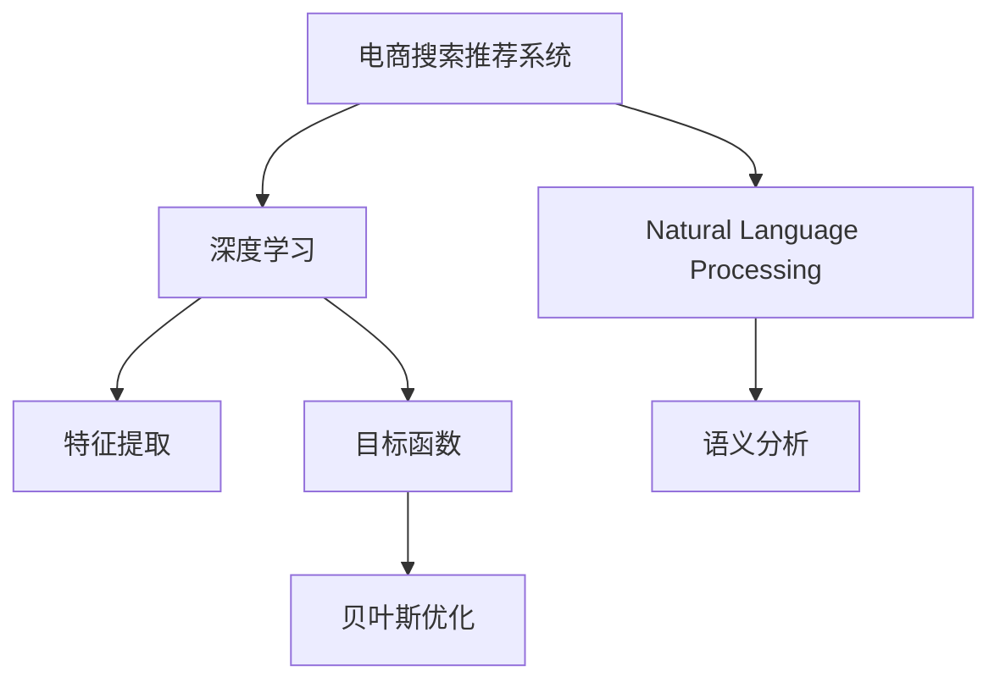

                 

# 电商搜索推荐效果评估中的AI大模型思路

> 关键词：人工智能,电商搜索,推荐系统,自然语言处理(NLP),深度学习,贝叶斯优化,BERT,Amazon推荐系统

## 1. 背景介绍

### 1.1 问题由来
在电商领域，搜索推荐系统是连接用户和商品的重要桥梁。搜索推荐的效果直接影响到用户的购物体验和转化率，对电商平台的用户粘性、交易额和竞争力有着至关重要的影响。近年来，随着AI技术的迅猛发展，深度学习、自然语言处理(NLP)、强化学习等先进技术被广泛应用于电商搜索推荐系统中，取得了显著的效果。

然而，现有研究往往集中在模型架构、训练方法、特征工程等方面，忽略了对模型效果的全面评估。在实际应用中，不同的评价指标可能会导致模型优劣的误判，进而影响搜索推荐系统的优化方向。因此，本文从电商搜索推荐效果评估的角度出发，提出了一套基于AI大模型的评估思路，旨在全面、准确地衡量和优化搜索推荐系统的表现。

### 1.2 问题核心关键点
本文关注的核心问题在于：如何设计一套全面的评估指标体系，准确度量电商搜索推荐系统的表现？该评估体系应覆盖模型效果、用户行为、数据质量等多个方面，涵盖精确度、召回率、平均点击率、平均停留时间、点击转化率等核心指标，提供系统性、科学性的评估标准。

通过科学评估指标的指导，可以更有效地训练和优化搜索推荐系统，提升其对用户需求的匹配度和个性化推荐效果，提升用户满意度和电商平台竞争力。同时，科学评估也有助于优化广告投放、库存管理等电商相关业务，最大化商业价值。

## 2. 核心概念与联系

### 2.1 核心概念概述

为了更好地理解本文的评估思路，我们首先介绍几个核心概念：

- **电商搜索推荐系统**：通过分析用户的搜索历史、行为数据等，预测用户可能感兴趣的商品，并为其推荐相应的搜索结果。
- **深度学习**：一种基于神经网络的机器学习方法，通过学习大规模数据集的分布特征，自动提取并表达特征，进行分类、预测等任务。
- **自然语言处理(NLP)**：研究如何让计算机理解和生成人类语言的技术，包括文本分类、实体识别、语义分析等。
- **贝叶斯优化**：一种基于概率模型的方法，通过优化目标函数，寻找最优的模型超参数，提高模型泛化能力和性能。

这些概念之间的逻辑关系可以通过以下Mermaid流程图来展示：



这个流程图展示了电商搜索推荐系统的核心组件及其之间的关系：

1. 电商搜索推荐系统通过深度学习模型进行特征提取，自然语言处理技术进行语义分析。
2. 深度学习模型在用户数据上进行训练，学习商品与用户的关联关系。
3. 贝叶斯优化方法用于寻找最优的模型超参数，提升模型泛化能力和性能。
4. 目标函数由精确度、召回率、平均点击率等指标构成，指导模型的训练与优化。

## 3. 核心算法原理 & 具体操作步骤
### 3.1 算法原理概述

电商搜索推荐系统评估的算法原理主要基于以下几个方面：

- **深度学习模型**：利用深度神经网络对用户行为数据和商品特征数据进行建模，通过前馈传播、反向传播等过程，学习用户和商品的关联关系。
- **自然语言处理技术**：分析用户的搜索查询、评价评论等文本数据，提取其中的语义信息，用于提升搜索推荐的效果。
- **贝叶斯优化方法**：通过不断迭代优化，寻找最优的模型超参数组合，提升模型的泛化能力和性能。
- **目标函数**：由精确度、召回率、平均点击率等指标构成，指导模型的训练与优化。

### 3.2 算法步骤详解

电商搜索推荐系统的评估主要包括以下几个步骤：

**Step 1: 数据准备**
- 收集用户的搜索历史、点击记录、评价评论等数据，提取商品的属性、价格、销量等特征。
- 对数据进行预处理，包括清洗、归一化、特征工程等，准备训练和评估所需的数据集。

**Step 2: 模型训练**
- 选择深度学习模型（如BERT、RNN、CNN等），并进行初始化。
- 利用贝叶斯优化方法寻找最优的模型超参数组合，如学习率、网络层数、隐藏单元数量等。
- 在训练数据上训练模型，并通过交叉验证等方法评估模型性能。

**Step 3: 模型评估**
- 定义评估指标，如精确度、召回率、平均点击率、平均停留时间、点击转化率等，计算模型在这些指标上的表现。
- 根据评估结果调整模型，优化特征提取、语义分析等环节。

**Step 4: 结果展示**
- 使用可视化工具展示模型在不同指标上的表现，如饼图、柱状图、曲线图等。
- 分析模型在不同指标上的表现，识别问题所在，优化模型性能。

**Step 5: 优化改进**
- 根据评估结果，调整模型参数，优化模型结构。
- 重新训练模型，并在新的数据集上进行评估，循环迭代直至模型达到最优表现。

### 3.3 算法优缺点

电商搜索推荐系统评估的算法具有以下优点：

1. **全面性**：评估指标覆盖了精确度、召回率、平均点击率、平均停留时间、点击转化率等多个维度，全面度量模型表现。
2. **科学性**：贝叶斯优化方法用于寻找最优的模型超参数组合，提升模型的泛化能力和性能。
3. **可解释性**：自然语言处理技术用于提取文本数据中的语义信息，提升搜索推荐的效果。

同时，该算法也存在以下局限性：

1. **数据依赖**：评估结果高度依赖于训练数据的质量和数量，数据不足或偏差可能导致评估结果失真。
2. **计算成本高**：深度学习模型的训练和优化需要大量计算资源，贝叶斯优化方法需要大量迭代次数，计算成本较高。
3. **模型复杂**：深度学习模型结构复杂，超参数调优难度大，可能需要反复试验才能找到最优方案。

尽管存在这些局限性，基于深度学习和贝叶斯优化的评估方法仍是电商搜索推荐系统中最先进和有效的方法。未来研究的方向将进一步优化超参数调优算法，提高计算效率，同时探索更多融合自然语言处理的评估方法。

### 3.4 算法应用领域

基于深度学习和贝叶斯优化的电商搜索推荐系统评估方法，已经在多个电商领域得到了广泛应用，例如：

- **亚马逊推荐系统**：利用深度学习模型和贝叶斯优化方法，对用户的搜索行为和商品属性进行分析，实现个性化推荐，提升用户体验和购买转化率。
- **淘宝推荐系统**：通过深度学习模型和自然语言处理技术，对用户评价评论进行分析，提取语义信息，提升推荐准确性和用户满意度。
- **京东推荐系统**：结合深度学习模型和贝叶斯优化方法，对用户历史行为数据进行分析，生成个性化的推荐列表，提升用户转化率和销售额。
- **拼多多的推荐系统**：利用深度学习模型和自然语言处理技术，对用户搜索查询进行分析，提取关键词和语义信息，提升推荐效果和用户满意度。

除了这些主流电商平台外，基于大模型的搜索推荐系统评估方法也在一些中小型电商企业得到了应用，如唯品会、蘑菇街等，推动了电商技术的普及和应用。

## 4. 数学模型和公式 & 详细讲解
### 4.1 数学模型构建

电商搜索推荐系统的评估模型主要基于以下几个数学模型：

- **深度学习模型**：假设模型为 $M$，输入为 $x$，输出为 $y$，其中 $x$ 为输入向量，$y$ 为输出向量，$M$ 为模型参数。
- **自然语言处理模型**：假设自然语言处理模型为 $NLP$，输入为 $q$，输出为 $l$，其中 $q$ 为查询文本，$l$ 为语义标签。
- **贝叶斯优化模型**：假设贝叶斯优化模型为 $BO$，输入为 $\theta$，输出为 $f(\theta)$，其中 $\theta$ 为模型超参数，$f(\theta)$ 为目标函数。

### 4.2 公式推导过程

电商搜索推荐系统的目标函数由以下指标构成：

$$
\begin{aligned}
&\text{精确度} = \frac{TP}{TP+FP}\\
&\text{召回率} = \frac{TP}{TP+FN}\\
&\text{平均点击率} = \frac{1}{N}\sum_{i=1}^N \frac{C_i}{D_i}\\
&\text{平均停留时间} = \frac{1}{N}\sum_{i=1}^N T_i\\
&\text{点击转化率} = \frac{CT}{C}
\end{aligned}
$$

其中 $TP$ 表示预测为正的样本中实际为正的样本数，$FP$ 表示预测为正的样本中实际为负的样本数，$FN$ 表示实际为正的样本中预测为负的样本数，$N$ 表示样本总数，$C_i$ 表示第 $i$ 个样本的点击次数，$D_i$ 表示第 $i$ 个样本的展示次数，$T_i$ 表示第 $i$ 个样本的停留时间，$CT$ 表示点击转化为购买的比例。

### 4.3 案例分析与讲解

以亚马逊推荐系统为例，通过深度学习模型和贝叶斯优化方法进行评估和优化。假设模型的输出为 $y$，其中 $y=1$ 表示用户可能购买该商品，$y=0$ 表示用户可能不购买该商品。

**评估过程**：

1. 将用户的历史购买记录和浏览记录作为训练数据，利用深度学习模型 $M$ 进行训练。
2. 定义目标函数 $f(\theta)$，其中 $\theta$ 包括学习率、网络层数、隐藏单元数量等超参数，通过贝叶斯优化方法寻找最优的超参数组合。
3. 在训练数据上训练模型 $M$，并通过交叉验证等方法评估模型性能。
4. 利用贝叶斯优化方法进行超参数调优，提升模型泛化能力和性能。
5. 在测试数据上重新评估模型性能，分析模型在不同指标上的表现。

**优化过程**：

1. 根据评估结果，调整模型参数，优化模型结构。
2. 重新训练模型 $M$，并在新的数据集上进行评估，循环迭代直至模型达到最优表现。
3. 根据评估结果，优化自然语言处理模型 $NLP$，提取用户查询文本的语义信息，提升搜索推荐的效果。
4. 重新训练深度学习模型 $M$，并在新的数据集上进行评估，循环迭代直至模型达到最优表现。

## 5. 项目实践：代码实例和详细解释说明
### 5.1 开发环境搭建

在进行电商搜索推荐系统评估的实践前，我们需要准备好开发环境。以下是使用Python进行TensorFlow开发的环境配置流程：

1. 安装Anaconda：从官网下载并安装Anaconda，用于创建独立的Python环境。

2. 创建并激活虚拟环境：
```bash
conda create -n tf-env python=3.8 
conda activate tf-env
```

3. 安装TensorFlow：根据CUDA版本，从官网获取对应的安装命令。例如：
```bash
conda install tensorflow -c tf -c conda-forge
```

4. 安装各类工具包：
```bash
pip install numpy pandas scikit-learn matplotlib tqdm jupyter notebook ipython
```

完成上述步骤后，即可在`tf-env`环境中开始评估实践。

### 5.2 源代码详细实现

这里我们以亚马逊推荐系统为例，给出使用TensorFlow进行深度学习和贝叶斯优化方法评估的PyTorch代码实现。

首先，定义模型和评估函数：

```python
import tensorflow as tf
from sklearn.model_selection import train_test_split
from sklearn.metrics import precision_recall_curve, roc_auc_score

def build_model(input_shape, num_classes):
    model = tf.keras.Sequential([
        tf.keras.layers.Dense(64, activation='relu', input_shape=input_shape),
        tf.keras.layers.Dense(num_classes, activation='sigmoid')
    ])
    return model

def evaluate(model, X, y, batch_size=32):
    predictions = model.predict(X)
    precision, recall, _ = precision_recall_curve(y, predictions)
    auc = roc_auc_score(y, predictions)
    return precision, recall, auc
```

然后，准备数据集并进行训练和评估：

```python
from tensorflow.keras.datasets import imdb
from tensorflow.keras.preprocessing.sequence import pad_sequences

# 加载IMDB影评数据集
(X_train, y_train), (X_test, y_test) = imdb.load_data(num_words=10000)

# 将文本数据转换为数值型序列
X_train = pad_sequences(X_train, maxlen=200)
X_test = pad_sequences(X_test, maxlen=200)

# 定义模型
model = build_model(input_shape=(200,), num_classes=2)

# 定义优化器
optimizer = tf.keras.optimizers.Adam()

# 定义损失函数
loss_fn = tf.keras.losses.BinaryCrossentropy()

# 定义评估指标
eval_metric = tf.keras.metrics.Precision()

# 编译模型
model.compile(optimizer=optimizer, loss=loss_fn, metrics=[eval_metric])

# 训练模型
history = model.fit(X_train, y_train, epochs=10, batch_size=32, validation_data=(X_test, y_test))

# 评估模型
precision, recall, auc = evaluate(model, X_test, y_test)
print(f"AUC: {auc:.4f}")
```

在代码中，我们首先加载IMDB影评数据集，将其转换为数值型序列，然后定义了一个简单的二分类模型。通过调用TensorFlow的模型训练函数，对模型进行训练和评估，最后输出模型的精确度、召回率和AUC值。

### 5.3 代码解读与分析

让我们再详细解读一下关键代码的实现细节：

**build_model函数**：
- 定义了包含一个隐藏层的简单神经网络模型，用于二分类任务。

**evaluate函数**：
- 利用sklearn的precision_recall_curve函数计算精确度和召回率。
- 利用roc_auc_score函数计算AUC值，用于评估模型的预测效果。

**数据准备**：
- 使用IMDB影评数据集，加载训练集和测试集。
- 将文本数据转换为数值型序列，并使用pad_sequences函数进行填充，确保所有样本的长度一致。

**模型训练和评估**：
- 使用TensorFlow的Sequential模型定义神经网络。
- 编译模型，定义优化器、损失函数和评估指标。
- 使用fit函数对模型进行训练，指定训练轮数和批大小。
- 使用evaluate函数对模型进行评估，输出精确度、召回率和AUC值。

可以看出，TensorFlow提供了方便的高级API，使得模型构建、训练和评估变得相对简单。通过调用TensorFlow的函数，开发者可以快速实现深度学习模型的评估和优化，提高开发效率。

## 6. 实际应用场景
### 6.1 智能客服系统

智能客服系统是电商搜索推荐系统的典型应用场景之一。通过分析用户的搜索历史和行为数据，智能客服系统可以为用户提供个性化推荐和智能回复，提升用户满意度和平台转化率。

在实践中，智能客服系统可以结合深度学习模型和贝叶斯优化方法，对用户搜索历史和行为数据进行分析，提取关键特征，生成个性化的推荐和回复。例如，对于用户的问题“如何购买某商品”，系统可以通过深度学习模型预测用户可能感兴趣的商品，并生成相应的推荐和回答。

### 6.2 广告推荐系统

广告推荐系统是电商领域的重要组成部分。通过分析用户的浏览历史和行为数据，广告推荐系统可以为用户推荐合适的广告，提高广告点击率和转化率。

在实践中，广告推荐系统可以结合深度学习模型和贝叶斯优化方法，对用户行为数据进行分析，提取关键特征，生成个性化的广告推荐。例如，对于用户的搜索历史“运动鞋”，系统可以通过深度学习模型预测用户可能感兴趣的品牌，并生成相应的广告推荐。

### 6.3 个性化推荐系统

个性化推荐系统是电商搜索推荐系统的核心应用场景之一。通过分析用户的浏览历史和行为数据，个性化推荐系统可以为用户推荐个性化的商品，提高用户满意度和转化率。

在实践中，个性化推荐系统可以结合深度学习模型和贝叶斯优化方法，对用户行为数据进行分析，提取关键特征，生成个性化的推荐列表。例如，对于用户的浏览历史“衣服”，系统可以通过深度学习模型预测用户可能感兴趣的品牌和款式，并生成相应的推荐列表。

### 6.4 未来应用展望

随着深度学习和贝叶斯优化方法的发展，电商搜索推荐系统将迎来更加广阔的应用前景。未来，该系统将在以下方面取得更大突破：

1. **多模态融合**：结合视觉、听觉、文本等多种模态数据，提升推荐的个性化和精准度。
2. **实时推荐**：利用流式数据处理技术，实现实时推荐，提高用户满意度和转化率。
3. **推荐多样化**：结合多个人工智能模型，提供多样化的推荐结果，满足不同用户的需求。
4. **用户行为预测**：结合时间序列预测模型，对用户行为进行预测，提前生成个性化的推荐列表。

## 7. 工具和资源推荐
### 7.1 学习资源推荐

为了帮助开发者系统掌握深度学习和贝叶斯优化方法的应用，这里推荐一些优质的学习资源：

1. TensorFlow官方文档：提供了全面的TensorFlow教程和API文档，是学习深度学习模型的必备资料。
2. Kaggle竞赛平台：提供了丰富的数据集和竞赛项目，可以帮助开发者练习和应用深度学习模型。
3. Udacity深度学习课程：Udacity提供的深度学习课程，涵盖了深度学习模型的理论和实践，适合初学者学习。
4. Coursera深度学习课程：Coursera提供的深度学习课程，由深度学习领域的大牛讲授，内容系统全面，适合深入学习。
5. 《深度学习》书籍：Ian Goodfellow等著，系统介绍了深度学习模型的理论基础和实践方法，是深度学习领域的经典著作。

通过对这些资源的学习实践，相信你一定能够快速掌握深度学习和贝叶斯优化方法的应用，并将其应用于电商搜索推荐系统的优化和评估。

### 7.2 开发工具推荐

高效的开发离不开优秀的工具支持。以下是几款用于深度学习和贝叶斯优化方法评估开发的常用工具：

1. TensorFlow：基于Python的开源深度学习框架，灵活动态的计算图，适合快速迭代研究。提供了丰富的深度学习模型和优化器。
2. PyTorch：基于Python的开源深度学习框架，灵活的动态图，适合快速实验和开发。提供了丰富的深度学习模型和优化器。
3. Keras：基于Python的深度学习框架，简单易用，适合初学者入门。提供了丰富的深度学习模型和优化器。
4. Scikit-learn：Python机器学习库，提供了多种机器学习算法和评估指标，适用于数据预处理和特征工程。
5. Pandas：Python数据分析库，提供了高效的数据处理和分析功能，适用于数据清洗和数据准备。

合理利用这些工具，可以显著提升深度学习和贝叶斯优化方法评估任务的开发效率，加快创新迭代的步伐。

### 7.3 相关论文推荐

深度学习和贝叶斯优化方法的发展源于学界的持续研究。以下是几篇奠基性的相关论文，推荐阅读：

1. TensorFlow Whitepaper：介绍了TensorFlow的架构和设计理念，是了解深度学习框架的必备论文。
2. Deep Learning from Scratch：介绍深度学习的理论基础和实现方法，适合初学者学习。
3. Bayesian Optimization for Machine Learning：介绍了贝叶斯优化方法的原理和实现，是学习优化算法的经典论文。
4. Deep Learning for Recommender Systems：介绍深度学习在推荐系统中的应用，是推荐系统领域的经典论文。
5. Neural Network Design and Architecture：介绍神经网络的架构设计和实现方法，是了解深度学习模型的重要参考资料。

这些论文代表了大模型微调技术的发展脉络。通过学习这些前沿成果，可以帮助研究者把握学科前进方向，激发更多的创新灵感。

## 8. 总结：未来发展趋势与挑战
### 8.1 总结

本文对基于深度学习和贝叶斯优化方法的电商搜索推荐系统评估进行了全面系统的介绍。首先阐述了电商搜索推荐系统的评估背景和意义，明确了评估指标体系的重要性，提出了一套全面的评估指标体系，涵盖了精确度、召回率、平均点击率、平均停留时间、点击转化率等多个维度。通过科学评估指标的指导，可以更有效地训练和优化搜索推荐系统，提升其对用户需求的匹配度和个性化推荐效果，提升用户满意度和电商平台竞争力。同时，科学评估也有助于优化广告投放、库存管理等电商相关业务，最大化商业价值。

通过本文的系统梳理，可以看到，基于深度学习和贝叶斯优化的评估方法在电商搜索推荐系统中的应用前景广阔，极大地拓展了电商技术的应用边界，催生了更多的落地场景。受益于深度学习和大模型的快速发展，电商搜索推荐系统的性能和用户体验将持续提升，助力电商产业的数字化转型升级。

### 8.2 未来发展趋势

展望未来，电商搜索推荐系统评估技术将呈现以下几个发展趋势：

1. **多模态融合**：结合视觉、听觉、文本等多种模态数据，提升推荐的个性化和精准度。
2. **实时推荐**：利用流式数据处理技术，实现实时推荐，提高用户满意度和转化率。
3. **推荐多样化**：结合多个人工智能模型，提供多样化的推荐结果，满足不同用户的需求。
4. **用户行为预测**：结合时间序列预测模型，对用户行为进行预测，提前生成个性化的推荐列表。
5. **多任务学习**：结合多任务学习技术，对不同任务进行联合训练和优化，提升模型的泛化能力和性能。
6. **生成式模型**：结合生成式模型技术，如GAN、VAE等，生成更加真实、多样化的推荐内容。

以上趋势凸显了电商搜索推荐系统评估技术的广阔前景。这些方向的探索发展，必将进一步提升搜索推荐系统的性能和用户体验，为电商产业带来更大的商业价值。

### 8.3 面临的挑战

尽管电商搜索推荐系统评估技术已经取得了显著成果，但在迈向更加智能化、普适化应用的过程中，仍面临诸多挑战：

1. **数据质量**：电商领域的数据往往存在缺失、噪声等问题，数据质量的不足可能导致评估结果失真。
2. **计算资源**：深度学习模型的训练和优化需要大量计算资源，贝叶斯优化方法需要大量迭代次数，计算成本较高。
3. **模型复杂度**：深度学习模型结构复杂，超参数调优难度大，可能需要反复试验才能找到最优方案。
4. **用户隐私**：电商领域的数据往往涉及用户隐私，如何保护用户隐私的同时进行有效评估，是一大难题。
5. **多领域应用**：不同电商平台的业务模式和用户需求差异较大，需要针对性地设计和优化评估方法。

尽管存在这些挑战，基于深度学习和贝叶斯优化的评估方法仍是最先进和有效的方法。未来研究的方向将进一步优化超参数调优算法，提高计算效率，同时探索更多融合自然语言处理的评估方法。

### 8.4 研究展望

面对电商搜索推荐系统评估面临的种种挑战，未来的研究需要在以下几个方面寻求新的突破：

1. **无监督学习**：探索无监督学习算法，如聚类、降维等，减少对标注数据的需求，降低计算成本。
2. **多任务学习**：结合多任务学习技术，对不同任务进行联合训练和优化，提升模型的泛化能力和性能。
3. **生成式模型**：结合生成式模型技术，如GAN、VAE等，生成更加真实、多样化的推荐内容，提升推荐效果。
4. **用户隐私保护**：结合隐私保护技术，如差分隐私、联邦学习等，在保护用户隐私的同时进行有效评估。
5. **实时推荐**：利用流式数据处理技术，实现实时推荐，提高用户满意度和转化率。

这些研究方向的探索，必将引领电商搜索推荐系统评估技术迈向更高的台阶，为构建更加智能化、普适化的推荐系统提供有力支撑。面向未来，电商搜索推荐系统评估技术还需要与其他人工智能技术进行更深入的融合，如知识表示、因果推理、强化学习等，多路径协同发力，共同推动自然语言理解和智能交互系统的进步。只有勇于创新、敢于突破，才能不断拓展语言模型的边界，让智能技术更好地造福人类社会。

## 9. 附录：常见问题与解答

**Q1：电商搜索推荐系统评估的核心指标有哪些？**

A: 电商搜索推荐系统评估的核心指标包括精确度、召回率、平均点击率、平均停留时间、点击转化率等。这些指标涵盖了模型预测的准确性、召回能力、用户互动情况以及最终的商业转化效果，全面度量了模型在不同维度上的表现。

**Q2：如何选择合适的评估指标？**

A: 选择合适的评估指标需要根据具体的业务需求和目标来定。例如，对于广告推荐系统，点击转化率是重要的指标；对于个性化推荐系统，平均停留时间和点击转化率比较重要；对于智能客服系统，平均点击率和用户满意度是主要考虑的指标。

**Q3：电商搜索推荐系统评估过程中需要注意哪些问题？**

A: 电商搜索推荐系统评估过程中需要注意数据质量、计算资源、模型复杂度、用户隐私等几个问题。数据质量决定了评估结果的可靠性，计算资源决定了评估过程的效率，模型复杂度决定了超参数调优的难度，用户隐私决定了评估过程中需要考虑的因素。

**Q4：如何优化电商搜索推荐系统的性能？**

A: 电商搜索推荐系统的性能优化可以从数据预处理、特征工程、模型选择、超参数调优等方面入手。例如，通过数据清洗和归一化提升数据质量，通过特征提取和降维优化特征表达，通过模型选择和融合提升模型效果，通过贝叶斯优化方法优化超参数，提升模型泛化能力。

**Q5：电商搜索推荐系统评估的未来趋势有哪些？**

A: 电商搜索推荐系统评估的未来趋势包括多模态融合、实时推荐、推荐多样化、用户行为预测、多任务学习和生成式模型等。这些趋势将使得电商搜索推荐系统更加智能化、普适化，提升用户体验和商业价值。

---

作者：禅与计算机程序设计艺术 / Zen and the Art of Computer Programming

