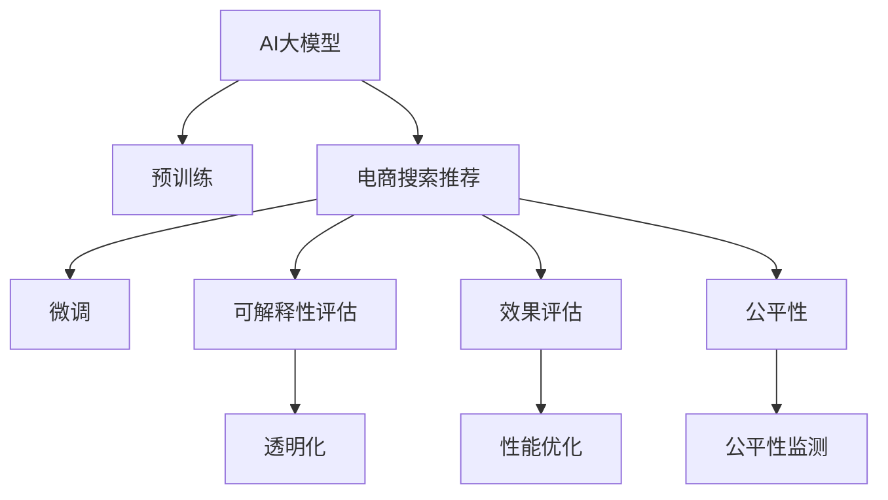

                 

# 电商搜索推荐效果评估中的AI大模型模型可解释性评估技术

> 关键词：AI大模型, 模型可解释性, 电商搜索推荐, 效果评估, 深度学习, 自然语言处理(NLP)

## 1. 背景介绍

### 1.1 问题由来
电商搜索推荐系统作为连接用户和商品的桥梁，其核心在于精准推荐用户感兴趣的商品。现代推荐系统往往依赖复杂的深度学习模型，如基于神经网络的协同过滤、基于嵌入的矩阵分解等方法，通过在海量数据上学习用户与商品之间的关系，提供个性化推荐。然而，这些复杂模型存在"黑箱"问题，难以解释其推荐逻辑和决策依据，影响用户信任和品牌口碑。

近年来，AI大模型在自然语言处理(NLP)领域的迅猛发展，为电商搜索推荐系统的优化提供了新的思路。AI大模型能够自适应地从大量文本数据中学习通用知识，通过微调应用于电商搜索推荐任务中，具备更强的泛化能力和适应性。但是，对于这些"预训练+微调"的推荐模型，其决策依据依然不透明，用户难以理解和信任推荐结果。

因此，如何评估大模型在电商搜索推荐系统中的性能和可解释性，成为了当前推荐系统研究的热点问题。本文将深入分析AI大模型在电商搜索推荐中的可解释性评估技术，探讨如何提升推荐系统的透明度和可信度，助力电商平台的个性化推荐策略优化。

### 1.2 问题核心关键点
AI大模型在电商搜索推荐中的应用主要涉及以下几个关键点：
1. **模型泛化能力**：大模型能否对真实电商数据进行有效泛化，保证推荐结果的通用性和稳定性。
2. **模型可解释性**：推荐模型在决策过程中的推理逻辑和依据，用户是否能够理解并信任其推荐。
3. **模型优化效果**：通过特定指标对模型性能进行评估，如点击率、转化率等，优化模型推荐效果。
4. **模型公平性**：模型是否对各类用户和商品公平对待，避免偏见和歧视。

本文将聚焦于这些关键点，提出一种基于可解释性评估的AI大模型推荐系统优化方法，提升电商搜索推荐系统的透明性和公平性。

## 2. 核心概念与联系

### 2.1 核心概念概述

为更好地理解AI大模型在电商搜索推荐中的应用，本节将介绍几个密切相关的核心概念：

- **AI大模型**：如BERT、GPT-3等，通过在大规模无标签数据上进行预训练，学习通用的语言和知识表示。
- **推荐系统**：通过分析和理解用户行为和偏好，推荐可能感兴趣的商品和服务。
- **模型可解释性**：用户能够理解和信任推荐模型决策过程的能力。
- **效果评估**：通过特定指标（如点击率、转化率等）对推荐模型性能进行量化评估。
- **公平性**：推荐模型对各类用户和商品公平对待，避免偏见和歧视。

这些核心概念之间的逻辑关系可以通过以下Mermaid流程图来展示：



这个流程图展示了大模型在电商搜索推荐中的应用流程：

1. 大模型通过预训练获得基础能力。
2. 电商搜索推荐系统，通过微调使大模型适应电商领域的数据。
3. 可解释性评估技术，确保模型推理过程透明。
4. 效果评估方法，量化模型推荐性能。
5. 公平性监测技术，保障推荐公平。
6. 透明化和性能优化，提升用户体验。

这些概念共同构成了AI大模型在电商搜索推荐中的应用框架，确保推荐系统的透明性、公平性和优化效果。

## 3. 核心算法原理 & 具体操作步骤
### 3.1 算法原理概述

基于AI大模型的电商搜索推荐系统，其核心思想是通过预训练和微调获得通用知识表示，然后在电商领域数据上进行微调，学习用户与商品之间的关系。随后，利用可解释性评估技术和效果评估方法，对推荐模型进行优化，提升其透明度和性能，确保公平性。

形式化地，假设预训练语言模型为 $M_{\theta}$，其中 $\theta$ 为预训练得到的模型参数。给定电商搜索推荐数据集 $D=\{(x_i, y_i)\}_{i=1}^N$，其中 $x_i$ 为用户历史行为和商品信息，$y_i$ 为用户对商品 $x_i$ 的兴趣标签。微调的目标是找到新的模型参数 $\hat{\theta}$，使得：

$$
\hat{\theta}=\mathop{\arg\min}_{\theta} \mathcal{L}(M_{\theta},D)
$$

其中 $\mathcal{L}$ 为针对电商推荐任务的损失函数，用于衡量模型预测输出与真实标签之间的差异。常见的损失函数包括交叉熵损失、均方误差损失等。

微调后的模型在推荐系统中进行商品推荐，此时可解释性评估技术主要用于揭示推荐决策过程的透明度和公平性。效果评估方法则用于量化推荐模型的性能，指导进一步的优化。

### 3.2 算法步骤详解

基于AI大模型的电商搜索推荐系统可解释性评估和效果评估过程一般包括以下几个关键步骤：

**Step 1: 准备电商推荐数据集和预训练模型**
- 收集电商平台的用户历史行为数据和商品信息，构建电商推荐数据集。
- 选择合适的预训练语言模型 $M_{\theta}$ 作为初始化参数，如 BERT、GPT 等。

**Step 2: 添加电商推荐适配层**
- 根据电商推荐任务的特征，在预训练模型顶层设计合适的输出层和损失函数。
- 对于推荐任务，通常在顶层添加多维输出层，用于预测用户对不同商品的兴趣程度。
- 设计损失函数，如交叉熵损失，用于衡量模型输出与真实兴趣标签之间的差异。

**Step 3: 设置微调超参数**
- 选择合适的优化算法及其参数，如 AdamW、SGD 等，设置学习率、批大小、迭代轮数等。
- 设置正则化技术及强度，包括权重衰减、Dropout、Early Stopping等。
- 确定冻结预训练参数的策略，如仅微调顶层，或全部参数都参与微调。

**Step 4: 执行梯度训练**
- 将电商推荐数据集分批次输入模型，前向传播计算损失函数。
- 反向传播计算参数梯度，根据设定的优化算法和学习率更新模型参数。
- 周期性在验证集上评估模型性能，根据性能指标决定是否触发 Early Stopping。
- 重复上述步骤直到满足预设的迭代轮数或 Early Stopping 条件。

**Step 5: 可解释性评估**
- 使用可解释性评估方法，如LIME、SHAP等，揭示推荐模型决策的透明性。
- 通过可视化推荐决策路径，展示模型对用户行为和商品特征的理解。
- 定期监测推荐模型在公平性指标上的表现，确保模型对各类用户和商品公平对待。

**Step 6: 效果评估**
- 使用效果评估指标，如点击率、转化率等，量化推荐模型性能。
- 根据评估结果，进一步优化模型参数和学习率。
- 结合可解释性评估结果，设计更加透明的推荐策略。

**Step 7: 优化和部署**
- 根据评估结果，优化模型结构和超参数。
- 在优化后的模型上进行电商推荐，实时监测推荐效果。
- 定期收集用户反馈，持续优化推荐策略。

以上是基于AI大模型的电商搜索推荐系统可解释性评估和效果评估的一般流程。在实际应用中，还需要根据具体任务的特点，对评估过程的各个环节进行优化设计，如改进损失函数，引入更多的正则化技术，搜索最优的超参数组合等，以进一步提升模型性能。

### 3.3 算法优缺点

基于AI大模型的电商搜索推荐系统，可解释性评估和效果评估具有以下优点：
1. 提升推荐透明度：通过可解释性评估技术，用户能够理解推荐模型的决策依据，增强信任。
2. 优化推荐效果：通过效果评估方法，量化模型性能，指导优化方向。
3. 确保推荐公平性：通过公平性监测技术，保障模型对各类用户和商品公平对待。
4. 灵活适应数据变化：通过可解释性评估和效果评估，及时调整模型参数，适应电商数据分布的变化。

同时，该方法也存在一定的局限性：
1. 数据隐私问题：电商推荐数据往往包含用户隐私信息，如何保护用户数据隐私是一个关键挑战。
2. 计算成本高：AI大模型参数量庞大，训练和推理需要大量的计算资源和时间。
3. 模型复杂度高：大模型的复杂结构增加了推理的难度和计算开销。
4. 泛化能力有限：电商数据特征多样，大模型在不同场景下可能存在泛化能力不足的问题。

尽管存在这些局限性，但就目前而言，基于AI大模型的电商搜索推荐系统仍然是最先进和高效的方法。未来相关研究的重点在于如何进一步降低计算成本，保护数据隐私，提升模型泛化能力，同时兼顾透明度和公平性等因素。

### 3.4 算法应用领域

基于AI大模型的电商搜索推荐系统，已经在零售、金融、旅游等多个领域得到了广泛应用，取得了显著效果。

- **零售领域**：电商平台的商品推荐系统，通过大模型学习用户行为和商品特征，实现个性化推荐，提升用户体验。
- **金融领域**：金融产品的推荐系统，通过大模型学习用户理财习惯，推荐合适的金融产品，实现精准营销。
- **旅游领域**：旅游平台的景点推荐系统，通过大模型学习用户偏好和地理位置，推荐旅游目的地，提升旅游体验。

除了这些经典应用外，大模型推荐系统还被创新性地应用于更多场景中，如定制化服务推荐、医疗健康推荐等，为电商平台和其他行业带来了新的增长点。

## 4. 数学模型和公式 & 详细讲解  
### 4.1 数学模型构建

本节将使用数学语言对基于AI大模型的电商搜索推荐系统进行更加严格的刻画。

记电商推荐数据集为 $D=\{(x_i, y_i)\}_{i=1}^N, x_i \in \mathcal{X}, y_i \in \{0,1\}$，其中 $\mathcal{X}$ 为电商推荐数据空间，$\{0,1\}$ 为兴趣标签集合。假设预训练语言模型为 $M_{\theta}$，其中 $\theta$ 为预训练得到的模型参数。

定义模型 $M_{\theta}$ 在数据样本 $(x,y)$ 上的损失函数为 $\ell(M_{\theta}(x),y)$，则在数据集 $D$ 上的经验风险为：

$$
\mathcal{L}(\theta) = \frac{1}{N} \sum_{i=1}^N \ell(M_{\theta}(x_i),y_i)
$$

微调的优化目标是最小化经验风险，即找到最优参数：

$$
\theta^* = \mathop{\arg\min}_{\theta} \mathcal{L}(\theta)
$$

在实践中，我们通常使用基于梯度的优化算法（如SGD、Adam等）来近似求解上述最优化问题。设 $\eta$ 为学习率，$\lambda$ 为正则化系数，则参数的更新公式为：

$$
\theta \leftarrow \theta - \eta \nabla_{\theta}\mathcal{L}(\theta) - \eta\lambda\theta
$$

其中 $\nabla_{\theta}\mathcal{L}(\theta)$ 为损失函数对参数 $\theta$ 的梯度，可通过反向传播算法高效计算。

### 4.2 公式推导过程

以下我们以电商搜索推荐任务为例，推导交叉熵损失函数及其梯度的计算公式。

假设模型 $M_{\theta}$ 在输入 $x$ 上的输出为 $\hat{y}=M_{\theta}(x) \in [0,1]$，表示用户对商品 $x$ 的兴趣程度。真实标签 $y \in \{0,1\}$。则二分类交叉熵损失函数定义为：

$$
\ell(M_{\theta}(x),y) = -[y\log \hat{y} + (1-y)\log (1-\hat{y})]
$$

将其代入经验风险公式，得：

$$
\mathcal{L}(\theta) = -\frac{1}{N}\sum_{i=1}^N [y_i\log M_{\theta}(x_i)+(1-y_i)\log(1-M_{\theta}(x_i))]
$$

根据链式法则，损失函数对参数 $\theta_k$ 的梯度为：

$$
\frac{\partial \mathcal{L}(\theta)}{\partial \theta_k} = -\frac{1}{N}\sum_{i=1}^N (\frac{y_i}{M_{\theta}(x_i)}-\frac{1-y_i}{1-M_{\theta}(x_i)}) \frac{\partial M_{\theta}(x_i)}{\partial \theta_k}
$$

其中 $\frac{\partial M_{\theta}(x_i)}{\partial \theta_k}$ 可进一步递归展开，利用自动微分技术完成计算。

在得到损失函数的梯度后，即可带入参数更新公式，完成模型的迭代优化。重复上述过程直至收敛，最终得到适应电商推荐任务的最优模型参数 $\theta^*$。

## 5. 项目实践：代码实例和详细解释说明
### 5.1 开发环境搭建

在进行电商搜索推荐微调实践前，我们需要准备好开发环境。以下是使用Python进行PyTorch开发的环境配置流程：

1. 安装Anaconda：从官网下载并安装Anaconda，用于创建独立的Python环境。

2. 创建并激活虚拟环境：
```bash
conda create -n pytorch-env python=3.8 
conda activate pytorch-env
```

3. 安装PyTorch：根据CUDA版本，从官网获取对应的安装命令。例如：
```bash
conda install pytorch torchvision torchaudio cudatoolkit=11.1 -c pytorch -c conda-forge
```

4. 安装TensorFlow：
```bash
pip install tensorflow
```

5. 安装各类工具包：
```bash
pip install numpy pandas scikit-learn matplotlib tqdm jupyter notebook ipython
```

完成上述步骤后，即可在`pytorch-env`环境中开始微调实践。

### 5.2 源代码详细实现

下面我们以电商推荐任务为例，给出使用PyTorch对BERT模型进行电商推荐微调的PyTorch代码实现。

首先，定义电商推荐任务的数据处理函数：

```python
from transformers import BertTokenizer
from torch.utils.data import Dataset
import torch

class ECommDataset(Dataset):
    def __init__(self, texts, labels, tokenizer, max_len=128):
        self.texts = texts
        self.labels = labels
        self.tokenizer = tokenizer
        self.max_len = max_len
        
    def __len__(self):
        return len(self.texts)
    
    def __getitem__(self, item):
        text = self.texts[item]
        label = self.labels[item]
        
        encoding = self.tokenizer(text, return_tensors='pt', max_length=self.max_len, padding='max_length', truncation=True)
        input_ids = encoding['input_ids'][0]
        attention_mask = encoding['attention_mask'][0]
        
        # 将标签转换为独热编码
        encoded_labels = torch.tensor([[0, 1] if label == 1 else [1, 0]], dtype=torch.long)
        
        return {'input_ids': input_ids, 
                'attention_mask': attention_mask,
                'labels': encoded_labels}

# 标签与id的映射
label2id = {0: 0, 1: 1}
id2label = {v: k for k, v in label2id.items()}

# 创建dataset
tokenizer = BertTokenizer.from_pretrained('bert-base-cased')

train_dataset = ECommDataset(train_texts, train_labels, tokenizer)
dev_dataset = ECommDataset(dev_texts, dev_labels, tokenizer)
test_dataset = ECommDataset(test_texts, test_labels, tokenizer)
```

然后，定义模型和优化器：

```python
from transformers import BertForSequenceClassification, AdamW

model = BertForSequenceClassification.from_pretrained('bert-base-cased', num_labels=len(label2id))

optimizer = AdamW(model.parameters(), lr=2e-5)
```

接着，定义训练和评估函数：

```python
from torch.utils.data import DataLoader
from tqdm import tqdm
from sklearn.metrics import classification_report

device = torch.device('cuda') if torch.cuda.is_available() else torch.device('cpu')
model.to(device)

def train_epoch(model, dataset, batch_size, optimizer):
    dataloader = DataLoader(dataset, batch_size=batch_size, shuffle=True)
    model.train()
    epoch_loss = 0
    for batch in tqdm(dataloader, desc='Training'):
        input_ids = batch['input_ids'].to(device)
        attention_mask = batch['attention_mask'].to(device)
        labels = batch['labels'].to(device)
        model.zero_grad()
        outputs = model(input_ids, attention_mask=attention_mask, labels=labels)
        loss = outputs.loss
        epoch_loss += loss.item()
        loss.backward()
        optimizer.step()
    return epoch_loss / len(dataloader)

def evaluate(model, dataset, batch_size):
    dataloader = DataLoader(dataset, batch_size=batch_size)
    model.eval()
    preds, labels = [], []
    with torch.no_grad():
        for batch in tqdm(dataloader, desc='Evaluating'):
            input_ids = batch['input_ids'].to(device)
            attention_mask = batch['attention_mask'].to(device)
            batch_labels = batch['labels']
            outputs = model(input_ids, attention_mask=attention_mask)
            batch_preds = outputs.logits.argmax(dim=1).to('cpu').tolist()
            batch_labels = batch_labels.to('cpu').tolist()
            for pred, label in zip(batch_preds, batch_labels):
                preds.append(pred[0])
                labels.append(label)
                
    print(classification_report(labels, preds))
```

最后，启动训练流程并在测试集上评估：

```python
epochs = 5
batch_size = 16

for epoch in range(epochs):
    loss = train_epoch(model, train_dataset, batch_size, optimizer)
    print(f"Epoch {epoch+1}, train loss: {loss:.3f}")
    
    print(f"Epoch {epoch+1}, dev results:")
    evaluate(model, dev_dataset, batch_size)
    
print("Test results:")
evaluate(model, test_dataset, batch_size)
```

以上就是使用PyTorch对BERT进行电商推荐任务微调的完整代码实现。可以看到，得益于Transformers库的强大封装，我们可以用相对简洁的代码完成BERT模型的加载和微调。

### 5.3 代码解读与分析

让我们再详细解读一下关键代码的实现细节：

**ECommDataset类**：
- `__init__`方法：初始化文本、标签、分词器等关键组件。
- `__len__`方法：返回数据集的样本数量。
- `__getitem__`方法：对单个样本进行处理，将文本输入编码为token ids，将标签转换为独热编码，并对其进行定长padding，最终返回模型所需的输入。

**label2id和id2label字典**：
- 定义了标签与数字id之间的映射关系，用于将标签转换为独热编码。

**训练和评估函数**：
- 使用PyTorch的DataLoader对数据集进行批次化加载，供模型训练和推理使用。
- 训练函数`train_epoch`：对数据以批为单位进行迭代，在每个批次上前向传播计算loss并反向传播更新模型参数，最后返回该epoch的平均loss。
- 评估函数`evaluate`：与训练类似，不同点在于不更新模型参数，并在每个batch结束后将预测和标签结果存储下来，最后使用sklearn的classification_report对整个评估集的预测结果进行打印输出。

**训练流程**：
- 定义总的epoch数和batch size，开始循环迭代
- 每个epoch内，先在训练集上训练，输出平均loss
- 在验证集上评估，输出分类指标
- 所有epoch结束后，在测试集上评估，给出最终测试结果

可以看到，PyTorch配合Transformers库使得BERT微调的代码实现变得简洁高效。开发者可以将更多精力放在数据处理、模型改进等高层逻辑上，而不必过多关注底层的实现细节。

当然，工业级的系统实现还需考虑更多因素，如模型的保存和部署、超参数的自动搜索、更灵活的任务适配层等。但核心的微调范式基本与此类似。

## 6. 实际应用场景
### 6.1 电商平台个性化推荐

基于AI大模型的电商搜索推荐系统，可以显著提升电商平台的个性化推荐效果。通过微调大模型，平台能够学习用户行为和商品特征，生成个性化推荐，提升用户满意度和销售额。

具体而言，平台可以收集用户浏览、点击、购买等行为数据，并将这些数据作为电商推荐数据集。将数据集分批次输入模型进行训练，微调后的模型能够根据用户的历史行为，推荐其可能感兴趣的商品。通过不断收集用户反馈和行为数据，平台能够持续优化推荐模型，进一步提升个性化推荐效果。

### 6.2 电商广告精准投放

电商广告投放是电商平台的重要收入来源。通过微调大模型，平台能够根据用户的历史行为和兴趣标签，精准投放广告，提高广告点击率和转化率，增加平台收入。

具体而言，平台可以收集用户的历史行为数据，包括浏览记录、点击记录、购买记录等。将这些数据作为电商推荐数据集，训练微调后的模型，生成用户的兴趣标签。然后根据用户标签进行广告投放，推送用户可能感兴趣的商品广告，提高广告效果。

### 6.3 库存管理优化

库存管理是电商运营的重要环节。通过微调大模型，平台能够预测用户对商品的需求，优化库存管理，减少缺货和库存积压，提高运营效率。

具体而言，平台可以收集用户的历史行为数据，包括浏览、点击、购买等行为。将这些数据作为电商推荐数据集，训练微调后的模型，生成用户的兴趣标签。然后根据用户标签预测商品的需求量，优化库存管理策略，提高库存周转率。

### 6.4 未来应用展望

随着大模型和微调方法的不断发展，基于AI大模型的电商搜索推荐系统将在更多领域得到应用，为电商平台的个性化推荐策略优化提供新的思路。

在智慧物流领域，大模型推荐系统可以优化配送路线和仓库布局，提高物流效率和用户体验。

在智能客服领域，大模型推荐系统可以推荐合适的客服人员，提高客服响应速度和用户满意度。

在智慧城市治理中，大模型推荐系统可以推荐合适的城市服务设施，提高城市管理效率和居民生活质量。

此外，在教育、医疗、金融等众多领域，基于大模型微调的人工智能推荐系统也将不断涌现，为各个行业的智能化发展提供新的动力。相信随着技术的日益成熟，基于大模型的推荐系统必将在各个领域发挥更大的作用。

## 7. 工具和资源推荐
### 7.1 学习资源推荐

为了帮助开发者系统掌握大模型在电商搜索推荐中的应用，这里推荐一些优质的学习资源：

1. 《Transformer从原理到实践》系列博文：由大模型技术专家撰写，深入浅出地介绍了Transformer原理、BERT模型、电商推荐任务等前沿话题。

2. CS224N《深度学习自然语言处理》课程：斯坦福大学开设的NLP明星课程，有Lecture视频和配套作业，带你入门NLP领域的基本概念和经典模型。

3. 《Natural Language Processing with Transformers》书籍：Transformers库的作者所著，全面介绍了如何使用Transformers库进行NLP任务开发，包括电商推荐在内的诸多范式。

4. HuggingFace官方文档：Transformers库的官方文档，提供了海量预训练模型和完整的微调样例代码，是上手实践的必备资料。

5. E-commerce Recommendation Systems：ECCV 2020论文，介绍了基于深度学习的电商推荐系统的最新进展，涵盖多种模型和评估方法。

通过对这些资源的学习实践，相信你一定能够快速掌握大模型在电商搜索推荐中的应用，并用于解决实际的电商问题。
###  7.2 开发工具推荐

高效的开发离不开优秀的工具支持。以下是几款用于电商搜索推荐微调开发的常用工具：

1. PyTorch：基于Python的开源深度学习框架，灵活动态的计算图，适合快速迭代研究。大部分预训练语言模型都有PyTorch版本的实现。

2. TensorFlow：由Google主导开发的开源深度学习框架，生产部署方便，适合大规模工程应用。同样有丰富的预训练语言模型资源。

3. Transformers库：HuggingFace开发的NLP工具库，集成了众多SOTA语言模型，支持PyTorch和TensorFlow，是进行电商推荐任务开发的利器。

4. Weights & Biases：模型训练的实验跟踪工具，可以记录和可视化模型训练过程中的各项指标，方便对比和调优。与主流深度学习框架无缝集成。

5. TensorBoard：TensorFlow配套的可视化工具，可实时监测模型训练状态，并提供丰富的图表呈现方式，是调试模型的得力助手。

6. Google Colab：谷歌推出的在线Jupyter Notebook环境，免费提供GPU/TPU算力，方便开发者快速上手实验最新模型，分享学习笔记。

合理利用这些工具，可以显著提升电商搜索推荐微调任务的开发效率，加快创新迭代的步伐。

### 7.3 相关论文推荐

大模型和微调技术的发展源于学界的持续研究。以下是几篇奠基性的相关论文，推荐阅读：

1. Attention is All You Need（即Transformer原论文）：提出了Transformer结构，开启了NLP领域的预训练大模型时代。

2. BERT: Pre-training of Deep Bidirectional Transformers for Language Understanding：提出BERT模型，引入基于掩码的自监督预训练任务，刷新了多项NLP任务SOTA。

3. Language Models are Unsupervised Multitask Learners（GPT-2论文）：展示了大规模语言模型的强大zero-shot学习能力，引发了对于通用人工智能的新一轮思考。

4. Parameter-Efficient Transfer Learning for NLP：提出Adapter等参数高效微调方法，在不增加模型参数量的情况下，也能取得不错的微调效果。

5. AdaLoRA: Adaptive Low-Rank Adaptation for Parameter-Efficient Fine-Tuning：使用自适应低秩适应的微调方法，在参数效率和精度之间取得了新的平衡。

6. E-Commerce Recommendation Models: A Survey and Open Research Directions：对电商推荐系统进行了全面综述，涵盖多种模型和评估方法。

这些论文代表了大模型在电商搜索推荐中的最新研究进展，通过学习这些前沿成果，可以帮助研究者把握学科前进方向，激发更多的创新灵感。

## 8. 总结：未来发展趋势与挑战
### 8.1 总结

本文对基于AI大模型的电商搜索推荐系统进行了全面系统的介绍。首先阐述了大模型在电商搜索推荐中的应用背景和意义，明确了模型泛化能力、可解释性、效果评估和公平性等关键点。其次，从原理到实践，详细讲解了电商推荐系统的微调过程和可解释性评估技术，给出了电商推荐任务微调的完整代码实现。同时，本文还广泛探讨了大模型在电商搜索推荐系统的应用场景和未来前景，展示了其广阔的应用前景。此外，本文精选了电商推荐任务的学习资源，力求为读者提供全方位的技术指引。

通过本文的系统梳理，可以看到，基于AI大模型的电商搜索推荐系统在个性化推荐、广告投放、库存管理等方面具备显著优势。借助大模型微调技术和可解释性评估技术，电商平台能够实现透明、公平、高效的个性化推荐策略，提升用户体验和平台收入。

### 8.2 未来发展趋势

展望未来，AI大模型在电商搜索推荐中的应用将呈现以下几个发展趋势：

1. 模型规模持续增大。随着算力成本的下降和数据规模的扩张，预训练语言模型的参数量还将持续增长。超大规模语言模型蕴含的丰富语言知识，有望支撑更加复杂多变的电商推荐任务。

2. 微调方法日趋多样。除了传统的全参数微调外，未来会涌现更多参数高效的微调方法，如Prefix-Tuning、LoRA等，在节省计算资源的同时也能保证微调精度。

3. 持续学习成为常态。随着电商数据分布的不断变化，微调模型也需要持续学习新知识以保持性能。如何在不遗忘原有知识的同时，高效吸收新样本信息，将成为重要的研究课题。

4. 标注样本需求降低。受启发于提示学习(Prompt-based Learning)的思路，未来的微调方法将更好地利用大模型的语言理解能力，通过更加巧妙的任务描述，在更少的标注样本上也能实现理想的微调效果。

5. 模型通用性增强。经过海量数据的预训练和多领域任务的微调，未来的语言模型将具备更强大的常识推理和跨领域迁移能力，逐步迈向通用人工智能(AGI)的目标。

6. 知识整合能力增强。未来的微调模型将更好地与外部知识库、规则库等专家知识结合，引导微调过程学习更准确、合理的语言模型。同时加强不同模态数据的整合，实现视觉、语音等多模态信息与文本信息的协同建模。

以上趋势凸显了大模型在电商搜索推荐中的应用前景。这些方向的探索发展，必将进一步提升电商搜索推荐系统的性能和应用范围，为电商平台的个性化推荐策略优化提供新的思路。

### 8.3 面临的挑战

尽管AI大模型在电商搜索推荐中的应用已经取得了瞩目成就，但在迈向更加智能化、普适化应用的过程中，它仍面临着诸多挑战：

1. 标注成本瓶颈。尽管微调大大降低了标注数据的需求，但对于长尾应用场景，难以获得充足的高质量标注数据，成为制约微调性能的瓶颈。如何进一步降低微调对标注样本的依赖，将是一大难题。

2. 计算成本高。AI大模型参数量庞大，训练和推理需要大量的计算资源和时间。如何降低计算成本，提高推理效率，是未来需要重点突破的方向。

3. 数据隐私问题。电商推荐数据往往包含用户隐私信息，如何保护用户数据隐私是一个关键挑战。

4. 模型复杂度高。大模型的复杂结构增加了推理的难度和计算开销。

5. 泛化能力有限。电商数据特征多样，大模型在不同场景下可能存在泛化能力不足的问题。

尽管存在这些挑战，但就目前而言，基于AI大模型的电商搜索推荐系统仍然是最先进和高效的方法。未来相关研究的重点在于如何进一步降低计算成本，保护数据隐私，提升模型泛化能力，同时兼顾透明度和公平性等因素。

### 8.4 研究展望

面对AI大模型在电商搜索推荐中所面临的挑战，未来的研究需要在以下几个方面寻求新的突破：

1. 探索无监督和半监督微调方法。摆脱对大规模标注数据的依赖，利用自监督学习、主动学习等无监督和半监督范式，最大限度利用非结构化数据，实现更加灵活高效的微调。

2. 研究参数高效和计算高效的微调范式。开发更加参数高效的微调方法，在固定大部分预训练参数的同时，只更新极少量的任务相关参数。同时优化微调模型的计算图，减少前向传播和反向传播的资源消耗，实现更加轻量级、实时性的部署。

3. 引入更多先验知识。将符号化的先验知识，如知识图谱、逻辑规则等，与神经网络模型进行巧妙融合，引导微调过程学习更准确、合理的语言模型。同时加强不同模态数据的整合，实现视觉、语音等多模态信息与文本信息的协同建模。

4. 结合因果分析和博弈论工具。将因果分析方法引入微调模型，识别出模型决策的关键特征，增强输出解释的因果性和逻辑性。借助博弈论工具刻画人机交互过程，主动探索并规避模型的脆弱点，提高系统稳定性。

5. 纳入伦理道德约束。在模型训练目标中引入伦理导向的评估指标，过滤和惩罚有偏见、有害的输出倾向。同时加强人工干预和审核，建立模型行为的监管机制，确保输出符合人类价值观和伦理道德。

这些研究方向的探索，必将引领AI大模型在电商搜索推荐系统中的应用迈向更高的台阶，为构建安全、可靠、可解释、可控的智能系统铺平道路。面向未来，AI大模型在电商搜索推荐系统中的应用还需要与其他人工智能技术进行更深入的融合，如知识表示、因果推理、强化学习等，多路径协同发力，共同推动自然语言理解和智能交互系统的进步。只有勇于创新、敢于突破，才能不断拓展语言模型的边界，让智能技术更好地造福人类社会。

## 9. 附录：常见问题与解答

**Q1：大模型微调在电商推荐系统中面临哪些主要挑战？**

A: 大模型微调在电商推荐系统中面临的主要挑战包括：

1. 标注成本瓶颈：电商推荐数据需要丰富的用户行为和商品特征，难以获得大规模的高质量标注数据，影响微调效果。
2. 计算成本高：大模型参数量庞大，训练和推理需要大量计算资源，推理效率较低。
3. 数据隐私问题：电商推荐数据包含用户隐私信息，如何在保护隐私的同时进行模型微调，是一个关键问题。
4. 模型复杂度高：大模型结构复杂，推理难度大，计算开销高。
5. 泛化能力有限：电商数据特征多样，大模型在不同场景下可能存在泛化能力不足的问题。

这些问题需要结合实际应用场景，综合考虑并采取相应的优化策略。

**Q2：如何提升电商推荐系统的可解释性？**

A: 电商推荐系统的可解释性可以通过以下方式提升：

1. 使用可解释性评估技术，如LIME、SHAP等，揭示推荐决策的透明性。通过可视化推荐决策路径，展示模型对用户行为和商品特征的理解。
2. 引入更多的先验知识，如知识图谱、逻辑规则等，与神经网络模型进行巧妙融合，引导微调过程学习更准确、合理的语言模型。
3. 结合因果分析和博弈论工具，增强推荐模型建立稳定因果关系的能力，学习更加普适、鲁棒的语言表征。
4. 定期监测推荐模型在公平性指标上的表现，确保模型对各类用户和商品公平对待，增加推荐透明度。

这些方法可以从不同角度提升电商推荐系统的可解释性，增加用户对推荐结果的信任和满意度。

**Q3：如何进行电商推荐系统的效果评估？**

A: 电商推荐系统的效果评估可以通过以下方式进行：

1. 点击率(CTR)：衡量用户对推荐商品的点击次数与总展示次数的比率，反映推荐系统的点击效果。
2. 转化率(CVR)：衡量用户对推荐商品的点击转化为购买的比例，反映推荐系统的转化效果。
3. 准确率(Precision)和召回率(Recall)：衡量推荐系统的推荐准确性和全面性，适用于分类推荐任务。
4. A/B测试：通过随机抽样，对比不同推荐策略的效果，选择最优方案。

这些评估指标可以量化推荐系统的效果，指导模型优化和策略调整。

**Q4：如何设计透明的电商推荐策略？**

A: 设计透明的电商推荐策略需要考虑以下几个方面：

1. 引入可解释性评估技术，如LIME、SHAP等，揭示推荐决策的透明性。通过可视化推荐决策路径，展示模型对用户行为和商品特征的理解。
2. 结合因果分析和博弈论工具，增强推荐模型建立稳定因果关系的能力，学习更加普适、鲁棒的语言表征。
3. 定期监测推荐模型在公平性指标上的表现，确保模型对各类用户和商品公平对待，增加推荐透明度。
4. 优化推荐模型，提升其推理速度和计算效率，确保模型在实际部署中具有较高的透明度和公平性。

通过这些措施，可以设计更加透明、公平、高效的电商推荐策略，增加用户对推荐结果的信任和满意度。

**Q5：如何保护电商推荐数据中的用户隐私？**

A: 保护电商推荐数据中的用户隐私需要考虑以下几个方面：

1. 数据脱敏：对敏感信息进行匿名化处理，如去除用户标识、部分数据掩码等。
2. 数据加密：采用加密技术保护数据传输和存储安全。
3. 访问控制：对数据访问进行严格的权限管理，防止未经授权的访问。
4. 差分隐私：采用差分隐私技术，在保证数据准确性的同时，减少隐私泄露风险。

这些措施可以从不同角度保护电商推荐数据中的用户隐私，确保用户数据的安全性和隐私性。

---

作者：禅与计算机程序设计艺术 / Zen and the Art of Computer Programming

