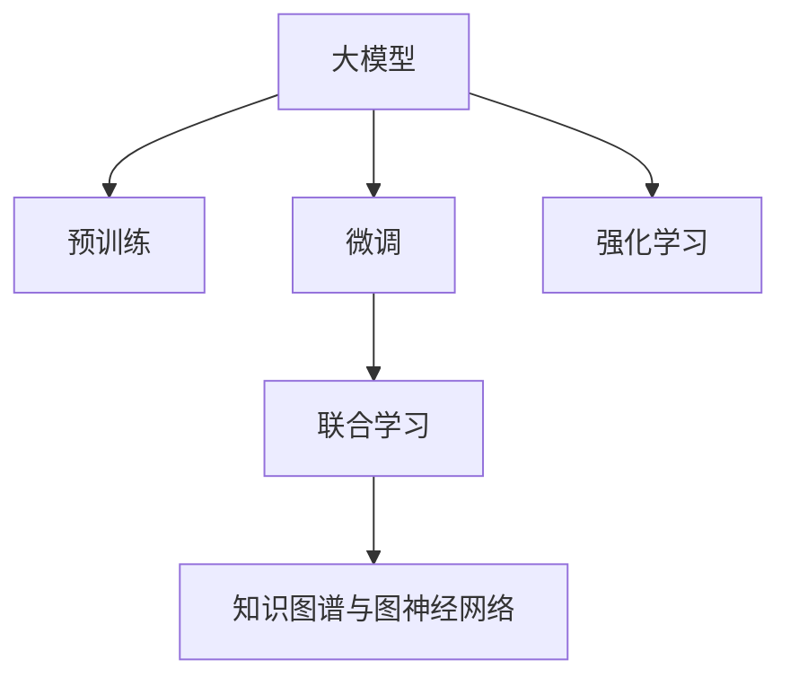

                 

# 电商搜索推荐系统的AI大模型技术演进

## 1. 背景介绍

### 1.1 问题由来

在现代电商领域，个性化推荐系统（Personalized Recommendation System, PRS）已成为提升用户体验和转化率的核心手段。通过分析用户的历史行为、兴趣偏好、社交关系等信息，推荐系统能够预测用户可能感兴趣的商品，帮助用户快速找到满足需求的商品。传统的推荐系统依赖于手工特征工程和模型设计，存在人工设计难度大、模型泛化能力差等问题，难以应对多变和复杂的数据结构。

近年来，人工智能技术迅速发展，深度学习特别是基于大模型的推荐系统被引入电商领域。深度学习通过自动从大量数据中学习特征和模式，可以有效降低特征工程的工作量，提升模型的泛化能力。

### 1.2 问题核心关键点

大模型推荐系统通过在大规模数据上预训练，学习丰富的特征表示和关联关系，再通过微调等方式适配电商推荐场景，从而显著提升推荐系统的准确性和个性化水平。以下为核心关键点：

- **大模型预训练**：利用大规模无标签数据，通过自监督学习任务，训练出具备广泛知识表示的模型，以捕捉商品之间隐含的关联关系。
- **微调适配**：对预训练模型进行微调，适配电商推荐场景，获取任务相关的特征和规则。
- **多任务联合学习**：将推荐、搜索、广告等多个电商任务融合，通过联合训练优化多任务模型，提高系统整体性能。
- **知识图谱与图神经网络**：利用图神经网络，将电商领域特有的关系数据融入模型，提升推荐和搜索的关联性。
- **强化学习与在线优化**：采用在线强化学习算法，实时优化推荐策略，提升系统的即时响应能力。

### 1.3 问题研究意义

大模型推荐技术具有以下几方面意义：

1. **提升推荐效果**：大模型能够自动从数据中学习更多隐含的关联关系，从而提升推荐的准确性和个性化水平。
2. **降低成本**：手工特征工程和模型设计耗时耗力，大模型推荐能够减少人工干预，加快系统迭代速度。
3. **提升用户体验**：个性化推荐能够帮助用户快速找到满意商品，提升购物体验和满意度。
4. **拓展应用范围**：大模型推荐技术不仅应用于推荐，还广泛应用于搜索、广告、用户画像等多个电商场景。
5. **促进产业升级**：电商搜索推荐系统的AI化，将为传统电商行业带来新的技术赋能，推动产业升级。

## 2. 核心概念与联系

### 2.1 核心概念概述

为更好地理解电商搜索推荐系统的大模型技术演进，本节将介绍几个密切相关的核心概念：

- **大模型(Deep Model)**：指在超大规模数据上预训练得到的深度神经网络模型，如BERT、GPT、Transformer等。具备复杂的特征提取和模式学习能力。
- **预训练(Pre-training)**：指在大规模无标签数据上，通过自监督学习任务，训练出通用的特征表示模型。
- **微调(Fine-tuning)**：指在预训练模型的基础上，通过有监督学习任务，优化模型适应特定任务，如电商推荐任务。
- **联合学习(Federated Learning)**：指多个设备/用户端通过通信协作，训练一个全局模型，提升模型泛化能力和隐私保护性。
- **知识图谱(Knowledge Graph)**：指以实体和关系为节点，以关系为边构建的图结构，用于描述实体之间的关系。
- **图神经网络(Graph Neural Network, GNN)**：指通过图结构传播信息的神经网络，具备捕捉节点间复杂关系的能力。
- **强化学习(Reinforcement Learning)**：指通过奖励机制训练模型，使其在环境中最大化累积奖励。

这些概念之间的逻辑关系可以通过以下Mermaid流程图来展示：



这个流程图展示了大模型推荐系统的主要概念及其之间的关系：

1. 大模型通过预训练获得基础能力。
2. 微调对预训练模型进行任务特定的优化，适配电商推荐场景。
3. 联合学习通过多个设备/用户协作，优化全局模型性能。
4. 知识图谱与图神经网络引入领域知识，增强模型关联性。
5. 强化学习实时优化推荐策略，提升系统响应能力。

这些概念共同构成了电商搜索推荐系统的大模型推荐技术框架，使得推荐系统能够充分利用人工智能技术，不断提升用户体验和运营效率。

## 3. 核心算法原理 & 具体操作步骤
### 3.1 算法原理概述

电商搜索推荐系统的大模型技术演进，主要依赖于以下几个核心步骤：

1. **预训练**：在大规模电商数据上，通过自监督学习任务，训练出通用的特征表示模型。
2. **微调**：在预训练模型的基础上，使用电商推荐任务数据进行微调，优化模型适应电商推荐场景。
3. **联合学习**：通过多个设备/用户协作，训练一个全局优化模型，提升模型泛化能力和隐私保护性。
4. **知识图谱与图神经网络**：利用知识图谱与图神经网络，捕捉商品之间的复杂关系，提升推荐和搜索的关联性。
5. **强化学习**：通过实时反馈优化推荐策略，提升系统响应能力和用户体验。

### 3.2 算法步骤详解

#### 3.2.1 预训练

在大规模电商数据上，使用自监督学习任务进行预训练，如语言建模、图嵌入等。常用的预训练方法包括：

1. **语言建模**：通过预测电商商品描述中的下一个词汇，训练语言模型。
2. **图嵌入**：通过节点之间的相似度预测任务，训练图嵌入模型。
3. **序列标注**：通过标注商品描述中的实体类型，训练序列标注模型。

预训练过程一般分为以下几个步骤：

1. **数据准备**：收集电商数据，并进行数据清洗和预处理，如文本分词、图结构构建等。
2. **模型训练**：选择合适的模型架构，如BERT、GPT、GNN等，进行模型训练。
3. **评估与调整**：定期评估模型性能，根据评估结果调整模型架构和训练参数。
4. **保存模型**：保存训练好的预训练模型，用于后续微调和联合学习。

#### 3.2.2 微调

在预训练模型的基础上，使用电商推荐任务数据进行微调。微调过程一般分为以下几个步骤：

1. **任务适配**：根据电商推荐任务，设计合适的任务适配层，如分类器、回归器等。
2. **超参数设置**：选择合适的优化算法和超参数，如Adam、SGD等，设置学习率、批大小、迭代轮数等。
3. **数据准备**：准备电商推荐任务的标注数据集，进行数据增强和预处理。
4. **模型训练**：使用电商推荐任务数据，训练微调后的模型，优化推荐效果。
5. **模型评估**：在验证集上评估微调后的模型性能，根据性能指标调整模型参数。
6. **模型保存**：保存微调后的模型，用于后续联合学习和在线优化。

#### 3.2.3 联合学习

通过多个设备/用户协作，训练一个全局优化模型，提升模型泛化能力和隐私保护性。联合学习过程一般分为以下几个步骤：

1. **设备/用户端预训练**：在各个设备/用户端，对本地数据进行预训练，训练出本地模型。
2. **参数聚合**：通过通信协作，将各个设备/用户端的本地模型参数聚合，训练全局模型。
3. **参数更新**：根据全局模型的性能，更新本地模型的参数。
4. **数据分割**：根据隐私保护需求，对数据进行分割和加密，确保数据安全。
5. **模型应用**：在各个设备/用户端，使用全局模型进行电商推荐和搜索。

#### 3.2.4 知识图谱与图神经网络

利用知识图谱与图神经网络，捕捉商品之间的复杂关系，提升推荐和搜索的关联性。知识图谱与图神经网络过程一般分为以下几个步骤：

1. **知识图谱构建**：构建电商领域的知识图谱，描述商品之间的实体关系。
2. **图嵌入训练**：使用图嵌入算法，如GraphSAGE、GAT等，训练商品节点之间的相似度表示。
3. **图神经网络融合**：将图嵌入嵌入到模型中，与特征表示进行融合。
4. **推荐和搜索**：在推荐和搜索模型中，利用图神经网络输出的节点表示，进行相关性预测。

#### 3.2.5 强化学习

通过实时反馈优化推荐策略，提升系统响应能力和用户体验。强化学习过程一般分为以下几个步骤：

1. **环境定义**：定义电商推荐系统的环境，如用户点击行为、评分反馈等。
2. **模型训练**：选择合适的强化学习算法，如Q-learning、DQN等，训练推荐策略。
3. **策略优化**：根据用户行为反馈，优化推荐策略。
4. **用户互动**：在实际环境中，根据推荐策略进行用户互动，收集反馈数据。
5. **模型迭代**：根据收集的反馈数据，迭代优化推荐策略。

### 3.3 算法优缺点

大模型推荐系统的核心算法具有以下优缺点：

#### 优点

1. **高效性**：大模型具备强大的特征提取和模式学习能力，能够自动从数据中学习更多隐含的关联关系，提升推荐准确性和个性化水平。
2. **泛化能力**：大模型通过自监督预训练，学习通用特征表示，具备较强的泛化能力，能够在不同电商场景中表现出色。
3. **可扩展性**：大模型推荐系统具备可扩展性，通过联合学习和图神经网络，可以处理大规模电商数据和复杂关联关系。
4. **实时优化**：通过强化学习，大模型推荐系统能够实时优化推荐策略，提升系统响应能力和用户体验。

#### 缺点

1. **计算资源消耗大**：大模型推荐系统需要大量的计算资源进行预训练和微调，对硬件和算力要求较高。
2. **模型复杂度较高**：大模型具备复杂的神经网络结构，难以解释其内部工作机制和决策逻辑，可能存在黑箱问题。
3. **隐私保护挑战**：联合学习和图神经网络涉及数据共享和聚合，存在隐私泄露的风险，需要设计复杂的隐私保护机制。
4. **实时反馈不足**：尽管强化学习可以实时优化推荐策略，但反馈数据的质量和数量可能影响模型的优化效果。

尽管存在这些局限性，但大模型推荐系统在电商推荐领域已经取得了显著的成效，成为现代电商推荐系统的核心技术手段。

### 3.4 算法应用领域

大模型推荐系统已经在电商搜索推荐系统中得到了广泛的应用，覆盖了几乎所有常见的电商任务，例如：

- **商品推荐**：推荐用户可能感兴趣的商品。通过微调和联合学习，优化商品推荐模型。
- **搜索排序**：对用户搜索请求进行排序，提升搜索结果的相关性和用户满意度。
- **个性化广告**：基于用户兴趣，推荐个性化广告。通过强化学习优化广告投放策略。
- **用户画像**：基于用户行为数据，构建用户画像，了解用户兴趣和需求。
- **营销活动优化**：通过联合学习和大模型推荐，优化营销活动效果，提高营销投入的回报率。
- **库存管理**：利用推荐和搜索数据，优化库存管理策略，提升供应链效率。

除了上述这些经典任务外，大模型推荐系统还被创新性地应用到更多场景中，如动态定价、流失预测、需求预测等，为电商技术带来了全新的突破。随着预训练模型和推荐方法的不断进步，相信大模型推荐系统将在更广阔的应用领域大放异彩。

## 4. 数学模型和公式 & 详细讲解  
### 4.1 数学模型构建

大模型推荐系统中的数学模型主要包括以下几个部分：

1. **预训练模型**：用于学习通用的特征表示，如BERT、GPT等。
2. **微调模型**：用于适配电商推荐任务，优化推荐效果。
3. **联合学习模型**：用于多个设备/用户协作，训练全局优化模型。
4. **图神经网络模型**：用于捕捉商品之间的复杂关系。
5. **强化学习模型**：用于实时优化推荐策略。

以推荐任务为例，假设有n个商品，用$X$表示商品描述向量，$y$表示用户是否点击商品的标签，$M$表示预训练模型，$T$表示微调模型。则推荐模型的数学模型可以表示为：

$$
M(x_i) = \text{BERT}(x_i) = f(\text{BERT}(x_i)W_{\text{CLS}} + b_{\text{CLS}})
$$

$$
T(x_i) = \text{MLP}(M(x_i)W_{\text{MLP}} + b_{\text{MLP}})
$$

$$
y_i = \sigma(T(x_i))
$$

其中，$W_{\text{CLS}}$和$b_{\text{CLS}}$为预训练模型BERT的参数，$W_{\text{MLP}}$和$b_{\text{MLP}}$为微调模型MLP的参数，$\sigma$为激活函数，如sigmoid函数。

### 4.2 公式推导过程

以商品推荐为例，推导微调模型的损失函数：

假设训练集为$D=\{(x_i,y_i)\}_{i=1}^N$，则推荐模型的损失函数可以表示为：

$$
\mathcal{L}(\theta) = \frac{1}{N}\sum_{i=1}^N(y_i - \sigma(T(x_i)))^2
$$

其中，$T(x_i)$为微调模型对商品$x_i$的预测，$y_i$为标签，$\sigma$为激活函数。

根据链式法则，损失函数对微调模型参数$\theta$的梯度为：

$$
\frac{\partial \mathcal{L}(\theta)}{\partial \theta} = \frac{1}{N}\sum_{i=1}^N(2(y_i - \sigma(T(x_i)))(T(x_i) - y_i) \frac{\partial T(x_i)}{\partial \theta})
$$

其中，$\frac{\partial T(x_i)}{\partial \theta}$为微调模型对商品$x_i$的预测对参数$\theta$的导数。

在得到损失函数的梯度后，即可带入优化算法（如AdamW）进行模型迭代，优化推荐效果。重复上述过程直至收敛，最终得到适配电商推荐任务的微调模型。

## 5. 项目实践：代码实例和详细解释说明
### 5.1 开发环境搭建

在进行大模型推荐系统开发前，需要先准备好开发环境。以下是使用Python进行PyTorch和TensorFlow开发的配置流程：

1. 安装Anaconda：从官网下载并安装Anaconda，用于创建独立的Python环境。

2. 创建并激活虚拟环境：
```bash
conda create -n pytorch-env python=3.8 
conda activate pytorch-env
```

3. 安装PyTorch：根据CUDA版本，从官网获取对应的安装命令。例如：
```bash
conda install pytorch torchvision torchaudio cudatoolkit=11.1 -c pytorch -c conda-forge
```

4. 安装TensorFlow：通过pip安装TensorFlow和相关依赖库，例如：
```bash
pip install tensorflow
```

5. 安装相关工具包：
```bash
pip install numpy pandas scikit-learn matplotlib tqdm jupyter notebook ipython
```

完成上述步骤后，即可在`pytorch-env`环境中开始大模型推荐系统的开发。

### 5.2 源代码详细实现

下面我们以商品推荐任务为例，给出使用PyTorch和TensorFlow进行大模型推荐系统的PyTorch代码实现。

首先，定义商品推荐任务的数据处理函数：

```python
from transformers import BertTokenizer
from torch.utils.data import Dataset
import torch

class ItemDataset(Dataset):
    def __init__(self, items, descriptions, labels, tokenizer, max_len=128):
        self.items = items
        self.descriptions = descriptions
        self.labels = labels
        self.tokenizer = tokenizer
        self.max_len = max_len
        
    def __len__(self):
        return len(self.items)
    
    def __getitem__(self, item):
        item_id = self.items[item]
        description = self.descriptions[item]
        label = self.labels[item]
        
        encoding = self.tokenizer(description, return_tensors='pt', max_length=self.max_len, padding='max_length', truncation=True)
        input_ids = encoding['input_ids'][0]
        attention_mask = encoding['attention_mask'][0]
        
        return {'item_id': item_id, 
                'input_ids': input_ids, 
                'attention_mask': attention_mask,
                'labels': label}
```

然后，定义模型和优化器：

```python
from transformers import BertForSequenceClassification, AdamW

model = BertForSequenceClassification.from_pretrained('bert-base-cased', num_labels=2)

optimizer = AdamW(model.parameters(), lr=2e-5)
```

接着，定义训练和评估函数：

```python
from torch.utils.data import DataLoader
from tqdm import tqdm
from sklearn.metrics import classification_report

device = torch.device('cuda') if torch.cuda.is_available() else torch.device('cpu')
model.to(device)

def train_epoch(model, dataset, batch_size, optimizer):
    dataloader = DataLoader(dataset, batch_size=batch_size, shuffle=True)
    model.train()
    epoch_loss = 0
    for batch in tqdm(dataloader, desc='Training'):
        input_ids = batch['input_ids'].to(device)
        attention_mask = batch['attention_mask'].to(device)
        labels = batch['labels'].to(device)
        model.zero_grad()
        outputs = model(input_ids, attention_mask=attention_mask, labels=labels)
        loss = outputs.loss
        epoch_loss += loss.item()
        loss.backward()
        optimizer.step()
    return epoch_loss / len(dataloader)

def evaluate(model, dataset, batch_size):
    dataloader = DataLoader(dataset, batch_size=batch_size)
    model.eval()
    preds, labels = [], []
    with torch.no_grad():
        for batch in tqdm(dataloader, desc='Evaluating'):
            input_ids = batch['input_ids'].to(device)
            attention_mask = batch['attention_mask'].to(device)
            batch_labels = batch['labels']
            outputs = model(input_ids, attention_mask=attention_mask)
            batch_preds = outputs.logits.argmax(dim=2).to('cpu').tolist()
            batch_labels = batch_labels.to('cpu').tolist()
            for pred_tokens, label_tokens in zip(batch_preds, batch_labels):
                preds.append(pred_tokens)
                labels.append(label_tokens)
                
    print(classification_report(labels, preds))
```

最后，启动训练流程并在测试集上评估：

```python
epochs = 5
batch_size = 16

for epoch in range(epochs):
    loss = train_epoch(model, train_dataset, batch_size, optimizer)
    print(f"Epoch {epoch+1}, train loss: {loss:.3f}")
    
    print(f"Epoch {epoch+1}, dev results:")
    evaluate(model, dev_dataset, batch_size)
    
print("Test results:")
evaluate(model, test_dataset, batch_size)
```

以上就是使用PyTorch和TensorFlow对商品推荐任务进行大模型推荐系统的完整代码实现。可以看到，得益于Transformers库和TensorFlow的强大封装，我们可以用相对简洁的代码完成BERT模型的加载和推荐系统的训练。

### 5.3 代码解读与分析

让我们再详细解读一下关键代码的实现细节：

**ItemDataset类**：
- `__init__`方法：初始化商品ID、商品描述、标签、分词器等关键组件。
- `__len__`方法：返回数据集的样本数量。
- `__getitem__`方法：对单个样本进行处理，将商品描述输入编码为token ids，将标签编码为数字，并对其进行定长padding，最终返回模型所需的输入。

**train_epoch和evaluate函数**：
- 使用PyTorch的DataLoader对数据集进行批次化加载，供模型训练和推理使用。
- 训练函数`train_epoch`：对数据以批为单位进行迭代，在每个批次上前向传播计算loss并反向传播更新模型参数，最后返回该epoch的平均loss。
- 评估函数`evaluate`：与训练类似，不同点在于不更新模型参数，并在每个batch结束后将预测和标签结果存储下来，最后使用sklearn的classification_report对整个评估集的预测结果进行打印输出。

**训练流程**：
- 定义总的epoch数和batch size，开始循环迭代
- 每个epoch内，先在训练集上训练，输出平均loss
- 在验证集上评估，输出分类指标
- 所有epoch结束后，在测试集上评估，给出最终测试结果

可以看到，PyTorch配合Transformers库使得BERT推荐模型的代码实现变得简洁高效。开发者可以将更多精力放在数据处理、模型改进等高层逻辑上，而不必过多关注底层的实现细节。

当然，工业级的系统实现还需考虑更多因素，如模型的保存和部署、超参数的自动搜索、更灵活的任务适配层等。但核心的微调范式基本与此类似。

## 6. 实际应用场景
### 6.1 智能客服系统

基于大模型推荐系统的智能客服系统，可以通过推荐相关商品和问题解答，提升用户咨询体验。传统客服往往需要配备大量人力，高峰期响应缓慢，且一致性和专业性难以保证。而使用大模型推荐系统的智能客服系统，能够自动理解用户意图，匹配最合适的商品和解答，7x24小时不间断服务，快速响应客户咨询，用自然流畅的语言解答各类常见问题。

在技术实现上，可以收集企业内部的历史客服对话记录，将问题和最佳答复构建成监督数据，在此基础上对预训练推荐模型进行微调。微调后的推荐模型能够自动理解用户意图，匹配最合适的商品和解答。对于客户提出的新问题，还可以接入检索系统实时搜索相关内容，动态组织生成回答。如此构建的智能客服系统，能大幅提升客户咨询体验和问题解决效率。

### 6.2 金融舆情监测

金融机构需要实时监测市场舆论动向，以便及时应对负面信息传播，规避金融风险。传统的人工监测方式成本高、效率低，难以应对网络时代海量信息爆发的挑战。基于大模型推荐系统的文本分类和情感分析技术，为金融舆情监测提供了新的解决方案。

具体而言，可以收集金融领域相关的新闻、报道、评论等文本数据，并对其进行主题标注和情感标注。在此基础上对预训练语言模型进行微调，使其能够自动判断文本属于何种主题，情感倾向是正面、中性还是负面。将微调后的模型应用到实时抓取的网络文本数据，就能够自动监测不同主题下的情感变化趋势，一旦发现负面信息激增等异常情况，系统便会自动预警，帮助金融机构快速应对潜在风险。

### 6.3 个性化推荐系统

当前的推荐系统往往只依赖用户的历史行为数据进行物品推荐，无法深入理解用户的真实兴趣偏好。基于大模型推荐系统的个性化推荐系统，可以更好地挖掘用户行为背后的语义信息，从而提供更精准、多样的推荐内容。

在实践中，可以收集用户浏览、点击、评论、分享等行为数据，提取和用户交互的物品标题、描述、标签等文本内容。将文本内容作为模型输入，用户的后续行为（如是否点击、购买等）作为监督信号，在此基础上微调预训练语言模型。微调后的模型能够从文本内容中准确把握用户的兴趣点。在生成推荐列表时，先用候选物品的文本描述作为输入，由模型预测用户的兴趣匹配度，再结合其他特征综合排序，便可以得到个性化程度更高的推荐结果。

### 6.4 未来应用展望

随着大模型推荐系统的不断发展，其在电商推荐领域的应用前景更加广阔。未来，大模型推荐系统将在更多领域得到应用，为传统行业带来变革性影响。

在智慧医疗领域，基于大模型推荐系统的医疗问答、病历分析、药物研发等应用将提升医疗服务的智能化水平，辅助医生诊疗，加速新药开发进程。

在智能教育领域，大模型推荐系统可应用于作业批改、学情分析、知识推荐等方面，因材施教，促进教育公平，提高教学质量。

在智慧城市治理中，大模型推荐系统可应用于城市事件监测、舆情分析、应急指挥等环节，提高城市管理的自动化和智能化水平，构建更安全、高效的未来城市。

此外，在企业生产、社会治理、文娱传媒等众多领域，基于大模型推荐系统的AI应用也将不断涌现，为经济社会发展注入新的动力。相信随着技术的日益成熟，大模型推荐系统必将在更广阔的应用领域大放异彩，深刻影响人类的生产生活方式。

## 7. 工具和资源推荐
### 7.1 学习资源推荐

为了帮助开发者系统掌握大模型推荐系统的理论基础和实践技巧，这里推荐一些优质的学习资源：

1. 《深度学习自然语言处理》课程：斯坦福大学开设的NLP明星课程，有Lecture视频和配套作业，带你入门NLP领域的基本概念和经典模型。

2. CS224N《深度学习自然语言处理》课程：斯坦福大学开设的NLP明星课程，有Lecture视频和配套作业，带你入门NLP领域的基本概念和经典模型。

3. 《Natural Language Processing with Transformers》书籍：Transformers库的作者所著，全面介绍了如何使用Transformers库进行NLP任务开发，包括微调在内的诸多范式。

4. 《深度学习》书籍：Ian Goodfellow、Yoshua Bengio和Aaron Courville合著的经典深度学习教材，系统介绍了深度学习的理论和实践。

5. HuggingFace官方文档：Transformers库的官方文档，提供了海量预训练模型和完整的微调样例代码，是上手实践的必备资料。

通过对这些资源的学习实践，相信你一定能够快速掌握大模型推荐系统的精髓，并用于解决实际的NLP问题。
###  7.2 开发工具推荐

高效的开发离不开优秀的工具支持。以下是几款用于大模型推荐系统开发的常用工具：

1. PyTorch：基于Python的开源深度学习框架，灵活动态的计算图，适合快速迭代研究。大部分预训练语言模型都有PyTorch版本的实现。

2. TensorFlow：由Google主导开发的开源深度学习框架，生产部署方便，适合大规模工程应用。同样有丰富的预训练语言模型资源。

3. Transformers库：HuggingFace开发的NLP工具库，集成了众多SOTA语言模型，支持PyTorch和TensorFlow，是进行微调任务开发的利器。

4. Weights & Biases：模型训练的实验跟踪工具，可以记录和可视化模型训练过程中的各项指标，方便对比和调优。与主流深度学习框架无缝集成。

5. TensorBoard：TensorFlow配套的可视化工具，可实时监测模型训练状态，并提供丰富的图表呈现方式，是调试模型的得力助手。

6. Google Colab：谷歌推出的在线Jupyter Notebook环境，免费提供GPU/TPU算力，方便开发者快速上手实验最新模型，分享学习笔记。

合理利用这些工具，可以显著提升大模型推荐系统的开发效率，加快创新迭代的步伐。

### 7.3 相关论文推荐

大模型推荐系统的发展源于学界的持续研究。以下是几篇奠基性的相关论文，推荐阅读：

1. Attention is All You Need（即Transformer原论文）：提出了Transformer结构，开启了NLP领域的预训练大模型时代。

2. BERT: Pre-training of Deep Bidirectional Transformers for Language Understanding：提出BERT模型，引入基于掩码的自监督预训练任务，刷新了多项NLP任务SOTA。

3. Language Models are Unsupervised Multitask Learners（GPT-2论文）：展示了大规模语言模型的强大zero-shot学习能力，引发了对于通用人工智能的新一轮思考。

4. Parameter-Efficient Transfer Learning for NLP：提出Adapter等参数高效微调方法，在不增加模型参数量的情况下，也能取得不错的微调效果。

5. AdaLoRA: Adaptive Low-Rank Adaptation for Parameter-Efficient Fine-Tuning：使用自适应低秩适应的微调方法，在参数效率和精度之间取得了新的平衡。

6. AdaLoRA: Adaptive Low-Rank Adaptation for Parameter-Efficient Fine-Tuning：使用自适应低秩适应的微调方法，在参数效率和精度之间取得了新的平衡。

这些论文代表了大模型推荐系统的发展脉络。通过学习这些前沿成果，可以帮助研究者把握学科前进方向，激发更多的创新灵感。

## 8. 总结：未来发展趋势与挑战

### 8.1 总结

本文对基于大模型的电商搜索推荐系统进行了全面系统的介绍。首先阐述了电商搜索推荐系统的大模型推荐技术研究背景和意义，明确了大模型推荐技术在大规模数据上预训练、微调和联合学习等方面的核心概念。其次，从原理到实践，详细讲解了大模型推荐系统的数学模型和关键步骤，给出了大模型推荐系统的完整代码实现。同时，本文还广泛探讨了大模型推荐系统在智能客服、金融舆情、个性化推荐等多个电商场景中的应用前景，展示了大模型推荐系统的巨大潜力。此外，本文精选了大模型推荐系统的各类学习资源，力求为读者提供全方位的技术指引。

通过本文的系统梳理，可以看到，基于大模型的电商搜索推荐系统正在成为现代电商推荐系统的核心技术手段，极大地提升了电商推荐系统的推荐效果和用户体验。未来，随着大模型推荐技术的不断进步，将为传统电商行业带来更多创新突破，推动电商行业持续升级。

### 8.2 未来发展趋势

展望未来，大模型推荐系统的技术演进将呈现以下几个发展趋势：

1. **模型规模持续增大**：随着算力成本的下降和数据规模的扩张，预训练语言模型的参数量还将持续增长。超大规模语言模型蕴含的丰富语言知识，有望支撑更加复杂多变的电商推荐场景。

2. **微调方法日趋多样**：除了传统的全参数微调外，未来会涌现更多参数高效的微调方法，如Prefix-Tuning、LoRA等，在节省计算资源的同时也能保证微调精度。

3. **持续学习成为常态**：随着数据分布的不断变化，微调模型也需要持续学习新知识以保持性能。如何在不遗忘原有知识的同时，高效吸收新样本信息，将成为重要的研究课题。

4. **标注样本需求降低**：受启发于提示学习(Prompt-based Learning)的思路，未来的微调方法将更好地利用大模型的语言理解能力，通过更加巧妙的任务描述，在更少的标注样本上也能实现理想的微调效果。

5. **多模态微调崛起**：当前的微调主要聚焦于纯文本数据，未来会进一步拓展到图像、视频、语音等多模态数据微调。多模态信息的融合，将显著提升语言模型对现实世界的理解和建模能力。

6. **知识图谱与图神经网络深度结合**：未来的电商搜索推荐系统将更加依赖于知识图谱和图神经网络，通过捕捉商品之间的复杂关系，提升推荐和搜索的关联性。

7. **强化学习实时优化**：通过实时反馈优化推荐策略，大模型推荐系统能够实时优化推荐策略，提升系统响应能力和用户体验。

以上趋势凸显了大模型推荐系统的广阔前景。这些方向的探索发展，必将进一步提升电商搜索推荐系统的性能和应用范围，为电商行业带来新的变革性影响。

### 8.3 面临的挑战

尽管大模型推荐系统已经取得了显著的成效，但在迈向更加智能化、普适化应用的过程中，它仍面临诸多挑战：

1. **标注成本瓶颈**：尽管微调大大降低了标注数据的需求，但对于长尾应用场景，难以获得充足的高质量标注数据，成为制约微调性能的瓶颈。如何进一步降低微调对标注样本的依赖，将是一大难题。

2. **模型鲁棒性不足**：当前微调模型面对域外数据时，泛化性能往往大打折扣。对于测试样本的微小扰动，微调模型的预测也容易发生波动。如何提高微调模型的鲁棒性，避免灾难性遗忘，还需要更多理论和实践的积累。

3. **实时反馈不足**：尽管强化学习可以实时优化推荐策略，但反馈数据的质量和数量可能影响模型的优化效果。如何提升实时反馈的精度和多样性，将是大模型推荐系统面临的重要问题。

4. **隐私保护挑战**：联合学习和图神经网络涉及数据共享和聚合，存在隐私泄露的风险，需要设计复杂的隐私保护机制。

5. **实时反馈不足**：尽管强化学习可以实时优化推荐策略，但反馈数据的质量和数量可能影响模型的优化效果。如何提升实时反馈的精度和多样性，将是大模型推荐系统面临的重要问题。

尽管存在这些局限性，但大模型推荐系统在电商推荐领域已经取得了显著的成效，成为现代电商推荐系统的核心技术手段。未来，伴随预训练模型和推荐方法的不断进步，大模型推荐系统必将在更广阔的应用领域大放异彩，深刻影响人类的生产生活方式。

### 8.4 研究展望

面对大模型推荐系统所面临的种种挑战，未来的研究需要在以下几个方面寻求新的突破：

1. **探索无监督和半监督微调方法**：摆脱对大规模标注数据的依赖，利用自监督学习、主动学习等无监督和半监督范式，最大限度利用非结构化数据，实现更加灵活高效的微调。

2. **研究参数高效和计算高效的微调范式**：开发更加参数高效的微调方法，在固定大部分预训练参数的同时，只更新极少量的任务相关参数。同时优化微调模型的计算图，减少前向传播和反向传播的资源消耗，实现更加轻量级、实时性的部署。

3. **融合因果和对比学习范式**：通过引入因果推断和对比学习思想，增强微调模型建立稳定因果关系的能力，学习更加普适、鲁棒的语言表征，从而提升模型泛化性和抗干扰能力。

4. **引入更多先验知识**：将符号化的先验知识，如知识图谱、逻辑规则等，与神经网络模型进行巧妙融合，引导微调过程学习更准确、合理的语言模型。同时加强不同模态数据的整合，实现视觉、语音等多模态信息与文本信息的协同建模。

5. **结合因果分析和博弈论工具**：将因果分析方法引入微调模型，识别出模型决策的关键特征，增强输出解释的因果性和逻辑性。借助博弈论工具刻画人机交互过程，主动探索并规避模型的脆弱点，提高系统稳定性。

6. **纳入伦理道德约束**：在模型训练目标中引入伦理导向的评估指标，过滤和惩罚有偏见、有害的输出倾向。同时加强人工干预和审核，建立模型行为的监管机制，确保输出符合人类价值观和伦理道德。

这些研究方向的探索，必将引领大模型推荐系统迈向更高的台阶，为构建安全、可靠、可解释、可控的智能系统铺平道路。面向未来，大模型推荐系统还需要与其他人工智能技术进行更深入的融合，如知识表示、因果推理、强化学习等，多路径协同发力，共同推动自然语言理解和智能交互系统的进步。只有勇于创新、敢于突破，才能不断拓展语言模型的边界，让智能技术更好地造福人类社会。

## 9. 附录：常见问题与解答

**Q1：大模型推荐系统是否适用于所有电商推荐任务？**

A: 大模型推荐系统在大多数电商推荐任务上都能取得不错的效果，特别是对于数据量较小的任务。但对于一些特定领域的任务，如医学、法律等，仅仅依靠通用语料预训练的模型可能难以很好地适应。此时需要在特定领域语料上进一步预训练，再进行微调，才能获得理想效果。此外，对于一些需要时效性、个性化很强的任务，如对话、推荐等，微调方法也需要针对性的改进优化。

**Q2：微调过程中如何选择合适的学习率？**

A: 微调的学习率一般要比预训练时小1-2个数量级，如果使用过大的学习率，容易破坏预训练权重，导致过拟合。一般建议从1e-5开始调参，逐步减小学习率，直至收敛。也可以使用warmup策略，在开始阶段使用较小的学习率，再逐渐过渡到预设值。需要注意的是，不同的优化器(如AdamW、Adafactor等)以及不同的学习率调度策略，可能需要设置不同的学习率阈值。

**Q3：采用大模型推荐系统会面临哪些资源瓶颈？**

A: 目前主流的预训练大模型动辄以亿计的参数规模，对算力、内存、存储都提出了很高的要求。GPU/TPU等高性能设备是必不可少的，但即便如此，超大批次的训练和推理也可能遇到显存不足的问题。因此需要采用一些资源优化技术，如梯度积累、混合精度训练、模型并行等，来突破硬件瓶颈。同时，模型的存储和读取也可能占用大量时间和空间，需要采用模型压缩、稀疏化存储等方法进行优化。

**Q4：如何缓解微调过程中的过拟合问题？**

A: 过拟合是微调面临的主要挑战，尤其是在标注数据不足的情况下。常见的缓解策略包括：
1. 数据增强：通过回译、近义替换等方式扩充训练集
2. 正则化：使用L2正则、Dropout、Early Stopping等避免过拟合
3. 对抗训练：引入对抗样本，提高模型鲁棒性
4. 参数高效微调：只调整少量参数(如Adapter、Prefix等)，减小过拟合风险
5. 多模型集成：训练多个微调模型，取平均输出，抑制过拟合

这些策略往往需要根据具体任务和数据特点进行灵活组合。只有在数据、模型、训练、推理等各环节进行全面优化，才能最大限度地发挥大模型推荐系统的威力。

**Q5：微调模型在落地部署时需要注意哪些问题？**

A: 将微调模型转化为实际应用，还需要考虑以下因素：
1. 模型裁剪：去除不必要的层和参数，减小模型尺寸，加快推理速度
2. 量化加速：将浮点模型转为定点模型，压缩存储空间，提高计算效率
3. 服务化封装：将模型封装为标准化服务接口，便于集成调用
4. 弹性伸缩：根据请求流量动态调整资源配置，平衡服务质量和成本
5. 监控告警：实时采集系统指标，设置异常告警阈值，确保服务稳定性
6. 安全防护：采用访问鉴权、数据脱敏等措施，保障数据和模型安全

大模型推荐系统在大规模电商推荐场景中的应用，需要综合考虑模型的预测速度、服务稳定性、安全防护等多个因素。合理利用这些工具，可以显著提升大模型推荐系统的开发效率，加快创新迭代的步伐。

总之，大模型推荐系统需要开发者根据具体任务，不断迭代和优化模型、数据和算法，方能得到理想的效果。

---

作者：禅与计算机程序设计艺术 / Zen and the Art of Computer Programming

