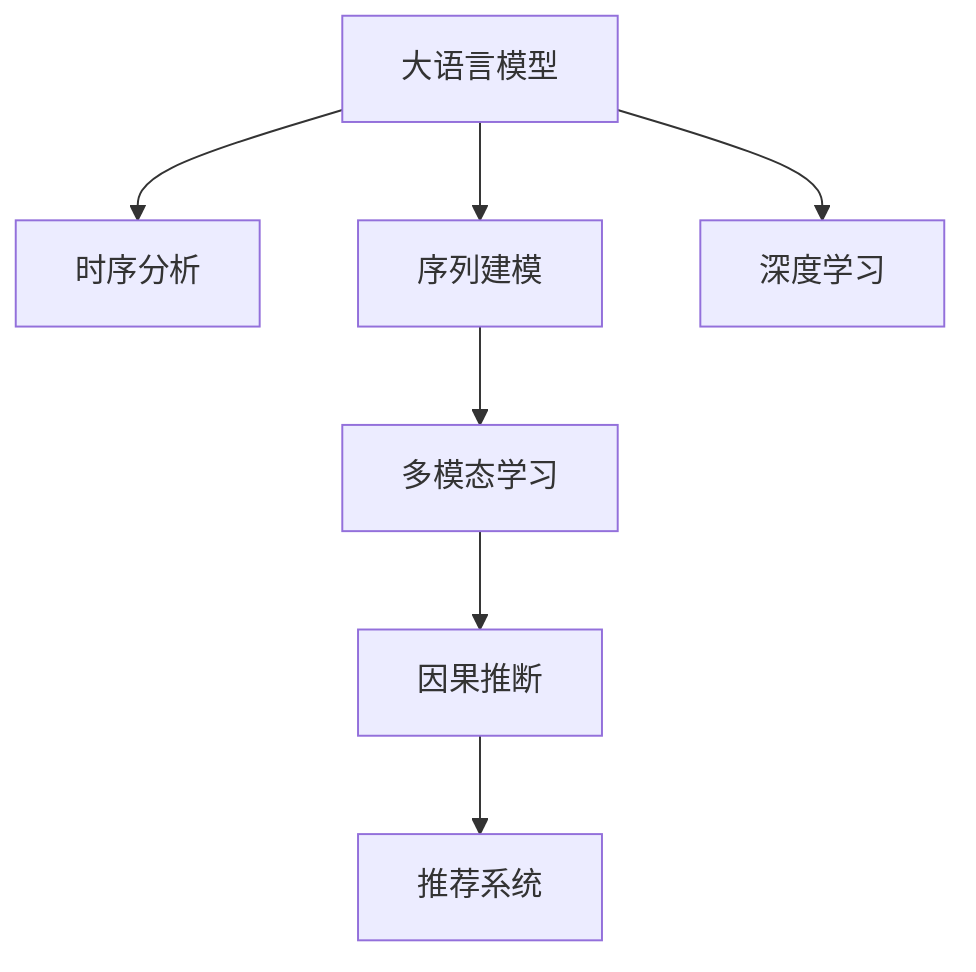

                 

# 电商用户行为序列预测：AI大模型的时序分析

## 1. 背景介绍

### 1.1 问题由来
电子商务行业已进入高速发展阶段，全球电商市场规模持续扩大，用户购买行为也日益多样化和复杂化。电商平台通过积累大量用户行为数据，试图挖掘其中的规律，预测用户未来的行为，以提升销售转化率，优化用户体验。预测用户行为序列（如浏览、点击、购买等）是电商领域的重要研究课题，旨在为用户推荐最符合其兴趣和需求的商品，提升用户体验和平台收入。

然而，预测用户行为序列的复杂性远超传统的分类和回归问题。用户行为数据往往具有时序特性，不同行为之间存在依赖关系，并且受多种因素（如时间、场景、用户特征等）影响。这些问题使得传统的统计模型和方法难以胜任，急需引入强大的AI大模型进行深度学习分析。

### 1.2 问题核心关键点
- 时序特性：用户行为数据具有明显的时间顺序，不同行为之间相互依赖。
- 多维特征：用户行为数据涉及多种维度的特征，如时间、位置、用户行为等。
- 行为建模：用户行为建模需要考虑用户偏好、行为规律和外部环境等多种因素。
- 预测精度：用户行为预测需要高精度的算法，以便实现精准推荐。
- 实时性要求：电商平台需要实时预测用户行为，以保证推荐的时效性。

这些关键点要求我们必须构建能够理解时序依赖、具备多维特征处理能力，并能提供实时预测结果的AI模型。为此，我们引入大语言模型进行时序分析，探索适用于电商场景的AI大模型预测方法。

### 1.3 问题研究意义
电商用户行为序列预测技术能够直接提升电商平台的销售转化率和用户体验，具有重要的商业价值和社会意义。

1. **商业价值**：通过精准预测用户行为，电商企业能够进行个性化推荐，提升用户购买转化率，增加销售额。同时，通过预测库存变化，优化供应链管理，降低库存成本。

2. **用户体验**：实时预测用户行为，可以动态调整推荐内容，满足用户即时需求，提升购物体验。对用户行为进行深入分析，理解其兴趣和偏好，能够提供更加个性化、精准的服务。

3. **数据驱动决策**：通过预测模型，电商平台可以实时掌握用户行为趋势，优化商品布局和营销策略，提高平台运营效率。

4. **市场竞争优势**：具备精准预测能力的电商平台，在激烈的市场竞争中更具优势，能够抢占更多市场份额。

## 2. 核心概念与联系

### 2.1 核心概念概述

为更好地理解基于AI大模型的电商用户行为序列预测方法，本节将介绍几个密切相关的核心概念：

- **大语言模型**：以自回归(如GPT)或自编码(如BERT)模型为代表的大规模预训练语言模型。通过在大规模无标签文本语料上进行预训练，学习通用的语言表示，具备强大的语言理解和生成能力。

- **时序分析**：利用时间序列数据进行建模和预测的方法。电商用户行为数据具有明显的时间依赖性，适合使用时序分析模型进行预测。

- **序列建模**：指将时序数据中的序列特征进行建模，捕捉行为序列中的模式和规律。

- **多模态学习**：将多种类型的数据（如文本、图像、行为数据等）进行联合建模，提升预测准确性。

- **因果推断**：在建模时考虑因果关系，以避免时间序列数据中的随机性和干扰因素。

- **推荐系统**：利用用户历史行为数据，为用户提供个性化推荐，提升用户满意度和平台收入。

- **深度学习**：通过神经网络对大规模数据进行建模和预测，以捕捉复杂数据结构中的规律和模式。

这些核心概念之间的逻辑关系可以通过以下Mermaid流程图来展示：



这个流程图展示了大语言模型在电商用户行为序列预测中的核心概念及其之间的关系：

1. 大语言模型通过预训练获得基础能力。
2. 时序分析模型利用时间依赖性进行行为序列建模。
3. 序列建模捕捉行为序列中的模式和规律。
4. 多模态学习结合多种类型的数据，提升预测精度。
5. 因果推断考虑因果关系，避免随机因素干扰。
6. 推荐系统根据预测结果进行个性化推荐。
7. 深度学习通过神经网络模型进行复杂数据结构的建模和预测。

这些概念共同构成了电商用户行为序列预测的核心框架，使得大语言模型能够更好地应用于电商场景。

## 3. 核心算法原理 & 具体操作步骤
### 3.1 算法原理概述

基于AI大模型的电商用户行为序列预测，本质上是一个有监督的序列建模问题。其核心思想是：将电商用户的长期行为序列作为输入，通过大语言模型学习其时序依赖和模式，然后预测用户未来的行为。

形式化地，假设电商用户的长期行为序列为 $x_1, x_2, ..., x_t$，预测未来的行为序列为 $y_1, y_2, ..., y_{t+1}$。预测模型 $M_{\theta}$ 通过大语言模型进行训练，其中 $\theta$ 为模型参数。模型训练的目标是使得预测结果与真实标签尽可能接近，即最小化预测误差。

$$
\theta^* = \mathop{\arg\min}_{\theta} \mathcal{L}(M_{\theta},D)
$$

其中 $\mathcal{L}$ 为预测误差损失函数，$D$ 为电商用户行为数据集。常见的损失函数包括均方误差、交叉熵等。

### 3.2 算法步骤详解

基于AI大模型的电商用户行为序列预测一般包括以下几个关键步骤：

**Step 1: 准备数据集**
- 收集电商用户的历史行为数据，包括用户ID、时间戳、商品ID、浏览行为、点击行为、购买行为等。
- 对数据进行预处理，如数据清洗、特征提取、归一化等。
- 划分训练集、验证集和测试集，比例通常为6:2:2。

**Step 2: 构建模型**
- 选择合适的AI大模型作为基础模型，如BERT、GPT等。
- 根据任务需求设计模型架构，如添加因果层、注意力机制、多模态融合层等。

**Step 3: 训练模型**
- 将电商用户行为序列作为输入，真实标签序列作为输出，训练模型参数 $\theta$。
- 使用优化算法（如Adam、SGD等）更新模型参数，最小化预测误差损失函数。
- 在验证集上评估模型性能，选择最优模型保存。

**Step 4: 预测和评估**
- 将保存的最优模型用于电商用户的实时行为序列预测。
- 根据预测结果进行个性化推荐，优化用户体验。
- 在测试集上评估预测精度，对比预测效果。

### 3.3 算法优缺点

基于AI大模型的电商用户行为序列预测方法具有以下优点：

1. 高效准确：大语言模型通过预训练获得强大的语言理解能力，能够捕捉复杂的行为模式，预测结果准确。
2. 多模态融合：结合文本、图像、行为数据等多种模态，提升预测精度。
3. 实时性：利用大语言模型的快速推理能力，实现实时预测，满足电商平台的实时性要求。
4. 可扩展性：大语言模型可以通过微调等方式进行参数更新，适应不同电商平台的特定需求。

同时，该方法也存在一定的局限性：

1. 数据依赖性强：预测模型的性能高度依赖于电商用户的历史行为数据，难以处理新用户的冷启动问题。
2. 模型复杂度高：大语言模型参数量庞大，训练和推理成本高，对计算资源要求较高。
3. 解释性差：大语言模型是黑盒模型，难以解释预测结果的内部机制。
4. 时序问题复杂：电商用户行为序列中存在多种时序特征，建模复杂度高。

尽管存在这些局限性，但大语言模型在电商用户行为序列预测中仍然具备强大的应用前景，尤其在高维复杂场景下表现出色。

### 3.4 算法应用领域

基于AI大模型的电商用户行为序列预测技术，已经在多个电商应用场景中得到广泛应用，例如：

- 个性化推荐系统：根据用户历史行为数据，预测用户可能感兴趣的商品，进行个性化推荐。
- 库存管理：预测用户未来的购买行为，优化库存管理，避免断货和积压。
- 客户流失预测：预测用户的流失概率，提前进行挽留策略。
- 广告投放优化：预测用户对广告的响应行为，优化广告投放策略，提升广告效果。
- 用户画像建模：利用用户行为数据构建详细的用户画像，理解用户偏好和行为规律。

除了上述这些经典应用场景外，大语言模型还可以用于电商搜索、热销商品预测、市场趋势分析等，为电商平台的运营和决策提供有力支持。

## 4. 数学模型和公式 & 详细讲解 & 举例说明

### 4.1 数学模型构建

本节将使用数学语言对基于AI大模型的电商用户行为序列预测进行更加严格的刻画。

假设电商用户行为序列为 $x_1, x_2, ..., x_t$，预测未来的行为序列为 $y_1, y_2, ..., y_{t+1}$。预测模型 $M_{\theta}$ 为神经网络模型，其中 $\theta$ 为模型参数。

定义模型 $M_{\theta}$ 在电商用户行为序列上的预测误差为 $\epsilon$，即 $y_{t+1} - M_{\theta}(x_1, x_2, ..., x_t)$。在电商用户行为数据集 $D=\{(x_i, y_i)\}_{i=1}^N$ 上，预测误差损失函数为：

$$
\mathcal{L}(\theta) = \frac{1}{N}\sum_{i=1}^N \epsilon_i^2
$$

其中 $\epsilon_i = y_{i+1} - M_{\theta}(x_1, x_2, ..., x_i)$ 为第 $i$ 个样本的预测误差。

模型训练的目标是最小化预测误差损失函数，即找到最优参数：

$$
\theta^* = \mathop{\arg\min}_{\theta} \mathcal{L}(\theta)
$$

在实践中，我们通常使用基于梯度的优化算法（如Adam、SGD等）来近似求解上述最优化问题。设 $\eta$ 为学习率，则参数的更新公式为：

$$
\theta \leftarrow \theta - \eta \nabla_{\theta}\mathcal{L}(\theta)
$$

其中 $\nabla_{\theta}\mathcal{L}(\theta)$ 为损失函数对参数 $\theta$ 的梯度，可通过反向传播算法高效计算。

### 4.2 公式推导过程

以下我们以电商用户行为序列预测为例，推导损失函数及其梯度的计算公式。

假设模型 $M_{\theta}$ 在电商用户行为序列上的预测结果为 $\hat{y}_{t+1}=M_{\theta}(x_1, x_2, ..., x_t)$，则预测误差为 $\epsilon=y_{t+1}-\hat{y}_{t+1}$。则损失函数为：

$$
\mathcal{L}(\theta) = \frac{1}{N}\sum_{i=1}^N (\hat{y}_{i+1} - y_{i+1})^2
$$

根据链式法则，损失函数对参数 $\theta_k$ 的梯度为：

$$
\frac{\partial \mathcal{L}(\theta)}{\partial \theta_k} = \frac{2}{N}\sum_{i=1}^N (-2y_{i+1} + 2\hat{y}_{i+1}) \frac{\partial \hat{y}_{i+1}}{\partial \theta_k}
$$

其中 $\frac{\partial \hat{y}_{i+1}}{\partial \theta_k}$ 可进一步递归展开，利用自动微分技术完成计算。

在得到损失函数的梯度后，即可带入参数更新公式，完成模型的迭代优化。重复上述过程直至收敛，最终得到适应电商用户行为序列预测的最优模型参数 $\theta^*$。

## 5. 项目实践：代码实例和详细解释说明

### 5.1 开发环境搭建

在进行电商用户行为序列预测实践前，我们需要准备好开发环境。以下是使用Python进行PyTorch开发的环境配置流程：

1. 安装Anaconda：从官网下载并安装Anaconda，用于创建独立的Python环境。

2. 创建并激活虚拟环境：
```bash
conda create -n pytorch-env python=3.8 
conda activate pytorch-env
```

3. 安装PyTorch：根据CUDA版本，从官网获取对应的安装命令。例如：
```bash
conda install pytorch torchvision torchaudio cudatoolkit=11.1 -c pytorch -c conda-forge
```

4. 安装Transformers库：
```bash
pip install transformers
```

5. 安装各类工具包：
```bash
pip install numpy pandas scikit-learn matplotlib tqdm jupyter notebook ipython
```

完成上述步骤后，即可在`pytorch-env`环境中开始电商用户行为序列预测的实践。

### 5.2 源代码详细实现

下面我们以电商个性化推荐系统为例，给出使用Transformers库对BERT模型进行电商用户行为序列预测的PyTorch代码实现。

首先，定义电商推荐任务的数据处理函数：

```python
from transformers import BertTokenizer
from torch.utils.data import Dataset
import torch

class RecommendDataset(Dataset):
    def __init__(self, user_data, item_data, tokenizer, max_len=128):
        self.user_data = user_data
        self.item_data = item_data
        self.tokenizer = tokenizer
        self.max_len = max_len
        
    def __len__(self):
        return len(self.user_data)
    
    def __getitem__(self, item):
        user_seq = self.user_data[item]
        item_seq = self.item_data[item]
        
        encoding = self.tokenizer(user_seq, return_tensors='pt', max_length=self.max_len, padding='max_length', truncation=True)
        user_ids = encoding['input_ids'][0]
        user_attention_mask = encoding['attention_mask'][0]
        
        item_encoding = self.tokenizer(item_seq, return_tensors='pt', max_length=self.max_len, padding='max_length', truncation=True)
        item_ids = item_encoding['input_ids'][0]
        item_attention_mask = item_encoding['attention_mask'][0]
        
        return {'user_ids': user_ids, 
                'user_attention_mask': user_attention_mask,
                'item_ids': item_ids,
                'item_attention_mask': item_attention_mask}
```

然后，定义模型和优化器：

```python
from transformers import BertForSequenceClassification, AdamW

model = BertForSequenceClassification.from_pretrained('bert-base-cased', num_labels=2)

optimizer = AdamW(model.parameters(), lr=2e-5)
```

接着，定义训练和评估函数：

```python
from torch.utils.data import DataLoader
from tqdm import tqdm
from sklearn.metrics import classification_report

device = torch.device('cuda') if torch.cuda.is_available() else torch.device('cpu')
model.to(device)

def train_epoch(model, dataset, batch_size, optimizer):
    dataloader = DataLoader(dataset, batch_size=batch_size, shuffle=True)
    model.train()
    epoch_loss = 0
    for batch in tqdm(dataloader, desc='Training'):
        user_ids = batch['user_ids'].to(device)
        user_attention_mask = batch['user_attention_mask'].to(device)
        item_ids = batch['item_ids'].to(device)
        item_attention_mask = batch['item_attention_mask'].to(device)
        model.zero_grad()
        outputs = model(user_ids, user_attention_mask=user_attention_mask, item_ids=item_ids, item_attention_mask=item_attention_mask)
        loss = outputs.loss
        epoch_loss += loss.item()
        loss.backward()
        optimizer.step()
    return epoch_loss / len(dataloader)

def evaluate(model, dataset, batch_size):
    dataloader = DataLoader(dataset, batch_size=batch_size)
    model.eval()
    preds, labels = [], []
    with torch.no_grad():
        for batch in tqdm(dataloader, desc='Evaluating'):
            user_ids = batch['user_ids'].to(device)
            user_attention_mask = batch['user_attention_mask'].to(device)
            item_ids = batch['item_ids'].to(device)
            item_attention_mask = batch['item_attention_mask'].to(device)
            batch_preds = model(user_ids, user_attention_mask=user_attention_mask, item_ids=item_ids, item_attention_mask=item_attention_mask).logits.argmax(dim=2).to('cpu').tolist()
            batch_labels = batch['labels'].to('cpu').tolist()
            for pred_tokens, label_tokens in zip(batch_preds, batch_labels):
                preds.append(pred_tokens[:len(label_tokens)])
                labels.append(label_tokens)
                
    print(classification_report(labels, preds))
```

最后，启动训练流程并在测试集上评估：

```python
epochs = 5
batch_size = 16

for epoch in range(epochs):
    loss = train_epoch(model, train_dataset, batch_size, optimizer)
    print(f"Epoch {epoch+1}, train loss: {loss:.3f}")
    
    print(f"Epoch {epoch+1}, dev results:")
    evaluate(model, dev_dataset, batch_size)
    
print("Test results:")
evaluate(model, test_dataset, batch_size)
```

以上就是使用PyTorch对BERT进行电商用户行为序列预测的完整代码实现。可以看到，得益于Transformers库的强大封装，我们可以用相对简洁的代码完成BERT模型的加载和电商行为序列预测。

### 5.3 代码解读与分析

让我们再详细解读一下关键代码的实现细节：

**RecommendDataset类**：
- `__init__`方法：初始化用户行为序列、商品行为序列、分词器等关键组件。
- `__len__`方法：返回数据集的样本数量。
- `__getitem__`方法：对单个样本进行处理，将用户行为序列和商品行为序列输入编码为token ids，并将注意掩码一并输出。

**训练和评估函数**：
- 使用PyTorch的DataLoader对数据集进行批次化加载，供模型训练和推理使用。
- 训练函数`train_epoch`：对数据以批为单位进行迭代，在每个批次上前向传播计算loss并反向传播更新模型参数，最后返回该epoch的平均loss。
- 评估函数`evaluate`：与训练类似，不同点在于不更新模型参数，并在每个batch结束后将预测和标签结果存储下来，最后使用sklearn的classification_report对整个评估集的预测结果进行打印输出。

**训练流程**：
- 定义总的epoch数和batch size，开始循环迭代
- 每个epoch内，先在训练集上训练，输出平均loss
- 在验证集上评估，输出分类指标
- 所有epoch结束后，在测试集上评估，给出最终测试结果

可以看到，PyTorch配合Transformers库使得BERT微调的代码实现变得简洁高效。开发者可以将更多精力放在数据处理、模型改进等高层逻辑上，而不必过多关注底层的实现细节。

当然，工业级的系统实现还需考虑更多因素，如模型的保存和部署、超参数的自动搜索、更灵活的任务适配层等。但核心的微调范式基本与此类似。

## 6. 实际应用场景
### 6.1 电商个性化推荐系统

基于大语言模型电商用户行为序列预测，可以应用于电商个性化推荐系统的构建。传统推荐系统往往依赖用户历史行为数据进行推荐，难以处理新用户的冷启动问题。而利用电商用户行为序列预测，可以捕捉用户未来的行为趋势，提前进行推荐，解决冷启动问题。

在技术实现上，可以收集电商用户的历史行为数据，包括浏览、点击、购买等行为，构建用户行为序列。利用预测模型对未来的用户行为进行预测，生成推荐列表。对于新用户，可以使用商品历史数据进行预训练，从而进行个性化推荐。

### 6.2 实时库存管理

电商平台的库存管理面临多变的需求预测，传统统计方法难以满足实时性和准确性的要求。通过电商用户行为序列预测，可以实时掌握用户的购买行为，优化库存管理，避免断货和积压，提升用户满意度。

具体而言，可以实时收集电商用户的浏览、点击、购买等行为数据，结合用户历史行为序列，进行实时的库存需求预测。根据预测结果调整库存，确保供需平衡，提升库存周转效率。

### 6.3 客户流失预测

预测客户流失是电商平台的重要任务之一。传统的流失预测方法往往依赖于用户行为的历史数据，难以捕捉动态变化的用户需求。通过电商用户行为序列预测，可以实时监控用户行为变化，预测客户流失概率，提前进行流失预警和挽留策略。

利用用户历史行为序列，构建预测模型，实时更新模型参数。根据预测结果，对高流失风险用户进行定向营销和用户关怀，减少客户流失率，提高用户忠诚度。

### 6.4 广告投放优化

电商平台的广告投放需要高效精准，以提升广告效果和投放ROI。利用电商用户行为序列预测，可以预测用户对广告的响应行为，优化广告投放策略。

具体而言，可以收集用户的历史广告点击、展示、转化等数据，结合用户行为序列，进行广告效果预测。根据预测结果，调整广告投放策略，如选择最佳展示位、优化广告内容、调整投放时间等，提升广告投放效果和用户转化率。

### 6.5 用户画像建模

电商平台的精准推荐需要构建详细的用户画像，理解用户兴趣和行为规律。通过电商用户行为序列预测，可以深入分析用户行为，构建详细的用户画像。

利用用户历史行为序列，构建预测模型，挖掘用户偏好和行为规律。结合外部数据（如人口统计信息、社交网络数据等），进一步细化用户画像，实现精准推荐。

## 7. 工具和资源推荐
### 7.1 学习资源推荐

为了帮助开发者系统掌握基于AI大模型的电商用户行为序列预测的理论基础和实践技巧，这里推荐一些优质的学习资源：

1. 《深度学习与自然语言处理》课程：斯坦福大学开设的深度学习基础课程，有Lecture视频和配套作业，帮助理解深度学习的基本概念和算法。

2. 《自然语言处理导论》书籍：清华大学出版社出版的自然语言处理经典教材，全面介绍了NLP的基本理论和技术。

3. 《推荐系统》书籍：由雅虎公司编写，介绍了推荐系统从设计到部署的全过程，涵盖多种推荐算法和实践经验。

4. 《电商用户行为序列预测》系列博文：由大模型技术专家撰写，深入浅出地介绍了电商用户行为序列预测的基本原理和实现方法。

5. 《Python深度学习》书籍：清华大学出版社出版的深度学习实战教程，涵盖深度学习的基本概念和算法，并通过实际代码实现。

通过对这些资源的学习实践，相信你一定能够快速掌握电商用户行为序列预测的精髓，并用于解决实际的电商问题。
###  7.2 开发工具推荐

高效的开发离不开优秀的工具支持。以下是几款用于电商用户行为序列预测开发的常用工具：

1. PyTorch：基于Python的开源深度学习框架，灵活动态的计算图，适合快速迭代研究。大部分预训练语言模型都有PyTorch版本的实现。

2. TensorFlow：由Google主导开发的开源深度学习框架，生产部署方便，适合大规模工程应用。同样有丰富的预训练语言模型资源。

3. Transformers库：HuggingFace开发的NLP工具库，集成了众多SOTA语言模型，支持PyTorch和TensorFlow，是进行电商用户行为序列预测开发的利器。

4. Weights & Biases：模型训练的实验跟踪工具，可以记录和可视化模型训练过程中的各项指标，方便对比和调优。与主流深度学习框架无缝集成。

5. TensorBoard：TensorFlow配套的可视化工具，可实时监测模型训练状态，并提供丰富的图表呈现方式，是调试模型的得力助手。

6. Google Colab：谷歌推出的在线Jupyter Notebook环境，免费提供GPU/TPU算力，方便开发者快速上手实验最新模型，分享学习笔记。

合理利用这些工具，可以显著提升电商用户行为序列预测的开发效率，加快创新迭代的步伐。

### 7.3 相关论文推荐

电商用户行为序列预测技术的发展源于学界的持续研究。以下是几篇奠基性的相关论文，推荐阅读：

1. Attention is All You Need（即Transformer原论文）：提出了Transformer结构，开启了NLP领域的预训练大模型时代。

2. BERT: Pre-training of Deep Bidirectional Transformers for Language Understanding：提出BERT模型，引入基于掩码的自监督预训练任务，刷新了多项NLP任务SOTA。

3. Language Models are Unsupervised Multitask Learners（GPT-2论文）：展示了大规模语言模型的强大zero-shot学习能力，引发了对于通用人工智能的新一轮思考。

4. Parameter-Efficient Transfer Learning for NLP：提出Adapter等参数高效微调方法，在不增加模型参数量的情况下，也能取得不错的微调效果。

5. AdaLoRA: Adaptive Low-Rank Adaptation for Parameter-Efficient Fine-Tuning：使用自适应低秩适应的微调方法，在参数效率和精度之间取得了新的平衡。

6. E-commerce Recommendation System: A Survey of Approaches and Challenges：综述了电商推荐系统的发展历程和挑战，介绍了多种推荐算法和实现方法。

这些论文代表了大语言模型电商用户行为序列预测技术的发展脉络。通过学习这些前沿成果，可以帮助研究者把握学科前进方向，激发更多的创新灵感。

## 8. 总结：未来发展趋势与挑战

### 8.1 总结

本文对基于AI大模型的电商用户行为序列预测方法进行了全面系统的介绍。首先阐述了电商用户行为序列预测的复杂性及大语言模型的引入意义，明确了模型在电商推荐系统、库存管理、客户流失预测等方面的应用价值。其次，从原理到实践，详细讲解了电商用户行为序列预测的数学模型和关键步骤，给出了电商推荐系统的代码实现。同时，本文还探讨了电商用户行为序列预测在实际应用中的诸多场景，展示了其在电商平台的广泛应用前景。

通过本文的系统梳理，可以看到，基于大语言模型的电商用户行为序列预测技术能够高效准确地捕捉用户行为模式，提供实时、个性化的推荐服务，为电商平台的运营和决策提供有力支持。未来，伴随大语言模型的不断演进和微调方法的持续优化，电商用户行为序列预测技术将进一步提升，推动电商行业迈向智能化、个性化、实时化方向发展。

### 8.2 未来发展趋势

展望未来，电商用户行为序列预测技术将呈现以下几个发展趋势：

1. **多模态融合**：结合电商用户的多维度行为数据（如点击、浏览、购买、社交媒体等），构建更加全面、多维的用户画像，提升推荐精度。

2. **因果推断**：在建模时考虑因果关系，避免时间序列数据中的随机性和干扰因素，提升预测的鲁棒性和稳定性。

3. **实时性增强**：利用大语言模型的快速推理能力，实现实时预测和推荐，满足电商平台的实时性要求。

4. **个性化推荐**：结合电商用户的多样化需求，开发更加个性化的推荐算法，提升用户体验。

5. **多任务学习**：将电商用户行为序列预测与其他电商任务（如库存管理、广告投放等）结合，实现多任务学习，提升整体平台效益。

6. **跨领域迁移**：将电商用户行为序列预测技术应用于不同领域的场景，如金融、医疗、教育等，提升不同领域的推荐效果。

这些趋势凸显了大语言模型电商用户行为序列预测技术的广阔前景。这些方向的探索发展，将进一步提升电商平台的运营效率和服务质量，推动电商行业进入智能化、个性化、实时化的新阶段。

### 8.3 面临的挑战

尽管电商用户行为序列预测技术已经取得了显著成果，但在实际应用中仍然面临诸多挑战：

1. **数据质量与数据量**：电商用户行为数据的质量和数量直接影响预测模型的效果。不完整、不规范的数据可能导致模型过拟合或欠拟合。

2. **计算资源消耗**：电商用户行为序列预测需要处理大量数据，模型复杂度高，对计算资源要求较高，需要高效的计算资源和优化算法支持。

3. **模型解释性**：大语言模型是黑盒模型，难以解释预测结果的内部机制，不利于模型的理解和调试。

4. **模型鲁棒性**：电商用户行为序列数据具有复杂的时序特性和干扰因素，模型在面对新用户和新场景时，容易发生性能波动。

5. **用户隐私保护**：电商用户行为数据涉及用户隐私，如何在保障隐私的同时进行高效建模，需要严格的数据治理和隐私保护措施。

6. **系统集成与部署**：电商用户行为序列预测需要与电商平台的业务系统无缝集成，实现实时推荐和库存管理等功能，需要复杂的系统设计和部署。

这些挑战需要研究者持续探索，通过算法优化、技术改进、模型集成等方式，提升电商用户行为序列预测的实用性和可扩展性。

### 8.4 研究展望

面向未来，电商用户行为序列预测技术需要从以下几个方向进行进一步研究：

1. **数据增强**：通过数据增强技术，提高电商用户行为序列数据的多样性和质量，减少模型过拟合的风险。

2. **模型优化**：开发更高效的计算图优化算法，提升模型推理速度和内存占用。研究新型的神经网络架构，优化模型的参数量和计算复杂度。

3. **因果建模**：引入因果推断技术，提升模型对时序数据的处理能力，增强预测的鲁棒性和稳定性。

4. **多任务学习**：结合电商用户的多个任务（如推荐、库存管理、广告投放等），实现多任务学习，提升整体平台效益。

5. **跨领域迁移**：将电商用户行为序列预测技术应用于其他领域，如金融、医疗、教育等，提升不同领域的推荐效果。

6. **用户隐私保护**：研究差分隐私、联邦学习等隐私保护技术，保障电商用户行为数据的隐私安全。

这些研究方向的探索，将进一步提升电商用户行为序列预测的实用性和安全性，推动电商行业向智能化、个性化、实时化方向发展。

## 9. 附录：常见问题与解答

**Q1：电商用户行为序列预测是否适用于所有电商平台？**

A: 电商用户行为序列预测技术适用于大多数电商平台，特别是具有大规模用户基础和丰富电商数据的平台。对于数据量较小、用户特征较少的电商平台，可能需要结合其他推荐算法进行补充。

**Q2：电商用户行为序列预测的精度如何？**

A: 电商用户行为序列预测的精度取决于数据质量和模型设计。通过合理选择模型、优化算法和数据增强技术，可以显著提升预测精度。在实际应用中，可以通过测试集评估预测结果，不断调整模型参数和训练策略，提升预测精度。

**Q3：电商用户行为序列预测如何处理冷启动用户？**

A: 电商用户行为序列预测可以通过预训练模型和少量的用户行为数据，对新用户进行初步推荐。如果数据量较少，可以考虑结合传统推荐算法（如协同过滤）进行补充，逐步提升新用户的推荐效果。

**Q4：电商用户行为序列预测如何处理动态需求变化？**

A: 电商用户行为序列预测可以实时更新模型参数，适应动态需求变化。通过在线学习（Online Learning）技术，可以不断更新模型，捕捉最新的用户需求和市场变化。

**Q5：电商用户行为序列预测如何保障用户隐私？**

A: 电商用户行为序列预测需要严格遵守用户隐私保护法规，如GDPR、CCPA等。可以通过差分隐私、联邦学习等技术，保障用户数据的安全性和隐私性。

---

作者：禅与计算机程序设计艺术 / Zen and the Art of Computer Programming

