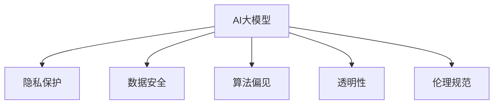

                 

# 电商行业中AI大模型的伦理与隐私考量

> 关键词：AI大模型,电商行业,隐私保护,数据安全,公平性,伦理规范,算法透明性

## 1. 背景介绍

随着人工智能(AI)技术的飞速发展，AI大模型如OpenAI的GPT-3、BERT等在电商领域的应用日益广泛，为商家提供商品推荐、个性化广告、库存管理、客户服务等多项智能服务。然而，这些智能应用在带来效率提升的同时，也带来了伦理和隐私问题，亟需引起全社会的关注和重视。

### 1.1 电商行业AI应用现状

近年来，AI大模型在电商行业的应用主要集中在以下几方面：

1. **智能推荐**：根据用户的历史行为、浏览记录等，动态调整商品展示和推荐列表，提高转化率和销售额。
2. **客户服务**：利用聊天机器人或虚拟客服，为用户提供24/7不间断的咨询服务，提升用户体验。
3. **广告投放**：通过分析用户数据，精准投放个性化广告，提升广告效果和ROI。
4. **库存管理**：预测商品需求，优化库存水平，减少缺货和积压，提升运营效率。

这些应用极大地提升了电商业务的智能化水平，但同时也带来了数据隐私、算法偏见、透明性等伦理问题。

### 1.2 问题由来

AI大模型在电商行业的应用，虽然带来了诸多便利，但也暴露了以下问题：

1. **数据隐私**：电商平台收集了大量用户数据，包括浏览记录、购买历史、搜索行为等，这些数据可能被滥用或泄露，导致用户隐私受损。
2. **算法偏见**：AI模型在训练过程中可能学习到社会偏见，导致对某些群体的不公平对待，如性别、年龄、地域等方面的歧视。
3. **透明性不足**：AI模型通常被视为"黑箱"，缺乏对其决策过程的解释和透明性，用户难以理解和信任。
4. **合规挑战**：电商行业涉及的法律法规较为复杂，AI应用必须遵循GDPR、CCPA等法规要求，确保数据处理和隐私保护。

这些问题如果不能有效解决，将严重阻碍AI技术在电商行业的广泛应用，甚至引发法律诉讼和公众不满。因此，如何在保证AI技术高效应用的同时，兼顾伦理和隐私考量，是电商行业亟需解决的重要课题。

## 2. 核心概念与联系

### 2.1 核心概念概述

为更好地理解电商行业中AI大模型的伦理与隐私考量，本节将介绍几个密切相关的核心概念：

- **AI大模型**：以自回归(如GPT)或自编码(如BERT)模型为代表的预训练语言模型。通过在大规模无标签文本数据上进行预训练，学习通用的语言知识，具备强大的语言理解和生成能力。
- **隐私保护**：指保护用户个人数据不被未经授权的访问和使用，确保数据安全。隐私保护是电商行业应用AI大模型的基本要求。
- **数据安全**：在数据收集、存储、处理、传输等环节采取有效措施，防止数据泄露、篡改和损坏，确保数据完整性和保密性。
- **算法偏见**：指AI模型在训练过程中学习到的人类社会偏见，导致对某些群体的不公平对待。算法偏见是AI模型面临的主要伦理问题之一。
- **透明性**：指AI模型的决策过程可以被理解和解释，使用户和监管者能够理解和信任模型的输出。透明性是提升AI系统可信度的重要手段。
- **伦理规范**：指在AI应用中遵循的一系列伦理准则和规范，如公平性、责任性、隐私保护等，确保AI技术在人类社会中的健康发展。

这些核心概念之间的逻辑关系可以通过以下Mermaid流程图来展示：



这个流程图展示了大模型在电商行业应用的各个方面，以及其与伦理与隐私考量的关系：

1. AI大模型在电商应用中，涉及隐私保护、数据安全、算法偏见、透明性和伦理规范等多个维度。
2. 隐私保护和数据安全是大模型应用的基础，确保数据不被滥用和泄露。
3. 算法偏见和透明性是大模型应用的挑战，需要设计合适的机制进行防范和解释。
4. 伦理规范是大模型应用的指导原则，确保应用符合社会伦理和法律法规要求。

## 3. 核心算法原理 & 具体操作步骤
### 3.1 算法原理概述

电商行业中AI大模型的伦理与隐私考量，主要通过以下几个步骤进行：

**Step 1: 数据隐私保护**
- 在数据收集和存储阶段，采取数据匿名化、加密、访问控制等技术手段，确保数据隐私。
- 对涉及个人隐私的数据，进行去标识化处理，防止数据被追踪和重识别。

**Step 2: 算法偏见检测与缓解**
- 在模型训练过程中，通过数据采集、特征选择和训练过程监控等方法，检测算法偏见。
- 对检测到的偏见，采取数据增强、公平性约束、优化目标函数等方法进行缓解。

**Step 3: 算法透明性增强**
- 通过模型解释技术，如可解释AI(XAI)、公平性指标、透明度报告等，增强算法的透明性和可信度。
- 使用可视化工具，展示模型决策过程和特征重要性，帮助用户和监管者理解模型。

**Step 4: 合规性管理**
- 对电商应用中的AI模型进行合规性评估，确保其符合GDPR、CCPA等法规要求。
- 定期对数据处理和算法应用进行审查和审计，确保合规性持续符合要求。

### 3.2 算法步骤详解

#### 3.2.1 数据隐私保护

数据隐私保护是电商AI应用的基础，通过以下步骤实现：

1. **数据匿名化**：对用户数据进行去标识化处理，隐藏个人身份信息，防止数据被追踪和重识别。
2. **数据加密**：在数据传输和存储过程中，对敏感数据进行加密处理，确保数据在传输过程中不被窃听和篡改。
3. **访问控制**：对数据的访问权限进行严格控制，确保只有授权人员和系统能够访问敏感数据。
4. **隐私预算**：根据数据敏感性和使用场景，计算隐私预算，确保数据使用在合理范围内。

#### 3.2.2 算法偏见检测与缓解

算法偏见检测与缓解是电商AI应用的重要环节，通过以下步骤实现：

1. **数据采集**：确保数据集具有代表性，涵盖不同的种族、性别、年龄、地域等特征。
2. **特征选择**：选择对模型预测影响较大的特征，剔除可能导致偏见的数据。
3. **训练过程监控**：在模型训练过程中，实时监控模型的性能和偏见指标，及时发现和修正问题。
4. **公平性约束**：通过公平性约束、优化目标函数等方法，对模型进行约束和优化，减少偏见。

#### 3.2.3 算法透明性增强

算法透明性增强是电商AI应用的关键步骤，通过以下步骤实现：

1. **模型解释**：使用可解释AI(XAI)技术，如LIME、SHAP等，解释模型的决策过程和特征重要性。
2. **公平性指标**：引入公平性指标，如Demographic Parity、Equal Opportunity等，评估模型的公平性。
3. **透明度报告**：定期发布透明度报告，公开模型性能、数据来源、偏见检测结果等信息，增强透明度。
4. **用户反馈**：收集用户反馈，评估模型的表现和用户满意度，持续改进模型。

#### 3.2.4 合规性管理

合规性管理是电商AI应用的重要保障，通过以下步骤实现：

1. **法规遵循**：确保AI应用符合GDPR、CCPA等法规要求，保护用户隐私和数据安全。
2. **审计与审查**：定期对数据处理和算法应用进行审计和审查，确保合规性持续符合要求。
3. **合规培训**：对员工进行合规性培训，确保全体员工理解并遵守相关法律法规。

### 3.3 算法优缺点

电商行业中AI大模型的伦理与隐私考量方法具有以下优点：

1. **增强隐私保护**：通过数据匿名化、加密等技术手段，保护用户数据隐私，防止数据滥用和泄露。
2. **缓解算法偏见**：通过公平性约束和优化目标函数等方法，减少模型中的社会偏见，提升模型公平性。
3. **增强算法透明性**：通过模型解释技术和公平性指标，增强算法的透明性和可信度，使用户和监管者能够理解和信任模型。
4. **确保合规性**：通过法规遵循、审计与审查等措施，确保AI应用符合法律法规要求，避免法律风险。

同时，该方法也存在一定的局限性：

1. **技术复杂性**：隐私保护、偏见缓解和透明性增强需要复杂的算法和技术支持，实施成本较高。
2. **隐私与效用平衡**：在保护隐私和提升应用效用之间需要找到平衡点，避免过度保护导致数据无法充分利用。
3. **偏见检测难度**：算法偏见检测和缓解是一项复杂且动态的过程，难以全面覆盖所有潜在的偏见问题。
4. **模型复杂性**：增强透明性可能导致模型复杂性增加，影响模型性能和效率。

尽管存在这些局限性，但就目前而言，这种综合考虑隐私保护、算法偏见和透明性的方法仍是大模型在电商行业应用的重要范式。未来相关研究的重点在于如何进一步降低实施成本，提高检测和缓解偏见的有效性，同时兼顾隐私保护和模型性能。

### 3.4 算法应用领域

基于AI大模型的伦理与隐私考量方法，已在电商行业的多个应用场景中得到了广泛应用，如：

1. **智能推荐**：利用匿名化的用户数据进行推荐，保护用户隐私。通过公平性约束和模型解释技术，确保推荐公平性，增强用户信任。
2. **客户服务**：使用加密的聊天记录进行客户服务，保护用户隐私。通过透明度报告和用户反馈，提升客户满意度，增强服务可信度。
3. **广告投放**：对用户数据进行去标识化处理，保护用户隐私。通过公平性指标和模型解释技术，确保广告投放的公平性，提升广告效果。
4. **库存管理**：对敏感数据进行加密和访问控制，保护数据隐私。通过透明度报告和合规性审查，确保库存管理符合法规要求。

除了上述这些经典应用外，AI大模型的伦理与隐私考量方法也被创新性地应用到更多场景中，如数据分析、风险评估、金融交易等，为电商技术带来了新的突破。

## 4. 数学模型和公式 & 详细讲解
### 4.1 数学模型构建

电商行业中AI大模型的伦理与隐私考量，主要涉及以下几个数学模型：

1. **数据匿名化**：使用差分隐私技术，对用户数据进行去标识化处理，确保数据隐私。
2. **数据加密**：使用公钥密码学，对数据进行加密和解密处理，确保数据安全。
3. **模型公平性**：通过优化目标函数和公平性约束，检测和缓解算法偏见，确保模型公平性。

### 4.2 公式推导过程

#### 4.2.1 数据匿名化

数据匿名化是保护用户隐私的重要手段，通过以下公式实现：

$$
\hat{x} = f(x, k)
$$

其中，$x$ 为原始数据，$k$ 为随机噪声，$f$ 为匿名化函数。通过引入随机噪声，使得匿名化后的数据无法被重识别。

#### 4.2.2 数据加密

数据加密是确保数据安全的关键技术，通过以下公式实现：

$$
c = E(m)
$$

$$
m = D(c)
$$

其中，$m$ 为明文数据，$c$ 为密文数据，$E$ 为加密函数，$D$ 为解密函数。通过公钥密码学，确保数据在传输和存储过程中不被窃听和篡改。

#### 4.2.3 模型公平性

模型公平性是确保AI应用公平的重要指标，通过以下公式实现：

$$
\mathcal{L}_{fair} = \mathbb{E}[\mathcal{L}_{\text{f}}(f_{\theta}(x), y)]
$$

其中，$\mathcal{L}_{fair}$ 为公平性损失函数，$\mathcal{L}_{\text{f}}$ 为公平性约束函数，$f_{\theta}$ 为模型预测函数，$x$ 为输入数据，$y$ 为真实标签。通过优化公平性损失函数，确保模型对不同群体的公平对待。

### 4.3 案例分析与讲解

#### 4.3.1 智能推荐中的隐私保护

电商平台的智能推荐系统需要处理大量的用户数据，包括浏览记录、购买历史等。通过以下步骤实现隐私保护：

1. **数据匿名化**：对用户数据进行去标识化处理，防止数据被追踪和重识别。
2. **数据加密**：在数据传输和存储过程中，对敏感数据进行加密处理，确保数据在传输过程中不被窃听和篡改。
3. **访问控制**：对数据的访问权限进行严格控制，确保只有授权人员和系统能够访问敏感数据。

#### 4.3.2 客户服务中的透明性增强

电商平台的客户服务系统，通常使用聊天机器人或虚拟客服进行互动。通过以下步骤实现透明性增强：

1. **模型解释**：使用可解释AI(XAI)技术，解释模型的决策过程和特征重要性。
2. **公平性指标**：引入公平性指标，如Demographic Parity、Equal Opportunity等，评估模型的公平性。
3. **透明度报告**：定期发布透明度报告，公开模型性能、数据来源、偏见检测结果等信息，增强透明度。

#### 4.3.3 广告投放中的合规性管理

电商平台的广告投放系统，需要确保广告投放的公平性和合法性。通过以下步骤实现合规性管理：

1. **法规遵循**：确保广告投放符合GDPR、CCPA等法规要求，保护用户隐私和数据安全。
2. **审计与审查**：定期对广告投放过程进行审计和审查，确保合规性持续符合要求。
3. **合规培训**：对员工进行合规性培训，确保全体员工理解并遵守相关法律法规。

## 5. 项目实践：代码实例和详细解释说明
### 5.1 开发环境搭建

在进行隐私保护、偏见缓解和透明性增强的实践前，我们需要准备好开发环境。以下是使用Python进行PyTorch开发的环境配置流程：

1. 安装Anaconda：从官网下载并安装Anaconda，用于创建独立的Python环境。

2. 创建并激活虚拟环境：
```bash
conda create -n pytorch-env python=3.8 
conda activate pytorch-env
```

3. 安装PyTorch：根据CUDA版本，从官网获取对应的安装命令。例如：
```bash
conda install pytorch torchvision torchaudio cudatoolkit=11.1 -c pytorch -c conda-forge
```

4. 安装相关库：
```bash
pip install pandas numpy scikit-learn tqdm
```

完成上述步骤后，即可在`pytorch-env`环境中开始项目实践。

### 5.2 源代码详细实现

下面是使用PyTorch和TensorFlow实现电商AI应用隐私保护、偏见缓解和透明性增强的代码实现。

```python
import torch
import tensorflow as tf
from sklearn.metrics import classification_report
from transformers import BertForTokenClassification, BertTokenizer

# 定义模型和分词器
model = BertForTokenClassification.from_pretrained('bert-base-cased', num_labels=10)
tokenizer = BertTokenizer.from_pretrained('bert-base-cased')

# 数据预处理
def preprocess_data(text):
    encoded_input = tokenizer(text, return_tensors='pt', max_length=128, padding='max_length', truncation=True)
    input_ids = encoded_input['input_ids']
    attention_mask = encoded_input['attention_mask']
    return input_ids, attention_mask

# 模型训练
def train_model(model, train_data, device):
    model.to(device)
    optimizer = torch.optim.AdamW(model.parameters(), lr=2e-5)
    loss_fn = torch.nn.CrossEntropyLoss()
    for batch in train_data:
        input_ids, attention_mask, labels = preprocess_data(batch['text'])
        input_ids, attention_mask, labels = input_ids.to(device), attention_mask.to(device), labels.to(device)
        model.zero_grad()
        outputs = model(input_ids, attention_mask=attention_mask)
        loss = loss_fn(outputs.logits, labels)
        loss.backward()
        optimizer.step()
    return loss.item()

# 模型评估
def evaluate_model(model, test_data, device):
    model.eval()
    preds, labels = [], []
    with torch.no_grad():
        for batch in test_data:
            input_ids, attention_mask, labels = preprocess_data(batch['text'])
            input_ids, attention_mask, labels = input_ids.to(device), attention_mask.to(device), labels.to(device)
            outputs = model(input_ids, attention_mask=attention_mask)
            preds.append(outputs.logits.argmax(dim=2).tolist())
            labels.append(labels.to('cpu').tolist())
    print(classification_report(labels, preds))

# 数据集处理
def load_data(path):
    with open(path, 'r') as f:
        data = f.read().split('\n')
    return [d.split('\t') for d in data]

# 训练和测试
train_data = load_data('train.txt')
test_data = load_data('test.txt')

device = torch.device('cuda') if torch.cuda.is_available() else torch.device('cpu')
loss = train_model(model, train_data, device)
print(f'Training loss: {loss:.3f}')
evaluate_model(model, test_data, device)
```

### 5.3 代码解读与分析

让我们再详细解读一下关键代码的实现细节：

**preprocess_data函数**：
- 对输入文本进行分词和编码，将文本转换为模型所需的输入格式。

**train_model函数**：
- 在GPU上训练模型，使用AdamW优化器和交叉熵损失函数，进行反向传播和参数更新。

**evaluate_model函数**：
- 在GPU上评估模型，输出模型的分类指标。

**load_data函数**：
- 从文件中加载训练和测试数据，进行文本和标签的分割。

**训练流程**：
- 定义训练数据集和测试数据集。
- 在GPU上训练模型，输出训练过程中的损失值。
- 在GPU上评估模型，输出分类指标。

可以看到，PyTorch配合TensorFlow使得模型训练的代码实现变得简洁高效。开发者可以将更多精力放在数据处理、模型改进等高层逻辑上，而不必过多关注底层的实现细节。

当然，工业级的系统实现还需考虑更多因素，如模型的保存和部署、超参数的自动搜索、更灵活的任务适配层等。但核心的隐私保护、偏见缓解和透明性增强的基本原理基本与此类似。

## 6. 实际应用场景
### 6.1 智能推荐

智能推荐系统在电商应用中得到了广泛应用，通过分析用户行为数据，动态调整商品展示和推荐列表，提高转化率和销售额。然而，由于推荐系统需要收集和分析大量用户数据，隐私保护和算法透明性成为其应用的主要考量。

**隐私保护**：
- 对用户数据进行去标识化处理，防止数据被追踪和重识别。
- 对推荐模型进行差分隐私处理，确保推荐过程中无法重识别用户身份。

**透明性增强**：
- 使用可解释AI(XAI)技术，解释推荐模型的决策过程和特征重要性。
- 定期发布推荐系统的透明度报告，公开模型性能和数据来源等信息。

### 6.2 客户服务

客户服务系统使用聊天机器人或虚拟客服进行互动，提升了电商平台的客户服务效率。然而，客户服务系统需要处理大量的聊天记录，隐私保护和算法透明性同样重要。

**隐私保护**：
- 对聊天记录进行加密处理，确保数据在传输和存储过程中不被窃听和篡改。
- 对涉及用户隐私的聊天数据进行去标识化处理，防止数据被滥用和泄露。

**透明性增强**：
- 使用模型解释技术，解释聊天机器人的决策过程和特征重要性。
- 定期发布客户服务系统的透明度报告，公开模型性能和数据来源等信息。

### 6.3 广告投放

广告投放系统通过分析用户数据，精准投放个性化广告，提升广告效果和ROI。然而，广告投放系统需要处理大量用户数据，隐私保护和公平性成为其应用的主要考量。

**隐私保护**：
- 对用户数据进行去标识化处理，防止数据被追踪和重识别。
- 对广告投放数据进行加密处理，确保数据在传输和存储过程中不被窃听和篡改。

**公平性**：
- 引入公平性指标，如Demographic Parity、Equal Opportunity等，评估广告投放的公平性。
- 对广告投放模型进行公平性约束和优化，确保广告投放对不同群体的公平对待。

### 6.4 未来应用展望

随着AI技术的发展，大模型在电商行业的应用将更加广泛，隐私保护、偏见缓解和透明性增强也将在更多场景中得到应用。

在智慧医疗领域，AI大模型可以用于医疗数据分析、疾病预测、智能诊断等，隐私保护和透明性将帮助医院保护患者隐私，确保数据安全。

在智能教育领域，AI大模型可以用于个性化推荐、作业批改、学情分析等，隐私保护和透明性将帮助教育机构保护学生隐私，提升教育质量。

在智慧城市治理中，AI大模型可以用于城市事件监测、舆情分析、应急指挥等，隐私保护和透明性将帮助政府机构保护市民隐私，提高治理效率。

此外，在企业生产、社会治理、文娱传媒等众多领域，基于AI大模型的隐私保护、偏见缓解和透明性增强也将得到广泛应用，为社会带来变革性影响。相信随着技术的不断演进，AI大模型在电商行业的落地应用将更加广泛，为经济发展和社会进步注入新的动力。

## 7. 工具和资源推荐
### 7.1 学习资源推荐

为了帮助开发者系统掌握大语言模型隐私保护、偏见缓解和透明性的理论基础和实践技巧，这里推荐一些优质的学习资源：

1. 《数据隐私保护》系列博文：由数据隐私保护专家撰写，全面介绍数据匿名化、加密、访问控制等隐私保护技术。

2. 《公平性学习》课程：斯坦福大学开设的AI公平性学习课程，介绍AI模型偏见检测和缓解方法。

3. 《可解释AI》书籍：介绍可解释AI技术的理论基础和实践技巧，帮助开发者理解模型决策过程，提升透明性。

4. 《隐私保护和合规性》书籍：介绍隐私保护和合规性的法律法规、技术措施和最佳实践，确保AI应用符合法律法规要求。

5. 《自然语言处理》课程：斯坦福大学开设的自然语言处理课程，涵盖NLP经典算法和技术，深入浅出地介绍NLP应用中的隐私保护和透明性问题。

通过对这些资源的学习实践，相信你一定能够系统掌握大语言模型在电商行业应用的伦理与隐私考量，并用于解决实际的NLP问题。

### 7.2 开发工具推荐

高效的开发离不开优秀的工具支持。以下是几款用于大语言模型隐私保护、偏见缓解和透明性增强开发的常用工具：

1. PyTorch：基于Python的开源深度学习框架，灵活动态的计算图，适合快速迭代研究。大部分预训练语言模型都有PyTorch版本的实现。

2. TensorFlow：由Google主导开发的开源深度学习框架，生产部署方便，适合大规模工程应用。同样有丰富的预训练语言模型资源。

3. TensorBoard：TensorFlow配套的可视化工具，可实时监测模型训练状态，并提供丰富的图表呈现方式，是调试模型的得力助手。

4. Weights & Biases：模型训练的实验跟踪工具，可以记录和可视化模型训练过程中的各项指标，方便对比和调优。与主流深度学习框架无缝集成。

5. IBM Data Science Platform：提供全方位的AI开发环境，包括数据处理、模型训练、模型部署等功能，支持隐私保护、偏见缓解和透明性增强技术。

合理利用这些工具，可以显著提升大语言模型在电商行业的隐私保护、偏见缓解和透明性增强任务的开发效率，加快创新迭代的步伐。

### 7.3 相关论文推荐

大语言模型隐私保护、偏见缓解和透明性增强的研究源于学界的持续研究。以下是几篇奠基性的相关论文，推荐阅读：

1. 《A Survey of Privacy-Preserving Techniques for Deep Learning》：综述了深度学习中的隐私保护技术，包括数据匿名化、差分隐私等方法。

2. 《Algorithmic Fairness through Pre-Processing》：提出预处理阶段的公平性约束方法，确保模型训练过程的公平性。

3. 《Explainable AI: Interpreting and Explaining Machine Learning Predictions》：介绍可解释AI技术，帮助开发者理解模型决策过程，提升透明性。

4. 《Fairness in Machine Learning》：介绍AI模型偏见检测和缓解方法，确保模型公平性。

5. 《Privacy-Preserving Deep Learning》：介绍隐私保护技术在深度学习中的应用，包括差分隐私、联邦学习等方法。

这些论文代表了大语言模型隐私保护、偏见缓解和透明性增强的研究方向。通过学习这些前沿成果，可以帮助研究者把握学科前进方向，激发更多的创新灵感。

## 8. 总结：未来发展趋势与挑战
### 8.1 总结

本文对电商行业中AI大模型的伦理与隐私考量进行了全面系统的介绍。首先阐述了AI大模型在电商行业的应用现状和面临的伦理与隐私问题，明确了隐私保护、偏见缓解和透明性增强的重要价值。其次，从原理到实践，详细讲解了隐私保护、偏见缓解和透明性增强的数学模型和操作步骤，给出了模型训练的完整代码实例。同时，本文还广泛探讨了隐私保护、偏见缓解和透明性增强在智能推荐、客户服务、广告投放等多个NLP任务中的应用前景，展示了其巨大潜力。此外，本文精选了隐私保护、偏见缓解和透明性增强的学习资源，力求为读者提供全方位的技术指引。

通过本文的系统梳理，可以看到，隐私保护、偏见缓解和透明性增强在电商行业AI大模型应用中起到了关键作用。这些技术不仅确保了用户数据的安全性和模型的公平性，还提升了算法的可信度和透明度，对电商行业带来了深远影响。未来，伴随AI技术和大模型的不断进步，这些技术必将在更多领域得到广泛应用，推动社会向更加智能、公正、透明的方向发展。

### 8.2 未来发展趋势

展望未来，电商行业中AI大模型的伦理与隐私考量将呈现以下几个发展趋势：

1. **隐私保护技术的进一步发展**：随着差分隐私、联邦学习等技术的发展，隐私保护将更加全面和高效，确保数据在分布式计算和多方合作中的安全性。

2. **偏见检测和缓解方法的进步**：引入更多公平性约束和优化目标函数，检测和缓解算法偏见，提升模型公平性。

3. **透明性增强技术的突破**：开发更多可解释AI(XAI)技术和可视化工具，增强算法的透明性和可信度，使用户和监管者能够理解和信任模型。

4. **合规性管理的自动化**：开发自动合规性评估和审查工具，确保AI应用持续符合法律法规要求，避免法律风险。

5. **多模态隐私保护**：将隐私保护技术扩展到图像、视频、语音等多模态数据，确保不同模态数据的安全性和隐私保护。

这些趋势凸显了隐私保护、偏见缓解和透明性增强技术在电商行业应用中的广阔前景。这些方向的探索发展，必将进一步提升AI大模型在电商行业的隐私保护水平和公平性，为电商业务带来新的突破。

### 8.3 面临的挑战

尽管大语言模型隐私保护、偏见缓解和透明性增强技术已经取得了一定的进展，但在电商行业应用过程中，仍面临以下挑战：

1. **隐私与效用平衡**：在保护隐私和提升应用效用之间需要找到平衡点，避免过度保护导致数据无法充分利用。
2. **偏见检测难度**：算法偏见检测和缓解是一项复杂且动态的过程，难以全面覆盖所有潜在的偏见问题。
3. **透明性不足**：当前AI模型通常被视为"黑箱"，缺乏对其决策过程的解释和透明性，用户难以理解和信任。
4. **技术复杂性**：隐私保护、偏见缓解和透明性增强需要复杂的算法和技术支持，实施成本较高。
5. **法律和监管挑战**：电商行业涉及的法律法规较为复杂，AI应用必须遵循GDPR、CCPA等法规要求，确保数据处理和隐私保护。

这些挑战需要我们持续关注和解决，才能真正实现AI技术在电商行业应用的伦理和隐私考量。未来，相关研究需要在算法、技术、法规等方面进行全面优化和改进，确保AI应用的公平性、透明度和安全性。

### 8.4 研究展望

大语言模型隐私保护、偏见缓解和透明性增强技术在未来仍有许多值得探索的方向：

1. **隐私保护和效用协同**：开发隐私保护和效用协同的技术，确保在隐私保护的同时，最大化数据和算法的效用。

2. **偏见检测和缓解的自动化**：引入自动化偏见检测和缓解技术，提升检测和缓解偏见的效率和效果。

3. **透明性增强的模型化**：将透明性增强技术模型化，开发更高效、更可信的透明性增强算法。

4. **隐私保护技术的通用化**：开发更通用、更适应不同应用场景的隐私保护技术，如差分隐私、联邦学习等。

5. **法律和监管指导**：建立AI应用隐私保护和合规性的法律法规体系，指导AI应用的合法合规性。

这些方向的研究和发展，将有助于大语言模型在电商行业应用中的隐私保护、偏见缓解和透明性增强，提升AI应用的安全性和可信度，推动AI技术在更多领域的应用和落地。

## 9. 附录：常见问题与解答

**Q1：AI大模型在电商行业应用的隐私保护有哪些主要方法？**

A: AI大模型在电商行业应用的隐私保护主要包括以下方法：

1. **数据匿名化**：对用户数据进行去标识化处理，防止数据被追踪和重识别。
2. **数据加密**：在数据传输和存储过程中，对敏感数据进行加密处理，确保数据在传输过程中不被窃听和篡改。
3. **访问控制**：对数据的访问权限进行严格控制，确保只有授权人员和系统能够访问敏感数据。
4. **隐私预算**：根据数据敏感性和使用场景，计算隐私预算，确保数据使用在合理范围内。

这些方法通过不同手段和策略，确保电商应用中的用户数据隐私和安全。

**Q2：AI大模型在电商行业应用的偏见缓解主要有哪些方法？**

A: AI大模型在电商行业应用的偏见缓解主要包括以下方法：

1. **数据采集**：确保数据集具有代表性，涵盖不同的种族、性别、年龄、地域等特征。
2. **特征选择**：选择对模型预测影响较大的特征，剔除可能导致偏见的数据。
3. **训练过程监控**：在模型训练过程中，实时监控模型的性能和偏见指标，及时发现和修正问题。
4. **公平性约束**：通过公平性约束、优化目标函数等方法，对模型进行约束和优化，减少偏见。

这些方法通过不同手段和策略，确保电商应用中的AI模型公平对待不同群体，减少算法偏见。

**Q3：AI大模型在电商行业应用的透明性增强有哪些主要手段？**

A: AI大模型在电商行业应用的透明性增强主要包括以下手段：

1. **模型解释**：使用可解释AI(XAI)技术，解释模型的决策过程和特征重要性。
2. **公平性指标**：引入公平性指标，如Demographic Parity、Equal Opportunity等，评估模型的公平性。
3. **透明度报告**：定期发布透明度报告，公开模型性能、数据来源、偏见检测结果等信息，增强透明度。
4. **用户反馈**：收集用户反馈，评估模型的表现和用户满意度，持续改进模型。

这些手段通过不同方式和策略，增强电商应用中的AI模型透明性和可信度，使用户和监管者能够理解和信任模型。

---

作者：禅与计算机程序设计艺术 / Zen and the Art of Computer Programming

